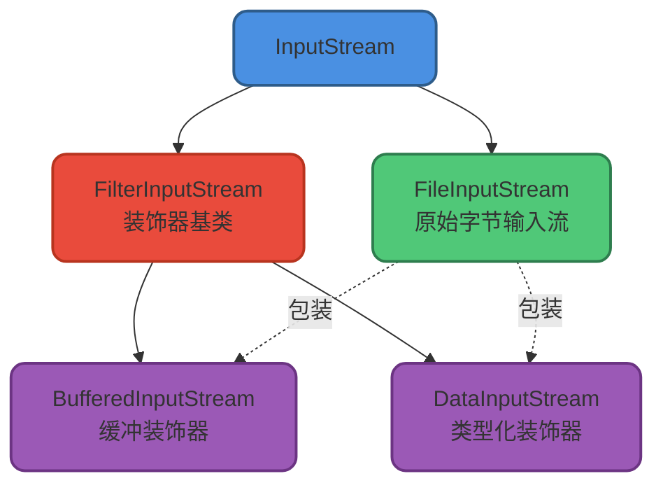
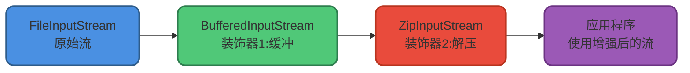
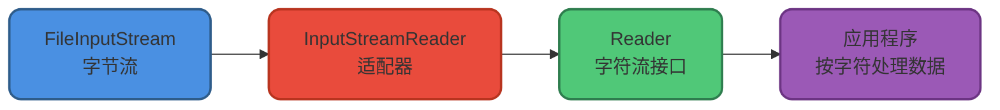
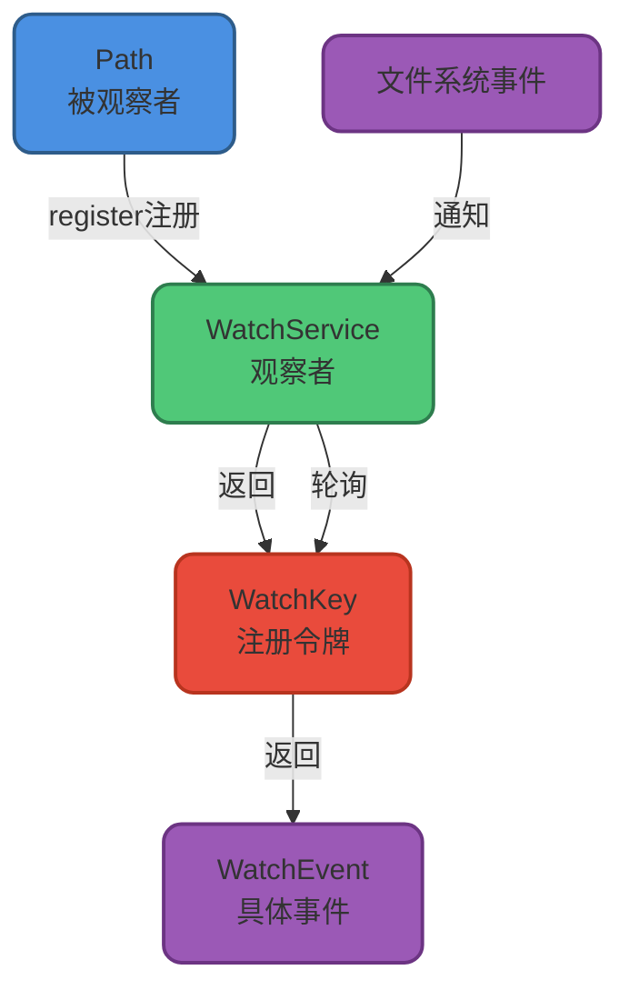

# Java IO设计模式详解

## 概述

Java IO类库是学习设计模式的绝佳范例。通过分析IO框架的设计,我们可以深入理解装饰器、适配器、工厂和观察者等经典设计模式在实际项目中的应用。

## 装饰器模式

### 核心概念

**装饰器模式(Decorator Pattern)** 能够在不修改原有对象的前提下动态扩展其功能。相比继承,装饰器模式通过组合的方式实现功能增强,在处理复杂继承关系时更加灵活。

IO流体系中的类继承关系相当复杂,如果为每种流的每种功能组合都创建一个子类,将会导致类爆炸。装饰器模式完美解决了这个问题。

### 字节流中的装饰器

对于字节流,`FilterInputStream`和`FilterOutputStream`是装饰器模式的核心基类:

- `FilterInputStream`: 装饰`InputStream`及其子类
- `FilterOutputStream`: 装饰`OutputStream`及其子类

常见的装饰器实现包括:

- `BufferedInputStream`/`BufferedOutputStream`: 添加缓冲功能
- `DataInputStream`/`DataOutputStream`: 添加读写基本类型数据的能力
- `ObjectInputStream`/`ObjectOutputStream`: 添加序列化/反序列化能力



让我们看一个实际例子,用`BufferedInputStream`装饰`FileInputStream`:

```java
public class LogAnalyzer {
    public void analyzeAccessLog(String logPath) {
        // 使用BufferedInputStream装饰FileInputStream,添加缓冲功能
        try (BufferedInputStream bis = new BufferedInputStream(
                new FileInputStream(logPath))) {
            int data;
            long skipBytes = bis.skip(128); // 跳过文件头
            while ((data = bis.read()) != -1) {
                // 高效读取日志内容
                processLogByte(data);
            }
        } catch (IOException e) {
            e.printStackTrace();
        }
    }
    
    private void processLogByte(int data) {
        // 处理日志字节
    }
}
```

查看`BufferedInputStream`的构造方法,可以清楚看到装饰器模式的实现:

```java
public class BufferedInputStream extends FilterInputStream {
    // 构造方法接收一个InputStream对象
    public BufferedInputStream(InputStream in) {
        this(in, DEFAULT_BUFFER_SIZE);
    }

    public BufferedInputStream(InputStream in, int size) {
        super(in);  // 调用父类FilterInputStream的构造方法
        if (size <= 0) {
            throw new IllegalArgumentException("Buffer size <= 0");
        }
        buf = new byte[size];  // 创建缓冲区数组
    }
}
```

### 为什么不使用继承?

有人可能会问:为什么不直接创建一个`BufferedFileInputStream`类?

```java
// 不推荐的设计
BufferedFileInputStream bfis = new BufferedFileInputStream("access.log");
```

原因在于`InputStream`的子类非常多,如果为每个子类都创建对应的缓冲版本,会导致类数量爆炸。装饰器模式通过组合实现复用,只需一个`BufferedInputStream`就能装饰所有的`InputStream`子类。

### 装饰器的嵌套使用

装饰器模式的一个重要特性是**支持多层装饰**。我们可以用多个装饰器嵌套包装原始对象,每个装饰器负责一种功能增强。

例如,需要处理压缩文件时:

```java
public class CompressedFileHandler {
    public void readCompressedConfig(String zipFile) throws IOException {
        // FileInputStream -> BufferedInputStream -> ZipInputStream
        // 三层装饰:文件读取 -> 缓冲 -> 解压缩
        try (BufferedInputStream bis = new BufferedInputStream(
                new FileInputStream(zipFile));
             ZipInputStream zis = new ZipInputStream(bis)) {
            
            ZipEntry entry;
            while ((entry = zis.getNextEntry()) != null) {
                System.out.println("处理文件: " + entry.getName());
                byte[] buffer = new byte[1024];
                int len;
                while ((len = zis.read(buffer)) != -1) {
                    // 处理解压后的数据
                }
            }
        }
    }
}
```

同样,写入压缩文件:

```java
public class CompressedFileWriter {
    public void writeCompressedData(String zipFile, Map<String, byte[]> files) 
            throws IOException {
        // FileOutputStream -> BufferedOutputStream -> ZipOutputStream
        try (BufferedOutputStream bos = new BufferedOutputStream(
                new FileOutputStream(zipFile));
             ZipOutputStream zos = new ZipOutputStream(bos)) {
            
            for (Map.Entry<String, byte[]> file : files.entrySet()) {
                zos.putNextEntry(new ZipEntry(file.getKey()));
                zos.write(file.getValue());
                zos.closeEntry();
            }
        }
    }
}
```

`ZipInputStream`和`ZipOutputStream`的继承关系:

```java
public class InflaterInputStream extends FilterInputStream {
    // 提供解压缩基础功能
}

public class ZipInputStream extends InflaterInputStream {
    // 专门处理ZIP格式
}

public class DeflaterOutputStream extends FilterOutputStream {
    // 提供压缩基础功能
}

public class ZipOutputStream extends DeflaterOutputStream {
    // 专门处理ZIP格式
}
```

这种设计完美体现了装饰器模式的关键特征:

1. **装饰器和被装饰对象继承相同的抽象类或实现相同的接口**(都继承自`InputStream`/`OutputStream`)
2. **装饰器持有被装饰对象的引用**(通过构造方法传入)
3. **支持多层装饰器嵌套使用**



### 字符流中的装饰器

字符流同样广泛应用了装饰器模式。`BufferedReader`装饰`Reader`,`BufferedWriter`装饰`Writer`:

```java
public class ConfigurationManager {
    public List<String> loadConfig(String configPath) throws IOException {
        List<String> configs = new ArrayList<>();
        
        // 使用装饰器模式:OutputStreamWriter -> BufferedWriter
        try (BufferedWriter bw = new BufferedWriter(
                new OutputStreamWriter(
                    new FileOutputStream(configPath), "UTF-8"))) {
            bw.write("# Application Configuration\n");
            bw.write("app.name=UserService\n");
            bw.write("app.port=8080\n");
        }
        
        // 使用装饰器模式:InputStreamReader -> BufferedReader
        try (BufferedReader br = new BufferedReader(
                new InputStreamReader(
                    new FileInputStream(configPath), "UTF-8"))) {
            String line;
            while ((line = br.readLine()) != null) {
                if (!line.startsWith("#")) {
                    configs.add(line);
                }
            }
        }
        
        return configs;
    }
}
```

## 适配器模式

### 核心概念

**适配器模式(Adapter Pattern)**用于让接口不兼容的类协同工作。在日常生活中,电源适配器就是典型的例子:不同国家的插座标准不同,适配器可以让我们在任何国家使用自己的电子设备。

IO框架中,字节流和字符流的接口完全不同,无法直接协同工作。适配器模式解决了这个问题。

### 字节流到字符流的适配

`InputStreamReader`和`OutputStreamWriter`是字节流到字符流的适配器,它们是整个IO体系中字节流和字符流之间的桥梁。

```java
// InputStreamReader是适配器,FileInputStream是被适配者
InputStreamReader isr = new InputStreamReader(
    new FileInputStream("user-data.txt"), "UTF-8");

// BufferedReader进一步装饰InputStreamReader(装饰器模式)
BufferedReader reader = new BufferedReader(isr);
```



### 适配器的实现原理

查看`InputStreamReader`的源码:

```java
public class InputStreamReader extends Reader {
    // 用于解码的对象(将字节转换为字符)
    private final StreamDecoder sd;
    
    public InputStreamReader(InputStream in) {
        super(in);
        try {
            // 获取StreamDecoder对象进行字节到字符的转换
            sd = StreamDecoder.forInputStreamReader(in, this, (String)null);
        } catch (UnsupportedEncodingException e) {
            throw new Error(e);
        }
    }
    
    // 读取操作委托给StreamDecoder
    public int read() throws IOException {
        return sd.read();
    }
}
```

`OutputStreamWriter`的实现类似:

```java
public class OutputStreamWriter extends Writer {
    // 用于编码的对象(将字符转换为字节)
    private final StreamEncoder se;
    
    public OutputStreamWriter(OutputStream out) {
        super(out);
        try {
            // 获取StreamEncoder对象进行字符到字节的转换
            se = StreamEncoder.forOutputStreamWriter(out, this, (String)null);
        } catch (UnsupportedEncodingException e) {
            throw new Error(e);
        }
    }
    
    // 写入操作委托给StreamEncoder
    public void write(int c) throws IOException {
        se.write(c);
    }
}
```

适配器内部的`StreamDecoder`和`StreamEncoder`负责实际的编解码工作:

```java
class StreamDecoder extends Reader {
    private FileChannel ch;  // 文件通道
    
    StreamDecoder(InputStream in, Object lock, CharsetDecoder dec) {
        // 从InputStream获取FileChannel对象
        this.ch = getChannel((FileInputStream)in);
        // 配置字符集解码器
        this.dec = dec;
    }
    
    public int read() throws IOException {
        // 通过FileChannel读取字节,然后解码为字符
        return decodeLoop();
    }
}
```

### 适配器模式 vs 装饰器模式

两种模式的区别:

| 特性 | 装饰器模式 | 适配器模式 |
|------|-----------|-----------|
| **目的** | 动态增强对象功能 | 让不兼容接口协同工作 |
| **接口关系** | 装饰器和被装饰对象实现相同接口 | 适配器和被适配对象接口不同 |
| **嵌套使用** | 支持多层装饰器嵌套 | 通常只有一层适配 |
| **使用场景** | 同一体系内的功能增强 | 不同体系间的接口转换 |

实际应用示例:

```java
public class LogFileProcessor {
    public void processUTF8Log(String logPath) throws IOException {
        // 适配器模式:FileInputStream(字节流) -> InputStreamReader(字符流)
        InputStreamReader isr = new InputStreamReader(
            new FileInputStream(logPath), "UTF-8");
        
        // 装饰器模式:InputStreamReader -> BufferedReader(添加缓冲和按行读取)
        BufferedReader reader = new BufferedReader(isr);
        
        String line;
        while ((line = reader.readLine()) != null) {
            System.out.println("日志: " + line);
        }
        reader.close();
    }
}
```

### 其他适配器应用

Java并发框架中也使用了适配器模式。`FutureTask`可以接收`Runnable`对象,内部通过`RunnableAdapter`将其适配为`Callable`:

```java
public class FutureTask<V> implements RunnableFuture<V> {
    private Callable<V> callable;
    
    // 接收Runnable参数的构造方法
    public FutureTask(Runnable runnable, V result) {
        // 使用适配器将Runnable转换为Callable
        this.callable = Executors.callable(runnable, result);
        this.state = NEW;
    }
}
```

`Executors.callable()`方法内部使用`RunnableAdapter`:

```java
public class Executors {
    // 适配器方法
    public static <T> Callable<T> callable(Runnable task, T result) {
        if (task == null)
            throw new NullPointerException();
        return new RunnableAdapter<T>(task, result);
    }
    
    // 适配器实现类
    static final class RunnableAdapter<T> implements Callable<T> {
        final Runnable task;
        final T result;
        
        RunnableAdapter(Runnable task, T result) {
            this.task = task;
            this.result = result;
        }
        
        public T call() {
            task.run();  // 调用Runnable的run方法
            return result;
        }
    }
}
```

## 工厂模式

工厂模式用于创建对象,NIO中大量使用了工厂模式。

### 静态工厂方法

`Files`类提供了静态工厂方法创建`InputStream`:

```java
public class ResourceLoader {
    public void loadResource(String resourcePath) throws IOException {
        // Files.newInputStream是静态工厂方法
        try (InputStream is = Files.newInputStream(Paths.get(resourcePath))) {
            byte[] data = is.readAllBytes();
            System.out.println("加载资源: " + resourcePath + 
                             ", 大小: " + data.length + " 字节");
        }
    }
}
```

`Paths`类使用静态工厂方法创建`Path`对象:

```java
public class PathManager {
    public void analyzePath(String pathStr) {
        // Paths.get是静态工厂方法
        Path path = Paths.get(pathStr);
        System.out.println("文件名: " + path.getFileName());
        System.out.println("父目录: " + path.getParent());
        System.out.println("绝对路径: " + path.toAbsolutePath());
    }
}
```

### 简单工厂

NIO内部实现中,`ZipFileSystem`使用简单工厂模式创建`Path`对象:

```java
// sun.nio.fs.ZipFileSystem (JDK内部实现)
public class ZipFileSystem extends FileSystem {
    // 简单工厂方法
    public Path getPath(String first, String... more) {
        if (more.length == 0) {
            return new ZipPath(this, first);
        }
        StringBuilder sb = new StringBuilder();
        sb.append(first);
        for (String segment : more) {
            if (segment.length() > 0) {
                if (sb.length() > 0)
                    sb.append('/');
                sb.append(segment);
            }
        }
        return new ZipPath(this, sb.toString());
    }
}
```

## 观察者模式

NIO的文件监控服务(`WatchService`)使用了观察者模式。

### 核心组件

- `WatchService`: 观察者,监控文件系统的变化
- `Watchable`: 被观察者接口,`Path`实现了此接口
- `WatchKey`: 注册令牌,用于获取文件变化事件



### 接口定义

`Watchable`接口定义了注册方法:

```java
public interface Path extends Comparable<Path>, Iterable<Path>, Watchable {
    // Path实现了Watchable接口
}

public interface Watchable {
    // 注册到WatchService,监听指定的事件类型
    WatchKey register(WatchService watcher,
                     WatchEvent.Kind<?>[] events,
                     WatchEvent.Modifier... modifiers) throws IOException;
}
```

### 实战示例:监控配置文件变化

```java
public class ConfigFileMonitor {
    public void monitorConfigDirectory(String dirPath) throws IOException {
        // 创建WatchService(观察者)
        WatchService watchService = FileSystems.getDefault().newWatchService();
        
        // 获取要监控的目录(被观察者)
        Path configDir = Paths.get(dirPath);
        
        // 注册监听事件:创建、删除、修改
        configDir.register(watchService,
            StandardWatchEventKinds.ENTRY_CREATE,
            StandardWatchEventKinds.ENTRY_DELETE,
            StandardWatchEventKinds.ENTRY_MODIFY);
        
        System.out.println("开始监控配置目录: " + dirPath);
        
        // 持续监听文件变化
        WatchKey key;
        while ((key = watchService.take()) != null) {
            for (WatchEvent<?> event : key.pollEvents()) {
                WatchEvent.Kind<?> kind = event.kind();
                Path filename = (Path) event.context();
                
                if (kind == StandardWatchEventKinds.ENTRY_CREATE) {
                    System.out.println("新建配置文件: " + filename);
                    reloadConfig(filename);
                } else if (kind == StandardWatchEventKinds.ENTRY_DELETE) {
                    System.out.println("删除配置文件: " + filename);
                    removeConfig(filename);
                } else if (kind == StandardWatchEventKinds.ENTRY_MODIFY) {
                    System.out.println("修改配置文件: " + filename);
                    reloadConfig(filename);
                }
            }
            // 重置WatchKey,继续监听
            key.reset();
        }
    }
    
    private void reloadConfig(Path filename) {
        System.out.println("  -> 重新加载配置: " + filename);
    }
    
    private void removeConfig(Path filename) {
        System.out.println("  -> 移除配置: " + filename);
    }
}
```

### 监听事件类型

支持监听三种标准事件:

- `StandardWatchEventKinds.ENTRY_CREATE`: 文件或目录创建
- `StandardWatchEventKinds.ENTRY_DELETE`: 文件或目录删除
- `StandardWatchEventKinds.ENTRY_MODIFY`: 文件或目录修改

可以同时监听多种事件:

```java
WatchKey key = path.register(watchService,
    StandardWatchEventKinds.ENTRY_CREATE,
    StandardWatchEventKinds.ENTRY_DELETE,
    StandardWatchEventKinds.ENTRY_MODIFY);
```

### 实现原理

`WatchService`内部使用守护线程定期轮询文件系统变化:

```java
class PollingWatchService extends AbstractWatchService {
    // 定义守护线程执行器
    private final ScheduledExecutorService scheduledExecutor;
    
    PollingWatchService() {
        scheduledExecutor = Executors.newSingleThreadScheduledExecutor(
            new ThreadFactory() {
                @Override
                public Thread newThread(Runnable r) {
                    Thread t = new Thread(r);
                    t.setDaemon(true);  // 设置为守护线程
                    return t;
                }
            });
    }
    
    void enable(Set<? extends WatchEvent.Kind<?>> events, long period) {
        synchronized (this) {
            // 更新监听的事件类型
            this.events = events;
            
            // 启动定期轮询任务
            Runnable pollTask = new Runnable() { 
                public void run() { 
                    poll();  // 轮询文件变化
                }
            };
            this.poller = scheduledExecutor.scheduleAtFixedRate(
                pollTask, period, period, TimeUnit.SECONDS);
        }
    }
}
```

## 总结

Java IO框架是学习设计模式的绝佳教材,通过分析IO的设计,我们深入理解了:

1. **装饰器模式**: 通过组合而非继承扩展功能,支持多层嵌套装饰
2. **适配器模式**: 让字节流和字符流这两个不兼容的体系协同工作
3. **工厂模式**: 使用静态工厂和简单工厂创建IO对象
4. **观察者模式**: 通过WatchService实现文件系统事件监控

这些设计模式不仅存在于IO框架中,在整个Java生态系统中都有广泛应用。理解这些模式,能帮助我们写出更优雅、更易维护的代码。
