# IO模型与并发处理策略

## 同步、异步、阻塞、非阻塞的区别

这四个概念经常被混淆,我们用最清晰的方式来理解它们。

### 核心概念

**同步与异步描述的是被调用者的行为。**

假设A调用B:

- **同步**: B接到A的调用后,立即执行任务,A本次调用可以得到结果
- **异步**: B接到A的调用后,不保证立即执行,但保证会去做。B执行完后会通知A,A本次调用得不到结果

**阻塞与非阻塞描述的是调用者的行为。**

假设A调用B:

- **阻塞**: A发出调用后,一直等待,直到B返回结果
- **非阻塞**: A发出调用后,不需要等待,可以去做自己的事情

**重要**: 同步不一定阻塞,异步也不一定非阻塞,两者之间没有必然关系。

### 烧水实例

用老张烧水的例子来说明四种组合:

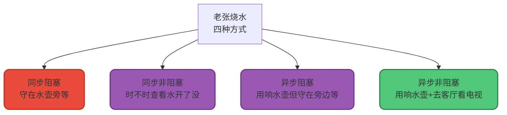

#### 1. 同步阻塞

老张把水壶放到火上,一直在水壶旁等着水开。

- **同步**: 水壶烧开了就完事儿,不会主动通知
- **阻塞**: 老张一直等着,什么也不干

#### 2. 同步非阻塞

老张把水壶放到火上,去客厅看电视,每隔几分钟回厨房看看水开没开。

- **同步**: 水壶烧开了就完事儿,不会主动通知
- **非阻塞**: 老张不需要一直等待,利用间隙看电视

#### 3. 异步阻塞

老张用响水壶(会主动发出声音通知),但仍然站在水壶旁等着。

- **异步**: 响水壶会主动通知
- **阻塞**: 老张还是傻傻地站在旁边等

**注意**: 这种方式没有发挥异步的优势!

#### 4. 异步非阻塞

老张用响水壶,放到火上后去客厅看电视,听到响声再去拿水壶。

- **异步**: 响水壶会主动通知
- **非阻塞**: 老张不需要等待,可以做其他事

**最优方式**: 充分利用了异步通知和非阻塞的优势!

### 关键区别

**同步 vs 异步**:

- 同步(1和2): 老张需要主动查看水开了没
- 异步(3和4): 水壶会主动通知老张

**阻塞 vs 非阻塞**:

- 阻塞(1和3): 老张等待期间什么也不干
- 非阻塞(2和4): 老张利用等待时间做其他事

## 操作系统五种IO模型深度解析

为了更好地理解IO模型,我们先了解一些前置知识。

### 用户空间与内核空间

为了保证操作系统的安全性,内存被划分为**用户空间(User Space)**和**内核空间(Kernel Space)**。

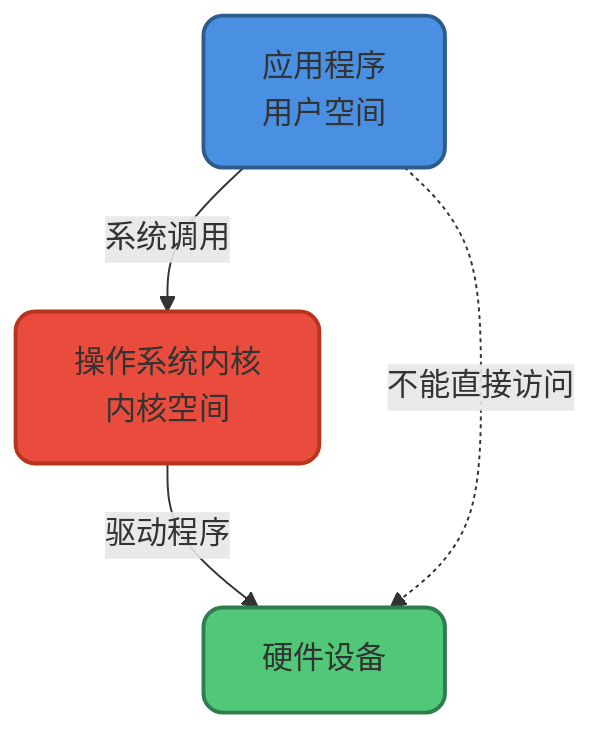

- **用户空间**: 运行应用程序,权限受限
- **内核空间**: 运行操作系统内核,可以直接操作硬件

用户程序想要操作硬件(如读取文件、发送网络数据),必须通过**系统调用(System Call)**请求内核代为执行。

### 缓存IO与Page Cache

为了提升性能,操作系统会在内核空间维护一个**Page Cache(页缓存)**:

1. 读取文件时,先从Page Cache查找,命中则直接返回
2. 如果未命中,从磁盘读取数据到Page Cache,再拷贝到用户空间
3. 写入文件时,先写入Page Cache,由操作系统异步刷新到磁盘

这种方式也叫**缓存IO(Buffered IO)**。

### 服务器接收网络数据的过程

服务器收到客户端请求,处理数据的完整流程:

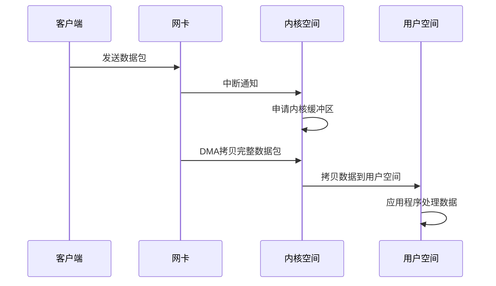

关键步骤:

1. 网卡接收数据,向内核申请缓冲区
2. 等待完整的数据包到达(可能分多次传输,产生延时)
3. 数据从内核空间拷贝到用户空间
4. 用户程序处理数据

### 文件读取的过程

应用程序读取文件的流程:

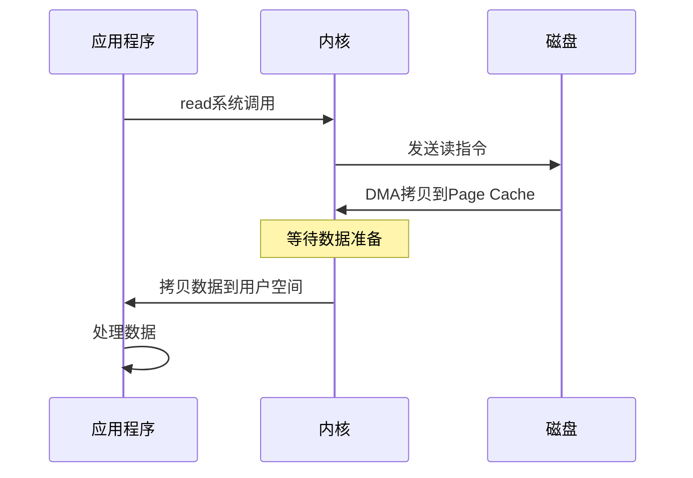

关键阶段:

1. **等待数据准备**: 内核向硬件发送读指令,等待数据就绪
2. **数据拷贝**: 将数据从内核缓冲区拷贝到用户空间

不同的IO模型,这两个阶段的阻塞/非阻塞特性不同。

## 五种IO模型详解

### 1. 同步阻塞IO模型

**从系统调用到数据拷贝完成,进程全程阻塞。**

**银行办理业务类比**: 小明去柜台办理业务,取号排队后,一直站在柜台前等待,直到业务办理完成才离开。

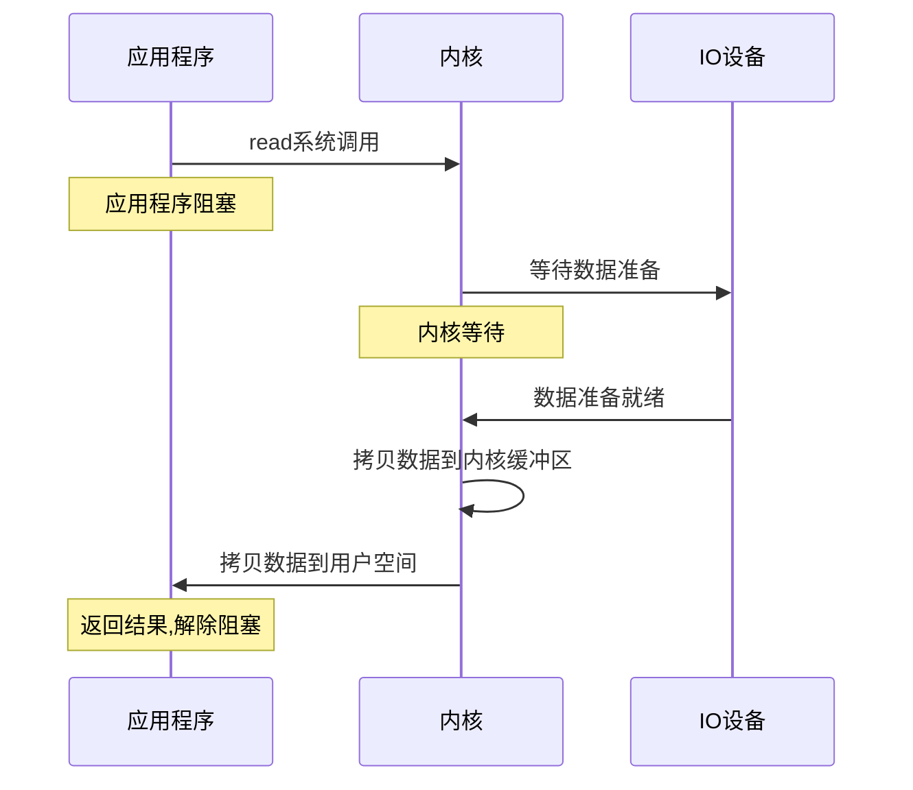

**特点**:

- 简单直观,编程容易
- 大量线程阻塞,资源浪费
- 适合连接数少的场景

### 2. 同步非阻塞IO模型

**应用程序不断轮询检查数据是否就绪,数据拷贝阶段仍然阻塞。**

**银行办理业务类比**: 小明取号后不在柜台等待,去附近逛街,每隔几分钟回来看一次,轮到后站在柜台前等业务办完。

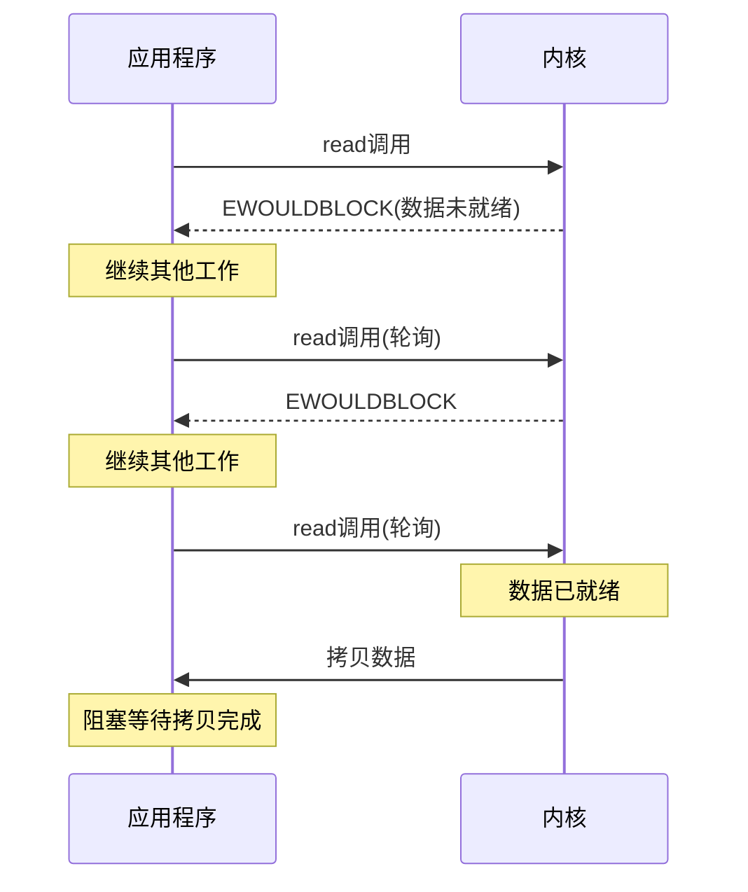

**特点**:

- 利用轮询间隙可以处理其他任务
- 频繁系统调用浪费CPU资源
- 适合需要及时响应的场景

### 3. IO多路复用模型

**使用select/poll/epoll监控多个IO,当某个就绪时才发起read调用。**

**银行办理业务类比**: 小明请大堂经理帮忙关注所有柜台,当有空闲柜台时通知他,可以安心逛街。

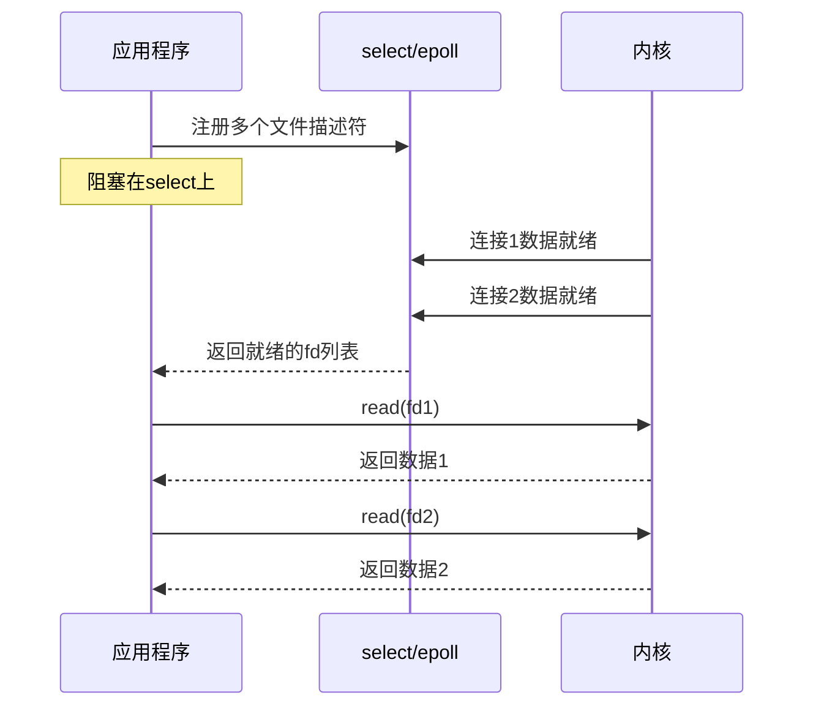

**特点**:

- 单线程可以管理大量连接
- 减少无效的系统调用
- 适合高并发服务器(Nginx、Redis)

**select vs poll vs epoll**:

| 机制 | 最大连接数 | fd拷贝方式 | 效率 |
|------|-----------|-----------|------|
| select | 1024(可改) | 用户态→内核态 | O(n)轮询 |
| poll | 无限制 | 用户态→内核态 | O(n)轮询 |
| epoll | 无限制 | 内核事件表 | O(1)事件驱动 |

### 4. 信号驱动IO模型

**注册信号处理函数,数据准备好时,内核发送信号通知。**

**银行办理业务类比**: 小明是VVIP客户,告诉大堂经理准备好时打电话通知他,然后安心逛街,接到电话后赶回办理业务。

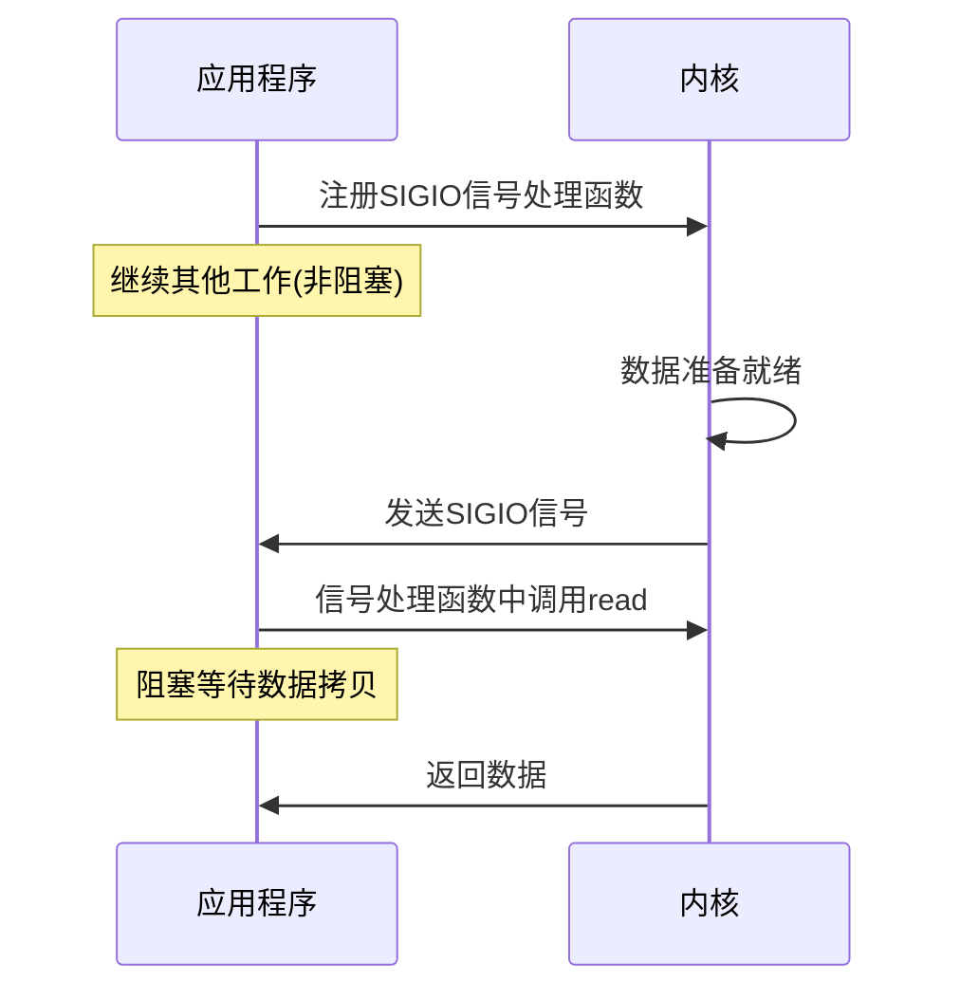

**特点**:

- 等待数据阶段非阻塞
- 数据拷贝阶段仍然阻塞
- 适合实时性要求高的场景

### 5. 异步IO模型

**整个IO操作由内核完成,完成后通知应用程序。**

**银行办理业务类比**: 小明请银行专属客户经理全权代办,该干嘛干嘛,业务办完后客户经理直接把结果送到手上。

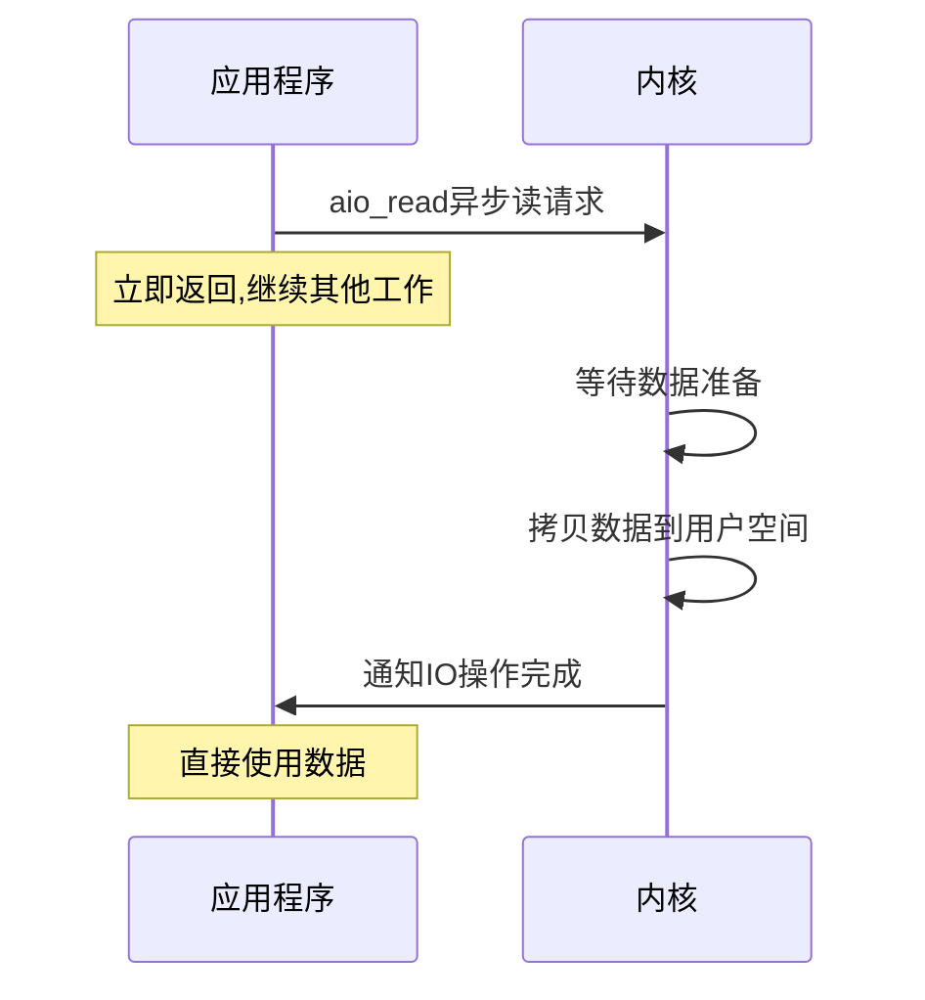

**特点**:

- 全程非阻塞,真正的异步
- 由内核负责数据准备和拷贝
- 适合高性能IO密集型应用

### 五种模型对比总结

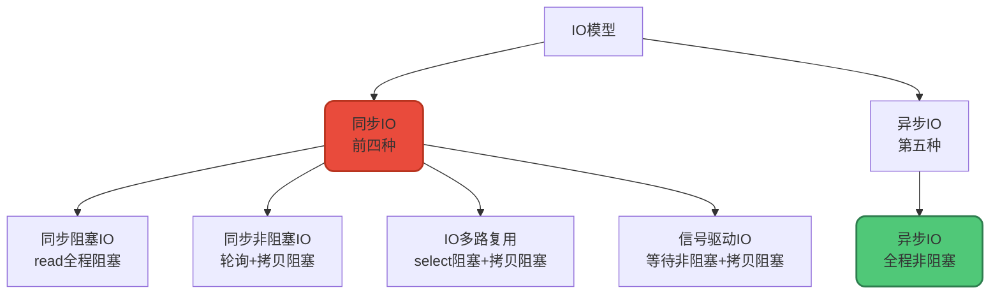

| IO模型 | 等待数据 | 数据拷贝 | 典型应用 |
|--------|---------|---------|----------|
| 同步阻塞IO | 阻塞 | 阻塞 | 早期Web服务器 |
| 同步非阻塞IO | 非阻塞(轮询) | 阻塞 | 游戏服务器 |
| IO多路复用 | 阻塞(select) | 阻塞 | Nginx/Redis/Netty |
| 信号驱动IO | 非阻塞 | 阻塞 | 实时数据处理 |
| 异步IO | 非阻塞 | 非阻塞 | Windows IOCP |

**核心差异**: 前四种都是同步IO,因为数据拷贝阶段应用程序需要等待。只有异步IO是真正的异步,全程无需等待。

## IO多路复用 vs 多线程

IO多路复用和多线程是两种不同的并发处理技术,解决的问题不同。

### 核心区别

**IO多路复用**: 提升IO操作的效率和利用率,适合IO密集型应用  
**多线程**: 提升CPU利用率,适合CPU密集型应用

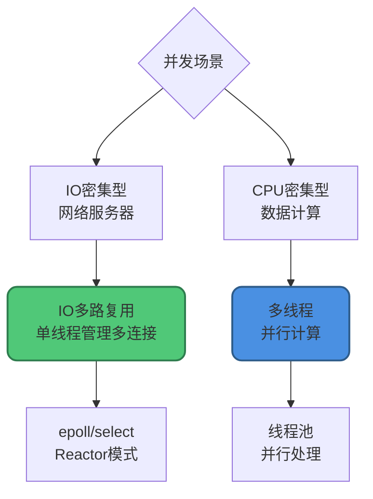

### IO多路复用

**传统阻塞式IO问题**:

在阻塞式IO中,应用程序执行read操作时,如果数据未准备好,线程会被阻塞,无法处理其他任务。

```java
// BIO: 每个连接需要一个线程
ServerSocket server = new ServerSocket(8080);
while (true) {
    Socket client = server.accept();  // 阻塞等待连接
    new Thread(() -> {
        InputStream is = client.getInputStream();
        is.read(buffer);  // 阻塞等待数据
    }).start();
}
```

**IO多路复用解决方案**:

使用select、poll或epoll等系统调用,线程可以同时监控多个IO流的状态,只有数据真正准备好时才处理。

```java
// NIO: 单线程处理多个连接
Selector selector = Selector.open();
serverChannel.register(selector, SelectionKey.OP_ACCEPT);

while (true) {
    selector.select();  // 阻塞,但可以同时监控多个连接
    Set<SelectionKey> keys = selector.selectedKeys();
    for (SelectionKey key : keys) {
        if (key.isReadable()) {
            // 数据已就绪,立即处理
        }
    }
}
```

**优点**:

- 单线程处理大量连接,减少线程创建和上下文切换开销
- 只在数据真正就绪时处理,不浪费CPU

**适用场景**:

- 高并发网络服务器
- 聊天室、推送服务
- 需要处理大量并发连接的应用

**局限性**:

- 不能充分利用多核CPU
- 处理长时间计算任务时会阻塞IO

### 多线程

**目标**: 充分利用多核CPU,并行执行多个任务。

```java
ExecutorService executor = Executors.newFixedThreadPool(10);

for (Task task : tasks) {
    executor.submit(() -> {
        // 执行计算密集型任务
        processData(task);
    });
}
```

**优点**:

- 充分利用多核CPU
- 适合CPU密集型任务
- 提高计算吞吐量

**缺点**:

- 线程上下文切换开销
- 资源共享需要处理同步问题
- 可能导致死锁、竞态条件

**适用场景**:

- 数据分析、图像处理
- 需要大量计算的任务
- 并行算法

### 如何选择

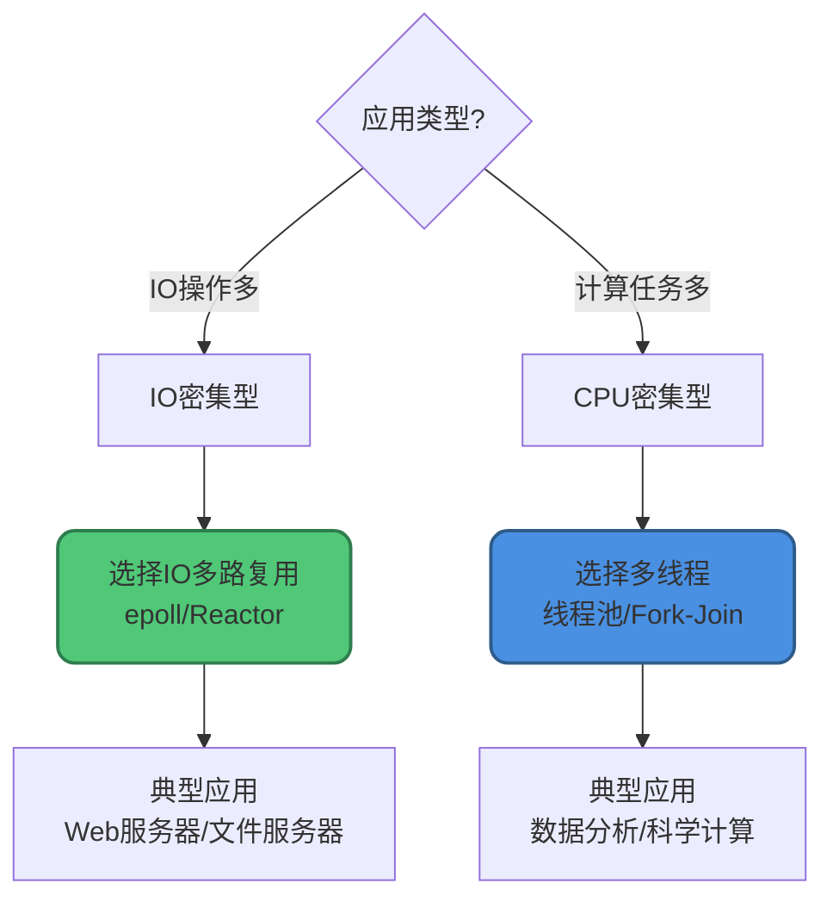

选择建议:

- **IO密集型**: 使用IO多路复用,如Web服务器、文件服务器
- **CPU密集型**: 使用多线程,如数据分析、图像处理
- **混合型**: 结合使用,用IO多路复用管理连接,用线程池处理计算

### 最佳实践:两者结合

现代高性能服务器通常结合使用这两种技术:

```java
// Reactor + 线程池模式
public class HybridServer {
    private Selector selector;
    private ExecutorService workers;
    
    public void start() throws IOException {
        selector = Selector.open();
        workers = Executors.newFixedThreadPool(
            Runtime.getRuntime().availableProcessors()
        );
        
        while (true) {
            selector.select();
            Set<SelectionKey> keys = selector.selectedKeys();
            
            for (SelectionKey key : keys) {
                if (key.isReadable()) {
                    SocketChannel channel = (SocketChannel) key.channel();
                    ByteBuffer buffer = ByteBuffer.allocate(1024);
                    channel.read(buffer);
                    
                    // IO多路复用接收数据
                    // 多线程处理业务逻辑
                    workers.submit(() -> {
                        processRequest(buffer);
                    });
                }
            }
        }
    }
    
    private void processRequest(ByteBuffer buffer) {
        // CPU密集型业务处理
    }
}
```

**优势**:

- IO多路复用高效管理网络连接
- 多线程并行处理业务逻辑
- 充分利用多核CPU,同时保持高并发能力

## 总结

本文深入讲解了IO模型和并发处理的核心知识:

### 同步异步、阻塞非阻塞

- **同步/异步**: 描述被调用者的行为(是否主动通知)
- **阻塞/非阻塞**: 描述调用者的行为(是否等待)
- 四者可以任意组合,没有必然关系

### 五种IO模型

1. **同步阻塞IO**: 最简单,但性能最差
2. **同步非阻塞IO**: 轮询检查,浪费CPU
3. **IO多路复用**: 单线程管理多连接,高并发首选
4. **信号驱动IO**: 数据就绪时通知,但拷贝仍阻塞
5. **异步IO**: 真正的异步,全程非阻塞

### IO多路复用 vs 多线程

- **IO多路复用**: 解决IO等待问题,适合IO密集型(网络服务器)
- **多线程**: 解决CPU利用问题,适合CPU密集型(数据计算)
- **最佳实践**: 两者结合,用IO多路复用管理连接,用线程池处理业务

理解这些概念和模型,能帮助我们在不同场景下选择最合适的并发处理策略,设计出高性能的应用系统。
