# BIO、NIO与AIO核心原理

## IO概念详解

### 什么是IO?

IO(Input/Output)即输入/输出,是计算机系统与外部世界交互的基础。

**从计算机结构角度理解IO:**

根据冯·诺依曼体系结构,计算机由五大部分组成:运算器、控制器、存储器、输入设备、输出设备。

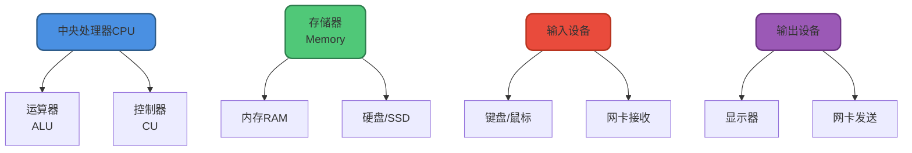

输入设备(如键盘、网卡)向计算机输入数据,输出设备(如显示器、网卡)接收计算机输出的数据。**从计算机结构视角看,IO描述了计算机系统与外部设备之间的通信过程。**

**从应用程序角度理解IO:**

操作系统为了安全和稳定性,将进程的地址空间划分为**用户空间(User Space)**和**内核空间(Kernel Space)**。

- 用户空间:运行应用程序代码,权限受限
- 内核空间:运行操作系统内核代码,拥有访问硬件的特权

应用程序无法直接访问硬件设备,必须通过**系统调用(System Call)**请求内核代间完成IO操作。

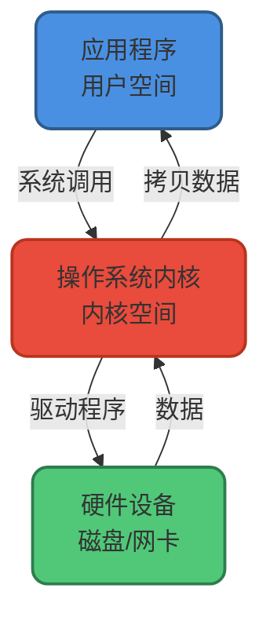

**从应用程序视角看,IO是应用程序对内核发起调用,由内核执行具体IO操作的过程。**

我们在开发中最常接触的是**磁盘IO(文件读写)**和**网络IO(网络通信)**。

### IO操作的两个阶段

当应用程序发起IO调用后,会经历两个关键阶段:

1. **等待数据准备**(Waiting for Data): 内核等待IO设备准备好数据
2. **数据拷贝**(Copying Data): 内核将数据从内核空间拷贝到用户空间

不同的IO模型,这两个阶段的阻塞/非阻塞特性不同。

## 操作系统的五种IO模型

UNIX系统定义了5种IO模型:

1. **同步阻塞IO** (Blocking IO)
2. **同步非阻塞IO** (Non-blocking IO)
3. **IO多路复用** (IO Multiplexing)
4. **信号驱动IO** (Signal Driven IO)
5. **异步IO** (Asynchronous IO)

### 同步阻塞IO模型

**从系统调用到数据拷贝完成,进程全程阻塞等待。**

场景类比:小王去银行办理业务,取号排队后,一直在柜台前等待,直到业务办理完成才离开。

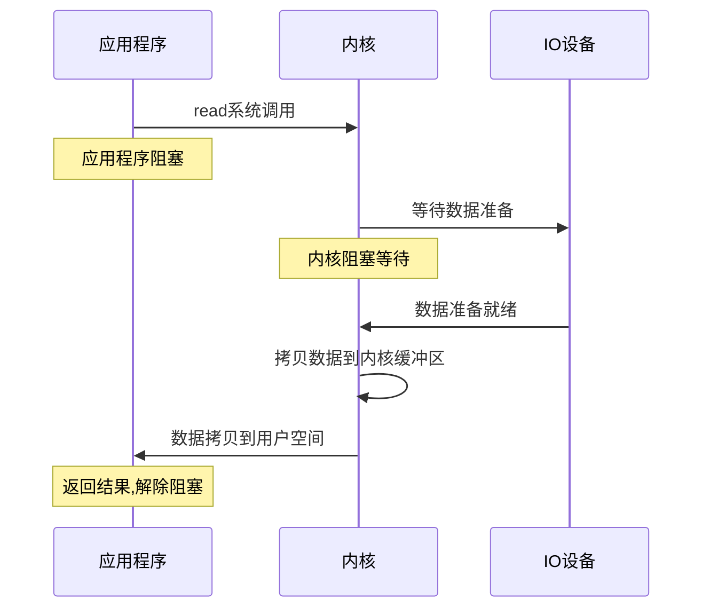

### 同步非阻塞IO模型

**应用程序不断轮询检查数据是否准备好,数据拷贝阶段仍然阻塞。**

场景类比:小王去银行办理业务,取号后不在柜台前等待,而是去附近逛街,每隔几分钟回来看一次是否轮到自己,轮到后站在柜台前等待业务办完。

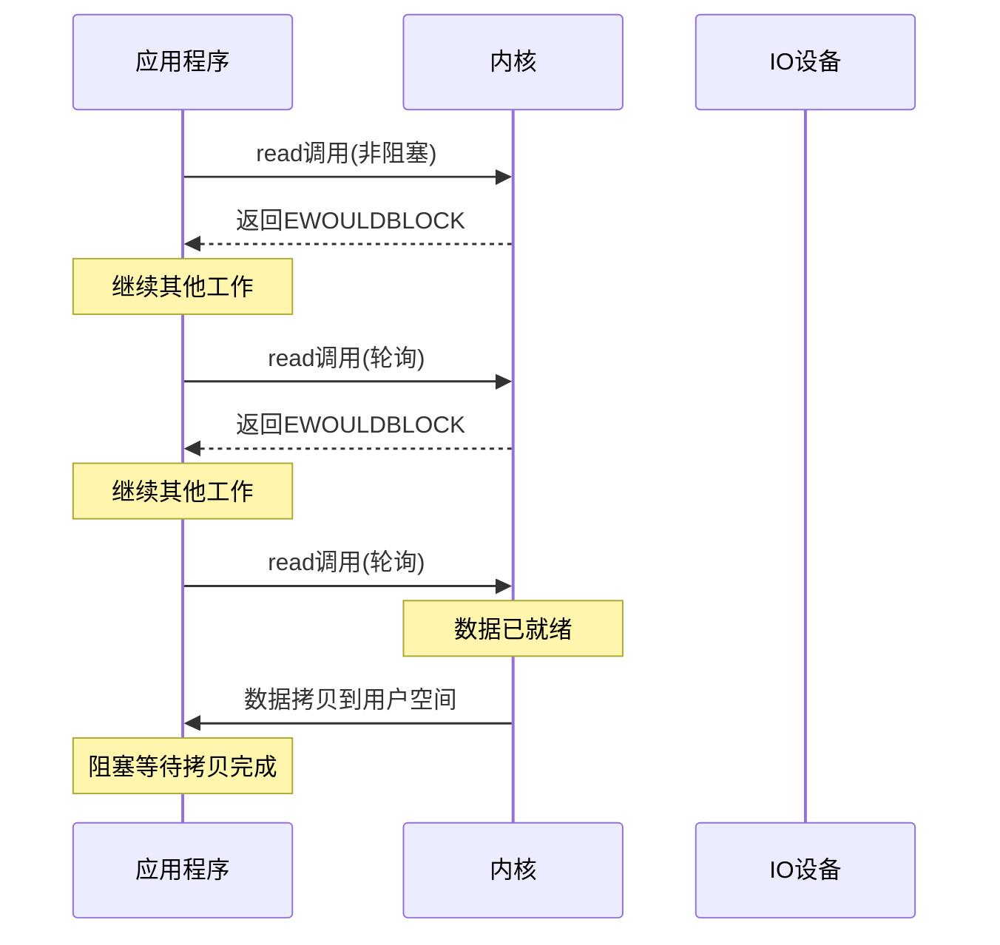

**优点**: 利用轮询间隙可以处理其他任务  
**缺点**: 频繁的系统调用浪费CPU资源

### IO多路复用模型

**使用select/poll/epoll等机制,一个线程可以监控多个IO连接,当某个连接数据就绪时才发起read调用。**

场景类比:小王请银行大堂经理帮忙关注所有柜台,当有空闲柜台时通知他。小王可以安心逛街,接到通知后再去办理业务。

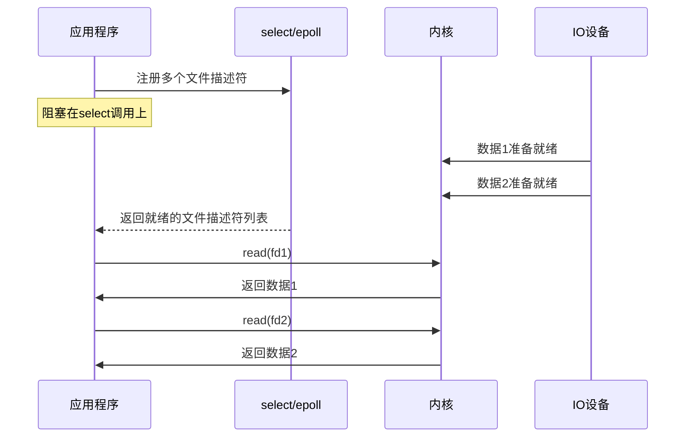

**优点**: 单线程可以处理多个并发连接,减少线程开销  
**核心思想**: 通过select/poll/epoll减少无效的系统调用

### 信号驱动IO模型

**应用程序注册信号处理函数,当数据准备好时,内核发送信号通知应用程序。**

场景类比:小王是银行VVIP客户,告诉大堂经理当柜台准备好时打电话通知他,然后安心逛街。接到电话后赶回银行办理业务。

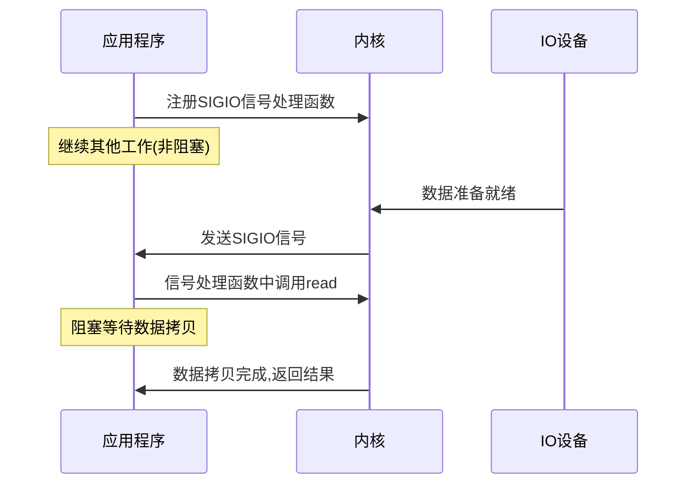

**特点**: 等待数据阶段非阻塞,数据拷贝阶段阻塞

### 异步IO模型

**整个IO操作都由内核完成,完成后通知应用程序。**

场景类比:小王请银行的专属客户经理全权代办业务,自己该干嘛干嘛,业务办完后客户经理直接把结果送到他手上。

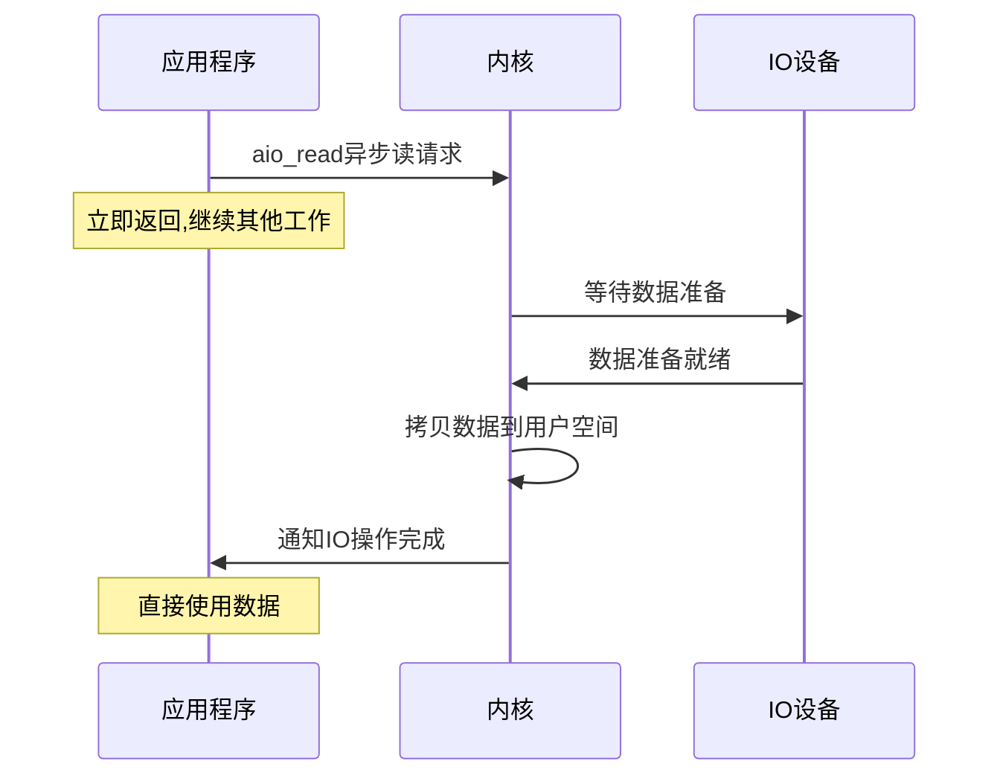

**特点**: 全程非阻塞,由内核负责数据准备和拷贝

### 五种模型对比总结

| IO模型 | 等待数据阶段 | 数据拷贝阶段 | 典型场景 |
|--------|------------|------------|---------|
| 同步阻塞IO | 阻塞 | 阻塞 | 连接数少的简单应用 |
| 同步非阻塞IO | 非阻塞(轮询) | 阻塞 | 需要及时响应的场景 |
| IO多路复用 | 阻塞(select) | 阻塞 | 高并发服务器(Nginx/Redis) |
| 信号驱动IO | 非阻塞 | 阻塞 | 实时性要求高的场景 |
| 异步IO | 非阻塞 | 非阻塞 | 高性能IO密集型应用 |

**前四种都是同步IO**,因为数据拷贝阶段应用程序都需要等待。只有异步IO是真正的异步,全程无需等待。

## Java中的三种IO模型

### BIO - 同步阻塞IO

BIO(Blocking IO)是Java最传统的IO模型,对应操作系统的**同步阻塞IO**。

#### 核心特点

- 每个连接分配一个独立线程处理
- 线程在read/write调用时会阻塞,直到IO操作完成
- 适合连接数少的场景

#### 工作原理

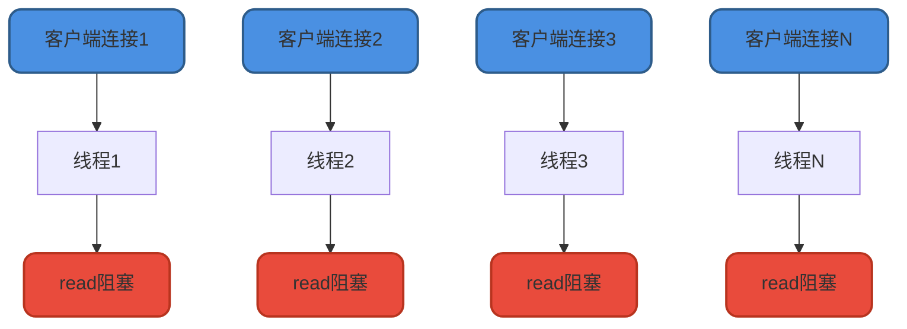

#### 代码示例

```java
public class BIOServer {
    public static void main(String[] args) throws IOException {
        ServerSocket serverSocket = new ServerSocket(8080);
        System.out.println("服务器启动在端口 8080");
        
        while (true) {
            // accept()阻塞,直到有客户端连接
            Socket socket = serverSocket.accept();
            System.out.println("新客户端连接: " + socket.getRemoteSocketAddress());
            
            // 为每个连接创建新线程处理
            new Thread(() -> {
                try {
                    InputStream is = socket.getInputStream();
                    byte[] buffer = new byte[1024];
                    int len;
                    // read()阻塞,直到读取到数据
                    while ((len = is.read(buffer)) != -1) {
                        String message = new String(buffer, 0, len);
                        System.out.println("收到消息: " + message);
                        
                        // 回复客户端
                        OutputStream os = socket.getOutputStream();
                        os.write(("服务器收到: " + message).getBytes());
                    }
                } catch (IOException e) {
                    e.printStackTrace();
                }
            }).start();
        }
    }
}
```

#### 性能瓶颈

面对万级并发连接时,BIO存在严重问题:

- **线程开销**: 每个连接一个线程,创建和切换开销巨大
- **内存消耗**: 每个线程占用1MB左右的栈空间,1万个连接需要约10GB内存
- **CPU浪费**: 大量线程阻塞在IO上,无法充分利用CPU

### NIO - 同步非阻塞IO

NIO(New IO / Non-blocking IO)在Java 1.4引入,对应操作系统的**IO多路复用模型**。

#### 核心特点

- 基于Channel(通道)和Buffer(缓冲区)
- 使用Selector(选择器)实现单线程管理多个连接
- 面向缓冲区,减少系统调用次数

#### 工作原理

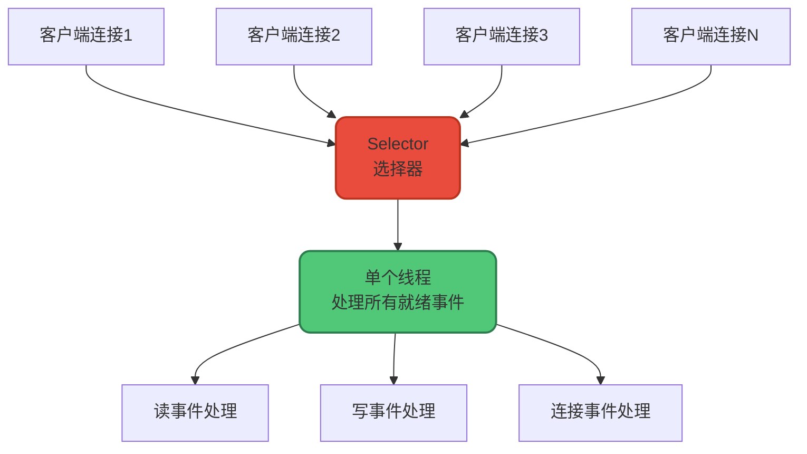

#### 核心组件

1. **Channel**(通道): 双向数据传输通道
   - `FileChannel`: 文件IO
   - `SocketChannel`: TCP客户端
   - `ServerSocketChannel`: TCP服务端
   - `DatagramChannel`: UDP通信

2. **Buffer**(缓冲区): 数据容器
   - `ByteBuffer`: 字节缓冲
   - `CharBuffer`: 字符缓冲
   - `IntBuffer`: 整型缓冲
   - ...

3. **Selector**(选择器): 多路复用器
   - 监听`OP_ACCEPT`: 接收连接事件
   - 监听`OP_CONNECT`: 连接就绪事件
   - 监听`OP_READ`: 读就绪事件
   - 监听`OP_WRITE`: 写就绪事件

#### 代码示例

```java
public class NIOServer {
    public static void main(String[] args) throws IOException {
        // 创建选择器
        Selector selector = Selector.open();
        
        // 创建ServerSocketChannel
        ServerSocketChannel serverChannel = ServerSocketChannel.open();
        serverChannel.bind(new InetSocketAddress(8080));
        serverChannel.configureBlocking(false); // 设置非阻塞模式
        
        // 注册到选择器,监听连接事件
        serverChannel.register(selector, SelectionKey.OP_ACCEPT);
        System.out.println("NIO服务器启动在端口 8080");
        
        while (true) {
            // 阻塞,直到有事件就绪
            selector.select();
            
            // 遍历所有就绪的事件
            Iterator<SelectionKey> iterator = selector.selectedKeys().iterator();
            while (iterator.hasNext()) {
                SelectionKey key = iterator.next();
                iterator.remove();
                
                if (key.isAcceptable()) {
                    // 处理连接事件
                    ServerSocketChannel server = (ServerSocketChannel) key.channel();
                    SocketChannel client = server.accept();
                    client.configureBlocking(false);
                    client.register(selector, SelectionKey.OP_READ);
                    System.out.println("新客户端连接: " + client.getRemoteAddress());
                    
                } else if (key.isReadable()) {
                    // 处理读事件
                    SocketChannel client = (SocketChannel) key.channel();
                    ByteBuffer buffer = ByteBuffer.allocate(1024);
                    int len = client.read(buffer);
                    
                    if (len > 0) {
                        buffer.flip();
                        String message = new String(buffer.array(), 0, len);
                        System.out.println("收到消息: " + message);
                        
                        // 切换到写事件
                        client.register(selector, SelectionKey.OP_WRITE);
                    } else if (len == -1) {
                        client.close();
                    }
                    
                } else if (key.isWritable()) {
                    // 处理写事件
                    SocketChannel client = (SocketChannel) key.channel();
                    ByteBuffer buffer = ByteBuffer.wrap("服务器收到消息".getBytes());
                    client.write(buffer);
                    
                    // 切换回读事件
                    client.register(selector, SelectionKey.OP_READ);
                }
            }
        }
    }
}
```

#### 性能优势

- **减少线程**: 单线程处理数千个连接
- **降低内存**: 不需要为每个连接分配线程栈
- **提高吞吐**: 减少上下文切换,充分利用CPU

### AIO - 异步IO

AIO(Asynchronous IO)在Java 7引入,又称NIO 2.0,对应操作系统的**异步IO模型**。

#### 核心特点

- 基于事件和回调机制
- IO操作立即返回,操作系统负责完成IO
- 操作完成后通过回调函数通知应用程序

#### 工作原理

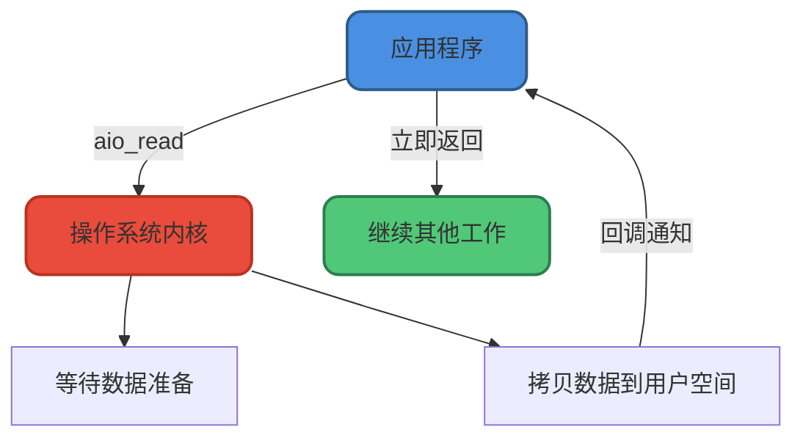

#### 代码示例

```java
public class AIOServer {
    public static void main(String[] args) throws Exception {
        // 创建异步ServerSocketChannel
        AsynchronousServerSocketChannel serverChannel = 
            AsynchronousServerSocketChannel.open()
                .bind(new InetSocketAddress(8080));
        
        System.out.println("AIO服务器启动在端口 8080");
        
        // 接收连接(异步操作)
        serverChannel.accept(null, new CompletionHandler<AsynchronousSocketChannel, Object>() {
            @Override
            public void completed(AsynchronousSocketChannel client, Object attachment) {
                // 继续接收下一个连接
                serverChannel.accept(null, this);
                
                // 处理当前连接
                System.out.println("新客户端连接");
                ByteBuffer buffer = ByteBuffer.allocate(1024);
                
                // 异步读取数据
                client.read(buffer, buffer, new CompletionHandler<Integer, ByteBuffer>() {
                    @Override
                    public void completed(Integer len, ByteBuffer buf) {
                        if (len > 0) {
                            buf.flip();
                            String message = new String(buf.array(), 0, len);
                            System.out.println("收到消息: " + message);
                            
                            // 异步写回数据
                            ByteBuffer response = ByteBuffer.wrap(("服务器收到: " + message).getBytes());
                            client.write(response, response, new CompletionHandler<Integer, ByteBuffer>() {
                                @Override
                                public void completed(Integer result, ByteBuffer attachment) {
                                    System.out.println("响应发送成功");
                                }
                                
                                @Override
                                public void failed(Throwable exc, ByteBuffer attachment) {
                                    exc.printStackTrace();
                                }
                            });
                        }
                    }
                    
                    @Override
                    public void failed(Throwable exc, ByteBuffer buf) {
                        exc.printStackTrace();
                    }
                });
            }
            
            @Override
            public void failed(Throwable exc, Object attachment) {
                exc.printStackTrace();
            }
        });
        
        // 阻止主线程退出
        Thread.sleep(Integer.MAX_VALUE);
    }
}
```

#### AIO的局限性

虽然AIO理论上性能最优,但在Java生态中应用并不广泛:

1. **Linux支持不完善**: Linux的AIO实现(epoll)性能提升不明显
2. **编程复杂度高**: 回调嵌套导致代码难以维护
3. **框架选择**: Netty曾尝试AIO,后来又放弃了

### 三种模型对比

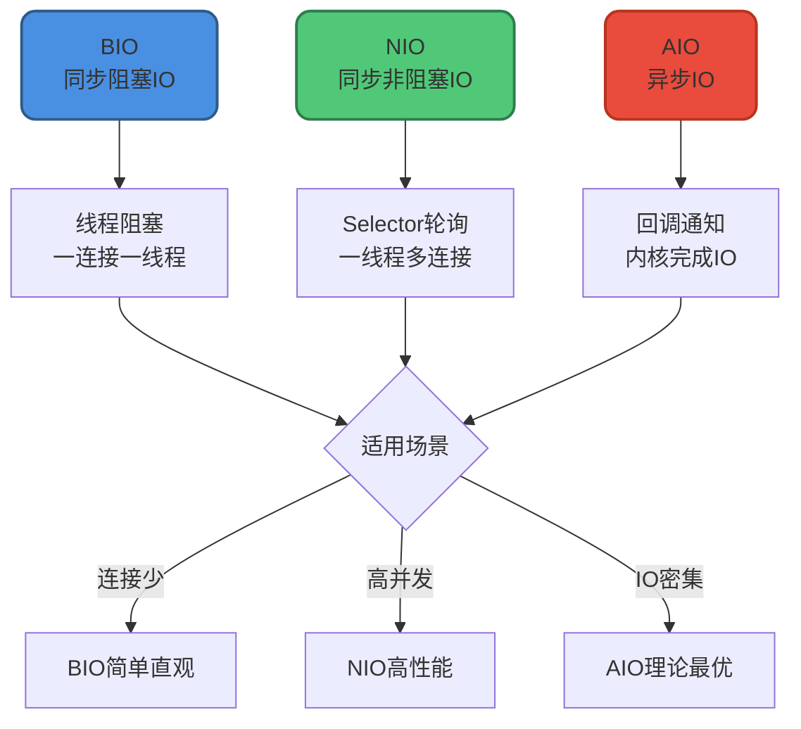

| 特性 | BIO | NIO | AIO |
|------|-----|-----|-----|
| **IO类型** | 同步阻塞 | 同步非阻塞(IO多路复用) | 异步非阻塞 |
| **编程模型** | 简单直观 | 复杂 | 回调复杂 |
| **连接数** | 少量(几百) | 大量(几千到几万) | 大量 |
| **适用场景** | 连接少且固定 | 高并发轻操作(聊天室) | 高并发重操作(文件服务器) |
| **引入版本** | JDK 1.0 | JDK 1.4 | JDK 1.7 |
| **典型应用** | 早期Web服务器 | Netty/Tomcat NIO | 少见 |

## 总结

本文深入讲解了IO的核心概念和Java中的三种IO模型:

1. **IO本质**: 应用程序通过系统调用请求内核完成数据传输
2. **五种OS模型**: 从同步阻塞到异步IO,逐步提升并发性能
3. **BIO**: 简单但性能受限于线程数量
4. **NIO**: 通过IO多路复用实现高并发,是Java服务器的主流选择
5. **AIO**: 理论最优但实际应用受限

在实际项目中,建议:

- **低并发场景**: 使用BIO,代码简单易维护
- **高并发场景**: 使用NIO框架(如Netty),性能和稳定性兼顾
- **特殊IO密集场景**: 可以尝试AIO,但要权衡编程复杂度

理解这些IO模型的原理,能帮助我们在不同场景下选择最合适的技术方案。
