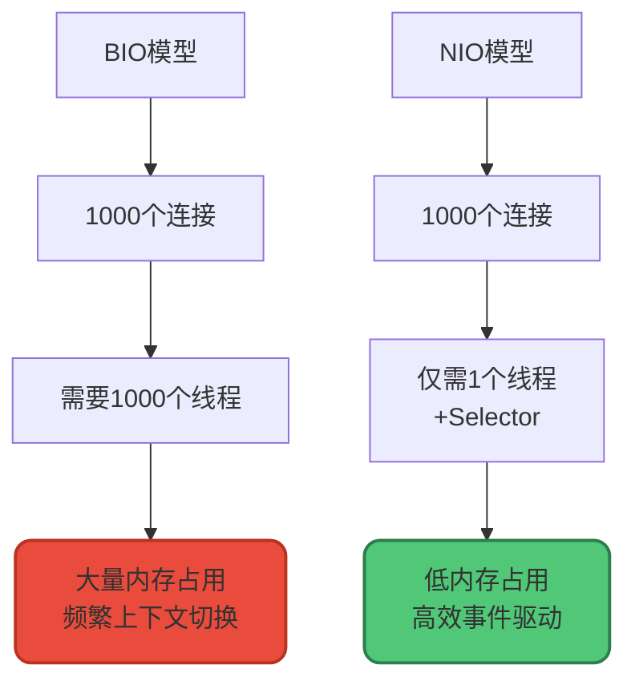
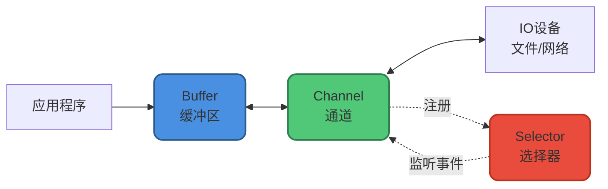
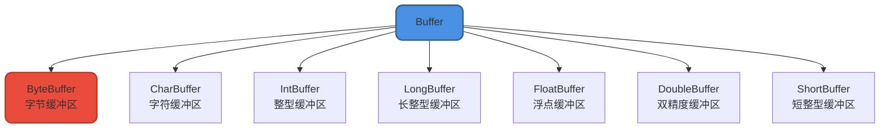
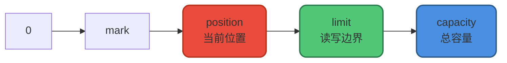
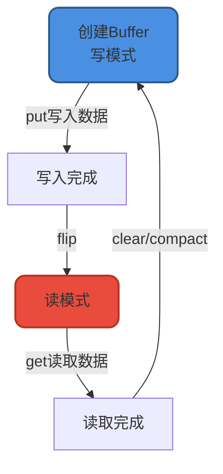
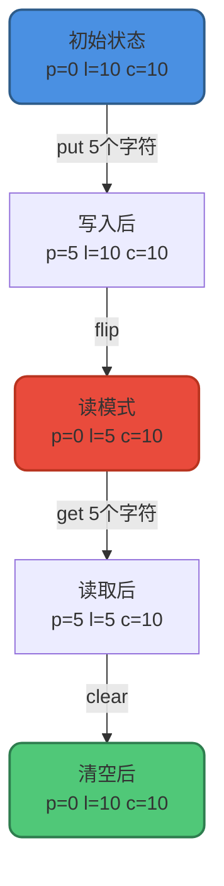
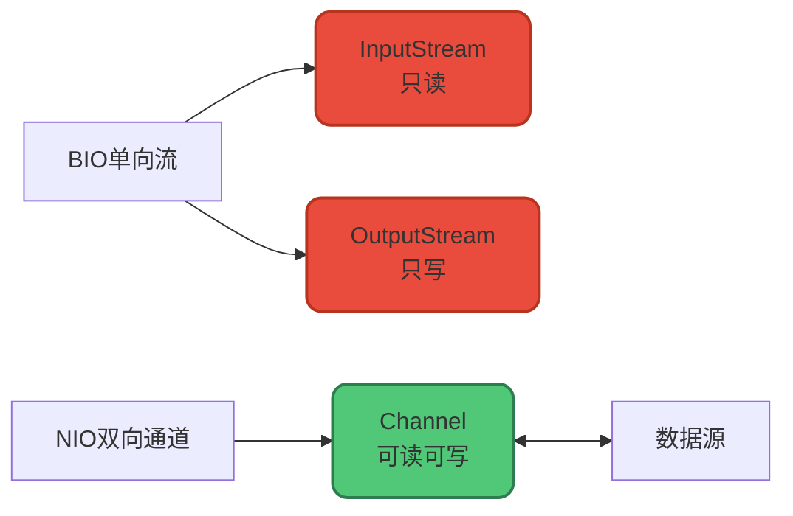
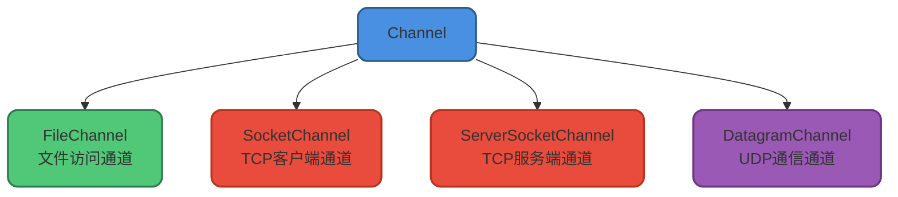
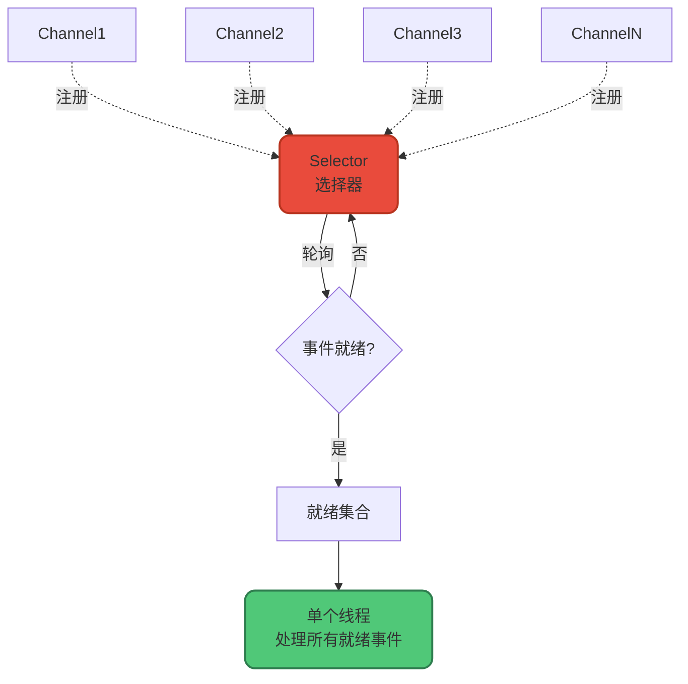
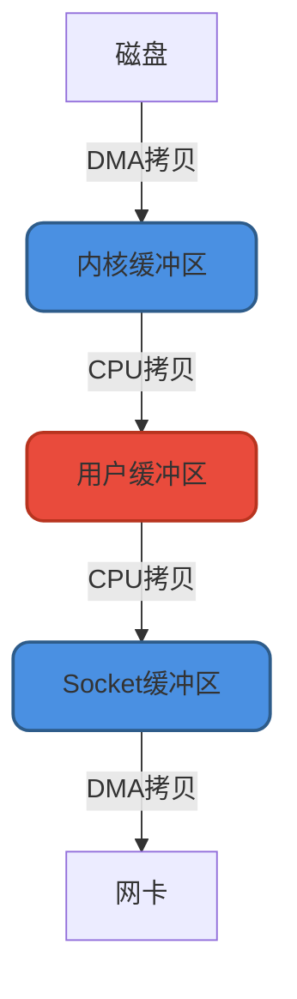

# NIO核心组件与零拷贝

## NIO概述

在传统的BIO模型中,IO操作以阻塞方式进行。当线程执行read或write操作时,会被阻塞直到操作完成。这种模型在处理大量并发连接时会遇到严重的性能瓶颈,因为需要为每个连接创建独立线程,而线程的创建和上下文切换都有很大开销。

为了解决这个问题,Java 1.4引入了**NIO(New IO,也称Non-blocking IO)**。NIO提供了非阻塞、面向缓冲、基于通道的I/O操作方式,可以使用少量线程处理大量连接,大幅提升IO效率和并发能力。



**注意**: NIO并不是在所有场景下都优于BIO。它的性能优势主要体现在**高并发、高延迟的网络环境**。当连接数较少、并发程度低或网络传输速度快时,NIO的性能不一定优于BIO。

## NIO三大核心组件

NIO主要包括三个核心组件:

1. **Buffer(缓冲区)**: 数据的容器,所有数据读写都通过Buffer进行
2. **Channel(通道)**: 双向数据传输通道,连接Buffer和IO设备
3. **Selector(选择器)**: 多路复用器,实现单线程管理多个Channel

三者的协作关系:



## Buffer缓冲区

### 核心概念

在BIO中,数据读写是 **面向流** 的,分为字节流和字符流,数据直接在流中传输。

NIO中,所有数据都通过 **Buffer(缓冲区)** 进行处理。读取数据时,数据从Channel读到Buffer;写入数据时,数据从Buffer写到Channel。

这种设计类似于BIO中的缓冲流(BufferedInputStream/BufferedOutputStream),通过批量读写减少系统调用次数,提升性能。

### Buffer类型

`Buffer`是一个抽象类,常用的子类包括:



其中,`ByteBuffer`是最常用的Buffer类型,可以用于存储和操作字节数据。

可以将Buffer理解为一个数组:`IntBuffer`对应`int[]`,`CharBuffer`对应`char[]`,`ByteBuffer`对应`byte[]`。

### Buffer核心属性

Buffer类定义了四个核心属性:

```java
public abstract class Buffer {
    // 四个核心属性,满足: 0 <= mark <= position <= limit <= capacity
    private int mark = -1;      // 标记位置
    private int position = 0;   // 当前读写位置
    private int limit;          // 读写边界
    private int capacity;       // 容量
}
```

这四个属性的含义:

1. **capacity(容量)**: Buffer能存储的最大数据量,创建时设置且不可改变
2. **limit(界限)**: Buffer中可读/写数据的边界
   - 写模式: limit = capacity,表示最多能写入的位置
   - 读模式: limit = 实际数据大小,表示最多能读取的位置
3. **position(位置)**: 下一个将要读/写的数据位置(索引)
   - 写模式: 指向下一个要写入的位置
   - 读模式: 指向下一个要读取的位置
4. **mark(标记)**: 记录特定position,可通过`reset()`方法回到该位置



### Buffer读写模式

Buffer有两种工作模式:**写模式**和**读模式**。

- **写模式**: Buffer创建后默认处于写模式,可以向Buffer写入数据
- **读模式**: 调用`flip()`切换到读模式,可以从Buffer读取数据

```java
ByteBuffer buffer = ByteBuffer.allocate(10);  // 创建容量为10的Buffer,默认写模式
buffer.put((byte) 'A');                       // 写入数据
buffer.flip();                                // 切换到读模式
byte data = buffer.get();                     // 读取数据
```

切换回写模式的方法:

- `clear()`: 清空缓冲区,position=0, limit=capacity
- `compact()`: 压缩缓冲区,将未读数据移到开头,继续写入



### Buffer核心方法

创建Buffer:

```java
// 分配堆内存
public static ByteBuffer allocate(int capacity);
// 分配直接内存(堆外内存)
public static ByteBuffer allocateDirect(int capacity);
```

核心读写方法:

- `put()`: 向Buffer写入数据
- `get()`: 从Buffer读取数据

其他重要方法:

- `flip()`: 写模式切换到读模式
- `clear()`: 清空缓冲区,切换到写模式
- `rewind()`: 重置position为0,可以重新读取数据
- `mark()`: 标记当前position
- `reset()`: 回到mark标记的位置

### Buffer实战演示

```java
public class BufferDemo {
    public static void main(String[] args) {
        // 1. 创建容量为10的CharBuffer
        CharBuffer buffer = CharBuffer.allocate(10);
        System.out.println("【初始状态】");
        printBufferState(buffer);
        
        // 2. 写入5个字符
        buffer.put('H').put('e').put('l').put('l').put('o');
        System.out.println("\n【写入5个字符后】");
        printBufferState(buffer);
        
        // 3. 切换到读模式
        buffer.flip();
        System.out.println("\n【调用flip()切换到读模式】");
        printBufferState(buffer);
        
        // 4. 读取数据
        System.out.println("\n【读取数据】");
        while (buffer.hasRemaining()) {
            System.out.print(buffer.get());
        }
        System.out.println();
        printBufferState(buffer);
        
        // 5. 清空缓冲区
        buffer.clear();
        System.out.println("\n【调用clear()清空缓冲区】");
        printBufferState(buffer);
    }
    
    private static void printBufferState(CharBuffer buffer) {
        System.out.println("position=" + buffer.position() + 
                          ", limit=" + buffer.limit() + 
                          ", capacity=" + buffer.capacity());
    }
}
```

输出:

```
【初始状态】
position=0, limit=10, capacity=10

【写入5个字符后】
position=5, limit=10, capacity=10

【调用flip()切换到读模式】
position=0, limit=5, capacity=10

【读取数据】
Hello
position=5, limit=5, capacity=10

【调用clear()清空缓冲区】
position=0, limit=10, capacity=10
```

position、limit和capacity的变化过程:



## Channel通道

### 核心概念

Channel(通道)是NIO中数据传输的通道,建立了与数据源(文件、网络套接字等)之间的连接。

BIO中的流是**单向的**:

- `InputStream`: 只能读取数据
- `OutputStream`: 只能写入数据

Channel是**双向的**,可以同时用于读和写操作,更好地映射底层操作系统的API(UNIX系统中的通道本身就是全双工的)。



Channel与Buffer的关系:

- 读操作: 将Channel中的数据读取到Buffer
- 写操作: 将Buffer中的数据写入到Channel

### Channel类型

常用的Channel类型:



### Channel核心方法

最核心的两个方法:

1. `read()`: 从Channel读取数据到Buffer
2. `write()`: 将Buffer中的数据写入Channel

### FileChannel示例

```java
public class FileChannelDemo {
    public void copyFile(String sourcePath, String targetPath) throws IOException {
        try (RandomAccessFile source = new RandomAccessFile(sourcePath, "r");
             RandomAccessFile target = new RandomAccessFile(targetPath, "rw");
             FileChannel sourceChannel = source.getChannel();
             FileChannel targetChannel = target.getChannel()) {
            
            ByteBuffer buffer = ByteBuffer.allocate(1024);
            
            while (sourceChannel.read(buffer) != -1) {
                buffer.flip();              // 切换到读模式
                targetChannel.write(buffer); // 写入目标文件
                buffer.clear();             // 清空缓冲区,继续读取
            }
            
            System.out.println("文件复制完成");
        }
    }
}
```

## Selector选择器

### 核心概念

Selector(选择器)是NIO最核心的组件,它允许**单个线程处理多个Channel**。

Selector基于**事件驱动的IO多路复用模型**,工作原理:

1. 将Channel注册到Selector,并指定感兴趣的事件(如连接、读、写)
2. Selector不断轮询注册的Channel
3. 当某个Channel有事件就绪时,Selector将其加入就绪集合
4. 应用程序通过SelectionKey获取就绪的Channel,进行相应的IO操作



### 可监听的事件类型

Selector可以监听四种事件:

1. `SelectionKey.OP_ACCEPT`: 接受连接事件(ServerSocketChannel)
2. `SelectionKey.OP_CONNECT`: 连接就绪事件(SocketChannel)
3. `SelectionKey.OP_READ`: 读就绪事件(有数据可读)
4. `SelectionKey.OP_WRITE`: 写就绪事件(可以写入数据)

### Selector核心方法

创建Selector:

```java
Selector selector = Selector.open();
```

注册Channel到Selector:

```java
channel.configureBlocking(false);  // 必须设置为非阻塞模式
SelectionKey key = channel.register(selector, SelectionKey.OP_READ);
```

Selector提供的select方法:

- `int select()`: 阻塞直到有事件就绪
- `int select(long timeout)`: 阻塞最多timeout毫秒
- `int selectNow()`: 非阻塞立即返回
- `Selector wakeup()`: 唤醒阻塞在select()上的线程

### SelectionKey集合

Selector维护三个SelectionKey集合:

1. **所有注册的Key集合**: 通过`keys()`方法获取
2. **就绪的Key集合**: 通过`selectedKeys()`方法获取,需要处理的Channel
3. **被取消的Key集合**: 已取消注册的Channel,程序无法直接访问

### 网络编程示例

```java
public class NIOChatServer {
    private Selector selector;
    private ServerSocketChannel serverChannel;
    
    public void start(int port) throws IOException {
        // 创建Selector
        selector = Selector.open();
        
        // 创建ServerSocketChannel
        serverChannel = ServerSocketChannel.open();
        serverChannel.bind(new InetSocketAddress(port));
        serverChannel.configureBlocking(false);
        
        // 注册到Selector,监听连接事件
        serverChannel.register(selector, SelectionKey.OP_ACCEPT);
        System.out.println("聊天服务器启动在端口: " + port);
        
        // 事件循环
        while (true) {
            int readyChannels = selector.select();
            if (readyChannels == 0) continue;
            
            // 获取就绪的SelectionKey集合
            Set<SelectionKey> selectedKeys = selector.selectedKeys();
            Iterator<SelectionKey> keyIterator = selectedKeys.iterator();
            
            while (keyIterator.hasNext()) {
                SelectionKey key = keyIterator.next();
                keyIterator.remove();  // 必须手动移除
                
                if (key.isAcceptable()) {
                    handleAccept(key);
                } else if (key.isReadable()) {
                    handleRead(key);
                } else if (key.isWritable()) {
                    handleWrite(key);
                }
            }
        }
    }
    
    private void handleAccept(SelectionKey key) throws IOException {
        ServerSocketChannel server = (ServerSocketChannel) key.channel();
        SocketChannel client = server.accept();
        client.configureBlocking(false);
        
        // 注册客户端Channel,监听读事件
        client.register(selector, SelectionKey.OP_READ);
        System.out.println("新用户加入: " + client.getRemoteAddress());
    }
    
    private void handleRead(SelectionKey key) throws IOException {
        SocketChannel client = (SocketChannel) key.channel();
        ByteBuffer buffer = ByteBuffer.allocate(1024);
        
        int bytesRead = client.read(buffer);
        if (bytesRead > 0) {
            buffer.flip();
            String message = new String(buffer.array(), 0, bytesRead);
            System.out.println("收到消息: " + message);
            
            // 切换到写事件,准备回复
            key.attach(message);  // 将消息附加到Key
            client.register(selector, SelectionKey.OP_WRITE);
        } else if (bytesRead < 0) {
            // 客户端断开连接
            System.out.println("用户离开: " + client.getRemoteAddress());
            client.close();
        }
    }
    
    private void handleWrite(SelectionKey key) throws IOException {
        SocketChannel client = (SocketChannel) key.channel();
        String message = (String) key.attachment();
        
        ByteBuffer buffer = ByteBuffer.wrap(("服务器回复: " + message).getBytes());
        client.write(buffer);
        
        // 切换回读事件
        client.register(selector, SelectionKey.OP_READ);
    }
}
```

## NIO零拷贝

零拷贝是提升IO性能的重要手段,在Kafka、RocketMQ、Netty等顶级开源项目中都有应用。

### 什么是零拷贝

零拷贝是指CPU不需要将数据从一个存储区域复制到另一个存储区域,从而减少上下文切换和CPU拷贝时间。

传统IO的四次拷贝:



### 零拷贝技术对比

| 技术 | CPU拷贝 | DMA拷贝 | 系统调用 | 上下文切换 |
|------|---------|---------|----------|-----------|
| 传统方法 | 2 | 2 | read+write | 4 |
| mmap+write | 1 | 2 | mmap+write | 4 |
| sendfile | 1 | 2 | sendfile | 2 |
| sendfile+DMA gather | 0 | 2 | sendfile | 2 |

无论哪种方式,2次DMA拷贝都少不了(由硬件完成)。零拷贝主要**减少CPU拷贝和上下文切换**。

### Java对零拷贝的支持

#### 1. MappedByteBuffer (mmap)

`MappedByteBuffer`基于内存映射(mmap),将文件映射到内存,可以像操作内存一样操作文件。

```java
public class MMapDemo {
    public void loadFileToMemory(String filePath) throws IOException {
        try (FileInputStream fis = new FileInputStream(filePath);
             FileChannel fc = fis.getChannel()) {
            
            // 将文件映射到内存
            MappedByteBuffer buffer = fc.map(
                FileChannel.MapMode.READ_ONLY, 
                0, 
                fc.size()
            );
            
            // 直接操作内存中的文件数据
            byte[] data = new byte[(int) fc.size()];
            buffer.get(data);
            
            System.out.println("文件大小: " + data.length + " 字节");
        }
    }
}
```

#### 2. FileChannel.transferTo/transferFrom (sendfile)

`FileChannel`的`transferTo()`和`transferFrom()`基于sendfile系统调用,可以直接在两个Channel之间传输数据。

```java
public class ZeroCopyDemo {
    public void copyFileBySendfile(String source, String target) throws IOException {
        try (FileInputStream fis = new FileInputStream(source);
             FileOutputStream fos = new FileOutputStream(target);
             FileChannel sourceChannel = fis.getChannel();
             FileChannel targetChannel = fos.getChannel()) {
            
            // 零拷贝传输
            long transferred = sourceChannel.transferTo(
                0, 
                sourceChannel.size(), 
                targetChannel
            );
            
            System.out.println("传输字节数: " + transferred);
        }
    }
}
```

## 总结

本文详细介绍了NIO的核心知识:

1. **Buffer**: 数据容器,通过position、limit、capacity管理读写状态
2. **Channel**: 双向通道,连接Buffer和IO设备
3. **Selector**: 多路复用器,实现单线程管理多个Channel
4. **零拷贝**: 通过mmap和sendfile减少数据拷贝,提升性能

虽然NIO编程相对复杂,但在高并发场景下性能显著优于BIO。实际开发中,建议使用Netty等成熟的NIO框架,它们在NIO基础上进行了优化和扩展,提供了更友好的API和更强大的功能。
