# G1垃圾收集器原理与优化

## 前言

G1(Garbage First)收集器是JVM垃圾回收技术的一个重要里程碑,它在JDK 7中被引入,并从JDK 9开始成为默认的垃圾收集器,取代了之前的Parallel Scavenge + Parallel Old组合。

G1的设计目标是在大内存环境下提供可预测的停顿时间,同时保持较高的吞吐量。本文将深入探讨G1的工作原理、核心特性以及优化策略。

## G1与CMS的核心差异

在了解G1之前,我们先看看它相比前代收集器CMS有哪些改进:

### 对比表格

| 特性 | CMS | G1 |
|------|-----|-----|
| **回收范围** | 仅老年代 | 整个堆(新生代+老年代) |
| **GC算法** | 标记-清除 | 新生代:标记-复制<br/>老年代:标记-整理 |
| **漏标解决** | 增量更新 | SATB原始快照 |
| **内存碎片** | 会产生碎片 | 避免碎片产生 |
| **停顿可预测性** | 不可预测 | 可预测并可控制 |
| **堆内存要求** | 一般(2-4GB) | 较大(推荐4GB+) |
| **自适应调优** | 不支持 | 支持 |
| **JDK版本** | JDK 1.8及之前(JDK 14移除) | JDK 1.7+(JDK 9+默认) |

### 架构差异可视化

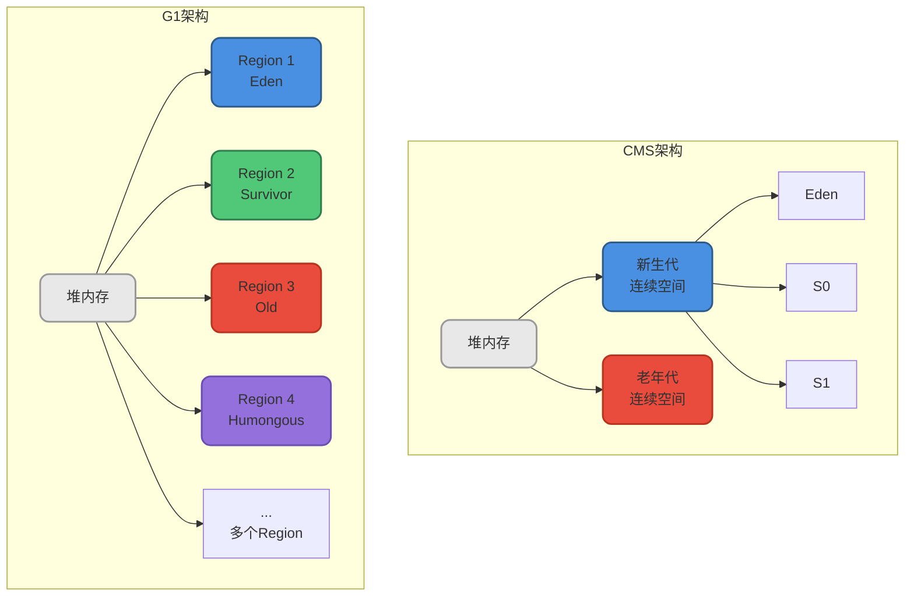

### 核心改进总结

G1通过Region化的内存管理方式,实现了以下关键改进:

- **整堆回收**: 不需要配合其他收集器,独立管理新生代和老年代
- **无碎片**: 采用标记-整理算法,避免CMS的内存碎片问题  
- **可预测停顿**: 通过优先级列表选择回收价值最大的Region
- **动态调整**: 支持运行时动态调整各区域大小

## G1的四大核心特性

### 1. 并行与并发执行

G1充分利用多核CPU的优势,使用多个线程来缩短Stop-The-World的停顿时间。

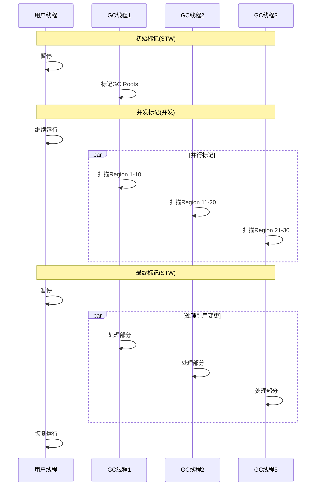

**关键点:**
- 标记和清理过程支持多线程并行,缩短STW时间
- 部分阶段与用户线程并发执行,减少应用停顿

### 2. 分代收集策略

虽然G1采用Region化管理,但仍然保留了分代的概念,这是基于弱分代假说(Weak Generational Hypothesis)的优化。

```java
// 电商系统示例 - 体现分代特性
public class ShoppingCartService {
    
    // 频繁创建,适合新生代收集
    public OrderSummary calculateTotal(String userId) {
        // 这些对象生命周期很短
        List&lt;CartItem&gt; items = cartDao.getItems(userId);
        PriceCalculator calculator = new PriceCalculator();
        DiscountEngine discount = new DiscountEngine();
        
        // 临时计算对象,方法结束即可回收
        BigDecimal subtotal = calculator.sum(items);
        BigDecimal finalPrice = discount.apply(subtotal);
        
        return new OrderSummary(finalPrice, items.size());
    }
    
    // 长期存活对象,进入老年代
    private static final CacheManager cacheManager = new CacheManager();
    private static final MetricsCollector metrics = new MetricsCollector();
    private final ConnectionPool dbPool = new ConnectionPool(100);
}
```

上述代码中:
- `items`、`calculator`、`discount`等临时对象会在新生代快速回收
- `cacheManager`、`metrics`、`dbPool`等长期对象会晋升到老年代

### 3. 空间整合机制

G1从整体上看基于**标记-整理算法**,从局部(两个Region之间)看基于**标记-复制算法**,这确保了不会产生内存碎片。

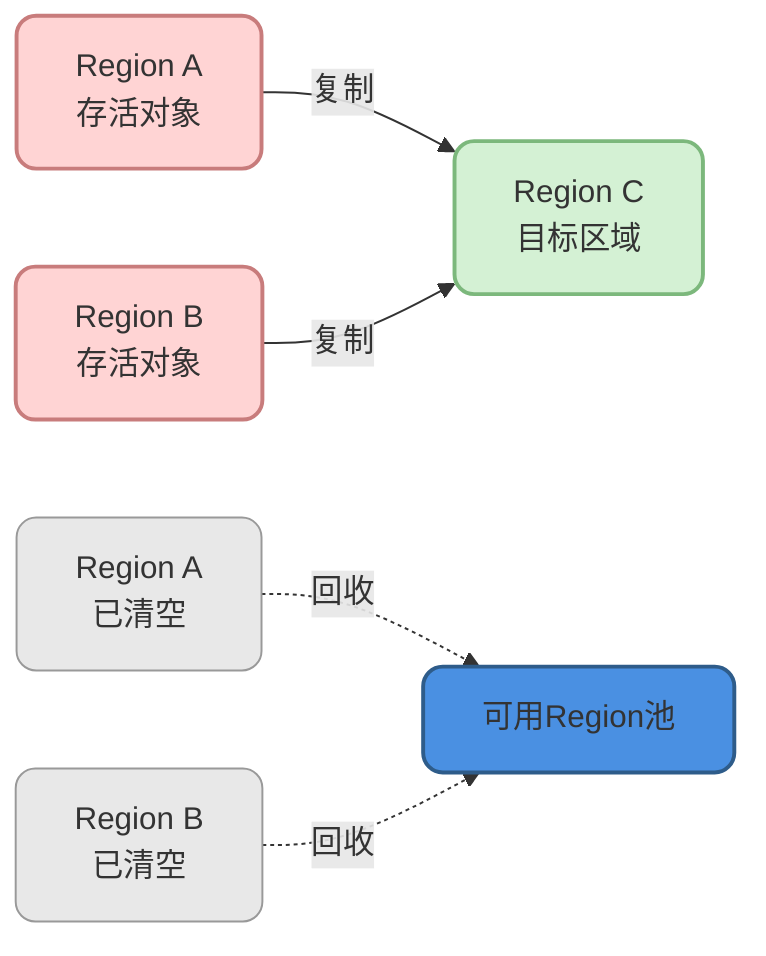

**CMS vs G1内存碎片对比:**

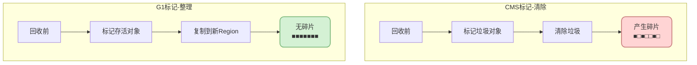

### 4. 可预测的停顿时间

这是G1相对于CMS的最大优势之一。G1允许用户指定一个期望的停顿时间目标。

**核心参数:**

```bash
# 设置目标最大停顿时间为200毫秒
-XX:MaxGCPauseMillis=200
```

## G1如何实现可预测停顿

G1实现可预测停顿的核心机制是**Region化管理**和**回收收益预测模型**。

### Region化内存管理

G1将整个Java堆划分为多个大小相等的独立区域(Region),每个Region大小为1MB-32MB(通常是2的幂次方)。

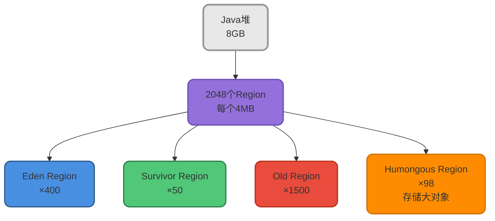

**Region类型说明:**

- **Eden**: 新对象分配区域
- **Survivor**: 存放Minor GC后存活的对象
- **Old**: 存放多次GC后仍存活的老对象
- **Humongous**: 存放大对象(超过Region大小的50%)

### 回收收益预测模型

G1通过维护每个Region的回收成本和收益数据,建立预测模型:

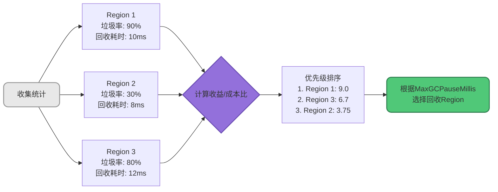

### 增量式回收策略

G1不是每次回收整个堆,而是选择一部分Region进行回收:

```java
// 模拟G1回收决策
public class G1CollectionStrategy {
    
    /**
     * 根据目标停顿时间选择要回收的Region
     */
    public Set&lt;Region&gt; selectRegionsToCollect(
            List&lt;Region&gt; allRegions, 
            int maxPauseMillis) {
        
        // 按收益/成本比排序
        allRegions.sort((r1, r2) -&gt; {
            double ratio1 = r1.getGarbageRatio() / r1.getCollectionTimeMs();
            double ratio2 = r2.getGarbageRatio() / r2.getCollectionTimeMs();
            return Double.compare(ratio2, ratio1); // 降序
        });
        
        Set&lt;Region&gt; selected = new HashSet&lt;&gt;();
        int estimatedTime = 0;
        
        // 贪心算法:选择收益最高且不超时的Region
        for (Region region : allRegions) {
            int regionTime = region.getCollectionTimeMs();
            if (estimatedTime + regionTime &lt;= maxPauseMillis) {
                selected.add(region);
                estimatedTime += regionTime;
            } else {
                break; // 超过时间预算,停止选择
            }
        }
        
        return selected;
    }
}
```

### 类比理解:项目管理

G1的停顿时间控制类似于敏捷开发中的任务规划:

:::tip 类比说明
假设你是项目经理,老板给你固定的时间(如1天),让你尽可能完成更多工作:

**传统方式(类似Full GC):**
- 一次性评估整个项目
- 预估不准,可能需要好几天
- 无法控制完成时间

**G1方式(增量回收):**
- 把项目拆成小任务(类似Region)
- 评估每个任务的"价值/时间比"
- 优先选择高价值任务
- 确保1天内完成,剩余任务下次再做

这样就能在固定时间内完成价值最大化,同时保证不超时!
:::

### 动态调整机制

G1的预测模型会不断学习和调整:

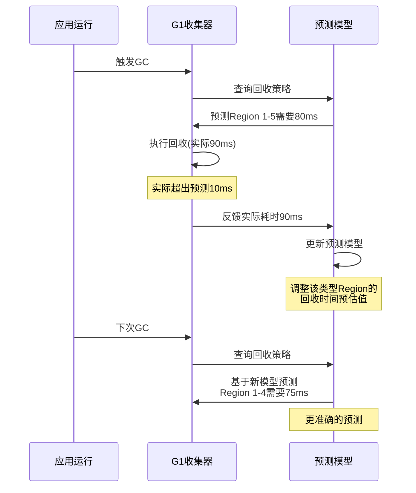

## G1垃圾回收流程

G1的垃圾回收过程分为以下几个阶段:

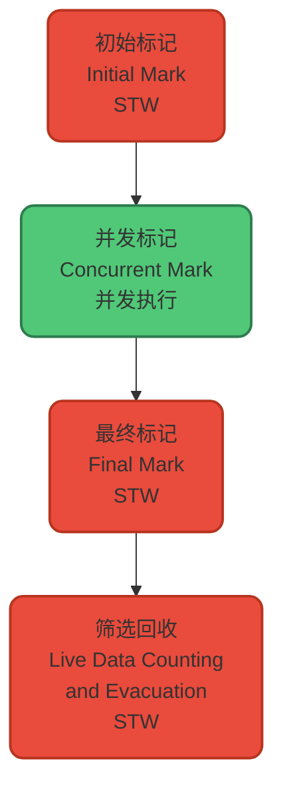

### 各阶段详解

**1. 初始标记(Initial Mark):**
- 短暂STW,标记GC Roots直接关联的对象
- 通常与Minor GC一起执行,开销较小

**2. 并发标记(Concurrent Mark):**
- 与应用线程并发运行,标记所有可达对象
- 耗时较长,但不阻塞应用
- 使用SATB(Snapshot-At-The-Beginning)算法处理引用变化

**3. 最终标记(Final Mark):**
- 短暂STW,处理并发标记阶段遗留的引用变更
- 使用SATB write barrier记录的数据

**4. 筛选回收(Evacuation):**
- 根据预测模型选择回收价值高的Region
- 复制存活对象到新Region
- 回收旧Region空间
- 此阶段会STW,但可控制时间

### Young GC vs Mixed GC

G1有两种GC模式:

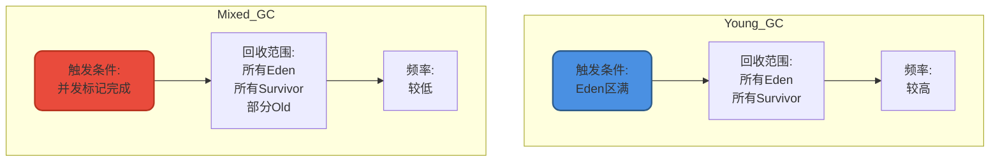

## 为什么G1成为默认收集器

从JDK 9开始,G1取代Parallel成为默认收集器,主要基于以下原因:

### 1. 并发回收能力

G1充分利用多核CPU,大部分GC工作并发进行:

```java
// 大数据处理场景
public class DataProcessor {
    
    public void processBigData() {
        // 处理TB级数据
        List&lt;DataChunk&gt; chunks = loadDataChunks(); // 10000个chunk
        
        ExecutorService executor = Executors.newFixedThreadPool(16);
        
        for (DataChunk chunk : chunks) {
            executor.submit(() -&gt; {
                // 并发处理,频繁创建对象
                DataAnalyzer analyzer = new DataAnalyzer();
                Result result = analyzer.analyze(chunk);
                
                // G1在后台并发标记和回收
                // 不会长时间阻塞这些工作线程
                saveResult(result);
            });
        }
    }
}
```

G1在上述场景中可以:
- 并发标记垃圾对象,不阻塞数据处理
- 增量回收,每次只回收部分Region
- 保持应用高吞吐量

### 2. 分代收集优势

G1保留分代概念,但实现更灵活:

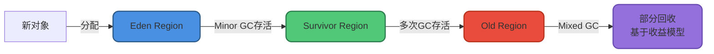

**对比Parallel:**
- Parallel: 固定的新生代/老年代大小,可能浪费内存
- G1: 动态调整各代Region数量,更高效利用内存

### 3. 空间整合避免碎片

G1不会产生内存碎片,避免了CMS的痛点:

```java
// 长时间运行的服务
public class LongRunningService {
    
    // CMS问题:长时间运行后老年代碎片严重
    // 即使有空间也无法分配大对象
    // 导致频繁Full GC
    
    // G1优势:通过整理避免碎片
    public void allocateLargeObject() {
        // 即使运行很久,G1也能高效分配大对象
        byte[] largeData = new byte[5 * 1024 * 1024]; // 5MB
        processData(largeData);
    }
}
```

### 4. 可预测停顿时间

这是G1最吸引人的特性,特别适合对响应时间敏感的应用:

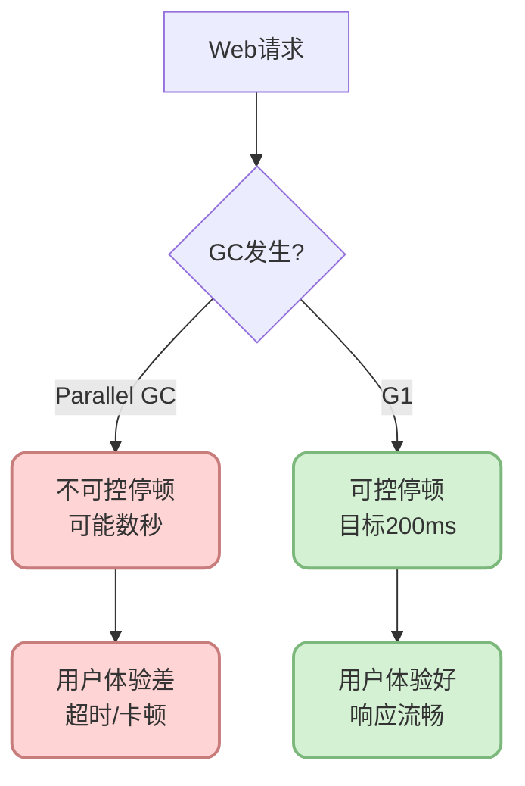

### 5. 支持热插拔和自适应

G1可以运行时动态调整:

```bash
# G1自适应参数示例
-XX:+UseG1GC
-XX:MaxGCPauseMillis=200          # 目标停顿时间
-XX:G1HeapRegionSize=4m           # Region大小
-XX:InitiatingHeapOccupancyPercent=45  # 触发并发GC的堆占用率
```

G1会根据运行情况自动调整:
- Eden和Survivor的Region数量
- 每次Mixed GC回收的Region数量
- 并发标记的触发时机

## G1适用场景

G1特别适合以下场景:

### 大内存应用

```java
// 内存密集型应用
public class CacheServer {
    // 超过4GB的堆内存
    private Map&lt;String, byte[]&gt; cache = new ConcurrentHashMap&lt;&gt;();
    
    public void init() {
        // G1能很好地管理大堆
        // 增量回收,避免长时间停顿
        for (int i = 0; i &lt; 100000; i++) {
            cache.put("key" + i, new byte[1024 * 100]); // 100KB each
        }
    }
}
```

**推荐**: 堆内存超过4GB

### 响应时间敏感应用

```java
// 实时交易系统
public class TradingSystem {
    
    public Response processTrade(TradeRequest request) {
        // 要求99.9%的请求在100ms内响应
        // G1可以控制GC停顿在几十毫秒内
        // 保证交易不超时
        
        Order order = validateAndCreateOrder(request);
        return executeTrade(order);
    }
}
```

**推荐**: Web应用、在线服务、实时系统

### 动态内存需求场景

```java
// 波动负载的应用
public class ElasticApplication {
    
    public void handleLoad(int requestCount) {
        // 高峰期:大量对象分配
        // 低峰期:内存释放
        
        // G1能自适应调整各代大小
        // 高效应对负载变化
        for (int i = 0; i &lt; requestCount; i++) {
            processRequest();
        }
    }
}
```

**推荐**: 负载波动大的应用

### 要求可预测性的场景

```java
// SLA要求严格的服务
public class SLAService {
    // SLA要求:99%请求&lt;200ms, 99.9%请求&lt;500ms
    
    // G1配置:-XX:MaxGCPauseMillis=100
    // 确保GC停顿不超过100ms
    // 帮助满足SLA要求
}
```

## G1优化实践

### 关键参数调优

```bash
# 基础配置
-XX:+UseG1GC                      # 启用G1
-Xms8g -Xmx8g                     # 固定堆大小,避免动态扩展

# 停顿时间目标
-XX:MaxGCPauseMillis=200          # 目标最大停顿200ms(默认200)

# Region大小(1-32MB,必须是2的幂)
-XX:G1HeapRegionSize=16m          # 较大Region适合大对象多的场景

# 并发GC触发阈值
-XX:InitiatingHeapOccupancyPercent=45  # 堆占用45%时启动并发标记

# 年轻代大小范围
-XX:G1NewSizePercent=5            # 新生代最小占比5%
-XX:G1MaxNewSizePercent=60        # 新生代最大占比60%

# Mixed GC相关
-XX:G1MixedGCCountTarget=8        # Mixed GC回收老年代的目标次数
-XX:G1OldCSetRegionThresholdPercent=10  # 老年代Region回收比例
```

### 监控关键指标

使用GC日志监控G1性能:

```bash
# 启用详细GC日志(JDK 8)
-XX:+PrintGCDetails 
-XX:+PrintGCDateStamps 
-Xloggc:gc.log

# JDK 9+使用新的日志格式
-Xlog:gc*:file=gc.log:time,level,tags
```

关注的指标:
- Young GC频率和停顿时间
- Mixed GC频率和停顿时间  
- 并发标记耗时
- Region使用情况

## 小结

G1垃圾收集器是JVM垃圾回收技术的重要进步,它通过Region化内存管理、增量回收和停顿时间预测模型,实现了可预测的低停顿。

**核心要点:**

- G1采用Region化管理,避免内存碎片
- 通过回收收益预测模型实现可控停顿
- 支持整堆回收,无需配合其他收集器
- 适合大内存、对响应时间敏感的应用
- 从JDK 9开始成为默认收集器

**与CMS对比的主要优势:**

- 整堆回收 vs 仅老年代
- 无内存碎片 vs 会产生碎片
- 可预测停顿 vs 不可预测
- 支持自适应调优

在下一篇文章中,我们将探讨更先进的ZGC收集器,它将停顿时间进一步降低到亚毫秒级别。

## 参考资料

- 《深入理解Java虚拟机:JVM高级特性与最佳实践(第3版)》- 周志明
- [Getting Started with the G1 Garbage Collector](https://www.oracle.com/technical-resources/articles/java/g1gc.html) - Oracle官方文档
- [JEP 248: Make G1 the Default Garbage Collector](https://openjdk.org/jeps/248)
