# ZGC低延迟垃圾收集器

## 前言

ZGC(Z Garbage Collector)是Oracle在JDK 11中引入的一款革命性的低延迟垃圾收集器,它的设计目标是将GC停顿时间控制在**10毫秒以内**,甚至可以达到**亚毫秒级别**,而且这个停顿时间不会随着堆大小的增加而增加。

ZGC代表了垃圾回收技术的最新发展方向,特别适合需要超大内存且对延迟极度敏感的应用场景。本文将深入探讨ZGC的核心特性、工作原理和使用场景。

:::tip 版本说明
- JDK 11-14: ZGC处于实验阶段
- JDK 15: ZGC正式可用(Production Ready)
- JDK 21: 引入分代ZGC,停顿时间缩短到1ms以内
- JDK 24: 删除非分代ZGC
:::

## ZGC的六大核心特性

### 1. 超低停顿时间

ZGC的首要设计目标是实现极低的停顿时间:

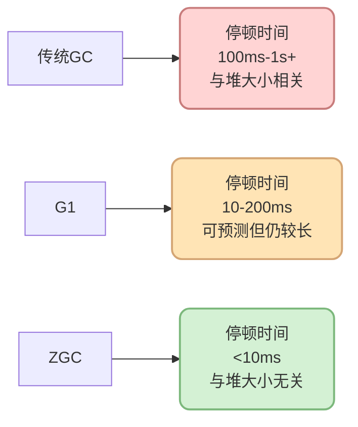

**关键点:**
- 目标停顿时间 &lt; 10ms
- JDK 21分代ZGC可达到 &lt; 1ms
- 停顿时间不随堆大小增加而增长

### 2. 高吞吐量

ZGC是并发垃圾收集器,大部分工作与应用线程并发执行:

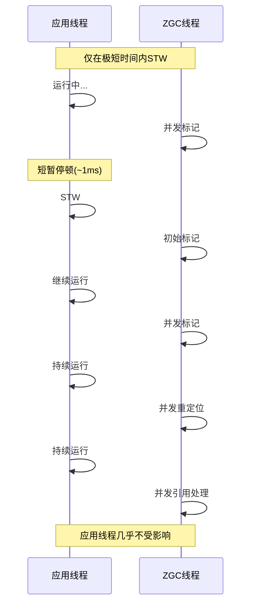

**优势:**
- 应用线程停顿极短,CPU利用率高
- 适合对吞吐量有要求的场景

### 3. 完全兼容性

ZGC与现有Java应用程序完全兼容:

```java
// 无需修改任何代码
public class ExistingApplication {
    
    public static void main(String[] args) {
        // 原有代码完全不变
        ApplicationContext context = new ApplicationContext();
        Server server = new Server(8080);
        server.start();
    }
    
    // 只需在JVM启动参数中指定ZGC
    // java -XX:+UseZGC -Xmx16g Application
}
```

**特点:**
- 无需修改应用代码
- 无需调整对象分配策略
- 平滑迁移,风险低

### 4. 超大堆支持

ZGC可以处理从8MB到16TB的堆内存:

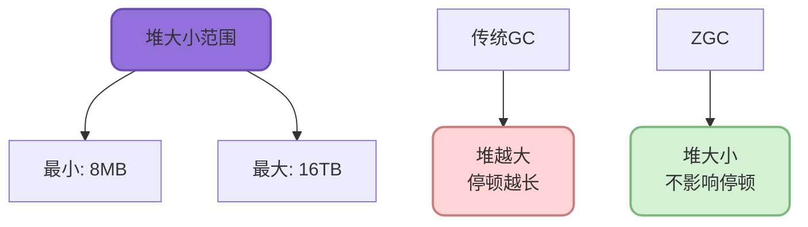

**适用场景:**

```java
// 超大内存缓存系统
public class MassiveCacheSystem {
    
    // 使用10TB堆内存
    // ZGC依然能保持<10ms的停顿
    private Map&lt;String, CacheEntry&gt; cache;
    
    public void initialize() {
        // 初始化超大缓存
        cache = new ConcurrentHashMap&lt;&gt;(100_000_000);
        
        // 加载数十亿条数据到内存
        loadBillionsOfEntries();
    }
}
```

### 5. 全堆回收(非分代)

ZGC最初采用全堆回收策略,不区分年轻代和老年代:

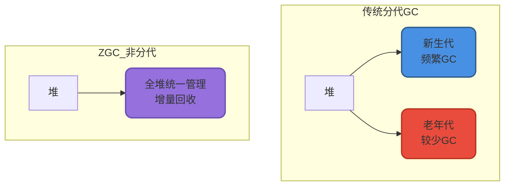

:::info JDK 21更新
JDK 21引入了[分代ZGC](https://openjdk.org/jeps/439),进一步优化性能。JDK 24中[删除了非分代ZGC](https://openjdk.org/jeps/490)。
:::

**启用分代ZGC(JDK 21+):**

```bash
java -XX:+UseZGC -XX:+ZGenerational -Xmx16g Application
```

### 6. 设计简洁

ZGC设计相对简洁,代码库较小,易于维护和扩展:

- 核心代码集中,逻辑清晰
- 更容易进行性能优化
- 缺陷修复周期短

## ZGC核心技术原理

ZGC能够实现如此低的停顿时间,主要依赖两项核心技术:

### 1. 染色指针(Colored Pointers)

ZGC使用64位指针的部分位来存储元数据:

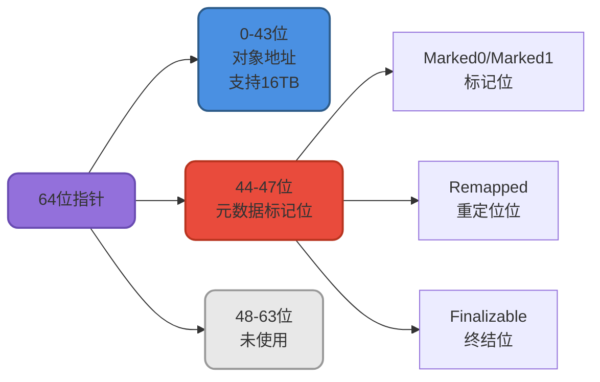

**染色指针的优势:**

```java
// 概念示例(简化)
public class ColoredPointer {
    
    // 传统方式:需要额外的标记位图
    class TraditionalGC {
        Object obj;
        boolean marked;  // 需要额外存储
    }
    
    // ZGC方式:标记信息编码在指针中
    class ZGCPointer {
        long pointer;  // 地址+标记信息
        
        // 提取地址
        long getAddress() {
            return pointer &amp; 0x0000FFFFFFFFFFFFL;
        }
        
        // 检查标记
        boolean isMarked() {
            return (pointer &amp; MARKED_MASK) != 0;
        }
        
        // 设置标记
        void setMarked() {
            pointer |= MARKED_MASK;
        }
    }
}
```

**优势总结:**
- 无需额外的标记位图,节省内存
- 通过位运算快速判断对象状态
- 支持多种并发标记视图

### 2. 读屏障(Load Barrier)

ZGC使用读屏障技术实现并发的对象移动:

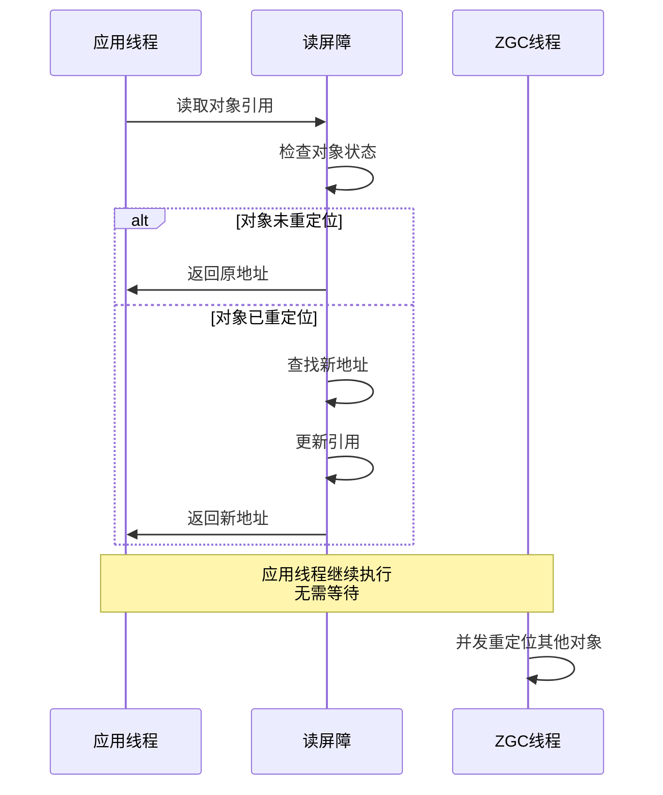

**工作原理示例:**

```java
// 读屏障伪代码
public class LoadBarrier {
    
    Object readField(Object obj, String fieldName) {
        // 1. 读取字段值(可能是旧地址)
        Object value = obj.getField(fieldName);
        
        // 2. 读屏障检查
        if (needsBarrier(value)) {
            // 检查对象是否已被重定位
            if (isRelocated(value)) {
                // 获取新地址
                Object newAddress = getForwardingAddress(value);
                
                // 更新字段为新地址
                obj.setField(fieldName, newAddress);
                
                return newAddress;
            }
        }
        
        return value;
    }
}
```

**读屏障的关键作用:**

- **并发移动**: GC可以在应用运行时移动对象
- **自愈性**: 应用线程自动修复过时的引用
- **低开销**: 只在对象访问时触发,成本可控

### 3. 技术协同工作

染色指针和读屏障配合实现并发回收:

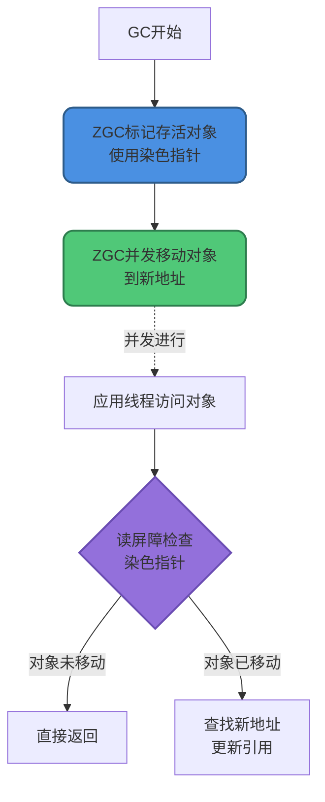

## ZGC工作流程

ZGC的垃圾回收过程高度并发化:

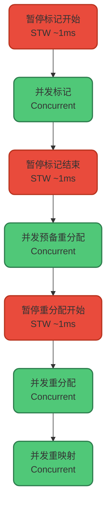

### 各阶段详解

**1. 暂停标记开始(Pause Mark Start):**
- STW时间: ~1ms
- 扫描GC Roots
- 初始化标记状态

**2. 并发标记(Concurrent Mark):**
- 与应用线程并发执行
- 遍历对象图,标记存活对象
- 使用染色指针记录状态

**3. 暂停标记结束(Pause Mark End):**
- STW时间: ~1ms
- 处理标记过程中的引用更新
- 完成最终标记

**4. 并发预备重分配(Concurrent Prepare for Relocate):**
- 选择需要回收的页面
- 统计存活对象
- 准备重定位数据结构

**5. 暂停重分配开始(Pause Relocate Start):**
- STW时间: ~1ms
- 扫描根集合,重定位根直接引用的对象

**6. 并发重分配(Concurrent Relocate):**
- 移动存活对象到新位置
- 通过读屏障处理应用的对象访问
- 应用线程并发运行

**7. 并发重映射(Concurrent Remap):**
- 修正所有指向旧地址的引用
- 可以与下次GC的标记阶段合并
- 完全并发,无停顿

## ZGC vs G1 vs CMS

三款收集器的全面对比:

| 特性 | CMS | G1 | ZGC |
|------|-----|-----|-----|
| **JDK版本** | JDK 1.8(JDK 14移除) | JDK 1.7+(JDK 9+默认) | JDK 11+(JDK 15正式) |
| **设计目标** | 低延迟 | 可预测停顿+吞吐量平衡 | 极低延迟+超大堆 |
| **停顿时间** | 数十到数百毫秒 | 可预测,通常10-200ms | &lt;10ms(JDK 21: &lt;1ms) |
| **分代策略** | 物理分代(年轻代+老年代) | 逻辑分代(Region) | 非分代(JDK 21+支持分代) |
| **回收范围** | 仅老年代 | 整堆 | 整堆 |
| **GC算法** | 标记-清除 | 区域化标记-整理 | 标记-复制+并发整理 |
| **内存碎片** | 会产生 | 不产生 | 不产生 |
| **可预测性** | 不可预测 | 可预测 | 高度可预测 |
| **堆大小建议** | 2-4GB | 4GB以上 | 支持TB级别 |
| **核心技术** | 三色标记 | 三色标记+Region | 染色指针+读屏障 |
| **CPU开销** | 中等 | 中等 | 较低(高度并发) |
| **吞吐量** | 较高 | 高 | 高 |

### 停顿时间对比

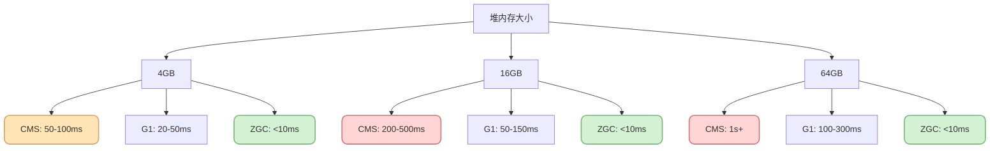

## ZGC适用场景

### 超大内存应用

```java
// 金融交易系统 - 需要大量内存缓存
public class TradingPlatform {
    
    // 使用32GB堆内存缓存市场数据
    private Map&lt;String, MarketData&gt; marketCache;
    
    // 使用16GB缓存历史交易
    private Map&lt;String, List&lt;Trade&gt;&gt; tradeHistory;
    
    // ZGC优势:即使堆达到48GB,GC停顿仍&lt;10ms
    // 不会因为GC导致交易延迟
    
    public void processTrade(TradeRequest request) {
        // 要求:99.99%交易在10ms内完成
        // ZGC保证GC不会成为瓶颈
        executeTrade(request);
    }
}
```

### 低延迟要求的实时系统

```java
// 在线游戏服务器
public class GameServer {
    
    // 要求:服务器Tick rate为60Hz
    // 每帧必须在16ms内完成
    public void gameLoop() {
        while (running) {
            long frameStart = System.nanoTime();
            
            // 处理玩家输入
            processPlayerInput();
            
            // 更新游戏状态
            updateGameState();
            
            // 发送更新给客户端
            broadcastUpdates();
            
            // ZGC确保:GC停顿&lt;10ms,不影响帧率
            long frameTime = System.nanoTime() - frameStart;
            // frameTime稳定在~15ms以内
        }
    }
}
```

### 延迟敏感的微服务

```java
// 支付网关服务
public class PaymentGateway {
    
    // SLA要求:
    // - P99延迟 &lt; 50ms
    // - P99.9延迟 &lt; 100ms
    
    public PaymentResponse processPayment(PaymentRequest request) {
        // ZGC保证GC停顿不超过10ms
        // 帮助满足严格的延迟SLA
        
        validateRequest(request);
        
        // 调用第三方支付接口
        ThirdPartyResponse response = callPaymentProvider(request);
        
        return buildResponse(response);
    }
}
```

### 大数据实时分析

```java
// 实时数据分析平台
public class StreamAnalytics {
    
    // 处理每秒百万级事件
    private StreamProcessor&lt;Event&gt; processor;
    
    public void processEventStream() {
        // 需要大内存缓存中间状态
        // 要求低延迟以保证实时性
        
        processor.process(event -&gt; {
            // 复杂的实时聚合计算
            aggregateMetrics(event);
            
            // ZGC确保:即使内存压力大
            // GC也不会导致数据处理延迟
            updateDashboard();
        });
    }
}
```

## ZGC使用配置

### 基础启用

```bash
# JDK 11-14 (实验阶段)
java -XX:+UnlockExperimentalVMOptions -XX:+UseZGC -Xmx16g Application

# JDK 15+ (正式版本)
java -XX:+UseZGC -Xmx16g Application

# JDK 21+ (分代ZGC)
java -XX:+UseZGC -XX:+ZGenerational -Xmx16g Application
```

### 常用参数

```bash
# 堆大小配置
-Xms8g -Xmx8g              # 固定堆大小,推荐

# 并发GC线程数
-XX:ConcGCThreads=4        # 默认根据CPU核心数自动设置

# 并发标记周期触发阈值
-XX:ZAllocationSpikeTolerance=2  # 分配突发容忍度

# 探测未使用内存
-XX:ZUncommitDelay=300     # 300秒后归还未使用内存给OS

# GC日志(JDK 9+)
-Xlog:gc*:file=gc.log:time,level,tags
```

### 监控与调优

关键监控指标:

```bash
# 查看ZGC统计信息
jstat -gc <pid> 1000

# 使用JFR记录ZGC事件
jcmd <pid> JFR.start name=zgc settings=profile filename=zgc.jfr
```

重点关注:
- 停顿时间是否满足目标
- 并发阶段CPU使用率
- 堆内存使用趋势
- GC频率

## 限制与注意事项

虽然ZGC很强大,但也有一些限制:

### 平台限制

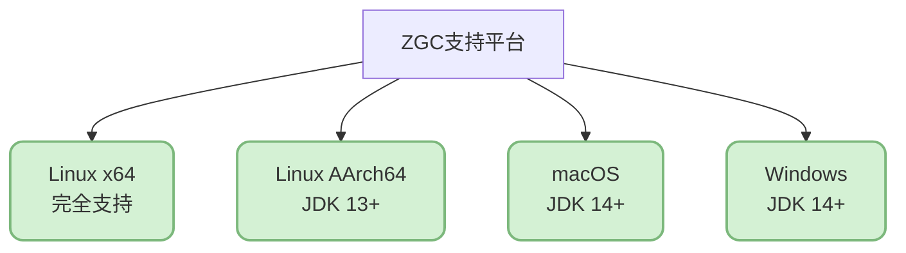

### 不支持特性

- **不支持压缩指针**: ZGC使用染色指针,无法与压缩指针共存
- **不支持类卸载**: 早期版本不支持(后续版本已改进)

### 性能权衡

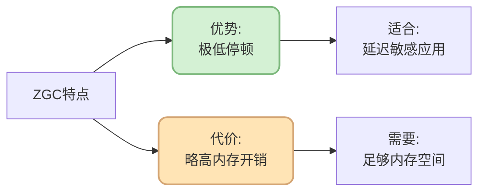

ZGC会使用更多内存来维护染色指针和元数据,通常建议:
- 为ZGC预留比其他GC多20-30%的堆空间
- 确保系统有足够的物理内存

## 小结

ZGC是JVM垃圾回收技术的重大突破,通过染色指针和读屏障等创新技术,实现了亚毫秒级的停顿时间,且不受堆大小影响。

**核心要点:**

- **极低停顿**: &lt;10ms,JDK 21分代ZGC可达&lt;1ms
- **超大堆支持**: 最大支持16TB堆内存
- **高度并发**: 几乎所有GC工作都与应用并发执行
- **核心技术**: 染色指针 + 读屏障
- **适用场景**: 超大内存、低延迟、实时系统

**选择建议:**

- 堆 &lt; 4GB: 考虑Parallel或G1
- 堆 4-32GB: G1是不错的选择
- 堆 &gt; 32GB: 强烈推荐ZGC
- 严格延迟要求: 首选ZGC

在下一篇文章中,我们将对比不同Java版本的GC演进,帮助你了解JVM垃圾回收技术的发展历程。

## 参考资料

- [JEP 333: ZGC: A Scalable Low-Latency Garbage Collector](https://openjdk.org/jeps/333)
- [JEP 439: Generational ZGC](https://openjdk.org/jeps/439)
- [JEP 490: ZGC: Remove the Non-Generational Mode](https://openjdk.org/jeps/490)
- [The Z Garbage Collector - Oracle文档](https://wiki.openjdk.org/display/zgc)
- 《深入理解Java虚拟机:JVM高级特性与最佳实践(第3版)》- 周志明
