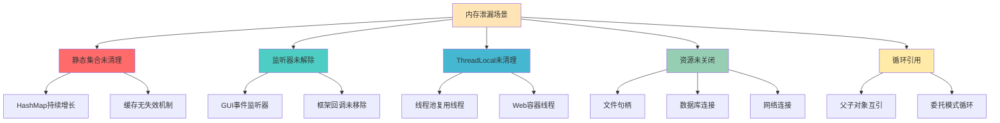
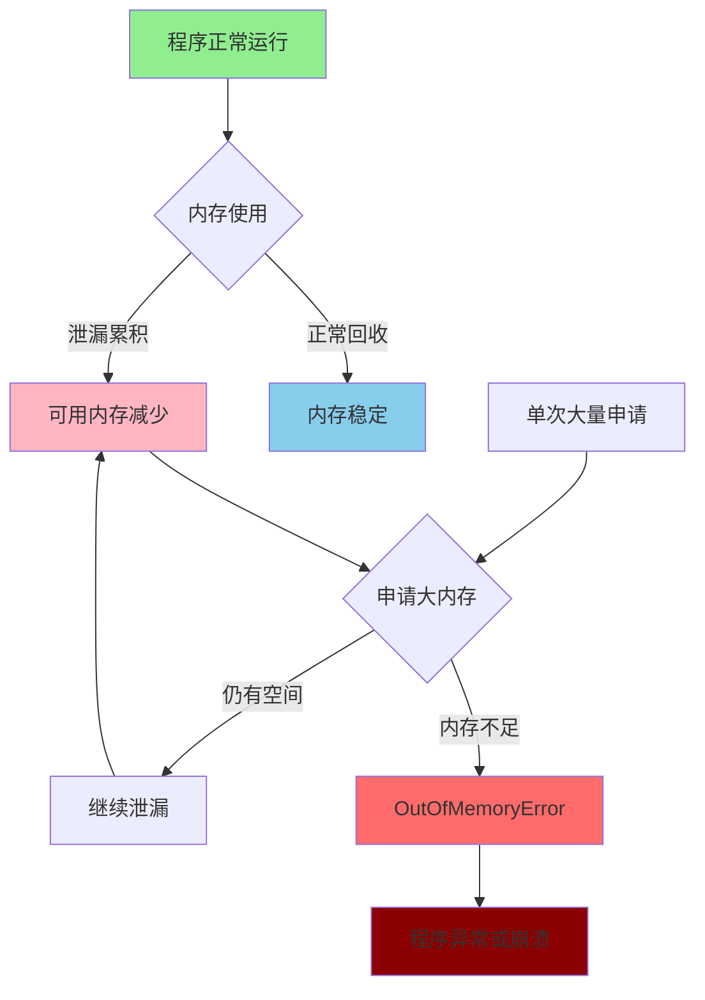
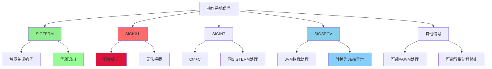

# 内存异常处理与JVM稳定性保障

## 内存异常的本质理解

在Java应用开发中,内存相关的问题往往是最具挑战性的。本文将深入分析内存泄漏、内存溢出以及JVM异常处理机制,帮助开发者建立全面的内存问题排查和预防体系。

## 内存泄漏与内存溢出的区别

### 内存泄漏(Memory Leak)的深度剖析

内存泄漏指程序中已经不需要的对象无法被垃圾回收器正常回收,导致内存使用量持续增长的现象。

```java
// 客户关系管理系统内存泄漏案例
public class CustomerManagementService {
    
    // 问题1: 静态集合导致的内存泄漏
    private static final Map<String, Customer> customerCache = new HashMap<>();
    private static final List<EventListener> eventListeners = new ArrayList<>();
    
    public void registerCustomer(Customer customer) {
        // 客户信息被添加到静态缓存中
        customerCache.put(customer.getId(), customer);
        
        // 问题: 客户对象永远不会被移除,即使业务上不再需要
        // 随着客户数量增长,内存使用量持续上升
    }
    
    // 问题2: 事件监听器泄漏
    public void addCustomerEventListener(CustomerEventListener listener) {
        eventListeners.add(listener);
        
        // 问题: 监听器没有移除机制
        // 即使监听器所在的组件被销毁,监听器对象仍被持有
    }
    
    // 问题3: 线程局部变量泄漏  
    private static final ThreadLocal<DatabaseConnection> connectionHolder = new ThreadLocal<>();
    
    public void processCustomerRequest(CustomerRequest request) {
        DatabaseConnection conn = createConnection();
        connectionHolder.set(conn);
        
        try {
            // 处理业务逻辑
            handleRequest(request);
        } finally {
            // 忘记清理ThreadLocal,在线程池环境中会导致泄漏
            // connectionHolder.remove(); // 应该添加这行
        }
    }
}
```

**内存泄漏的常见场景:**



### 内存溢出(Out Of Memory)的触发机制

内存溢出是指程序申请内存时,可用内存空间不足以满足请求的情况:

```java
// 大数据处理系统内存溢出示例
public class BigDataProcessor {
    
    // 堆内存溢出示例
    public void processLargeDataset() {
        try {
            List<DataRecord> records = new ArrayList<>();
            
            // 不断创建大对象,直到堆内存耗尽
            for (int i = 0; i < Integer.MAX_VALUE; i++) {
                // 每个DataRecord包含大量数据(比如100KB)
                DataRecord record = new DataRecord(generateLargeData());
                records.add(record);
                
                // 当堆内存不足时,会抛出OutOfMemoryError: Java heap space
            }
            
        } catch (OutOfMemoryError e) {
            // OOM发生时的处理
            System.err.println("堆内存溢出: " + e.getMessage());
            
            // 尝试释放内存
            System.gc(); // 建议进行垃圾回收
            
            // 记录内存使用情况
            logMemoryUsage();
            
            // 重要: OOM是Error,不是Exception,程序可以继续运行
            handleOOM();
        }
    }
    
    // 栈溢出示例
    public void recursiveCalculation(int depth) {
        try {
            if (depth > 0) {
                // 递归调用导致栈帧持续增加
                recursiveCalculation(depth - 1);
            }
        } catch (StackOverflowError e) {
            // 栈空间耗尽
            System.err.println("栈溢出,递归深度过大: " + depth);
            
            // 栈溢出后需要终止递归
            return;
        }
    }
    
    // 元空间溢出示例(JDK 8+)
    public void dynamicClassGeneration() {
        try {
            ClassGenerator generator = new ClassGenerator();
            
            // 不断动态生成类,直到元空间耗尽
            for (int i = 0; i < 100000; i++) {
                String className = "GeneratedClass" + i;
                Class<?> clazz = generator.generateClass(className);
                
                // 每个类的元数据存储在元空间
                // 当元空间不足时: OutOfMemoryError: Metaspace
            }
            
        } catch (OutOfMemoryError e) {
            if (e.getMessage().contains("Metaspace")) {
                System.err.println("元空间溢出: " + e.getMessage());
                handleMetaspaceOOM();
            }
        }
    }
}
```

### 内存泄漏与溢出的关联关系



**关键洞察:**
> 内存泄漏是渐进性的问题,通过持续消耗可用内存最终可能导致内存溢出。内存溢出可能由泄漏引起,也可能由单次大量内存申请引起。

## JVM异常处理与稳定性

### JVM信号处理机制

JVM作为操作系统进程,需要处理各种系统信号以维持稳定性:

```java
// JVM信号处理演示
public class JVMStabilityDemo {
    
    public static void main(String[] args) {
        // 注册关闭钩子,优雅处理SIGTERM信号
        Runtime.getRuntime().addShutdownHook(new Thread(() -> {
            System.out.println("接收到关闭信号,正在清理资源...");
            cleanupResources();
            System.out.println("资源清理完成");
        }));
        
        System.out.println("应用程序启动,PID: " + ProcessHandle.current().pid());
        
        // 模拟长期运行的服务
        startLongRunningService();
    }
    
    private static void startLongRunningService() {
        while (true) {
            try {
                // 模拟业务处理
                processBusinessLogic();
                Thread.sleep(1000);
                
            } catch (OutOfMemoryError oom) {
                // OOM不会导致JVM立即退出
                System.err.println("内存溢出,尝试恢复: " + oom.getMessage());
                handleOutOfMemory();
                
            } catch (StackOverflowError soe) {
                // 栈溢出也不会导致JVM退出
                System.err.println("栈溢出,线程继续运行: " + soe.getMessage());
                
            } catch (Exception e) {
                // 普通异常更不会影响JVM
                System.err.println("业务异常: " + e.getMessage());
            }
        }
    }
    
    private static void handleOutOfMemory() {
        // OOM恢复策略
        System.gc(); // 强制垃圾回收
        
        // 清理缓存
        clearCaches();
        
        // 降级服务
        enableLowMemoryMode();
        
        // 监控内存使用
        reportMemoryUsage();
    }
}
```

**JVM处理的关键信号:**

| 信号 | 描述 | JVM处理 | 影响 |
|------|------|---------|------|
| SIGSEGV | 段错误,非法内存访问 | 转换为异常(如NPE) | 线程级异常 |
| SIGBUS | 总线错误,内存对齐问题 | 转换为异常 | 线程级异常 |
| SIGILL | 非法指令 | 转换为异常 | 线程级异常 |
| SIGFPE | 浮点异常 | 转换为ArithmeticException | 线程级异常 |
| SIGTERM | 终止信号 | 触发关闭钩子 | 优雅退出 |
| SIGKILL | 强制杀死 | 无法拦截 | 进程强制终止 |

### OOM对JVM稳定性的影响

```java
// 多线程环境下的OOM影响分析
public class OOMStabilityAnalysis {
    
    private final ExecutorService executor = Executors.newFixedThreadPool(10);
    private final AtomicInteger successCount = new AtomicInteger(0);
    private final AtomicInteger oomCount = new AtomicInteger(0);
    
    public void simulateOOMScenarios() {
        // 模拟多线程环境下的OOM场景
        for (int i = 0; i < 50; i++) {
            final int taskId = i;
            
            executor.submit(() -> {
                try {
                    if (taskId % 5 == 0) {
                        // 某些线程故意触发OOM
                        triggerOutOfMemoryError();
                    } else {
                        // 其他线程正常处理业务
                        processNormalBusiness();
                    }
                    
                    successCount.incrementAndGet();
                    
                } catch (OutOfMemoryError oom) {
                    oomCount.incrementAndGet();
                    
                    // 关键发现: OOM只影响当前线程,不影响其他线程
                    System.err.printf("线程 %d 发生OOM,但其他线程继续运行%n", taskId);
                    
                    // 线程可以从OOM中恢复
                    handleThreadLevelOOM();
                    
                } catch (Exception e) {
                    System.err.printf("线程 %d 发生异常: %s%n", taskId, e.getMessage());
                }
            });
        }
        
        // 等待所有任务完成
        executor.shutdown();
        try {
            executor.awaitTermination(30, TimeUnit.SECONDS);
        } catch (InterruptedException e) {
            Thread.currentThread().interrupt();
        }
        
        // 输出统计结果
        System.out.printf("成功任务: %d, OOM任务: %d%n", 
            successCount.get(), oomCount.get());
        System.out.println("JVM依然运行正常,证明OOM不会导致进程崩溃");
    }
    
    private void triggerOutOfMemoryError() {
        // 故意触发OOM
        List<byte[]> memoryHog = new ArrayList<>();
        while (true) {
            memoryHog.add(new byte[1024 * 1024]); // 1MB数组
        }
    }
    
    private void processNormalBusiness() {
        // 正常业务逻辑
        for (int i = 0; i < 1000; i++) {
            String data = "处理数据" + i;
            // 模拟数据处理
        }
    }
    
    private void handleThreadLevelOOM() {
        // 线程级OOM恢复
        System.gc();
        
        try {
            Thread.sleep(100); // 给GC一些时间
        } catch (InterruptedException e) {
            Thread.currentThread().interrupt();
        }
    }
}
```

## JVM退出条件分析

### 正常退出场景

```java
// JVM正常退出场景演示
public class JVMExitScenarios {
    
    // 场景1: 主线程和所有非守护线程结束
    public static void demonstrateNormalExit() {
        System.out.println("主线程开始执行");
        
        // 创建用户线程
        Thread userThread = new Thread(() -> {
            try {
                Thread.sleep(2000);
                System.out.println("用户线程执行完成");
            } catch (InterruptedException e) {
                Thread.currentThread().interrupt();
            }
        });
        userThread.start();
        
        // 创建守护线程
        Thread daemonThread = new Thread(() -> {
            while (true) {
                System.out.println("守护线程仍在运行...");
                try {
                    Thread.sleep(500);
                } catch (InterruptedException e) {
                    break;
                }
            }
        });
        daemonThread.setDaemon(true);
        daemonThread.start();
        
        System.out.println("主线程结束");
        // 当主线程和userThread都结束时,JVM退出
        // 守护线程会被强制终止
    }
    
    // 场景2: 显式调用System.exit()
    public static void demonstrateExplicitExit() {
        System.out.println("准备显式退出JVM");
        
        // 注册关闭钩子
        Runtime.getRuntime().addShutdownHook(new Thread(() -> {
            System.out.println("执行关闭钩子清理逻辑");
            cleanupApplicationResources();
        }));
        
        // 模拟一些业务逻辑
        performBusinessLogic();
        
        // 显式退出,状态码0表示正常退出
        System.exit(0);
    }
    
    // 场景3: Runtime.halt()强制退出
    public static void demonstrateForcedExit() {
        System.out.println("准备强制退出JVM");
        
        Runtime.getRuntime().addShutdownHook(new Thread(() -> {
            System.out.println("这个钩子不会被执行");
        }));
        
        // halt()不会执行关闭钩子,立即终止JVM
        Runtime.getRuntime().halt(1);
    }
}
```

### 异常退出与错误处理

```java
// 系统级错误处理
public class SystemErrorHandling {
    
    // 场景4: 系统级错误导致退出
    public static void handleSystemErrors() {
        // 注册未捕获异常处理器
        Thread.setDefaultUncaughtExceptionHandler((thread, exception) -> {
            System.err.printf("线程 %s 发生未捕获异常: %s%n", 
                thread.getName(), exception.getMessage());
            
            if (exception instanceof OutOfMemoryError) {
                handleGlobalOOM((OutOfMemoryError) exception);
            } else if (isSystemCriticalError(exception)) {
                // 系统级别错误,考虑退出JVM
                performEmergencyShutdown();
            }
        });
        
        // 启动多个业务线程
        for (int i = 0; i < 5; i++) {
            final int threadId = i;
            new Thread(() -> {
                try {
                    simulateBusinessLogic(threadId);
                } catch (Exception e) {
                    // 业务异常不应导致JVM退出
                    System.err.println("业务异常,线程继续运行: " + e.getMessage());
                }
            }, "BusinessThread-" + i).start();
        }
    }
    
    private static void handleGlobalOOM(OutOfMemoryError oom) {
        System.err.println("检测到全局OOM,执行紧急处理");
        
        // 尝试释放内存
        clearAllCaches();
        System.gc();
        
        // 记录内存快照
        dumpMemorySnapshot();
        
        // 决定是否需要重启
        if (isRecoveryPossible()) {
            System.out.println("OOM恢复成功,继续运行");
        } else {
            System.err.println("无法从OOM恢复,需要重启应用");
            performGracefulShutdown();
        }
    }
    
    private static boolean isSystemCriticalError(Throwable t) {
        // 判断是否为系统级别的致命错误
        return t instanceof VirtualMachineError ||
               t instanceof InternalError ||
               (t instanceof Error && !(t instanceof AssertionError));
    }
}
```

### 操作系统信号对JVM的影响

```java
// 信号处理与JVM稳定性
public class SignalHandlingDemo {
    
    public static void main(String[] args) {
        // 不同信号对JVM的影响
        System.out.println("JVM进程PID: " + ProcessHandle.current().pid());
        System.out.println("可以使用以下命令测试信号处理:");
        System.out.println("  kill -TERM <pid>  # 优雅关闭");
        System.out.println("  kill -9 <pid>    # 强制杀死");
        System.out.println("  kill -USR1 <pid> # 用户自定义信号");
        
        // 模拟长时间运行的应用
        CountDownLatch latch = new CountDownLatch(1);
        
        // 注册关闭钩子处理SIGTERM
        Runtime.getRuntime().addShutdownHook(new Thread(() -> {
            System.out.println("\n收到关闭信号,开始优雅关闭...");
            
            // 停止接收新请求
            stopAcceptingNewRequests();
            
            // 等待现有请求完成
            waitForActiveRequestsToComplete();
            
            // 释放资源
            releaseSystemResources();
            
            System.out.println("优雅关闭完成");
            latch.countDown();
        }));
        
        try {
            // 模拟应用运行
            System.out.println("应用运行中,按Ctrl+C测试优雅关闭...");
            latch.await();
            
        } catch (InterruptedException e) {
            Thread.currentThread().interrupt();
        }
    }
}
```

**信号影响总结:**



## 内存问题排查实战

### OOM问题诊断流程

```java
// 内存问题诊断工具类
public class MemoryDiagnostics {
    
    private static final MemoryMXBean memoryBean = ManagementFactory.getMemoryMXBean();
    private static final List<GarbageCollectorMXBean> gcBeans = 
        ManagementFactory.getGarbageCollectorMXBeans();
    
    // 内存使用情况监控
    public static void monitorMemoryUsage() {
        Timer timer = new Timer(true);
        timer.scheduleAtFixedRate(new TimerTask() {
            @Override
            public void run() {
                printMemoryStatus();
                checkMemoryPressure();
            }
        }, 0, 5000); // 每5秒检查一次
    }
    
    private static void printMemoryStatus() {
        MemoryUsage heapUsage = memoryBean.getHeapMemoryUsage();
        MemoryUsage nonHeapUsage = memoryBean.getNonHeapMemoryUsage();
        
        System.out.printf("[%s] 堆内存: %d/%d MB (%.1f%%), 非堆内存: %d MB%n",
            LocalDateTime.now(),
            heapUsage.getUsed() / 1024 / 1024,
            heapUsage.getMax() / 1024 / 1024,
            (double) heapUsage.getUsed() / heapUsage.getMax() * 100,
            nonHeapUsage.getUsed() / 1024 / 1024);
    }
    
    private static void checkMemoryPressure() {
        MemoryUsage heapUsage = memoryBean.getHeapMemoryUsage();
        double usageRatio = (double) heapUsage.getUsed() / heapUsage.getMax();
        
        if (usageRatio > 0.9) {
            System.err.println("⚠️ 内存使用率超过90%,可能存在内存泄漏!");
            
            // 分析GC情况
            analyzeGCBehavior();
            
            // 生成内存快照建议
            suggestHeapDump();
        }
    }
    
    private static void analyzeGCBehavior() {
        for (GarbageCollectorMXBean gcBean : gcBeans) {
            long collections = gcBean.getCollectionCount();
            long time = gcBean.getCollectionTime();
            
            System.out.printf("GC[%s]: %d次, 总耗时: %dms%n", 
                gcBean.getName(), collections, time);
            
            // 判断GC是否频繁
            if (collections > 0 && time / collections > 100) {
                System.err.println("⚠️ GC平均耗时过长,可能存在性能问题");
            }
        }
    }
    
    private static void suggestHeapDump() {
        String pid = String.valueOf(ProcessHandle.current().pid());
        String timestamp = LocalDateTime.now().format(DateTimeFormatter.ofPattern("yyyyMMdd_HHmmss"));
        String filename = String.format("heapdump_%s_%s.hprof", pid, timestamp);
        
        System.out.println("建议生成堆内存快照用于分析:");
        System.out.println("  jmap -dump:format=b,file=" + filename + " " + pid);
        System.out.println("  或使用JVM参数: -XX:+HeapDumpOnOutOfMemoryError");
    }
    
    // 内存泄漏检测
    public static class MemoryLeakDetector {
        private final Map<String, Long> previousMemoryUsage = new HashMap<>();
        
        public void detectMemoryLeak() {
            for (MemoryPoolMXBean pool : ManagementFactory.getMemoryPoolMXBeans()) {
                String poolName = pool.getName();
                long currentUsage = pool.getUsage().getUsed();
                
                Long previousUsage = previousMemoryUsage.get(poolName);
                if (previousUsage != null) {
                    long delta = currentUsage - previousUsage;
                    double growthRate = (double) delta / previousUsage * 100;
                    
                    if (growthRate > 10 && delta > 10 * 1024 * 1024) { // 增长超过10MB且增长率>10%
                        System.err.printf("⚠️ 内存池[%s]疑似泄漏: 增长 %d MB (%.1f%%)%n", 
                            poolName, delta / 1024 / 1024, growthRate);
                    }
                }
                
                previousMemoryUsage.put(poolName, currentUsage);
            }
        }
    }
}
```

### 预防和恢复策略

```java
// 内存问题预防与恢复
public class MemoryResilience {
    
    // 断路器模式防止OOM
    public static class MemoryCircuitBreaker {
        private final double memoryThreshold = 0.85; // 85%内存使用率阈值
        private volatile boolean isOpen = false;
        private final AtomicLong lastCheckTime = new AtomicLong(0);
        
        public boolean isMemoryAvailable() {
            long now = System.currentTimeMillis();
            
            // 每秒检查一次
            if (now - lastCheckTime.get() > 1000) {
                checkMemoryStatus();
                lastCheckTime.set(now);
            }
            
            return !isOpen;
        }
        
        private void checkMemoryStatus() {
            MemoryUsage heapUsage = ManagementFactory.getMemoryMXBean().getHeapMemoryUsage();
            double usageRatio = (double) heapUsage.getUsed() / heapUsage.getMax();
            
            if (usageRatio > memoryThreshold && !isOpen) {
                isOpen = true;
                System.err.println("内存断路器开启,拒绝新的内存密集型操作");
                
                // 触发内存清理
                triggerEmergencyCleanup();
                
            } else if (usageRatio < memoryThreshold - 0.1 && isOpen) {
                isOpen = false;
                System.out.println("内存压力缓解,断路器关闭");
            }
        }
        
        private void triggerEmergencyCleanup() {
            // 清理缓存
            CacheManager.clearAllCaches();
            
            // 建议垃圾回收
            System.gc();
            
            // 降级非关键功能
            FeatureToggle.disableNonCriticalFeatures();
        }
    }
    
    // 优雅降级服务
    public static class GracefulDegradationService {
        private final MemoryCircuitBreaker circuitBreaker = new MemoryCircuitBreaker();
        
        public ProcessingResult processRequest(Request request) {
            if (!circuitBreaker.isMemoryAvailable()) {
                // 内存不足时的降级处理
                return handleDegradedMode(request);
            }
            
            try {
                // 正常处理逻辑
                return processNormally(request);
                
            } catch (OutOfMemoryError oom) {
                // OOM恢复策略
                return handleOOMRecovery(request, oom);
            }
        }
        
        private ProcessingResult handleDegradedMode(Request request) {
            // 降级策略:
            // 1. 使用轻量级算法
            // 2. 减少数据处理量
            // 3. 返回缓存结果
            // 4. 异步处理请求
            
            return new ProcessingResult("降级处理完成", ProcessingStatus.DEGRADED);
        }
        
        private ProcessingResult handleOOMRecovery(Request request, OutOfMemoryError oom) {
            System.err.println("处理请求时发生OOM,启动恢复流程");
            
            // 立即释放资源
            releaseTemporaryResources();
            
            // 强制垃圾回收
            System.gc();
            
            // 等待一段时间让系统恢复
            try {
                Thread.sleep(100);
            } catch (InterruptedException e) {
                Thread.currentThread().interrupt();
            }
            
            // 使用最轻量级方式重试
            return processWithMinimalMemory(request);
        }
    }
}
```

通过建立完善的内存监控、异常处理和恢复机制,我们可以显著提升Java应用的稳定性和可靠性。记住,内存问题往往是渐进性的,及早发现和处理是关键。