# JVM诊断分析工具实战

在Java应用的开发和运维过程中，性能问题、内存泄漏、线程死锁等故障时有发生。掌握JVM诊断工具的使用方法，能够快速定位问题根源，是每个Java工程师必备的技能。本文将深入讲解JDK自带的命令行工具和可视化工具的实战应用。

## JVM诊断工具全景图

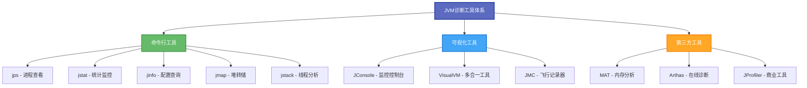

## JDK命令行工具详解

所有命令行工具都位于JDK安装目录的`bin`文件夹下，可直接在终端使用。

### jps：Java进程状态查看

`jps`（Java Virtual Machine Process Status Tool）用于列出当前系统中所有运行的Java进程。

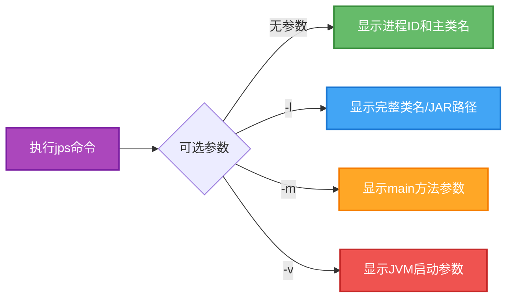

**基础使用示例：**

```bash
# 查看所有Java进程
$ jps
8234 OrderService
9156 ProductService
9832 Jps
10456 PaymentService

# 显示完整类名
$ jps -l
8234 com.example.order.OrderServiceApplication
9156 com.example.product.ProductServiceApplication
9832 sun.tools.jps.Jps
10456 com.example.payment.PaymentServiceApplication

# 查看JVM启动参数
$ jps -v
8234 OrderService -Xms2g -Xmx2g -XX:+UseG1GC

# 查看传递给main方法的参数
$ jps -m
9156 ProductService --spring.profiles.active=prod --server.port=8081
```

### jstat：虚拟机统计监控

`jstat`（JVM Statistics Monitoring Tool）实时监控JVM运行状态，包括类加载、内存、GC等信息。

**命令格式：**

```bash
jstat -<option> [-t] [-h<lines>] <vmid> [<interval> [<count>]]
```

- `option`：统计选项（gc、gcutil、class等）
- `-t`：输出时间戳列
- `-h<lines>`：每隔多少行输出一次表头
- `vmid`：虚拟机进程ID
- `interval`：查询间隔（毫秒）
- `count`：查询次数

**常用统计选项：**

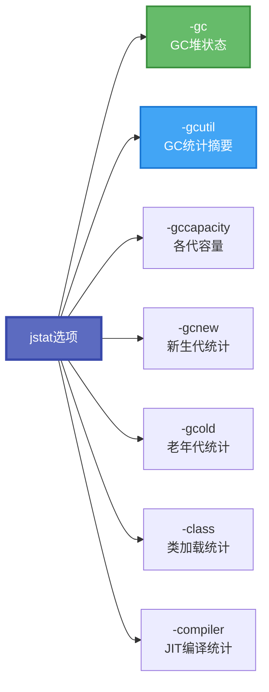

**实战示例：监控GC情况**

```bash
# 每隔2秒输出一次GC统计，共输出5次，每3行输出表头
$ jstat -gc -t -h3 8234 2000 5

Timestamp        S0C    S1C    S0U    S1U      EC       EU        OC         OU       MC     MU    CCSC   CCSU   YGC     YGCT    FGC    FGCT     GCT   
       156.2  25600.0 25600.0  0.0   12800.5 204800.0 156234.3  512000.0   89432.1  51200.0 48932.5 6400.0 5892.3    45    0.342     2    0.158    0.500
       158.2  25600.0 25600.0 8234.1   0.0   204800.0  98234.7  512000.0   92341.5  51200.0 49123.8 6400.0 5912.7    46    0.351     2    0.158    0.509
       160.2  25600.0 25600.0  0.0   15678.2 204800.0 178945.2  512000.0   95678.3  51200.0 49345.2 6400.0 5932.1    47    0.359     2    0.158    0.517

# 输出GC百分比统计
$ jstat -gcutil 8234 1000 3
  S0     S1     E      O      M     CCS    YGC     YGCT    FGC    FGCT     GCT   
  0.00  50.00  76.32  17.46  95.58  92.06     45    0.342     2    0.158    0.500
 32.15   0.00  48.05  18.03  95.71  92.19     46    0.351     2    0.158    0.509
  0.00  61.24  87.36  18.69  96.38  92.63     47    0.359     2    0.158    0.517
```

**字段说明：**
- **S0C/S1C**：Survivor0/1区容量（KB）
- **S0U/S1U**：Survivor0/1区已使用（KB）
- **EC/EU**：Eden区容量/已使用（KB）
- **OC/OU**：老年代容量/已使用（KB）
- **MC/MU**：元空间容量/已使用（KB）
- **YGC/YGCT**：Young GC次数/总耗时（秒）
- **FGC/FGCT**：Full GC次数/总耗时（秒）

### jinfo：配置信息查询

`jinfo`（Configuration Info for Java）用于实时查看和动态调整JVM配置参数。

**查看JVM参数：**

```bash
# 查看所有JVM参数和系统属性
$ jinfo 8234

# 查看指定参数值
$ jinfo -flag MaxHeapSize 8234
-XX:MaxHeapSize=2147483648

$ jinfo -flag UseG1GC 8234
-XX:+UseG1GC

# 查看所有可管理的参数
$ jinfo -flags 8234
```

**动态修改参数（无需重启）：**

```bash
# 开启GC日志打印
$ jinfo -flag +PrintGC 8234

# 关闭显式GC
$ jinfo -flag +DisableExplicitGC 8234

# 修改参数值
$ jinfo -flag HeapDumpPath=/tmp/dumps 8234
```

### jmap：堆内存转储

`jmap`（Memory Map for Java）生成堆内存快照文件，用于离线分析内存使用情况。

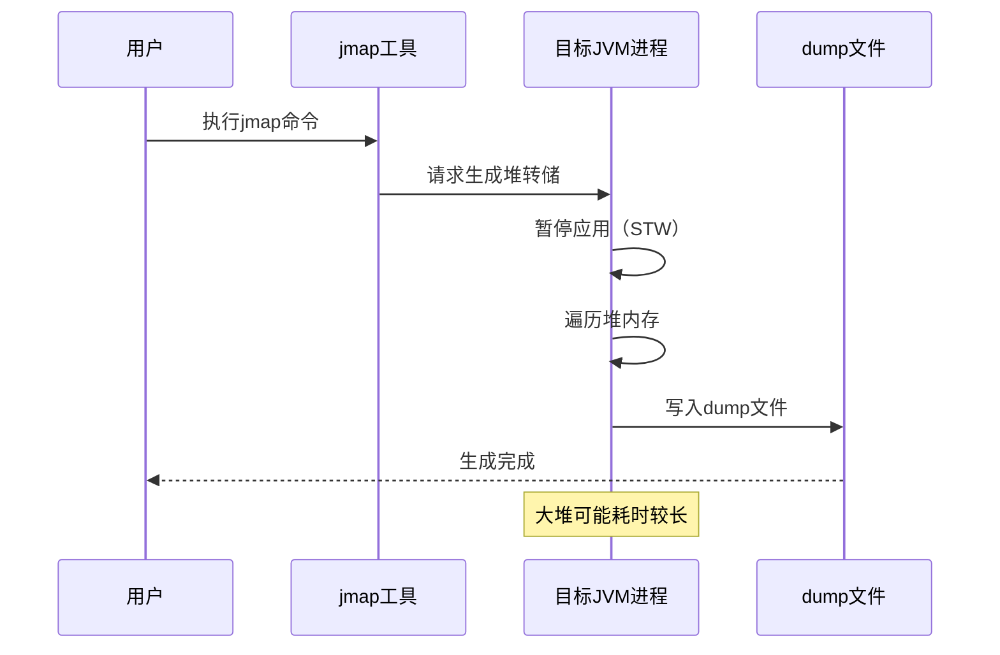

**生成堆转储文件：**

```bash
# 生成堆dump文件（二进制格式）
$ jmap -dump:format=b,file=/tmp/heap_dump.hprof 8234
Dumping heap to /tmp/heap_dump.hprof ...
Heap dump file created [1234567890 bytes in 12.345 secs]

# 仅转储存活对象（触发Full GC）
$ jmap -dump:live,format=b,file=/tmp/heap_live.hprof 8234

# 查看堆内存摘要信息
$ jmap -heap 8234
```

**查看对象统计信息：**

```bash
# 统计各类对象的数量和占用空间
$ jmap -histo 8234 | head -20

 num     #instances         #bytes  class name
----------------------------------------------
   1:        145678       23456789  [C
   2:         56789       12345678  java.lang.String
   3:         34567        8901234  java.util.HashMap$Node
   4:         23456        7890123  com.example.order.Order
   5:         12345        6789012  java.util.concurrent.ConcurrentHashMap$Node
```

### jstack：线程快照分析

`jstack`（Stack Trace for Java）生成线程堆栈快照，用于诊断死锁、线程阻塞等问题。

**线程状态分类：**

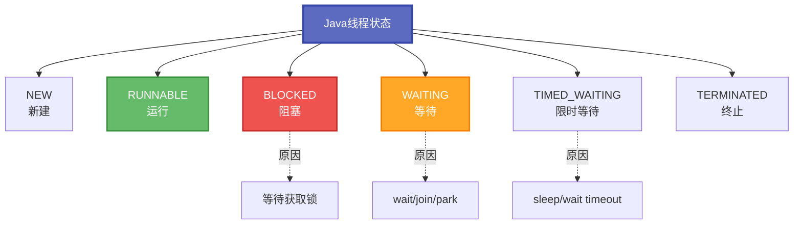

**基础使用：**

```bash
# 生成线程快照
$ jstack 8234 > thread_dump.txt

# 生成线程快照并显示锁信息
$ jstack -l 8234

# 强制生成快照（进程无响应时）
$ jstack -F 8234
```

**死锁诊断实战示例：**

假设有如下银行转账死锁场景：

```java
public class BankTransfer {
    private static final Object accountA = new Object(); // 账户A锁
    private static final Object accountB = new Object(); // 账户B锁

    public static void main(String[] args) {
        // 线程1：从A转账到B
        new Thread(() -> {
            synchronized (accountA) {
                System.out.println("Transaction-1 locked Account-A");
                try { Thread.sleep(100); } catch (InterruptedException e) {}
                
                System.out.println("Transaction-1 waiting for Account-B lock...");
                synchronized (accountB) {
                    System.out.println("Transaction-1 completed");
                }
            }
        }, "Transaction-1").start();

        // 线程2：从B转账到A
        new Thread(() -> {
            synchronized (accountB) {
                System.out.println("Transaction-2 locked Account-B");
                try { Thread.sleep(100); } catch (InterruptedException e) {}
                
                System.out.println("Transaction-2 waiting for Account-A lock...");
                synchronized (accountA) {
                    System.out.println("Transaction-2 completed");
                }
            }
        }, "Transaction-2").start();
    }
}
```

使用jstack检测死锁：

```bash
$ jstack 8234

Found one Java-level deadlock:
=============================
"Transaction-2":
  waiting to lock monitor 0x00007f8a1c004a00 (object 0x000000076ab12340, a java.lang.Object),
  which is held by "Transaction-1"
  
"Transaction-1":
  waiting to lock monitor 0x00007f8a1c004b50 (object 0x000000076ab12350, a java.lang.Object),
  which is held by "Transaction-2"

Java stack information for the threads listed above:
===================================================
"Transaction-2":
        at BankTransfer.lambda$main$1(BankTransfer.java:24)
        - waiting to lock <0x000000076ab12340> (a java.lang.Object)
        - locked <0x000000076ab12350> (a java.lang.Object)
        at java.lang.Thread.run(Thread.java:750)
        
"Transaction-1":
        at BankTransfer.lambda$main$0(BankTransfer.java:13)
        - waiting to lock <0x000000076ab12350> (a java.lang.Object)
        - locked <0x000000076ab12340> (a java.lang.Object)
        at java.lang.Thread.run(Thread.java:750)

Found 1 deadlock.
```

## JDK可视化工具实战

### JConsole：监控与管理控制台

JConsole是基于JMX（Java Management Extensions）的图形化监控工具，可直接监控本地和远程Java进程。

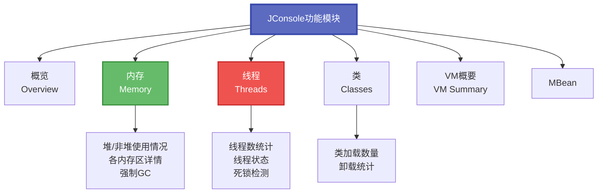

**启动JConsole：**

```bash
# 启动JConsole
$ jconsole

# 或在JDK目录下直接运行
$ $JAVA_HOME/bin/jconsole
```

**远程监控配置：**

在目标Java应用启动时添加JMX参数：

```bash
java -Dcom.sun.management.jmxremote \
     -Dcom.sun.management.jmxremote.port=9999 \
     -Dcom.sun.management.jmxremote.authenticate=false \
     -Dcom.sun.management.jmxremote.ssl=false \
     -Djava.rmi.server.hostname=192.168.1.100 \
     -jar application.jar
```

然后在JConsole中输入远程地址：`192.168.1.100:9999`

### VisualVM：多合一诊断工具

VisualVM是功能最强大的JVM可视化工具，整合了多种诊断能力。

**核心功能矩阵：**

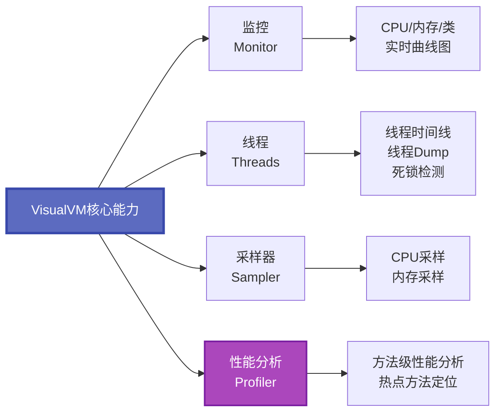

**VisualVM插件扩展：**

- **Visual GC**：可视化GC过程和各内存区变化
- **BTrace**：动态字节码追踪
- **Thread Inspector**：增强线程分析

### MAT：内存分析神器

Eclipse Memory Analyzer Tool（MAT）是专业的堆转储文件分析工具。

**MAT分析流程：**

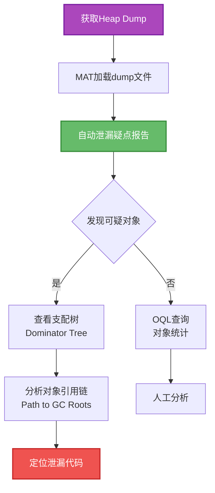

**MAT核心视图：**

1. **Histogram（直方图）**：按类统计对象数量和内存占用
2. **Dominator Tree（支配树）**：显示对象的保留堆大小
3. **Leak Suspects（泄漏疑点）**：自动分析可能的内存泄漏
4. **Top Consumers（大内存消耗者）**：快速定位占用内存最多的对象

**OQL查询示例：**

```sql
-- 查找所有String对象
SELECT * FROM java.lang.String

-- 查找长度超过1000的String
SELECT s, s.value.length FROM java.lang.String s WHERE s.value.length > 1000

-- 查找特定类的实例
SELECT * FROM com.example.order.Order WHERE status = "PENDING"
```

## 第三方诊断工具

### Arthas：阿里巴巴开源诊断利器

Arthas是功能强大的在线诊断工具，无需修改代码即可排查问题。

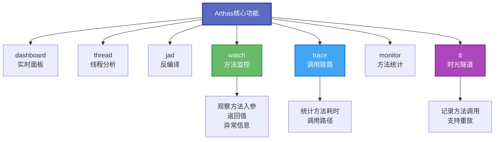

**快速启动：**

```bash
# 下载arthas启动脚本
$ curl -O https://arthas.aliyun.com/arthas-boot.jar

# 启动并选择进程
$ java -jar arthas-boot.jar
[INFO] arthas-boot version: 3.7.1
[INFO] Found existing java process, please choose one and input the serial number.
* [1]: 8234 com.example.order.OrderServiceApplication
  [2]: 9156 com.example.product.ProductServiceApplication
1
```

**常用命令示例：**

```bash
# 查看实时仪表盘
[arthas@8234]$ dashboard

# 查看最繁忙的5个线程
[arthas@8234]$ thread -n 5

# 查看线程8的堆栈
[arthas@8234]$ thread 8

# 反编译类
[arthas@8234]$ jad com.example.order.Order

# 观察方法执行（查看入参和返回值）
[arthas@8234]$ watch com.example.order.OrderService createOrder "{params, returnObj}" -x 3

# 追踪方法调用路径和耗时
[arthas@8234]$ trace com.example.order.OrderService createOrder

# 统计方法调用次数和耗时
[arthas@8234]$ monitor -c 5 com.example.order.OrderService createOrder
```

### JProfiler：商业级性能分析工具

JProfiler是功能强大的商业JVM分析工具，提供直观的可视化界面和丰富的分析功能。

**核心特性：**

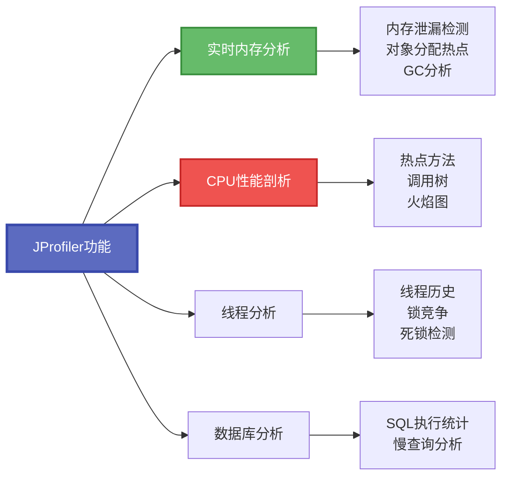

## 工具选型与组合使用策略

### 不同场景的工具选择

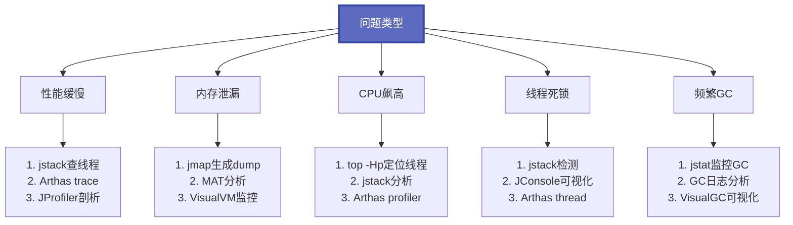

### 典型故障排查流程

**场景一：应用响应缓慢**

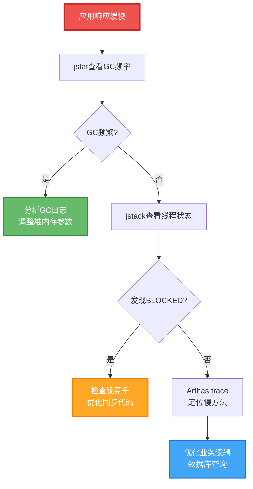

**场景二：内存持续增长**

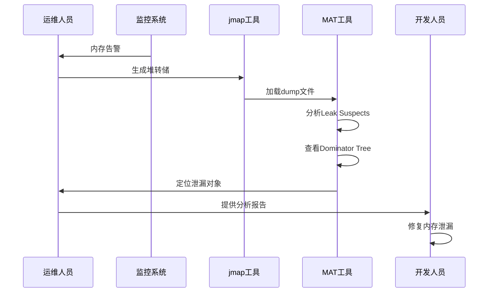

## 诊断工具最佳实践

### 命令行工具使用技巧

1. **组合使用命令**：先用`jps`定位进程，再用`jstat`监控，最后用`jmap/jstack`诊断
2. **避免频繁dump**：生成堆转储会暂停应用，生产环境需谨慎操作
3. **保留历史快照**：定期保存线程快照和GC日志，便于问题回溯
4. **自动化脚本**：编写监控脚本定时采集jstat数据，绘制趋势图

### 可视化工具使用建议

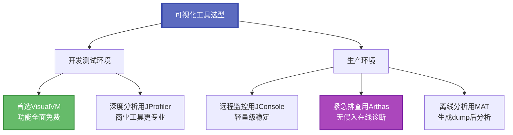

### 性能分析黄金法则

1. **先整体后局部**：先看整体资源使用（CPU、内存、GC），再深入方法级分析
2. **先现象后原因**：先观察现象（慢、OOM、死锁），再分析根本原因
3. **先工具后代码**：先用工具定位问题范围，再review代码细节
4. **对比基线数据**：记录正常状态下的性能基线，异常时对比分析
5. **生产环境谨慎**：避免使用会暂停应用的操作（如-dump:live），优先使用无侵入工具

## 实战案例：完整的性能调优流程

### 案例背景

某电商订单服务在促销期间出现响应缓慢，偶尔超时。

### 诊断步骤

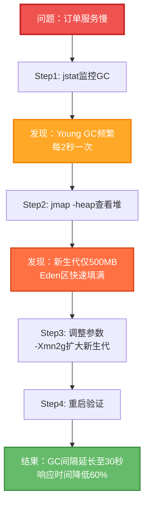

### 诊断命令记录

```bash
# 1. 查找目标进程
$ jps -l
12345 com.ecommerce.OrderService

# 2. 监控GC情况（每秒输出一次）
$ jstat -gcutil 12345 1000
  S0     S1     E      O      M     YGC    FGC    GCT
 12.50   0.00  98.76  45.23  89.34  1523     3    12.456
  0.00  15.32  23.45  45.67  89.45  1524     3    12.467
  
# 3. 查看堆配置
$ jmap -heap 12345 | grep -A 5 "NewSize"
NewSize = 524288000 (500.0MB)
MaxNewSize = 524288000 (500.0MB)

# 4. 查看当前JVM参数
$ jinfo -flags 12345 | grep Xmn
-Xmn500m

# 5. 修改启动参数后重启，再次验证
$ jstat -gcutil 12345 1000
  S0     S1     E      O      M     YGC    FGC    GCT
  8.23   0.00  34.56  28.45  87.23   45     1     2.345
```

## 工具资源与学习路径

### 官方文档

- **JDK工具指南**：[Oracle JDK Tools Reference](https://docs.oracle.com/javase/8/docs/technotes/tools/)
- **VisualVM官网**：https://visualvm.github.io/
- **MAT用户指南**：https://help.eclipse.org/latest/topic/org.eclipse.mat.ui.help/welcome.html
- **Arthas文档**：https://arthas.aliyun.com/doc/

### 推荐学习资源

1. **《Java性能权威指南》**：深入讲解JVM性能调优方法论
2. **《深入理解Java虚拟机》**：JVM原理与工具使用的经典教材
3. **GCEasy**：在线GC日志分析工具（https://gceasy.io/）
4. **FastThread**：在线线程dump分析工具（https://fastthread.io/）

## 总结

JVM诊断工具是Java应用性能调优和故障排查的利器。本文系统介绍了JDK自带的命令行工具（jps、jstat、jinfo、jmap、jstack）、可视化工具（JConsole、VisualVM）以及第三方工具（MAT、Arthas）的使用方法和实战技巧。

在实际工作中，应根据问题类型选择合适的工具组合：
- **性能问题**：jstat + Arthas trace + JProfiler
- **内存泄漏**：jmap + MAT
- **线程问题**：jstack + JConsole
- **GC调优**：GC日志 + VisualGC

掌握这些工具的使用，结合对JVM原理的深入理解，就能快速定位并解决各类生产环境问题，保障Java应用的稳定高效运行。记住，工具只是手段，理解问题本质才是关键。