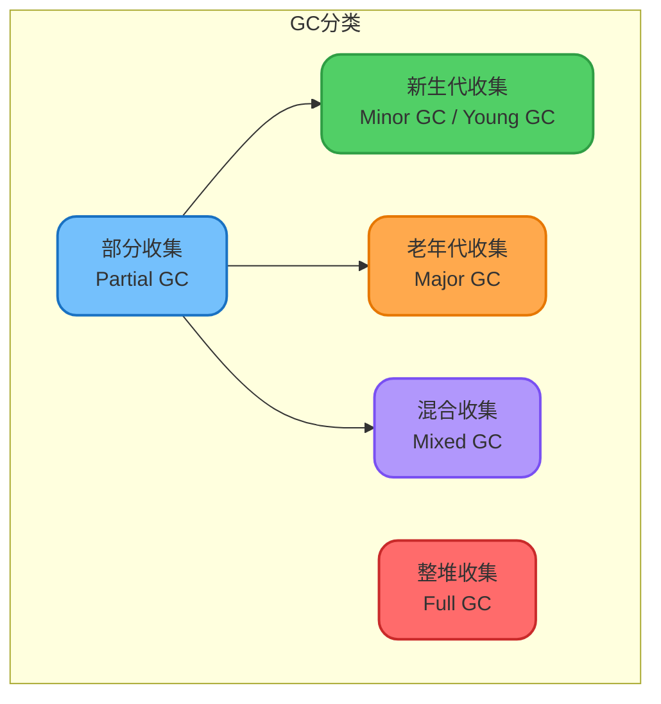
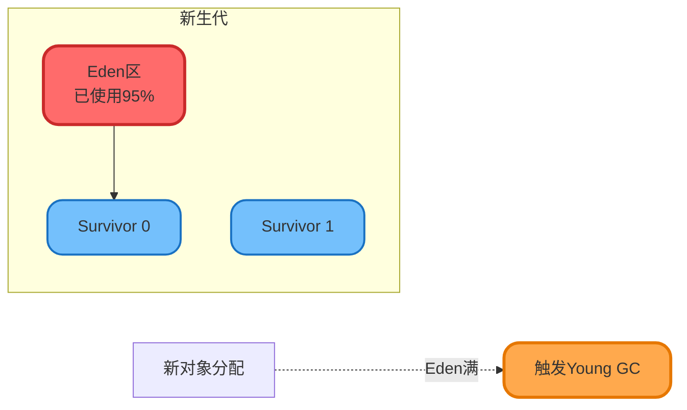
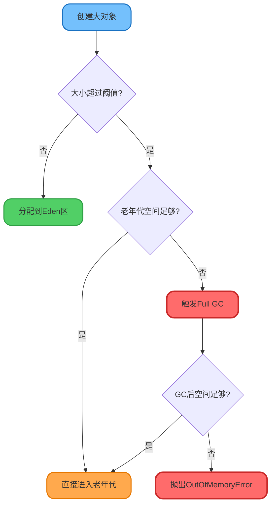
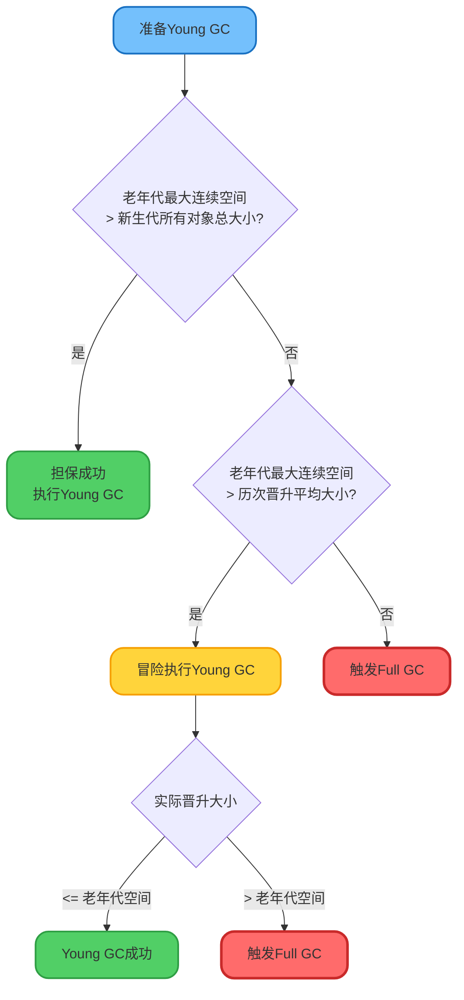
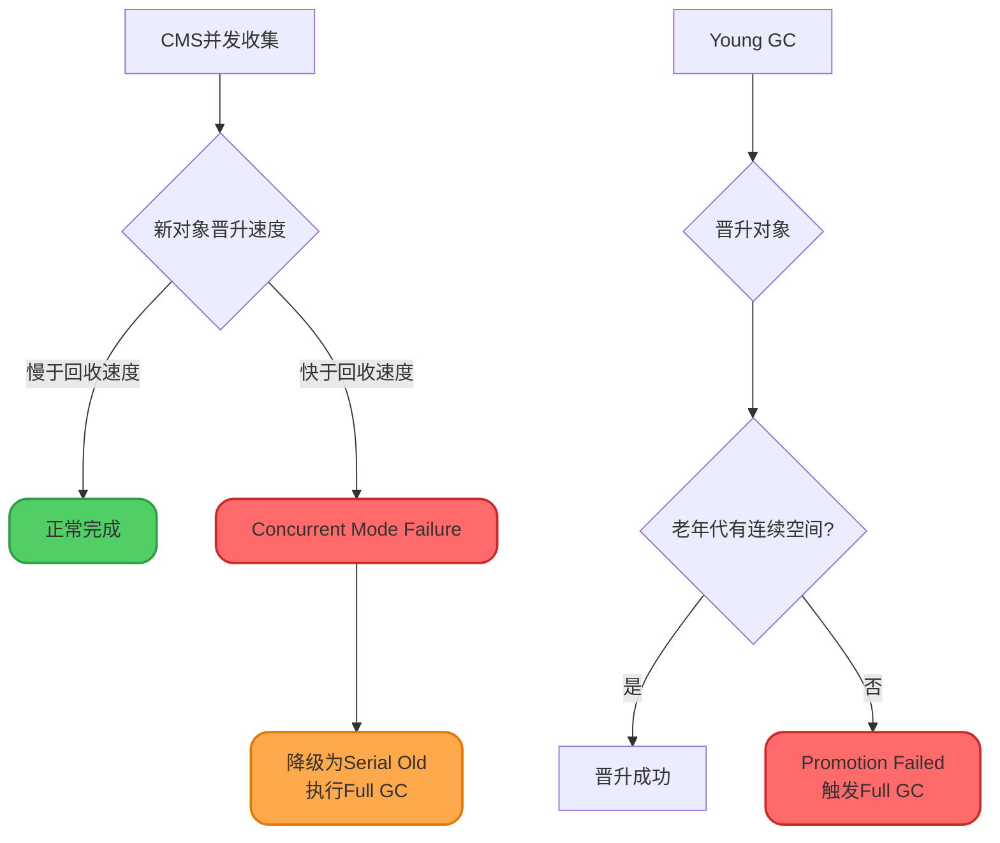
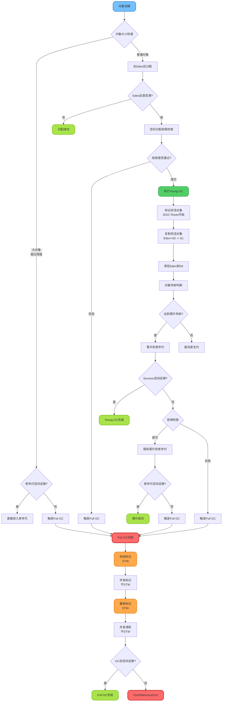
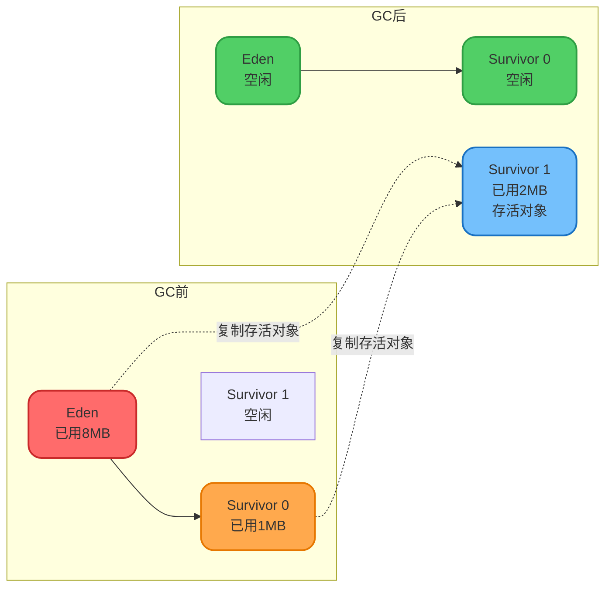
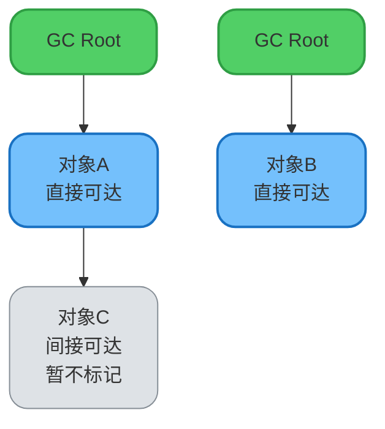
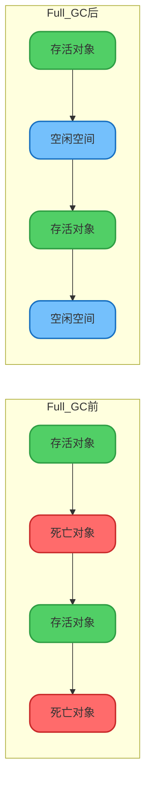
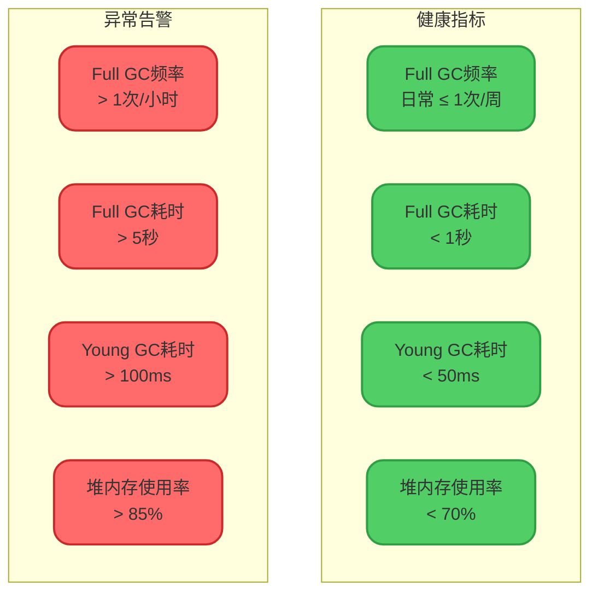

# 垃圾回收流程与触发机制

## GC的分类

在HotSpot虚拟机中,垃圾回收主要分为两大类:

### 部分收集(Partial GC)

**新生代收集(Minor GC / Young GC)**: 
- 仅对新生代进行垃圾回收
- 发生频率高,回收速度快
- 采用复制算法

**老年代收集(Major GC / Old GC)**: 
- 仅对老年代进行垃圾回收
- 在某些语境中也指代Full GC
- CMS收集器会单独回收老年代

**混合收集(Mixed GC)**: 
- 回收整个新生代和部分老年代
- G1收集器特有的收集方式

### 整堆收集(Full GC)

- 收集整个Java堆和方法区(元空间)
- 耗时长,影响应用性能
- 应尽量避免频繁Full GC



## Young GC触发条件

Young GC的触发条件非常明确:

**触发时机**: Eden区空间不足时触发



**示例场景**:

```java
public class YoungGCDemo {
    public static void main(String[] args) {
        // JVM参数: -Xms20M -Xmx20M -Xmn10M -XX:+PrintGCDetails
        
        byte[] array1 = new byte[2 * 1024 * 1024]; // 2MB
        byte[] array2 = new byte[2 * 1024 * 1024]; // 2MB
        byte[] array3 = new byte[2 * 1024 * 1024]; // 2MB
        byte[] array4 = new byte[4 * 1024 * 1024]; // 4MB
        
        // 此时Eden区(约8MB)已满,分配array4时触发Young GC
    }
}
```

## Full GC触发条件

Full GC的触发条件相对复杂,主要包括以下几种情况:

### 1. 老年代空间不足

这是最常见的Full GC触发原因,有多种具体场景:

#### 场景1: 大对象直接进入老年代

```java
public class LargeObjectDemo {
    public static void main(String[] args) {
        // JVM参数: -XX:PretenureSizeThreshold=1048576 (1MB)
        
        // 创建2MB的大对象,超过阈值,直接进入老年代
        byte[] largeArray = new byte[2 * 1024 * 1024];
        
        // 如果老年代空间不足,触发Full GC
    }
}
```



#### 场景2: Young GC后晋升对象过多

```java
public class PromotionDemo {
    public static void main(String[] args) {
        // 大量对象在Young GC后存活
        List<byte[]> list = new ArrayList<>();
        
        for (int i = 0; i < 1000; i++) {
            byte[] array = new byte[1024 * 1024]; // 1MB
            list.add(array); // 保持强引用,对象无法被回收
        }
        
        // Young GC后,大量对象需要晋升到老年代
        // 如果老年代空间不足,触发Full GC
    }
}
```

### 2. 空间分配担保失败

在进行Young GC之前,JVM会进行空间分配担保检查。

#### 空间分配担保机制

**目的**: 确保Young GC后存活对象能够顺利晋升到老年代

**检查流程**:



:::info JDK版本差异
在JDK 7及以后版本,`-XX:HandlePromotionFailure`参数已被移除。JVM会自动采用更智能的担保策略,即只检查老年代最大连续空间是否大于新生代所有对象总大小或历次晋升平均大小。
:::

### 3. 方法区(元空间)不足

当方法区空间不足时,会触发Full GC。

**JDK 7及之前(永久代)**:

```java
// 动态生成大量类,导致永久代溢出
public class MetaspaceGCDemo {
    public static void main(String[] args) {
        while (true) {
            Enhancer enhancer = new Enhancer();
            enhancer.setSuperclass(Object.class);
            enhancer.setUseCache(false);
            enhancer.setCallback(new MethodInterceptor() {
                public Object intercept(Object obj, Method method, 
                                       Object[] args, MethodProxy proxy) {
                    return proxy.invokeSuper(obj, args);
                }
            });
            enhancer.create(); // 动态创建类
            // 永久代满时触发Full GC
        }
    }
}
```

**JDK 8及之后(元空间)**:

```bash
# 限制元空间大小
-XX:MetaspaceSize=128M
-XX:MaxMetaspaceSize=256M
```

元空间使用本地内存,但仍然会在空间不足时触发Full GC回收无用的类。

### 4. 显式调用System.gc()

程序中调用`System.gc()`会建议JVM执行Full GC。

```java
public class SystemGCDemo {
    public static void main(String[] args) {
        byte[] array = new byte[10 * 1024 * 1024]; // 10MB
        array = null;
        
        // 显式建议执行GC
        System.gc();
        
        // 注意: 这只是建议,JVM不保证立即执行
    }
}
```

:::warning 不推荐使用
- `System.gc()`会触发Full GC,严重影响性能
- 可通过`-XX:+DisableExplicitGC`禁用显式GC
- 现代应用应避免手动调用GC,交由JVM自动管理
:::

### 5. CMS GC的特殊情况

**Concurrent Mode Failure**: 
- CMS在并发清理时,新生代晋升速度过快
- 老年代空间在CMS完成前就被填满
- 触发Full GC,降级使用Serial Old收集器

**Promotion Failed**:
- Young GC时,Survivor空间不足
- 对象需要晋升到老年代,但老年代碎片化严重
- 无连续空间容纳晋升对象,触发Full GC



## 一次完整的GC流程(JDK 8)

以下是基于JDK 8,使用默认垃圾收集器组合(年轻代ParNew + 老年代CMS)的完整GC流程:



### Young GC详细流程

Young GC采用**标记-复制算法**,主要分为三个阶段:

#### 1. 标记阶段

从GC Roots开始,标记所有可达的存活对象。

```java
// GC Roots包括:
// - 虚拟机栈中的引用
// - 方法区静态属性引用
// - 方法区常量引用
// - 本地方法栈引用
// - Remembered Set(跨代引用)

public class GCRootsInYoungGC {
    private static List<String> staticList = new ArrayList<>(); // GC Root
    
    public void method() {
        String localVar = "local"; // GC Root
        // Young GC时,从这些根开始标记
    }
}
```

#### 2. 复制阶段

将Eden区和一个Survivor区(From区)的存活对象复制到另一个Survivor区(To区)。



#### 3. 清除阶段

清空Eden区和From Survivor区,释放内存。

**对象年龄增长规则**:
- Eden区存活对象 → 复制到Survivor,年龄设为1
- Survivor区对象 → 每经历一次Young GC,年龄+1
- 年龄达到阈值(默认15) → 晋升到老年代

```java
// JVM参数控制晋升年龄
-XX:MaxTenuringThreshold=15  // 最大晋升年龄
-XX:TargetSurvivorRatio=50   // Survivor区目标使用率
```

**动态年龄判断**:

如果Survivor区中相同年龄所有对象的总大小 > Survivor空间的50%(可通过`TargetSurvivorRatio`调整),则取该年龄和`MaxTenuringThreshold`中较小值作为晋升年龄。

```java
// 动态年龄判断伪代码
int calculateTenuringThreshold(Survivor survivor) {
    int threshold = MaxTenuringThreshold;
    long targetSize = survivor.capacity() * TargetSurvivorRatio / 100;
    long totalSize = 0;
    
    for (int age = 1; age <= MaxTenuringThreshold; age++) {
        totalSize += survivor.sizeOfAge(age);
        if (totalSize > targetSize) {
            threshold = Math.min(age, MaxTenuringThreshold);
            break;
        }
    }
    return threshold;
}
```

### Full GC详细流程(CMS)

CMS(Concurrent Mark Sweep)收集器采用**三色标记法**,分为四个阶段:

#### 1. 初始标记(Initial Mark) - STW

**目的**: 标记GC Roots直接关联的对象

**特点**: 需要Stop The World,但速度很快



#### 2. 并发标记(Concurrent Mark) - 不STW

**目的**: 从初始标记的对象开始,遍历整个对象图

**特点**: 与应用线程并发执行,不停顿

```java
// 三色标记法:
// - 白色: 未访问的对象
// - 灰色: 已访问但其引用未完全扫描的对象
// - 黑色: 已访问且引用已完全扫描的对象
```

#### 3. 重新标记(Remark) - STW

**目的**: 修正并发标记期间因用户线程运行导致的标记变动

**特点**: 需要STW,但时间比初始标记稍长

**处理的问题**:
- 并发标记期间新分配的对象
- 引用关系发生变化的对象

#### 4. 并发清除(Concurrent Sweep) - 不STW

**目的**: 清除标记为死亡的对象

**特点**: 与应用线程并发执行



:::warning CMS的缺陷
1. **CPU资源敏感**: 并发阶段会占用CPU,影响应用吞吐量
2. **无法处理浮动垃圾**: 并发清除时产生的新垃圾需下次GC清理
3. **空间碎片**: 采用标记-清除算法,会产生内存碎片
:::

## Full GC频率参考指标

在面试中,经常被问到"Full GC多久一次算正常"。以下是一个生产环境的参考数据:

**应用背景**:
- 核心业务应用
- QPS: 5000+
- 机器配置: 4C8G
- 集群规模: 100台

**GC指标(整体集群)**:

| 指标 | 日常情况 | 业务高峰期 |
|------|---------|-----------|
| Full GC频率 | ≤ 1次/周 | 1次/2小时 |
| Full GC耗时 | 400-700ms | < 1秒 |
| Young GC频率 | 100+次/分钟 | 150+次/分钟 |
| Young GC耗时 | ~20ms | ~30ms |
| 堆内存使用率 | < 50% | < 70% |



:::tip 优化建议
1. **监控Full GC频率**: 日常情况下应 ≤ 1次/周
2. **控制GC耗时**: Full GC应 < 1秒,Young GC应 < 50ms
3. **保持堆使用率**: 维持在50%-70%之间
4. **分析GC日志**: 定期分析GC日志,识别异常模式
:::

## GC调优实践

### 1. 监控GC日志

```bash
# 开启GC日志
-XX:+PrintGCDetails
-XX:+PrintGCTimeStamps
-XX:+PrintGCDateStamps
-Xloggc:/path/to/gc.log

# JDK 9+使用统一日志
-Xlog:gc*:file=/path/to/gc.log:time,level,tags
```

### 2. 调整堆内存比例

```bash
# 新生代与老年代比例 (默认1:2)
-XX:NewRatio=2

# Eden与Survivor比例 (默认8:1:1)
-XX:SurvivorRatio=8
```

### 3. 选择合适的垃圾收集器

```bash
# G1收集器 (JDK 9+默认)
-XX:+UseG1GC
-XX:MaxGCPauseMillis=200

# ZGC (JDK 11+,低延迟)
-XX:+UseZGC
-XX:ZCollectionInterval=120

# Shenandoah (低延迟)
-XX:+UseShenandoahGC
```

### 4. 避免频繁Full GC的实践

```java
// ❌ 不推荐: 创建大量大对象
public void processData() {
    for (int i = 0; i < 10000; i++) {
        byte[] data = new byte[10 * 1024 * 1024]; // 10MB
        process(data);
    }
}

// ✅ 推荐: 复用对象
public class DataProcessor {
    private static final byte[] BUFFER = new byte[10 * 1024 * 1024];
    
    public void processData() {
        for (int i = 0; i < 10000; i++) {
            Arrays.fill(BUFFER, (byte) 0); // 重置缓冲区
            process(BUFFER);
        }
    }
}
```

:::tip 关键要点
- Young GC触发条件简单: Eden区满
- Full GC触发条件复杂: 老年代空间不足、担保失败、方法区满等
- 理解完整的GC流程对性能调优至关重要
- 生产环境应持续监控GC指标,及时发现并解决问题
:::
