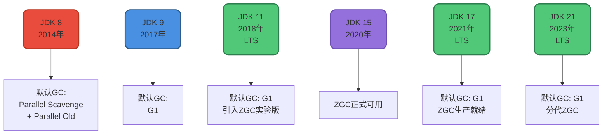
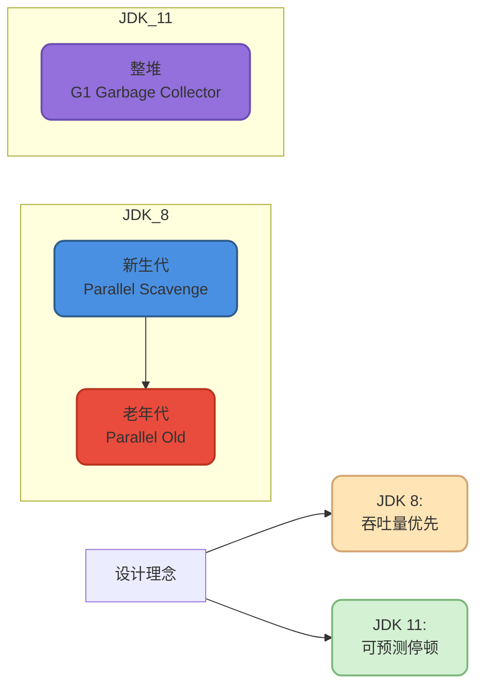
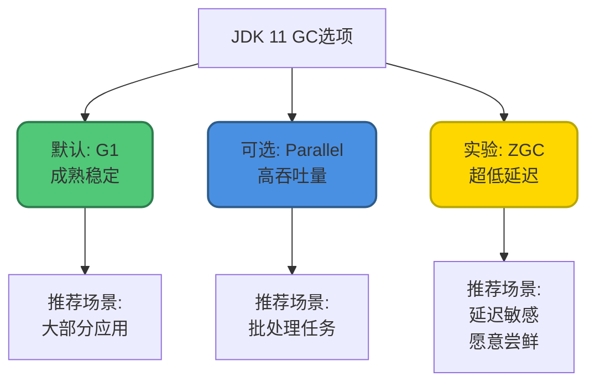
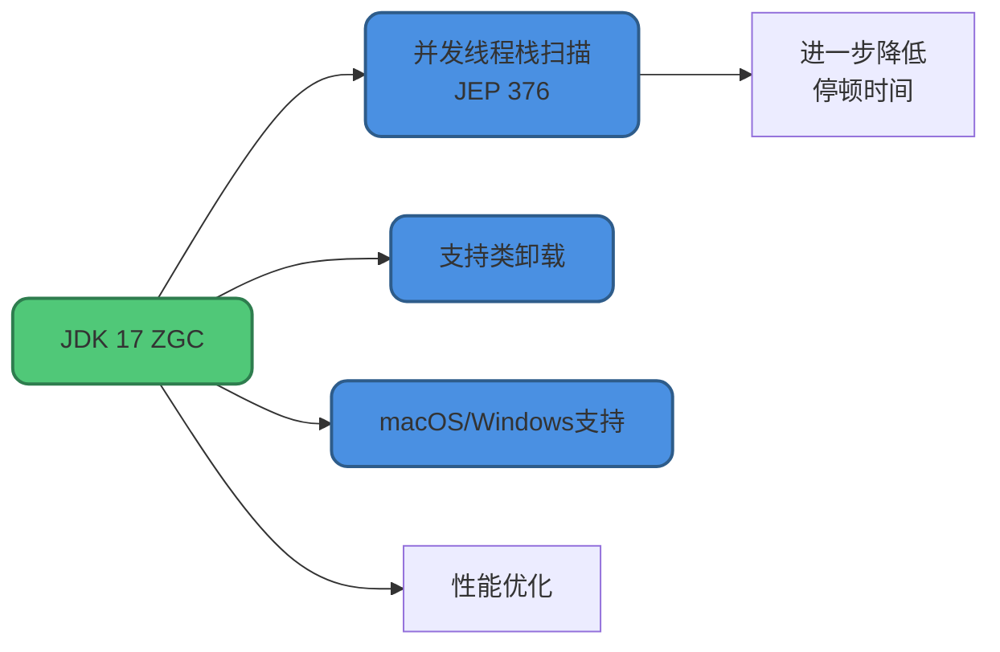
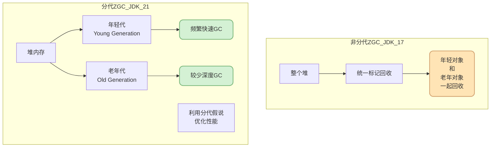
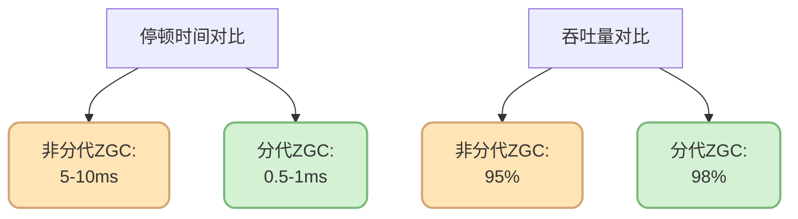
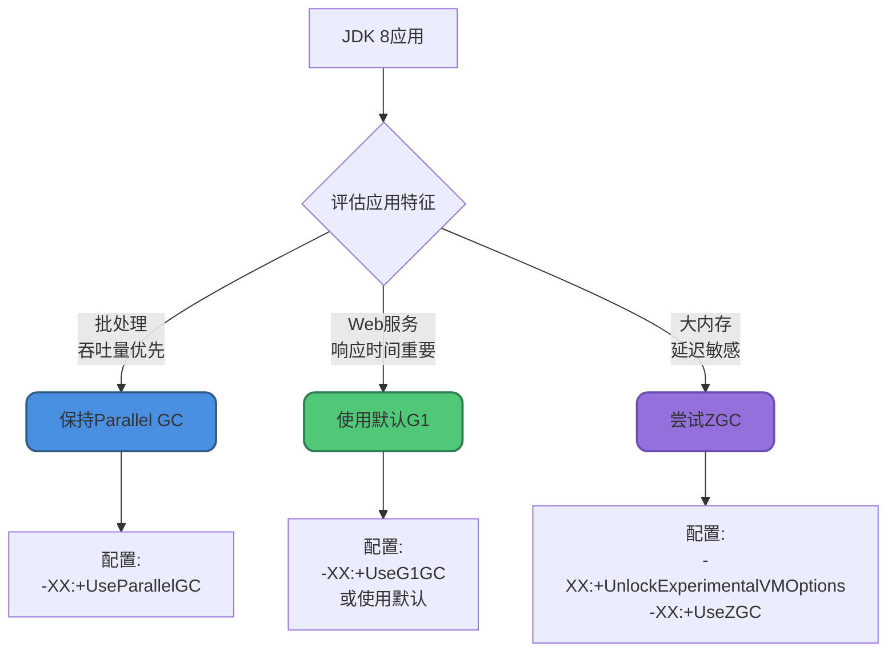
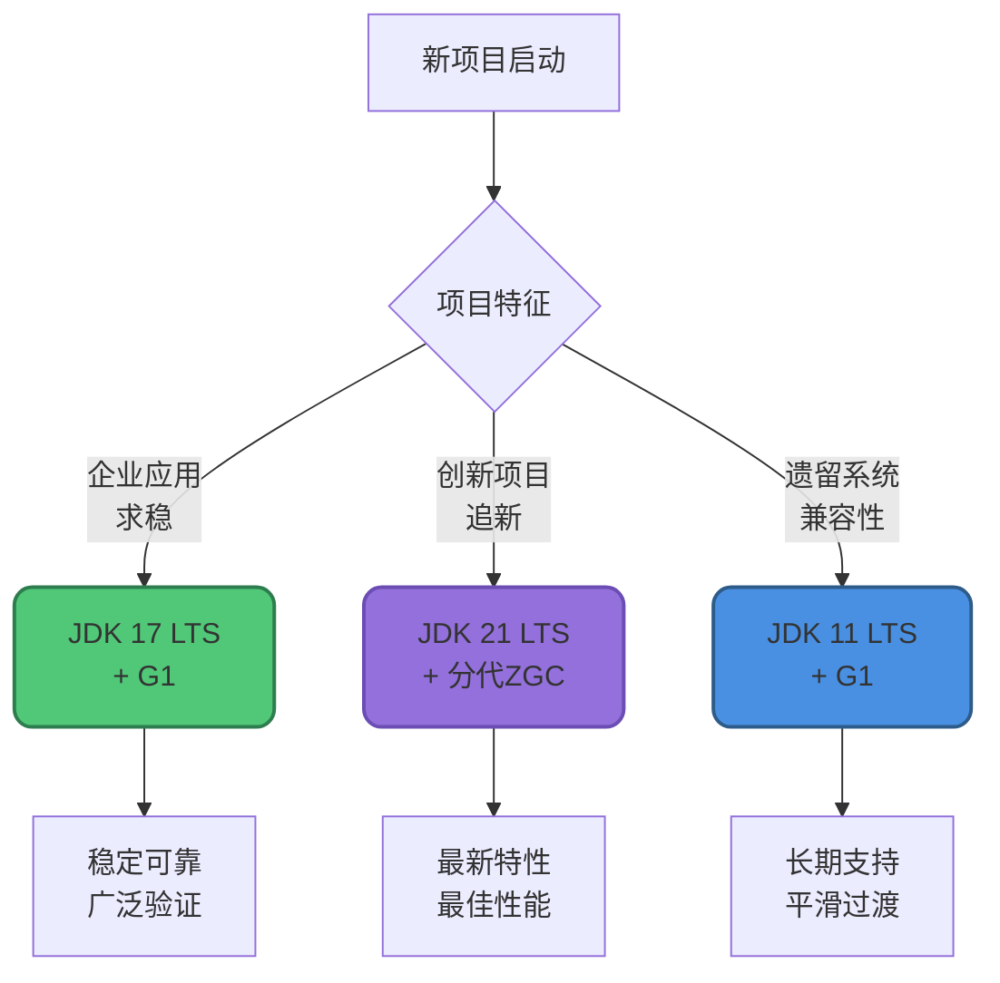
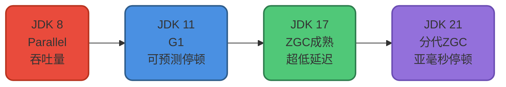

# Java版本GC演进对比

## 前言

随着Java语言的不断演进,JVM的垃圾回收技术也在持续发展和改进。从JDK 8到JDK 21,默认垃圾收集器经历了从Parallel到G1再到分代ZGC的演变,每一次变化都代表着垃圾回收技术的重大进步。

本文将深入对比不同Java版本的GC特性,帮助你理解JVM垃圾回收技术的发展历程,以及如何根据Java版本选择合适的GC策略。

## Java版本与默认GC演进

### 版本演进时间线



### LTS版本GC对比

Java的长期支持(LTS)版本是企业应用的主要选择,我们重点对比三个LTS版本:

| 特性维度 | JDK 8 | JDK 11 | JDK 17 | JDK 21 |
|---------|-------|--------|--------|--------|
| **发布年份** | 2014 | 2018 | 2021 | 2023 |
| **LTS支持** | ✓ | ✓ | ✓ | ✓ |
| **默认GC** | Parallel | G1 | G1 | G1 |
| **可用GC** | Serial, Parallel, CMS, G1 | Serial, Parallel, G1, ZGC(实验) | Serial, Parallel, G1, ZGC | Serial, Parallel, G1, ZGC(分代), Shenandoah |
| **CMS状态** | 可用 | 已过时 | 已移除 | - |
| **ZGC成熟度** | - | 实验阶段 | 生产可用 | 分代优化 |

## JDK 8 vs JDK 11 核心差异

### 默认垃圾收集器变化

这是两个版本最显著的区别:



### 垃圾识别算法差异

**JDK 8 (Parallel GC):**

```java
// 传统的可达性分析
public class ParallelGCMarking {
    
    public void mark() {
        // 1. Stop The World
        stopAllThreads();
        
        // 2. 从GC Roots开始标记
        Set<Object> marked = new HashSet<>();
        Queue<Object> queue = new LinkedList<>(gcRoots);
        
        // 3. 深度遍历标记所有可达对象
        while (!queue.isEmpty()) {
            Object obj = queue.poll();
            if (!marked.contains(obj)) {
                marked.add(obj);
                // 添加该对象引用的所有对象
                queue.addAll(obj.getReferencedObjects());
            }
        }
        
        // 4. 标记完成后才恢复线程
        resumeAllThreads();
        
        // STW时间较长,与对象数量成正比
    }
}
```

**JDK 11 (G1):**

```java
// 三色标记算法(SATB)
public class G1Marking {
    
    enum Color { WHITE, GRAY, BLACK }
    
    public void mark() {
        // 1. 初始标记 - 短暂STW
        initialMark(); // 标记GC Roots直接引用的对象
        
        // 2. 并发标记 - 与应用并发
        concurrentMark(); // 三色标记,增量推进
        
        // 3. 最终标记 - 短暂STW
        finalMark(); // 处理并发期间的引用变更
        
        // 总STW时间大幅降低
    }
    
    private void concurrentMark() {
        // 应用线程继续运行
        // GC线程并发标记对象
        while (hasGrayObjects()) {
            Object obj = getNextGrayObject();
            
            // 标记为黑色
            setColor(obj, Color.BLACK);
            
            // 引用的对象标记为灰色
            for (Object ref : obj.getReferences()) {
                if (getColor(ref) == Color.WHITE) {
                    setColor(ref, Color.GRAY);
                }
            }
        }
    }
}
```

### 内存管理策略对比

**JDK 8 - 固定分配:**

```java
// JDK 8典型配置
// -Xms4g -Xmx4g 
// -XX:NewRatio=2  (新生代:老年代 = 1:2)
// -XX:SurvivorRatio=8  (Eden:Survivor = 8:1:1)

public class JDK8MemoryLayout {
    /*
     * 堆结构:
     * [新生代 1.33GB] [老年代 2.67GB]
     *    |
     *    +-- [Eden 1.07GB] [S0 133MB] [S1 133MB]
     * 
     * 特点:
     * - 各区域大小固定
     * - 如果老年代不够用,无法从新生代借用
     * - 可能造成内存浪费
     */
}
```

**JDK 11 - 动态调整:**

```java
// JDK 11 G1配置
// -Xms4g -Xmx4g
// -XX:+UseG1GC
// -XX:MaxGCPauseMillis=200

public class JDK11MemoryLayout {
    /*
     * 堆结构:
     * [Region 1] [Region 2] ... [Region N]
     *    |          |              |
     *  Eden      Survivor        Old
     * 
     * 特点:
     * - Region数量动态分配
     * - Eden和Old的比例可动态调整
     * - 根据实际使用情况优化内存分配
     * 
     * 示例:
     * - 低峰期: 200个Eden + 50个Old
     * - 高峰期: 100个Eden + 150个Old
     */
}
```

### 性能对比示例

```java
// 批处理任务 - 吞吐量敏感
public class BatchProcessor {
    
    public void processBigBatch() {
        List<Record> records = loadRecords(1_000_000);
        
        // JDK 8 Parallel GC优势:
        // - 高吞吐量,充分利用CPU
        // - 批处理可容忍较长的GC停顿
        // 处理时间: 100秒(GC占10秒,停顿3-5次,每次2秒)
        
        // JDK 11 G1:
        // - 吞吐量略低于Parallel
        // - GC停顿更短但更频繁
        // 处理时间: 105秒(GC占12秒,停顿20次,每次0.5秒)
        
        for (Record record : records) {
            process(record);
        }
    }
}

// Web应用 - 响应时间敏感
public class WebService {
    
    public Response handleRequest(Request req) {
        // JDK 8 Parallel GC:
        // - P99延迟: 200ms (偶尔因GC达到2秒)
        // - 用户体验: 偶尔卡顿
        
        // JDK 11 G1:
        // - P99延迟: 150ms (GC停顿控制在50ms以内)
        // - 用户体验: 更流畅
        
        return processRequest(req);
    }
}
```

## JDK 11中的ZGC

JDK 11引入了实验性的ZGC,开启了超低延迟GC的新时代:

### ZGC在JDK 11中的地位



### 启用方式对比

**JDK 11:**

```bash
# 需要解锁实验特性
java -XX:+UnlockExperimentalVMOptions -XX:+UseZGC -Xmx16g Application

# 警告:实验性特性,生产环境慎用
```

**JDK 15+:**

```bash
# 正式特性,无需解锁
java -XX:+UseZGC -Xmx16g Application
```

### ZGC演进对比

| 特性 | JDK 11 | JDK 15 | JDK 21 |
|------|--------|--------|--------|
| **状态** | 实验性 | 生产可用 | 生产优化 |
| **平台支持** | 仅Linux x64 | Linux, macOS, Windows | 全平台 |
| **停顿时间** | &lt;10ms | &lt;10ms | &lt;1ms(分代模式) |
| **分代收集** | 不支持 | 不支持 | 支持 |
| **类卸载** | 不支持 | 支持 | 支持 |

## JDK 17 GC增强

JDK 17作为LTS版本,在GC方面带来了多项改进:

### ZGC成熟度提升



### G1改进

JDK 17中G1也有重要优化:

```java
// G1并发优化
public class G1Improvements {
    
    // JDK 11 G1:
    // - 并发标记后需要STW进行最终清理
    // - 大对象分配可能触发Full GC
    
    public void allocateLargeObject() {
        // JDK 11: 可能触发长时间Full GC
        byte[] large = new byte[100 * 1024 * 1024]; // 100MB
    }
    
    // JDK 17 G1:
    // - 改进的并发清理
    // - 更好的大对象处理
    // - 减少Full GC发生
    
    public void allocateLargeObjectJDK17() {
        // JDK 17: 更高效处理,避免Full GC
        byte[] large = new byte[100 * 1024 * 1024];
    }
}
```

## JDK 21 分代ZGC革命

JDK 21带来了ZGC的重大升级 - 分代ZGC:

### 分代ZGC架构



### 性能提升对比

```java
// 微服务应用示例
public class MicroserviceApplication {
    
    public Response processRequest(Request request) {
        // 创建大量临时对象
        RequestContext context = new RequestContext();
        Validator validator = new Validator();
        Processor processor = new Processor();
        
        // 非分代ZGC (JDK 17):
        // - 年轻对象和老年对象混合标记
        // - GC时间: 平均5ms
        // - GC频率: 每10秒一次
        
        // 分代ZGC (JDK 21):
        // - 年轻对象单独快速回收
        // - Young GC时间: 平均0.5ms
        // - Young GC频率: 每2秒一次
        // - Old GC时间: 平均3ms
        // - Old GC频率: 每60秒一次
        
        return processor.process(request);
    }
}
```

### 启用分代ZGC

```bash
# JDK 21启用分代ZGC
java -XX:+UseZGC -XX:+ZGenerational -Xmx32g Application

# 监控GC日志
-Xlog:gc*:file=gc.log:time,level,tags
```

### 性能数据对比



## 版本升级GC选择策略

### 从JDK 8升级到JDK 11



### 迁移实践示例

```java
// 电商订单系统迁移案例
public class OrderSystemMigration {
    
    // 原JDK 8配置:
    // -Xms8g -Xmx8g
    // -XX:+UseParallelGC
    // -XX:NewRatio=2
    
    // 性能表现:
    // - 吞吐量: 10000 TPS
    // - P99延迟: 300ms (偶尔2秒)
    // - Full GC: 每小时1次,停顿3秒
    
    // 升级到JDK 11 G1:
    // -Xms8g -Xmx8g
    // -XX:+UseG1GC
    // -XX:MaxGCPauseMillis=200
    
    // 性能改善:
    // - 吞吐量: 9500 TPS (略降5%)
    // - P99延迟: 180ms (更稳定)
    // - Mixed GC: 每10分钟1次,停顿50ms
    // - 用户体验显著提升
    
    public void processOrder(Order order) {
        // 业务代码无需修改
        validateOrder(order);
        calculatePrice(order);
        saveToDatabase(order);
    }
}
```

### 从JDK 11升级到JDK 17/21

```java
// 实时数据分析系统
public class RealTimeAnalytics {
    
    // JDK 11配置:
    // -Xms32g -Xmx32g
    // -XX:+UseG1GC
    // -XX:MaxGCPauseMillis=100
    
    // 问题:
    // - 堆较大,G1停顿有时超过目标
    // - P99.9延迟偶尔达到500ms
    
    // 升级到JDK 21 ZGC:
    // -Xms32g -Xmx32g
    // -XX:+UseZGC
    // -XX:+ZGenerational
    
    // 收益:
    // - 停顿时间稳定在1ms以内
    // - P99.9延迟降至80ms
    // - 满足实时性要求
    
    public void processStreamData(DataStream stream) {
        stream.forEach(data -&gt; {
            analyze(data);
            updateMetrics(data);
            // ZGC确保低延迟
        });
    }
}
```

## 不同场景的版本选择建议

### 新项目选择



### 堆内存大小决策

| 堆大小 | JDK 8 推荐 | JDK 11 推荐 | JDK 17+ 推荐 |
|--------|-----------|------------|-------------|
| &lt; 2GB | Parallel | G1 | G1 |
| 2-4GB | Parallel | G1 | G1 |
| 4-32GB | Parallel/G1 | G1 | G1/ZGC |
| 32-128GB | G1 | G1/ZGC | ZGC(分代) |
| &gt; 128GB | G1 | ZGC | ZGC(分代) |

### 延迟要求决策

```java
// 不同延迟要求的GC选择
public class LatencyDecision {
    
    // 场景1: 批处理,延迟不敏感
    // - JDK 8: Parallel (最高吞吐量)
    // - JDK 11+: Parallel 或 G1
    public void batchProcess() {
        // 可容忍秒级停顿
    }
    
    // 场景2: Web应用,P99 < 200ms
    // - JDK 8: G1
    // - JDK 11+: G1 (默认)
    public Response webRequest() {
        // 需要控制停顿在200ms以内
        return handleRequest();
    }
    
    // 场景3: 在线交易,P99 < 50ms
    // - JDK 8: G1 + 精细调优
    // - JDK 11: G1 + 调优 或 ZGC实验
    // - JDK 17+: ZGC
    public TradeResult trade() {
        // 需要极低延迟
        return executeTrade();
    }
    
    // 场景4: 实时系统,P99.9 < 10ms
    // - JDK 8: 很难满足
    // - JDK 11-17: ZGC
    // - JDK 21: 分代ZGC (最佳)
    public void realTimeControl() {
        // 需要亚毫秒级延迟
        controlSystem();
    }
}
```

## 小结

Java各版本的GC演进反映了JVM技术的持续进步:

**关键演进路径:**



**选择建议:**

- **JDK 8**: 如果必须使用,选择G1而非默认Parallel
- **JDK 11**: 稳定的LTS,G1作为默认已足够好
- **JDK 17**: 企业应用的当前最佳选择,ZGC生产就绪
- **JDK 21**: 追求极致性能的首选,分代ZGC是未来方向

**升级价值:**

- 从JDK 8到11: GC能力显著提升,强烈推荐
- 从JDK 11到17: 增量改进,稳定性提升
- 从JDK 17到21: 分代ZGC带来革命性改进,延迟敏感应用必选

在下一篇文章中,我们将全面对比各种垃圾收集器,并提供详细的选型策略。

## 参考资料

- [JEP 248: Make G1 the Default Garbage Collector](https://openjdk.org/jeps/248)
- [JEP 333: ZGC: A Scalable Low-Latency Garbage Collector](https://openjdk.org/jeps/333)
- [JEP 439: Generational ZGC](https://openjdk.org/jeps/439)
- 《深入理解Java虚拟机:JVM高级特性与最佳实践(第3版)》- 周志明
- Oracle Java SE Support Roadmap
