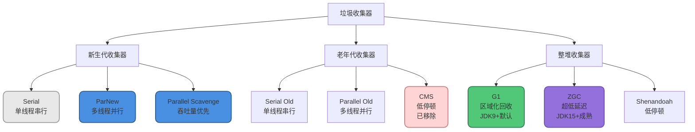
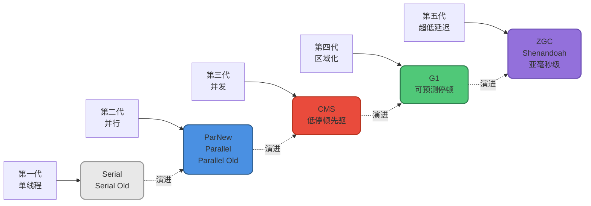
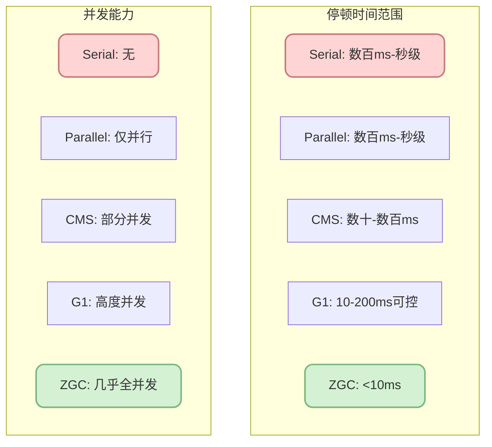
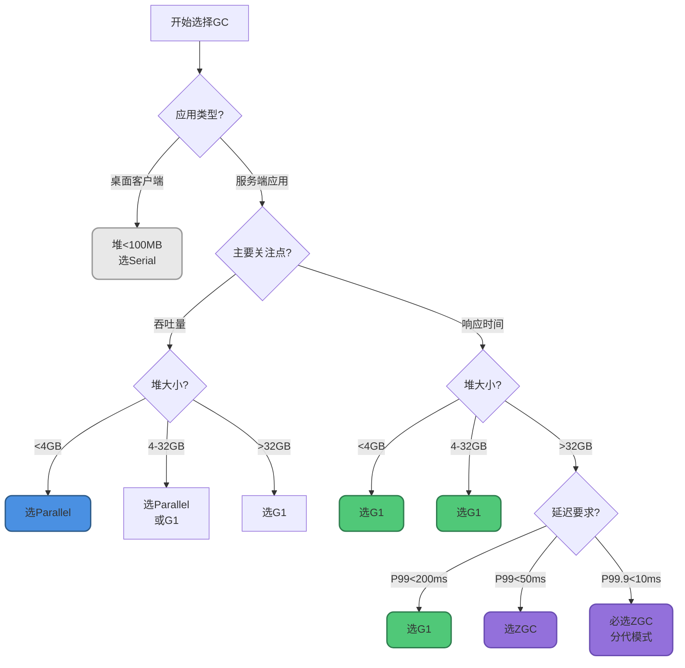
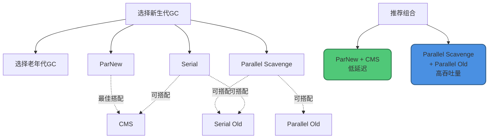
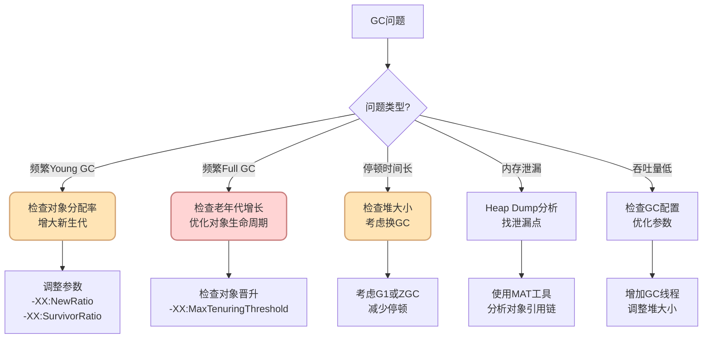

# 垃圾收集器对比与选型策略

## 前言

在前面的文章中,我们详细介绍了各种垃圾收集器的原理和特性。但面对如此多的选择,如何为自己的应用选择最合适的垃圾收集器呢?

本文将从实战角度出发,全面对比各种垃圾收集器的优劣,并提供详细的选型决策框架,帮助你在不同场景下做出最佳选择。

## 主流垃圾收集器全景图

### 收集器分类



### 收集器代际图谱



## 核心维度全面对比

### 性能特征对比

| 收集器 | 吞吐量 | 停顿时间 | 内存占用 | 调优难度 | 成熟度 |
|--------|--------|---------|---------|---------|--------|
| **Serial** | ⭐⭐⭐ | ⭐⭐ | ⭐⭐⭐⭐⭐ | ⭐⭐⭐⭐⭐ | ⭐⭐⭐⭐⭐ |
| **Parallel** | ⭐⭐⭐⭐⭐ | ⭐⭐ | ⭐⭐⭐⭐ | ⭐⭐⭐⭐ | ⭐⭐⭐⭐⭐ |
| **CMS** | ⭐⭐⭐ | ⭐⭐⭐⭐ | ⭐⭐⭐ | ⭐⭐ | ⭐⭐⭐⭐ |
| **G1** | ⭐⭐⭐⭐ | ⭐⭐⭐⭐ | ⭐⭐⭐⭐ | ⭐⭐⭐ | ⭐⭐⭐⭐⭐ |
| **ZGC** | ⭐⭐⭐⭐ | ⭐⭐⭐⭐⭐ | ⭐⭐⭐ | ⭐⭐⭐ | ⭐⭐⭐⭐ |

### 技术特征对比



### 适用堆大小对比

| 收集器 | 最佳堆大小 | 可用范围 | 超大堆表现 |
|--------|-----------|---------|-----------|
| **Serial** | &lt;100MB | 几MB-几百MB | 不适用 |
| **Parallel** | 2-8GB | 几百MB-32GB | 停顿时间过长 |
| **CMS** | 2-4GB | 1-8GB | 碎片问题严重 |
| **G1** | 4GB以上 | 2GB-64GB | 良好 |
| **ZGC** | 32GB以上 | 8MB-16TB | 优秀 |

## 场景化选型决策树

### 决策流程图



### 典型场景推荐

#### 场景1: 后台批处理系统

```java
// 数据ETL系统
public class DataETLSystem {
    
    // 特征:
    // - 批量处理大量数据
    // - 无用户交互,延迟不敏感
    // - 追求最大吞吐量
    // - 堆内存: 8GB
    
    // 推荐: Parallel GC
    // -XX:+UseParallelGC
    // -Xms8g -Xmx8g
    // -XX:ParallelGCThreads=8
    
    public void processData() {
        List<DataRecord> records = loadBigDataset(); // 千万条记录
        
        // 可容忍数秒的GC停顿
        // Parallel GC能提供最高的吞吐量
        records.parallelStream()
               .map(this::transform)
               .forEach(this::save);
    }
    
    // 性能指标:
    // - 处理速度: 100万条/分钟
    // - GC停顿: 2-5秒/次,每小时2-3次
    // - CPU利用率: 95%+
}
```

#### 场景2: 电商Web应用

```java
// 在线商城系统
public class EcommerceWebApplication {
    
    // 特征:
    // - 用户请求响应时间敏感
    // - 需要良好的用户体验
    // - 堆内存: 8GB
    // - QPS: 5000-10000
    
    // 推荐: G1 GC (JDK 11+默认)
    // -XX:+UseG1GC
    // -Xms8g -Xmx8g
    // -XX:MaxGCPauseMillis=200
    // -XX:G1HeapRegionSize=4m
    
    public ProductResponse getProductDetail(String productId) {
        // 要求P99响应时间&lt;200ms
        
        Product product = productCache.get(productId);
        if (product == null) {
            product = productDao.load(productId);
            productCache.put(productId, product);
        }
        
        // G1确保GC停顿在200ms以内
        // 不会导致用户感知明显的卡顿
        return buildResponse(product);
    }
    
    // 性能指标:
    // - P99响应时间: 150ms
    // - Young GC: 50ms,每30秒
    // - Mixed GC: 80ms,每5分钟
    // - 用户体验: 流畅
}
```

#### 场景3: 金融交易系统

```java
// 高频交易平台
public class TradingPlatform {
    
    // 特征:
    // - 极度延迟敏感,毫秒必争
    // - 大量市场数据缓存
    // - 堆内存: 32GB
    // - 要求P99.9 &lt; 10ms
    
    // 推荐: ZGC (JDK 21分代模式)
    // -XX:+UseZGC
    // -XX:+ZGenerational
    // -Xms32g -Xmx32g
    // -XX:ConcGCThreads=8
    
    // 市场数据缓存
    private Map<String, MarketData> marketDataCache; // 10GB
    private Map<String, OrderBook> orderBooks;      // 15GB
    
    public TradeResult executeTrade(TradeOrder order) {
        // 严格延迟要求:
        // - 订单验证: &lt;1ms
        // - 撮合执行: &lt;2ms
        // - 总延迟: &lt;5ms
        
        long startTime = System.nanoTime();
        
        validateOrder(order);           // ~0.5ms
        MarketData data = getMarketData(); // ~0.3ms
        TradeResult result = match(order, data); // ~2ms
        
        long latency = (System.nanoTime() - startTime) / 1_000_000;
        
        // ZGC确保GC停顿&lt;1ms,不影响交易延迟
        // 即使32GB堆,停顿时间依然在亚毫秒级
        
        return result;
    }
    
    // 性能指标:
    // - P99延迟: 4.5ms
    // - P99.9延迟: 6ms
    // - GC停顿: &lt;1ms
    // - 满足监管要求
}
```

#### 场景4: 大数据实时分析

```java
// 实时流处理系统
public class StreamProcessingSystem {
    
    // 特征:
    // - 处理海量实时数据流
    // - 需要大内存缓存中间状态
    // - 堆内存: 64GB
    // - 要求低延迟 + 高吞吐
    
    // 推荐: ZGC
    // -XX:+UseZGC
    // -XX:+ZGenerational
    // -Xms64g -Xmx64g
    
    // 窗口聚合状态
    private Map<String, WindowState> windowStates; // 40GB
    
    public void processEventStream() {
        eventStream
            .window(Time.seconds(60))
            .reduce((event1, event2) -&gt; {
                // 频繁对象分配
                AggregateResult result = new AggregateResult();
                result.merge(event1);
                result.merge(event2);
                
                // ZGC优势:
                // 1. 64GB大堆,其他GC停顿时间会很长
                // 2. ZGC停顿&lt;10ms,不影响实时性
                // 3. 高吞吐量,不浪费计算资源
                
                updateWindowState(result);
                return result;
            });
    }
    
    // 性能指标:
    // - 事件吞吐: 100万/秒
    // - 端到端延迟: P99 &lt; 100ms
    // - GC停顿: &lt;5ms
    // - 吞吐量: 98%
}
```

#### 场景5: 微服务应用

```java
// 订单服务(微服务架构)
public class OrderMicroservice {
    
    // 特征:
    // - 堆内存较小(2-4GB)
    // - 需要快速响应
    // - 容器化部署
    // - SLA要求P99 &lt; 100ms
    
    // 推荐: G1 GC
    // -XX:+UseG1GC
    // -Xms2g -Xmx2g
    // -XX:MaxGCPauseMillis=50
    
    @GetMapping("/orders/{orderId}")
    public OrderDTO getOrder(@PathVariable String orderId) {
        // 微服务特点:
        // 1. 请求量大,对象分配频繁
        // 2. 容器内存受限
        // 3. 需要稳定的响应时间
        
        Order order = orderService.findById(orderId);
        
        // G1优势:
        // - 即使在小堆下也能良好工作
        // - 可预测停顿,满足SLA
        // - 自适应调整,适合容器环境
        
        return convertToDTO(order);
    }
    
    // 性能指标:
    // - P99响应时间: 60ms
    // - GC停顿: &lt;30ms
    // - 容器资源利用率: 85%
}
```

## 组合选择策略

### 新生代与老年代组合(JDK 8)



### 不兼容的组合

:::warning 注意
以下组合不可用:
- Parallel Scavenge + CMS (不兼容)
- ParNew + Parallel Old (不建议)
- Serial + Parallel Old (不建议)
:::

## 调优参数速查表

### Parallel GC调优

```bash
# 基础配置
-XX:+UseParallelGC          # 启用Parallel新生代
-XX:+UseParallelOldGC       # 启用Parallel老年代
-Xms8g -Xmx8g               # 固定堆大小

# 性能调优
-XX:ParallelGCThreads=8     # GC线程数
-XX:MaxGCPauseMillis=500    # 最大停顿时间目标(软目标)
-XX:GCTimeRatio=99          # GC时间占比 1/(1+99)=1%

# 内存比例
-XX:NewRatio=2              # 老年代:新生代 = 2:1
-XX:SurvivorRatio=8         # Eden:Survivor = 8:1
```

### G1 GC调优

```bash
# 基础配置
-XX:+UseG1GC                # 启用G1
-Xms8g -Xmx8g               # 固定堆大小

# 停顿时间控制
-XX:MaxGCPauseMillis=200    # 目标停顿时间200ms

# Region配置
-XX:G1HeapRegionSize=4m     # Region大小(1-32MB,2的幂)

# 并发标记触发
-XX:InitiatingHeapOccupancyPercent=45  # 堆占用45%启动并发标记

# 新生代大小范围
-XX:G1NewSizePercent=5      # 新生代最小占比5%
-XX:G1MaxNewSizePercent=60  # 新生代最大占比60%

# Mixed GC配置
-XX:G1MixedGCCountTarget=8  # Mixed GC目标次数
-XX:G1OldCSetRegionThresholdPercent=10  # 老年代Region回收比例
```

### ZGC调优

```bash
# 基础配置
-XX:+UseZGC                 # 启用ZGC
-XX:+ZGenerational          # 启用分代模式(JDK 21+)
-Xms32g -Xmx32g             # 固定堆大小

# 并发线程
-XX:ConcGCThreads=8         # 并发GC线程数

# 内存管理
-XX:ZUncommitDelay=300      # 归还内存延迟(秒)
-XX:ZCollectionInterval=0   # GC间隔(0=自动)

# 分配突发容忍
-XX:ZAllocationSpikeTolerance=2

# GC日志(JDK 9+)
-Xlog:gc*:file=gc.log:time,level,tags
```

## 性能监控与问题诊断

### 关键监控指标

```java
// GC监控指标类
public class GCMonitoringMetrics {
    
    // 1. 吞吐量指标
    // - 应用运行时间占比
    double throughput = (totalTime - gcTime) / totalTime;
    // 目标: &gt;95% (Parallel), &gt;90% (G1/ZGC)
    
    // 2. 停顿时间指标
    // - P99停顿时间
    long p99PauseTime;  // 目标: 根据应用需求
    // - 最大停顿时间
    long maxPauseTime;  // 目标: &lt;应用超时阈值
    
    // 3. GC频率指标
    // - Young GC频率
    double youngGCRate; // 次/分钟
    // - Full GC频率
    double fullGCRate;  // 应尽量避免
    
    // 4. 内存指标
    // - 堆内存使用率
    double heapUsage;   // 目标: 60-80%
    // - 晋升率
    double promotionRate; // MB/秒
    
    // 5. CPU指标
    // - GC CPU使用率
    double gcCpuUsage;  // 目标: &lt;10%
}
```

### GC问题诊断流程



## 迁移最佳实践

### 从Parallel迁移到G1

```java
// 迁移步骤
public class ParallelToG1Migration {
    
    // 步骤1: 准备阶段
    public void prepare() {
        // 原Parallel配置:
        // -XX:+UseParallelGC
        // -Xms8g -Xmx8g
        // -XX:NewRatio=2
        
        // 收集基准数据:
        // - 当前吞吐量
        // - 当前停顿时间
        // - GC日志分析
    }
    
    // 步骤2: 初始G1配置
    public void initialG1Config() {
        // 保守配置:
        // -XX:+UseG1GC
        // -Xms8g -Xmx8g
        // -XX:MaxGCPauseMillis=200  # 设置目标停顿
        
        // 在测试环境验证
    }
    
    // 步骤3: 压测对比
    public void loadTest() {
        // 对比指标:
        // - 吞吐量变化
        // - 停顿时间分布
        // - CPU使用率
        // - 内存使用情况
    }
    
    // 步骤4: 逐步优化
    public void tuning() {
        // 根据压测结果调整:
        // - 调整MaxGCPauseMillis
        // - 调整G1HeapRegionSize
        // - 调整并发标记阈值
    }
    
    // 步骤5: 灰度发布
    public void gradualRollout() {
        // 1. 小流量验证
        // 2. 监控关键指标
        // 3. 逐步扩大范围
        // 4. 全量上线
    }
}
```

### 从G1迁移到ZGC

```java
// 适合迁移的场景
public class G1ToZGCMigration {
    
    public boolean shouldMigrate() {
        // 满足以下条件考虑迁移:
        
        // 1. 堆内存较大
        boolean largeHeap = heapSize &gt; 32 * 1024 * 1024 * 1024L; // &gt;32GB
        
        // 2. G1停顿时间无法满足要求
        boolean pauseIssue = g1P99PauseTime &gt; targetPauseTime;
        
        // 3. JDK版本支持
        boolean jdkSupport = jdkVersion &gt;= 17; // JDK 17+
        
        // 4. 有足够的测试时间
        boolean hasTestTime = true;
        
        return largeHeap &amp;&amp; pauseIssue &amp;&amp; jdkSupport &amp;&amp; hasTestTime;
    }
    
    public void migrateToZGC() {
        // 原G1配置:
        // -XX:+UseG1GC
        // -Xms32g -Xmx32g
        // -XX:MaxGCPauseMillis=100
        
        // ZGC配置:
        // -XX:+UseZGC
        // -XX:+ZGenerational  # JDK 21+
        // -Xms32g -Xmx32g
        
        // 监控对比:
        // - 停顿时间: G1 100ms → ZGC &lt;10ms
        // - 吞吐量: G1 95% → ZGC 93% (略降可接受)
        // - 内存占用: 增加约20%
    }
}
```

## 常见误区与陷阱

### 误区1: 追求零停顿

```java
public class Misconception1 {
    // ❌ 错误认知
    // "我要选择ZGC,因为它停顿时间最短"
    
    // ✅ 正确理解
    // 1. ZGC并非零停顿,只是停顿极短(&lt;10ms)
    // 2. ZGC适合大堆+低延迟场景
    // 3. 小堆应用(如2GB),G1可能更合适
    
    public void smallHeapApplication() {
        // 堆大小: 2GB
        // G1: 停顿30ms,吞吐量98%
        // ZGC: 停顿5ms,吞吐量95%,内存占用多20%
        
        // 对于2GB堆,G1的30ms停顿已足够好
        // ZGC带来的额外内存开销和略低吞吐量不值得
    }
}
```

### 误区2: 默认配置最优

```java
public class Misconception2 {
    // ❌ 错误认知
    // "JDK默认的GC配置就是最好的"
    
    // ✅ 正确理解
    // 默认配置是通用配置,不一定适合你的应用
    
    public void tuningExample() {
        // G1默认配置:
        // -XX:MaxGCPauseMillis=200
        // -XX:G1HeapRegionSize=根据堆大小计算
        
        // 如果你的应用:
        // - 能容忍更长停顿以换取更高吞吐量
        // → 调大MaxGCPauseMillis到500ms
        
        // - 有很多大对象(5-10MB)
        // → 增大G1HeapRegionSize到16m或32m
        
        // - 老年代增长快
        // → 降低InitiatingHeapOccupancyPercent触发更早并发标记
    }
}
```

### 误区3: 盲目追随潮流

```java
public class Misconception3 {
    // ❌ 错误认知
    // "ZGC是最新的,我要用ZGC"
    
    // ✅ 正确理解
    // 选择GC要基于实际需求,不是技术潮流
    
    public void scenarioBasedChoice() {
        // 场景A: 夜间批处理任务
        // - 堆: 8GB
        // - 运行时间: 2小时
        // - 无用户交互
        // 最佳选择: Parallel GC (最高吞吐量)
        // 选ZGC: 浪费,无法发挥ZGC低延迟优势
        
        // 场景B: 高频交易系统
        // - 堆: 64GB
        // - 要求P99.9 &lt; 10ms
        // - 7×24运行
        // 最佳选择: ZGC
        // 选Parallel: 无法满足延迟要求
    }
}
```

## 快速决策检查清单

### 选择GC前的自检问题

```markdown
□ 1. 应用类型?
   - [ ] 批处理/离线计算
   - [ ] Web应用/在线服务
   - [ ] 实时系统/交易平台
   - [ ] 桌面客户端

□ 2. 堆内存大小?
   - [ ] &lt; 2GB
   - [ ] 2-8GB
   - [ ] 8-32GB
   - [ ] &gt; 32GB

□ 3. 延迟要求?
   - [ ] 不敏感(可接受秒级)
   - [ ] 一般(P99 &lt; 500ms)
   - [ ] 敏感(P99 &lt; 100ms)
   - [ ] 极度敏感(P99.9 &lt; 10ms)

□ 4. 吞吐量要求?
   - [ ] 最高优先级
   - [ ] 重要但可妥协
   - [ ] 次要考虑

□ 5. JDK版本?
   - [ ] JDK 8
   - [ ] JDK 11
   - [ ] JDK 17
   - [ ] JDK 21

□ 6. 运维能力?
   - [ ] 基础(希望简单配置)
   - [ ] 中级(可以做基本调优)
   - [ ] 高级(可以深度优化)
```

### 推荐决策矩阵

根据上述检查清单,使用决策矩阵:

| 应用类型 | 堆大小 | 延迟要求 | 推荐GC | JDK版本 |
|---------|--------|---------|--------|---------|
| 批处理 | 任意 | 不敏感 | Parallel | 8/11+ |
| Web应用 | &lt;4GB | 一般 | G1 | 11+ |
| Web应用 | 4-32GB | 敏感 | G1 | 11+ |
| Web应用 | &gt;32GB | 敏感 | ZGC | 17+ |
| 实时系统 | 任意 | 极度敏感 | ZGC | 21+(分代) |
| 微服务 | 2-4GB | 敏感 | G1 | 11+ |
| 大数据 | &gt;32GB | 敏感 | ZGC | 17+ |

## 小结

垃圾收集器的选择是一个系统工程,需要综合考虑多个因素:

**选型核心原则:**


**关键建议:**

- 没有"最好"的GC,只有最适合的GC
- 基于实际场景和数据做决策,不要盲目跟风
- 在测试环境充分验证后再上生产
- 监控GC指标,持续优化
- 随着业务发展,适时调整GC策略

**未来趋势:**

- ZGC将成为大内存应用的主流选择
- 分代ZGC将进一步降低停顿时间
- G1仍将是中等规模应用的稳健选择
- Parallel逐渐退出历史舞台

希望本文能帮助你在实际项目中做出明智的GC选择!

## 参考资料

- 《深入理解Java虚拟机:JVM高级特性与最佳实践(第3版)》- 周志明
- [Choosing the Right Garbage Collector](https://docs.oracle.com/en/java/javase/17/gctuning/ergonomics.html) - Oracle官方文档
- [JEP 248: Make G1 the Default Garbage Collector](https://openjdk.org/jeps/248)
- [JEP 333: ZGC: A Scalable Low-Latency Garbage Collector](https://openjdk.org/jeps/333)
- [JEP 439: Generational ZGC](https://openjdk.org/jeps/439)
