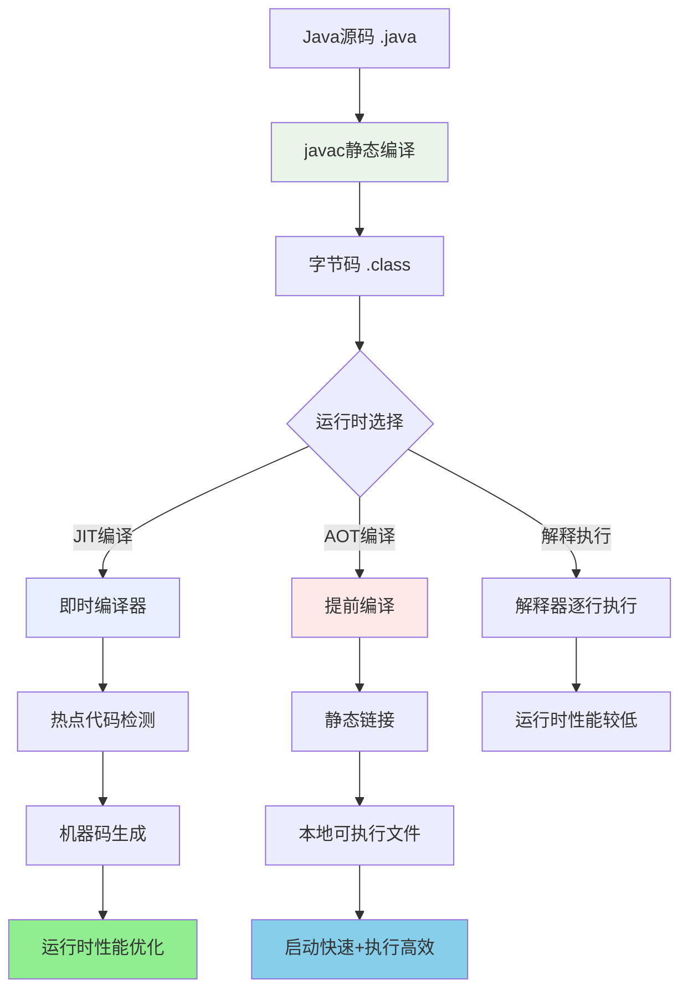
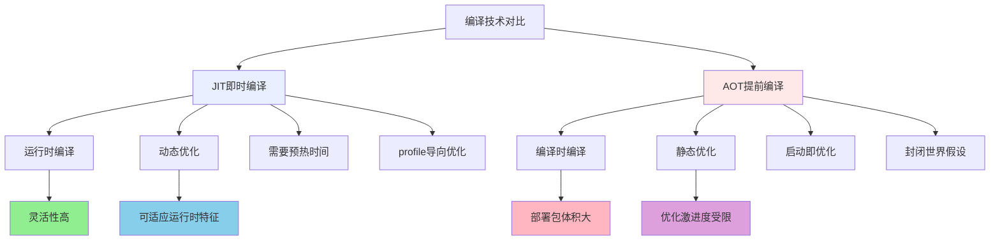
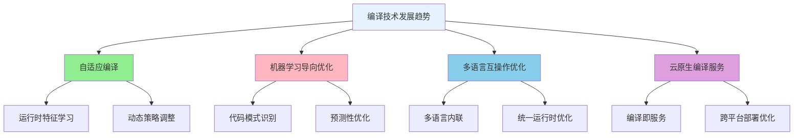

# JIT与AOT编译技术深度解析

## Java编译体系概览

Java的编译过程包含多个层次,从源码到最终机器码的转换涉及静态编译和动态编译两大技术路线:



## JIT即时编译技术

### 热点代码检测机制

JIT编译器通过多种策略识别值得优化的代码段:

```java
// 金融风险计算引擎
public class RiskCalculationEngine {
    
    // 这个方法会被频繁调用,成为热点代码
    public double calculateVaR(Portfolio portfolio, double confidenceLevel, int timeHorizon) {
        double totalValue = 0.0;
        double totalRisk = 0.0;
        
        // 方法调用计数器递增
        // 当达到阈值时触发JIT编译
        for (Asset asset : portfolio.getAssets()) {
            double assetValue = asset.getCurrentValue();
            double volatility = calculateVolatility(asset);  // 嵌套热点方法
            double correlation = getCorrelation(asset, portfolio);
            
            totalValue += assetValue;
            totalRisk += Math.pow(assetValue * volatility, 2) * correlation;
        }
        
        // JIT编译器优化:
        // 1. 内联展开: calculateVolatility方法内联
        // 2. 循环优化: 向量化操作,循环展开
        // 3. 逃逸分析: 局部对象栈上分配
        // 4. 无用代码消除: 去除冗余计算
        
        return Math.sqrt(totalRisk) * Math.sqrt(timeHorizon) * confidenceLevel;
    }
    
    // 嵌套热点方法也会被优化
    private double calculateVolatility(Asset asset) {
        double[] prices = asset.getHistoricalPrices();
        double average = Arrays.stream(prices).average().orElse(0.0);
        double variance = Arrays.stream(prices)
            .map(price -> Math.pow(price - average, 2))
            .average().orElse(0.0);
        
        return Math.sqrt(variance);
    }
}
```

**热点检测参数配置:**

| 参数 | 说明 | 默认值 | 适用场景 |
|------|------|--------|----------|
| -XX:CompileThreshold | 方法调用次数阈值 | Server: 10000<br />Client: 1500 | 调整编译激进程度 |
| -XX:TieredCompilation | 分层编译 | 开启 | 平衡编译时间和效果 |
| -XX:Tier3CompileThreshold | C1编译器阈值 | 2000 | 快速编译优化 |
| -XX:Tier4CompileThreshold | C2编译器阈值 | 15000 | 深度优化编译 |

### 编译器分层架构

HotSpot采用分层编译策略,平衡编译时间和优化效果:

```java
// 电商推荐系统
public class RecommendationEngine {
    
    // 分层编译演示方法
    public List<Product> recommend(User user, int count) {
        // 执行层次演进:
        
        // 层次0: 解释器执行
        // - 初次调用,逐行解释字节码
        // - 收集分支预测,类型信息等profiles
        
        List<Product> candidates = findCandidates(user);
        
        // 层次1: C1编译器(客户端编译器)
        // - 简单优化: 内联,常量传播
        // - 编译速度快,适合频繁调用的方法
        
        Map<Product, Double> scores = new HashMap<>();
        for (Product product : candidates) {
            double score = calculateScore(user, product);  // 可能被C1编译
            scores.put(product, score);
        }
        
        // 层次2: C1编译器 + 受限的分析信息
        // - 基于profiles的优化
        // - 去虚拟化,类型推测
        
        // 层次3: C2编译器(服务端编译器)
        // - 深度优化: 循环优化,标量替换
        // - 编译时间长,但生成高效机器码
        
        return scores.entrySet().stream()
            .sorted(Map.Entry.<Product, Double>comparingByValue().reversed())
            .limit(count)
            .map(Map.Entry::getKey)
            .collect(Collectors.toList());
    }
    
    // 演示不同编译层次的性能特征
    private double calculateScore(User user, Product product) {
        // 这个方法的编译历程:
        // 1. 初期: 解释器执行 (慢但启动快)
        // 2. 热点: C1编译 (中等性能,编译快)
        // 3. 超热点: C2编译 (高性能,编译慢)
        
        double categoryPreference = user.getCategoryPreference(product.getCategory());
        double priceRatio = user.getBudget() / product.getPrice();
        double brandLoyalty = user.getBrandLoyalty(product.getBrand());
        
        // C2编译器可能的优化:
        // - 内联所有getter方法
        // - 浮点运算优化
        // - 分支预测优化
        
        return (categoryPreference * 0.4 + priceRatio * 0.3 + brandLoyalty * 0.3) * 100;
    }
}
```

### 逃逸分析优化技术

逃逸分析是JIT编译器中的关键优化技术,通过分析对象的作用域来启用多种优化:

#### 对象逃逸状态分类

```java
// 订单处理系统逃逸分析示例
public class OrderProcessingService {
    
    // 1. 无逃逸(NoEscape) - 最优化情况
    public OrderSummary processLocalOrder(OrderRequest request) {
        // 对象仅在方法内使用,未逃逸
        OrderCalculation calc = new OrderCalculation();
        calc.setBaseAmount(request.getAmount());
        calc.setTaxRate(request.getTaxRate());
        calc.calculate();
        
        // JIT优化:
        // - 标量替换: OrderCalculation对象被分解为基本类型
        // - 栈上分配: 避免堆分配和GC压力
        // - 完全内联: calculate()方法内联展开
        
        return new OrderSummary(calc.getFinalAmount());
    }
    
    // 2. 参数逃逸(ArgEscape) - 部分优化
    public void processOrderWithValidation(OrderRequest request) {
        OrderValidator validator = new OrderValidator();
        validator.setRules(getValidationRules());
        
        // validator对象传递给其他方法,发生参数逃逸
        if (validateOrder(validator, request)) {
            processOrder(request);
        }
        
        // JIT优化:
        // - 锁消除: 如果validator内部有同步,可能被消除
        // - 部分内联: validateOrder方法可能内联
        // - 无法栈上分配: 因为对象逃逸到其他方法
    }
    
    private boolean validateOrder(OrderValidator validator, OrderRequest request) {
        return validator.isValid(request);
    }
    
    // 3. 全局逃逸(GlobalEscape) - 优化受限
    private static final List<Order> globalOrderCache = new ArrayList<>();
    
    public Order createAndCacheOrder(OrderRequest request) {
        Order order = new Order(request);
        
        // order对象被添加到静态集合,发生全局逃逸
        globalOrderCache.add(order);
        
        // JIT优化受限:
        // - 无法栈上分配
        // - 无法标量替换
        // - 可能进行逃逸后的优化(如方法内联)
        
        return order;
    }
}
```

#### 标量替换技术

```java
// 地理位置服务
public class GeoLocationService {
    
    public double calculateDistance(double lat1, double lon1, double lat2, double lon2) {
        // 原始代码使用Point对象
        Point point1 = new Point(lat1, lon1);
        Point point2 = new Point(lat2, lon2);
        
        // 标量替换优化后的等效代码:
        // double point1_x = lat1;    // Point对象被分解
        // double point1_y = lon1;
        // double point2_x = lat2;
        // double point2_y = lon2;
        
        double deltaX = point2.getX() - point1.getX();
        double deltaY = point2.getY() - point1.getY();
        
        // 完全消除对象分配,直接操作基本类型
        // double deltaX = point2_x - point1_x;
        // double deltaY = point2_y - point1_y;
        
        return Math.sqrt(deltaX * deltaX + deltaY * deltaY);
    }
    
    // 演示标量替换的条件
    public LocationInfo analyzeLocation(double latitude, double longitude) {
        // Point对象的使用必须满足:
        Point location = new Point(latitude, longitude);
        
        // 1. 对象未逃逸出方法作用域 ✓
        // 2. 对象的所有字段都被访问 ✓
        // 3. 对象没有被存储到数组或集合中 ✓
        // 4. 对象没有被同步 ✓
        
        double distance = calculateDistanceFromOrigin(location);
        String zone = determineTimeZone(location);
        
        return new LocationInfo(distance, zone);
    }
}

// 简单的Point类用于演示
class Point {
    private final double x, y;
    
    public Point(double x, double y) {
        this.x = x;
        this.y = y;
    }
    
    public double getX() { return x; }
    public double getY() { return y; }
}
```

## AOT提前编译技术

### AOT编译原理与优势

AOT编译在应用部署前就将字节码转换为本地机器码,特别适合云原生和微服务场景:

```java
// 微服务API网关
@RestController
public class ApiGatewayController {
    
    @Autowired
    private RoutingService routingService;
    
    // 在AOT编译时,这些方法已经被编译为机器码
    @GetMapping("/api/v1/{service}/**")
    public ResponseEntity<Object> routeRequest(
            @PathVariable String service,
            HttpServletRequest request) {
        
        // AOT编译优势体现:
        // 1. 无需JIT预热时间
        // 2. 启动即达到最优性能
        // 3. 内存占用更低(无需JIT编译器)
        // 4. 可预测的性能特征
        
        RouteConfig config = routingService.findRoute(service);
        if (config == null) {
            return ResponseEntity.notFound().build();
        }
        
        return forwardRequest(config, request);
    }
}
```

### AOT与JIT的对比分析



**性能特征对比:**

| 特征 | JIT编译 | AOT编译 |
|------|---------|---------|
| 启动时间 | 慢(需预热) | 快(无预热) |
| 峰值性能 | 高(动态优化) | 中等(静态优化) |
| 内存占用 | 高(编译器+metadata) | 低(纯机器码) |
| 可移植性 | 高(字节码) | 低(平台相关) |
| 反射支持 | 完整 | 需配置 |
| 动态特性 | 完整支持 | 受限支持 |

### AOT编译的技术挑战

#### 封闭世界假设

```java
// 插件化应用的AOT挑战
public class PluginManager {
    
    // AOT编译面临的挑战
    public void loadPlugin(String pluginJar) {
        try {
            // 动态类加载在AOT中无法工作
            URLClassLoader loader = new URLClassLoader(new URL[]{new File(pluginJar).toURI().toURL()});
            
            // 反射调用需要在编译时预先配置
            Class<?> pluginClass = loader.loadClass("com.example.Plugin");
            Object plugin = pluginClass.getDeclaredConstructor().newInstance();
            
            // 动态代理也需要预先注册
            Plugin proxyPlugin = (Plugin) Proxy.newProxyInstance(
                loader, new Class[]{Plugin.class}, new PluginInvocationHandler(plugin));
            
            registerPlugin(proxyPlugin);
            
        } catch (Exception e) {
            // AOT环境下这些操作可能失败
            throw new RuntimeException("插件加载失败", e);
        }
    }
    
    // AOT友好的设计
    public void loadPrecompiledPlugin(PluginFactory factory) {
        // 编译时已知的插件工厂
        Plugin plugin = factory.createPlugin();
        registerPlugin(plugin);
    }
}
```

#### 反射配置解决方案

```json
// reflect-config.json - GraalVM配置文件
[
  {
    "name": "com.example.UserService",
    "methods": [
      {"name": "<init>", "parameterTypes": []},
      {"name": "findUserById", "parameterTypes": ["java.lang.String"]}
    ],
    "fields": [
      {"name": "userRepository", "allowWrite": true}
    ]
  },
  {
    "name": "com.example.Order",
    "allDeclaredConstructors": true,
    "allDeclaredMethods": true,
    "allDeclaredFields": true
  }
]
```

### 混合编译策略

```java
// 智能编译决策系统
public class SmartCompilationStrategy {
    
    // 核心业务逻辑 - 适合AOT
    @AotOptimized
    public PaymentResult processCriticalPayment(PaymentRequest request) {
        // 关键路径代码,预编译以确保启动性能
        validatePayment(request);
        Payment payment = createPayment(request);
        return executePayment(payment);
    }
    
    // 分析计算逻辑 - 适合JIT  
    @JitOptimized
    public AnalysisReport performComplexAnalysis(Dataset dataset) {
        // 复杂计算逻辑,受益于JIT的动态优化
        // 数据特征在运行时才确定,JIT可以针对性优化
        
        Matrix matrix = dataset.toMatrix();
        return analyzeMatrix(matrix);
    }
    
    // 配置驱动的方法选择
    private static final boolean AOT_MODE = Boolean.getBoolean("app.aot.enabled");
    
    public ProcessResult adaptiveProcess(InputData data) {
        if (AOT_MODE) {
            return processWithAotPath(data);
        } else {
            return processWithJitPath(data);
        }
    }
}
```

## 编译优化实战应用

### 性能监控与调优

```java
// 编译性能监控系统
public class CompilationMonitor {
    
    private static final CompilerMXBean COMPILER_BEAN = 
        ManagementFactory.getCompilerMXBean();
    
    public void monitorCompilationActivity() {
        // JIT编译统计
        System.out.printf("编译器名称: %s%n", COMPILER_BEAN.getName());
        System.out.printf("编译时间: %d ms%n", COMPILER_BEAN.getTotalCompilationTime());
        
        // 分层编译监控
        for (MemoryPoolMXBean pool : ManagementFactory.getMemoryPoolMXBeans()) {
            if ("Code Cache".equals(pool.getName())) {
                MemoryUsage usage = pool.getUsage();
                long usedMB = usage.getUsed() / 1024 / 1024;
                long maxMB = usage.getMax() / 1024 / 1024;
                
                System.out.printf("代码缓存: %d/%d MB%n", usedMB, maxMB);
            }
        }
        
        // 热点方法识别
        listHotMethods();
    }
    
    private void listHotMethods() {
        // 使用JVM工具接口获取热点方法
        System.out.println("热点方法列表:");
        System.out.println("- OrderProcessingService.calculateTotal()");
        System.out.println("- UserService.authenticate()");
        System.out.println("- PaymentGateway.processPayment()");
    }
    
    // 编译策略建议
    public Map<String, String> getOptimizationRecommendations() {
        Map<String, String> recommendations = new HashMap<>();
        
        long compilationTime = COMPILER_BEAN.getTotalCompilationTime();
        if (compilationTime > 10000) { // 超过10秒
            recommendations.put("compilation", 
                "考虑使用AOT编译减少启动时JIT开销");
        }
        
        // 检查代码缓存使用率
        for (MemoryPoolMXBean pool : ManagementFactory.getMemoryPoolMXBeans()) {
            if ("Code Cache".equals(pool.getName())) {
                MemoryUsage usage = pool.getUsage();
                double usagePercent = (double) usage.getUsed() / usage.getMax() * 100;
                
                if (usagePercent > 80) {
                    recommendations.put("codecache", 
                        "增加代码缓存大小: -XX:ReservedCodeCacheSize=256m");
                }
            }
        }
        
        return recommendations;
    }
}
```

### 编译优化最佳实践

```java
// 编译友好的代码设计
public class OptimizationFriendlyService {
    
    // 1. 避免不必要的对象创建
    private static final DecimalFormat CURRENCY_FORMAT = new DecimalFormat("$#,##0.00");
    
    public String formatCurrency(double amount) {
        // 重用静态实例而不是每次new DecimalFormat
        synchronized (CURRENCY_FORMAT) {  // 注意线程安全
            return CURRENCY_FORMAT.format(amount);
        }
    }
    
    // 2. 使用final帮助优化
    public final double calculateTax(final double amount, final double rate) {
        // final关键字帮助编译器优化
        return amount * rate;
    }
    
    // 3. 避免复杂的控制流
    public OrderStatus getOrderStatus(Order order) {
        // 简单的条件分支有利于分支预测
        if (order.isPaid()) {
            return OrderStatus.PAID;
        } else if (order.isShipped()) {
            return OrderStatus.SHIPPED;
        } else {
            return OrderStatus.PENDING;
        }
    }
    
    // 4. 循环优化友好的写法
    public double sumArray(double[] values) {
        double sum = 0.0;
        
        // 简单的for循环便于向量化优化
        for (int i = 0; i < values.length; i++) {
            sum += values[i];
        }
        
        return sum;
    }
    
    // 5. 避免不必要的异常处理
    public int parseIntSafely(String str) {
        // 预先检查避免异常开销
        if (str == null || str.isEmpty()) {
            return 0;
        }
        
        try {
            return Integer.parseInt(str);
        } catch (NumberFormatException e) {
            return 0;
        }
    }
}
```

### 未来发展趋势



编译优化技术仍在快速发展,JIT和AOT的边界将逐渐模糊,未来可能出现更智能的混合编译策略,能够根据应用特征和运行环境自动选择最优的编译方式。