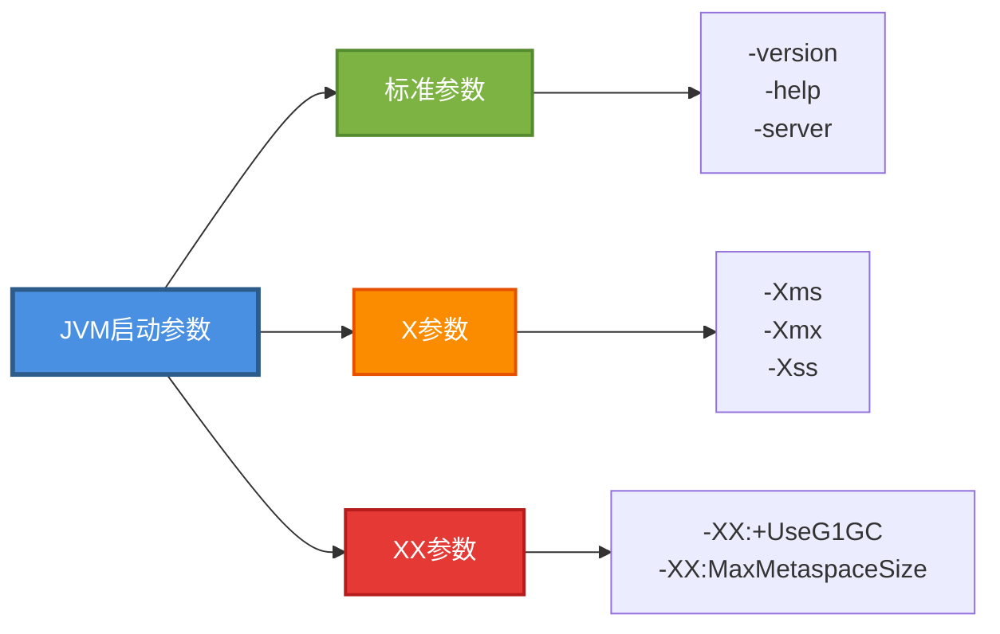
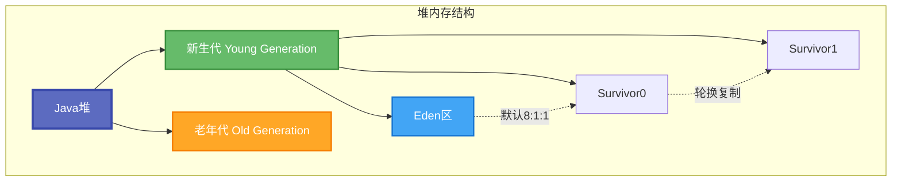
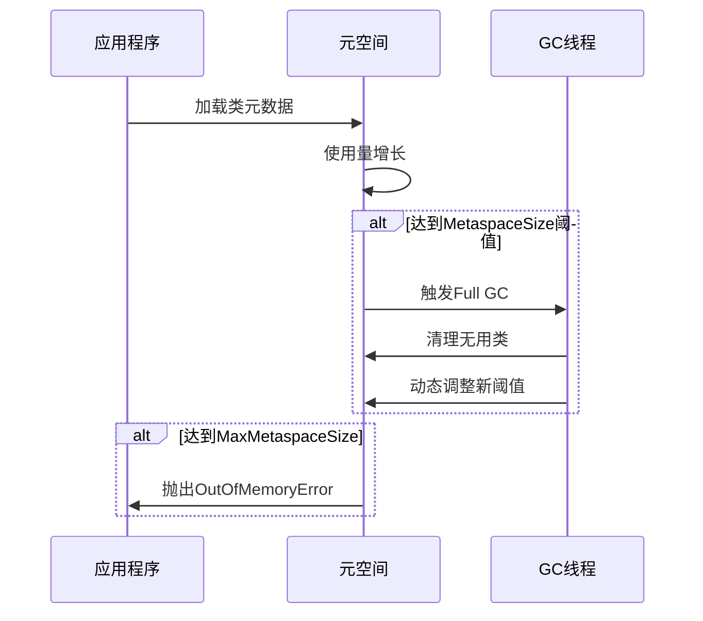
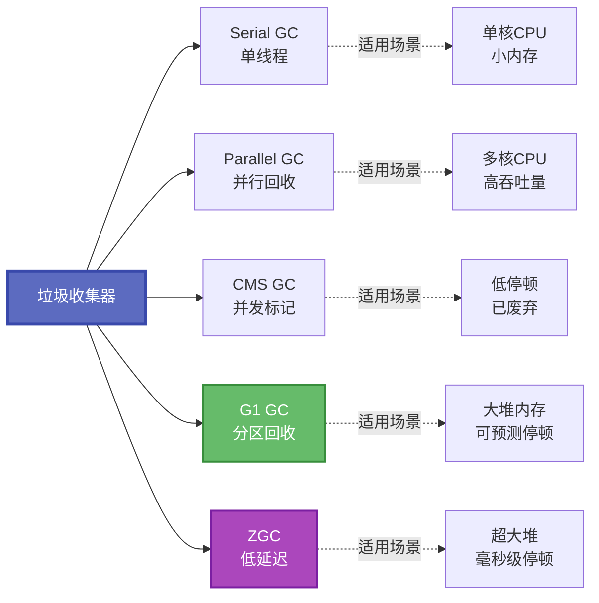
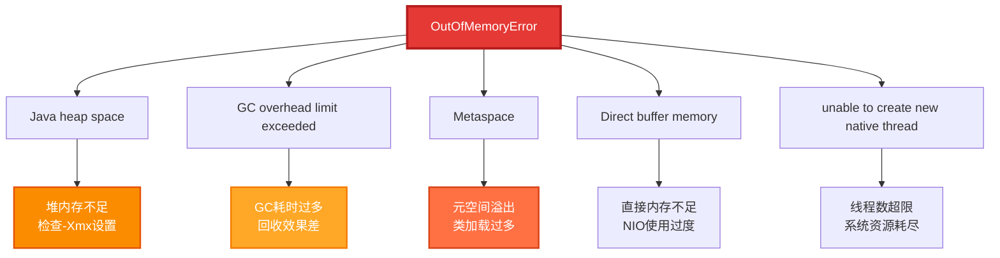
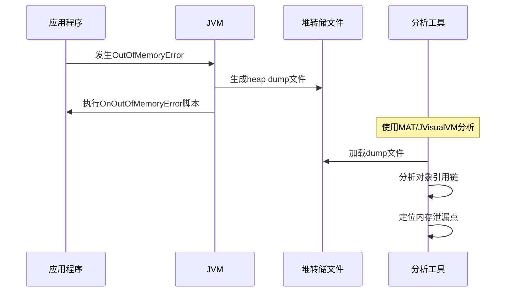
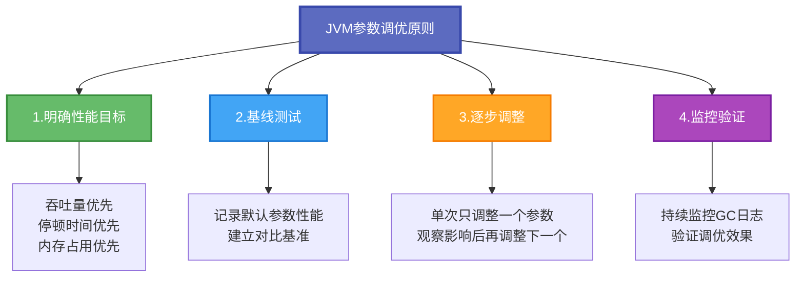

# JVM参数配置与性能调优

JVM参数配置是Java应用性能调优的核心手段之一。通过合理设置JVM参数，可以有效控制内存使用、优化垃圾回收行为、提升应用响应速度。本文将深入讲解JVM常用参数的原理、配置方法及最佳实践。

## 参数分类与基本概念

JVM启动参数按照作用范围和特征可分为三大类：



- **标准参数**：所有JVM实现都支持的稳定参数，如 `-version`、`-server`
- **X参数**：非标准化参数，主要用于内存配置，如 `-Xms`、`-Xmx`
- **XX参数**：高级选项，用于JVM内部调优，如 `-XX:+UseG1GC`

## 堆内存配置详解

堆内存是Java对象实例的主要存储区域，所有线程共享。合理配置堆内存对应用性能至关重要。

### 堆空间结构模型



### 初始与最大堆内存设置

堆内存大小通过`-Xms`和`-Xmx`参数控制：

```bash
# 设置JVM初始堆大小为2GB
-Xms2G

# 设置JVM最大堆大小为4GB
-Xmx4G
```

**参数说明：**
- `-Xms`：JVM启动时初始化堆内存大小
- `-Xmx`：JVM运行期间堆内存最大可扩展值
- 内存单位：`k`/`K`(KB)、`m`/`M`(MB)、`g`/`G`(GB)

**最佳实践：**

建议将`-Xms`和`-Xmx`设置为相同值，避免运行时堆内存动态扩展带来的性能开销：

```bash
# 推荐配置：固定堆内存为4GB
-Xms4G -Xmx4G
```

### 新生代内存配置

新生代是大部分对象的初始分配区域，合理配置可显著降低Full GC频率。


**方式一：通过NewSize和MaxNewSize指定**

```bash
# 设置新生代初始大小为512MB
-XX:NewSize=512m

# 设置新生代最大大小为1GB
-XX:MaxNewSize=1024m
```

**方式二：通过Xmn统一设置**

```bash
# 固定新生代大小为1GB
-Xmn1g
```

**方式三：通过NewRatio设置比例**

```bash
# 设置老年代与新生代比例为2:1（新生代占堆的1/3）
-XX:NewRatio=2
```

### Survivor区比例配置

Eden区与单个Survivor区的比例通过`SurvivorRatio`控制：

```bash
# 设置Eden:Survivor = 8:1（默认值）
-XX:SurvivorRatio=8
```

此时新生代内部比例为：`Eden:Survivor0:Survivor1 = 8:1:1`

## 元空间与永久代配置

### Java 8前后的演变


### 永久代配置（JDK 7及之前）

```bash
# 设置永久代初始大小为128MB
-XX:PermSize=128m

# 设置永久代最大大小为256MB
-XX:MaxPermSize=256m
```

### 元空间配置（JDK 8及之后）

```bash
# 设置触发Full GC的元空间阈值为256MB
-XX:MetaspaceSize=256m

# 设置元空间最大可用大小为512MB
-XX:MaxMetaspaceSize=512m
```

**关键理解点：**

1. **MetaspaceSize的真实作用**：并非元空间初始容量（实际约20MB），而是首次触发Full GC的阈值
2. **动态扩容机制**：元空间首次达到MetaspaceSize阈值时触发Full GC，之后JVM动态调整该阈值
3. **MaxMetaspaceSize的必要性**：若不设置上限，元空间可能耗尽系统本地内存，强烈建议设置合理上限

### 元空间扩容触发流程



## 垃圾回收器选型与配置

### 主流垃圾收集器对比



### 垃圾收集器启用参数

```bash
# 启用Serial GC（串行收集器）
-XX:+UseSerialGC

# 启用Parallel GC（JDK 8默认，并行收集器）
-XX:+UseParallelGC

# 启用CMS GC（并发标记清除，JDK 14已移除）
-XX:+UseConcMarkSweepGC

# 启用G1 GC（JDK 9+默认）
-XX:+UseG1GC

# 启用ZGC（低延迟收集器，JDK 11+）
-XX:+UseZGC
```

### G1 GC专属调优参数

```bash
# 设置期望的最大GC停顿时间为200ms
-XX:MaxGCPauseMillis=200

# 设置GC工作线程数为8
-XX:ParallelGCThreads=8

# 设置并发标记线程数
-XX:ConcGCThreads=2

# 设置触发并发GC的堆使用率阈值为45%
-XX:InitiatingHeapOccupancyPercent=45
```

## GC日志配置与分析

### 完整的GC日志配置方案

```bash
# 打印详细GC信息
-XX:+PrintGCDetails

# 打印GC时间戳（日期+时间格式）
-XX:+PrintGCDateStamps

# 指定GC日志文件路径（%t为时间戳占位符）
-Xloggc:/var/logs/app/gc-%t.log

# 打印对象晋升年龄分布
-XX:+PrintTenuringDistribution

# GC前后打印堆详细信息
-XX:+PrintHeapAtGC

# 打印引用处理信息（强/软/弱/虚引用）
-XX:+PrintReferenceGC

# 打印应用暂停时间
-XX:+PrintGCApplicationStoppedTime

# 启用GC日志滚动
-XX:+UseGCLogFileRotation

# 保留最近10个日志文件
-XX:NumberOfGCLogFiles=10

# 单个日志文件最大100MB
-XX:GCLogFileSize=100M
```

### GC日志输出示例解读

```bash
# Young GC示例
2024-11-27T10:15:23.456+0800: [GC (Allocation Failure) 
[PSYoungGen: 512000K->64000K(589824K)] 
1024000K->576000K(2038400K), 0.0123456 secs]

# Full GC示例
2024-11-27T10:20:45.789+0800: [Full GC (Metadata GC Threshold) 
[PSYoungGen: 64000K->0K(589824K)] 
[ParOldGen: 512000K->256000K(1448576K)] 
576000K->256000K(2038400K), 
[Metaspace: 245000K->245000K(1280000K)], 0.5432100 secs]
```

## OOM异常处理与诊断

### OOM发生场景分析



### OOM诊断参数配置

```bash
# OOM时自动生成堆转储文件
-XX:+HeapDumpOnOutOfMemoryError

# 指定堆转储文件存放路径
-XX:HeapDumpPath=/data/dumps/java_heap_dump_%p.hprof

# OOM时执行自定义脚本（告警/重启等）
-XX:OnOutOfMemoryError="sh /opt/scripts/oom_alert.sh %p"

# 启用GC开销限制（98%时间用于GC且回收<2%堆时抛OOM）
-XX:+UseGCOverheadLimit
```

### 堆转储文件分析流程



## 线程栈内存配置

每个Java线程都拥有独立的虚拟机栈，用于存储局部变量、操作数栈等。

```bash
# 设置每个线程栈大小为1MB
-Xss1m

# 设置每个线程栈大小为512KB
-Xss512k
```

**配置建议：**
- 默认值：Linux/macOS为1MB，Windows为320KB
- 调小栈大小可支持更多线程（适用于高并发场景）
- 栈过小会导致`StackOverflowError`（深度递归等场景需调大）

## 其他重要调优参数

### 字符串优化相关

```bash
# 启用字符串去重（JDK 8u20+）
-XX:+UseStringDeduplication

# 设置字符串去重的对象年龄阈值
-XX:StringDeduplicationAgeThreshold=3
```

### 对象晋升控制

```bash
# 设置对象晋升到老年代的年龄阈值（默认15）
-XX:MaxTenuringThreshold=10

# 设置大对象直接进入老年代的阈值
-XX:PretenureSizeThreshold=1048576
```

### 显式GC控制

```bash
# 禁止应用代码调用System.gc()触发Full GC
-XX:+DisableExplicitGC
```

### 大内存页优化

```bash
# 启用大内存页（需操作系统支持）
-XX:+UseLargePages

# 设置大内存页大小
-XX:LargePageSizeInBytes=2m
```

## 实战配置示例

### 高并发Web应用配置

```bash
java -server \
  -Xms8g -Xmx8g \
  -Xmn3g \
  -Xss512k \
  -XX:MetaspaceSize=256m \
  -XX:MaxMetaspaceSize=512m \
  -XX:+UseG1GC \
  -XX:MaxGCPauseMillis=200 \
  -XX:+PrintGCDetails \
  -XX:+PrintGCDateStamps \
  -Xloggc:/logs/gc-%t.log \
  -XX:+UseGCLogFileRotation \
  -XX:NumberOfGCLogFiles=14 \
  -XX:GCLogFileSize=50M \
  -XX:+HeapDumpOnOutOfMemoryError \
  -XX:HeapDumpPath=/dumps/ \
  -XX:+DisableExplicitGC \
  -jar web-application.jar
```

### 大数据批处理任务配置

```bash
java -server \
  -Xms16g -Xmx16g \
  -XX:MetaspaceSize=512m \
  -XX:MaxMetaspaceSize=1g \
  -XX:+UseParallelGC \
  -XX:ParallelGCThreads=8 \
  -XX:+PrintGCDetails \
  -XX:+PrintGCDateStamps \
  -Xloggc:/logs/batch-gc.log \
  -XX:+HeapDumpOnOutOfMemoryError \
  -XX:HeapDumpPath=/dumps/ \
  -jar batch-processor.jar
```

### 微服务应用配置

```bash
java -server \
  -Xms2g -Xmx2g \
  -Xmn800m \
  -Xss256k \
  -XX:MetaspaceSize=128m \
  -XX:MaxMetaspaceSize=256m \
  -XX:+UseG1GC \
  -XX:MaxGCPauseMillis=100 \
  -XX:+PrintGCDetails \
  -Xloggc:/logs/microservice-gc.log \
  -XX:+HeapDumpOnOutOfMemoryError \
  -XX:HeapDumpPath=/dumps/ \
  -jar microservice-app.jar
```

## JVM参数配置最佳实践



### 核心调优建议

1. **固定堆内存大小**：设置`-Xms`和`-Xmx`相同，避免运行时扩容开销
2. **合理配置新生代**：新生代过小导致频繁Minor GC，过大导致单次GC时间长
3. **必须设置元空间上限**：防止类加载器泄漏导致本地内存耗尽
4. **务必开启GC日志**：详细日志是定位性能问题的关键依据
5. **配置OOM自动转储**：发生OOM时自动生成堆转储文件便于事后分析
6. **选择合适的GC**：根据应用特征选择垃圾收集器（吞吐量vs停顿时间）
7. **避免过度优化**：参数调整应基于实际监控数据，避免凭感觉调整

## 总结

JVM参数配置是Java性能调优的基础，本文系统讲解了堆内存、元空间、垃圾收集器、GC日志等核心参数的原理与配置方法。在实际应用中，应遵循"基线测试→逐步调整→监控验证"的迭代优化流程，结合业务特征和性能目标，制定合理的JVM参数配置方案。记住，没有万能的参数配置，只有最适合当前应用场景的配置。
