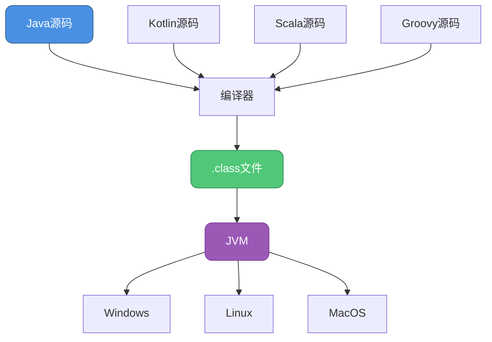
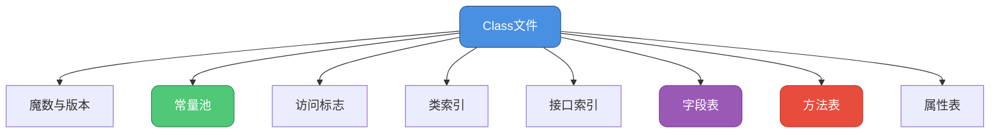
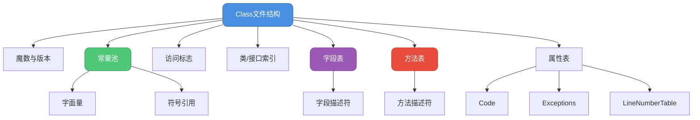

# Class文件结构深度解析

## Class文件概述

Java程序的"一次编译，到处运行"特性依赖于Class文件这个关键桥梁。无论使用Java、Kotlin、Scala还是Groovy编写的代码，最终都会被编译成统一的`.class`文件格式，然后在JVM上运行。



### 为什么需要Class文件

```java
// 多语言互操作示例
public class MultiLanguageDemo {
    
    public static void main(String[] args) {
        // Java调用Kotlin编译的类
        // KotlinUser user = new KotlinUser("张三", 25);
        
        // Java调用Scala编译的类
        // ScalaCalculator calc = new ScalaCalculator();
        
        // 它们都编译成.class文件，可以互相调用
        System.out.println("Class文件是JVM语言互操作的基础");
    }
}
```

## Class文件的整体结构

Class文件是一组以8字节为基础单位的二进制流，严格按照规范排列，没有任何分隔符。

### ClassFile结构定义

```java
// Class文件结构（伪代码表示）
ClassFile {
    u4             magic;                    // 魔数
    u2             minor_version;            // 次版本号
    u2             major_version;            // 主版本号
    u2             constant_pool_count;      // 常量池计数
    cp_info        constant_pool[constant_pool_count-1];  // 常量池
    u2             access_flags;             // 访问标志
    u2             this_class;               // 当前类索引
    u2             super_class;              // 父类索引
    u2             interfaces_count;         // 接口计数
    u2             interfaces[interfaces_count];          // 接口索引表
    u2             fields_count;             // 字段计数
    field_info     fields[fields_count];     // 字段表
    u2             methods_count;            // 方法计数
    method_info    methods[methods_count];   // 方法表
    u2             attributes_count;         // 属性计数
    attribute_info attributes[attributes_count];  // 属性表
}
```



## 魔数与版本号

### 魔数（Magic Number）

每个Class文件的前4个字节是魔数，固定值为`0xCAFEBABE`，用于快速识别文件类型。

```java
// 魔数检查示例
public class MagicNumberDemo {
    
    public static void main(String[] args) throws IOException {
        String classFile = "target/classes/com/example/User.class";
        
        try (FileInputStream fis = new FileInputStream(classFile)) {
            byte[] magic = new byte[4];
            fis.read(magic);
            
            // 检查魔数
            if (isMagicNumberValid(magic)) {
                System.out.println("这是一个有效的Class文件");
                System.out.printf("魔数: 0x%02X%02X%02X%02X%n", 
                    magic[0], magic[1], magic[2], magic[3]);
            } else {
                System.out.println("不是有效的Class文件");
            }
        }
    }
    
    private static boolean isMagicNumberValid(byte[] magic) {
        return magic[0] == (byte) 0xCA &&
               magic[1] == (byte) 0xFE &&
               magic[2] == (byte) 0xBA &&
               magic[3] == (byte) 0xBE;
    }
}
```

### 版本号

紧随魔数之后的是次版本号（2字节）和主版本号（2字节）。

```java
// 版本号解析示例
public class VersionNumberDemo {
    
    public static void main(String[] args) throws IOException {
        String classFile = "target/classes/com/example/Order.class";
        
        try (DataInputStream dis = new DataInputStream(
                new FileInputStream(classFile))) {
            
            // 跳过魔数
            dis.skipBytes(4);
            
            // 读取版本号
            int minorVersion = dis.readUnsignedShort();
            int majorVersion = dis.readUnsignedShort();
            
            System.out.println("Class文件版本: " + majorVersion + "." + minorVersion);
            System.out.println("对应JDK版本: " + getJDKVersion(majorVersion));
        }
    }
    
    private static String getJDKVersion(int majorVersion) {
        // Class文件版本号与JDK版本的对应关系
        switch (majorVersion) {
            case 45: return "JDK 1.1";
            case 46: return "JDK 1.2";
            case 47: return "JDK 1.3";
            case 48: return "JDK 1.4";
            case 49: return "JDK 5";
            case 50: return "JDK 6";
            case 51: return "JDK 7";
            case 52: return "JDK 8";
            case 53: return "JDK 9";
            case 54: return "JDK 10";
            case 55: return "JDK 11";
            case 56: return "JDK 12";
            case 57: return "JDK 13";
            case 58: return "JDK 14";
            case 59: return "JDK 15";
            case 60: return "JDK 16";
            case 61: return "JDK 17";
            default: return "Unknown";
        }
    }
}

// 版本兼容性检查
class VersionCompatibilityDemo {
    
    public static void main(String[] args) {
        String javaVersion = System.getProperty("java.version");
        String classVersion = System.getProperty("java.class.version");
        
        System.out.println("当前JVM版本: " + javaVersion);
        System.out.println("支持的Class版本: " + classVersion);
        
        // 高版本JVM可以运行低版本编译的Class文件
        // 低版本JVM无法运行高版本编译的Class文件
        demonstrateCompatibility();
    }
    
    private static void demonstrateCompatibility() {
        System.out.println("\n版本兼容性规则:");
        System.out.println("✓ JDK 11 可以运行 JDK 8 编译的class");
        System.out.println("✗ JDK 8 不能运行 JDK 11 编译的class");
        System.out.println("  会抛出: UnsupportedClassVersionError");
    }
}
```

## 常量池

常量池是Class文件的核心部分，存储了类中使用的各种字面量和符号引用。

### 常量池结构

```java
// 常量池解析示例
public class ConstantPoolDemo {
    
    // 这些字面量都会存储在常量池中
    public static final String COMPANY_NAME = "科技有限公司";
    public static final int MAX_USERS = 10000;
    public static final double PI = 3.14159;
    
    private String userName;        // 字段名存储在常量池
    private int userId;
    
    public void processOrder(String orderId, double amount) {  
        // 方法名、描述符存储在常量池
        System.out.println("处理订单: " + orderId);
    }
    
    public static void main(String[] args) {
        // 演示如何查看常量池
        demonstrateConstantPool();
    }
    
    private static void demonstrateConstantPool() {
        System.out.println("使用javap命令查看常量池:");
        System.out.println("javap -v ConstantPoolDemo.class");
        System.out.println("\n常量池包含:");
        System.out.println("1. 字面量: 字符串、数字、final常量");
        System.out.println("2. 符号引用: 类、字段、方法");
    }
}
```

### 常量池项类型

```java
// 常量池项类型枚举
public class ConstantPoolItemTypes {
    
    public static void main(String[] args) {
        System.out.println("常量池支持的14种常量类型:");
        
        printConstantType(1, "CONSTANT_Utf8", "UTF-8编码的字符串");
        printConstantType(3, "CONSTANT_Integer", "整型字面量");
        printConstantType(4, "CONSTANT_Float", "浮点型字面量");
        printConstantType(5, "CONSTANT_Long", "长整型字面量");
        printConstantType(6, "CONSTANT_Double", "双精度浮点型字面量");
        printConstantType(7, "CONSTANT_Class", "类或接口的符号引用");
        printConstantType(8, "CONSTANT_String", "字符串类型字面量");
        printConstantType(9, "CONSTANT_Fieldref", "字段的符号引用");
        printConstantType(10, "CONSTANT_Methodref", "类中方法的符号引用");
        printConstantType(11, "CONSTANT_InterfaceMethodref", "接口中方法的符号引用");
        printConstantType(12, "CONSTANT_NameAndType", "字段或方法的符号引用");
        printConstantType(15, "CONSTANT_MethodHandle", "方法句柄");
        printConstantType(16, "CONSTANT_MethodType", "方法类型");
        printConstantType(18, "CONSTANT_InvokeDynamic", "动态方法调用点");
    }
    
    private static void printConstantType(int tag, String name, String description) {
        System.out.printf("Tag=%2d: %-30s - %s%n", tag, name, description);
    }
}

// 常量池实际应用
class ConstantPoolUsageDemo {
    
    private static final String DB_URL = "jdbc:mysql://localhost:3306/shop";
    private static final String DB_USER = "admin";
    
    public void connectDatabase() {
        // DB_URL和DB_USER都存储在常量池中
        // 多次使用同一个字符串，只在常量池中存储一份
        
        String url = DB_URL;  // 引用常量池中的字符串
        String user = DB_USER;
        
        System.out.println("连接数据库: " + url);
        System.out.println("用户: " + user);
    }
    
    public static void main(String[] args) {
        // 字符串字面量的复用
        String s1 = "Hello";  // 存储在常量池
        String s2 = "Hello";  // 引用常量池中的同一个对象
        String s3 = new String("Hello");  // 在堆中创建新对象
        
        System.out.println("s1 == s2: " + (s1 == s2));  // true
        System.out.println("s1 == s3: " + (s1 == s3));  // false
    }
}
```

### 符号引用详解

```java
// 符号引用示例
public class SymbolicReferenceDemo {
    
    public static void main(String[] args) {
        // 创建订单服务
        OrderService orderService = new OrderService();
        
        // 调用方法
        Order order = orderService.createOrder("ORD20240101", 299.99);
        
        // 访问字段
        String id = order.orderId;
        
        demonstrateSymbolicReferences();
    }
    
    private static void demonstrateSymbolicReferences() {
        System.out.println("符号引用包括:");
        System.out.println("1. 类和接口的全限定名");
        System.out.println("   com/example/OrderService");
        System.out.println("\n2. 字段的名称和描述符");
        System.out.println("   orderId:Ljava/lang/String;");
        System.out.println("\n3. 方法的名称和描述符");
        System.out.println("   createOrder:(Ljava/lang/String;D)Lcom/example/Order;");
    }
}

class OrderService {
    private static int orderCount = 0;
    
    public Order createOrder(String orderId, double amount) {
        orderCount++;
        return new Order(orderId, amount);
    }
    
    public int getOrderCount() {
        return orderCount;
    }
}

class Order {
    String orderId;
    double amount;
    
    public Order(String orderId, double amount) {
        this.orderId = orderId;
        this.amount = amount;
    }
}
```

## 访问标志

访问标志用于标识类或接口的访问信息和属性。

```java
// 访问标志示例
public class AccessFlagsDemo {
    
    public static void main(String[] args) throws Exception {
        // 分析不同类的访问标志
        analyzeClass(PublicClass.class);
        analyzeClass(AbstractClass.class);
        analyzeClass(FinalClass.class);
        analyzeClass(InterfaceExample.class);
    }
    
    private static void analyzeClass(Class<?> clazz) {
        int modifiers = clazz.getModifiers();
        
        System.out.println("\n" + clazz.getSimpleName() + " 的访问标志:");
        
        if (Modifier.isPublic(modifiers)) {
            System.out.println("  ACC_PUBLIC (0x0001): 可被包外访问");
        }
        if (Modifier.isFinal(modifiers)) {
            System.out.println("  ACC_FINAL (0x0010): 不允许有子类");
        }
        if (Modifier.isAbstract(modifiers)) {
            System.out.println("  ACC_ABSTRACT (0x0400): 抽象类");
        }
        if (Modifier.isInterface(modifiers)) {
            System.out.println("  ACC_INTERFACE (0x0200): 接口");
        }
        if (clazz.isAnnotation()) {
            System.out.println("  ACC_ANNOTATION (0x2000): 注解类型");
        }
        if (clazz.isEnum()) {
            System.out.println("  ACC_ENUM (0x4000): 枚举类型");
        }
    }
}

// 各种类型的示例
public class PublicClass {
    // ACC_PUBLIC | ACC_SUPER
}

abstract class AbstractClass {
    // ACC_ABSTRACT | ACC_SUPER
    public abstract void process();
}

final class FinalClass {
    // ACC_FINAL | ACC_SUPER
}

interface InterfaceExample {
    // ACC_INTERFACE | ACC_ABSTRACT
    void execute();
}

@interface AnnotationExample {
    // ACC_INTERFACE | ACC_ABSTRACT | ACC_ANNOTATION
    String value();
}

enum EnumExample {
    // ACC_FINAL | ACC_SUPER | ACC_ENUM
    SPRING, SUMMER, AUTUMN, WINTER
}
```

## 字段表

字段表用于描述类或接口中声明的变量，包括类变量和实例变量。

```java
// 字段表示例
public class FieldTableDemo {
    
    // 各种类型的字段
    public static int staticField = 100;           // 类变量
    private String instanceField;                   // 实例变量
    protected transient Object transientField;      // 瞬态字段
    public volatile boolean volatileField;          // volatile字段
    public final double finalField = 3.14;         // final字段
    
    public static void main(String[] args) {
        analyzeFields();
    }
    
    private static void analyzeFields() {
        Class<?> clazz = FieldTableDemo.class;
        Field[] fields = clazz.getDeclaredFields();
        
        System.out.println("字段表分析:\n");
        
        for (Field field : fields) {
            System.out.println("字段名: " + field.getName());
            System.out.println("  类型: " + field.getType().getName());
            System.out.println("  描述符: " + getFieldDescriptor(field.getType()));
            System.out.println("  访问标志: " + Modifier.toString(field.getModifiers()));
            System.out.println();
        }
    }
    
    private static String getFieldDescriptor(Class<?> type) {
        if (type == int.class) return "I";
        if (type == long.class) return "J";
        if (type == float.class) return "F";
        if (type == double.class) return "D";
        if (type == boolean.class) return "Z";
        if (type == char.class) return "C";
        if (type == byte.class) return "B";
        if (type == short.class) return "S";
        if (type == void.class) return "V";
        if (type.isArray()) return "[" + getFieldDescriptor(type.getComponentType());
        return "L" + type.getName().replace('.', '/') + ";";
    }
}

// 字段描述符详解
class FieldDescriptorDemo {
    
    // 基本类型字段
    private int age;              // 描述符: I
    private long timestamp;       // 描述符: J
    private double price;         // 描述符: D
    private boolean active;       // 描述符: Z
    
    // 引用类型字段
    private String name;          // 描述符: Ljava/lang/String;
    private Object data;          // 描述符: Ljava/lang/Object;
    private List<String> items;   // 描述符: Ljava/util/List;
    
    // 数组类型字段
    private int[] numbers;        // 描述符: [I
    private String[] tags;        // 描述符: [Ljava/lang/String;
    private int[][] matrix;       // 描述符: [[I
    
    public static void main(String[] args) {
        System.out.println("字段描述符规则:");
        System.out.println("基本类型: I(int), J(long), D(double), Z(boolean)等");
        System.out.println("引用类型: L<类全名>;");
        System.out.println("数组类型: [<元素描述符>");
    }
}
```

## 方法表

方法表用于描述类中声明的方法。

```java
// 方法表示例
public class MethodTableDemo {
    
    // 各种类型的方法
    public void publicMethod() {}
    
    private String privateMethod(int param) {
        return "Result: " + param;
    }
    
    protected static void staticMethod() {}
    
    public final void finalMethod() {}
    
    public synchronized void synchronizedMethod() {}
    
    public native void nativeMethod();
    
    public static void main(String[] args) {
        analyzeMethods();
    }
    
    private static void analyzeMethods() {
        Class<?> clazz = MethodTableDemo.class;
        Method[] methods = clazz.getDeclaredMethods();
        
        System.out.println("方法表分析:\n");
        
        for (Method method : methods) {
            System.out.println("方法名: " + method.getName());
            System.out.println("  返回类型: " + method.getReturnType().getName());
            System.out.println("  参数类型: " + getParameterTypes(method));
            System.out.println("  描述符: " + getMethodDescriptor(method));
            System.out.println("  访问标志: " + Modifier.toString(method.getModifiers()));
            System.out.println();
        }
    }
    
    private static String getParameterTypes(Method method) {
        Class<?>[] params = method.getParameterTypes();
        if (params.length == 0) return "无参数";
        
        StringBuilder sb = new StringBuilder();
        for (int i = 0; i < params.length; i++) {
            if (i > 0) sb.append(", ");
            sb.append(params[i].getSimpleName());
        }
        return sb.toString();
    }
    
    private static String getMethodDescriptor(Method method) {
        StringBuilder sb = new StringBuilder("(");
        
        // 参数描述符
        for (Class<?> param : method.getParameterTypes()) {
            sb.append(getTypeDescriptor(param));
        }
        
        sb.append(")");
        
        // 返回值描述符
        sb.append(getTypeDescriptor(method.getReturnType()));
        
        return sb.toString();
    }
    
    private static String getTypeDescriptor(Class<?> type) {
        if (type == int.class) return "I";
        if (type == long.class) return "J";
        if (type == double.class) return "D";
        if (type == boolean.class) return "Z";
        if (type == void.class) return "V";
        if (type.isArray()) return "[" + getTypeDescriptor(type.getComponentType());
        return "L" + type.getName().replace('.', '/') + ";";
    }
}

// 方法描述符详解
class MethodDescriptorDemo {
    
    // 无参无返回值
    public void method1() {}
    // 描述符: ()V
    
    // 有参无返回值
    public void method2(int a, String b) {}
    // 描述符: (ILjava/lang/String;)V
    
    // 有参有返回值
    public String method3(int id, boolean flag) {
        return "result";
    }
    // 描述符: (IZ)Ljava/lang/String;
    
    // 复杂参数和返回值
    public List<User> method4(String[] names, int[] scores) {
        return new ArrayList<>();
    }
    // 描述符: ([Ljava/lang/String;[I)Ljava/util/List;
    
    public static void main(String[] args) {
        System.out.println("方法描述符格式: (参数描述符)返回值描述符");
        System.out.println("\n示例:");
        System.out.println("void method()                    -> ()V");
        System.out.println("String method(int, boolean)      -> (IZ)Ljava/lang/String;");
        System.out.println("int[] method(String, Object)     -> (Ljava/lang/String;Ljava/lang/Object;)[I");
    }
}

class User {
    private String name;
    private int age;
}
```

## 属性表

属性表用于描述某些场景的专有信息。

```java
// 属性表示例
public class AttributeTableDemo {
    
    private String userName = "默认用户";
    
    public void processData(String input) throws IOException {
        // Code属性：存储方法的字节码指令
        if (input == null) {
            throw new IllegalArgumentException("输入不能为空");
        }
        
        System.out.println("处理数据: " + input);
    }
    
    @Deprecated
    public void oldMethod() {
        // Deprecated属性：标记废弃的方法
        System.out.println("这是一个废弃的方法");
    }
    
    public static void main(String[] args) throws Exception {
        demonstrateAttributes();
    }
    
    private static void demonstrateAttributes() throws Exception {
        Class<?> clazz = AttributeTableDemo.class;
        
        System.out.println("常见的属性类型:\n");
        
        // 1. Code属性
        Method method = clazz.getDeclaredMethod("processData", String.class);
        System.out.println("1. Code属性");
        System.out.println("   包含方法的字节码指令");
        System.out.println("   processData方法有 " + 
            method.getParameterCount() + " 个参数\n");
        
        // 2. Exceptions属性
        Class<?>[] exceptions = method.getExceptionTypes();
        System.out.println("2. Exceptions属性");
        System.out.println("   声明的异常: " + Arrays.toString(exceptions) + "\n");
        
        // 3. Deprecated属性
        Method oldMethod = clazz.getDeclaredMethod("oldMethod");
        System.out.println("3. Deprecated属性");
        System.out.println("   oldMethod是否废弃: " + oldMethod.isAnnotationPresent(Deprecated.class) + "\n");
        
        // 4. ConstantValue属性
        System.out.println("4. ConstantValue属性");
        System.out.println("   用于final static字段的初始值\n");
        
        // 5. SourceFile属性
        System.out.println("5. SourceFile属性");
        System.out.println("   源文件名: AttributeTableDemo.java\n");
        
        // 6. LineNumberTable属性
        System.out.println("6. LineNumberTable属性");
        System.out.println("   字节码指令与源代码行号的对应关系\n");
        
        // 7. LocalVariableTable属性
        System.out.println("7. LocalVariableTable属性");
        System.out.println("   局部变量表信息");
    }
}

// Code属性详解
class CodeAttributeDemo {
    
    public int calculate(int a, int b) {
        int sum = a + b;
        int product = a * b;
        return sum + product;
    }
    
    /*
     * Code属性结构:
     * {
     *     u2 max_stack;          // 操作数栈最大深度
     *     u2 max_locals;         // 局部变量表大小
     *     u4 code_length;        // 字节码指令长度
     *     u1 code[code_length];  // 字节码指令
     *     u2 exception_table_length;
     *     exception_table[exception_table_length];
     *     u2 attributes_count;
     *     attributes[attributes_count];
     * }
     */
    
    public static void main(String[] args) {
        System.out.println("使用javap -v查看Code属性:");
        System.out.println("javap -v CodeAttributeDemo.class");
    }
}
```

## 实战：解析Class文件

```java
// Class文件解析器
public class ClassFileParser {
    
    public static void main(String[] args) throws IOException {
        String classFile = "target/classes/com/example/Product.class";
        parseClassFile(classFile);
    }
    
    private static void parseClassFile(String fileName) throws IOException {
        try (DataInputStream dis = new DataInputStream(
                new FileInputStream(fileName))) {
            
            // 1. 读取魔数
            int magic = dis.readInt();
            System.out.printf("魔数: 0x%08X%n", magic);
            
            if (magic != 0xCAFEBABE) {
                System.out.println("不是有效的Class文件");
                return;
            }
            
            // 2. 读取版本号
            int minorVersion = dis.readUnsignedShort();
            int majorVersion = dis.readUnsignedShort();
            System.out.println("版本: " + majorVersion + "." + minorVersion);
            
            // 3. 读取常量池
            int constantPoolCount = dis.readUnsignedShort();
            System.out.println("常量池大小: " + (constantPoolCount - 1));
            
            // 4. 跳过常量池（实际应解析）
            // parseConstantPool(dis, constantPoolCount);
            
            // 5. 读取访问标志
            // int accessFlags = dis.readUnsignedShort();
            
            // 6. 读取类索引、父类索引
            // ...
            
            System.out.println("\nClass文件解析完成");
        }
    }
}

// 使用ASM库解析Class文件
class ASMClassParserDemo {
    
    public static void main(String[] args) throws IOException {
        String classFile = "target/classes/com/example/Order.class";
        
        // 使用ASM库可以更方便地解析Class文件
        System.out.println("推荐使用ASM、Javassist等库来操作Class文件");
        System.out.println("这些库提供了更高级的API，无需手动解析字节码");
    }
}
```

## 使用工具查看Class文件

```java
// 查看Class文件的方法
public class ViewClassFileDemo {
    
    public static void main(String[] args) {
        System.out.println("=== 方法1：使用javap命令 ===");
        System.out.println("javap -v YourClass.class");
        System.out.println("  -v: 详细信息");
        System.out.println("  -c: 反汇编代码");
        System.out.println("  -s: 显示内部类型签名");
        System.out.println("  -p: 显示所有类和成员");
        
        System.out.println("\n=== 方法2：使用jclasslib插件 ===");
        System.out.println("IDEA安装jclasslib Bytecode Viewer插件");
        System.out.println("可视化查看Class文件结构");
        
        System.out.println("\n=== 方法3：使用在线工具 ===");
        System.out.println("classpy - 在线Class文件查看器");
        
        System.out.println("\n=== 方法4：使用WinHex等十六进制编辑器 ===");
        System.out.println("直接查看二进制内容");
    }
}
```

## 总结

Class文件是Java跨平台的关键：



关键要点：
1. Class文件是平台无关的二进制格式
2. 严格按照规范排列，没有分隔符
3. 常量池是核心，存储字面量和符号引用
4. 字段表和方法表描述类的成员
5. 属性表提供扩展信息
6. 使用javap或jclasslib等工具查看Class文件
