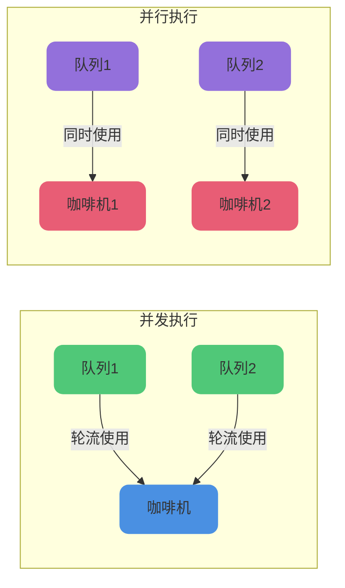
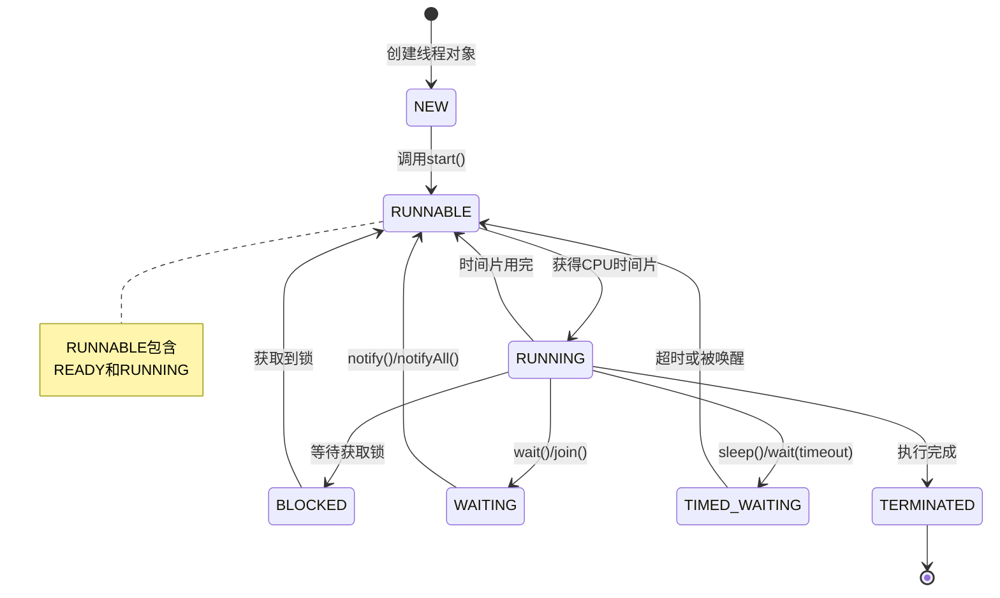

# 并发编程基础概念

## 并发与并行的区别

### 什么是并发

在操作系统中,**并发(Concurrent)** 是指在某个时间段内,多个程序都处于已启动到执行完毕之间的状态,并且这些程序运行在同一个处理器上。

我们使用的操作系统,无论是Windows、Linux还是macOS,都是**多用户多任务分时操作系统**。在这种系统下,用户可以"同时"执行多项任务。

但在单CPU计算机中,同一时刻CPU只能执行一条指令。为了实现"同时执行多个任务"的效果,分时操作系统将CPU时间划分为时间片,通过操作系统管理,将时间片依次轮流分配给各个任务使用。

当某个任务在时间片结束前未完成时,该任务会暂停并释放CPU,等待下一轮调度继续执行,此时CPU会分配给其他任务。由于CPU处理速度极快,只要时间片间隔设置得当,用户无法察觉到任务的"停顿",会感觉整个系统专属于自己使用。

因此,在单CPU计算机中,我们看到的"同时执行多任务",实际上是通过CPU时间片技术并发完成的。

### 什么是并行

**并行(Parallel)** 是指当系统拥有多个CPU时,一个CPU执行一个进程的同时,另一个CPU可以执行另一个进程,两个进程互不抢占CPU资源,可以真正同时进行。

Erlang之父Joe Armstrong用一张形象的图解释了并发与并行的区别:



在计算机系统中,咖啡机相当于CPU,队列代表进程。并发是两个队列交替使用一台咖啡机,并行是两个队列同时使用两台咖啡机。

## 线程的创建方式

在Java中,共有四种方式可以创建线程:

### 继承Thread类创建线程

```java
class TaskThread extends Thread {
    private String taskName;
    
    public TaskThread(String taskName) {
        this.taskName = taskName;
    }
    
    @Override
    public void run() {
        System.out.println(taskName + " 开始执行");
        try {
            Thread.sleep(2000);
        } catch (InterruptedException e) {
            e.printStackTrace();
        }
        System.out.println(taskName + " 执行完成");
    }
}

public class ThreadExample {
    public static void main(String[] args) {
        TaskThread task = new TaskThread("数据处理任务");
        task.start();
    }
}
```

### 实现Runnable接口创建线程

```java
class TaskRunnable implements Runnable {
    private String taskName;
    
    public TaskRunnable(String taskName) {
        this.taskName = taskName;
    }
    
    @Override
    public void run() {
        System.out.println(taskName + " 开始执行");
        try {
            Thread.sleep(2000);
        } catch (InterruptedException e) {
            e.printStackTrace();
        }
        System.out.println(taskName + " 执行完成");
    }
}

public class RunnableExample {
    public static void main(String[] args) {
        Thread task = new Thread(new TaskRunnable("文件处理任务"));
        task.start();
    }
}
```

### 通过Callable和FutureTask创建线程

Callable接口与Runnable的主要区别:

- Callable的call()方法有返回值(类型为泛型指定的类型),Runnable的run()方法无返回值
- Callable可以抛出受检异常,Runnable不可以
- Callable和Runnable都可用于线程池,但Thread类只支持Runnable

```java
import java.util.concurrent.Callable;
import java.util.concurrent.ExecutionException;
import java.util.concurrent.FutureTask;

public class CallableExample {
    public static void main(String[] args) throws InterruptedException, ExecutionException {
        Callable&lt;String&gt; callable = () -&gt; {
            System.out.println("数据查询任务启动");
            Thread.sleep(3000);
            return "查询结果: 共找到100条记录";
        };

        FutureTask&lt;String&gt; futureTask = new FutureTask&lt;&gt;(callable);
        Thread thread = new Thread(futureTask);
        thread.start();

        System.out.println("主线程继续执行其他操作");
        System.out.println("获取结果: " + futureTask.get());
    }
}
```

Future接口代表异步执行的结果,可以通过get()方法获取结果(该方法会阻塞直到结果准备好),通过cancel()方法取消任务。FutureTask是Future接口的实现,可以提交给线程池执行。

### 通过线程池创建线程

```java
import java.util.concurrent.Callable;
import java.util.concurrent.ExecutionException;
import java.util.concurrent.ExecutorService;
import java.util.concurrent.Executors;
import java.util.concurrent.Future;

public class ThreadPoolExample {
    public static void main(String[] args) throws InterruptedException, ExecutionException {
        ExecutorService executor = Executors.newSingleThreadExecutor();
        
        Callable&lt;String&gt; callable = () -&gt; {
            System.out.println("批量导入任务启动");
            Thread.sleep(3000);
            return "导入成功: 共导入500条数据";
        };

        System.out.println("提交任务到线程池");
        Future&lt;String&gt; future = executor.submit(callable);

        System.out.println("执行其他业务逻辑");
        System.out.println("获取任务结果: " + future.get());

        executor.shutdown();
    }
}
```

:::tip 提示
虽然有四种创建线程的方式,但归根结底只有两种:继承Thread类和实现Runnable接口。其他方式都是基于这两种方式的扩展。
:::

## 线程的生命周期

### 线程的六种状态

Java中线程的状态分为6种:

- **NEW(初始)**: 新创建了一个线程对象,但还没有调用start()方法
- **RUNNABLE(运行)**: Java线程将就绪(READY)和运行中(RUNNING)两种状态统称为"运行"
  - 就绪(READY): 线程对象调用start()方法后,该状态的线程位于可运行线程池中,等待被线程调度器选中并分配CPU时间片
  - 运行中(RUNNING): 就绪状态的线程获得了CPU时间片,开始执行程序代码
- **BLOCKED(阻塞)**: 线程阻塞于锁,等待获取监视器锁
- **WAITING(等待)**: 进入该状态的线程需要等待其他线程做出特定操作(通知或中断)
- **TIMED_WAITING(超时等待)**: 该状态可以在指定时间后自行返回
- **TERMINATED(终止)**: 线程已经执行完毕

### 线程状态流转图



### WAITING和TIMED_WAITING的区别

WAITING是等待状态,当线程调用wait()方法时会进入该状态。TIMED_WAITING是超时等待状态,当线程执行sleep()方法时会进入该状态。

两种状态的线程都会让出CPU,但对象锁的释放行为不同:

- sleep()方法不会释放对象锁
- wait()方法会释放对象锁

因为Java锁的目标是对象,所以wait()、notify()和notifyAll()都定义在Object类中。而sleep()不需要释放锁,所以定义在Thread类中。

### 为什么线程没有RUNNING状态

在分时操作系统中,对于单CPU系统,所有线程实际上是串行执行的。为了实现看起来的并发效果,CPU执行被划分为很小的时间片(通常10-20毫秒)。

哪个线程获得时间片就执行哪个线程,时间片用完后释放CPU,重新竞争时间片。只要时间片划分得足够细,多个程序虽然在不断串行执行,但看起来像是同时执行。


由于CPU时间片很短,同一个线程在一秒内可能部分时间处于READY状态,部分时间处于RUNNING状态。如果明确定义RUNNING状态,存在一个问题:这个状态不准确。当我们看到线程是RUNNING状态时,很可能它已经失去了CPU时间片。

对于线程状态,我们只需要知道它当前是否"正在参与执行"即可。所谓"参与执行",是指线程状态是可执行的,只要获得时间片就能立即执行,这正是RUNNABLE状态的含义。因此,Java没有为线程定义RUNNING状态,而是定义了RUNNABLE状态。

## run()方法和start()方法的区别

创建线程后,需要调用start()方法来启动线程。**start()方法是启动线程的入口**。

如果直接调用run()方法,则会在当前线程中直接执行run()方法,不会创建新线程,无法实现多线程效果。

```java
public class StartVsRun {
    public static void main(String[] args) {
        Thread t1 = new Thread(() -&gt; {
            System.out.println("当前线程: " + Thread.currentThread().getName());
        }, "工作线程");

        // 正确方式:启动新线程
        t1.start();  // 输出: 当前线程: 工作线程

        // 错误方式:在主线程中执行
        Thread t2 = new Thread(() -&gt; {
            System.out.println("当前线程: " + Thread.currentThread().getName());
        }, "任务线程");
        t2.run();    // 输出: 当前线程: main
    }
}
```
