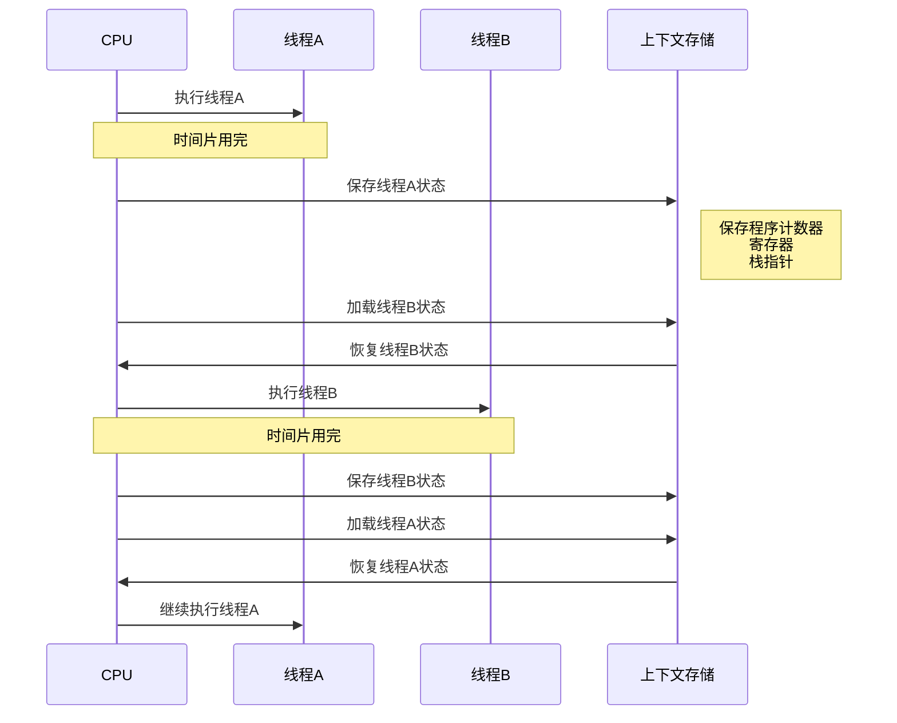

# 线程调度与上下文切换

## 线程调度机制

### 什么是线程调度

对于单CPU计算机,在任意时刻只能执行一条机器指令,每个线程只有获得CPU的使用权才能执行指令。宏观上看,各个线程轮流获得CPU使用权,分别执行各自的任务。

线程的运行状态包含两种子状态:就绪(READY)和运行中(RUNNING)。线程从就绪状态变为运行状态,需要系统调度分配CPU使用权。

**线程调度是指按照特定机制为多个线程分配CPU使用权的过程**。进程是资源分配的基本单元,线程是CPU调度的基本单元。

### 不同操作系统的线程调度

#### Linux线程调度

在Linux中,线程由轻量级进程(lightweight process)实现,线程调度采用进程调度方式。调度器根据线程的调度策略(scheduling policy)和静态调度优先级(static scheduling priority)决定运行哪个线程。

Linux主要有三种调度策略:

- **SCHED_OTHER**: 分时调度策略(默认)
- **SCHED_FIFO**: 实时调度策略,先到先服务
- **SCHED_RR**: 实时调度策略,时间片轮转

#### Windows线程调度

Windows采用基于优先级的抢占式调度算法。调度程序确保最高优先级的线程总是处于运行状态。

当低优先级线程运行时,如果更高优先级的线程变为就绪状态,低优先级线程会被抢占。这种抢占机制使得高优先级线程能优先获得CPU使用权。

调度程序选中的线程会持续运行,直到:

- 被更高优先级线程抢占
- 线程终止
- 时间片用完
- 调用阻塞系统调用(如I/O)

#### Java线程调度

Java程序运行在JVM上,JVM帮助屏蔽了操作系统差异,使Java成为跨平台语言。在操作系统中,一个Java程序就是一个进程,因此**Java是单进程、多线程的**。

Thread类的关键方法都声明为Native,需要根据不同操作系统有不同实现。JVM实现了线程调度器,定义了线程调度模型,规定了CPU运算的分配机制。

主要有两种调度模型:

##### 协同式线程调度

协同式调度中,线程执行时间由线程自身控制。线程完成工作后,主动通知系统切换到其他线程。

优点:

- 实现简单
- 线程切换对线程自身可知,无线程同步问题

缺点:

- 线程执行时间不可控
- 一个线程可能导致整个进程阻塞

##### 抢占式调度模型

抢占式调度中,每个线程的执行时间由系统分配,线程切换不由线程本身决定。系统让优先级高的线程占用CPU,优先级相同则随机选择。

优点:

- 线程执行时间可控
- 不会因一个线程导致整个进程阻塞
- 并发性更好

**Java虚拟机采用抢占式调度模型**。

### 线程优先级

虽然线程调度由系统自动完成,但可以通过设置线程优先级"建议"系统分配更多执行时间。Java设置了10个级别的线程优先级(Thread.MIN_PRIORITY至Thread.MAX_PRIORITY)。

```java
public class PriorityExample {
    public static void main(String[] args) {
        Thread highPriority = new Thread(() -&gt; {
            System.out.println("高优先级任务执行");
        });
        
        Thread lowPriority = new Thread(() -&gt; {
            System.out.println("低优先级任务执行");
        });
        
        highPriority.setPriority(Thread.MAX_PRIORITY);
        lowPriority.setPriority(Thread.MIN_PRIORITY);
        
        highPriority.start();
        lowPriority.start();
    }
}
```

:::warning 注意
线程优先级并不完全可靠。Java线程通过映射到系统原生线程实现,线程调度最终取决于操作系统。虽然很多操作系统提供线程优先级概念,但不一定能与Java线程优先级一一对应。
:::

## 上下文切换

### 什么是上下文切换

**上下文切换是指CPU从一个线程转到另一个线程时,保存当前线程的上下文状态,恢复另一个线程的上下文状态的过程**。

在多线程编程中,由于多个线程共享CPU时间片,当一个线程的时间片用完后,需要切换到另一个线程运行。此时需要保存当前线程的状态信息,包括:

- 程序计数器
- 寄存器
- 栈指针

保存这些信息后,系统将另一个线程的状态信息恢复,使该线程能够正确运行。



### 上下文切换的开销

多线程环境下,上下文切换的开销比单线程大,因为需要保存和恢复更多的上下文信息。**过多的上下文切换会降低系统运行效率**,导致CPU时间浪费。

### 减少上下文切换的方法

频繁的上下文切换会浪费CPU时间,在多线程编程时应尽可能避免。以下是减少上下文切换的方法:

#### 减少线程数

通过合理的线程池管理减少线程的创建和销毁。线程数不是越多越好,合理的线程数可以避免因线程过多导致频繁上下文切换。

```java
import java.util.concurrent.ExecutorService;
import java.util.concurrent.Executors;

public class ThreadPoolExample {
    public static void main(String[] args) {
        // 根据CPU核心数设置合理的线程数
        int coreNum = Runtime.getRuntime().availableProcessors();
        ExecutorService executor = Executors.newFixedThreadPool(coreNum);
        
        for (int i = 0; i &lt; 100; i++) {
            final int taskId = i;
            executor.submit(() -&gt; {
                System.out.println("执行任务 " + taskId);
            });
        }
        
        executor.shutdown();
    }
}
```

#### 使用无锁并发编程

无锁并发编程可以避免线程因等待锁而进入阻塞状态,从而减少上下文切换。

```java
import java.util.concurrent.atomic.AtomicInteger;

public class LockFreeExample {
    private static AtomicInteger counter = new AtomicInteger(0);
    
    public static void increment() {
        counter.incrementAndGet();
    }
    
    public static int getCount() {
        return counter.get();
    }
}
```

#### 使用CAS算法

CAS(Compare And Swap)算法可以避免线程的阻塞和唤醒操作,减少上下文切换。

#### 使用协程

协程是用户态线程,切换不需要操作系统参与,可以避免操作系统级别的上下文切换。

JDK 19引入的虚拟线程就是协程的一种实现。虚拟线程避免了操作系统级别的上下文切换,虽然仍需要在JVM层面保存和恢复线程状态,但成本低得多。

```java
// JDK 19+ 虚拟线程示例
public class VirtualThreadExample {
    public static void main(String[] args) throws InterruptedException {
        Thread vThread = Thread.ofVirtual().start(() -&gt; {
            System.out.println("虚拟线程执行任务");
        });
        vThread.join();
    }
}
```

#### 合理使用锁

在使用锁时,需要:

- 避免过多使用同步块或同步方法
- 尽量缩小同步块或同步方法的范围
- 减少线程等待时间,避免上下文切换

```java
public class LockOptimization {
    private final Object lock = new Object();
    private int sharedData = 0;
    
    public void inefficientMethod() {
        synchronized(lock) {
            // 大量非共享数据操作
            int localVar = 0;
            for (int i = 0; i &lt; 1000; i++) {
                localVar += i;
            }
            // 共享数据操作
            sharedData++;
        }
    }
    
    public void efficientMethod() {
        // 非共享数据操作放在锁外
        int localVar = 0;
        for (int i = 0; i &lt; 1000; i++) {
            localVar += i;
        }
        // 只对共享数据操作加锁
        synchronized(lock) {
            sharedData++;
        }
    }
}
```

## 线程存活状态判断

### isAlive()方法

在Java中,可以通过Thread类的isAlive()方法判断线程是否存活:

```java
public class AliveExample {
    public static void main(String[] args) throws InterruptedException {
        Thread worker = new Thread(() -&gt; {
            System.out.println("工作线程开始");
            try {
                Thread.sleep(2000);
            } catch (InterruptedException e) {
                e.printStackTrace();
            }
            System.out.println("工作线程结束");
        });
        
        worker.start();
        System.out.println("worker.isAlive() = " + worker.isAlive());
        worker.join();
        System.out.println("worker.isAlive() = " + worker.isAlive());
    }
}
```

输出结果:

```
worker.isAlive() = true
工作线程开始
工作线程结束
worker.isAlive() = false
```

### isAlive()方法的特殊情况

但isAlive()方法在某些情况下可能返回不准确的结果:

```java
public class AliveSpecialCase {
    public static void main(String[] args) {
        Thread worker = new Thread(() -&gt; {
            System.out.println("worker线程开始");
            try {
                Thread.sleep(1000);
            } catch (InterruptedException e) {
                e.printStackTrace();
            }
            System.out.println("worker线程结束");
        });
        
        Thread monitor = new Thread(() -&gt; {
            synchronized (worker) {
                System.out.println("monitor线程开始");
                try {
                    Thread.sleep(3000);
                } catch (InterruptedException e) {
                    e.printStackTrace();
                }
                System.out.println("monitor线程结束");
                System.out.println("worker.isAlive(): " + worker.isAlive());
            }
        });
        
        worker.start();
        monitor.start();
    }
}
```

输出结果:

```
monitor线程开始
worker线程开始
worker线程结束
monitor线程结束
worker.isAlive(): true
```

可以看到worker线程已经结束,但isAlive()方法返回true。

### 原理分析

产生这个现象的原因是:**isAlive()需要获取当前对象的锁**。上面代码中monitor线程对worker对象进行了synchronized,即worker线程结束时需要修改自己的状态,而worker对象的锁被monitor持有,所以无法修改状态,导致isAlive()返回true。

查看isAlive()方法实现:

```java
public final native boolean isAlive();
```

这是一个本地方法,对应JDK源码中的`java_lang_Thread::is_alive`方法。底层实现是获取当前线程对象的`_eetop_offset`值,不为空则返回true。

```cpp
bool java_lang_Thread::is_alive(oop java_thread) {
  JavaThread* thr = java_lang_Thread::thread(java_thread);
  return (thr != NULL);
}

JavaThread* java_lang_Thread::thread(oop java_thread) {
  return (JavaThread*)java_thread-&gt;address_field(_eetop_offset);
}
```

调用start()方法时,通过`native_thread-&gt;prepare(jthread)`的prepare方法设置`_eetop_offset`为当前线程对象:

```cpp
void JavaThread::prepare(jobject jni_thread, ThreadPriority prio) {
  // 省略其他代码
  java_lang_Thread::set_thread(thread_oop(), this);
  // 省略其他代码
}

void java_lang_Thread::set_thread(oop java_thread, JavaThread* thread) {
  java_thread-&gt;address_field_put(_eetop_offset, (address)thread); 
}
```

Java线程结束时,JVM调用`JavaThread::exit`方法:

```cpp
void JavaThread::exit(bool destroy_vm, ExitType exit_type) {
  // 省略其他代码
  ensure_join(this); // 设置线程状态,包括设置_eetop_offset值为空
  // 省略其他代码
}

static void ensure_join(JavaThread* thread) {
  Handle threadObj(thread, thread-&gt;threadObj());
  ObjectLocker lock(threadObj, thread); // 获取当前线程对象的锁
  java_lang_Thread::set_thread_status(threadObj(), java_lang_Thread::TERMINATED);
  java_lang_Thread::set_thread(threadObj(), NULL); // 设置_eetop_offset值为空
  lock.notify_all(thread);
}
```

ObjectLocker就是synchronized的实现:

```cpp
ObjectLocker::ObjectLocker(Handle obj, Thread* thread, bool doLock) {
  _obj = obj; // obj为worker线程对象
  if (_dolock) {
    ObjectSynchronizer::fast_enter(_obj, &_lock, false, _thread);
    // 由于worker的锁被monitor持有,worker无法设置_eetop_offset值为空
    // 因此isAlive()返回true,线程状态也无法修改为TERMINATED
  }
}
```

:::warning 结论
线程退出过程中需要获取当前对象的锁才能设置`_eetop_offset`。如果线程对象的锁被其他线程持有,线程无法设置`_eetop_offset`为空,此时isAlive()仍返回true,线程状态也无法修改为TERMINATED。
:::
