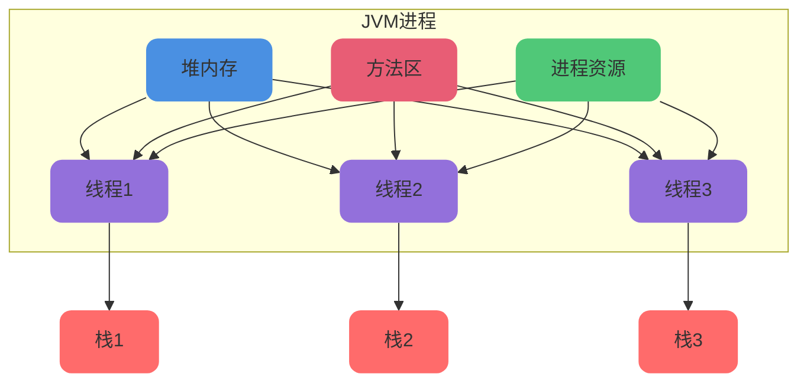
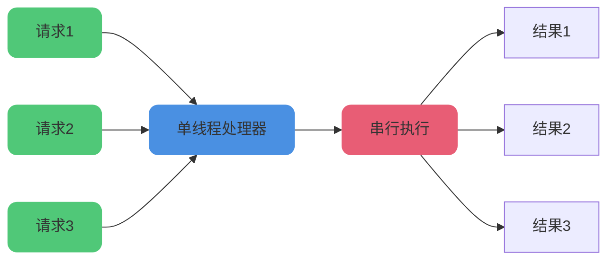

# 线程安全与并发控制

## 线程安全的深入理解

### 什么是线程安全

**线程安全是指某个函数在并发环境中被调用时,能够正确处理多个线程之间的共享变量,使程序功能正确完成**。

简单来说,多个线程同时访问共享变量时,得到的结果和预期一致,就是线程安全。线程安全涉及四个关键要素:

- **并发环境**: 多个任务同时执行
- **多线程**: 多个执行单元
- **共享变量**: 多个线程可访问的数据
- **正确完成**: 满足原子性、有序性和可见性

### 进程与线程的关系

在多任务操作系统中,CPU需要处理所有程序的操作。当用户切换程序时,需要记录程序执行位置。CPU切换到另一个进程时需要保存当前进程状态并恢复另一个进程状态,这个过程称为**上下文切换**。

对于操作系统,一个任务就是一个**进程(Process)**。例如:

- 打开浏览器启动一个浏览器进程
- 打开记事本启动一个记事本进程
- 打开Word启动一个Word进程

在多个进程之间切换需要进行上下文切换,这会消耗资源。为了降低切换成本,人们在进程中增加"子任务",这些子任务共享进程资源,但切换不需要上下文切换。

在进程内部同时执行多个"子任务"称为**线程(Thread)**。例如Word可以同时进行打字、拼写检查、字数统计等。

随着发展,**进程被定义为资源分配的基本单元,线程被定义为执行的基本单元,同一进程的多个线程共享资源**。

以Java为例,Java程序运行在JVM上,每个JVM是一个进程,所有资源分配基于JVM进程。在JVM进程中可以创建多个线程,多个线程共享JVM资源并可以并发执行。



:::tip 提示
在JDK 21之前,Java线程在操作系统层面基于轻量级进程实现,本质上存在操作系统级别的上下文切换。JDK 21的虚拟线程是用户态线程,切换不需要操作系统参与,可以避免操作系统级别上下文切换,但仍需要在JVM层面保存和恢复线程状态,成本低得多。
:::

### 线程的特点

#### 轻量级实体

线程基本不拥有系统资源,只有必不可少的能保证独立运行的资源。线程实体包括程序、数据和TCB(Thread Control Block,线程控制块)。

TCB包含以下信息:

- 线程状态
- 线程不运行时保存的现场资源
- 一组执行堆栈
- 存放局部变量的主存区
- 访问同一进程中主存和其他资源的权限

#### 独立调度和分派的基本单位

线程是能独立运行的基本单位,因而也是独立调度和分派的基本单位。由于线程很"轻",线程切换非常迅速且开销小(在同一进程中)。

#### 可并发执行

一个进程中的多个线程可以并发执行,不同进程中的线程也能并发执行,充分利用和发挥了处理机与外围设备并行工作的能力。

#### 共享进程资源

同一进程中的各个线程可以共享该进程拥有的资源:

- 所有线程具有相同的地址空间
- 线程可以访问地址空间的每一个虚地址
- 可以访问进程拥有的已打开文件、定时器、信号量等
- 线程之间通信不必调用内核

### 共享变量与线程安全

**共享变量是指多个线程都可以操作的变量**。进程是资源分配的基本单位,线程是执行的基本单位,多个线程可以共享进程中的部分数据。

在JVM中,Java堆和方法区是多个线程共享的数据区域。保存在堆和方法区中的变量就是Java中的共享变量。

#### 类变量、实例变量和局部变量

Java中共有三种变量,分别存放在JVM的不同区域:

- **类变量(静态变量)**: 存放在方法区(元空间)
- **实例变量(成员变量)**: 存放在堆内存
- **局部变量**: 存放在栈内存

```java
public class VariableTypes {
    // 类变量(共享变量)
    private static int sharedCounter;

    // 实例变量(共享变量)
    private int instanceValue;

    public void processData(int param) {
        // 局部变量(非共享变量)
        int localValue = 0;
        
        // 操作共享变量需要考虑线程安全
        sharedCounter++;
        this.instanceValue++;
        
        // 操作局部变量不需要考虑线程安全
        localValue++;
    }
}
```

类变量和实例变量是共享变量,多线程场景下需要考虑线程安全。局部变量是非共享变量,不需要考虑线程安全。

:::warning 注意
即使是共享变量,如果只有读操作没有写操作,或者对象没有被复用,也不会存在线程安全问题。
:::

## 线程安全的实现方案

在并发编程中遇到线程安全问题时,有多种实现方案:

### 单线程方案

最简单的方式是不支持多线程,只用单线程执行,从根本上杜绝线程安全问题。

**Redis就是这种思想**,在命令执行时只依赖单线程。这样做的好处是:

- 完全避免线程安全问题
- 无需考虑锁和同步开销
- 实现简单,易于维护



### 互斥锁方案

如果必须使用多线程,加锁是一种有效的排队方式。无论是synchronized、ReentrantLock这种单机锁,还是Redis实现的分布式锁,或数据库中的乐观锁、悲观锁,本质都是通过互斥锁让并发请求排队执行。

```java
import java.util.concurrent.locks.Lock;
import java.util.concurrent.locks.ReentrantLock;

public class MutexExample {
    private int counter = 0;
    private Lock lock = new ReentrantLock();
    
    // 使用synchronized
    public synchronized void incrementSync() {
        counter++;
    }
    
    // 使用ReentrantLock
    public void incrementLock() {
        lock.lock();
        try {
            counter++;
        } finally {
            lock.unlock();
        }
    }
}
```

### 读写分离方案

读写分离思想认为读操作并发是安全的,只需要让写操作不并发即可。

Java并发包中的COW(Copy-On-Write)机制就是读写分离思想的体现。例如CopyOnWriteArrayList,当有新元素添加时:

- 从原数组拷贝一份
- 在新数组中进行写操作
- 写完后将原数组引用指向新数组

```java
import java.util.concurrent.CopyOnWriteArrayList;

public class CowExample {
    private CopyOnWriteArrayList&lt;String&gt; list = new CopyOnWriteArrayList&lt;&gt;();
    
    public void addData(String data) {
        list.add(data);  // 写时复制
    }
    
    public void readData() {
        for (String item : list) {  // 读操作无需加锁
            System.out.println(item);
        }
    }
}
```

### 原子操作方案

原子操作是不可中断的操作,要么全部执行成功,要么全部失败。在多线程环境中,可以使用原子操作实现对共享资源的安全访问。

Java中的AtomicInteger等原子类底层依赖CAS(Compare And Swap)指令:

```java
import java.util.concurrent.atomic.AtomicInteger;

public class AtomicExample {
    private AtomicInteger counter = new AtomicInteger(0);
    
    public void increment() {
        counter.incrementAndGet();  // 原子操作
    }
    
    public int getCounter() {
        return counter.get();
    }
}
```

### 不可变模式方案

并发问题的重要原因是共享变量存在写操作。如果只有读操作,永远不会出现线程安全问题,因为多线程读永远是线程安全的。

通过只读解决并发问题的设计模式称为**不可变模式(Immutability)**。

Java中的String就是不可变模式的体现:

```java
public class ImmutableExample {
    // String是不可变的,多线程安全
    private final String name;
    private final int age;
    
    public ImmutableExample(String name, int age) {
        this.name = name;
        this.age = age;
    }
    
    public String getName() {
        return name;
    }
    
    public int getAge() {
        return age;
    }
    
    // 没有setter方法,对象创建后不可修改
}
```

好处:

- 永远不会出现并发问题
- 无需加锁,性能更好
- 代码更简洁,易于理解

### 数据不共享方案

如果没有共享数据,就不会有线程安全问题。除了不可变模式,还可以使用ThreadLocal避免数据共享:

```java
public class ThreadLocalExample {
    private static ThreadLocal&lt;Integer&gt; threadLocal = new ThreadLocal&lt;&gt;();
    
    public void setData(int value) {
        threadLocal.set(value);  // 每个线程独立的数据
    }
    
    public int getData() {
        Integer value = threadLocal.get();
        return value != null ? value : 0;
    }
    
    public void clearData() {
        threadLocal.remove();  // 避免内存泄漏
    }
}
```

ThreadLocal为每个线程提供独立的变量副本,不同线程之间互不影响。

## 原子性操作详解

### int a = 1 是原子操作吗

在Java中,`int a = 1;`这条语句可以被认为是原子性操作,因为它是一个简单的赋值语句,在一个操作中完成,不会被中断。

在单线程情况下,这条语句原子性执行,将1赋值给变量a的操作是不可分割的。

但在多线程情况下,多个线程可能同时访问和修改同一个变量,导致**竞态条件(race condition)**:

```java
public class RaceConditionExample {
    private static int sharedValue = 0;
    
    public static void main(String[] args) throws InterruptedException {
        Thread t1 = new Thread(() -&gt; sharedValue = 1);
        Thread t2 = new Thread(() -&gt; sharedValue = 2);
        
        t1.start();
        t2.start();
        t1.join();
        t2.join();
        
        // sharedValue的值不确定,可能是1或2
        System.out.println("sharedValue = " + sharedValue);
    }
}
```

虽然每个赋值语句本身是原子的,但在多线程环境中,线程执行顺序不确定,可能出现:

- 线程1执行完后线程2执行,sharedValue为2
- 线程2执行完后线程1执行,sharedValue为1

为了避免竞态条件确保线程安全,可以使用同步机制:

```java
import java.util.concurrent.atomic.AtomicInteger;
import java.util.concurrent.locks.Lock;
import java.util.concurrent.locks.ReentrantLock;

public class ThreadSafeSolution {
    private static int value1 = 0;
    private static AtomicInteger value2 = new AtomicInteger(0);
    private static Lock lock = new ReentrantLock();
    
    // 方案1: 使用synchronized
    public static synchronized void setSyncValue(int val) {
        value1 = val;
    }
    
    // 方案2: 使用AtomicInteger
    public static void setAtomicValue(int val) {
        value2.set(val);
    }
    
    // 方案3: 使用ReentrantLock
    public static void setLockValue(int val) {
        lock.lock();
        try {
            value1 = val;
        } finally {
            lock.unlock();
        }
    }
}
```

### User a = new User() 是原子操作吗

`User a = new User();`看起来是单个操作,但实际包含多个步骤:

- 为User对象分配内存
- 调用构造函数初始化对象
- 将对象引用赋给变量a


虽然整个操作不是原子的,但**引用赋值部分是原子的**。Java语言规范保证引用变量的赋值操作是原子的,在任何时间点,线程看到的引用变量a要么指向某个User对象,要么是null,不会出现中间状态。

:::warning 指令重排风险
在极限的高并发场景,如果伴随指令重排,比如把引用赋值步骤重排到前面,可能被其他线程拿到一个不完整的对象。这就是为什么在单例模式的双重检查锁定中需要使用volatile关键字。
:::

```java
public class Singleton {
    // 使用volatile防止指令重排
    private static volatile Singleton instance;
    
    private Singleton() {}
    
    public static Singleton getInstance() {
        if (instance == null) {
            synchronized (Singleton.class) {
                if (instance == null) {
                    instance = new Singleton();  // 防止指令重排导致的问题
                }
            }
        }
        return instance;
    }
}
```
