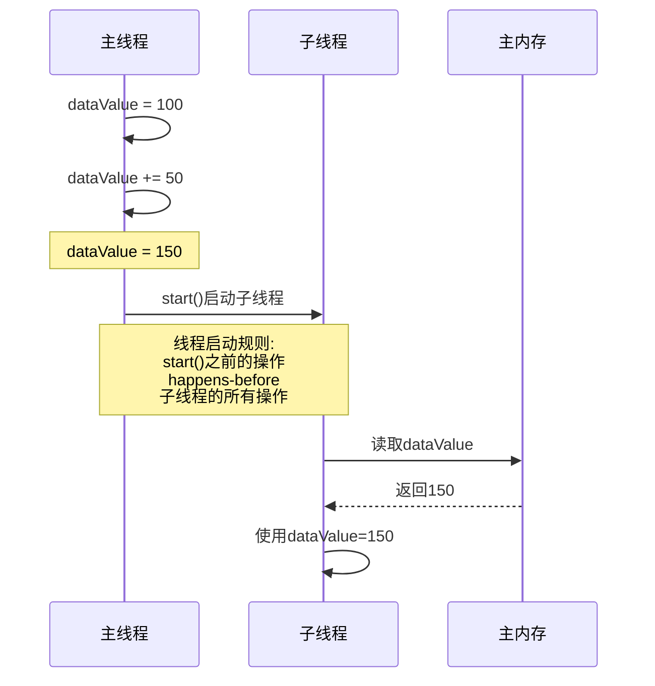
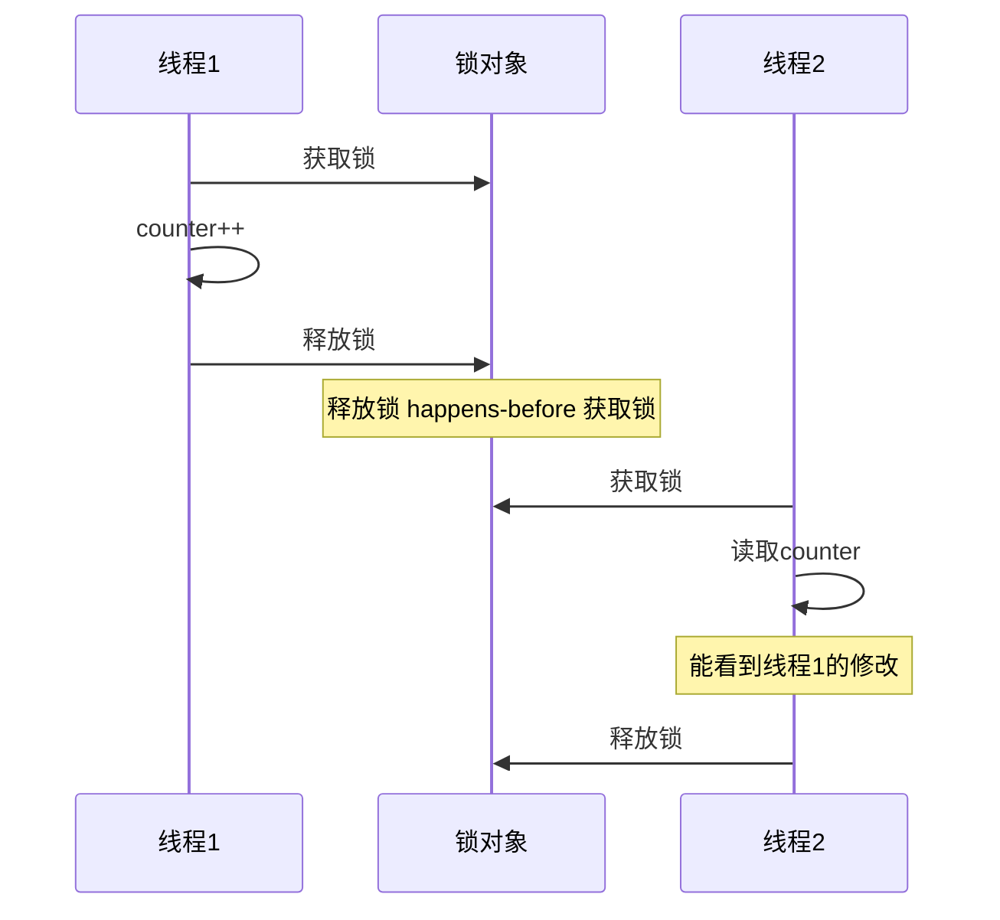
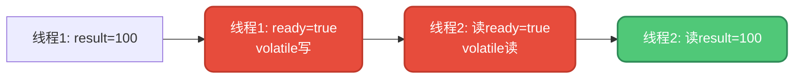
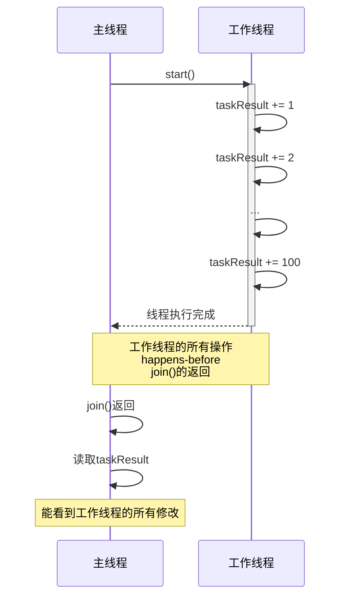
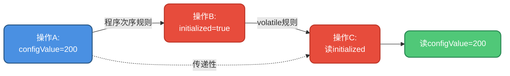
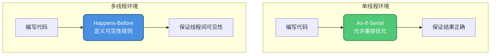

# Happens-Before原则详解

## Happens-Before是什么

在Java内存模型(JMM)中,**Happens-Before原则是用于描述多线程程序中操作执行顺序的重要规则**。它是理解线程间内存可见性和有序性的关键。

**核心定义**: 如果一个操作A "happens-before" 另一个操作B,那么操作A的执行结果对操作B是可见的。

我们知道,在单线程环境中有as-if-serial语义保证程序执行结果的正确性。而在多线程环境下,happens-before原则就扮演了类似的角色,用于保证跨线程的内存可见性和有序性。

### 一个典型例子

看下面这段代码:

```java
public class DataInitializer {
    private int dataValue = 100;

    public void initializeData() {
        dataValue += 50;  // 主线程修改
        new Thread(() -> {
            int localData = dataValue;  // 子线程读取
            System.out.println("读取到的值: " + localData);
        }).start();
    }
}
```

这段代码中,主线程修改了 `dataValue`,子线程读取 `dataValue`,但我们并没有使用 `synchronized` 加锁,也没有用 `volatile` 修饰变量。那么JVM是如何保证主线程的修改对子线程可见的呢?

答案就是**happens-before原则**中的"线程启动规则"在发挥作用。



## Happens-Before的八大规则

happens-before原则并不是在任何场景都适用,它有一些明确的规则。只有在满足这些规则的情况下,才能保证操作间的happens-before关系。

### 程序次序规则

**规则**: 在单个线程内,按照程序代码顺序,前面的操作happens-before后面的操作。

```java
public class ProgramOrderDemo {
    private int x = 0;
    private int y = 0;

    public void executeInOrder() {
        x = 10;  // 操作1
        y = 20;  // 操作2
        int z = x + y;  // 操作3
        // 操作1 happens-before 操作2
        // 操作2 happens-before 操作3
    }
}
```

这个规则保证了在单线程内,代码的逻辑顺序得到维护,即使底层可能发生指令重排,但重排不会影响最终结果。

### 管程锁定规则

**规则**: 对一个锁的解锁操作happens-before后续对这个锁的加锁操作。

```java
public class MonitorLockDemo {
    private int counter = 0;
    private final Object lockObject = new Object();

    public void incrementCounter() {
        synchronized(lockObject) {
            counter++;  // 操作在锁内执行
        }  // 释放锁
    }

    public int readCounter() {
        synchronized(lockObject) {  // 获取锁
            return counter;  
            // increment中的counter++
            // happens-before 这里的读取操作
        }
    }
}
```



这个规则确保了synchronized代码块内的修改,在下一个获取同一把锁的线程中是可见的。

### Volatile变量规则

**规则**: 对volatile字段的写操作happens-before任意后续对这个字段的读操作。

```java
public class VolatileDemo {
    private volatile boolean ready = false;
    private int result = 0;

    public void prepareData() {
        result = 100;  // 操作1
        ready = true;  // volatile写操作
    }

    public void useData() {
        if (ready) {  // volatile读操作
            // 此时能看到result=100
            // 因为volatile写 happens-before volatile读
            System.out.println("结果: " + result);
        }
    }
}
```



volatile保证了写操作对后续读操作立即可见,这是实现线程间通信的重要手段。

### 线程启动规则

**规则**: 对线程的 `start()` 方法调用happens-before该线程的每个操作。

```java
public class ThreadStartDemo {
    private int initialValue = 100;

    public void launchThread() {
        initialValue += 50;  // 主线程修改
        
        Thread worker = new Thread(() -> {
            // 这里能看到initialValue=150
            // 因为start()之前的操作 happens-before 线程内的操作
            int local = initialValue;
            System.out.println("工作线程读取: " + local);
        });
        
        worker.start();
    }
}
```

这个规则确保了在启动新线程之前,主线程对共享变量的所有修改对新线程都是可见的。

### 线程终止规则

**规则**: 线程的所有操作happens-before对这个线程的 `join()` 方法成功返回。

```java
public class ThreadJoinDemo {
    private int taskResult = 0;

    public void executeTask() throws InterruptedException {
        Thread worker = new Thread(() -> {
            // 执行计算任务
            for (int i = 1; i <= 100; i++) {
                taskResult += i;
            }
        });
        
        worker.start();
        worker.join();  
        
        // join()返回后,能看到worker线程的所有修改
        // 因为worker的操作 happens-before join()的返回
        System.out.println("任务结果: " + taskResult);
    }
}
```



### 线程中断规则

**规则**: 对线程 `interrupt()` 方法的调用happens-before被中断线程检测到中断事件的发生。

这个规则保证了线程中断操作的可见性,确保被中断的线程能够及时检测到中断状态。

### 对象终结规则

**规则**: 对象的初始化完成(构造函数执行结束)happens-before它的 `finalize()` 方法的开始。

```java
public class FinalizerDemo {
    private int data;

    public FinalizerDemo(int value) {
        this.data = value;  // 构造函数中初始化
    }

    @Override
    protected void finalize() throws Throwable {
        // finalize执行时,构造函数一定已经执行完成
        // 所以这里data一定是已初始化的值
        System.out.println("清理对象,data=" + data);
        super.finalize();
    }
}
```

这个规则确保了对象在被回收前,其初始化过程已经完全结束。

### 传递性规则

**规则**: 如果操作A happens-before 操作B,操作B happens-before 操作C,那么操作A happens-before 操作C。

```java
public class TransitivityDemo {
    private volatile boolean initialized;
    private int configValue;

    public void initConfig() {
        configValue = 200;    // 操作A
        initialized = true;   // 操作B (volatile写)
    }

    public void useConfig() {
        if (initialized) {    // 操作C (volatile读)
            // 根据传递性:
            // A happens-before B (程序次序规则)
            // B happens-before C (volatile规则)
            // 因此 A happens-before C
            // 所以这里能看到configValue=200
            System.out.println("配置值: " + configValue);
        }
    }
}
```



传递性规则非常重要,它让我们可以通过组合不同的happens-before规则来建立更复杂的可见性保证。

## Happens-Before与As-If-Serial的关系

虽然happens-before和as-if-serial都与程序执行的顺序性和一致性有关,但它们的关注点不同:

### As-If-Serial语义

- **适用范围**: 单线程环境
- **核心思想**: 不管怎么重排序,单线程程序的执行结果不能改变
- **作用**: 允许编译器和处理器优化,但保证单线程程序的正确性
- **关注点**: 单线程内的执行结果一致性

### Happens-Before原则

- **适用范围**: 多线程环境
- **核心思想**: 定义操作间的可见性关系,保证一个操作的结果对另一个操作可见
- **作用**: 确保线程间的内存可见性和有序性
- **关注点**: 跨线程的内存可见性



**两者的联系**:
- As-if-serial是happens-before在单线程环境的体现
- Happens-before是as-if-serial在多线程环境的扩展
- 两者都是为了在允许优化的前提下保证程序的正确性

由于 `synchronized` 保证同一时刻只有一个线程执行,相当于单线程环境,因此遵循as-if-serial语义,自然就保证了有序性。

## Happens-Before的实际应用

### 双重检查锁定(DCL)

```java
public class Singleton {
    // 必须使用volatile
    private volatile static Singleton instance;
    
    public static Singleton getInstance() {
        if (instance == null) {  // 第一次检查
            synchronized (Singleton.class) {
                if (instance == null) {  // 第二次检查
                    instance = new Singleton();
                }
            }
        }
        return instance;
    }
}
```

这里必须使用volatile的原因:
1. `new Singleton()` 并非原子操作,可能被重排序
2. volatile的happens-before规则保证对象完全初始化后才对其他线程可见
3. 防止其他线程看到未完全初始化的对象

### 安全发布对象

```java
public class SafePublisher {
    private final Map<String, String> config;
    private volatile boolean published = false;
    
    public SafePublisher() {
        config = new HashMap<>();
        config.put("host", "localhost");
        config.put("port", "8080");
        // 构造完成后才设置发布标志
        published = true;
    }
    
    public Map<String, String> getConfig() {
        if (published) {
            // volatile规则保证能看到config的完整初始化
            return config;
        }
        return null;
    }
}
```

## 总结

Happens-Before原则是Java并发编程的核心概念:

1. **定义了操作间的可见性关系** - 确保一个操作的结果对另一个操作可见
2. **提供了八大规则** - 涵盖程序顺序、锁、volatile、线程启动/终止等场景
3. **支持传递性** - 可以通过组合规则建立复杂的可见性保证
4. **与as-if-serial互补** - 分别保证单线程和多线程环境的正确性
5. **是volatile和synchronized生效的基础** - 这些关键字正是通过遵循happens-before原则来保证线程安全

理解happens-before原则,能够帮助我们更好地理解Java并发机制,编写正确的多线程程序。
