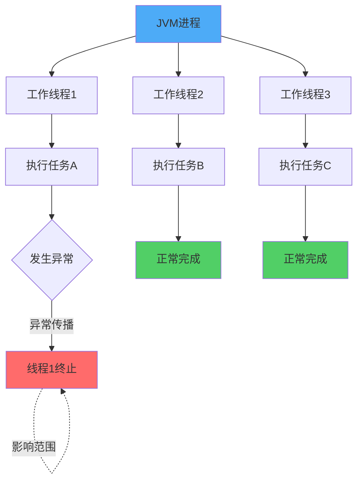
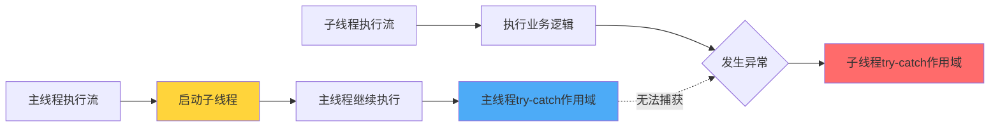
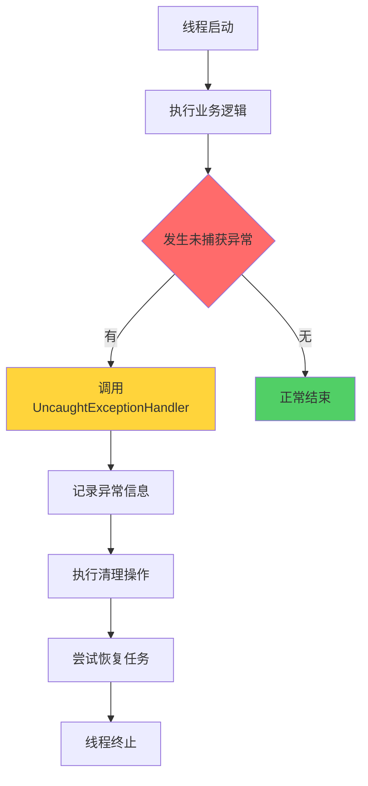
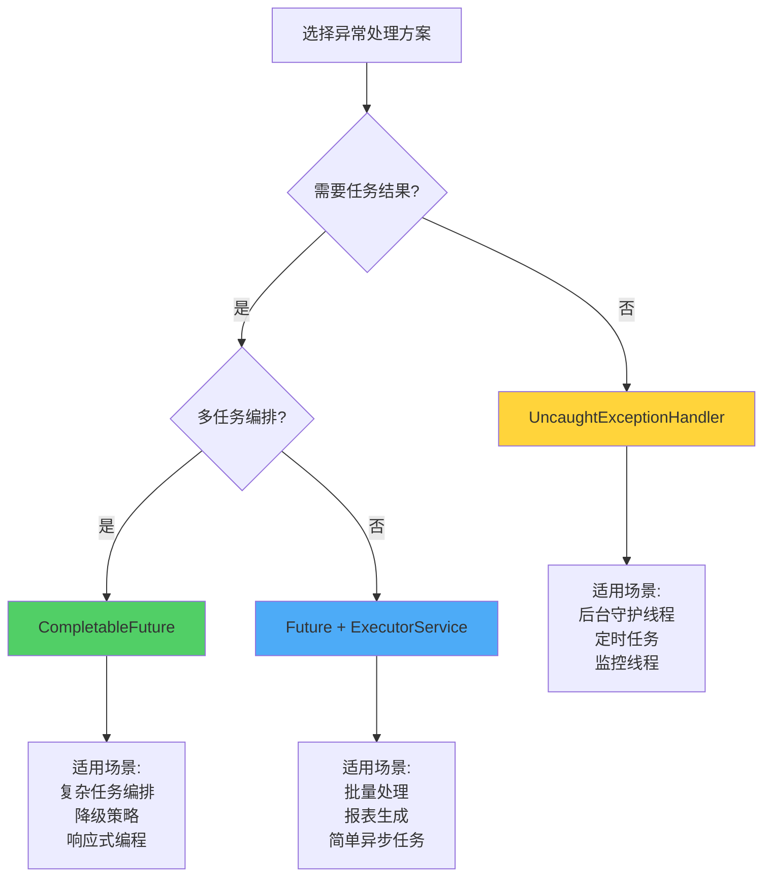

# 线程异常处理机制

## 线程异常的独立性

在Java多线程编程中，每个线程都是独立的执行单元，拥有各自的调用栈和执行上下文。当某个线程内部发生异常时，这个异常只会影响当前线程的执行流程，不会波及到其他线程或导致整个JVM进程终止。

这种设计保证了Java应用的健壮性。假设在一个Web服务器中，每个HTTP请求由独立的线程处理，如果某个请求处理过程中出现了空指针异常，该异常只会导致这个特定请求失败，而不会影响其他正在处理的请求，服务器依然可以继续为其他用户提供服务。

### 线程异常不终止进程的原因

Java虚拟机将异常分为两大类：Exception（异常）和Error（错误）。对于Exception类型的异常，JVM认为这些是可恢复的、预期内的错误情况，因此不会因为单个线程抛出Exception而终止整个进程。

线程异常的隔离机制主要基于以下几点：

1. **独立的执行上下文**：每个线程维护自己的程序计数器、虚拟机栈和本地方法栈，异常信息存储在线程私有的栈帧中
2. **异常传播边界**：未捕获的异常只会在当前线程的调用栈中向上传播，直到线程的run方法结束
3. **线程生命周期管理**：线程因异常终止后，JVM会清理该线程的资源，但其他线程继续正常运行



### 异常处理的最佳实践

在实际开发中，建议在线程执行的核心逻辑中主动使用try-catch块来捕获和处理异常。这样不仅可以记录错误信息，还能执行必要的资源清理操作，避免资源泄漏。

```java
public class OrderProcessingTask implements Runnable {
    private final String orderId;
    
    public OrderProcessingTask(String orderId) {
        this.orderId = orderId;
    }
    
    @Override
    public void run() {
        DatabaseConnection conn = null;
        try {
            conn = DatabasePool.getConnection();
            // 处理订单业务逻辑
            processOrder(orderId, conn);
            conn.commit();
        } catch (DatabaseException e) {
            // 记录异常日志
            Logger.error("订单处理失败: " + orderId, e);
            if (conn != null) {
                conn.rollback();
            }
        } finally {
            // 释放数据库连接
            if (conn != null) {
                conn.close();
            }
        }
    }
    
    private void processOrder(String orderId, DatabaseConnection conn) {
        // 订单处理逻辑
        conn.executeUpdate("UPDATE orders SET status = 'processing' WHERE id = ?", orderId);
        // 更多业务逻辑...
    }
}
```

## 跨线程异常传播的限制

在多线程环境中，主线程无法直接通过try-catch块捕获子线程内部抛出的异常。这是由于线程之间的执行是异步且独立的，主线程执行到启动子线程的代码后会继续向下执行，而子线程在另一个执行流中运行。

### 异步执行导致的异常隔离

当主线程调用子线程的start()方法后，两个线程进入并发执行状态。主线程的try-catch块只能捕获其自身调用栈中抛出的异常，无法跨越线程边界捕获子线程的异常。

```java
public class PaymentService {
    public static void main(String[] args) {
        Thread paymentThread = new Thread(() -> {
            try {
                // 模拟支付处理
                double amount = calculateAmount(1000, 0);
                System.out.println("支付金额: " + amount);
            } catch (ArithmeticException e) {
                System.out.println("支付线程捕获到计算异常");
                throw e; // 重新抛出异常
            }
        });

        try {
            // 主线程启动支付线程
            paymentThread.start();
        } catch (Exception e) {
            // 这里无法捕获到支付线程中的异常
            System.out.println("主线程捕获到异常");
        }

        System.out.println("主线程继续执行后续业务逻辑");
    }
    
    private static double calculateAmount(double price, int quantity) {
        return price / quantity; // 当quantity为0时抛出ArithmeticException
    }
}
```

执行结果：
```
支付线程捕获到计算异常
主线程继续执行后续业务逻辑
```

从输出可以看出，支付线程中发生的异常完全被隔离在该线程内部，主线程无法感知也无法捕获。



## 跨线程异常捕获的实现方案

虽然主线程无法直接捕获子线程异常，但在实际应用中，我们常常需要监控和处理子线程的异常情况。Java提供了多种机制来实现这一需求。

### 使用Future获取异步结果

Future接口配合ExecutorService可以让主线程获取异步任务的执行结果或异常。当调用Future.get()方法时，如果子线程执行过程中抛出了异常，该异常会被包装在ExecutionException中传递给主线程。

```java
import java.util.concurrent.*;

public class ReportGenerator {
    public static void main(String[] args) {
        ExecutorService executor = Executors.newSingleThreadExecutor();

        Future<String> reportTask = executor.submit(() -> {
            // 模拟报表生成过程
            generateMonthlyReport("2024-03");
            throw new RuntimeException("报表生成服务暂时不可用");
        });

        try {
            String report = reportTask.get(); // 阻塞等待结果
            System.out.println("报表生成成功: " + report);
        } catch (ExecutionException e) {
            Throwable actualException = e.getCause();
            System.out.println("捕获到报表生成异常: " + actualException.getMessage());
            // 执行异常处理逻辑，如发送告警通知
            sendAlertNotification(actualException);
        } catch (InterruptedException e) {
            Thread.currentThread().interrupt();
            System.out.println("等待报表生成时被中断");
        } finally {
            executor.shutdown();
        }
    }
    
    private static void generateMonthlyReport(String month) {
        // 报表生成逻辑
        System.out.println("开始生成" + month + "月度报表...");
    }
    
    private static void sendAlertNotification(Throwable error) {
        // 发送告警通知
        System.out.println("已发送告警通知给运维团队");
    }
}
```

执行结果：
```
开始生成2024-03月度报表...
捕获到报表生成异常: 报表生成服务暂时不可用
已发送告警通知给运维团队
```

这种方式适用于需要获取任务执行结果的场景，主线程会阻塞等待子线程完成，异常信息能够准确传递。

### 使用UncaughtExceptionHandler处理未捕获异常

Thread.UncaughtExceptionHandler是一个专门用于处理线程未捕获异常的接口。通过为线程设置自定义的异常处理器，当线程抛出未被捕获的异常时，处理器的uncaughtException方法会被自动调用。

```java
public class DataSyncExceptionHandler implements Thread.UncaughtExceptionHandler {
    @Override
    public void uncaughtException(Thread t, Throwable e) {
        System.out.println("数据同步线程 [" + t.getName() + "] 发生未捕获异常");
        System.out.println("异常类型: " + e.getClass().getName());
        System.out.println("异常信息: " + e.getMessage());
        
        // 记录到日志系统
        logToMonitoringSystem(t.getName(), e);
        
        // 尝试恢复或重启任务
        restartDataSyncTask(t.getName());
    }
    
    private void logToMonitoringSystem(String threadName, Throwable error) {
        // 写入监控系统
        System.out.println("异常已记录到监控系统");
    }
    
    private void restartDataSyncTask(String taskName) {
        // 重启同步任务
        System.out.println("正在重启" + taskName + "任务...");
    }
}

public class DataSyncService {
    public static void main(String[] args) {
        Thread syncThread = new Thread(() -> {
            // 模拟数据同步过程
            syncUserData();
            throw new RuntimeException("数据库连接超时");
        }, "UserDataSyncThread");
        
        // 设置自定义的异常处理器
        syncThread.setUncaughtExceptionHandler(new DataSyncExceptionHandler());
        
        syncThread.start();
        
        System.out.println("主线程继续执行其他业务");
    }
    
    private static void syncUserData() {
        System.out.println("开始同步用户数据...");
    }
}
```

执行结果：
```
主线程继续执行其他业务
开始同步用户数据...
数据同步线程 [UserDataSyncThread] 发生未捕获异常
异常类型: java.lang.RuntimeException
异常信息: 数据库连接超时
异常已记录到监控系统
正在重启UserDataSyncThread任务...
```

UncaughtExceptionHandler特别适合长期运行的后台线程，可以在异常发生时执行日志记录、资源清理、任务重启等操作。



### 使用CompletableFuture异步编排

CompletableFuture是Java 8引入的强大异步编程工具，它提供了丰富的方法来处理异步任务的结果和异常。通过handle()、exceptionally()等方法，可以优雅地处理异步任务中的异常。

```java
import java.util.concurrent.CompletableFuture;

public class ImageProcessingService {
    public static void main(String[] args) {
        CompletableFuture<String> imageTask = CompletableFuture.supplyAsync(() -> {
            // 模拟图片处理
            processImage("user_avatar_12345.jpg");
            throw new RuntimeException("图片处理服务繁忙，请稍后重试");
        });

        imageTask.handle((result, exception) -> {
            if (exception != null) {
                System.out.println("捕获到图片处理异常: " + exception.getMessage());
                // 返回默认图片作为降级方案
                return "default_avatar.jpg";
            } else {
                System.out.println("图片处理成功: " + result);
                return result;
            }
        }).thenAccept(finalImage -> {
            System.out.println("最终使用的图片: " + finalImage);
            updateUserAvatar(finalImage);
        });

        // 防止主线程过早退出
        try {
            Thread.sleep(1000);
        } catch (InterruptedException e) {
            Thread.currentThread().interrupt();
        }
    }
    
    private static void processImage(String imageName) {
        System.out.println("开始处理图片: " + imageName);
    }
    
    private static void updateUserAvatar(String imagePath) {
        System.out.println("用户头像已更新为: " + imagePath);
    }
}
```

执行结果：
```
开始处理图片: user_avatar_12345.jpg
捕获到图片处理异常: 图片处理服务繁忙，请稍后重试
最终使用的图片: default_avatar.jpg
用户头像已更新为: default_avatar.jpg
```

CompletableFuture的优势在于支持链式调用和函数式编程风格，可以方便地实现异步任务编排、异常处理和降级策略。

## 异常处理策略选择

针对不同的业务场景，应选择合适的异常处理方案：

1. **需要获取任务结果**：使用Future或CompletableFuture，适合批量处理、报表生成等场景
2. **后台守护线程**：使用UncaughtExceptionHandler，适合定时任务、监控线程等需要自动恢复的场景
3. **复杂异步编排**：使用CompletableFuture，适合有依赖关系的多个异步任务组合场景



合理运用这些异常处理机制，可以构建更加健壮和可靠的多线程应用程序，确保异常能够被及时发现、记录和处理，避免资源泄漏和服务中断。
