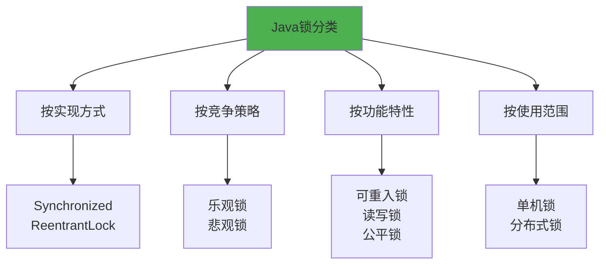
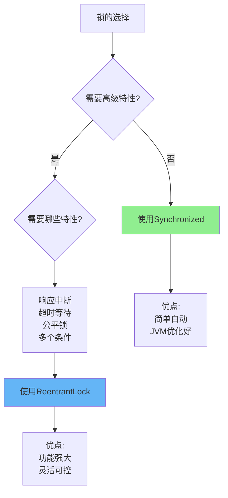
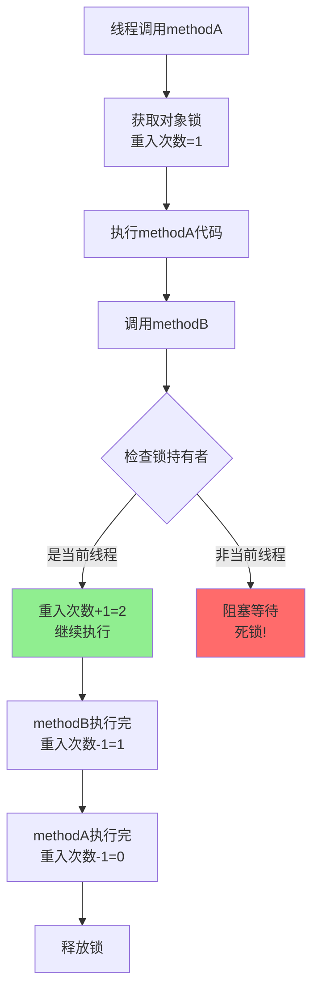
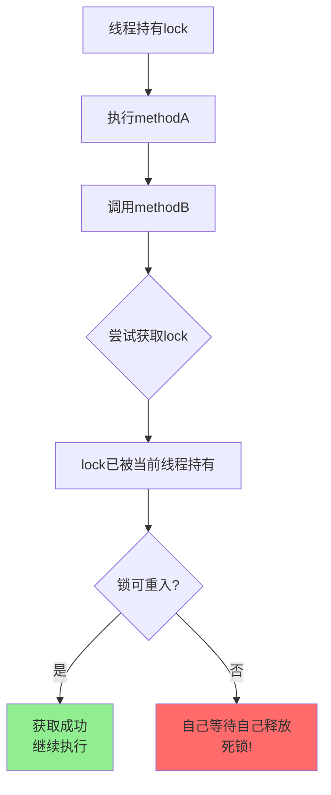
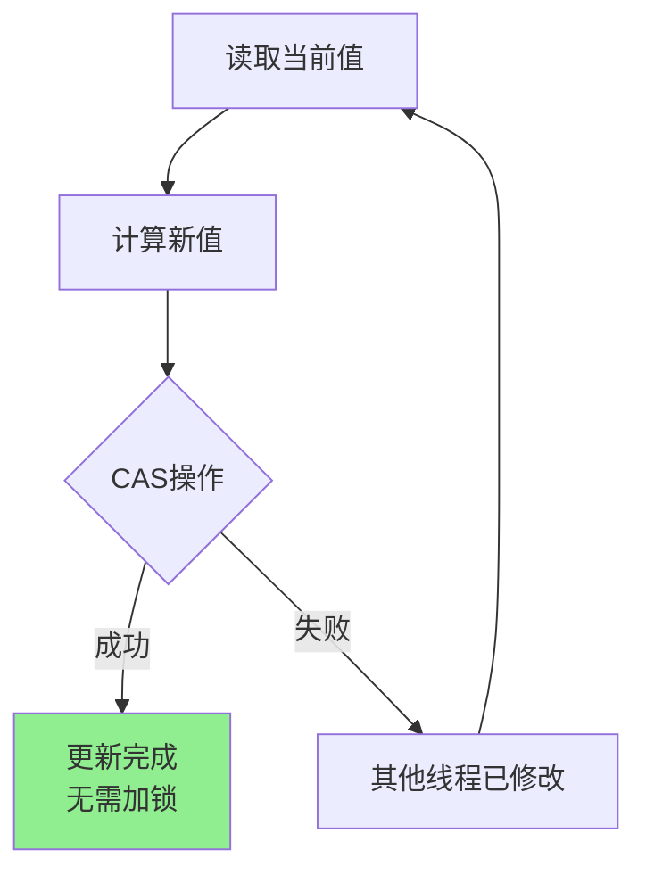
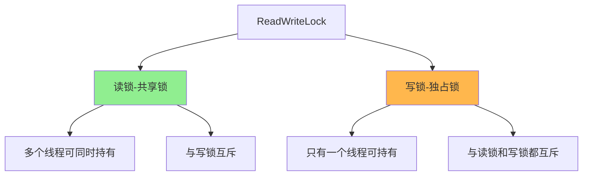
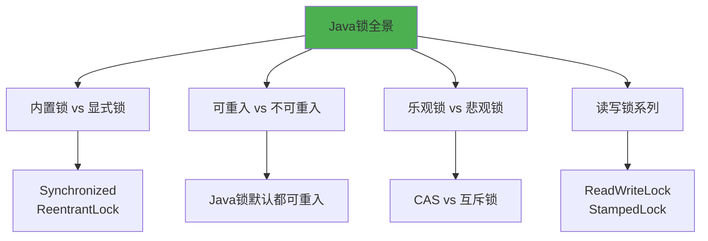

# Java锁机制分类与对比

## Java锁的多维分类

Java中的锁可以从多个维度进行分类,理解这些分类有助于在不同场景下选择合适的锁机制。



## 内置锁与显式锁

### 内置锁:Synchronized

Synchronized是Java语言提供的内置关键字,使用简单但功能相对基础:

```java
public class BuiltInLockDemo {
    private int counter = 0;
    
    // 内置锁:自动获取和释放
    public synchronized void increment() {
        counter++;
    }
    
    // 同步代码块
    public void process() {
        synchronized(this) {
            counter--;
        }
    }
}
```

**特点**:
- **自动管理**: 方法结束或异常时自动释放锁
- **简单易用**: 无需手动加锁解锁
- **隐式操作**: JVM层面实现,对开发者透明
- **非公平锁**: 不保证线程获取锁的顺序

### 显式锁:ReentrantLock

ReentrantLock是Java并发包提供的显式锁,功能更强大:

```java
import java.util.concurrent.locks.ReentrantLock;

public class ExplicitLockDemo {
    private final ReentrantLock lock = new ReentrantLock();
    private int balance = 1000;
    
    public void withdraw(int amount) {
        lock.lock(); // 手动加锁
        try {
            if (balance >= amount) {
                balance -= amount;
                System.out.println("取款成功,余额:" + balance);
            }
        } finally {
            lock.unlock(); // 手动解锁(必须在finally中)
        }
    }
    
    // 支持超时获取锁
    public boolean tryWithdraw(int amount, long timeout) 
            throws InterruptedException {
        if (lock.tryLock(timeout, TimeUnit.SECONDS)) {
            try {
                if (balance >= amount) {
                    balance -= amount;
                    return true;
                }
                return false;
            } finally {
                lock.unlock();
            }
        }
        return false; // 超时未获取到锁
    }
    
    // 支持中断
    public void withdrawInterruptibly(int amount) 
            throws InterruptedException {
        lock.lockInterruptibly(); // 可被中断的加锁
        try {
            balance -= amount;
        } finally {
            lock.unlock();
        }
    }
}
```

**特点**:
- **手动管理**: 需要显式调用lock()和unlock()
- **响应中断**: lockInterruptibly()支持线程中断
- **超时机制**: tryLock(timeout)支持超时等待
- **公平模式**: 可选择公平锁或非公平锁
- **条件变量**: 支持多个Condition

### Synchronized vs ReentrantLock对比



| 对比维度 | Synchronized | ReentrantLock |
|---------|-------------|---------------|
| 实现层面 | JVM内置关键字 | JDK类库实现 |
| 锁的获取/释放 | 自动管理 | 手动管理 |
| 响应中断 | 不支持 | lockInterruptibly() |
| 超时等待 | 不支持 | tryLock(timeout) |
| 公平性 | 仅非公平锁 | 可选公平/非公平 |
| 条件变量 | 单一(wait/notify) | 多个Condition |
| 虚拟线程 | 不建议使用 | 推荐使用 |
| 性能 | JVM优化后很高 | 相当 |

### 何时选择ReentrantLock

虽然Synchronized经过JVM优化后性能已经很好,但以下场景更适合ReentrantLock:

1. **需要响应中断**:
```java
public void interruptibleTask() throws InterruptedException {
    lock.lockInterruptibly(); // 等待锁时可被中断
    try {
        // 长时间运行的任务
        processLongTask();
    } finally {
        lock.unlock();
    }
}
```

2. **需要超时机制**:
```java
public boolean timedTask() throws InterruptedException {
    // 最多等待5秒
    if (lock.tryLock(5, TimeUnit.SECONDS)) {
        try {
            processTask();
            return true;
        } finally {
            lock.unlock();
        }
    }
    return false; // 超时失败
}
```

3. **需要公平锁**:
```java
// 创建公平锁,按FIFO顺序获取
ReentrantLock fairLock = new ReentrantLock(true);
```

4. **虚拟线程场景**: JDK 21引入虚拟线程后,推荐使用ReentrantLock而非Synchronized

## 可重入锁机制

### 什么是可重入锁

**可重入锁允许同一个线程多次获取同一把锁,而不会导致死锁**。这是Java锁的一个重要特性。

```java
public class ReentrantDemo {
    
    // Synchronized是可重入锁
    public synchronized void methodA() {
        System.out.println("进入methodA");
        methodB(); // 同一线程可以再次获取锁
    }
    
    public synchronized void methodB() {
        System.out.println("进入methodB");
        // 如果锁不可重入,这里会死锁
    }
}
```



### 可重入锁的实现原理

可重入锁通过维护**线程标识**和**重入计数器**实现:

**ReentrantLock的实现**:

```java
// ReentrantLock的加锁核心逻辑(简化版)
final boolean nonfairTryAcquire(int acquires) {
    final Thread current = Thread.currentThread();
    int c = getState(); // 获取锁状态(重入次数)
    
    if (c == 0) {
        // 锁未被持有,尝试获取
        if (compareAndSetState(0, acquires)) {
            setExclusiveOwnerThread(current);
            return true;
        }
    }
    else if (current == getExclusiveOwnerThread()) {
        // 当前线程已持有锁,重入
        int nextc = c + acquires;
        if (nextc < 0) // 溢出检查
            throw new Error("Maximum lock count exceeded");
        setState(nextc); // 重入次数+1
        return true;
    }
    return false;
}
```

```java
// ReentrantLock的解锁核心逻辑(简化版)
protected final boolean tryRelease(int releases) {
    int c = getState() - releases; // 重入次数-1
    
    if (Thread.currentThread() != getExclusiveOwnerThread())
        throw new IllegalMonitorStateException();
    
    boolean free = false;
    if (c == 0) {
        // 重入次数归零,完全释放锁
        free = true;
        setExclusiveOwnerThread(null);
    }
    setState(c);
    return free;
}
```

**关键点**:
1. **线程标识**: 记录锁的持有线程(ExclusiveOwnerThread)
2. **重入计数**: 使用state变量记录重入次数
3. **加锁逻辑**: 
   - 检查当前线程是否为锁持有者
   - 如果是,重入计数+1,获取成功
   - 如果否,加锁失败,进入等待
4. **解锁逻辑**:
   - 重入计数-1
   - 只有计数归零时才真正释放锁

### 可重入锁的实际应用

```java
public class RecursiveLockDemo {
    private final ReentrantLock lock = new ReentrantLock();
    private int depth = 0;
    
    // 递归调用,展示可重入特性
    public void recursiveTask(int level) {
        lock.lock();
        try {
            depth++;
            System.out.println("进入层级:" + level + 
                ", 锁深度:" + depth);
            
            if (level < 3) {
                recursiveTask(level + 1); // 递归调用
            }
            
            System.out.println("退出层级:" + level + 
                ", 锁深度:" + depth);
            depth--;
        } finally {
            lock.unlock();
        }
    }
}
```

输出:
```
进入层级:0, 锁深度:1
进入层级:1, 锁深度:2
进入层级:2, 锁深度:3
进入层级:3, 锁深度:4
退出层级:3, 锁深度:4
退出层级:2, 锁深度:3
退出层级:1, 锁深度:2
退出层级:0, 锁深度:1
```

### 不可重入锁的问题

假设锁不可重入,会发生什么?

```java
public class NonReentrantProblem {
    private final Object lock = new Object();
    
    public void methodA() {
        synchronized(lock) {
            System.out.println("methodA获取锁");
            methodB(); // 尝试再次获取同一把锁
        }
    }
    
    public void methodB() {
        synchronized(lock) {
            // 如果锁不可重入,这里会永久阻塞
            System.out.println("methodB获取锁");
        }
    }
}
```



**不可重入锁的致命问题**: 同一线程无法再次获取已持有的锁,导致**自己等待自己**,形成死锁。

## 乐观锁与悲观锁

### 悲观锁:先加锁后操作

**悲观锁假设每次访问数据都会发生冲突,因此先加锁再操作**。

```java
public class PessimisticLockDemo {
    private final ReentrantLock lock = new ReentrantLock();
    private int inventory = 100;
    
    // 悲观锁:先加锁,防止并发修改
    public boolean purchase() {
        lock.lock(); // 假设一定会有冲突,先加锁
        try {
            if (inventory > 0) {
                inventory--; // 修改数据
                return true;
            }
            return false;
        } finally {
            lock.unlock();
        }
    }
}
```

**特点**:
- **独占访问**: 持有锁期间,其他线程无法访问
- **适用场景**: 写操作多,冲突频繁
- **典型实现**: Synchronized、ReentrantLock、数据库行锁

### 乐观锁:先操作后验证

**乐观锁假设不会发生冲突,直接操作,提交时验证是否被修改**。

```java
import java.util.concurrent.atomic.AtomicInteger;

public class OptimisticLockDemo {
    private AtomicInteger inventory = new AtomicInteger(100);
    
    // 乐观锁:使用CAS,无需加锁
    public boolean purchase() {
        int current;
        int newValue;
        
        do {
            current = inventory.get(); // 读取当前值
            if (current <= 0) {
                return false;
            }
            newValue = current - 1;
            // CAS:如果current未被修改,则更新为newValue
        } while (!inventory.compareAndSet(current, newValue));
        
        return true;
    }
}
```



**特点**:
- **无锁操作**: 不阻塞其他线程
- **冲突重试**: 失败时重新尝试(自旋)
- **适用场景**: 读多写少,冲突较少
- **典型实现**: CAS、版本号机制

### 乐观锁 vs 悲观锁对比

| 对比维度 | 悲观锁 | 乐观锁 |
|---------|-------|-------|
| 核心思想 | 假设会冲突,先加锁 | 假设无冲突,先操作 |
| 实现方式 | 互斥锁(Synchronized/Lock) | CAS、版本号 |
| 阻塞性 | 阻塞其他线程 | 不阻塞,冲突时重试 |
| 开销 | 线程切换开销 | 无锁开销,但可能多次重试 |
| 适用场景 | 写操作多,冲突频繁 | 读操作多,冲突少 |
| 数据库实现 | 行锁、表锁 | 版本号、时间戳 |

### 数据库中的乐观锁

```java
public class DBOptimisticLock {
    
    // 数据库表:product(id, name, stock, version)
    public boolean updateStock(int productId, int quantity) {
        // 1. 查询当前版本号
        Product product = productDao.selectById(productId);
        int currentVersion = product.getVersion();
        int currentStock = product.getStock();
        
        // 2. 计算新值
        int newStock = currentStock - quantity;
        int newVersion = currentVersion + 1;
        
        // 3. 更新时检查版本号
        String sql = "UPDATE product SET stock = ?, version = ? " +
                     "WHERE id = ? AND version = ?";
        
        int affectedRows = jdbcTemplate.update(sql, 
            newStock, newVersion, productId, currentVersion);
        
        // 4. 如果version已变化,affectedRows=0,更新失败
        return affectedRows > 0;
    }
}
```

## 读写锁与邮戳锁

### 读写锁:ReadWriteLock

**读写锁允许多个读线程同时访问,但写线程独占访问**。

```java
import java.util.concurrent.locks.ReadWriteLock;
import java.util.concurrent.locks.ReentrantReadWriteLock;

public class ReadWriteLockDemo {
    private final ReadWriteLock rwLock = new ReentrantReadWriteLock();
    private final Map<String, String> cache = new HashMap<>();
    
    // 读操作:共享锁,多个线程可同时读
    public String get(String key) {
        rwLock.readLock().lock();
        try {
            System.out.println(Thread.currentThread().getName() 
                + " 读取数据");
            return cache.get(key);
        } finally {
            rwLock.readLock().unlock();
        }
    }
    
    // 写操作:独占锁,只允许一个线程写
    public void put(String key, String value) {
        rwLock.writeLock().lock();
        try {
            System.out.println(Thread.currentThread().getName() 
                + " 写入数据");
            cache.put(key, value);
        } finally {
            rwLock.writeLock().unlock();
        }
    }
}
```



**特点**:
- **读读并发**: 多个线程可以同时读取
- **读写互斥**: 读锁和写锁互斥
- **写写互斥**: 写锁之间互斥
- **适用场景**: 读多写少

### 邮戳锁:StampedLock

StampedLock是Java 8引入的改进版读写锁,支持乐观读:

```java
import java.util.concurrent.locks.StampedLock;

public class StampedLockDemo {
    private final StampedLock sl = new StampedLock();
    private double balance = 1000.0;
    
    // 乐观读:无锁读取
    public double getBalanceOptimistic() {
        long stamp = sl.tryOptimisticRead(); // 获取乐观读戳记
        double currentBalance = balance; // 无锁读取
        
        if (!sl.validate(stamp)) {
            // 读取期间有写操作,升级为悲观读锁
            stamp = sl.readLock();
            try {
                currentBalance = balance;
            } finally {
                sl.unlockRead(stamp);
            }
        }
        return currentBalance;
    }
    
    // 悲观读
    public double getBalancePessimistic() {
        long stamp = sl.readLock();
        try {
            return balance;
        } finally {
            sl.unlockRead(stamp);
        }
    }
    
    // 写锁
    public void deposit(double amount) {
        long stamp = sl.writeLock();
        try {
            balance += amount;
        } finally {
            sl.unlockWrite(stamp);
        }
    }
}
```

**StampedLock的优势**:
- **乐观读**: 读取时不加锁,性能更高
- **版本验证**: 通过stamp验证数据是否被修改
- **升级机制**: 验证失败时可升级为悲观读锁

## 锁分类总结



## 核心要点总结

1. **Synchronized vs ReentrantLock**: 前者简单自动,后者功能强大
2. **可重入锁**: Java锁默认都可重入,通过线程标识和计数器实现
3. **乐观锁 vs 悲观锁**: 前者适合读多写少,后者适合写多冲突多
4. **读写锁**: 允许读读并发,提高读密集型场景的性能
5. **StampedLock**: 通过乐观读进一步提升读性能
6. **选择原则**: 根据业务场景选择合适的锁机制
7. **性能权衡**: 简单场景优先Synchronized,复杂场景考虑ReentrantLock
