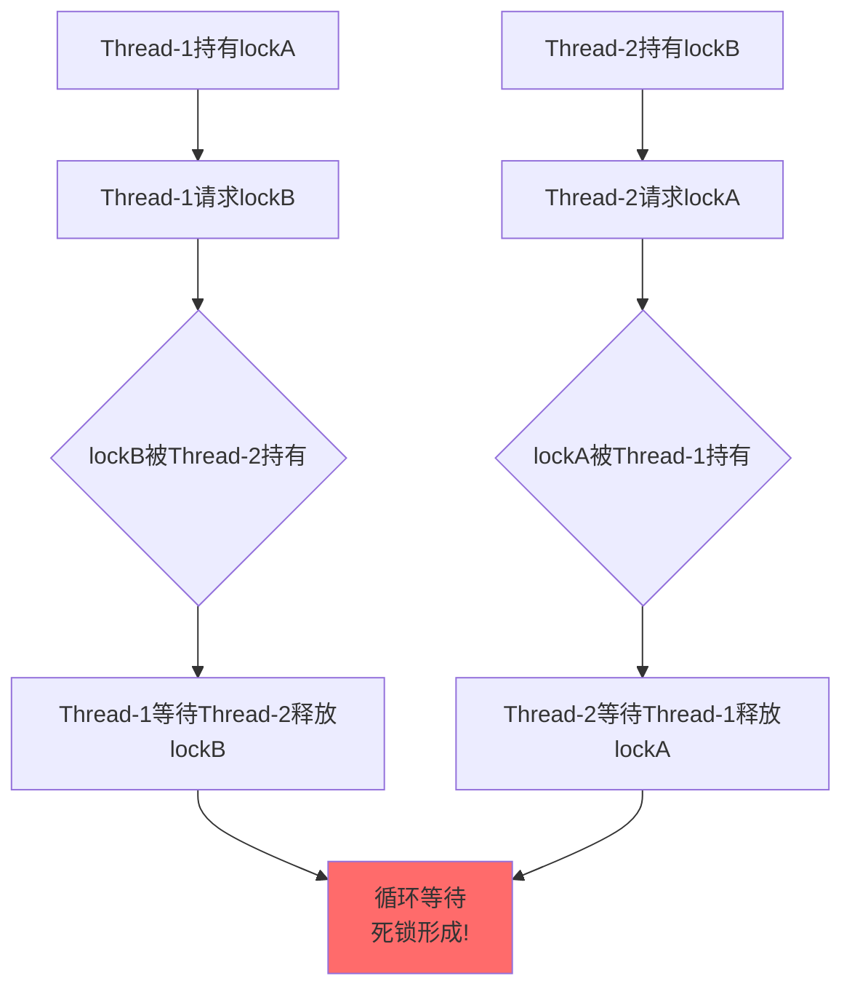
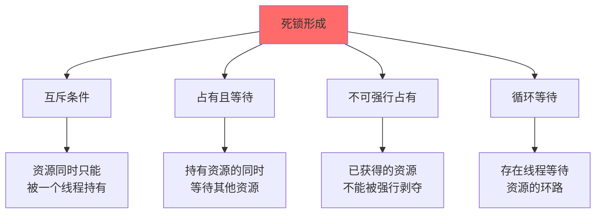
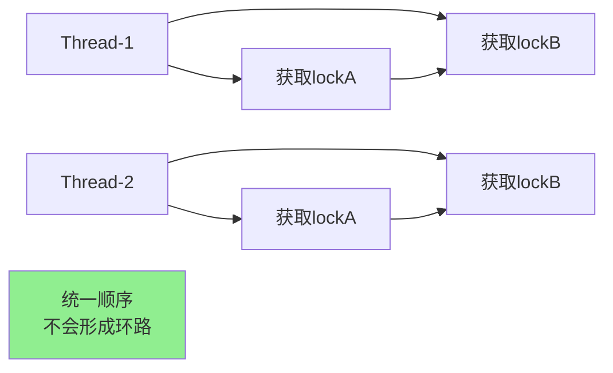
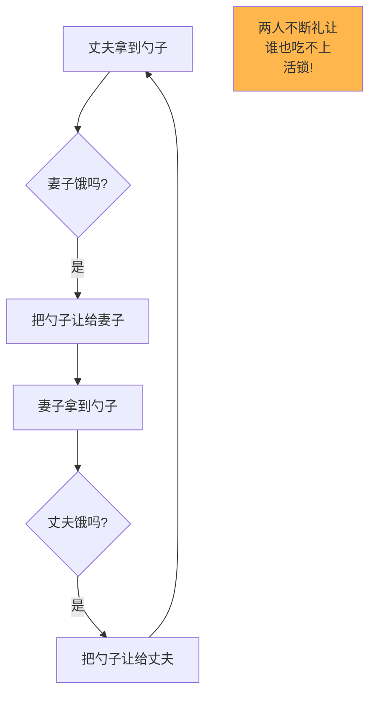
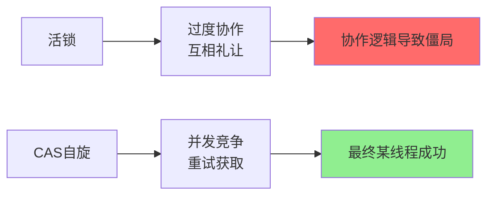
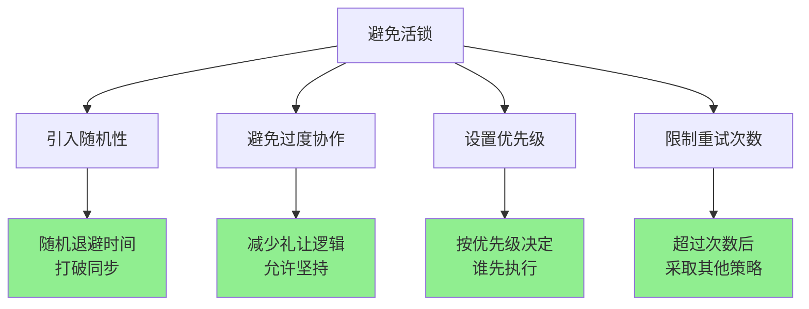
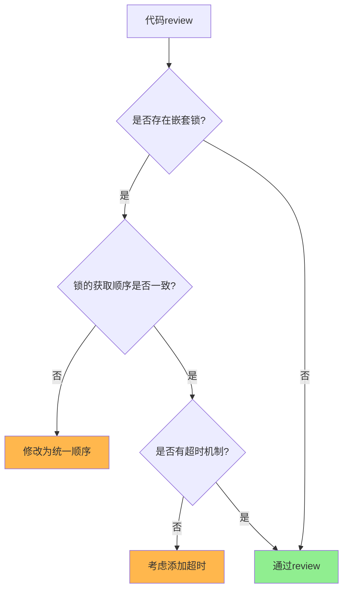

# 死锁与活锁问题分析

## 死锁问题

### 什么是死锁

**死锁是指两个或多个线程因为相互等待对方释放资源而永久阻塞,无法继续执行的状态**。

生活中的例子:
- 两个人在独木桥两端相遇,都不愿意后退让路,僵持不下
- 丈母娘要求先买房才能结婚,女婿说先结婚再买房,双方都在等对方先行动

```java
public class DeadlockDemo {
    private final Object lockA = new Object();
    private final Object lockB = new Object();
    
    public void method1() {
        synchronized(lockA) {
            System.out.println(Thread.currentThread().getName() 
                + " 持有lockA,等待lockB");
            
            try { Thread.sleep(100); } 
            catch (InterruptedException e) {}
            
            synchronized(lockB) {
                System.out.println("method1执行完成");
            }
        }
    }
    
    public void method2() {
        synchronized(lockB) {
            System.out.println(Thread.currentThread().getName() 
                + " 持有lockB,等待lockA");
            
            try { Thread.sleep(100); } 
            catch (InterruptedException e) {}
            
            synchronized(lockA) {
                System.out.println("method2执行完成");
            }
        }
    }
}

// 测试代码
public static void main(String[] args) {
    DeadlockDemo demo = new DeadlockDemo();
    
    new Thread(() -> demo.method1(), "Thread-1").start();
    new Thread(() -> demo.method2(), "Thread-2").start();
}
```

执行结果:
```
Thread-1 持有lockA,等待lockB
Thread-2 持有lockB,等待lockA
(程序卡死,永久阻塞)
```



### 死锁的四个必要条件

死锁的发生需要同时满足以下四个条件(缺一不可):



**1. 互斥条件(Mutual Exclusion)**

资源同一时刻只能被一个线程使用,其他线程必须等待。

```java
// Synchronized锁就是互斥的
synchronized(resource) {
    // 同一时刻只有一个线程能执行
}
```

**2. 占有且等待(Hold and Wait)**

线程已经持有至少一个资源,同时又在等待获取其他资源。

```java
synchronized(resourceA) {  // 持有resourceA
    // ... 
    synchronized(resourceB) {  // 等待resourceB
        // ...
    }
}
```

**3. 不可强行占有(No Preemption)**

线程已获得的资源,在未使用完之前,不能被其他线程强行剥夺,只能主动释放。

**4. 循环等待(Circular Wait)**

存在一个线程等待资源的环路:
- Thread1等待Thread2持有的资源
- Thread2等待Thread3持有的资源
- ...
- ThreadN等待Thread1持有的资源

### 数据库中的死锁

数据库中也可能发生死锁:

```java
public class DatabaseDeadlock {
    
    // 事务1
    public void transaction1() {
        // 1. 锁定记录A
        jdbcTemplate.update("UPDATE account SET balance = balance - 100 " +
                           "WHERE id = 1");
        
        // 2. 尝试锁定记录B
        jdbcTemplate.update("UPDATE account SET balance = balance + 100 " +
                           "WHERE id = 2");
    }
    
    // 事务2
    public void transaction2() {
        // 1. 锁定记录B
        jdbcTemplate.update("UPDATE account SET balance = balance - 50 " +
                           "WHERE id = 2");
        
        // 2. 尝试锁定记录A
        jdbcTemplate.update("UPDATE account SET balance = balance + 50 " +
                           "WHERE id = 1");
    }
}
```

当事务1和事务2并发执行时:
1. 事务1持有记录A的锁,等待记录B的锁
2. 事务2持有记录B的锁,等待记录A的锁
3. 形成死锁

数据库会检测到死锁并抛出异常:
```
Error updating database. Cause: ERR-CODE: [TDDL-4614][ERR_EXECUTE_ON_MYSQL] 
Deadlock found when trying to get lock; 
```

### 如何预防死锁

破坏死锁的四个必要条件之一即可预防死锁:

#### 1. 破坏互斥条件(通常不可行)

某些资源必须互斥访问(如数据库锁、文件锁),无法破坏此条件。

#### 2. 破坏占有且等待

**一次性申请所有资源**:

```java
public class PreventHoldAndWait {
    private final Object lockA = new Object();
    private final Object lockB = new Object();
    private final Object globalLock = new Object();
    
    public void safeMethod() {
        // 在一个锁内获取所有需要的锁
        synchronized(globalLock) {
            synchronized(lockA) {
                synchronized(lockB) {
                    // 安全执行
                }
            }
        }
    }
}
```

缺点:降低了并发度,资源利用率低。

#### 3. 破坏不可强行占有(通常不可行)

Java中的锁机制不支持强行剥夺,此方法难以实现。

#### 4. 破坏循环等待(最常用)

**保证多个资源的获取顺序一致**:

```java
public class PreventCircularWait {
    private final Object lockA = new Object();
    private final Object lockB = new Object();
    
    // 所有方法都按A->B的顺序获取锁
    public void method1() {
        synchronized(lockA) {
            synchronized(lockB) {
                System.out.println("method1执行");
            }
        }
    }
    
    public void method2() {
        // 同样按A->B的顺序,避免循环等待
        synchronized(lockA) {
            synchronized(lockB) {
                System.out.println("method2执行");
            }
        }
    }
}
```



数据库场景的解决方案:

```java
public class DatabaseDeadlockSolution {
    
    // 保证事务的操作顺序一致
    public void transaction1() {
        // 统一按id顺序:先1后2
        jdbcTemplate.update("UPDATE account SET balance = balance - 100 " +
                           "WHERE id = 1");
        jdbcTemplate.update("UPDATE account SET balance = balance + 100 " +
                           "WHERE id = 2");
    }
    
    public void transaction2() {
        // 同样按id顺序:先1后2
        jdbcTemplate.update("UPDATE account SET balance = balance + 50 " +
                           "WHERE id = 1");
        jdbcTemplate.update("UPDATE account SET balance = balance - 50 " +
                           "WHERE id = 2");
    }
}
```

### 死锁检测与恢复

**使用超时机制**:

```java
import java.util.concurrent.locks.ReentrantLock;
import java.util.concurrent.TimeUnit;

public class DeadlockDetection {
    private final ReentrantLock lockA = new ReentrantLock();
    private final ReentrantLock lockB = new ReentrantLock();
    
    public boolean safeMethod() throws InterruptedException {
        // 超时获取锁
        boolean gotLockA = lockA.tryLock(100, TimeUnit.MILLISECONDS);
        if (!gotLockA) {
            return false; // 获取失败,直接返回
        }
        
        try {
            boolean gotLockB = lockB.tryLock(100, TimeUnit.MILLISECONDS);
            if (!gotLockB) {
                return false; // 获取失败,释放lockA
            }
            
            try {
                // 成功获取两把锁,执行业务
                return true;
            } finally {
                lockB.unlock();
            }
        } finally {
            lockA.unlock();
        }
    }
}
```

## 活锁问题

### 什么是活锁

**活锁是指线程持续运行并改变状态,但无法取得任何实质性进展的情况**。与死锁的区别:
- **死锁**: 线程被阻塞,处于BLOCKED状态,不消耗CPU
- **活锁**: 线程仍在运行,处于RUNNABLE状态,消耗CPU,但没有进展

类比理解:两人在走廊相遇:
- **死锁**: 两人都停下不动,谁也不让
- **活锁**: A往左让,B也往左让;A往右让,B也往右让,一直重复,谁也过不去

```java
public class LivelockDemo {
    static class Spoon {
        private Diner owner;
        
        public synchronized void use(Diner diner) {
            System.out.printf("%s 使用勺子\n", diner.getName());
        }
        
        public synchronized void setOwner(Diner diner) {
            owner = diner;
        }
        
        public synchronized Diner getOwner() {
            return owner;
        }
    }
    
    static class Diner {
        private String name;
        private boolean isHungry;
        
        public Diner(String name) {
            this.name = name;
            this.isHungry = true;
        }
        
        public String getName() {
            return name;
        }
        
        public boolean isHungry() {
            return isHungry;
        }
        
        // 尝试用餐
        public void eatWith(Spoon spoon, Diner spouse) {
            while (isHungry) {
                // 如果勺子不属于自己
                if (spoon.getOwner() != this) {
                    try {
                        Thread.sleep(1);
                    } catch (InterruptedException e) {
                        continue;
                    }
                    continue;
                }
                
                // 如果配偶也饿了,把勺子让给配偶
                if (spouse.isHungry()) {
                    System.out.printf("%s: 亲爱的,%s,你先吃吧!\n",
                        name, spouse.getName());
                    spoon.setOwner(spouse);
                    continue; // 继续等待
                }
                
                // 使用勺子
                spoon.use(this);
                isHungry = false;
                System.out.printf("%s: 我吃饱了\n", name);
                spoon.setOwner(spouse);
            }
        }
    }
}

// 测试代码
public static void main(String[] args) {
    final Diner husband = new Diner("丈夫");
    final Diner wife = new Diner("妻子");
    final Spoon spoon = new Spoon();
    
    spoon.setOwner(husband);
    
    new Thread(() -> husband.eatWith(spoon, wife)).start();
    new Thread(() -> wife.eatWith(spoon, husband)).start();
}
```

输出可能是:
```
丈夫: 亲爱的,妻子,你先吃吧!
妻子: 亲爱的,丈夫,你先吃吧!
丈夫: 亲爱的,妻子,你先吃吧!
妻子: 亲爱的,丈夫,你先吃吧!
...
(无限循环,永远吃不上饭)
```



### 活锁的特征

1. **线程持续运行**: 不会阻塞,仍在消耗CPU资源

2. **不断改变状态**: 线程在不断响应对方的状态变化

3. **无实质进展**: 虽然在活动,但任务无法完成

4. **过度协作**: 通常由于过度的"礼让"或协作逻辑导致

### 活锁 vs CAS自旋

很多人认为CAS的自旋是活锁,这是**不准确**的:

**CAS自旋**:
- 多个线程都尝试通过CAS获取同一资源
- 失败后重试,没有互相"礼让"的逻辑
- 最终某个线程会成功,有进展

**活锁**:
- 线程根据对方的状态调整自己的行为
- 存在互相"礼让"或"避让"的协作逻辑
- 形成僵局,无法取得进展



类比:
- **活锁**: A看到B过来就让开,B看到A让开也让开,两人在门口一直让路谁也过不去(协作逻辑)
- **CAS自旋**: 多个人都不断尝试快速挤过桥,虽然暂时挤不过去,但最终有人会成功(竞争,无协作)

### 如何避免活锁



#### 1. 引入随机性

在重试前增加随机退避时间:

```java
public class LivelockSolution1 {
    private final Random random = new Random();
    
    public void eatWith(Spoon spoon, Diner spouse) {
        while (isHungry) {
            if (spoon.getOwner() != this) {
                // 随机等待,避免同步
                int backoff = random.nextInt(100);
                try {
                    Thread.sleep(backoff);
                } catch (InterruptedException e) {}
                continue;
            }
            
            if (spouse.isHungry()) {
                // 不是每次都礼让,有一定概率坚持
                if (random.nextBoolean()) {
                    spoon.setOwner(spouse);
                    continue;
                }
            }
            
            // 使用勺子
            spoon.use(this);
            isHungry = false;
            spoon.setOwner(spouse);
        }
    }
}
```

#### 2. 设置优先级

为线程分配优先级,打破对称性:

```java
public class LivelockSolution2 {
    static class Diner {
        private int priority; // 优先级
        
        public void eatWith(Spoon spoon, Diner spouse) {
            while (isHungry) {
                if (spoon.getOwner() != this) {
                    continue;
                }
                
                // 只有优先级低的才礼让
                if (spouse.isHungry() && 
                    this.priority < spouse.priority) {
                    spoon.setOwner(spouse);
                    continue;
                }
                
                spoon.use(this);
                isHungry = false;
                spoon.setOwner(spouse);
            }
        }
    }
}
```

#### 3. 限制重试次数

超过一定次数后,采取强制策略:

```java
public class LivelockSolution3 {
    
    public void eatWith(Spoon spoon, Diner spouse) {
        int retryCount = 0;
        final int MAX_RETRIES = 10;
        
        while (isHungry) {
            if (spoon.getOwner() != this) {
                continue;
            }
            
            if (spouse.isHungry()) {
                retryCount++;
                
                // 超过最大重试次数,不再礼让
                if (retryCount >= MAX_RETRIES) {
                    System.out.println(name + ": 对不起,我先吃了");
                    // 继续执行,不礼让
                } else {
                    spoon.setOwner(spouse);
                    continue;
                }
            }
            
            spoon.use(this);
            isHungry = false;
            spoon.setOwner(spouse);
        }
    }
}
```

## 死锁 vs 活锁对比

| 对比维度 | 死锁 | 活锁 |
|---------|------|------|
| 线程状态 | BLOCKED,被阻塞 | RUNNABLE,仍在运行 |
| CPU占用 | 不占用CPU | 持续占用CPU |
| 资源等待 | 互相等待对方释放资源 | 不断调整状态,互相礼让 |
| 可见性 | 容易察觉(程序卡死) | 不易察觉(看似在运行) |
| 根本原因 | 循环等待资源 | 过度协作/礼让 |
| 解决方案 | 破坏死锁条件 | 引入随机性/优先级 |

## 实际应用建议

### 死锁预防checklist



1. **锁顺序一致**: 确保所有代码路径按相同顺序获取锁
2. **减少锁范围**: 尽量减少需要同时持有的锁数量
3. **使用超时**: 使用ReentrantLock的tryLock(timeout)
4. **死锁检测**: 定期检查线程dump,发现死锁迹象

### 活锁预防checklist

1. **避免过度礼让**: 不要让所有线程都无条件礼让
2. **引入随机性**: 在冲突重试时加入随机延迟
3. **设置优先级**: 为线程分配不同优先级
4. **限制重试**: 设置最大重试次数

## 核心要点总结

1. **死锁**: 线程相互等待资源,永久阻塞,不占用CPU
2. **活锁**: 线程持续运行但无进展,过度协作导致,占用CPU
3. **死锁四条件**: 互斥、占有且等待、不可抢占、循环等待
4. **死锁预防**: 破坏循环等待(统一锁顺序)最常用
5. **活锁解决**: 引入随机性、设置优先级、限制重试
6. **CAS≠活锁**: CAS是竞争重试,活锁是协作僵局
7. **实际应用**: 锁顺序一致、使用超时机制、避免过度礼让
