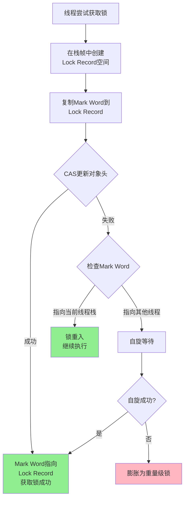

# Synchronized锁升级与优化策略

## 锁升级机制概述

在JDK 1.6之前,Synchronized直接使用重量级锁实现,每次加锁都需要操作系统介入,性能开销巨大。从JDK 1.6开始,HotSpot虚拟机引入了锁升级机制,根据竞争情况动态调整锁的状态,显著提升了性能。

### 四种锁状态

Java中的锁状态通过对象头的Mark Word标记,分为四个级别:


Mark Word中使用低3位标识锁状态:
- **无锁**: 标志位`001`
- **偏向锁**: 标志位`101`
- **轻量级锁**: 标志位`00`
- **重量级锁**: 标志位`10`

## 无锁状态

对象创建时处于无锁状态,Mark Word中存储对象的哈希码、GC分代年龄等信息。当第一个线程访问同步代码块时,锁状态开始发生变化。

## 偏向锁机制

### 偏向锁的设计理念

偏向锁基于这样一个观察:**大多数情况下,锁不仅不存在多线程竞争,而且总是由同一个线程多次获得**。为了让线程获得锁的代价更低,引入了偏向锁。

### 偏向锁的工作流程


偏向锁的核心步骤:

1. **首次获取**: 线程首次进入同步块,通过CAS将Thread ID写入对象头
2. **再次进入**: 检查Mark Word中的Thread ID是否为当前线程
   - 如果匹配,直接执行,无需任何同步操作
   - 如果不匹配,说明有其他线程竞争,偏向锁失效

3. **偏向撤销**: 当检测到其他线程尝试获取锁时
   - 等待到达安全点(Safe Point)
   - 暂停持有偏向锁的线程
   - 检查线程是否还在执行同步代码
   - 撤销偏向锁,升级为轻量级锁或重量级锁

### 偏向锁的性能优势

```java
public class BiasedLockDemo {
    private int counter = 0;
    
    // 同一线程多次调用,受益于偏向锁
    public synchronized void increment() {
        counter++;
    }
    
    public void performTask() {
        // 同一线程内多次获取锁
        for (int i = 0; i < 10000; i++) {
            increment();
        }
    }
}
```

在上述场景中,偏向锁能够提供接近无锁的性能,因为同一线程重复获取锁时无需任何原子操作。

### JDK 15废弃偏向锁的原因

从JDK 15开始,偏向锁被标记为废弃(JEP 374),主要原因包括:

1. **维护成本高**: 偏向锁的实现复杂,增加了JVM代码的维护难度,与其他组件的交互也变得复杂

2. **收益递减**: 现代Java应用大量使用并发集合类(如ConcurrentHashMap),这些类不依赖Synchronized,偏向锁的优化效果不再明显

3. **撤销开销**: 在多线程竞争场景下,频繁的偏向锁撤销反而会降低性能
   - 撤销需要等待安全点
   - 暂停持有锁的线程
   - 检查并升级锁状态

4. **场景变化**: 过去Java应用大量使用HashTable、Vector等同步集合,现在已被高性能并发容器替代


## 轻量级锁机制

### 轻量级锁的适用场景

轻量级锁针对这样的场景:**线程交替执行同步块,不存在长时间的锁竞争**。通过CAS操作避免互斥量的开销。

### 轻量级锁的加锁流程



详细步骤解析:

1. **创建锁记录**: 在当前线程的栈帧中创建Lock Record空间

2. **保存原始信息**: 将对象头的Mark Word复制到Lock Record中(称为Displaced Mark Word)
   - 目的是在解锁时恢复对象头的原始状态
   - 保证对象状态的正确性

3. **CAS操作**: 尝试用CAS将对象头的Mark Word更新为指向Lock Record的指针
   - 成功: 当前线程获得锁
   - 失败: 存在竞争,进入自旋或升级

4. **自旋等待**: CAS失败后,线程不会立即阻塞,而是执行空循环(自旋)
   - 优点: 避免线程切换开销
   - 缺点: 占用CPU资源

### 轻量级锁的解锁流程


解锁时,使用CAS操作将Displaced Mark Word替换回对象头:
- 成功: 表示无竞争,解锁完成
- 失败: 表示锁已膨胀,需要释放重量级锁并唤醒等待线程

### 为什么需要复制Mark Word?

这是一个关键的设计细节:**复制Mark Word到线程栈是为了保留对象的原始信息**。

```java
// 示例:轻量级锁的状态转换
Object obj = new Object();
// 初始状态:Mark Word包含hashCode、GC年龄等信息

synchronized(obj) {
    // 加锁:Mark Word被替换为指向Lock Record的指针
    // 原始的hashCode等信息存储在Lock Record中
    
    // 业务逻辑...
}
// 解锁:使用Lock Record中保存的原始Mark Word恢复对象头
// 确保对象的hashCode、GC年龄等信息不丢失
```

如果不保存原始Mark Word,解锁后对象头的信息就会丢失,导致对象状态异常。

## 重量级锁机制

### 锁膨胀的触发条件

当满足以下条件之一时,锁会膨胀为重量级锁:

1. 轻量级锁的CAS操作多次失败(自旋次数超过阈值)
2. 自旋时间过长,浪费CPU资源
3. 等待锁的线程数量较多

### 重量级锁的工作机制


重量级锁通过操作系统的互斥量(Mutex)实现:
- 未获得锁的线程进入BLOCKED状态
- 需要操作系统调度,涉及用户态和内核态切换
- 性能开销大,但避免了CPU空转

## 锁降级的真相

### 常见误解

很多人认为锁可以从重量级降级到轻量级或偏向锁,**这是不正确的**。

在HotSpot虚拟机中,锁的状态只能升级,不能降级。一旦升级为重量级锁,在锁被释放之前,它将保持重量级状态。

### 特殊的"降级"场景

虽然锁状态不会降级,但存在一种特殊的优化:**Monitor对象的回收(Deflation)**。


这个过程发生在Stop-the-World阶段:

1. **检查Monitor**: JVM检查所有的Monitor对象
2. **识别空闲Monitor**: 找出没有被任何线程持有的Monitor
3. **Deflation操作**: 清理这些Monitor对象,释放系统资源
4. **重置状态**: 对象头恢复到初始状态

这不是真正的"降级",而是**Monitor对象的回收**。下次对该对象加锁时,会重新从偏向锁或轻量级锁开始。

### JRockit虚拟机的真·降级

不同于HotSpot,JRockit虚拟机支持真正的锁降级:

当最后一个竞争线程释放重量级锁时,如果JRockit判断锁会从"压缩"中受益,可能将其降级为轻量级锁,以降低后续获取锁的开销。

## 锁优化技术

### 自旋锁优化

**设计思想**: 共享数据的锁定状态通常只持续很短时间,为了这段时间去挂起和恢复线程并不值得。


自旋锁的特点:

**优点**:
- 避免线程切换的开销
- 适合锁持有时间短的场景
- 响应速度快

**缺点**:
- 占用CPU资源,自旋过程中CPU空转
- 不适合锁持有时间长的场景
- 线程数过多时性能下降

示例场景:

```java
public class SpinLockDemo {
    private final Object lock = new Object();
    
    // 适合自旋:快速操作
    public void quickOperation() {
        synchronized(lock) {
            // 简单的计数器递增
            counter++;
        }
    }
    
    // 不适合自旋:耗时操作
    public void slowOperation() {
        synchronized(lock) {
            // 复杂的数据处理
            processLargeData();
        }
    }
}
```

### 锁消除优化

**设计思想**: 通过逃逸分析,检测到某些加锁操作实际上不会被多线程访问,JIT编译器会自动消除锁。

```java
public class LockEliminationDemo {
    
    // 原始代码
    public String concatenate(String s1, String s2) {
        StringBuffer sb = new StringBuffer();
        // StringBuffer的append方法是同步的
        sb.append(s1);
        sb.append(s2);
        return sb.toString();
    }
    
    // JIT优化后的等价代码
    public String concatenateOptimized(String s1, String s2) {
        // StringBuffer是局部变量,不会逃逸
        // JIT消除了StringBuffer内部的synchronized锁
        StringBuffer sb = new StringBuffer();
        sb.append(s1);
        sb.append(s2);
        return sb.toString();
    }
}
```

锁消除的条件:
1. 对象通过逃逸分析确认不会被多线程访问
2. 锁对象的生命周期仅在方法内部
3. 编译器能够证明不存在线程安全问题

### 锁粗化优化

**设计思想**: 如果检测到一系列连续操作都对同一个对象反复加锁解锁,将加锁范围扩大到整个操作序列外部。

```java
public class LockCoarseningDemo {
    
    // 原始代码:多次加锁
    public void processData() {
        for (int i = 0; i < 10000; i++) {
            synchronized(this) {
                // 单次操作
                doSomething(i);
            }
        }
    }
    
    // JIT优化后:锁粗化
    public void processDataOptimized() {
        synchronized(this) {
            for (int i = 0; i < 10000; i++) {
                // 整个循环在同一个锁内
                doSomething(i);
            }
        }
    }
}
```


**锁粗化 vs 减小锁粒度**:
- **减小锁粒度**: 避免无关代码在锁内执行,提高并发度
- **锁粗化**: 避免频繁加锁解锁的开销,适合连续操作同一对象

两者并不矛盾:
- 减小粒度强调不要在锁内做无关操作
- 锁粗化强调同一对象的连续操作可以合并

类比: 银行办业务
- 减小粒度: 办业务前先准备好资料,坐到柜台时直接办理
- 锁粗化: 要办5个业务时,在同一个窗口一次性办完,而不是5次排队

### 适应性自旋

**设计思想**: 自旋次数不再固定,而是根据前一次自旋的成功率动态调整。


适应性自旋的优势:
- 根据实际情况动态调整,更智能
- 在锁竞争变化时能够自适应
- 避免固定次数的局限性

## 锁优化的综合效果


从JDK 1.6开始,这些优化使Synchronized的性能大幅提升,在很多场景下性能已接近甚至超过显式锁(如ReentrantLock)。

## 核心要点总结

1. 锁升级是单向的:无锁→偏向锁→轻量级锁→重量级锁,不可逆
2. 偏向锁在JDK 15中被废弃,因维护成本高且收益递减
3. 轻量级锁通过CAS和自旋避免线程阻塞,适合锁竞争不激烈的场景
4. 重量级锁通过Monitor机制实现,适合高并发竞争场景
5. 锁降级在HotSpot中不存在,但Monitor对象可以被回收
6. JIT编译器提供锁消除、锁粗化、自适应自旋等优化手段
7. 现代JVM的Synchronized性能已经非常优秀,是首选的同步机制
