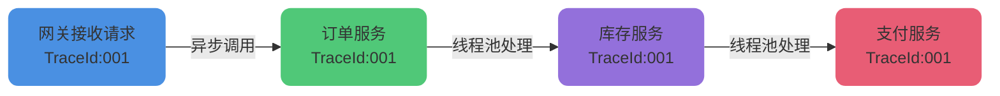
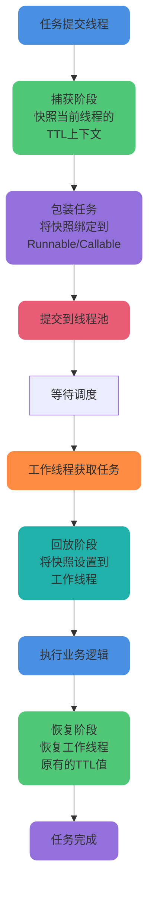

# TransmittableThreadLocal线程池上下文传递

## InheritableThreadLocal的局限性

### 父子线程上下文传递机制

在Java并发编程中,InheritableThreadLocal提供了父子线程之间的上下文传递能力。当父线程创建子线程时,子线程可以继承父线程的ThreadLocal变量副本,实现数据在线程间的传递。

但是,这种传递机制存在一个关键限制:它只在主线程直接创建子线程时有效。也就是说,子线程必须是在父线程中通过new Thread()方式手动创建的,这样才能在线程初始化时复制父线程的InheritableThreadLocal数据。

### 线程池场景下的失效问题

在现代Java应用中,线程池技术已经成为标准实践。ExecutorService、ThreadPoolExecutor等线程池组件被广泛应用于异步任务处理、并发请求处理等场景。线程池通过线程复用机制提升了性能,避免了频繁创建销毁线程的开销。

然而,线程池的复用特性与InheritableThreadLocal的设计产生了冲突:

**线程预创建问题**: 线程池中的工作线程是预先创建好的,并非在提交任务时才创建。这些线程在创建时并不知道将来要执行的任务的上下文信息。

**线程复用问题**: 同一个工作线程会被多个任务复用。第一个任务设置的InheritableThreadLocal值可能会影响后续任务,造成数据污染。

**上下文丢失问题**: 当通过线程池提交任务时,任务的执行线程与提交任务的线程不是直接的父子关系,导致InheritableThreadLocal无法传递上下文。

下面通过一个用户请求追踪场景来展示这个问题:

```java
public class RequestTracingIssueDemo {
    // 使用InheritableThreadLocal存储请求ID
    private static final InheritableThreadLocal<String> REQUEST_ID = 
        new InheritableThreadLocal<>();
    
    private static final ExecutorService THREAD_POOL = 
        Executors.newFixedThreadPool(3);
    
    public static void main(String[] args) throws Exception {
        // 模拟处理第一个用户请求
        REQUEST_ID.set("REQ-001");
        System.out.println("主线程设置请求ID: " + REQUEST_ID.get());
        
        // 提交到线程池执行
        THREAD_POOL.submit(() -> {
            // 期望获取到REQ-001,但实际可能获取不到
            String requestId = REQUEST_ID.get();
            System.out.println("任务1获取到的请求ID: " + requestId);
            processRequest(requestId);
        });
        
        Thread.sleep(100);
        
        // 模拟处理第二个用户请求
        REQUEST_ID.set("REQ-002");
        System.out.println("主线程设置请求ID: " + REQUEST_ID.get());
        
        THREAD_POOL.submit(() -> {
            // 可能获取到REQ-002,也可能获取到之前的值
            String requestId = REQUEST_ID.get();
            System.out.println("任务2获取到的请求ID: " + requestId);
            processRequest(requestId);
        });
        
        Thread.sleep(500);
        THREAD_POOL.shutdown();
    }
    
    private static void processRequest(String requestId) {
        System.out.println("处理请求: " + requestId);
        // 业务逻辑处理
    }
}
```

在上述示例中,由于线程池的线程复用机制,任务无法正确获取提交任务时设置的请求ID,导致请求追踪失败。

## TransmittableThreadLocal解决方案

### 开源框架介绍

TransmittableThreadLocal(简称TTL)是阿里巴巴开源的一个增强型ThreadLocal实现,专门解决线程池场景下的上下文传递问题。该框架继承并增强了InheritableThreadLocal,实现了在使用线程池等会缓存线程的组件情况下的上下文传递功能。

项目地址: https://github.com/alibaba/transmittable-thread-local

TransmittableThreadLocal的核心价值在于:它不仅支持父子线程间的上下文传递,还能在线程池场景下将提交任务时的上下文信息传递到执行任务的工作线程中,确保上下文信息的正确性和一致性。

### 典型应用场景

TransmittableThreadLocal在企业级应用中有广泛的应用场景:

**分布式链路追踪**: 在微服务架构中,需要在整个调用链路中传递TraceId、SpanId等追踪信息。即使使用了线程池进行异步处理,也需要保证追踪信息的连续性。



**全链路压测与流量标记**: 在生产环境进行压测时,需要标记压测流量以区分真实流量。这个标记需要在所有异步任务和跨线程调用中保持传递。

**日志上下文信息记录**: 在分布式系统中,需要在日志中记录用户ID、会话ID、租户ID等上下文信息,即使跨越了多个线程和线程池,这些信息也需要保持一致。

**Session级别的缓存**: 某些场景下需要在整个请求处理周期内缓存一些数据(如用户权限信息、配置信息等),即使在异步处理中也需要访问这些缓存数据。

**框架层向SDK层传递信息**: 应用容器或上层框架需要向下层SDK传递一些配置或上下文信息,这些信息需要跨越框架的边界和线程池的边界。

### 工作原理解析

TransmittableThreadLocal的核心工作机制可以概括为"捕获-回放-恢复"三个阶段:



**捕获阶段(Capture)**: 在任务提交时,记录当前线程中所有TransmittableThreadLocal的值,生成一个快照(Snapshot)。

**回放阶段(Replay)**: 当工作线程开始执行任务前,将快照中的值设置到工作线程的TransmittableThreadLocal中。

**恢复阶段(Restore)**: 任务执行完成后,将工作线程的TransmittableThreadLocal恢复到任务执行前的状态,避免影响线程池中线程的后续复用。

## 使用方式与实践

### Maven依赖配置

首先需要在项目中引入TransmittableThreadLocal依赖:

```xml
<dependency>
    <groupId>com.alibaba</groupId>
    <artifactId>transmittable-thread-local</artifactId>
    <version>2.14.5</version>
</dependency>
```

建议使用最新稳定版本以获得更好的性能和bug修复。

### 普通父子线程场景

对于简单的父子线程场景,TransmittableThreadLocal的使用方式与InheritableThreadLocal基本相同:

```java
public class UserSessionDemo {
    // 定义用于存储用户会话信息的TTL
    private static final TransmittableThreadLocal<SessionInfo> SESSION_CONTEXT = 
        new TransmittableThreadLocal<>();
    
    static class SessionInfo {
        private String userId;
        private String userName;
        private Long loginTime;
        
        public SessionInfo(String userId, String userName) {
            this.userId = userId;
            this.userName = userName;
            this.loginTime = System.currentTimeMillis();
        }
        
        @Override
        public String toString() {
            return "SessionInfo{userId='" + userId + "', userName='" + 
                   userName + "', loginTime=" + loginTime + "}";
        }
    }
    
    public static void main(String[] args) throws Exception {
        // 在主线程中设置会话信息
        SessionInfo session = new SessionInfo("U10001", "张三");
        SESSION_CONTEXT.set(session);
        System.out.println("主线程设置会话: " + SESSION_CONTEXT.get());
        
        // 创建子线程处理业务
        Thread businessThread = new Thread(() -> {
            // 子线程可以直接获取到父线程的会话信息
            SessionInfo threadSession = SESSION_CONTEXT.get();
            System.out.println("子线程获取会话: " + threadSession);
            
            // 执行业务逻辑
            processUserBusiness(threadSession);
        });
        
        businessThread.start();
        businessThread.join();
        
        // 清理上下文
        SESSION_CONTEXT.remove();
    }
    
    private static void processUserBusiness(SessionInfo session) {
        System.out.println("为用户 " + session.userName + " 处理业务");
        // 业务处理逻辑
    }
}
```

### 线程池Runnable包装方式

在线程池场景下,最直接的使用方式是包装Runnable任务:

```java
public class OrderProcessingDemo {
    private static final TransmittableThreadLocal<OrderContext> ORDER_CONTEXT = 
        new TransmittableThreadLocal<>();
    
    private static final ExecutorService EXECUTOR = 
        Executors.newFixedThreadPool(5);
    
    static class OrderContext {
        private String orderId;
        private String customerId;
        private String productId;
        private Integer quantity;
        
        public OrderContext(String orderId, String customerId, 
                          String productId, Integer quantity) {
            this.orderId = orderId;
            this.customerId = customerId;
            this.productId = productId;
            this.quantity = quantity;
        }
        
        @Override
        public String toString() {
            return "OrderContext{orderId='" + orderId + 
                   "', customerId='" + customerId + 
                   "', productId='" + productId + 
                   "', quantity=" + quantity + "}";
        }
    }
    
    public static void main(String[] args) throws Exception {
        // 模拟处理第一个订单
        OrderContext order1 = new OrderContext(
            "ORD20240001", "CUST001", "PROD123", 2
        );
        ORDER_CONTEXT.set(order1);
        
        Runnable orderTask1 = () -> {
            OrderContext context = ORDER_CONTEXT.get();
            System.out.println("订单任务1获取上下文: " + context);
            processOrder(context);
        };
        
        // 使用TtlRunnable包装任务
        Runnable ttlTask1 = TtlRunnable.get(orderTask1);
        EXECUTOR.submit(ttlTask1);
        
        Thread.sleep(100);
        
        // 模拟处理第二个订单
        OrderContext order2 = new OrderContext(
            "ORD20240002", "CUST002", "PROD456", 1
        );
        ORDER_CONTEXT.set(order2);
        
        Runnable orderTask2 = () -> {
            OrderContext context = ORDER_CONTEXT.get();
            System.out.println("订单任务2获取上下文: " + context);
            processOrder(context);
        };
        
        // 包装并提交第二个任务
        Runnable ttlTask2 = TtlRunnable.get(orderTask2);
        EXECUTOR.submit(ttlTask2);
        
        Thread.sleep(500);
        EXECUTOR.shutdown();
    }
    
    private static void processOrder(OrderContext context) {
        System.out.println("处理订单: " + context.orderId + 
                         ", 客户: " + context.customerId);
        // 订单处理逻辑:检查库存、计算价格、生成订单等
    }
}
```

通过TtlRunnable.get()方法包装任务后,即使在线程池中执行,也能正确获取到提交任务时的上下文信息。

### 线程池Callable包装方式

对于需要返回结果的任务,可以使用TtlCallable包装Callable:

```java
public class InventoryCheckDemo {
    private static final TransmittableThreadLocal<CheckContext> CHECK_CONTEXT = 
        new TransmittableThreadLocal<>();
    
    private static final ExecutorService EXECUTOR = 
        Executors.newFixedThreadPool(3);
    
    static class CheckContext {
        private String warehouseId;
        private String operator;
        private Long checkTime;
        
        public CheckContext(String warehouseId, String operator) {
            this.warehouseId = warehouseId;
            this.operator = operator;
            this.checkTime = System.currentTimeMillis();
        }
    }
    
    static class InventoryResult {
        private String productId;
        private Integer stock;
        private boolean available;
        
        public InventoryResult(String productId, Integer stock) {
            this.productId = productId;
            this.stock = stock;
            this.available = stock > 0;
        }
        
        @Override
        public String toString() {
            return "InventoryResult{productId='" + productId + 
                   "', stock=" + stock + ", available=" + available + "}";
        }
    }
    
    public static void main(String[] args) throws Exception {
        // 设置库存检查上下文
        CheckContext context = new CheckContext("WH001", "李四");
        CHECK_CONTEXT.set(context);
        
        // 创建库存检查任务
        Callable<InventoryResult> checkTask = () -> {
            CheckContext ctx = CHECK_CONTEXT.get();
            System.out.println("检查仓库: " + ctx.warehouseId + 
                             ", 操作员: " + ctx.operator);
            
            // 模拟库存检查
            return new InventoryResult("PROD789", 50);
        };
        
        // 使用TtlCallable包装
        Callable<InventoryResult> ttlCheckTask = TtlCallable.get(checkTask);
        Future<InventoryResult> future = EXECUTOR.submit(ttlCheckTask);
        
        // 获取检查结果
        InventoryResult result = future.get();
        System.out.println("库存检查结果: " + result);
        
        CHECK_CONTEXT.remove();
        EXECUTOR.shutdown();
    }
}
```

### ExecutorService装饰器方式

如果不想每次提交任务时都手动包装,可以直接装饰整个ExecutorService:

```java
public class LogTraceDemo {
    private static final TransmittableThreadLocal<TraceInfo> TRACE_CONTEXT = 
        new TransmittableThreadLocal<>();
    
    static class TraceInfo {
        private String traceId;
        private String spanId;
        private String serviceName;
        
        public TraceInfo(String traceId, String spanId, String serviceName) {
            this.traceId = traceId;
            this.spanId = spanId;
            this.serviceName = serviceName;
        }
        
        @Override
        public String toString() {
            return "[" + serviceName + "|" + traceId + "|" + spanId + "]";
        }
    }
    
    public static void main(String[] args) throws Exception {
        // 创建原始线程池
        ExecutorService originalExecutor = Executors.newFixedThreadPool(4);
        
        // 使用TTL装饰器包装线程池
        ExecutorService ttlExecutor = TtlExecutors.getTtlExecutorService(originalExecutor);
        
        // 模拟接收到一个请求
        TraceInfo trace1 = new TraceInfo("TRACE-20240001", "SPAN-001", "PaymentService");
        TRACE_CONTEXT.set(trace1);
        
        // 直接提交任务,无需手动包装
        Runnable paymentTask = () -> {
            TraceInfo trace = TRACE_CONTEXT.get();
            System.out.println(trace + " 处理支付请求");
            processPayment();
        };
        
        ttlExecutor.submit(paymentTask);
        
        // 提交Callable任务
        Callable<String> queryTask = () -> {
            TraceInfo trace = TRACE_CONTEXT.get();
            System.out.println(trace + " 查询支付状态");
            return "支付成功";
        };
        
        Future<String> result = ttlExecutor.submit(queryTask);
        System.out.println("查询结果: " + result.get());
        
        Thread.sleep(300);
        
        // 模拟处理另一个请求
        TraceInfo trace2 = new TraceInfo("TRACE-20240002", "SPAN-002", "OrderService");
        TRACE_CONTEXT.set(trace2);
        
        ttlExecutor.submit(() -> {
            TraceInfo trace = TRACE_CONTEXT.get();
            System.out.println(trace + " 创建订单");
        });
        
        Thread.sleep(500);
        ttlExecutor.shutdown();
    }
    
    private static void processPayment() {
        // 支付处理逻辑
        System.out.println("  -> 调用支付网关");
        System.out.println("  -> 更新订单状态");
    }
}
```

这种方式最为简洁,只需要在创建线程池时进行一次包装,后续所有提交的任务都会自动进行上下文传递,无需每次都手动调用TtlRunnable或TtlCallable。

## 最佳实践与注意事项

### 及时清理上下文

在使用TransmittableThreadLocal时,务必在请求处理完成后调用remove()方法清理上下文,避免内存泄漏:

```java
try {
    CONTEXT.set(contextValue);
    // 业务处理
} finally {
    CONTEXT.remove();  // 确保清理
}
```

### 选择合适的包装方式

对于单次使用的场景,使用TtlRunnable/TtlCallable包装即可;对于框架级别的线程池,建议使用TtlExecutors装饰器方式,简化使用并统一管理。

### 性能考虑

TransmittableThreadLocal的捕获-回放机制会带来一定的性能开销,在性能敏感的场景下需要进行压测评估。可以通过减少TTL变量的数量、优化快照内容大小等方式降低开销。
