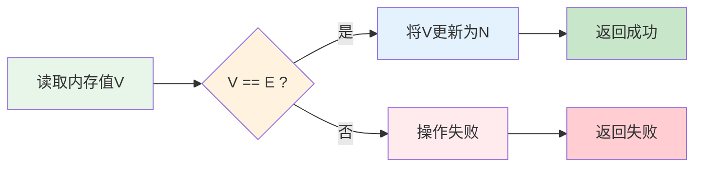
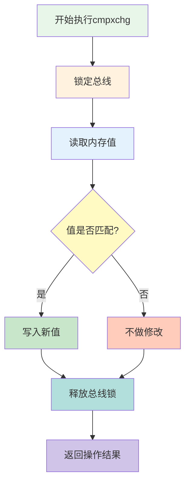
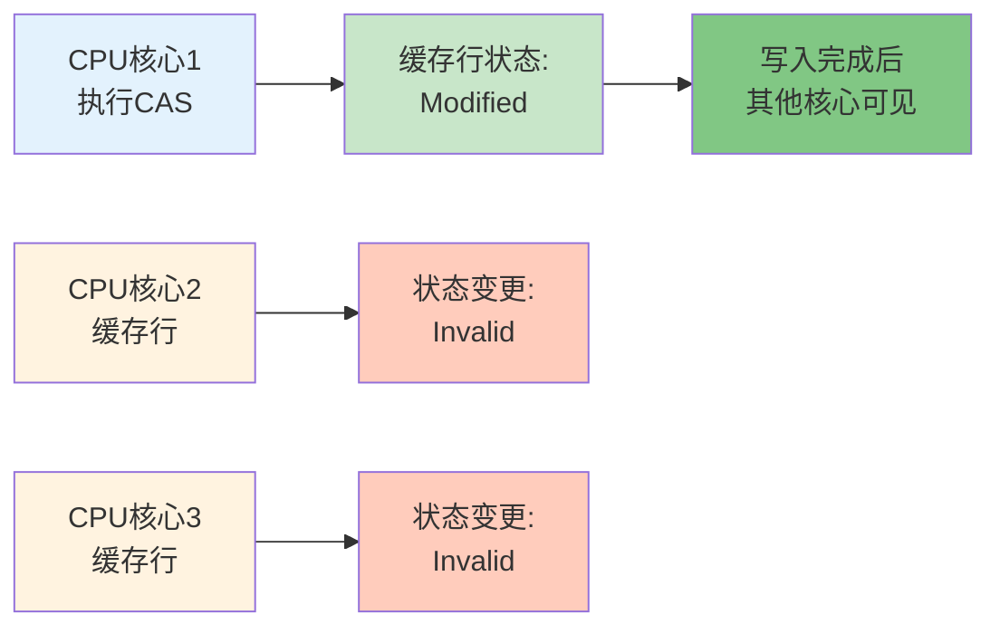
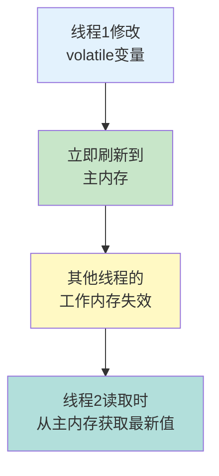
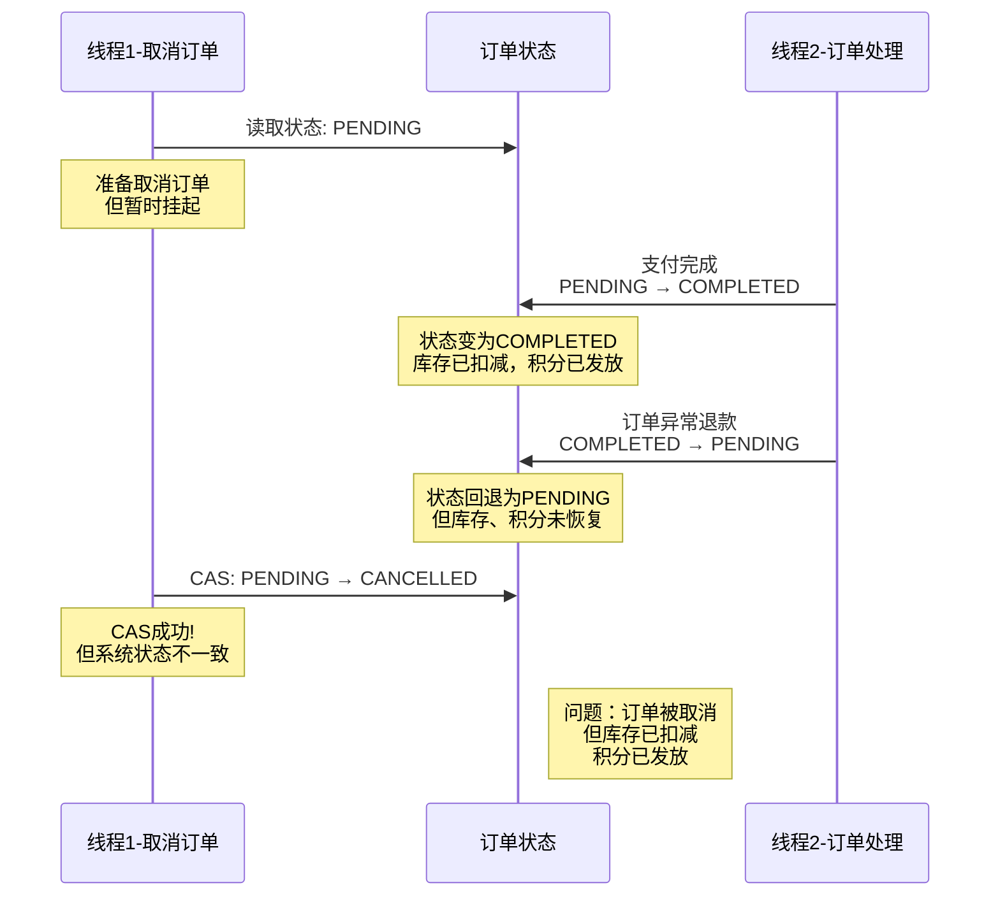
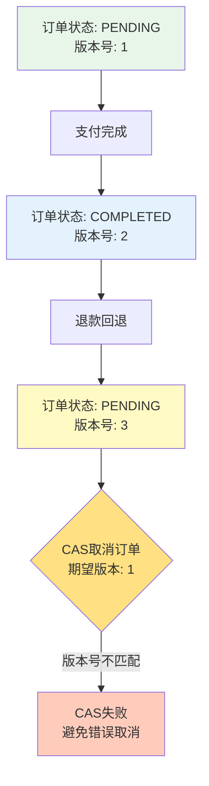
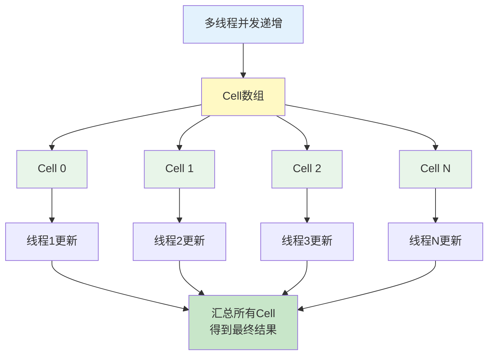
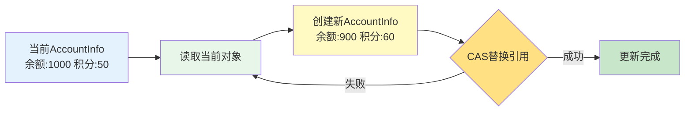

# CAS机制深度剖析

## CAS核心概念

CAS（Compare And Swap，比较并交换）是一种乐观锁技术，也是实现无锁并发的核心机制。它通过硬件级别的原子操作来保证并发安全性，相比传统的悲观锁具有更高的性能。

CAS操作包含三个关键操作数：

- **内存地址（V）**：需要操作的变量在内存中的位置
- **预期值（E）**：期望内存地址中存储的当前值
- **新值（N）**：准备写入的新值

CAS的执行逻辑如下：首先读取内存地址V中的值，与预期值E进行比较，如果相等，则将新值N写入内存地址V；如果不相等，说明其他线程已经修改了该值，本次操作失败。整个比较和交换的过程是原子性的，不会被其他线程中断。



当多个线程同时尝试使用CAS更新同一个变量时，只有一个线程能够成功更新，其他线程会收到失败通知。与传统锁机制不同，失败的线程不会被阻塞挂起，而是可以选择重试或执行其他操作，这就避免了线程上下文切换的开销。

## Java中CAS的实现机制

### Unsafe类：CAS的底层实现

在Java中，CAS操作的核心实现依赖于`sun.misc.Unsafe`类。这是一个提供底层操作能力的特殊类，由于其强大的功能和潜在风险，通常只在JDK内部或高性能框架中使用，不建议普通开发者直接使用。

`Unsafe`类提供了三个关键的CAS方法：

```java
/**
 * 原子更新Object类型字段
 * @param target 目标对象
 * @param offset 字段在对象中的内存偏移量
 * @param expected 期望的当前值
 * @param newValue 要设置的新值
 * @return 更新成功返回true，否则返回false
 */
public final native boolean compareAndSwapObject(Object target, long offset, 
                                                 Object expected, Object newValue);

/**
 * 原子更新int类型字段
 */
public final native boolean compareAndSwapInt(Object target, long offset, 
                                              int expected, int newValue);

/**
 * 原子更新long类型字段
 */
public final native boolean compareAndSwapLong(Object target, long offset, 
                                               long expected, long newValue);
```

这些方法使用`native`关键字声明，表示它们的实现并非Java代码，而是通过JNI（Java Native Interface）调用C++编写的本地代码，最终转换为处理器的机器指令来执行。

### 原子类：CAS的高层封装

Java在`java.util.concurrent.atomic`包中提供了一系列原子类，它们基于CAS实现线程安全的原子操作：

```mermaid
graph TB
    A[Atomic原子类] --> B[基本类型]
    A --> C[数组类型]
    A --> D[引用类型]
    A --> E[字段更新器]
    
    B --> B1[AtomicInteger]
    B --> B2[AtomicLong]
    B --> B3[AtomicBoolean]
    
    C --> C1[AtomicIntegerArray]
    C --> C2[AtomicLongArray]
    C --> C3[AtomicReferenceArray]
    
    D --> D1[AtomicReference]
    D --> D2[AtomicStampedReference]
    D --> D3[AtomicMarkableReference]
    
    E --> E1[AtomicIntegerFieldUpdater]
    E --> E2[AtomicLongFieldUpdater]
    E --> E3[AtomicReferenceFieldUpdater]
    
    style A fill:#E1F5FE
    style B fill:#E8F5E9
    style C fill:#FFF3E0
    style D fill:#F3E5F5
    style E fill:#FCE4EC
    style B1 fill:#C8E6C9
    style B2 fill:#C8E6C9
    style B3 fill:#C8E6C9
    style C1 fill:#FFE082
    style C2 fill:#FFE082
    style C3 fill:#FFE082
    style D1 fill:#E1BEE7
    style D2 fill:#E1BEE7
    style D3 fill:#E1BEE7
    style E1 fill:#F8BBD0
    style E2 fill:#F8BBD0
    style E3 fill:#F8BBD0
```



### AtomicInteger源码解析

以`AtomicInteger`为例，我们来看看如何使用`Unsafe`实现原子操作：

```java
public class AtomicInteger extends Number implements java.io.Serializable {
    // 获取Unsafe实例
    private static final Unsafe unsafe = Unsafe.getUnsafe();
    
    // value字段的内存偏移量
    private static final long valueOffset;
    
    static {
        try {
            // 在类加载时计算value字段的内存偏移量
            valueOffset = unsafe.objectFieldOffset
                (AtomicInteger.class.getDeclaredField("value"));
        } catch (Exception ex) { 
            throw new Error(ex); 
        }
    }
    
    // 使用volatile保证可见性
    private volatile int value;
    
    /**
     * CAS更新值
     */
    public final boolean compareAndSet(int expect, int update) {
        return unsafe.compareAndSwapInt(this, valueOffset, expect, update);
    }
    
    /**
     * 原子递增并返回旧值
     */
    public final int getAndIncrement() {
        return unsafe.getAndAddInt(this, valueOffset, 1);
    }
    
    /**
     * 原子递减并返回旧值
     */
    public final int getAndDecrement() {
        return unsafe.getAndAddInt(this, valueOffset, -1);
    }
    
    /**
     * 原子增加delta并返回旧值
     */
    public final int getAndAdd(int delta) {
        return unsafe.getAndAddInt(this, valueOffset, delta);
    }
}
```

关键的`getAndAddInt`方法实现如下：

```java
public final int getAndAddInt(Object obj, long offset, int delta) {
    int currentValue;
    do {
        // 以volatile方式读取当前值
        currentValue = getIntVolatile(obj, offset);
        // CAS尝试更新，失败则循环重试
    } while (!compareAndSwapInt(obj, offset, currentValue, currentValue + delta));
    
    return currentValue;
}
```

这段代码展示了CAS的典型使用模式：使用do-while循环不断重试，直到CAS操作成功。这种循环重试机制称为**自旋**。

## CAS的硬件级实现

### 处理器层面的原子保证

CAS的原子性最终是由处理器的硬件指令保证的。在x86架构的处理器中，CAS操作通过`cmpxchg`（Compare and Exchange）指令实现。

`cmpxchg`指令的原子性由以下机制保证：

#### 总线锁定机制

在执行`cmpxchg`指令时，处理器会自动锁定系统总线（Bus Lock），阻止其他处理器访问共享内存，确保当前处理器独占访问。执行流程如下：



#### 中断禁止

在`cmpxchg`指令执行期间，CPU会自动禁止中断响应，防止指令执行被打断，保证操作的原子性。

#### 缓存一致性协议

`cmpxchg`指令基于MESI等缓存一致性协议实现。在多核CPU环境中，当一个核心执行CAS操作时，缓存一致性协议会确保：

1. 该核心获得缓存行的独占权限（Exclusive或Modified状态）
2. 其他核心的对应缓存行被标记为无效（Invalid状态）
3. 操作完成后，新值对所有核心可见

这种机制不仅保证了CAS操作的原子性，还确保了操作结果对其他处理器核心的可见性。



## CAS与自旋机制

### 自旋的必要性

CAS操作本身并不强制要求自旋，但在实际应用中，通常会结合自旋机制使用。原因在于：

1. **提高成功率**：多线程并发环境下，单次CAS失败的概率较高，通过自旋重试可以提高最终成功的概率
2. **避免阻塞开销**：如果CAS失败就阻塞线程，会引入线程上下文切换的开销，而自旋可以让CPU继续工作而不是挂起线程
3. **适用于短时间竞争**：当临界区代码执行时间很短时，自旋等待比阻塞等待更高效

### 自旋的代价

自旋虽然避免了线程阻塞，但也带来了新的问题：

```java
// 银行账户并发转账示例
public class BankAccount {
    private AtomicLong balance = new AtomicLong(10000);
    
    /**
     * 转账操作 - 使用CAS自旋
     */
    public boolean transfer(long amount) {
        long currentBalance;
        long newBalance;
        
        do {
            currentBalance = balance.get();
            
            // 余额不足，转账失败
            if (currentBalance < amount) {
                return false;
            }
            
            newBalance = currentBalance - amount;
            
            // CAS操作失败会自旋重试
        } while (!balance.compareAndSet(currentBalance, newBalance));
        
        return true;
    }
}
```

在高并发场景下，如果大量线程同时执行`transfer`方法，会导致：

1. **CPU忙等待**：失败的线程不断循环，消耗CPU资源但无法推进执行
2. **性能下降**：自旋时间过长会降低系统整体吞吐量
3. **公平性问题**：可能导致某些线程长时间无法获得执行机会

### 自旋优化策略

为了缓解自旋带来的问题，处理器和JVM提供了一些优化：

#### pause指令优化

现代处理器的`pause`指令可以优化自旋性能：

- **延迟执行**：让处理器在自旋时适当延迟，减少功耗
- **避免流水线清空**：防止退出循环时因内存顺序冲突导致的流水线清空

#### 自适应自旋

JVM会根据历史统计动态调整自旋次数：
- 如果某个锁的自旋通常能成功，增加自旋次数
- 如果某个锁的自旋经常失败，减少自旋次数甚至直接阻塞

## CAS与volatile的协作

### CAS不能保证可见性

虽然CAS的硬件指令通过缓存一致性协议保证了处理器核心之间的缓存一致性，但这和Java内存模型（JMM）中的可见性保证是两个不同层面的概念。

CAS操作只能保证单次操作的原子性，但不能保证其他线程立即看到修改后的值。这是因为：

1. Java线程有自己的工作内存（本地缓存）
2. 变量修改可能只发生在线程的工作内存中
3. 需要显式的同步机制才能将修改刷新到主内存

### volatile的作用

在原子类中，被操作的字段都使用`volatile`修饰：

```java
public class AtomicInteger {
    private volatile int value;  // 必须使用volatile
}
```

`volatile`提供了两个关键保证：

#### 可见性保证



- 写操作：volatile变量修改后会立即刷新到主内存
- 读操作：读取volatile变量时会从主内存获取最新值

#### 有序性保证

volatile禁止指令重排序优化：

- 对volatile变量的写操作不会被重排序到之前的操作之后
- 对volatile变量的读操作不会被重排序到之后的操作之前

### 协作关系

在并发编程中，CAS和volatile是互补的：

```java
// AQS中state字段的定义
public abstract class AbstractQueuedSynchronizer {
    // volatile保证可见性和有序性
    private volatile int state;
    
    protected final boolean compareAndSetState(int expect, int update) {
        // CAS保证原子性
        return unsafe.compareAndSwapInt(this, stateOffset, expect, update);
    }
}
```

- **CAS**：提供原子性，确保并发更新的正确性
- **volatile**：提供可见性和有序性，确保线程间的数据一致性

两者结合使用，才能构建完整的线程安全机制。

## CAS的常见问题与解决方案

### ABA问题

#### 问题描述

ABA问题是CAS最典型的陷阱。假设变量初始值为A，线程1读取到A后，线程2将其改为B，之后又改回A。当线程1执行CAS时，发现值仍然是A，误以为没有被修改过。

#### 问题场景

考虑一个订单状态管理系统：

```java
public class OrderStatus {
    private AtomicReference<String> status = new AtomicReference<>("PENDING");
    
    // 尝试取消订单
    public boolean cancelOrder() {
        // 只有状态为PENDING时才能取消
        return status.compareAndSet("PENDING", "CANCELLED");
    }
    
    // 尝试完成订单
    public boolean completeOrder() {
        return status.compareAndSet("PENDING", "COMPLETED");
    }
}
```

可能出现的问题场景：



在这个场景中，虽然CAS操作成功，但中间经历的状态变化可能导致了库存扣减、积分发放等副作用，这些副作用并没有随着状态回退而恢复。

#### 解决方案：版本号机制

使用`AtomicStampedReference`为每次修改添加版本号：

```java
public class OrderStatusWithVersion {
    // 使用版本号解决ABA问题
    private AtomicStampedReference<String> statusRef = 
        new AtomicStampedReference<>("PENDING", 0);
    
    /**
     * 取消订单 - 检查版本号
     */
    public boolean cancelOrder(int expectedVersion) {
        String expectedStatus = "PENDING";
        String newStatus = "CANCELLED";
        int newVersion = expectedVersion + 1;
        
        // 同时检查状态值和版本号
        return statusRef.compareAndSet(
            expectedStatus, 
            newStatus, 
            expectedVersion, 
            newVersion
        );
    }
    
    /**
     * 完成订单并递增版本号
     */
    public boolean completeOrder() {
        int[] stampHolder = new int[1];
        String currentStatus = statusRef.get(stampHolder);
        int currentVersion = stampHolder[0];
        
        if (!"PENDING".equals(currentStatus)) {
            return false;
        }
        
        // 状态和版本号一起更新
        return statusRef.compareAndSet(
            currentStatus, 
            "COMPLETED", 
            currentVersion, 
            currentVersion + 1
        );
    }
    
    /**
     * 获取当前状态和版本号
     */
    public String getStatusWithVersion() {
        int[] stampHolder = new int[1];
        String status = statusRef.get(stampHolder);
        return "Status: " + status + ", Version: " + stampHolder[0];
    }
}
```

版本号机制的工作原理：



无论值如何变化，版本号都会持续递增，确保能够检测到中间的所有变更。

### 循环开销问题

#### 问题分析

在高并发竞争激烈的场景下，CAS自旋可能导致大量CPU资源浪费：

```java
public class HighContentionCounter {
    private AtomicLong counter = new AtomicLong(0);
    
    // 高并发场景下的计数器
    public void increment() {
        long current;
        long next;
        
        do {
            current = counter.get();
            next = current + 1;
            // 竞争激烈时，这里可能循环数千次
        } while (!counter.compareAndSet(current, next));
    }
}
```

#### 解决方案

**方案一：LongAdder分段计数**

JDK 8引入的`LongAdder`使用分段策略减少竞争：

```java
public class LongAdderExample {
    private LongAdder counter = new LongAdder();
    
    public void increment() {
        // 内部使用Cell数组分散竞争
        counter.increment();
    }
    
    public long getCount() {
        // 汇总所有Cell的值
        return counter.sum();
    }
}
```

`LongAdder`的核心思想：



**方案二：退避策略**

在检测到竞争激烈时，主动退让：

```java
public class BackoffCounter {
    private AtomicLong counter = new AtomicLong(0);
    private static final int MAX_RETRIES = 100;
    
    public void increment() {
        int retries = 0;
        long current;
        long next;
        
        while (true) {
            current = counter.get();
            next = current + 1;
            
            if (counter.compareAndSet(current, next)) {
                return;
            }
            
            retries++;
            if (retries > MAX_RETRIES) {
                // 重试次数过多，短暂休眠让出CPU
                try {
                    Thread.sleep(1);
                } catch (InterruptedException e) {
                    Thread.currentThread().interrupt();
                    return;
                }
                retries = 0;
            }
        }
    }
}
```

**方案三：使用传统锁**

当竞争非常激烈或临界区代码执行时间较长时，传统锁反而更高效：

```java
public class LockBasedCounter {
    private long counter = 0;
    private final Object lock = new Object();
    
    public void increment() {
        synchronized (lock) {
            counter++;
        }
    }
}
```

### 多变量原子性问题

#### 问题描述

CAS只能保证单个变量的原子操作，无法直接支持多个变量的原子更新。

#### 解决方案：AtomicReference封装

将多个变量封装到一个对象中，使用`AtomicReference`保证整体的原子性：

```java
/**
 * 用户账户信息
 */
class AccountInfo {
    private final long balance;      // 余额
    private final int points;        // 积分
    private final int level;         // 会员等级
    
    public AccountInfo(long balance, int points, int level) {
        this.balance = balance;
        this.points = points;
        this.level = level;
    }
    
    public long getBalance() { return balance; }
    public int getPoints() { return points; }
    public int getLevel() { return level; }
    
    /**
     * 创建新的账户信息（不可变对象）
     */
    public AccountInfo withBalanceAndPoints(long newBalance, int newPoints) {
        return new AccountInfo(newBalance, newPoints, this.level);
    }
    
    public AccountInfo withLevel(int newLevel) {
        return new AccountInfo(this.balance, this.points, newLevel);
    }
}

/**
 * 账户管理器 - 使用AtomicReference保证多字段原子更新
 */
public class AccountManager {
    private final AtomicReference<AccountInfo> accountRef;
    
    public AccountManager(long initialBalance) {
        this.accountRef = new AtomicReference<>(
            new AccountInfo(initialBalance, 0, 1)
        );
    }
    
    /**
     * 购买商品 - 原子地更新余额和积分
     */
    public boolean purchase(long price, int earnPoints) {
        AccountInfo current;
        AccountInfo updated;
        
        do {
            current = accountRef.get();
            
            // 余额不足
            if (current.getBalance() < price) {
                return false;
            }
            
            long newBalance = current.getBalance() - price;
            int newPoints = current.getPoints() + earnPoints;
            
            // 创建新的账户信息对象
            updated = current.withBalanceAndPoints(newBalance, newPoints);
            
            // CAS更新整个对象
        } while (!accountRef.compareAndSet(current, updated));
        
        return true;
    }
    
    /**
     * 升级会员等级
     */
    public boolean upgradeLevel(int requiredPoints, int newLevel) {
        AccountInfo current;
        AccountInfo updated;
        
        do {
            current = accountRef.get();
            
            if (current.getPoints() < requiredPoints) {
                return false;
            }
            
            updated = current.withLevel(newLevel);
            
        } while (!accountRef.compareAndSet(current, updated));
        
        return true;
    }
    
    /**
     * 获取账户快照
     */
    public AccountInfo getAccountInfo() {
        return accountRef.get();
    }
}
```

这种方案的关键要点：

1. **不可变对象**：`AccountInfo`设计为不可变类，避免并发修改问题
2. **整体替换**：每次更新都创建新对象，用CAS替换整个引用
3. **原子性保证**：多个字段作为一个整体进行原子更新



## CAS的实际应用场景

### 无锁数据结构

CAS是构建无锁数据结构的基础：

- **无锁队列**：`ConcurrentLinkedQueue`使用CAS实现入队出队操作
- **无锁栈**：`ConcurrentLinkedStack`使用CAS维护栈顶指针
- **跳表**：`ConcurrentSkipListMap`使用CAS维护索引层级

### 原子计数器

高性能计数场景：

- **统计请求数**：Web服务器的并发请求计数
- **生成唯一ID**：分布式ID生成器
- **限流器**：基于令牌桶或漏桶的流量控制

### 对象池管理

对象的获取和归还：

```java
public class ObjectPool<T> {
    private final AtomicReference<Node<T>> head = new AtomicReference<>();
    
    private static class Node<T> {
        final T value;
        final Node<T> next;
        
        Node(T value, Node<T> next) {
            this.value = value;
            this.next = next;
        }
    }
    
    /**
     * 归还对象到池中
     */
    public void returnObject(T obj) {
        Node<T> newHead = new Node<>(obj, head.get());
        while (!head.compareAndSet(newHead.next, newHead)) {
            newHead = new Node<>(obj, head.get());
        }
    }
    
    /**
     * 从池中获取对象
     */
    public T borrowObject() {
        Node<T> oldHead;
        Node<T> newHead;
        
        do {
            oldHead = head.get();
            if (oldHead == null) {
                return null;
            }
            newHead = oldHead.next;
        } while (!head.compareAndSet(oldHead, newHead));
        
        return oldHead.value;
    }
}
```

### JVM内部使用

CAS在JVM内部有重要应用：

- **对象分配**：TLAB（Thread Local Allocation Buffer）的指针更新
- **GC标记**：并发标记阶段的对象状态更新
- **偏向锁撤销**：锁状态的原子切换

## 总结

CAS作为一种乐观锁机制，通过硬件级别的原子指令实现无锁并发控制，在Java并发编程中扮演着重要角色。

**核心优势：**
- 避免线程阻塞和上下文切换，提高并发性能
- 实现无锁算法，减少死锁风险
- 适合短时间、低竞争的并发场景

**主要挑战：**
- ABA问题需要版本号机制解决
- 高竞争场景下自旋开销大
- 只能保证单个变量的原子性

**使用建议：**
- 低竞争、短操作使用CAS+自旋
- 高竞争场景考虑LongAdder或传统锁
- 需要可见性和有序性时必须配合volatile
- 多变量原子更新使用AtomicReference封装不可变对象

理解CAS的原理和局限性，才能在实际开发中做出正确的技术选择，构建高性能的并发应用。
