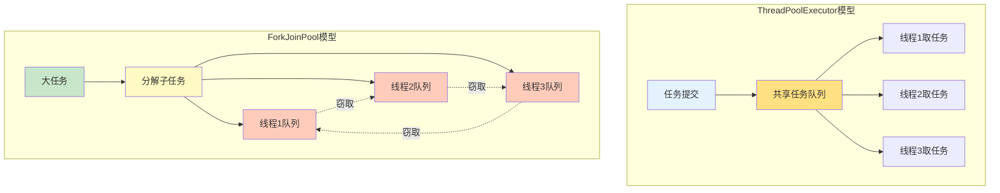
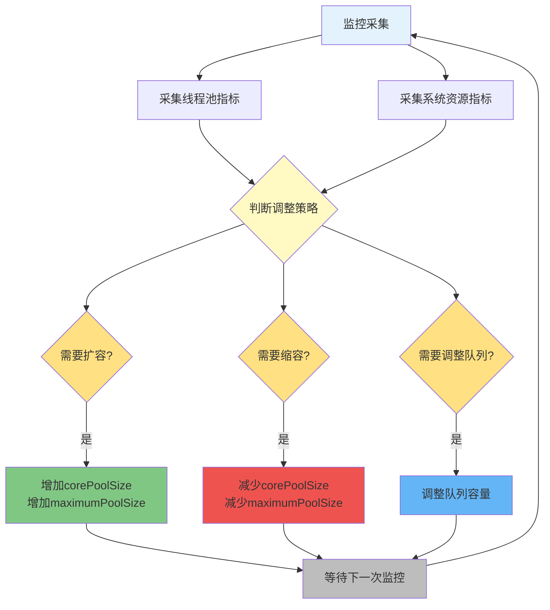

# 线程池高级特性与调优策略

## ForkJoinPool与ThreadPoolExecutor对比

### 两种线程池的设计理念

ThreadPoolExecutor和ForkJoinPool虽然都是线程池的实现,但设计理念和适用场景有本质区别:

**ThreadPoolExecutor** - 基于任务分配(Task-Assignment)算法。线程池中有一个共享的任务队列,所有任务都提交到这个队列中,线程从队列中获取任务执行。如果队列为空,线程会等待。

**ForkJoinPool** - 基于工作窃取(Work-Stealing)算法。每个线程都有自己的工作队列,当一个线程执行完自己的任务后,会从其他线程的工作队列中"窃取"任务执行,实现任务的动态均衡和线程利用率最大化。



### 工作窃取算法详解

工作窃取算法是ForkJoinPool的核心机制,其工作原理如下:

1. **任务分解** - 将大任务分解成多个子任务
2. **任务分配** - 子任务被分配到不同线程的工作队列
3. **执行与窃取** - 线程执行自己队列中的任务,执行完后从其他线程队列尾部窃取任务
4. **结果合并** - 所有子任务执行完成后,合并结果

这种设计的优势在于:
- **负载均衡** - 线程忙闲不均时,空闲线程可以主动获取任务
- **减少竞争** - 线程主要操作自己的队列,降低锁竞争
- **提高并行度** - 适合递归分解的CPU密集型任务

### 线程管理差异

**ThreadPoolExecutor的线程管理**

线程的创建和销毁是静态的:
- 线程池创建后预先创建一定数量的核心线程
- 根据任务数量动态调整线程利用率,但不会销毁核心线程
- 非核心线程长时间空闲会被回收
- 如果线程长时间处于空闲状态,可能占用过多资源

**ForkJoinPool的线程管理**

线程是动态管理的:
- 工作线程是特殊的线程,与普通线程池中的工作线程不同
- 会自动创建和销毁,自动管理线程的数量和调度
- 降低了线程池的管理成本,提高线程利用率和并行度

### 适用场景对比

| 特性 | ThreadPoolExecutor | ForkJoinPool |
|-----|-------------------|--------------|
| 任务类型 | IO密集型或普通CPU任务 | CPU密集型、可拆分的并行计算任务 |
| 任务特点 | 独立、不需要拆分的小任务 | 可递归分解为更小任务的大型任务 |
| 典型场景 | 网络请求、数据库访问、Web服务调度 | 快速排序、归并排序、图像处理、数据聚合 |
| 并发模型 | 任务分配 | 分而治之 |
| 队列类型 | 共享队列 | 每线程独立队列 |

### ForkJoinPool使用示例

使用ForkJoinPool实现快速排序:

```java
/**
 * 并行快速排序任务
 */
public class ParallelQuickSort extends RecursiveAction {
    private int[] array;
    private int left;
    private int right;
    
    // 任务拆分阈值,小于此值不再拆分
    private static final int THRESHOLD = 1000;
    
    public ParallelQuickSort(int[] array, int left, int right) {
        this.array = array;
        this.left = left;
        this.right = right;
    }
    
    @Override
    protected void compute() {
        if (right - left < THRESHOLD) {
            // 任务足够小,直接顺序排序
            Arrays.sort(array, left, right + 1);
        } else {
            // 任务较大,拆分成子任务并行执行
            int partitionIndex = partition(left, right);
            
            // 创建两个子任务
            ParallelQuickSort leftTask = new ParallelQuickSort(array, left, partitionIndex - 1);
            ParallelQuickSort rightTask = new ParallelQuickSort(array, partitionIndex + 1, right);
            
            // 并行执行子任务
            invokeAll(leftTask, rightTask);
        }
    }
    
    private int partition(int left, int right) {
        int pivot = array[right];
        int i = left - 1;
        
        for (int j = left; j < right; j++) {
            if (array[j] <= pivot) {
                i++;
                swap(i, j);
            }
        }
        swap(i + 1, right);
        return i + 1;
    }
    
    private void swap(int i, int j) {
        int temp = array[i];
        array[i] = array[j];
        array[j] = temp;
    }
    
    /**
     * 并行快速排序入口
     */
    public static void parallelQuickSort(int[] array) {
        ForkJoinPool pool = new ForkJoinPool();
        pool.invoke(new ParallelQuickSort(array, 0, array.length - 1));
    }
    
    public static void main(String[] args) {
        int[] data = {64, 34, 25, 12, 22, 11, 90, 88, 45, 50, 23, 36, 18, 77};
        
        System.out.println("排序前: " + Arrays.toString(data));
        parallelQuickSort(data);
        System.out.println("排序后: " + Arrays.toString(data));
    }
}
```

**关键点说明**:

1. 继承`RecursiveAction`创建无返回值的递归任务
2. 在`compute()`方法中实现任务逻辑和拆分策略
3. 使用`invokeAll()`并行执行子任务
4. 设置拆分阈值,避免过度拆分导致的开销

### CompletableFuture为什么使用ForkJoinPool

CompletableFuture默认使用ForkJoinPool.commonPool()而不是ThreadPoolExecutor,原因包括:

**执行模型匹配** - CompletableFuture中的任务可以分割成多个子任务,这些子任务之间可能存在依赖关系。ForkJoinPool本身支持任务分割和合并,能够自动处理任务的拆分和合并。

**工作窃取算法** - ForkJoinPool的工作窃取算法能够自动调整线程负载,提高线程利用率和并行度。当某个线程的任务队列为空时,可以从其他线程窃取任务,避免线程空闲。

**动态线程池大小** - ForkJoinPool的线程池大小是动态调整的。任务少时线程池自动缩小减少资源占用,任务多时线程池自动增加保证及时执行。

**简化使用** - 如果使用ThreadPoolExecutor,需要手动创建线程池、任务队列和任务执行策略,还要手动处理任务拆分和合并,实现复杂。ForkJoinPool更适合CompletableFuture的执行模型。

```java
// CompletableFuture默认使用ForkJoinPool
CompletableFuture.supplyAsync(() -> {
    // 这个任务在ForkJoinPool.commonPool()中执行
    return calculateResult();
});

// 也可以指定自定义的Executor
ThreadPoolExecutor customPool = new ThreadPoolExecutor(...);
CompletableFuture.supplyAsync(() -> {
    return calculateResult();
}, customPool);
```

## 动态线程池原理与实现

### 动态线程池的核心价值

传统线程池在创建时需要指定核心线程数、最大线程数等参数,这些参数在运行期间难以调整。但实际生产环境中,系统负载是动态变化的:

- **流量波峰波谷** - 电商大促、节假日等场景流量剧烈波动
- **业务场景变化** - 不同时段业务特点不同,对线程池的需求不同
- **资源紧张** - 突发情况下需要快速调整资源分配

动态线程池能够在运行时根据系统负载自动调整线程数量,相比固定线程池的优势:

- **智能应对流量波动** - 自动扩缩容,避免资源浪费和性能瓶颈
- **提高资源利用率** - 根据实际需求动态分配资源
- **降低运维成本** - 减少人工干预,自动化调优

### 动态调整的三个关键点

**关键点一:运行时调整能力**

Java的ThreadPoolExecutor提供了在运行时调整线程数量的方法:

```java
// 调整核心线程数,调用后立即生效
executor.setCorePoolSize(newCorePoolSize);

// 调整最大线程数,调用后立即生效  
executor.setMaximumPoolSize(newMaximumPoolSize);

// 注意:数量生效不代表立即创建这么多线程,真正使用时才会创建
```

除了线程数量,还可以调整队列容量(需要使用ResizableCapacityQueue):

```java
public class ResizableCapacityQueue<E> extends LinkedBlockingQueue<E> {
    public ResizableCapacityQueue(int capacity) {
        super(capacity);
    }
    
    public synchronized boolean setCapacity(int capacity) {
        // 去除LinkedBlockingQueue的capacity字段final修饰
        // 通过反射修改容量
        return true;
    }
}
```

**关键点二:监控指标采集**

想要根据系统负载动态调整,首先要能够采集到负载信息。关键指标包括:

```java
/**
 * 线程池监控指标
 */
public class ThreadPoolMetrics {
    private final ThreadPoolExecutor executor;
    
    /**
     * 任务队列饱和度
     */
    public double getQueueSaturation() {
        BlockingQueue<Runnable> queue = executor.getQueue();
        if (queue.remainingCapacity() == Integer.MAX_VALUE) {
            return 0.0;
        }
        int capacity = queue.size() + queue.remainingCapacity();
        return (double) queue.size() / capacity;
    }
    
    /**
     * 线程活跃度
     */
    public double getThreadActiveRate() {
        int poolSize = executor.getPoolSize();
        if (poolSize == 0) {
            return 0.0;
        }
        return (double) executor.getActiveCount() / poolSize;
    }
    
    /**
     * 任务平均等待时间(需要自定义实现)
     */
    public long getAverageWaitingTime() {
        // 通过任务提交时间和开始执行时间计算
        return 0L;
    }
}
```

系统资源指标可以通过成熟的监控工具采集:
- **Prometheus** - 开源监控系统,支持多维度数据采集
- **Micrometer** - 应用程序度量门面,支持多种监控系统
- **JMX** - Java管理扩展,可以暴露线程池指标

**关键点三:调整策略**

什么时候应该增加线程数?什么时候应该减少?

**增加线程数的时机**:

条件:线程数不够 且 提高后不会对系统造成负面影响

具体判断:
- 任务队列饱和度 > 80% (大量任务堆积)
- CPU利用率 < 70% (还有计算资源)
- 系统Load < 0.75 * CPU核心数 (系统不繁忙)

```java
public boolean shouldIncreaseThreads(ThreadPoolMetrics metrics, SystemMetrics sysMetrics) {
    return metrics.getQueueSaturation() > 0.8 
        && sysMetrics.getCpuUsage() < 0.7
        && sysMetrics.getSystemLoad() < 0.75 * sysMetrics.getCpuCores();
}
```

**减少线程数的时机**:

条件:线程数过多,存在浪费

具体判断:
- 线程活跃度 < 50% (大量线程空闲)
- 队列饱和度 < 20% (任务不多)

```java
public boolean shouldDecreaseThreads(ThreadPoolMetrics metrics) {
    return metrics.getThreadActiveRate() < 0.5
        && metrics.getQueueSaturation() < 0.2;
}
```

**为什么要减少线程数?**

线程数过多会导致:
- 上下文切换开销增加(100个任务,5个线程执行 vs 10个线程执行,切换次数明显不同)
- 内存占用增加(每个线程都有栈空间)

### 动态线程池调整流程



### 开源动态线程池框架

实现动态线程池比较复杂,推荐使用成熟的开源框架:

**Hippo4j** - 异步线程池框架

特性:
- 支持线程池动态变更和监控告警
- 无需修改代码轻松引入
- 支持多种使用模式
- 提供可视化管理平台

```xml
<dependency>
    <groupId>cn.hippo4j</groupId>
    <artifactId>hippo4j-core-spring-boot-starter</artifactId>
    <version>1.5.0</version>
</dependency>
```

**Dynamic TP** - 轻量级动态线程池

特性:
- 内置监控告警功能
- 集成三方中间件线程池管理
- 支持Nacos、Apollo、Zookeeper等配置中心
- 可通过SPI自定义实现

```xml
<dependency>
    <groupId>org.dromara.dynamictp</groupId>
    <artifactId>dynamic-tp-spring-boot-starter-apollo</artifactId>
    <version>1.1.7</version>
</dependency>
```

## 线程数设定策略

### 影响线程数的关键因素

线程数设定没有固定的最佳值,需要根据多个因素综合考虑:

**因素一:CPU核心数**

- **多核处理器** - 理想情况下每个核心运行一个线程最高效
- **超线程技术** - 支持超线程的CPU(如4核8线程),逻辑核心数是物理核心的2倍,可以分配更多线程

获取CPU核心数:

```java
int processors = Runtime.getRuntime().availableProcessors();
System.out.println("可用处理器数: " + processors);
```

注意:云服务器上显示的可能是虚拟机的核心数,并非物理机核心数,实际性能可能达不到。

**因素二:应用类型**

- **CPU密集型** - 计算密集型任务,主要消耗CPU资源,如数据计算、图像处理。线程数建议为核心数的1到1.5倍。
- **IO密集型** - 涉及大量等待或阻塞,如数据库操作、文件操作、网络操作。线程在等待时CPU可以切换去处理其他任务,可以配置更多线程,建议为核心数的2倍。

**因素三:系统资源限制**

- **内存限制** - 每个线程占用栈空间(默认1MB),创建过多线程可能导致内存溢出
- **操作系统限制** - 操作系统对进程可创建的线程数有限制

**因素四:业务特性**

- **响应时间要求** - 对响应时间要求严格可能需要更多线程减少等待
- **任务特性** - 长时间运行的任务与短时任务,同步任务与异步任务,需求不同

### 线程数计算公式

**简化公式**:

- **CPU密集型**: 线程数 = CPU核心数 + 1
- **IO密集型**: 线程数 = CPU核心数 * 2

"+1"是为了当某个线程因为缺页中断等原因暂停时,额外的线程可以继续工作。但实际上现代CPU处理缺页中断仍需要占用核心,"+1"的收益有限,所以现在更推荐直接用核心数。

**精确公式**:

```
线程数 = CPU核心数 × 目标CPU利用率 × (1 + 等待时间/计算时间)
```

公式说明:
- **等待时间** - 线程花费在等待外部操作(IO操作、同步等待)的时间,此时不占用CPU
- **计算时间** - 线程在CPU上实际执行计算的时间

等待时间/计算时间的比例是关键因素:
- **IO密集型任务** - 等待时间远大于计算时间,比例很大,需要更多线程充分利用CPU
- **CPU密集型任务** - 计算时间占主导,比例接近0,过多线程反而增加上下文切换开销

### 如何判断任务类型

**CPU密集型**:利用CPU计算能力的任务,CPU计算耗费时间相比等待IO的时间占主要部分。

示例:内存中对大量数据排序、图像处理、科学计算

**IO密集型**:涉及网络读取、文件读取等IO操作。CPU计算耗费时间相比等待IO操作完成的时间很少,大部分时间在等待IO。

示例:数据库查询、HTTP请求、文件读写

可以通过JDK自带的VisualVM工具查看线程的等待时间/计算时间比例,辅助判断任务类型。

### 实际调优建议

公式只是参考,不要死守公式。实际应用中的最佳实践:

1. **初始设置** - 根据公式设置一个初始值
2. **压力测试** - 在接近生产环境的条件下进行压测
3. **监控观察** - 观察CPU利用率、线程活跃度、响应时间、吞吐量等指标
4. **逐步调整** - 根据压测结果逐步调整线程数
5. **确定阈值** - 明确可接受的响应时间和错误率,找到最优配置

压测时要注意:
- 模拟真实的业务场景和数据量
- 设置合理的响应时间和错误率阈值
- 持续压测一段时间,观察系统稳定性

**不同场景的推荐配置**:

```java
/**
 * 线程池配置工厂
 */
public class ThreadPoolConfigFactory {
    
    /**
     * CPU密集型任务线程池
     */
    public static ThreadPoolExecutor createCpuIntensivePool() {
        int processors = Runtime.getRuntime().availableProcessors();
        
        return new ThreadPoolExecutor(
            processors,          // 核心线程数 = CPU核心数
            processors,          // 最大线程数 = 核心线程数
            60L,
            TimeUnit.SECONDS,
            new ArrayBlockingQueue<>(200),
            new ThreadFactoryBuilder().setNameFormat("cpu-pool-%d").build(),
            new ThreadPoolExecutor.AbortPolicy()
        );
    }
    
    /**
     * IO密集型任务线程池
     */
    public static ThreadPoolExecutor createIOIntensivePool() {
        int processors = Runtime.getRuntime().availableProcessors();
        
        return new ThreadPoolExecutor(
            processors * 2,      // 核心线程数 = CPU核心数 * 2
            processors * 4,      // 最大线程数适当放大
            120L,
            TimeUnit.SECONDS,
            new ArrayBlockingQueue<>(500),
            new ThreadFactoryBuilder().setNameFormat("io-pool-%d").build(),
            new ThreadPoolExecutor.CallerRunsPolicy()
        );
    }
    
    /**
     * 混合型任务线程池(等待时间是计算时间的3倍)
     */
    public static ThreadPoolExecutor createMixedPool() {
        int processors = Runtime.getRuntime().availableProcessors();
        double targetCpuUtilization = 0.8;  // 目标CPU利用率80%
        double waitComputeRatio = 3.0;      // 等待/计算比例
        
        int corePoolSize = (int) (processors * targetCpuUtilization * (1 + waitComputeRatio));
        
        return new ThreadPoolExecutor(
            corePoolSize,
            corePoolSize * 2,
            60L,
            TimeUnit.SECONDS,
            new ArrayBlockingQueue<>(300),
            new ThreadFactoryBuilder().setNameFormat("mixed-pool-%d").build(),
            new ThreadPoolExecutor.CallerRunsPolicy()
        );
    }
}
```

## 总结

本文深入介绍了线程池的高级特性和调优策略:

**ForkJoinPool与ThreadPoolExecutor对比**:
- ForkJoinPool基于工作窃取算法,适合CPU密集型、可拆分的并行计算任务
- ThreadPoolExecutor基于任务分配算法,适合IO密集型或普通CPU任务
- ForkJoinPool线程管理更动态,ThreadPoolExecutor相对静态

**动态线程池**:
- 能够在运行时根据系统负载自动调整线程数量
- 三个关键点:运行时调整能力、监控指标采集、调整策略
- 推荐使用Hippo4j或Dynamic TP等成熟框架

**线程数设定策略**:
- 影响因素:CPU核心数、应用类型、系统资源、业务特性
- 简化公式:CPU密集型=核心数,IO密集型=核心数*2
- 精确公式考虑等待时间/计算时间比例
- 实际应用中应通过压测逐步调优,不要死守公式

掌握这些高级特性和调优策略,能够帮助我们构建更高性能、更灵活的并发应用系统。
