# AQS抽象队列同步器深度解析

## AQS基础概念

AbstractQueuedSynchronizer(简称AQS)是Java并发包中的核心框架,出现在JDK 1.5版本中。它是构建锁和同步组件的基础框架,像ReentrantLock、Semaphore、CountDownLatch等常用同步工具都基于AQS实现。

```java
public abstract class AbstractQueuedSynchronizer
    extends AbstractOwnableSynchronizer
    implements java.io.Serializable {
}
```

AQS的设计理念是将复杂的线程同步逻辑抽象出来,提供一个通用的执行框架。开发者只需要关注具体的同步逻辑,而底层的线程管理、队列维护等复杂操作都由AQS来处理。这种设计使得同步器的实现变得简单高效。

## 核心数据结构

### 同步状态state

AQS使用一个volatile修饰的int类型成员变量来表示同步状态。这个state变量的含义在不同的同步器中有不同的解释:

- 在ReentrantLock中,state表示锁的重入次数,0表示未锁定,大于0表示被锁定
- 在Semaphore中,state表示可用的许可证数量
- 在CountDownLatch中,state表示需要倒计时的次数

```java
// 同步状态变量
private volatile int state;

// 获取同步状态
protected final int getState() {
    return state;
}

// 设置同步状态
protected final void setState(int newState) {
    state = newState;
}

// 使用CAS操作更新同步状态
protected final boolean compareAndSetState(int expect, int update) {
    return unsafe.compareAndSwapInt(this, stateOffset, expect, update);
}
```

### 同步队列Node

AQS内部维护了一个FIFO(先进先出)的双向链表来管理等待获取资源的线程。链表中的每个节点都封装了一个等待线程的信息:

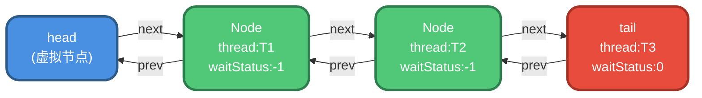

Node类的核心属性包括:

```java
static final class Node {
    // 标记节点在同步队列中的状态
    volatile int waitStatus;
    
    // 前驱节点引用
    volatile Node prev;
    
    // 后继节点引用
    volatile Node next;
    
    // 当前节点代表的线程
    volatile Thread thread;
}
```

节点的waitStatus状态值含义:

| 状态值 | 常量名 | 含义 |
|--------|--------|------|
| 0 | 初始状态 | 新节点入队时的默认状态 |
| -1 | SIGNAL | 表示后继节点需要被唤醒 |
| 1 | CANCELLED | 线程已取消获取资源 |
| -2 | CONDITION | 节点在条件队列中等待 |
| -3 | PROPAGATE | 共享模式下的传播状态 |

### 为什么使用双向链表

AQS选择双向链表而非单向链表,主要基于以下几个原因:

**1. 高效的节点移除**

当线程被中断或取消时,需要从队列中移除对应节点。双向链表可以直接通过prev和next指针完成移除操作,无需从头遍历:

```java
// 移除节点示例(简化版)
node.prev.next = node.next;
if (node.next != null) {
    node.next.prev = node.prev;
}
```

**2. 支持从尾部向前遍历**

在唤醒后继节点时,如果发现后继节点状态异常,需要从尾部向前查找第一个正常节点:

```java
private void unparkSuccessor(Node node) {
    Node s = node.next;
    if (s == null || s.waitStatus > 0) {
        s = null;
        // 从尾部向前遍历,找到最前面的正常节点
        for (Node t = tail; t != null && t != node; t = t.prev)
            if (t.waitStatus <= 0)
                s = t;
    }
    if (s != null)
        LockSupport.unpark(s.thread);
}
```

**3. 确保节点入队的可见性**

节点入队时,先设置prev指针再CAS设置tail,最后设置next指针。这种非原子操作可能导致next指针未设置完成,但prev指针一定已设置,从尾部向前遍历可以保证遍历到所有节点。

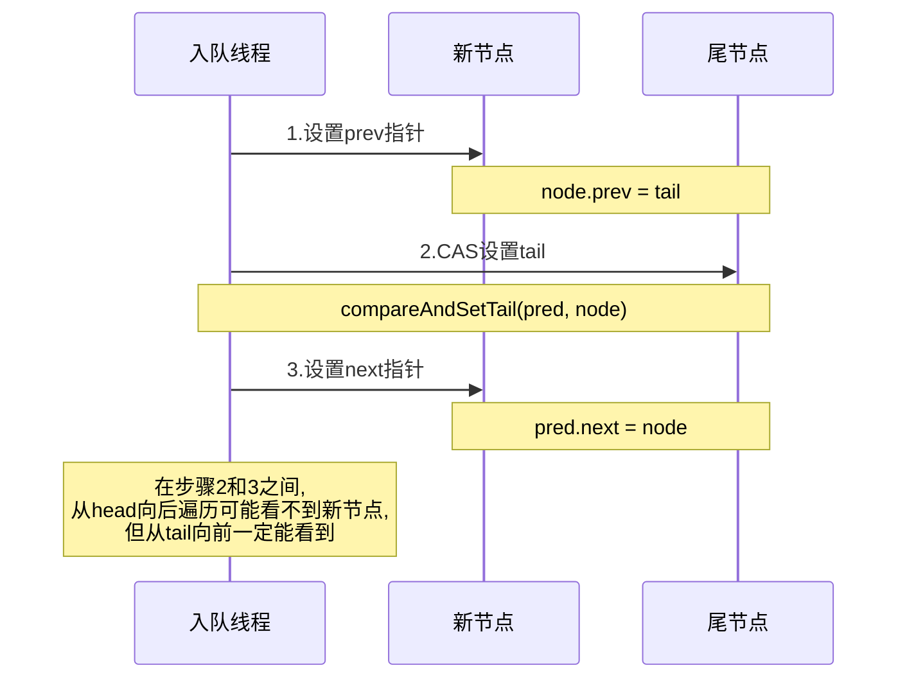

## 同步队列与条件队列

AQS提供了两种队列机制来实现不同的同步需求。

### 同步队列

同步队列用于管理获取锁失败的线程。当线程无法获取锁时,会被封装成Node节点加入队列尾部等待:

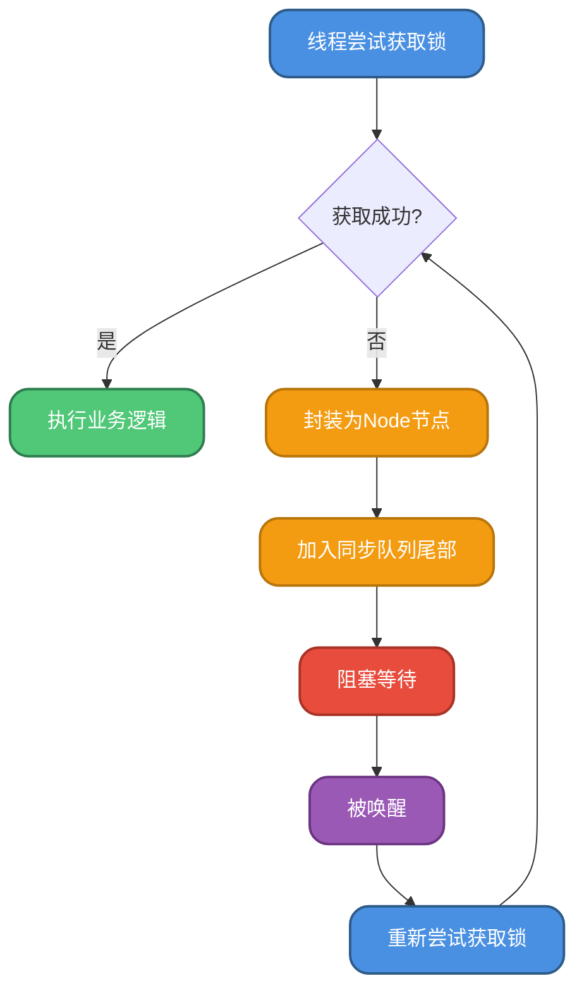

### 条件队列

条件队列用于实现类似wait/notify的线程协作机制。每个Condition对象维护一个独立的条件队列:

```java
public class ConditionObject implements Condition {
    // 条件队列的首尾节点
    private transient Node firstWaiter;
    private transient Node lastWaiter;
}
```

线程调用await()方法时的处理流程:

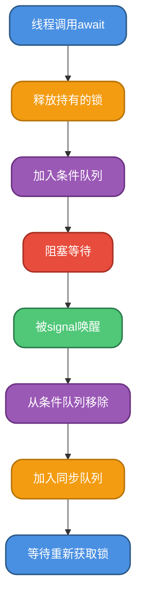

### 两种队列的区别

| 对比项 | 同步队列 | 条件队列 |
|--------|----------|----------|
| 用途 | 管理锁的获取和释放 | 实现线程间条件等待 |
| 数量 | 每个AQS实例一个 | 每个Condition对象一个 |
| 管理方式 | AQS自动管理 | 需显式调用await/signal |
| 队列类型 | 双向链表 | 单向链表 |
| 应用场景 | 所有基于AQS的同步器 | ReentrantLock的Condition |

## 独占模式与共享模式

AQS支持两种资源访问模式,以适应不同的同步需求。

### 独占模式(Exclusive)

独占模式下,同一时刻只允许一个线程访问资源。典型应用是ReentrantLock:

```java
// 银行账户转账场景
class BankAccount {
    private final Lock accountLock = new ReentrantLock();
    private double balance;
    
    public void transfer(double amount) {
        accountLock.lock();
        try {
            // 同一时刻只有一个线程能修改余额
            balance -= amount;
            System.out.println("转账" + amount + "元,余额:" + balance);
        } finally {
            accountLock.unlock();
        }
    }
}
```

独占模式的核心方法:

```java
// 尝试获取资源(由子类实现)
protected boolean tryAcquire(int arg)

// 尝试释放资源(由子类实现)  
protected boolean tryRelease(int arg)

// 获取资源(AQS提供)
public final void acquire(int arg)

// 释放资源(AQS提供)
public final boolean release(int arg)
```

### 共享模式(Shared)

共享模式允许多个线程同时访问资源。典型应用是Semaphore和CountDownLatch:

```java
// 停车场车位管理场景
class ParkingLot {
    private final Semaphore parkingSlots = new Semaphore(10); // 10个车位
    
    public void park(String carId) throws InterruptedException {
        parkingSlots.acquire(); // 获取一个车位
        try {
            System.out.println(carId + "停车,剩余车位:" + parkingSlots.availablePermits());
            Thread.sleep(2000); // 模拟停车时间
        } finally {
            parkingSlots.release(); // 释放车位
            System.out.println(carId + "离开,剩余车位:" + parkingSlots.availablePermits());
        }
    }
}
```

共享模式的核心方法:

```java
// 尝试获取共享资源(由子类实现)
protected int tryAcquireShared(int arg)

// 尝试释放共享资源(由子类实现)
protected boolean tryReleaseShared(int arg)

// 获取共享资源(AQS提供)
public final void acquireShared(int arg)

// 释放共享资源(AQS提供)
public final boolean releaseShared(int arg)
```

### 模式对比

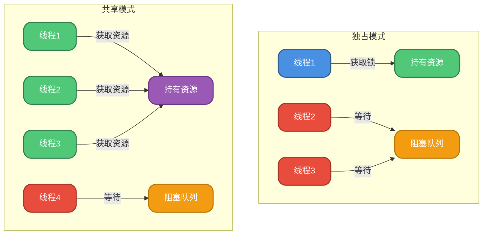

## 线程等待与唤醒机制

AQS使用LockSupport的park和unpark方法来实现线程的阻塞和唤醒,这是一种比传统wait/notify更灵活的机制。

### park与unpark原理

```java
// 阻塞当前线程
LockSupport.park(this);

// 唤醒指定线程
LockSupport.unpark(thread);
```

park/unpark的优势:

1. **精准唤醒**: unpark可以精确指定要唤醒的线程,而notify是随机唤醒
2. **不需要持有锁**: 可以在任意位置调用,不像wait/notify必须在synchronized块中
3. **可以先unpark再park**: unpark会给线程一个许可,后续park可以直接通过

### 线程阻塞流程

当线程获取锁失败时,AQS会进行以下处理:

```java
private final boolean parkAndCheckInterrupt() {
    // 阻塞当前线程
    LockSupport.park(this);
    // 线程被唤醒后,返回中断状态
    return Thread.interrupted();
}
```

在阻塞前,需要检查前驱节点状态:

```java
private static boolean shouldParkAfterFailedAcquire(Node pred, Node node) {
    int ws = pred.waitStatus;
    if (ws == Node.SIGNAL)
        // 前驱节点已设置为SIGNAL,可以安全阻塞
        return true;
    if (ws > 0) {
        // 跳过已取消的前驱节点
        do {
            node.prev = pred = pred.prev;
        } while (pred.waitStatus > 0);
        pred.next = node;
    } else {
        // 将前驱节点状态设置为SIGNAL
        compareAndSetWaitStatus(pred, ws, Node.SIGNAL);
    }
    return false;
}
```

### 线程唤醒流程

当持有锁的线程释放锁时,会唤醒等待队列中的第一个线程:

```java
private void unparkSuccessor(Node node) {
    int ws = node.waitStatus;
    if (ws < 0)
        // 清除SIGNAL状态
        compareAndSetWaitStatus(node, ws, 0);

    Node s = node.next;
    if (s == null || s.waitStatus > 0) {
        s = null;
        // 从尾部向前找到第一个正常节点
        for (Node t = tail; t != null && t != node; t = t.prev)
            if (t.waitStatus <= 0)
                s = t;
    }
    if (s != null)
        // 唤醒后继节点
        LockSupport.unpark(s.thread);
}
```

唤醒流程示意图:

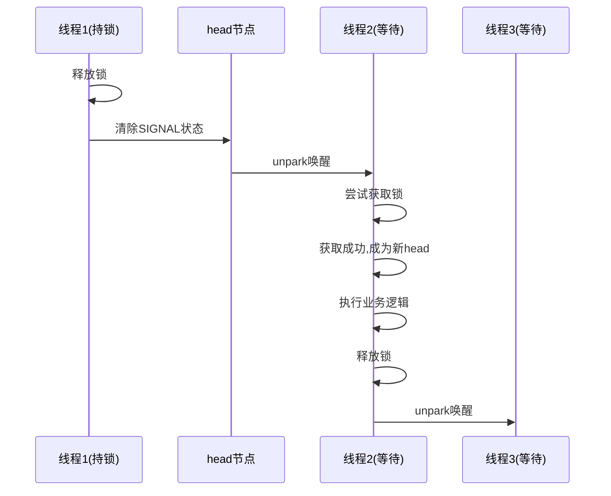

## 独占模式源码分析

以ReentrantLock为例,分析独占模式下资源的获取和释放过程。

### 获取资源流程

```java
public final void acquire(int arg) {
    if (!tryAcquire(arg) &&
        acquireQueued(addWaiter(Node.EXCLUSIVE), arg))
        selfInterrupt();
}
```

该方法包含三个核心步骤:

**1. tryAcquire - 尝试获取资源**

```java
// ReentrantLock的非公平锁实现
final boolean nonfairTryAcquire(int acquires) {
    final Thread current = Thread.currentThread();
    int c = getState();
    if (c == 0) {
        // 资源未被占用,尝试CAS获取
        if (compareAndSetState(0, acquires)) {
            setExclusiveOwnerThread(current);
            return true;
        }
    }
    else if (current == getExclusiveOwnerThread()) {
        // 支持可重入,增加重入次数
        int nextc = c + acquires;
        if (nextc < 0)
            throw new Error("Maximum lock count exceeded");
        setState(nextc);
        return true;
    }
    return false;
}
```

**2. addWaiter - 加入等待队列**

```java
private Node addWaiter(Node mode) {
    Node node = new Node(Thread.currentThread(), mode);
    Node pred = tail;
    if (pred != null) {
        node.prev = pred;
        // 快速入队
        if (compareAndSetTail(pred, node)) {
            pred.next = node;
            return node;
        }
    }
    // 完整入队流程
    enq(node);
    return node;
}
```

**3. acquireQueued - 阻塞等待**

```java
final boolean acquireQueued(final Node node, int arg) {
    boolean failed = true;
    try {
        boolean interrupted = false;
        for (;;) {
            final Node p = node.predecessor();
            // 前驱是head,尝试获取资源
            if (p == head && tryAcquire(arg)) {
                setHead(node);
                p.next = null;
                failed = false;
                return interrupted;
            }
            // 检查是否可以阻塞
            if (shouldParkAfterFailedAcquire(p, node) &&
                parkAndCheckInterrupt())
                interrupted = true;
        }
    } finally {
        if (failed)
            cancelAcquire(node);
    }
}
```

### 释放资源流程

```java
public final boolean release(int arg) {
    if (tryRelease(arg)) {
        Node h = head;
        if (h != null && h.waitStatus != 0)
            unparkSuccessor(h);
        return true;
    }
    return false;
}
```

**tryRelease实现**:

```java
protected final boolean tryRelease(int releases) {
    int c = getState() - releases;
    if (Thread.currentThread() != getExclusiveOwnerThread())
        throw new IllegalMonitorStateException();
    boolean free = false;
    if (c == 0) {
        // 重入次数归零,完全释放锁
        free = true;
        setExclusiveOwnerThread(null);
    }
    setState(c);
    return free;
}
```

完整的获取和释放流程:

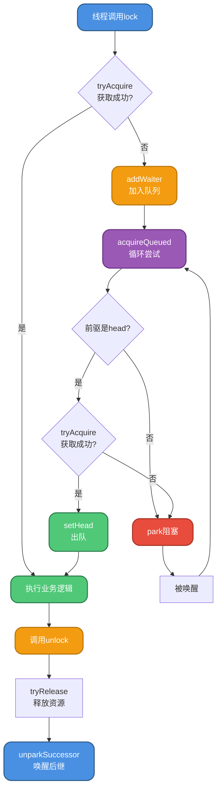

## 共享模式源码分析

以Semaphore为例,分析共享模式下资源的获取和释放过程。

### 获取共享资源

```java
public final void acquireShared(int arg) {
    if (tryAcquireShared(arg) < 0)
        doAcquireShared(arg);
}
```

**tryAcquireShared实现**:

```java
// Semaphore的非公平实现
final int nonfairTryAcquireShared(int acquires) {
    for (;;) {
        int available = getState();
        int remaining = available - acquires;
        // remaining<0表示资源不足
        // remaining>=0则CAS更新state
        if (remaining < 0 ||
            compareAndSetState(available, remaining))
            return remaining;
    }
}
```

返回值含义:
- 负数: 获取失败,资源不足
- 0: 获取成功,但无剩余资源
- 正数: 获取成功,还有剩余资源

**doAcquireShared - 阻塞等待**:

```java
private void doAcquireShared(int arg) {
    final Node node = addWaiter(Node.SHARED);
    boolean failed = true;
    try {
        boolean interrupted = false;
        for (;;) {
            final Node p = node.predecessor();
            if (p == head) {
                int r = tryAcquireShared(arg);
                if (r >= 0) {
                    // 获取成功,设置head并可能传播唤醒
                    setHeadAndPropagate(node, r);
                    p.next = null;
                    if (interrupted)
                        selfInterrupt();
                    failed = false;
                    return;
                }
            }
            if (shouldParkAfterFailedAcquire(p, node) &&
                parkAndCheckInterrupt())
                interrupted = true;
        }
    } finally {
        if (failed)
            cancelAcquire(node);
    }
}
```

### 传播唤醒机制

共享模式的关键在于传播唤醒后继节点:

```java
private void setHeadAndPropagate(Node node, int propagate) {
    Node h = head;
    setHead(node);
    // propagate>0表示还有剩余资源
    // 或者head状态<0(SIGNAL或PROPAGATE)
    if (propagate > 0 || h == null || h.waitStatus < 0 ||
        (h = head) == null || h.waitStatus < 0) {
        Node s = node.next;
        if (s == null || s.isShared())
            doReleaseShared();
    }
}
```

**doReleaseShared - 释放并唤醒**:

```java
private void doReleaseShared() {
    for (;;) {
        Node h = head;
        if (h != null && h != tail) {
            int ws = h.waitStatus;
            if (ws == Node.SIGNAL) {
                if (!compareAndSetWaitStatus(h, Node.SIGNAL, 0))
                    continue;
                unparkSuccessor(h);
            }
            else if (ws == 0 &&
                     !compareAndSetWaitStatus(h, 0, Node.PROPAGATE))
                continue;
        }
        if (h == head)
            break;
    }
}
```

### PROPAGATE状态的作用

PROPAGATE状态用于解决共享模式下的并发唤醒问题。考虑以下场景:

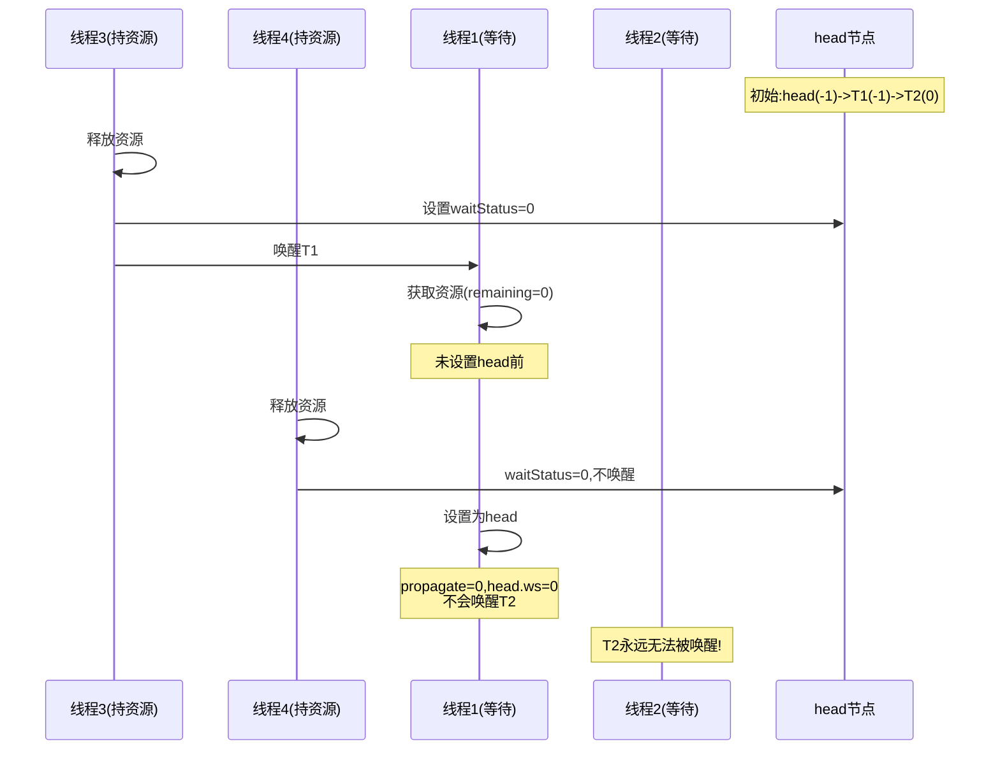

有了PROPAGATE状态后:

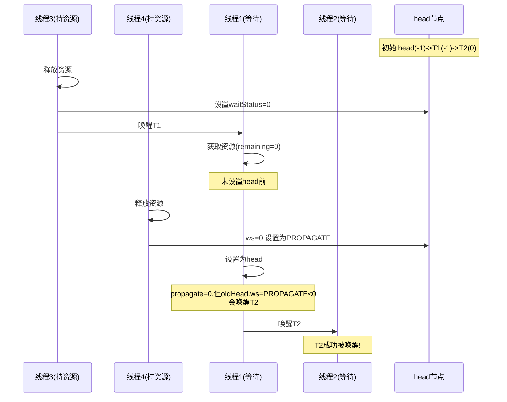

## 基于AQS的同步工具

### ReentrantLock

可重入的互斥锁,支持公平和非公平两种模式:

```java
// 订单处理系统场景
class OrderService {
    private final Lock orderLock = new ReentrantLock();
    private int orderCount = 0;
    
    public void processOrder(String orderId) {
        orderLock.lock();
        try {
            orderCount++;
            System.out.println("处理订单:" + orderId + ",总订单数:" + orderCount);
            // 模拟订单处理
            Thread.sleep(100);
        } catch (InterruptedException e) {
            Thread.currentThread().interrupt();
        } finally {
            orderLock.unlock();
        }
    }
}
```

### Semaphore

信号量,用于控制同时访问资源的线程数:

```java
// 数据库连接池场景
class DatabasePool {
    private final Semaphore connections = new Semaphore(5); // 最多5个连接
    
    public void executeQuery(String sql) throws InterruptedException {
        connections.acquire(); // 获取连接
        try {
            System.out.println("执行SQL:" + sql);
            System.out.println("可用连接数:" + connections.availablePermits());
            Thread.sleep(1000);
        } finally {
            connections.release(); // 释放连接
        }
    }
}
```

### CountDownLatch

倒计时器,用于等待多个线程完成:

```java
// 数据导入场景
class DataImporter {
    public void importData() throws InterruptedException {
        int taskCount = 5;
        CountDownLatch latch = new CountDownLatch(taskCount);
        
        // 启动5个导入任务
        for (int i = 0; i < taskCount; i++) {
            final int taskId = i;
            new Thread(() -> {
                try {
                    System.out.println("任务" + taskId + "开始导入");
                    Thread.sleep(1000);
                    System.out.println("任务" + taskId + "导入完成");
                } catch (InterruptedException e) {
                    e.printStackTrace();
                } finally {
                    latch.countDown(); // 任务完成,计数减1
                }
            }).start();
        }
        
        // 等待所有任务完成
        latch.await();
        System.out.println("所有数据导入完成,开始后续处理");
    }
}
```

### CyclicBarrier

循环栅栏,可重复使用的同步屏障:

```java
// 数据分片处理场景
class DataProcessor {
    public void processBatch() throws Exception {
        int workerCount = 4;
        CyclicBarrier barrier = new CyclicBarrier(workerCount, () -> {
            System.out.println("===== 本批次处理完成,开始汇总 =====");
        });
        
        for (int i = 0; i < workerCount; i++) {
            final int workerId = i;
            new Thread(() -> {
                try {
                    for (int batch = 0; batch < 3; batch++) {
                        System.out.println("工作线程" + workerId + "处理第" + batch + "批数据");
                        Thread.sleep(1000);
                        barrier.await(); // 等待其他线程完成
                    }
                } catch (Exception e) {
                    e.printStackTrace();
                }
            }).start();
        }
    }
}
```

## 性能优化与设计思想

### CAS操作的广泛应用

AQS大量使用CAS操作来保证并发安全,相比synchronized,CAS避免了线程阻塞,性能更优:

```java
// 队列初始化的CAS
if (compareAndSetHead(new Node()))
    tail = head;

// 节点入队的CAS
if (compareAndSetTail(pred, node)) {
    pred.next = node;
    return node;
}

// 状态更新的CAS
compareAndSetWaitStatus(pred, ws, Node.SIGNAL);
```

### CLH队列的优化

AQS基于CLH锁队列,并进行了两个重要优化:

1. **自旋+阻塞**: CLH原本是纯自旋,AQS改为短暂自旋后阻塞,减少CPU消耗
2. **单向改双向**: 方便节点删除和反向遍历

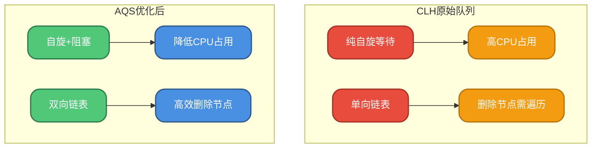

### 模板方法模式

AQS使用模板方法模式,将通用流程固化,特定逻辑交给子类实现:

```java
// AQS提供的模板方法(需子类实现)
protected boolean tryAcquire(int arg)
protected boolean tryRelease(int arg)
protected int tryAcquireShared(int arg)
protected boolean tryReleaseShared(int arg)
protected boolean isHeldExclusively()

// AQS提供的完整流程(final方法)
public final void acquire(int arg)
public final boolean release(int arg)
public final void acquireShared(int arg)
public final boolean releaseShared(int arg)
```

这种设计使得开发者只需关注资源的获取和释放逻辑,无需处理复杂的队列管理:

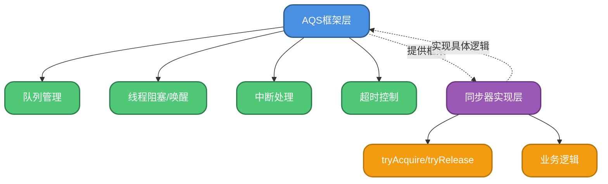

## 总结

AQS作为Java并发包的基石,通过以下设计实现了高效的同步控制:

1. **状态管理**: 使用volatile的state变量表示同步状态,配合CAS操作保证原子性
2. **队列机制**: 维护FIFO双向队列管理等待线程,支持高效的节点操作
3. **两种模式**: 独占和共享模式满足不同的同步需求
4. **两种队列**: 同步队列用于锁竞争,条件队列用于线程协作
5. **阻塞唤醒**: 基于LockSupport实现精准的线程控制
6. **模板方法**: 框架提供通用流程,子类实现具体逻辑

理解AQS的原理,对于掌握Java并发编程、设计高性能的同步组件都有重要意义。
