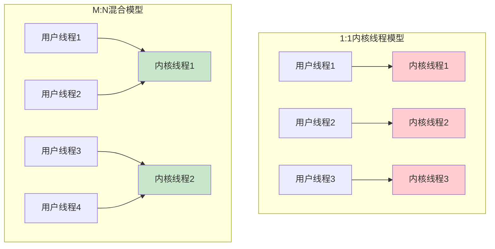
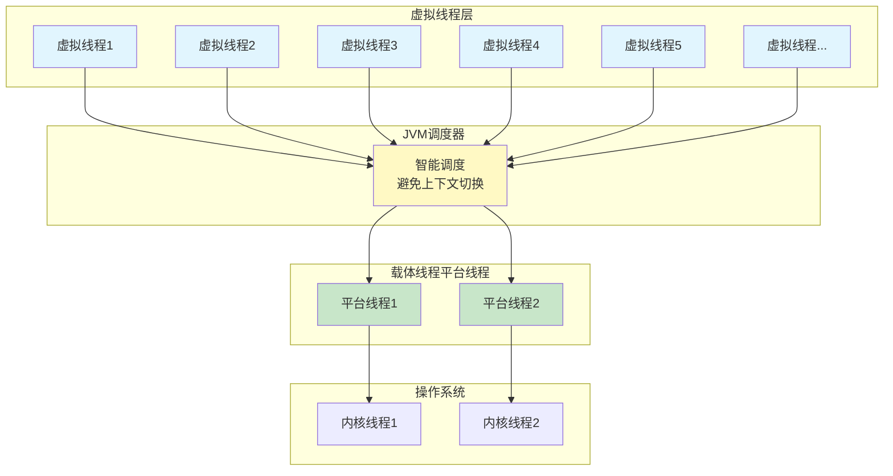

# 虚拟线程与现代并发编程

## 传统线程模型的困境

在探讨虚拟线程之前,我们先来理解传统Java线程模型面临的挑战。

### 操作系统线程的三种实现方式

操作系统级别的线程实现主要有三种方式：

**内核线程实现（1:1模型）**：每个用户线程直接映射到一个内核线程，由操作系统内核负责调度。优点是充分利用多核处理器，缺点是创建、销毁和上下文切换的成本高。

**用户线程实现（N:1模型）**：多个用户线程映射到一个内核线程，线程调度完全在用户空间完成。优点是轻量高效，缺点是无法利用多核优势，一个线程阻塞会导致所有线程阻塞。

**混合实现（M:N模型）**：多个用户线程映射到少量内核线程，兼具前两种方式的优点，但实现复杂度高。



### Java平台线程的局限性

在JDK 21之前，Java主要采用1:1的线程模型，每个Java线程都对应一个操作系统的内核线程（在Windows和Linux等主流平台上）。这种设计虽然简单直接，但存在明显的限制：

**创建成本高**：创建线程需要分配内核资源，调用系统API，开销较大。

**上下文切换开销**：线程切换需要在用户态和内核态之间切换，保存和恢复寄存器状态，消耗CPU资源。

**内存占用大**：每个线程都需要分配独立的栈空间（通常1MB左右），大量线程会占用大量内存。

**数量受限**：受操作系统和硬件资源限制，单个JVM能创建的线程数量有上限（通常几千到几万）。

这些限制在高并发场景下尤为突出。例如，一个需要处理百万级并发连接的服务器，无法为每个连接分配一个平台线程。

## 虚拟线程的革命性创新

### 协程思想的引入

虚拟线程（Virtual Thread）的概念对于熟悉Go、Python、Ruby等语言的开发者来说并不陌生——这就是**协程（Coroutine）**。

JDK 21正式引入虚拟线程，从根本上改变了Java的并发编程模式。虚拟线程是JVM实现的轻量级线程，它将多个虚拟线程映射到少量操作系统线程上，通过智能调度避免了传统线程的高昂开销。

### M:N调度模型

虚拟线程采用M:N调度模型：

- **M个虚拟线程**（数量可以非常大，百万级别）
- **N个载体线程**（Carrier Thread，即平台线程，数量较少）
- **JVM调度器**：负责将虚拟线程调度到载体线程上执行



### 核心优势

**极低的创建成本**：创建虚拟线程只需在堆上分配一个Java对象，无需系统调用，成本极低。

**高效的内存使用**：虚拟线程的栈是动态伸缩的，初始只有几KB，按需增长，内存占用远小于平台线程。

**无上下文切换开销**：虚拟线程的切换在用户空间完成，不涉及内核态切换，效率极高。

**数量几乎无限**：可以轻松创建百万级别的虚拟线程，只受JVM堆内存限制。

**简化异步编程**：可以用同步代码风格编写异步逻辑，无需复杂的回调和异步框架。

## 虚拟线程的使用方式

### Thread.ofVirtual()方式

使用`Thread.ofVirtual()`创建虚拟线程：

```java
// 创建并启动虚拟线程
Thread vThread = Thread.ofVirtual().start(() -> {
    System.out.println("虚拟线程执行中：" + Thread.currentThread());
});

// 等待虚拟线程完成
vThread.join();
```

### Thread.startVirtualThread()快捷方式

更简洁的方式是使用`Thread.startVirtualThread()`：

```java
Thread.startVirtualThread(() -> {
    System.out.println("快速创建虚拟线程");
    // 执行业务逻辑
    processTask();
});
```

### Builder模式创建

使用Builder模式可以设置线程名称等属性：

```java
Thread.Builder virtualBuilder = Thread.ofVirtual().name("virtual-worker-", 0);

Thread vt1 = virtualBuilder.start(() -> processRequest("REQ-001"));
Thread vt2 = virtualBuilder.start(() -> processRequest("REQ-002"));

vt1.join();
vt2.join();
```

对比平台线程的创建：

```java
Thread.Builder platformBuilder = Thread.ofPlatform().name("platform-worker");

Thread pt = platformBuilder.start(() -> {
    System.out.println("平台线程执行：" + Thread.currentThread());
});
```

### 虚拟线程池

JDK 21提供了专门为虚拟线程设计的Executor：

```java
try (ExecutorService executor = Executors.newVirtualThreadPerTaskExecutor()) {
    // 提交大量任务
    IntStream.range(0, 100000).forEach(i -> {
        executor.submit(() -> {
            try {
                Thread.sleep(Duration.ofMillis(100));
                return handleTask(i);
            } catch (InterruptedException e) {
                Thread.currentThread().interrupt();
                return null;
            }
        });
    });
} // 自动关闭，等待所有任务完成
```

**重要提示**：虽然可以使用线程池管理虚拟线程，但这并不是推荐的做法。传统线程池的设计目的是复用昂贵的平台线程，而虚拟线程创建成本极低，使用线程池反而会增加复杂度。通常直接创建虚拟线程即可。

## 虚拟线程与平台线程的差异

### 守护线程特性

**虚拟线程总是守护线程**，无法通过`setDaemon(false)`改变。这意味着：

- JVM不会等待虚拟线程执行完毕才退出
- 当所有非守护的平台线程结束时，JVM会立即终止
- 虚拟线程中的未完成任务可能被强制中断

```java
// 这段代码可能看不到输出
Thread.startVirtualThread(() -> {
    try {
        Thread.sleep(5000);
        System.out.println("这行可能不会执行");
    } catch (InterruptedException e) {
        e.printStackTrace();
    }
});
// 主线程结束，JVM退出，虚拟线程被终止

// 正确做法：主线程等待
Thread vt = Thread.startVirtualThread(() -> {
    try {
        Thread.sleep(5000);
        System.out.println("这行会执行");
    } catch (InterruptedException e) {
        e.printStackTrace();
    }
});
vt.join();  // 等待虚拟线程完成
```

### 优先级限制

**虚拟线程的优先级固定为`Thread.NORM_PRIORITY`（5）**，调用`setPriority()`无效：

```java
Thread vt = Thread.ofVirtual().start(() -> {
    System.out.println("优先级：" + Thread.currentThread().getPriority());
});

vt.setPriority(Thread.MAX_PRIORITY);  // 无效操作
// 优先级仍然是5
```

### 不支持的方法

虚拟线程不支持以下已过时的方法：

- `stop()`
- `suspend()`  
- `resume()`

调用这些方法会抛出`UnsupportedOperationException`异常。

### ThreadLocal的使用限制

虽然虚拟线程支持`ThreadLocal`，但由于虚拟线程数量可能非常大，不当使用`ThreadLocal`可能导致严重的内存问题。

**问题场景**：
```java
// 危险：可能创建百万个ThreadLocal实例
ThreadLocal<HeavyObject> threadLocal = ThreadLocal.withInitial(HeavyObject::new);

try (ExecutorService executor = Executors.newVirtualThreadPerTaskExecutor()) {
    IntStream.range(0, 1_000_000).forEach(i -> {
        executor.submit(() -> {
            HeavyObject obj = threadLocal.get();  // 每个虚拟线程一个实例！
            obj.process();
        });
    });
}
```

**推荐方案**：使用Scoped Values（作用域变量）

JDK 21引入的Scoped Values（JEP 429）是`ThreadLocal`的现代替代方案，专门为虚拟线程设计：

```java
// 定义作用域变量
final static ScopedValue<UserContext> USER_CONTEXT = ScopedValue.newInstance();

// 设置作用域变量（不可变）
void handleRequest(Request request) {
    UserContext context = new UserContext(request.getUserId());
    
    ScopedValue.where(USER_CONTEXT, context).run(() -> {
        // 在此作用域内可以访问context
        processBusinessLogic();
        callOtherMethods();
    });
    // 离开作用域，变量自动清理
}

// 在其他方法中访问
void processBusinessLogic() {
    UserContext context = USER_CONTEXT.get();
    System.out.println("当前用户：" + context.getUserId());
}
```

Scoped Values的优势：
- **不可变性**：值一旦设置就不能修改，线程安全
- **作用域明确**：变量只在特定代码块内有效，离开作用域自动清理
- **内存友好**：相比ThreadLocal更适合大量虚拟线程的场景

## 性能对比实战

让我们通过实际测试对比虚拟线程和平台线程的性能差异。

### 测试场景设计

模拟IO密集型任务，每个任务执行简单计算后休眠10ms：

```java
private static void simulateIOTask() {
    try {
        // 模拟计算
        IntStream.range(0, 100).forEach(i -> {
            Math.sqrt(i);
        });
        
        // 模拟IO阻塞
        Thread.sleep(10);
    } catch (InterruptedException e) {
        Thread.currentThread().interrupt();
    }
}
```

### 平台线程测试

使用传统线程池执行10000个任务：

```java
private static void testPlatformThreads(int taskCount) throws InterruptedException {
    ExecutorService executor = Executors.newFixedThreadPool(200);
    long startTime = System.nanoTime();
    
    CountDownLatch latch = new CountDownLatch(taskCount);
    
    for (int i = 0; i < taskCount; i++) {
        executor.submit(() -> {
            try {
                simulateIOTask();
            } finally {
                latch.countDown();
            }
        });
    }
    
    latch.await();
    executor.shutdown();
    
    long duration = (System.nanoTime() - startTime) / 1_000_000;
    System.out.println("平台线程执行时间：" + duration + " ms");
}
```

### 虚拟线程测试

使用虚拟线程执行相同任务：

```java
private static void testVirtualThreads(int taskCount) throws InterruptedException {
    ExecutorService executor = Executors.newVirtualThreadPerTaskExecutor();
    long startTime = System.nanoTime();
    
    CountDownLatch latch = new CountDownLatch(taskCount);
    
    for (int i = 0; i < taskCount; i++) {
        executor.submit(() -> {
            try {
                simulateIOTask();
            } finally {
                latch.countDown();
            }
        });
    }
    
    latch.await();
    executor.shutdown();
    
    long duration = (System.nanoTime() - startTime) / 1_000_000;
    System.out.println("虚拟线程执行时间：" + duration + " ms");
}
```

### 性能测试结果

```java
public static void main(String[] args) throws InterruptedException {
    int taskCount = 10_000;
    
    System.out.println("执行 " + taskCount + " 个任务");
    System.out.println("================================");
    
    testPlatformThreads(taskCount);
    // 输出：平台线程执行时间：约550 ms
    
    Thread.sleep(1000);  // 间隔一下
    
    testVirtualThreads(taskCount);
    // 输出：虚拟线程执行时间：约120 ms
}
```

**测试结论**：

- 平台线程（200个线程池）：约550ms
- 虚拟线程：约120ms
- **性能提升约4.5倍**

性能差距的主要原因：
1. 平台线程数量受限（200个），任务需要排队等待
2. 虚拟线程可以创建10000个，几乎无需等待
3. 虚拟线程的上下文切换开销远小于平台线程

## 虚拟线程适用场景

### 适合使用虚拟线程

**IO密集型应用**：
- Web服务器处理大量HTTP请求
- 数据库密集型查询应用
- 文件IO操作
- 网络通信

**高并发场景**：
- 需要处理数十万并发连接的服务
- 消息处理系统
- 实时推送服务

**简化异步编程**：
- 用同步代码风格编写异步逻辑
- 替代复杂的异步框架和回调

### 不适合使用虚拟线程

**CPU密集型任务**：
- 大量数学计算
- 图像处理
- 加密解密

这类任务几乎不阻塞，虚拟线程的优势无法体现，反而增加调度开销。

**固定使用ThreadLocal的老代码**：
- 大量使用ThreadLocal的遗留系统
- 需要重构为Scoped Values

## 总结

虚拟线程是Java并发编程的重大进步，它：

- 采用M:N调度模型，将大量虚拟线程映射到少量平台线程
- 创建成本极低，可以支持百万级并发
- 在IO密集型场景下性能提升显著
- 简化了异步编程，用同步代码风格处理并发

使用虚拟线程的最佳实践：
- 优先选择IO密集型场景
- 避免滥用ThreadLocal，改用Scoped Values
- 注意虚拟线程是守护线程，主线程需等待
- 不要将虚拟线程放入传统线程池
- CPU密集型任务仍使用平台线程

随着JDK的持续演进，虚拟线程将成为Java并发编程的主流方案，帮助开发者构建更高性能、更易维护的并发应用。
