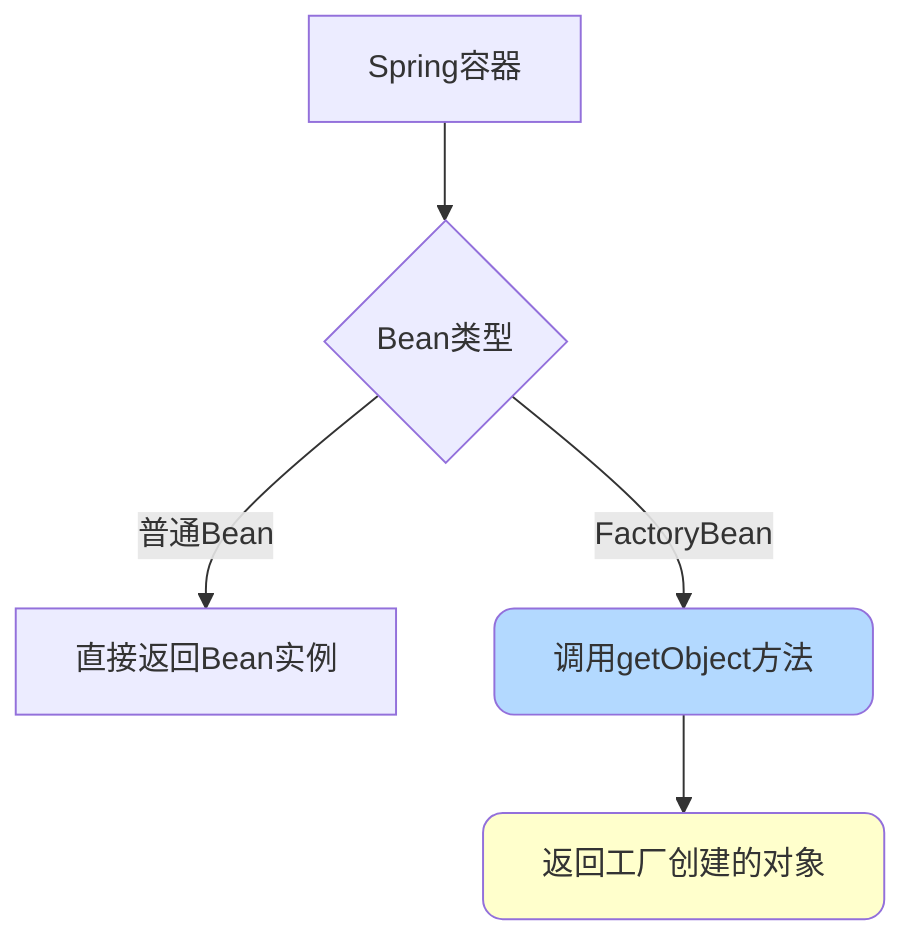
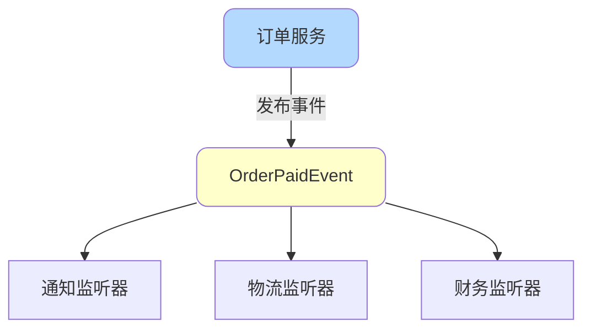
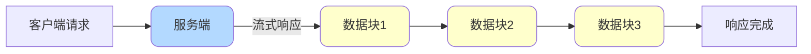
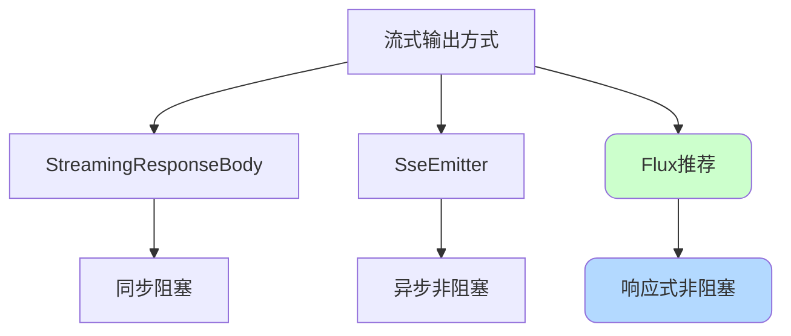
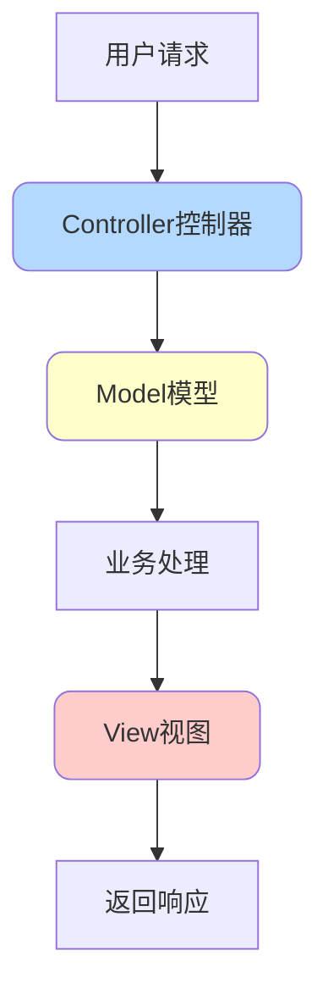
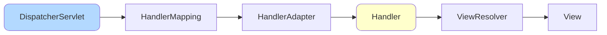

# Spring高级特性与应用

## BeanFactory与FactoryBean

### BeanFactory

BeanFactory是Spring IoC容器的核心接口,负责管理Bean的创建和生命周期。

```java
public interface BeanFactory {
    Object getBean(String name);
    <T> T getBean(String name, Class<T> requiredType);
    <T> T getBean(Class<T> requiredType);
    boolean containsBean(String name);
    boolean isSingleton(String name);
    // ...
}
```

我们常用的`ApplicationContext`就是BeanFactory的扩展实现:

```java
@Service
public class UserService {
    
    @Autowired
    private ApplicationContext applicationContext;
    
    public void demo() {
        // 通过BeanFactory获取Bean
        InventoryService service = applicationContext.getBean(InventoryService.class);
        
        // 通过名称获取
        Object bean = applicationContext.getBean("inventoryService");
    }
}
```

**使用场景**:当被注入的类不受Spring管理时

```java
// 充血模型示例
public class Order {
    
    private Long orderId;
    private BigDecimal amount;
    
    public void calculate() {
        // 需要使用Spring管理的服务,但Order不是Spring Bean
        OrderCalculator calculator = SpringContextHolder.getBean(OrderCalculator.class);
        calculator.calculate(this);
    }
}

// Spring上下文持有者
@Component
public class SpringContextHolder implements ApplicationContextAware {
    
    private static ApplicationContext applicationContext;
    
    @Override
    public void setApplicationContext(ApplicationContext context) {
        SpringContextHolder.applicationContext = context;
    }
    
    public static <T> T getBean(Class<T> requiredType) {
        return applicationContext.getBean(requiredType);
    }
    
    public static Object getBean(String name) {
        return applicationContext.getBean(name);
    }
}
```

### FactoryBean

FactoryBean是一个工厂Bean接口,用于创建复杂对象或代理对象。

```java
public interface FactoryBean<T> {
    T getObject() throws Exception;        // 获取Bean实例
    Class<?> getObjectType();              // 获取Bean类型
    boolean isSingleton();                 // 是否单例
}
```

**典型应用:Dubbo的ReferenceBean**

Dubbo通过FactoryBean创建远程服务代理:

```java
public class ReferenceBean<T> implements FactoryBean<T> {
    
    @Override
    public T getObject() {
        // 创建远程服务的动态代理对象
        return createProxy();
    }
    
    private T createProxy() {
        // 1. 配置网络通信
        // 2. 配置序列化
        // 3. 创建动态代理
        return (T) Proxy.newProxyInstance(...);
    }
}
```

使用方式:

```java
@Configuration
public class DubboConfig {
    
    @Bean
    public ReferenceBean<UserService> userServiceReference() {
        ReferenceBean<UserService> reference = new ReferenceBean<>();
        reference.setInterface(UserService.class);
        reference.setVersion("1.0.0");
        return reference;  // Spring会调用getObject()获取代理对象
    }
}

@Service
public class OrderService {
    
    @DubboReference(version = "1.0.0")
    private UserService userService;  // 注入的是代理对象
}
```



## Spring设计模式应用

### 工厂模式

Spring的IoC容器本身就是一个大工厂,负责创建和管理Bean。

```java
// Spring容器充当工厂角色
ApplicationContext context = new AnnotationConfigApplicationContext(AppConfig.class);
UserService userService = context.getBean(UserService.class);
```

### 单例模式

Spring Bean默认是单例的,由容器保证单例特性:

```java
@Service
public class ConfigService {
    // Spring保证整个容器中只有一个实例
}
```

### 代理模式

Spring AOP基于代理模式实现,通过代理增强目标对象:

```java
@Aspect
@Component
public class PerformanceAspect {
    
    @Around("@annotation(com.example.annotation.Performance)")
    public Object measurePerformance(ProceedingJoinPoint joinPoint) throws Throwable {
        long start = System.currentTimeMillis();
        Object result = joinPoint.proceed();
        long end = System.currentTimeMillis();
        System.out.println("方法执行耗时:" + (end - start) + "ms");
        return result;
    }
}
```

### 模板方法模式

Spring的`JdbcTemplate`、`TransactionTemplate`等都使用了模板方法:

```java
@Service
public class PaymentService {
    
    @Autowired
    private TransactionTemplate transactionTemplate;
    
    public void processPayment(Order order) {
        transactionTemplate.execute(status -> {
            // 1. 扣减库存
            inventoryService.deduct(order);
            // 2. 创建支付单
            createPaymentOrder(order);
            // 3. 调用支付
            paymentGateway.pay(order);
            return null;
        });
        // 事务提交/回滚由模板方法控制
    }
}
```

### 策略模式

结合Spring IoC实现策略模式:

```java
// 支付策略接口
public interface PaymentStrategy extends InitializingBean {
    void pay(Order order);
    PaymentType getSupportType();
    
    @Override
    default void afterPropertiesSet() {
        PaymentFactory.register(getSupportType(), this);
    }
}

// 支付宝策略
@Component
public class AlipayStrategy implements PaymentStrategy {
    
    @Override
    public void pay(Order order) {
        System.out.println("使用支付宝支付");
    }
    
    @Override
    public PaymentType getSupportType() {
        return PaymentType.ALIPAY;
    }
}

// 微信策略
@Component
public class WechatPayStrategy implements PaymentStrategy {
    
    @Override
    public void pay(Order order) {
        System.out.println("使用微信支付");
    }
    
    @Override
    public PaymentType getSupportType() {
        return PaymentType.WECHAT;
    }
}

// 策略工厂
public class PaymentFactory {
    
    private static final Map<PaymentType, PaymentStrategy> STRATEGIES = new HashMap<>();
    
    public static void register(PaymentType type, PaymentStrategy strategy) {
        STRATEGIES.put(type, strategy);
    }
    
    public static PaymentStrategy getStrategy(PaymentType type) {
        return STRATEGIES.get(type);
    }
}

// 使用
@Service
public class OrderService {
    
    public void pay(Order order, PaymentType paymentType) {
        PaymentStrategy strategy = PaymentFactory.getStrategy(paymentType);
        strategy.pay(order);
    }
}
```

### 观察者模式

Spring Event机制基于观察者模式:

```java
// 定义事件
public class OrderPaidEvent extends ApplicationEvent {
    
    private Order order;
    
    public OrderPaidEvent(Object source, Order order) {
        super(source);
        this.order = order;
    }
    
    public Order getOrder() {
        return order;
    }
}

// 事件发布者
@Service
public class OrderService {
    
    @Autowired
    private ApplicationEventPublisher eventPublisher;
    
    public void paySuccess(Order order) {
        // 更新订单状态
        updateOrderStatus(order);
        
        // 发布支付成功事件
        eventPublisher.publishEvent(new OrderPaidEvent(this, order));
    }
}

// 事件监听者 - 通知服务
@Component
public class NotificationListener {
    
    @EventListener
    public void onOrderPaid(OrderPaidEvent event) {
        Order order = event.getOrder();
        // 发送支付成功通知
        sendNotification(order);
    }
}

// 事件监听者 - 物流服务
@Component
public class LogisticsListener {
    
    @EventListener
    public void onOrderPaid(OrderPaidEvent event) {
        Order order = event.getOrder();
        // 创建物流单
        createLogistics(order);
    }
}
```



**异步事件**:

```java
@Configuration
@EnableAsync
public class AsyncConfig {
    
    @Bean
    public Executor taskExecutor() {
        ThreadPoolTaskExecutor executor = new ThreadPoolTaskExecutor();
        executor.setCorePoolSize(5);
        executor.setMaxPoolSize(10);
        executor.setQueueCapacity(100);
        executor.initialize();
        return executor;
    }
}

@Component
public class NotificationListener {
    
    @Async
    @EventListener
    public void onOrderPaid(OrderPaidEvent event) {
        // 异步发送通知
        sendNotification(event.getOrder());
    }
}
```

### 责任链模式

SpringMVC的拦截器使用责任链模式:

```java
// 拦截器1:权限校验
@Component
public class AuthInterceptor implements HandlerInterceptor {
    
    @Override
    public boolean preHandle(HttpServletRequest request, 
                            HttpServletResponse response, 
                            Object handler) {
        // 校验权限
        return checkAuth(request);
    }
}

// 拦截器2:日志记录
@Component
public class LogInterceptor implements HandlerInterceptor {
    
    @Override
    public boolean preHandle(HttpServletRequest request, 
                            HttpServletResponse response, 
                            Object handler) {
        // 记录请求日志
        logRequest(request);
        return true;
    }
}

// 配置拦截器链
@Configuration
public class WebConfig implements WebMvcConfigurer {
    
    @Autowired
    private AuthInterceptor authInterceptor;
    
    @Autowired
    private LogInterceptor logInterceptor;
    
    @Override
    public void addInterceptors(InterceptorRegistry registry) {
        registry.addInterceptor(logInterceptor)
                .addPathPatterns("/**");
        
        registry.addInterceptor(authInterceptor)
                .addPathPatterns("/api/**");
    }
}
```

## Spring的ShutdownHook

ShutdownHook是Spring在应用关闭时执行清理操作的机制。

### 作用

Spring向JVM注册ShutdownHook,在接收到关闭通知时:

1. 执行Bean的销毁方法
2. 销毁容器
3. 释放资源

```mermaid
graph LR
    A[JVM关闭信号] --> B[ShutdownHook]
    B --> C[调用DisposableBean.destroy]
    B --> D[调用destroy-method]
    B --> E[调用@PreDestroy方法]
    C --> F[容器销毁]
    D --> F
    E --> F
    
    style B fill:#b3d9ff,rx:10,ry:10
    style F fill:#ffffcc,rx:10,ry:10
```

### 使用方式

**(1) 实现DisposableBean接口**

```java
@Component
public class ConnectionPool implements DisposableBean {
    
    private List<Connection> connections;
    
    @Override
    public void destroy() {
        // 关闭所有连接
        for (Connection conn : connections) {
            conn.close();
        }
        System.out.println("连接池已关闭");
    }
}
```

**(2) 使用@PreDestroy注解**

```java
@Service
public class CacheService {
    
    private Cache cache;
    
    @PreDestroy
    public void cleanup() {
        // 刷新缓存到磁盘
        cache.flush();
        System.out.println("缓存已刷新");
    }
}
```

**(3) 监听ContextClosedEvent**

```java
@Component
public class ShutdownListener implements ApplicationListener<ContextClosedEvent> {
    
    @Override
    public void onApplicationEvent(ContextClosedEvent event) {
        System.out.println("容器即将关闭,执行清理...");
        // 执行清理逻辑
    }
}
```

### 应用场景

**Dubbo优雅下线**:

```java
@Component
public class DubboShutdownHook implements ApplicationListener<ContextClosedEvent> {
    
    @Override
    public void onApplicationEvent(ContextClosedEvent event) {
        // 1. 从注册中心注销服务
        unregisterFromRegistry();
        
        // 2. 等待正在处理的请求完成
        waitForRequestsComplete();
        
        // 3. 关闭线程池
        shutdownThreadPool();
    }
}
```

## SpringMVC流式输出

流式输出指服务器逐步将数据写入响应体,而不是一次性返回,常用于大语言模型对话等场景。



### 方式一:StreamingResponseBody

```java
@RestController
public class ChatController {
    
    @GetMapping("/chat")
    public ResponseEntity<StreamingResponseBody> chat(@RequestParam String question) {
        
        StreamingResponseBody stream = outputStream -> {
            for (int i = 0; i < 10; i++) {
                String data = "回答片段 " + i + "\n";
                outputStream.write(data.getBytes(StandardCharsets.UTF_8));
                outputStream.flush();
                
                Thread.sleep(500);  // 模拟生成延迟
            }
        };
        
        return ResponseEntity.ok()
                .header(HttpHeaders.CONTENT_TYPE, MediaType.TEXT_EVENT_STREAM_VALUE)
                .body(stream);
    }
}
```

特点:同步阻塞,占用连接直到完成。

### 方式二:SseEmitter

SSE(Server-Sent Events)是基于HTTP的服务端推送技术:

```java
@RestController
public class ChatController {
    
    @GetMapping("/chat")
    public SseEmitter chat(@RequestParam String question) {
        
        SseEmitter emitter = new SseEmitter(60000L);  // 超时时间
        
        // 异步发送数据
        Executors.newSingleThreadExecutor().submit(() -> {
            try {
                for (int i = 0; i < 10; i++) {
                    emitter.send("回答片段 " + i);
                    Thread.sleep(1000);
                }
                emitter.complete();
            } catch (Exception e) {
                emitter.completeWithError(e);
            }
        });
        
        return emitter;
    }
}
```

特点:支持异步,不阻塞主线程。

### 方式三:Flux(推荐)

响应式编程方式,基于Reactor:

```java
@RestController
public class ChatController {
    
    @GetMapping(value = "/chat", produces = MediaType.TEXT_EVENT_STREAM_VALUE)
    public Flux<String> chat(@RequestParam String question) {
        return Flux.interval(Duration.ofSeconds(1))
                .map(seq -> "回答片段 - " + seq)
                .take(10);  // 只取10个元素
    }
}
```

特点:异步非阻塞,支持背压,推荐使用。



## SpringMVC核心概念

MVC是Model-View-Controller的缩写,是一种软件设计模式,将应用分为三个部分:



- **Model(模型)**:核心业务逻辑和数据,不关心显示方式
- **View(视图)**:用户界面,负责数据展示和用户交互
- **Controller(控制器)**:处理用户输入,协调Model和View

### SpringMVC核心组件



- **DispatcherServlet**:前端控制器,接收请求并分发
- **HandlerMapping**:根据URL找到对应的Handler
- **HandlerAdapter**:适配执行Handler
- **Handler**:实际处理请求的处理器(Controller)
- **ViewResolver**:解析逻辑视图为实际视图
- **View**:渲染视图并返回响应

### MVC的核心思想

1. **分离关注点**:业务逻辑、数据、显示分离
2. **提高可维护性**:各层独立,易于修改
3. **促进代码复用**:组件可重用
4. **便于团队协作**:前后端可并行开发

前后端分离后,后端只负责提供数据(JSON),不再渲染视图:

```java
@RestController
@RequestMapping("/api/orders")
public class OrderController {
    
    @Autowired
    private OrderService orderService;
    
    @PostMapping
    public ResponseEntity<Order> createOrder(@RequestBody OrderRequest request) {
        Order order = orderService.create(request);
        return ResponseEntity.ok(order);  // 返回JSON数据
    }
}
```
