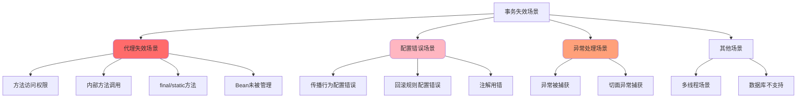
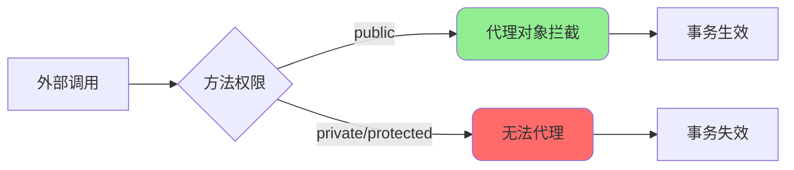
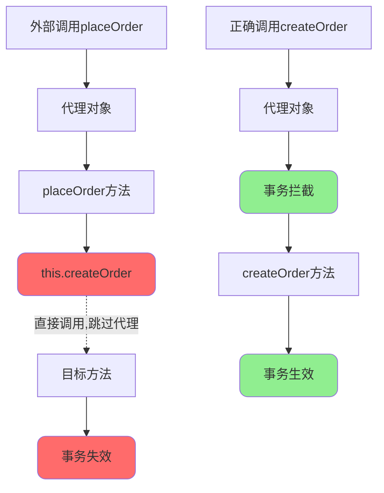
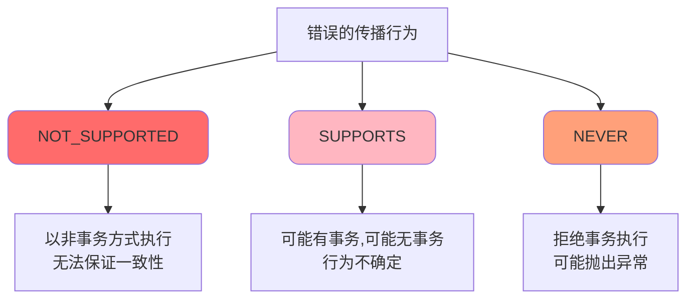
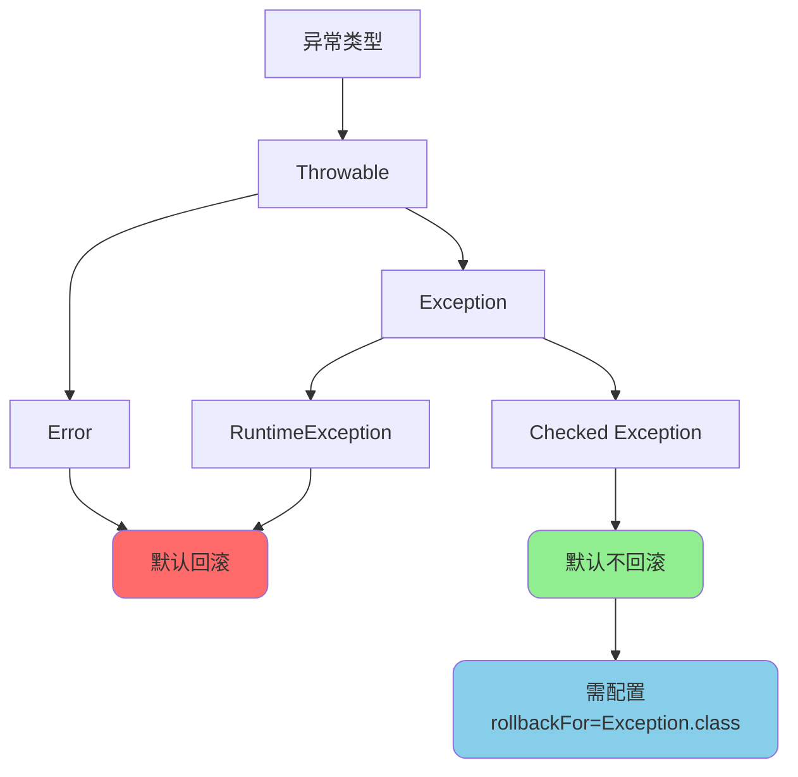
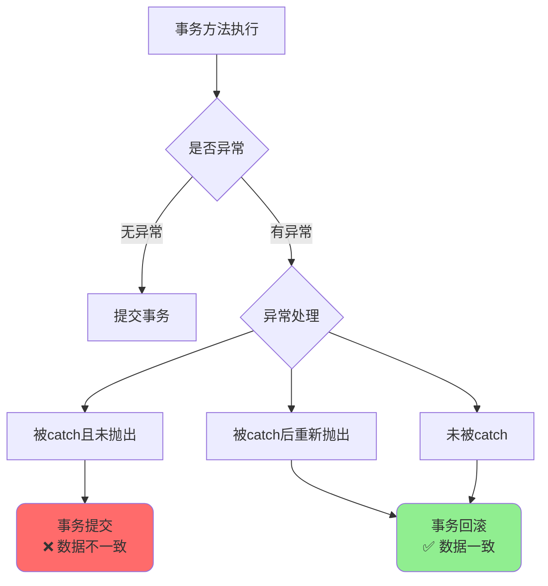
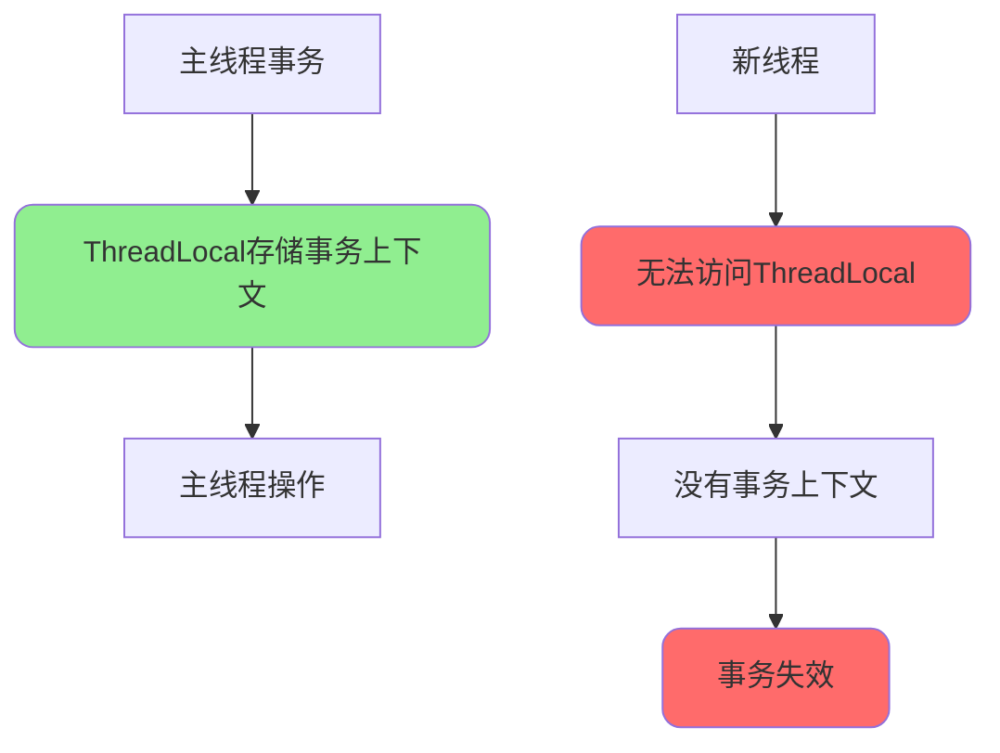
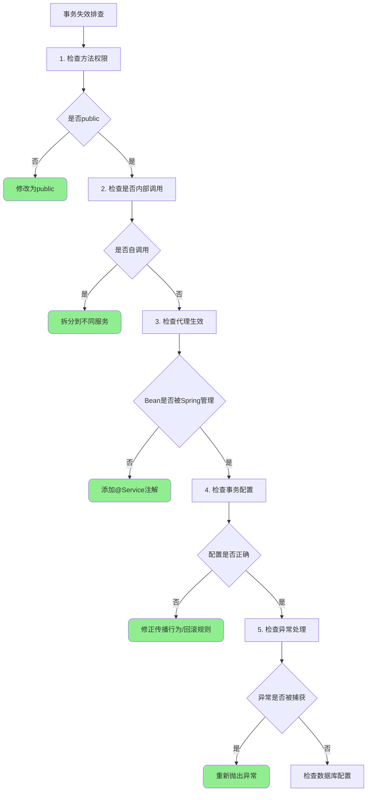

# Spring事务失效场景与解决方案

## 事务失效概述

Spring声明式事务基于AOP动态代理实现,在某些特定场景下会失效。理解这些失效场景及其原因,能够帮助我们避免线上故障,确保数据一致性。



## 代理失效导致的事务失效

### 场景一: 非public方法

@Transactional只能作用于public方法,应用在其他访问权限的方法上会失效。

```java
@Service
public class UserService {
    
    @Autowired
    private UserRepository userRepository;
    
    // ❌ 错误: private方法,事务失效
    @Transactional
    private void saveUser(User user) {
        userRepository.save(user);
    }
    
    // ❌ 错误: protected方法,事务失效
    @Transactional
    protected void updateUser(User user) {
        userRepository.update(user);
    }
    
    // ❌ 错误: 默认访问权限,事务失效
    @Transactional
    void deleteUser(Long userId) {
        userRepository.delete(userId);
    }
    
    // ✅ 正确: public方法,事务生效
    @Transactional
    public void registerUser(User user) {
        userRepository.save(user);
    }
}
```

**失效原因:**

Spring AOP基于动态代理实现,代理对象只能拦截public方法的调用。private/protected/package方法无法被外部类访问,因此无法通过代理对象调用,事务自然失效。



### 场景二: 同类方法内部调用

在同一个类中,一个方法调用另一个标注了@Transactional的方法,被调用方法的事务会失效。

```java
@Service
public class OrderService {
    
    @Autowired
    private OrderRepository orderRepository;
    
    /**
     * 外部方法
     */
    public void placeOrder(OrderRequest request) {
        // 内部调用,使用this,不经过代理
        this.createOrder(request); // ❌ 事务失效
        
        // 或者直接调用
        createOrder(request); // ❌ 事务失效
    }
    
    /**
     * 内部方法有事务注解
     */
    @Transactional(rollbackFor = Exception.class)
    public void createOrder(OrderRequest request) {
        orderRepository.save(request);
        // 如果这里抛出异常,不会回滚!
        throw new RuntimeException("创建订单失败");
    }
}
```

**失效原因:**



**解决方案:**

```java
// 方案一: 拆分到不同服务(推荐)
@Service
public class OrderService {
    
    @Autowired
    private OrderTransactionService orderTransactionService;
    
    public void placeOrder(OrderRequest request) {
        // 调用其他服务的方法,通过代理
        orderTransactionService.createOrder(request); // ✅ 事务生效
    }
}

@Service
public class OrderTransactionService {
    
    @Transactional(rollbackFor = Exception.class)
    public void createOrder(OrderRequest request) {
        orderRepository.save(request);
    }
}

// 方案二: 注入自己
@Service
public class OrderService {
    
    @Autowired
    private OrderService self; // 注入的是代理对象
    
    public void placeOrder(OrderRequest request) {
        // 通过代理对象调用
        self.createOrder(request); // ✅ 事务生效
    }
    
    @Transactional(rollbackFor = Exception.class)
    public void createOrder(OrderRequest request) {
        orderRepository.save(request);
    }
}
```

### 场景三: final或static方法

final方法和static方法无法被代理,事务失效。

```java
@Service
public class ProductService {
    
    // ❌ 错误: final方法无法被CGLIB代理
    @Transactional
    public final void updateStock(Long productId, int quantity) {
        productRepository.updateStock(productId, quantity);
    }
    
    // ❌ 错误: static方法不属于对象,无法代理
    @Transactional
    public static void initProduct(Product product) {
        // static方法无法添加事务
    }
}
```

**失效原因:**

- **final方法**: CGLIB通过继承方式创建代理,final方法无法被子类覆盖
- **static方法**: 属于类而非对象,AOP无法为其创建代理

### 场景四: Bean未被Spring管理

如果类没有被Spring管理(没有@Service等注解),或者是手动new的对象,事务失效。

```java
// ❌ 错误: 没有@Service注解,不被Spring管理
public class PaymentService {
    
    @Transactional
    public void processPayment(PaymentRequest request) {
        // 事务失效
    }
}

// ❌ 错误: 手动new的对象
@Service
public class OrderService {
    
    public void createOrder(OrderRequest request) {
        // 手动创建对象,不是Spring管理的Bean
        PaymentService paymentService = new PaymentService();
        paymentService.processPayment(request); // 事务失效
    }
}

// ✅ 正确: 通过Spring注入
@Service
public class OrderService {
    
    @Autowired
    private PaymentService paymentService; // Spring管理的Bean
    
    public void createOrder(OrderRequest request) {
        paymentService.processPayment(request); // 事务生效
    }
}
```

## 配置错误导致的事务失效

### 场景五: 传播行为配置错误

错误的传播行为会导致事务不按预期工作。

```java
@Service
public class TransferService {
    
    @Autowired
    private AccountService accountService;
    
    @Transactional(rollbackFor = Exception.class)
    public void transferMoney(Long fromId, Long toId, BigDecimal amount) {
        // 扣款
        accountService.deduct(fromId, amount);
        
        // 入账
        accountService.deposit(toId, amount);
        
        // 如果这里异常,deposit不会回滚!
    }
}

@Service
public class AccountService {
    
    // ❌ 错误: NOT_SUPPORTED会挂起当前事务
    @Transactional(propagation = Propagation.NOT_SUPPORTED)
    public void deposit(Long accountId, BigDecimal amount) {
        // 以非事务方式执行,无法回滚
        accountRepository.addBalance(accountId, amount);
    }
    
    // ✅ 正确: 使用REQUIRED加入当前事务
    @Transactional(
        propagation = Propagation.REQUIRED,
        rollbackFor = Exception.class
    )
    public void deduct(Long accountId, BigDecimal amount) {
        accountRepository.subtractBalance(accountId, amount);
    }
}
```

**常见错误的传播行为:**



### 场景六: 回滚规则配置错误

Spring默认只对RuntimeException和Error回滚,对于检查型异常不回滚。

```java
@Service
public class FileUploadService {
    
    // ❌ 错误: IOException不会触发回滚
    @Transactional
    public void uploadFile(MultipartFile file) throws IOException {
        // 保存文件记录到数据库
        FileRecord record = new FileRecord();
        record.setFileName(file.getOriginalFilename());
        fileRepository.save(record);
        
        // 上传文件(可能抛出IOException)
        String url = storageService.upload(file.getInputStream());
        
        // 如果IOException,数据库记录不会回滚!
    }
    
    // ✅ 正确: 配置rollbackFor=Exception.class
    @Transactional(rollbackFor = Exception.class)
    public void uploadFileCorrect(MultipartFile file) throws IOException {
        FileRecord record = new FileRecord();
        record.setFileName(file.getOriginalFilename());
        fileRepository.save(record);
        
        String url = storageService.upload(file.getInputStream());
        
        // 如果IOException,数据库记录会回滚
    }
}
```

**异常回滚规则:**



### 场景七: 使用错误的注解

注意区分Spring的@Transactional和其他框架的同名注解。

```java
// ❌ 错误: 使用了JTA的Transactional注解
import javax.transaction.Transactional;

@Service
public class UserService {
    
    @Transactional // 这是JTA的注解,不是Spring的!
    public void saveUser(User user) {
        // Spring事务管理器无法识别,事务失效
        userRepository.save(user);
    }
}

// ✅ 正确: 使用Spring的Transactional注解
import org.springframework.transaction.annotation.Transactional;

@Service
public class UserService {
    
    @Transactional(rollbackFor = Exception.class)
    public void saveUser(User user) {
        userRepository.save(user);
    }
}
```

## 异常处理导致的事务失效

### 场景八: 异常被catch捕获

如果方法内部捕获了异常但没有抛出,事务无法感知异常,不会回滚。

```java
@Service
public class OrderService {
    
    // ❌ 错误: 异常被捕获,事务不回滚
    @Transactional(rollbackFor = Exception.class)
    public void createOrder(OrderRequest request) {
        try {
            // 创建订单
            orderRepository.save(request);
            
            // 扣减库存(可能失败)
            inventoryService.decreaseStock(request.getProductId(), request.getQuantity());
            
        } catch (Exception e) {
            // 异常被捕获,事务管理器无法感知
            logger.error("创建订单失败", e);
            // 没有抛出异常,事务不会回滚!
        }
    }
    
    // ✅ 正确: 捕获后重新抛出
    @Transactional(rollbackFor = Exception.class)
    public void createOrderCorrect(OrderRequest request) {
        try {
            orderRepository.save(request);
            inventoryService.decreaseStock(request.getProductId(), request.getQuantity());
        } catch (InventoryException e) {
            // 记录日志后重新抛出
            logger.error("库存不足", e);
            throw e; // 确保事务回滚
        } catch (Exception e) {
            // 包装成业务异常抛出
            logger.error("创建订单失败", e);
            throw new BusinessException("订单创建失败", e);
        }
    }
    
    // ✅ 正确: 手动标记回滚
    @Transactional(rollbackFor = Exception.class)
    public OrderResult createOrderWithResult(OrderRequest request) {
        try {
            orderRepository.save(request);
            inventoryService.decreaseStock(request.getProductId(), request.getQuantity());
            return OrderResult.success();
        } catch (Exception e) {
            logger.error("创建订单失败", e);
            // 手动标记回滚
            TransactionAspectSupport.currentTransactionStatus().setRollbackOnly();
            return OrderResult.failure(e.getMessage());
        }
    }
}
```

**异常处理对比:**



### 场景九: 切面异常捕获

如果项目中有其他切面捕获了异常,可能导致事务切面无法感知异常。

```java
// 全局异常处理切面
@Aspect
@Component
@Order(1) // 优先级高于事务切面
public class GlobalExceptionAspect {
    
    @Around("execution(* com.example.service..*.*(..))")
    public Object handleException(ProceedingJoinPoint joinPoint) {
        try {
            return joinPoint.proceed();
        } catch (Throwable e) {
            // ❌ 异常被捕获,事务切面无法感知
            logger.error("全局异常", e);
            return Result.failure(e.getMessage());
        }
    }
}

@Service
public class UserService {
    
    @Transactional(rollbackFor = Exception.class)
    public void saveUser(User user) {
        userRepository.save(user);
        throw new RuntimeException("保存失败");
        // 异常被GlobalExceptionAspect捕获,事务不回滚!
    }
}
```

**解决方案:**

```java
// 方案一: 调整切面顺序,让事务切面优先
@Aspect
@Component
@Order(10) // 优先级低于事务切面(默认为Integer.MAX_VALUE)
public class GlobalExceptionAspect {
    // ...
}

// 方案二: 异常处理切面中重新抛出异常
@Aspect
@Component
public class GlobalExceptionAspect {
    
    @Around("execution(* com.example.service..*.*(..))")
    public Object handleException(ProceedingJoinPoint joinPoint) throws Throwable {
        try {
            return joinPoint.proceed();
        } catch (Throwable e) {
            logger.error("全局异常", e);
            // 重新抛出异常,让事务切面处理
            throw e;
        }
    }
}
```

## 其他导致事务失效的场景

### 场景十: 多线程环境

Spring事务使用ThreadLocal存储事务上下文,在多线程环境下会失效。

```java
@Service
public class OrderService {
    
    @Autowired
    private OrderRepository orderRepository;
    
    @Autowired
    private InventoryService inventoryService;
    
    // ❌ 错误: 新线程中的操作不在同一事务
    @Transactional(rollbackFor = Exception.class)
    public void createOrderAsync(OrderRequest request) {
        // 主线程中创建订单
        orderRepository.save(request);
        
        // 新线程中扣减库存
        new Thread(() -> {
            // 新线程没有事务上下文!
            inventoryService.decreaseStock(request.getProductId(), request.getQuantity());
        }).start();
        
        // 如果主线程回滚,新线程的操作不会回滚!
    }
}
```

**失效原因:**



**解决方案:**

使用编程式事务在新线程中手动管理:

```java
@Service
public class OrderService {
    
    @Autowired
    private PlatformTransactionManager transactionManager;
    
    @Autowired
    private OrderRepository orderRepository;
    
    @Transactional(rollbackFor = Exception.class)
    public void createOrderAsync(OrderRequest request) {
        // 主线程中创建订单
        orderRepository.save(request);
        
        // 新线程中使用编程式事务
        new Thread(() -> {
            DefaultTransactionDefinition definition = new DefaultTransactionDefinition();
            TransactionStatus status = transactionManager.getTransaction(definition);
            
            try {
                inventoryService.decreaseStock(
                    request.getProductId(), 
                    request.getQuantity()
                );
                transactionManager.commit(status);
            } catch (Exception e) {
                transactionManager.rollback(status);
                throw e;
            }
        }).start();
    }
}
```

### 场景十一: 数据库引擎不支持事务

如果使用的数据库引擎不支持事务(如MySQL的MyISAM),事务会失效。

```java
// MySQL配置
spring:
  datasource:
    url: jdbc:mysql://localhost:3306/test
    
// 数据库表使用MyISAM引擎
CREATE TABLE user (
    id BIGINT PRIMARY KEY,
    name VARCHAR(100)
) ENGINE=MyISAM; -- ❌ MyISAM不支持事务

// 正确: 使用InnoDB引擎
CREATE TABLE user (
    id BIGINT PRIMARY KEY,
    name VARCHAR(100)
) ENGINE=InnoDB; -- ✅ InnoDB支持事务
```

**数据库引擎对比:**

| 特性 | InnoDB | MyISAM |
|------|--------|--------|
| 事务支持 | ✅ 支持 | ❌ 不支持 |
| 行级锁 | ✅ 支持 | ❌ 只有表锁 |
| 外键 | ✅ 支持 | ❌ 不支持 |
| 崩溃恢复 | ✅ 支持 | ❌ 不支持 |

## 事务失效检测与排查

### 排查步骤



### 调试技巧

**开启事务日志:**

```properties
# application.properties
logging.level.org.springframework.transaction=DEBUG
logging.level.org.springframework.jdbc.datasource.DataSourceTransactionManager=DEBUG
```

**日志输出示例:**

```
DEBUG o.s.jdbc.datasource.DataSourceTransactionManager : Creating new transaction with name [com.example.service.UserService.saveUser]
DEBUG o.s.jdbc.datasource.DataSourceTransactionManager : Acquired Connection [HikariProxyConnection@123456] for JDBC transaction
DEBUG o.s.jdbc.datasource.DataSourceTransactionManager : Initiating transaction commit
DEBUG o.s.jdbc.datasource.DataSourceTransactionManager : Committing JDBC transaction on Connection [HikariProxyConnection@123456]
```

## 事务失效预防最佳实践

### 开发规范

```java
/**
 * 事务方法开发规范
 * 
 * 1. ✅ 方法必须是public
 * 2. ✅ 配置rollbackFor=Exception.class
 * 3. ✅ 避免同类方法调用
 * 4. ✅ 不要捕获异常不抛出
 * 5. ✅ 控制事务粒度,不宜过长
 * 6. ✅ 事务中避免RPC/MQ等远程调用
 */
@Service
public class BestPracticeService {
    
    @Transactional(rollbackFor = Exception.class)
    public void processData(DataDTO data) {
        // 只包含数据库操作
        dataRepository.save(data);
        dataRepository.updateStatus(data.getId(), "PROCESSED");
    }
    
    // 远程调用放在事务外
    public void processWithRemote(DataDTO data) {
        // 先执行事务操作
        processData(data);
        
        // 事务提交后再调用远程服务
        try {
            remoteService.notify(data);
        } catch (Exception e) {
            // 远程调用失败不影响事务
            logger.error("远程调用失败", e);
        }
    }
}
```

### 代码审查检查项

- [ ] 事务方法是否为public
- [ ] 是否配置了rollbackFor
- [ ] 是否存在同类方法调用
- [ ] 异常是否正确处理和抛出
- [ ] 传播行为配置是否正确
- [ ] 是否在事务中有远程调用
- [ ] 是否在多线程中使用事务
- [ ] 数据库是否支持事务

## 总结

Spring事务失效的场景主要包括:

1. **代理失效场景**
   - 非public方法
   - 同类方法内部调用
   - final/static方法
   - Bean未被Spring管理

2. **配置错误场景**
   - 传播行为配置错误
   - 回滚规则配置错误
   - 使用错误的注解

3. **异常处理场景**
   - 异常被catch后未抛出
   - 其他切面捕获了异常

4. **其他场景**
   - 多线程环境
   - 数据库引擎不支持事务

理解这些失效场景及其原因,并遵循最佳实践,能够有效避免事务失效问题,保证系统的数据一致性。
