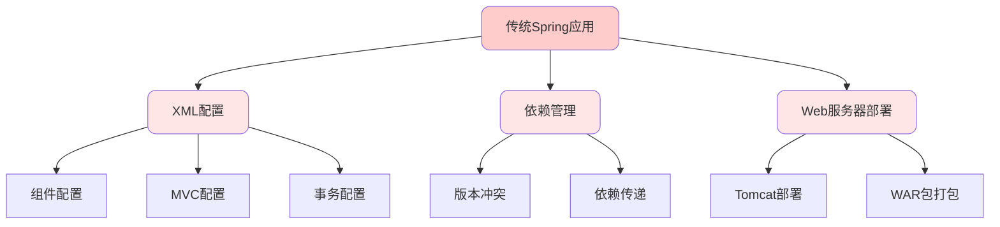
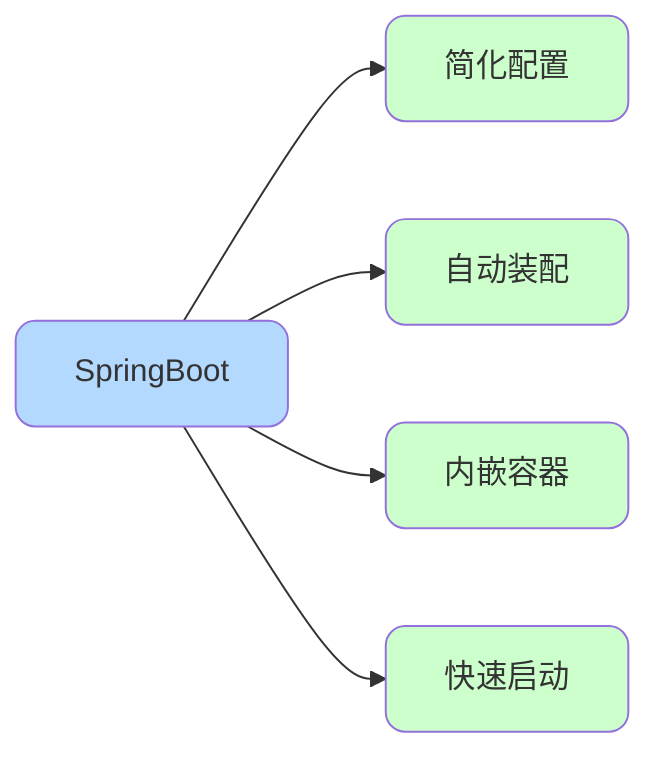
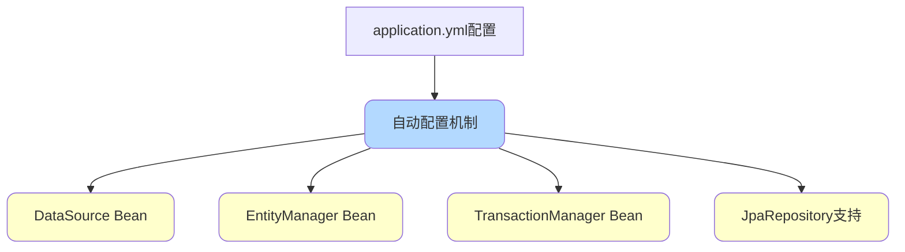
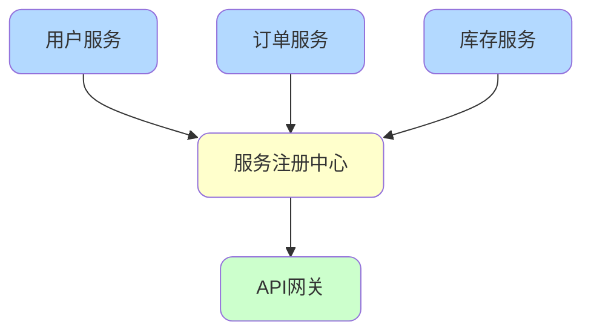
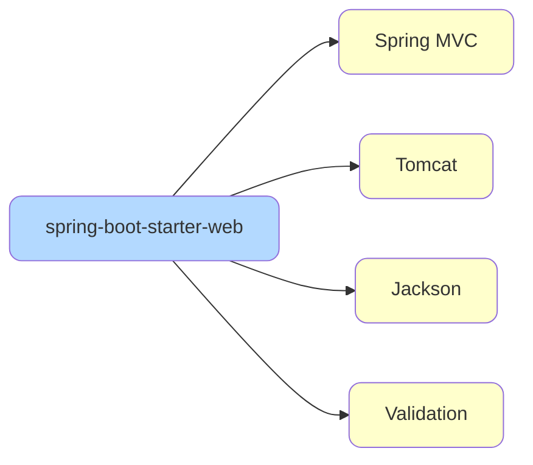
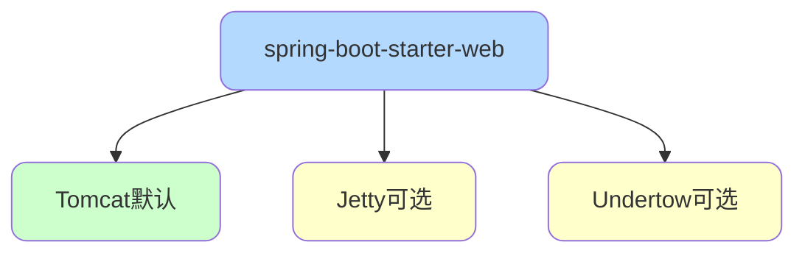
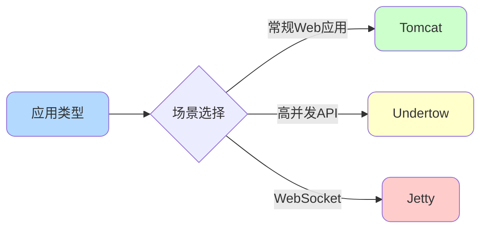

# SpringBoot核心特性与设计理念

## SpringBoot的诞生背景

### Spring框架的局限性

Spring作为一款强大的企业级Java开发框架,在推动Java发展方面功不可没。它通过**依赖注入(DI)**和**面向切面编程(AOP)**两大核心特性,用普通的Java对象(POJO)实现了过去只有EJB才能提供的复杂功能,成为了重量级EJB框架的轻量级替代方案。

尽管Spring的组件设计轻量,但在配置方面存在明显的"重量级"问题:

- **Spring 2.5之前**:大量依赖XML配置文件,每个Bean都需要手动配置
- **Spring 2.5**:引入基于注解的组件扫描,减少了部分配置
- **Spring 3.0**:推出JavaConfig,提供类型安全的配置方式

但即便如此,开发者仍需要进行大量配置工作:

```java
// 传统Spring需要手动配置事务管理
@Configuration
@EnableTransactionManagement
public class TransactionConfig {
    @Bean
    public PlatformTransactionManager transactionManager(DataSource dataSource) {
        return new DataSourceTransactionManager(dataSource);
    }
}

// 需要配置Web MVC
@Configuration
@EnableWebMvc
public class WebConfig implements WebMvcConfigurer {
    // 大量配置代码...
}

// 需要配置数据源
@Bean
public DataSource dataSource() {
    HikariDataSource dataSource = new HikariDataSource();
    dataSource.setDriverClassName("com.mysql.cj.jdbc.Driver");
    dataSource.setJdbcUrl("jdbc:mysql://localhost:3306/demo");
    // 更多配置...
}
```

此外,依赖管理也是一大痛点:不同库之间的版本冲突问题消耗了开发者大量精力。



### SpringBoot的设计目标

SpringBoot的核心目标是通过**简化配置**、**优化依赖管理**、**加速启动与部署**,让开发者能够专注于业务逻辑实现,而不是繁琐的环境搭建和配置工作。



## SpringBoot的核心优势

### 极大提升开发效率

SpringBoot通过自动配置、起步依赖(Starters)和开箱即用的功能,显著减少了项目初始化和配置编写的工作量:

```java
// SpringBoot应用只需一个注解即可启动
@SpringBootApplication
public class ShopApplication {
    public static void main(String[] args) {
        SpringApplication.run(ShopApplication.class, args);
    }
}
```

### 强大的自动配置能力

遵循"**约定优于配置**"的原则,SpringBoot能够根据项目依赖自动配置常见组件,同时允许开发者灵活覆盖默认配置:

```yaml
# 简单配置即可启用数据源
spring:
  datasource:
    url: jdbc:mysql://localhost:3306/shop_db
    username: admin
    password: secret
  jpa:
    hibernate:
      ddl-auto: update
```

SpringBoot会自动配置:
- 数据源连接池(HikariCP)
- JPA实体管理器
- 事务管理器
- Repository扫描



### 无缝集成Spring生态

作为Spring家族成员,SpringBoot能够方便地整合Spring Data、Spring Security、Spring Batch等模块:

```xml
<!-- 只需添加一个Starter即可集成Spring Security -->
<dependency>
    <groupId>org.springframework.boot</groupId>
    <artifactId>spring-boot-starter-security</artifactId>
</dependency>
```

### 内嵌Web服务器支持

SpringBoot自带内嵌HTTP服务器(Tomcat、Jetty、Undertow),可以像运行普通Java程序一样启动Web应用:

```bash
# 直接运行JAR文件
java -jar shop-service.jar
```

无需部署到外部Tomcat服务器,极大简化了开发和测试流程。

### 适合微服务架构

每个微服务都可以独立运行和部署,SpringBoot成为构建微服务架构的理想选择:



### 构建工具集成

为Maven和Gradle提供了专门插件,简化打包、运行、测试等任务:

```xml
<build>
    <plugins>
        <plugin>
            <groupId>org.springframework.boot</groupId>
            <artifactId>spring-boot-maven-plugin</artifactId>
        </plugin>
    </plugins>
</build>
```

### 生产级监控功能

通过Spring Boot Actuator模块,轻松添加应用监控和管理端点:

```xml
<dependency>
    <groupId>org.springframework.boot</groupId>
    <artifactId>spring-boot-starter-actuator</artifactId>
</dependency>
```

访问`/actuator/health`即可查看应用健康状态。

## SpringBoot Starters详解

### Starter的设计理念

SpringBoot Starters是一组便捷的**依赖描述符**,预先打包了常用的库和配置。通过添加一个Starter依赖,即可自动引入所有必要的库,无需手动逐一添加。



### 核心Starter列表

**基础类**:

```xml
<!-- 核心Starter,包含Spring框架和日志 -->
<dependency>
    <groupId>org.springframework.boot</groupId>
    <artifactId>spring-boot-starter</artifactId>
</dependency>
```

**Web开发类**:

```xml
<!-- Web应用开发,包含MVC和Tomcat -->
<dependency>
    <groupId>org.springframework.boot</groupId>
    <artifactId>spring-boot-starter-web</artifactId>
</dependency>
```

**数据访问类**:

```xml
<!-- JPA数据访问 -->
<dependency>
    <groupId>org.springframework.boot</groupId>
    <artifactId>spring-boot-starter-data-jpa</artifactId>
</dependency>

<!-- Redis数据访问 -->
<dependency>
    <groupId>org.springframework.boot</groupId>
    <artifactId>spring-boot-starter-data-redis</artifactId>
</dependency>
```

**安全与测试类**:

```xml
<!-- Spring Security安全框架 -->
<dependency>
    <groupId>org.springframework.boot</groupId>
    <artifactId>spring-boot-starter-security</artifactId>
</dependency>

<!-- 测试支持 -->
<dependency>
    <groupId>org.springframework.boot</groupId>
    <artifactId>spring-boot-starter-test</artifactId>
    <scope>test</scope>
</dependency>
```

**其他功能类**:

```xml
<!-- AOP支持 -->
<dependency>
    <groupId>org.springframework.boot</groupId>
    <artifactId>spring-boot-starter-aop</artifactId>
</dependency>

<!-- 参数校验 -->
<dependency>
    <groupId>org.springframework.boot</groupId>
    <artifactId>spring-boot-starter-validation</artifactId>
</dependency>

<!-- 应用监控 -->
<dependency>
    <groupId>org.springframework.boot</groupId>
    <artifactId>spring-boot-starter-actuator</artifactId>
</dependency>
```

### Starter的实际价值

**传统方式的繁琐**:

```xml
<!-- 开发RESTful服务需要手动添加多个依赖 -->
<dependency>
    <groupId>org.springframework</groupId>
    <artifactId>spring-webmvc</artifactId>
    <version>5.3.10</version>
</dependency>
<dependency>
    <groupId>org.apache.tomcat.embed</groupId>
    <artifactId>tomcat-embed-core</artifactId>
    <version>9.0.50</version>
</dependency>
<dependency>
    <groupId>com.fasterxml.jackson.core</groupId>
    <artifactId>jackson-databind</artifactId>
    <version>2.12.5</version>
</dependency>
<!-- 还有更多... -->
```

**使用Starter的简洁**:

```xml
<!-- 一个依赖搞定所有 -->
<dependency>
    <groupId>org.springframework.boot</groupId>
    <artifactId>spring-boot-starter-web</artifactId>
</dependency>
```

这种设计显著提升了开发效率,减少了版本冲突风险。

## 内嵌Servlet容器

### 支持的容器类型

SpringBoot提供三种内嵌Web容器:



默认使用**Tomcat**,也可切换到Jetty或Undertow。

### 切换容器的方法

**切换到Jetty**:

```xml
<dependency>
    <groupId>org.springframework.boot</groupId>
    <artifactId>spring-boot-starter-web</artifactId>
    <exclusions>
        <exclusion>
            <groupId>org.springframework.boot</groupId>
            <artifactId>spring-boot-starter-tomcat</artifactId>
        </exclusion>
    </exclusions>
</dependency>
<dependency>
    <groupId>org.springframework.boot</groupId>
    <artifactId>spring-boot-starter-jetty</artifactId>
</dependency>
```

**切换到Undertow**:

```xml
<dependency>
    <groupId>org.springframework.boot</groupId>
    <artifactId>spring-boot-starter-web</artifactId>
    <exclusions>
        <exclusion>
            <groupId>org.springframework.boot</groupId>
            <artifactId>spring-boot-starter-tomcat</artifactId>
        </exclusion>
    </exclusions>
</dependency>
<dependency>
    <groupId>org.springframework.boot</groupId>
    <artifactId>spring-boot-starter-undertow</artifactId>
</dependency>
```

### 容器选型建议

**Tomcat - 通用首选**:

- 适用场景:大多数Web应用和RESTful服务
- 优点:稳定成熟、社区活跃、配置简单
- 缺点:高并发下性能不如Undertow

**Undertow - 高性能场景**:

- 适用场景:高并发API服务、大流量应用
- 优点:极低的启动时间和资源占用、支持非阻塞IO
- 缺点:社区相对较小

**Jetty - 长连接场景**:

- 适用场景:WebSocket应用、即时通讯系统
- 优点:擅长处理长连接、内存占用优于Tomcat
- 缺点:极端高并发略逊于Undertow



### 版本兼容性说明

**重要变更**:SpringBoot 4.0完全移除了对Undertow的内嵌支持,原因是SpringBoot 4.0要求Servlet 6.1,而Undertow尚未兼容该版本。

## 日志框架配置

### 默认日志方案

SpringBoot默认使用**SLF4J**作为日志门面,搭配**Logback**作为日志实现:

```java
import org.slf4j.Logger;
import org.slf4j.LoggerFactory;

@Service
public class OrderService {
    private static final Logger logger = LoggerFactory.getLogger(OrderService.class);
    
    public void createOrder(Long orderId) {
        logger.info("开始创建订单,订单ID:{}", orderId);
        // 业务逻辑
        logger.debug("订单详情:{}", orderDetails);
    }
}
```

### 日志级别配置

```yaml
logging:
  level:
    root: INFO
    com.shop.service: DEBUG
    org.springframework.web: WARN
  file:
    name: logs/shop-service.log
  pattern:
    console: "%d{yyyy-MM-dd HH:mm:ss} - %msg%n"
```

## 配置文件管理

### 支持的文件格式

SpringBoot支持两种主流配置格式:

**application.properties**:

```properties
server.port=8080
spring.datasource.url=jdbc:mysql://localhost:3306/shop_db
spring.datasource.username=root
```

**application.yml** (推荐):

```yaml
server:
  port: 8080
spring:
  datasource:
    url: jdbc:mysql://localhost:3306/shop_db
    username: root
```

YAML格式层级清晰,避免了重复前缀,更易于阅读。

### 配置优先级

如果两种格式同时存在,**application.properties优先级更高**,会覆盖yml中的相同配置。建议只使用一种格式。

### 读取配置的方法

**使用@Value注解**:

```java
@Component
public class PaymentConfig {
    @Value("${payment.timeout:5000}")
    private int timeout;
}
```

**使用@ConfigurationProperties**:

```java
@Component
@ConfigurationProperties(prefix = "payment")
public class PaymentProperties {
    private int timeout;
    private String gateway;
    private List<String> supportedMethods;
    // getters and setters
}
```

**加载自定义配置文件**:

```java
@Component
@PropertySource("classpath:custom.properties")
public class CustomConfig {
    @Value("${custom.property}")
    private String customProperty;
}
```

## 核心注解解析

### @SpringBootApplication

这是SpringBoot的核心注解,是三个注解的组合:

```java
@SpringBootConfiguration  // 标识配置类
@EnableAutoConfiguration  // 启用自动配置
@ComponentScan           // 组件扫描
public @interface SpringBootApplication {
    // ...
}
```

**作用等价于**:

```java
@Configuration
@EnableAutoConfiguration
@ComponentScan
public class ShopApplication {
    // ...
}
```

### 常用Web开发注解

**控制层注解**:

```java
@RestController  // @Controller + @ResponseBody
@RequestMapping("/api/products")
public class ProductController {
    
    @GetMapping("/{id}")
    public Product getProduct(@PathVariable Long id) {
        return productService.findById(id);
    }
    
    @PostMapping
    public Product createProduct(@RequestBody @Valid ProductDTO dto) {
        return productService.create(dto);
    }
}
```

**依赖注入注解**:

```java
@Service
public class ProductService {
    @Autowired
    private ProductRepository repository;
}
```

**参数校验注解**:

```java
public class ProductDTO {
    @NotBlank(message = "商品名称不能为空")
    private String name;
    
    @Min(value = 0, message = "价格不能为负")
    private BigDecimal price;
}
```
