# SpringBoot3与Spring6新特性

## 版本演进的里程碑

### 新一代框架的开端

2022年,Spring团队相继推出了Spring Framework 6.0和SpringBoot 3.0,官方将这次升级称为**新一代框架的开始**,是Spring下一个10年的新起点。

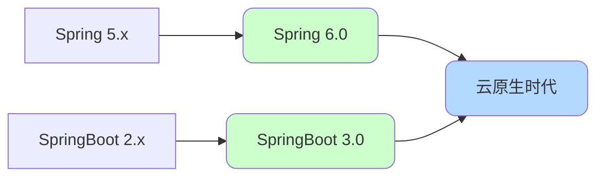

### 核心更新内容

官方文档列出的主要更新:

- **A Java 17 baseline** - 基线升级到JDK 17
- **Support for Jakarta EE 10 with an EE 9 baseline** - 支持Jakarta EE 10
- **Support for generating native images with GraalVM** - 支持GraalVM原生镜像
- **Ahead-Of-Time transformations and AOT processing** - AOT编译支持

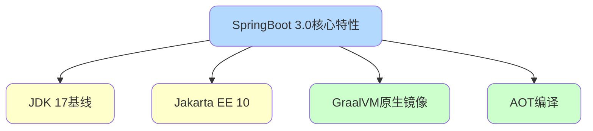

## JDK 17基线要求

### 版本跳跃

SpringBoot 3.0和Spring 6.0要求**最低JDK版本为17**,这是一个重大的基线升级。

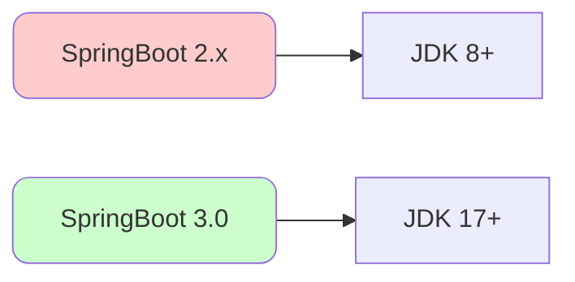

### JDK 17的新特性

**文本块(Text Blocks)**:

```java
// JDK 17
String json = """
    {
        "orderId": "123456",
        "amount": 99.99,
        "status": "PAID"
    }
    """;

// 传统方式
String json = "{\n" +
    "    \"orderId\": \"123456\",\n" +
    "    \"amount\": 99.99,\n" +
    "    \"status\": \"PAID\"\n" +
    "}";
```

**记录类(Records)**:

```java
// JDK 17
public record OrderDTO(Long orderId, String customerName, BigDecimal amount) {
    // 自动生成构造器、getter、equals、hashCode、toString
}

// 使用
OrderDTO order = new OrderDTO(123L, "张三", new BigDecimal("99.99"));
System.out.println(order.orderId());  // 123

// 传统方式需要手写大量模板代码
public class OrderDTO {
    private Long orderId;
    private String customerName;
    private BigDecimal amount;
    
    // 构造器、getter、setter、equals、hashCode、toString...
}
```

**模式匹配的instanceof**:

```java
// JDK 17
if (obj instanceof String str) {
    // 直接使用str,无需强转
    System.out.println(str.toUpperCase());
}

// 传统方式
if (obj instanceof String) {
    String str = (String) obj;
    System.out.println(str.toUpperCase());
}
```

**密封类(Sealed Classes)**:

```java
// 限制子类范围
public sealed interface Payment permits CreditCardPayment, AlipayPayment, WechatPayment {
    void process();
}

public final class CreditCardPayment implements Payment {
    @Override
    public void process() {
        // 信用卡支付逻辑
    }
}

public final class AlipayPayment implements Payment {
    @Override
    public void process() {
        // 支付宝支付逻辑
    }
}
```

### 为什么强制升级

虽然JDK 8仍是使用最多的版本,但Spring彻底抛弃了17之前的所有版本,主要原因:

1. **长期支持(LTS)版本**:JDK 17是LTS版本,有长期维护
2. **性能提升**:GC性能、编译优化等方面有显著提升
3. **新特性支持**:Records、Sealed Classes等简化开发
4. **云原生需求**:GraalVM对新版JDK支持更好

## Jakarta EE迁移

### 从JavaEE到Jakarta EE

SpringBoot 3.0底层依赖从**JavaEE(J2EE)**迁移到**Jakarta EE 9**。

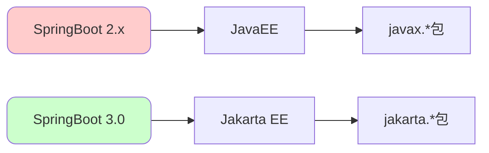

### 包名变更影响

**迁移前(SpringBoot 2.x)**:

```java
import javax.servlet.http.HttpServletRequest;
import javax.persistence.Entity;
import javax.validation.constraints.NotNull;
```

**迁移后(SpringBoot 3.0)**:

```java
import jakarta.servlet.http.HttpServletRequest;
import jakarta.persistence.Entity;
import jakarta.validation.constraints.NotNull;
```

**主要影响的包**:

| 原包名 | 新包名 | 影响范围 |
|--------|--------|----------|
| javax.servlet.* | jakarta.servlet.* | Web开发 |
| javax.persistence.* | jakarta.persistence.* | JPA |
| javax.validation.* | jakarta.validation.* | 参数校验 |
| javax.transaction.* | jakarta.transaction.* | 事务管理 |

### 升级迁移工作

**方式一:手动替换**

使用IDE的全局替换功能:

```
查找: import javax.
替换: import jakarta.
```

**方式二:OpenRewrite工具**

```xml
<plugin>
    <groupId>org.openrewrite.maven</groupId>
    <artifactId>rewrite-maven-plugin</artifactId>
    <version>5.3.0</version>
    <configuration>
        <activeRecipes>
            <recipe>org.openrewrite.java.spring.boot3.UpgradeSpringBoot_3_0</recipe>
        </activeRecipes>
    </configuration>
</plugin>
```

```bash
mvn rewrite:run
```

## AOT编译技术

### JIT vs AOT

**JIT(Just-In-Time)即时编译**:

- 程序运行时动态编译
- 首次启动慢,预热后性能好
- 占用内存大

**AOT(Ahead-Of-Time)预先编译**:

- 编译期提前编译
- 启动快速
- 内存占用小

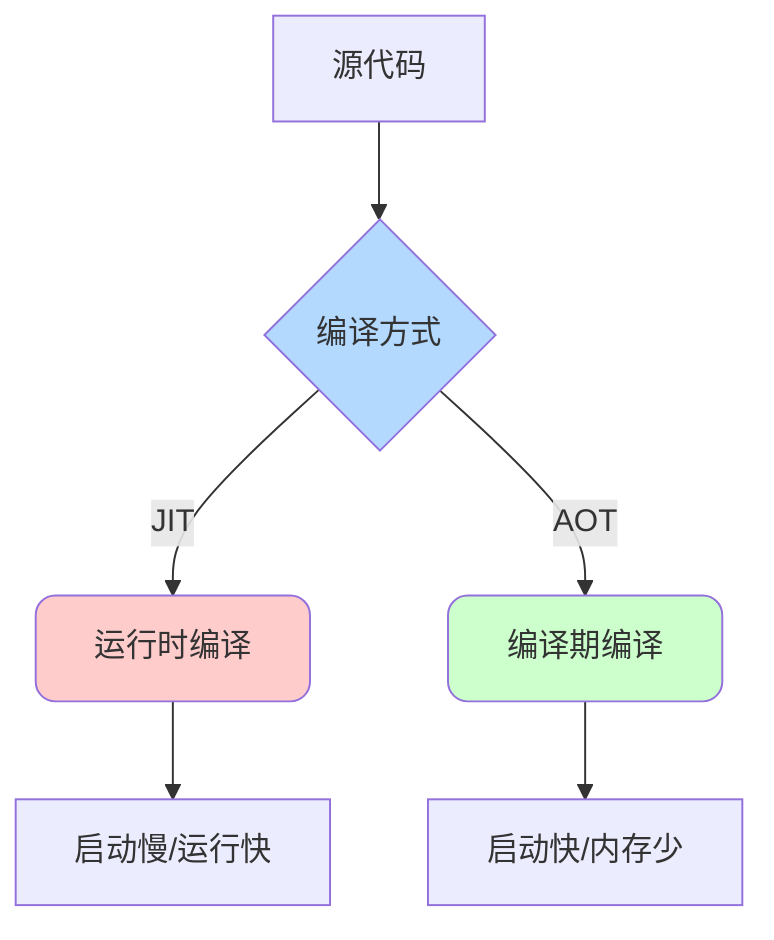

### AOT在SpringBoot中的应用

**传统JIT问题**:

- Spring容器启动慢(扫描、反射、代理)
- 内存占用多
- 首次请求响应慢(懒加载)

**AOT优化**:

- 编译期完成类扫描
- 编译期生成代理类
- 编译期完成配置解析

```java
// 启用AOT处理
@SpringBootApplication
public class OrderServiceApplication {
    public static void main(String[] args) {
        SpringApplication.run(OrderServiceApplication.class, args);
    }
}
```

**构建AOT优化的应用**:

```bash
# Maven
mvn spring-boot:process-aot

# Gradle
gradle processAot
```

### AOT处理流程

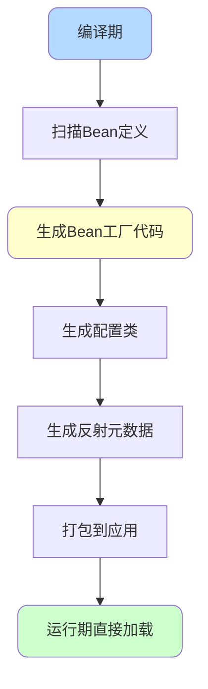

## Spring Native原生镜像

### 什么是Spring Native

Spring Native允许将Spring应用编译成**GraalVM原生镜像**,无需JVM即可运行。

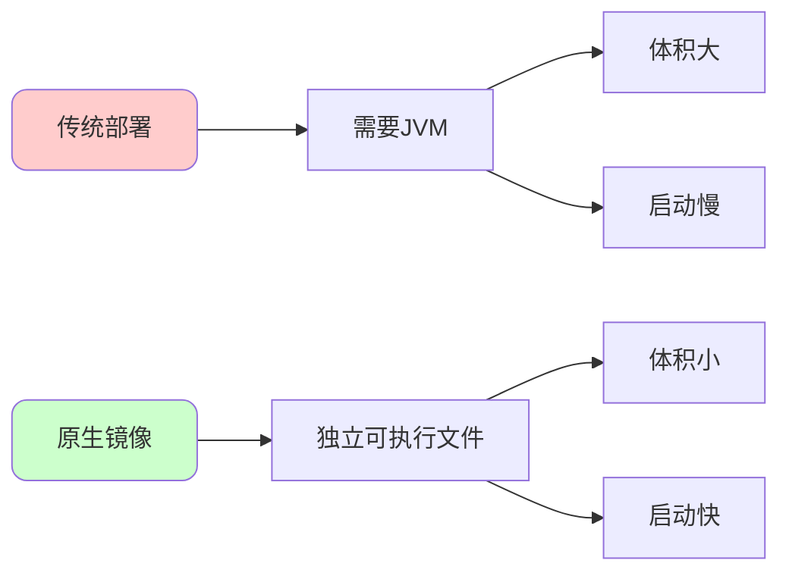

### 原生镜像的优势

**启动速度对比**:

| 部署方式 | 启动时间 | 内存占用 | 镜像大小 |
|---------|----------|----------|----------|
| 传统JVM | 3-5秒 | 300-500MB | 150MB+ |
| 原生镜像 | 0.05-0.2秒 | 50-100MB | 50MB |

**性能提升**:

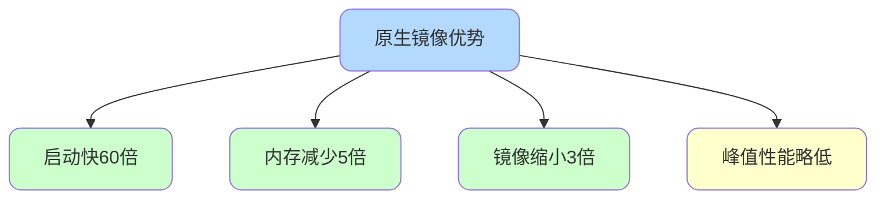

### 构建原生镜像

**添加插件**:

```xml
<plugin>
    <groupId>org.graalvm.buildtools</groupId>
    <artifactId>native-maven-plugin</artifactId>
</plugin>
```

**构建命令**:

```bash
# 安装GraalVM
sdk install java 22.3.r17-grl

# 构建原生镜像
mvn -Pnative native:compile

# 运行
./target/order-service
```

**Docker构建**:

```dockerfile
FROM ghcr.io/graalvm/graalvm-ce:ol8-java17 as builder

WORKDIR /app
COPY . .
RUN ./mvnw -Pnative native:compile

FROM scratch
COPY --from=builder /app/target/order-service /order-service
ENTRYPOINT ["/order-service"]
```

### 适用场景

**适合原生镜像**:

- Serverless函数
- 微服务
- CLI工具
- 容器化应用

**不适合原生镜像**:

- 大量使用反射的应用
- 动态类加载
- 依赖大量第三方库(可能不兼容)

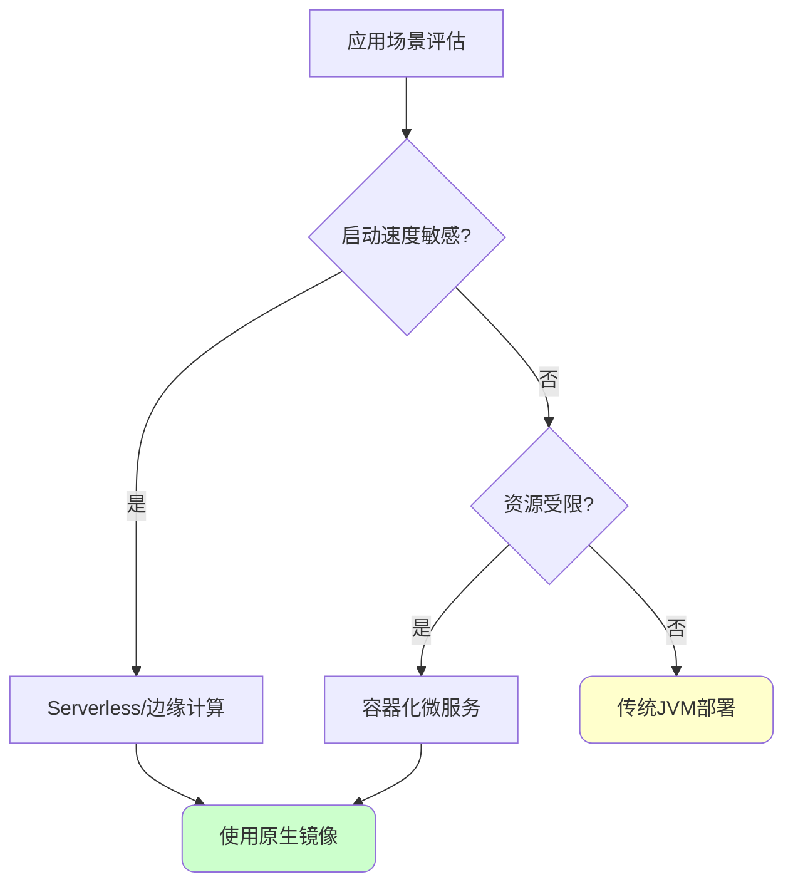

## 云原生架构支持

### 为什么要云原生

**云原生的核心要求**:

- 快速启动
- 弹性伸缩
- 低资源占用
- 容器化部署

**传统JVM的问题**:

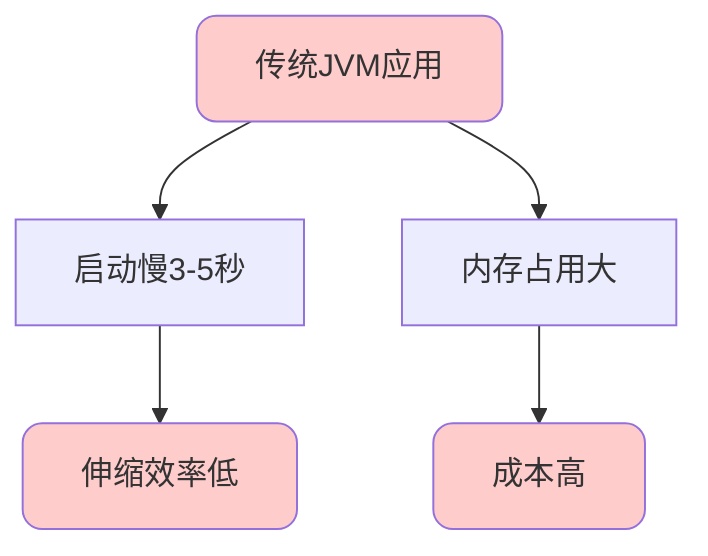

### SpringBoot 3.0的云原生优化

**AOT+原生镜像**:

- 启动时间从秒级到毫秒级
- 内存占用降低5倍
- 适配Serverless场景

**Kubernetes原生支持**:

```yaml
apiVersion: apps/v1
kind: Deployment
metadata:
  name: order-service
spec:
  replicas: 3
  template:
    spec:
      containers:
      - name: app
        image: order-service:native
        resources:
          requests:
            memory: "64Mi"  # 原生镜像仅需64MB
            cpu: "100m"
          limits:
            memory: "128Mi"
            cpu: "500m"
```

### 性能对比实测

**测试场景**:简单REST API服务

| 指标 | JVM模式 | 原生镜像模式 | 提升比例 |
|------|---------|-------------|----------|
| 启动时间 | 3.2秒 | 0.08秒 | 40倍 |
| 首次请求 | 120ms | 15ms | 8倍 |
| 内存占用 | 350MB | 70MB | 5倍 |
| 镜像大小 | 180MB | 55MB | 3.3倍 |

## 其他重要更新

### 观察性增强

**集成Micrometer**:

```java
@RestController
public class OrderController {
    
    private final ObservationRegistry registry;
    
    @GetMapping("/orders/{id}")
    public Order getOrder(@PathVariable Long id) {
        return Observation
            .createNotStarted("order.get", registry)
            .observe(() -> orderService.findById(id));
    }
}
```

**自动导出指标**:

```yaml
management:
  observations:
    key-values:
      application: order-service
  tracing:
    sampling:
      probability: 1.0
```

### HTTP客户端升级

**使用HTTP Interface**:

```java
public interface PaymentClient {
    
    @GetExchange("/api/payments/{id}")
    Payment getPayment(@PathVariable Long id);
    
    @PostExchange("/api/payments")
    Payment createPayment(@RequestBody PaymentRequest request);
}

// 使用
@Configuration
public class ClientConfig {
    
    @Bean
    public PaymentClient paymentClient() {
        WebClient webClient = WebClient.builder()
            .baseUrl("http://payment-service")
            .build();
        
        HttpServiceProxyFactory factory = HttpServiceProxyFactory
            .builder(WebClientAdapter.forClient(webClient))
            .build();
        
        return factory.createClient(PaymentClient.class);
    }
}
```

### 虚拟线程支持(JDK 21)

```java
@Configuration
public class AsyncConfig {
    
    @Bean
    public AsyncTaskExecutor applicationTaskExecutor() {
        TaskExecutorAdapter adapter = new TaskExecutorAdapter(
            Executors.newVirtualThreadPerTaskExecutor()
        );
        adapter.setTaskDecorator(new ContextCopyingDecorator());
        return adapter;
    }
}
```

## 升级迁移指南

### 升级检查清单

**1. JDK版本**:

```bash
# 检查JDK版本
java -version
# 确保是17或更高版本
```

**2. 依赖更新**:

```xml
<parent>
    <groupId>org.springframework.boot</groupId>
    <artifactId>spring-boot-starter-parent</artifactId>
    <version>3.0.0</version>
</parent>
```

**3. 包名替换**:

```bash
# 全局替换
javax. -> jakarta.
```

**4. 移除过时配置**:

```yaml
# 移除
spring:
  autoconfigure:
    exclude:
      - org.springframework.boot.autoconfigure.jdbc.DataSourceAutoConfiguration

# 改为
spring:
  autoconfigure:
    exclude: org.springframework.boot.autoconfigure.jdbc.DataSourceAutoConfiguration
```

### 常见问题

**问题1:依赖冲突**

```
Caused by: java.lang.NoClassDefFoundError: javax/servlet/Filter
```

解决:更新所有依赖到兼容版本

**问题2:反射配置**

原生镜像需要手动配置反射:

```json
[
  {
    "name": "com.company.order.entity.Order",
    "allDeclaredFields": true,
    "allDeclaredMethods": true,
    "allDeclaredConstructors": true
  }
]
```

## 总结

SpringBoot 3.0和Spring 6.0带来的核心变化:

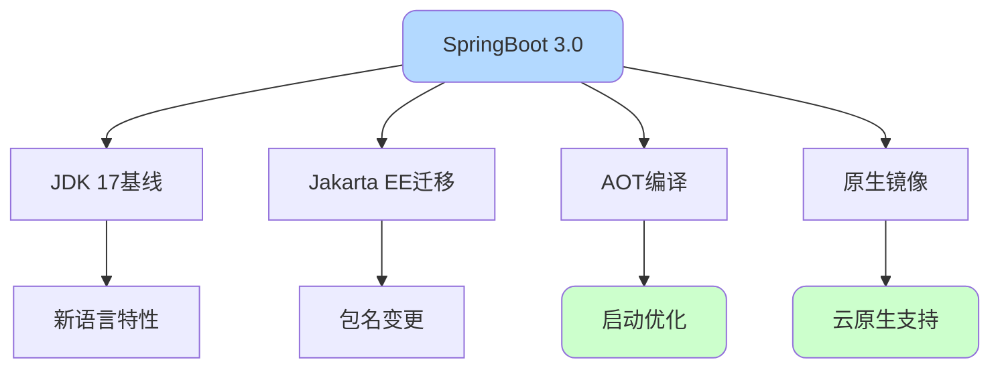

这次升级为Spring开启了云原生时代的新篇章,是下一个10年的技术基石。
