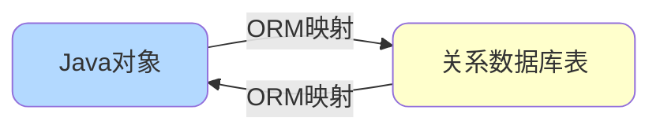
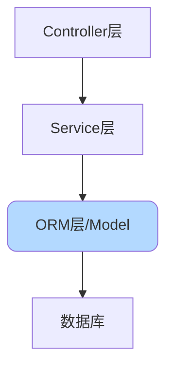
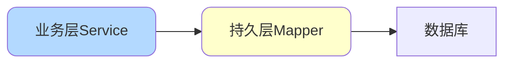
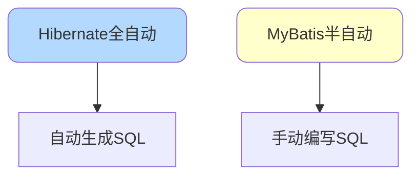
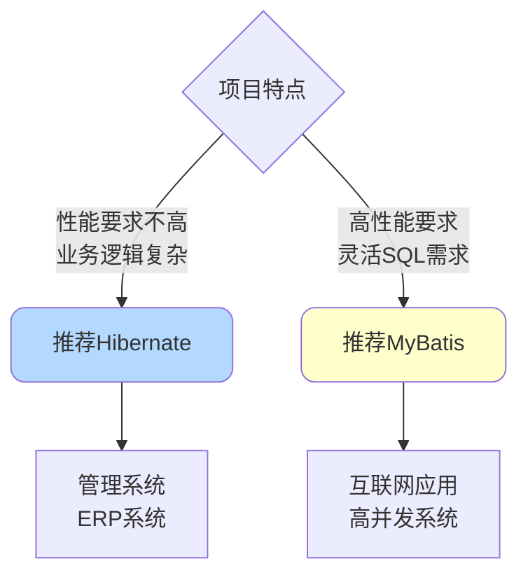

# MyBatis基础与核心概念

## ORM框架概述

### 什么是ORM

ORM（Object Relational Mapping，对象关系映射）是一种编程技术，用于在面向对象编程语言中实现对象模型与关系型数据库之间的数据转换。



### ORM的核心优势

**1. 开发效率提升**

数据模型统一定义和管理，便于代码维护和复用：

```java
// 不使用ORM - 需要手动编写大量代码
public Product getProductById(Long id) {
    Connection conn = null;
    PreparedStatement stmt = null;
    ResultSet rs = null;
    try {
        conn = dataSource.getConnection();
        String sql = "SELECT id, name, price, stock FROM product WHERE id = ?";
        stmt = conn.prepareStatement(sql);
        stmt.setLong(1, id);
        rs = stmt.executeQuery();
        if (rs.next()) {
            Product product = new Product();
            product.setId(rs.getLong("id"));
            product.setName(rs.getString("name"));
            product.setPrice(rs.getBigDecimal("price"));
            product.setStock(rs.getInt("stock"));
            return product;
        }
    } catch (SQLException e) {
        e.printStackTrace();
    } finally {
        // 关闭资源
    }
    return null;
}

// 使用ORM - 简洁明了
@Select("SELECT * FROM product WHERE id = #{id}")
Product getProductById(@Param("id") Long id);
```

**2. 功能自动化**

ORM框架自动处理诸多常见操作：

- 数据验证与消毒：通过参数化查询防止SQL注入
- 事务管理：自动处理事务的提交与回滚
- 连接池管理：高效管理数据库连接资源

**3. 架构规范化**

ORM天然契合MVC架构模式，促使开发者编写结构清晰的代码：



### ORM的局限性

**1. 学习成本**

需要投入时间学习ORM框架的配置和使用方法。

**2. 复杂查询支持受限**

对于复杂的多表关联查询或特殊的SQL优化需求，ORM可能力不从心，性能不如原生SQL。

**3. 数据库操作透明度降低**

ORM抽象了底层数据库操作，开发者难以精确控制SQL执行细节和进行特殊优化。

### 常见ORM框架

Java生态中主流的ORM框架包括：

- **Hibernate**：功能全面的全自动ORM框架
- **MyBatis**：灵活可控的半自动ORM框架
- **JPA**：Java持久化API标准规范

## MyBatis框架介绍

### MyBatis核心优势

通过对比原生JDBC和MyBatis的代码，可以直观感受MyBatis的优势：

**原生JDBC方式**：

```java
public void queryOrdersByJdbc() {
    String dbUrl = "jdbc:mysql://localhost:3306/shop";
    try(Connection conn = DriverManager.getConnection(dbUrl, "root", "password")){
        Class.forName("com.mysql.cj.jdbc.Driver");
        
        Long customerId = 1001L;
        String startDate = "2024.01.01";
        String sql = "SELECT order_id, customer_id, order_amount, create_time " +
                     "FROM orders WHERE customer_id = " + customerId + 
                     " AND create_time > '" + startDate + "'";
        
        Statement stmt = conn.createStatement();
        ResultSet rs = stmt.executeQuery(sql);
        List<Order> orders = new ArrayList<>();
        
        while (rs.next()) {
            Order order = new Order();
            order.setOrderId(rs.getLong("order_id"));
            order.setCustomerId(rs.getLong("customer_id"));
            order.setOrderAmount(rs.getBigDecimal("order_amount"));
            order.setCreateTime(rs.getTimestamp("create_time"));
            orders.add(order);
        }
        
        System.out.println("执行SQL: " + sql);
        orders.forEach(System.out::println);
    } catch (Exception e) {
        e.printStackTrace();
    }
}
```

**MyBatis方式**：

```java
public void queryOrdersByMyBatis() throws IOException {
    String configFile = "mybatis-config.xml";
    InputStream inputStream = Resources.getResourceAsStream(configFile);
    SqlSessionFactory factory = new SqlSessionFactoryBuilder().build(inputStream);
    
    try(SqlSession session = factory.openSession()) {
        OrderMapper mapper = session.getMapper(OrderMapper.class);
        List<Order> orders = mapper.findByCustomerAndDate(1001L, "2024-01-01");
        orders.forEach(System.out::println);
    }
}

// Mapper接口定义
interface OrderMapper {
    @Select("SELECT order_id, customer_id, order_amount, create_time " +
            "FROM orders WHERE customer_id = #{customerId} " +
            "AND create_time > #{startDate}")
    List<Order> findByCustomerAndDate(@Param("customerId") Long customerId, 
                                      @Param("startDate") String startDate);
}
```

### MyBatis的六大优势

**1. 业务解耦**

将数据库操作逻辑与业务逻辑分离，开发者专注于业务实现。



**2. 简化数据库操作**

只需编写SQL语句，无需关注连接管理、资源释放等底层细节，Connection和Statement由框架统一管理。

**3. 自动对象映射**

根据配置自动完成数据库字段到Java对象的映射转换：

```xml
<resultMap id="orderResultMap" type="Order">
    <id column="order_id" property="orderId"/>
    <result column="customer_id" property="customerId"/>
    <result column="order_amount" property="orderAmount"/>
    <result column="create_time" property="createTime"/>
</resultMap>
```

**4. 多数据源支持**

支持多种数据源类型和第三方连接池：

- 内置数据源：POOLED、UNPOOLED、JNDI
- 第三方连接池：HikariCP、Druid、C3P0等

**5. 动态SQL能力**

通过标签实现SQL的动态拼接，显著减少代码量：

```xml
<select id="findProducts" resultType="Product">
    SELECT * FROM product
    <where>
        <if test="name != null">
            AND name LIKE CONCAT('%', #{name}, '%')
        </if>
        <if test="minPrice != null">
            AND price >= #{minPrice}
        </if>
    </where>
</select>
```

**6. 多层缓存机制**

支持事务级一级缓存（默认开启）、应用级二级缓存和自定义缓存：

- **一级缓存**：SqlSession生命周期内有效
- **二级缓存**：基于namespace，可跨SqlSession共享（需谨慎使用）

## MyBatis与Hibernate对比

### 自动化程度差异

这是两者最核心的区别：

**Hibernate - 全自动ORM**

```java
// 只需定义实体映射关系
@Entity
@Table(name = "product")
public class Product {
    @Id
    private Long id;
    private String name;
    private BigDecimal price;
}

// 框架自动生成并执行SQL
Product product = session.get(Product.class, 1L);
```

开发者无需编写SQL，Hibernate根据对象关系模型自动生成和执行SQL语句。

**MyBatis - 半自动ORM**

```xml
<!-- 需要手动编写SQL -->
<select id="getProductById" resultType="Product">
    SELECT id, name, price FROM product WHERE id = #{id}
</select>
```

SQL由开发者自行编写，MyBatis负责参数映射和结果转换。



### SQL可控性对比

**MyBatis的优势**

由于需要手动编写SQL，带来了灵活性：

- 可自由优化SQL性能
- 支持复杂的多表JOIN查询
- 便于特定数据库的SQL调优

```java
// MyBatis可以精确控制SQL
@Select("SELECT p.*, c.name as category_name " +
        "FROM product p " +
        "LEFT JOIN category c ON p.category_id = c.id " +
        "WHERE p.status = 1 " +
        "ORDER BY p.create_time DESC " +
        "LIMIT #{offset}, #{limit}")
List<ProductVO> findProducts(@Param("offset") int offset, 
                              @Param("limit") int limit);
```

**MyBatis的劣势**

- 需要针对不同数据库编写不同的SQL（数据库移植性较差）
- 初期开发工作量相对较大
- 需要开发者具备一定的SQL能力

### 缓存机制对比

**Hibernate的缓存优势**

Hibernate具有更完善的缓存体系，当二级缓存出现脏数据时会及时报错，数据一致性保障更强。

**MyBatis的缓存特点**

二级缓存需要开发者自行感知和处理脏数据问题，使用时需要更加谨慎。

### 适用场景建议



**选择Hibernate的场景**：

- 对性能要求不太苛刻的系统
- 企业管理系统、ERP等
- 团队SQL能力相对薄弱

**选择MyBatis的场景**：

- 对性能和响应速度要求高的系统
- 需要灵活SQL优化的场景
- 互联网高并发应用

### 总结

MyBatis是一个轻量、便捷、高效、直接的半自动化持久层框架，而Hibernate是一个功能强大、方便、高效但相对复杂的全自动化持久层框架。两者各有优势，应根据项目实际需求选择合适的框架。
