# MyBatis工作原理与核心组件

## 执行流程概述

任何框架的执行过程都可以分为启动阶段和运行阶段：

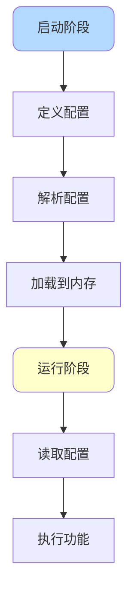

**启动阶段**：
1. 定义配置文件（XML或注解）
2. 解析配置文件
3. 将配置加载到内存

**运行阶段**：
1. 读取内存中的配置
2. 根据配置执行相应功能

## SQL执行完整流程

以下面的查询为例，了解MyBatis如何执行SQL：

```java
// 获取Mapper代理对象
ProductMapper productMapper = session.getMapper(ProductMapper.class);
// 执行查询
Product product = productMapper.findById(1001L);
```

### 代理对象生成机制

MyBatis通过JDK动态代理生成Mapper接口的代理实现类：

```java
public class MapperProxyFactory<T> {
    public T newInstance(SqlSession sqlSession) {
        // 创建MapperProxy实例，实现InvocationHandler接口
        final MapperProxy<T> mapperProxy = new MapperProxy<>(
            sqlSession, mapperInterface, methodCache);
        return newInstance(mapperProxy);
    }
    
    // 使用JDK动态代理生成代理对象
    protected T newInstance(MapperProxy<T> mapperProxy) {
        return (T) Proxy.newProxyInstance(
            mapperInterface.getClassLoader(), 
            new Class[] { mapperInterface }, 
            mapperProxy);
    }
}
```

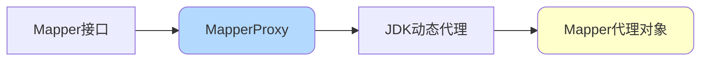

代理的核心逻辑在`MapperProxy`中实现，而具体的SQL执行则委托给`MapperMethod`完成。

`MapperMethod`在创建时会读取XML配置或方法注解信息，包括：
- SQL语句内容
- 方法参数信息
- 返回结果类型

### SQL命令执行分发

当调用代理对象的方法时，会进入`MapperMethod`的execute方法：

```java
public Object execute(SqlSession sqlSession, Object[] args) {
    Object result;
    // 根据SQL类型分发执行
    switch (command.getType()) {
        case INSERT: {
            Object param = method.convertArgsToSqlCommandParam(args);
            result = rowCountResult(sqlSession.insert(command.getName(), param));
            break;
        }
        case UPDATE: {
            Object param = method.convertArgsToSqlCommandParam(args);
            result = rowCountResult(sqlSession.update(command.getName(), param));
            break;
        }
        case DELETE: {
            Object param = method.convertArgsToSqlCommandParam(args);
            result = rowCountResult(sqlSession.delete(command.getName(), param));
            break;
        }
        case SELECT:
            if (method.returnsVoid() && method.hasResultHandler()) {
                executeWithResultHandler(sqlSession, args);
                result = null;
            } else if (method.returnsMany()) {
                result = executeForMany(sqlSession, args);
            } else if (method.returnsMap()) {
                result = executeForMap(sqlSession, args);
            } else if (method.returnsCursor()) {
                result = executeForCursor(sqlSession, args);
            } else {
                Object param = method.convertArgsToSqlCommandParam(args);
                result = sqlSession.selectOne(command.getName(), param);
            }
            break;
        case FLUSH:
            result = sqlSession.flushStatements();
            break;
        default:
            throw new BindingException("Unknown execution method");
    }
    return result;
}
```

这段代码解释了为什么MyBatis的INSERT、UPDATE、DELETE操作会返回影响的行数，业务代码中常通过`updateCount == 1`判断操作是否成功。

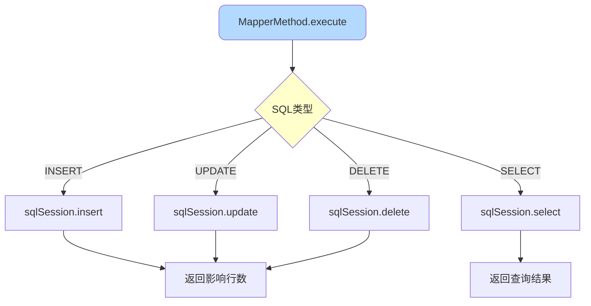

这个阶段主要完成两件事：
1. 通过`BoundSql`将方法参数转换为SQL需要的形式
2. 通过`SqlSession`执行对应的SQL操作

### 缓存处理机制

`SqlSession`是MyBatis对SQL执行的封装，真正的SQL处理由`Executor`执行器完成。

MyBatis默认使用`CachingExecutor`，它负责处理二级缓存：

```java
public <E> List<E> query(MappedStatement ms, Object parameterObject, 
                         RowBounds rowBounds, ResultHandler resultHandler, 
                         CacheKey key, BoundSql boundSql) throws SQLException {
    // 获取二级缓存
    Cache cache = ms.getCache();
    if (cache != null) {
        flushCacheIfRequired(ms);
        if (ms.isUseCache() && resultHandler == null) {
            ensureNoOutParams(ms, boundSql);
            // 从缓存获取数据
            List<E> list = (List<E>) tcm.getObject(cache, key);
            if (list == null) {
                // 缓存未命中，查询数据库
                list = delegate.query(ms, parameterObject, rowBounds, 
                                     resultHandler, key, boundSql);
                // 放入缓存
                tcm.putObject(cache, key, list);
            }
            return list;
        }
    }
    // 二级缓存为空，直接查询
    return delegate.query(ms, parameterObject, rowBounds, 
                         resultHandler, key, boundSql);
}
```

**二级缓存特点**：
- 与namespace绑定
- 多表操作可能产生脏数据
- 不同事务间可能引起脏读，需谨慎使用

如果二级缓存未命中，会进入`BaseExecutor`处理一级缓存。

**一级缓存实现**：
- 使用`PerpetualCache`，底层是简单的HashMap
- 与`SqlSession`生命周期绑定
- 在更新、事务提交或回滚时清空

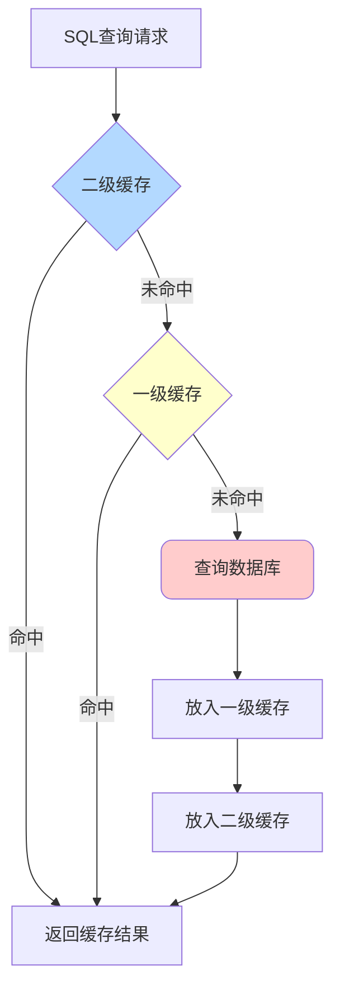

### 数据库连接获取

一级缓存未命中时，需要通过JDBC执行真实的SQL：

```java
private Statement prepareStatement(StatementHandler handler, 
                                   Log statementLog) throws SQLException {
    Statement stmt;
    // 从数据源获取连接
    Connection connection = getConnection(statementLog);
    // 准备Statement
    stmt = handler.prepare(connection, transaction.getTimeout());
    // 设置参数
    handler.parameterize(stmt);
    return stmt;
}
```

MyBatis通过数据源（DataSource）获取数据库连接，而非直接使用JDBC。

**支持的数据源类型**：
- 内置：JNDI、PooledDataSource、UnpooledDataSource
- 第三方：Druid、HikariCP、C3P0等

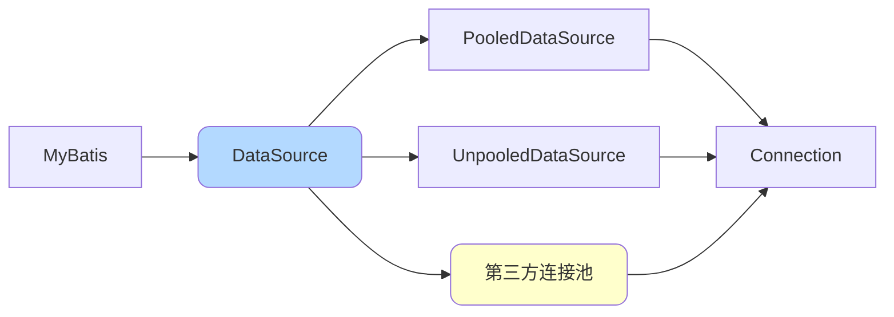

### SQL执行与结果处理

MyBatis使用`StatementHandler`专门处理与JDBC的交互：

```java
public <E> List<E> query(Statement statement, 
                        ResultHandler resultHandler) throws SQLException {
    // 1. 获取完整SQL
    String sql = boundSql.getSql();
    // 2. 执行SQL
    statement.execute(sql);
    // 3. 处理结果集
    return resultSetHandler.handleResultSets(statement);
}
```

这三行代码体现了MyBatis执行SQL的核心流程：
1. **组装SQL**：通过`BoundSql`完成参数替换
2. **执行SQL**：调用JDBC的Statement执行
3. **组装结果**：通过`ResultSetHandler`转换结果

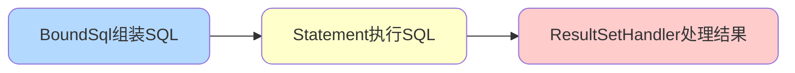

### 查询结果映射

当获取到查询结果`ResultSet`后，需要将数据库记录映射为Java对象。

映射转换的核心组件是`TypeHandler`，流程如下：

**1. 创建返回对象**

```java
// 创建实体类实例
Object resultObject = objectFactory.create(resultType);
// 如果配置了延迟加载，生成代理对象
if (lazyLoadingEnabled) {
    resultObject = proxyFactory.createProxy(resultObject);
}
```

**2. 提取数据库字段**

根据`ResultMap`配置，从`ResultSet`中提取对应列的数据。

**3. 确定映射关系**

```java
// 优先使用ResultMap中的显式映射
if (resultMapping != null) {
    // 使用配置的映射关系
} else {
    // 默认将下划线转换为驼峰命名
    // 例如：user_name -> userName
}
```

**4. 反射赋值**

```java
// 使用反射调用setter方法
MetaObject metaObject = configuration.newMetaObject(resultObject);
metaObject.setValue(propertyName, value);
```

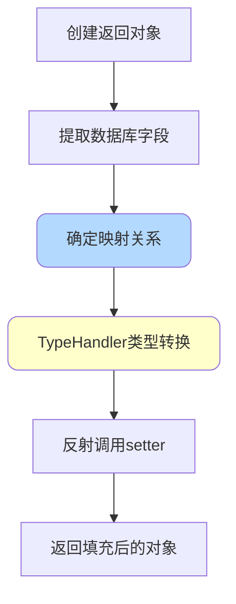

## 核心组件架构

### 组件关系图

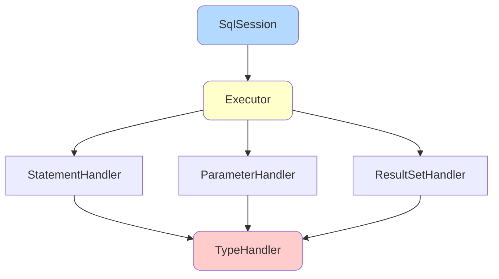

### Executor执行器

MyBatis提供三种基本的Executor执行器：

**1. SimpleExecutor（简单执行器）**

每执行一次update或select，就创建一个Statement对象，用完立即关闭。

```java
// 每次都创建新的Statement
Statement stmt = connection.createStatement();
ResultSet rs = stmt.executeQuery(sql);
stmt.close(); // 立即关闭
```

**2. ReuseExecutor（重用执行器）**

以SQL作为key缓存Statement对象，存在则复用，不存在则创建，用完后不关闭而是放入Map中供下次使用。

```java
// Statement缓存
Map<String, Statement> statementMap = new HashMap<>();

// 重用逻辑
Statement stmt = statementMap.get(sql);
if (stmt == null) {
    stmt = connection.prepareStatement(sql);
    statementMap.put(sql, stmt);
}
```

**3. BatchExecutor（批量执行器）**

执行update操作时，将所有SQL添加到批处理中（addBatch()），等待统一执行（executeBatch()）。

```java
// 添加到批处理
stmt.addBatch(sql1);
stmt.addBatch(sql2);
stmt.addBatch(sql3);

// 统一执行
int[] results = stmt.executeBatch();
```

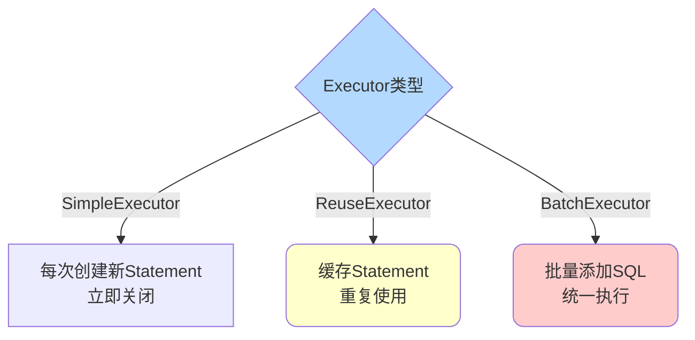

**作用范围**：Executor的生命周期严格限制在SqlSession范围内。

**配置方式**：

```xml
<!-- 在mybatis-config.xml中配置默认执行器 -->
<settings>
    <setting name="defaultExecutorType" value="REUSE"/>
</settings>
```

或者在创建SqlSession时指定：

```java
SqlSession session = factory.openSession(ExecutorType.BATCH);
```

### Mapper接口工作原理

**Mapper接口特点**：
- 接口全限名对应XML映射文件的namespace
- 接口方法名对应MappedStatement的id
- 接口方法参数对应SQL参数

```java
// Mapper接口
package com.example.mapper;
public interface ProductMapper {
    Product findById(Long id);
}
```

```xml
<!-- 对应的XML映射文件 -->
<mapper namespace="com.example.mapper.ProductMapper">
    <select id="findById" resultType="Product">
        SELECT * FROM product WHERE id = #{id}
    </select>
</mapper>
```

通过`namespace + 方法名`可以唯一定位一个`MappedStatement`：
- 完整定位：`com.example.mapper.ProductMapper.findById`

**方法重载支持**：

Mapper接口的方法可以重载，但需要满足条件：
1. 多个重载方法必须对应同一个XML中的id
2. 在XML中使用动态SQL处理不同参数

```java
public interface ProductMapper {
    List<Product> findProducts();
    List<Product> findProducts(@Param("name") String name);
    List<Product> findProducts(@Param("name") String name, 
                              @Param("categoryId") Long categoryId);
}
```

```xml
<select id="findProducts" resultType="Product">
    SELECT * FROM product
    <where>
        <if test="name != null">
            AND name LIKE CONCAT('%', #{name}, '%')
        </if>
        <if test="categoryId != null">
            AND category_id = #{categoryId}
        </if>
    </where>
</select>
```

### 配置解析与存储

MyBatis将所有配置信息封装到`Configuration`对象中：

- `<parameterMap>` → `ParameterMap`对象
- `<resultMap>` → `ResultMap`对象
- `<select>/<insert>/<update>/<delete>` → `MappedStatement`对象
- SQL语句 → `BoundSql`对象

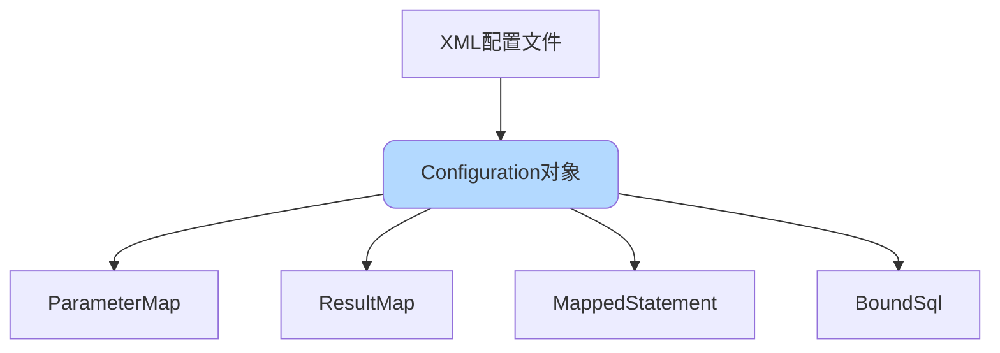

## 执行流程总结

完整的SQL执行流程可以总结为：

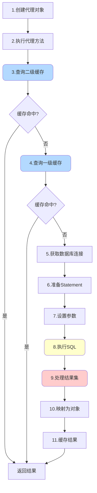

这个流程体现了MyBatis的设计理念：通过层层抽象和缓存优化，在保证功能完整的同时提升性能。
