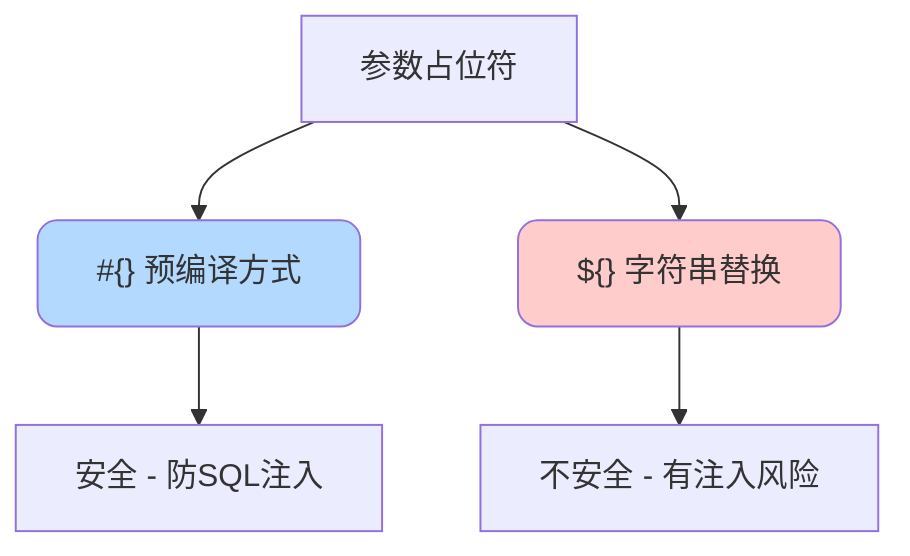
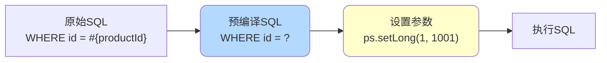
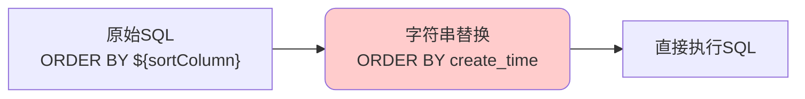
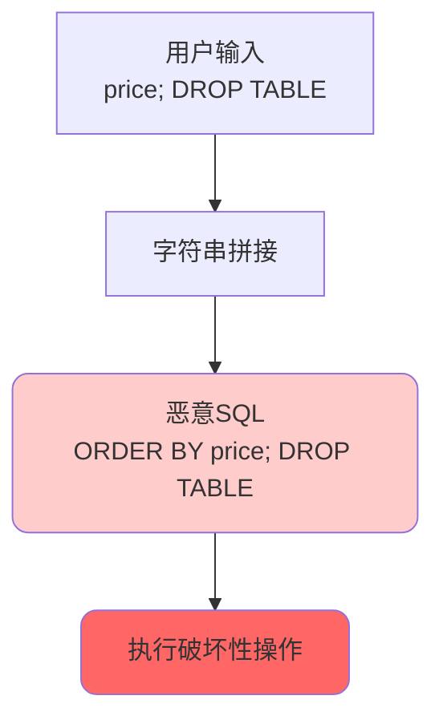
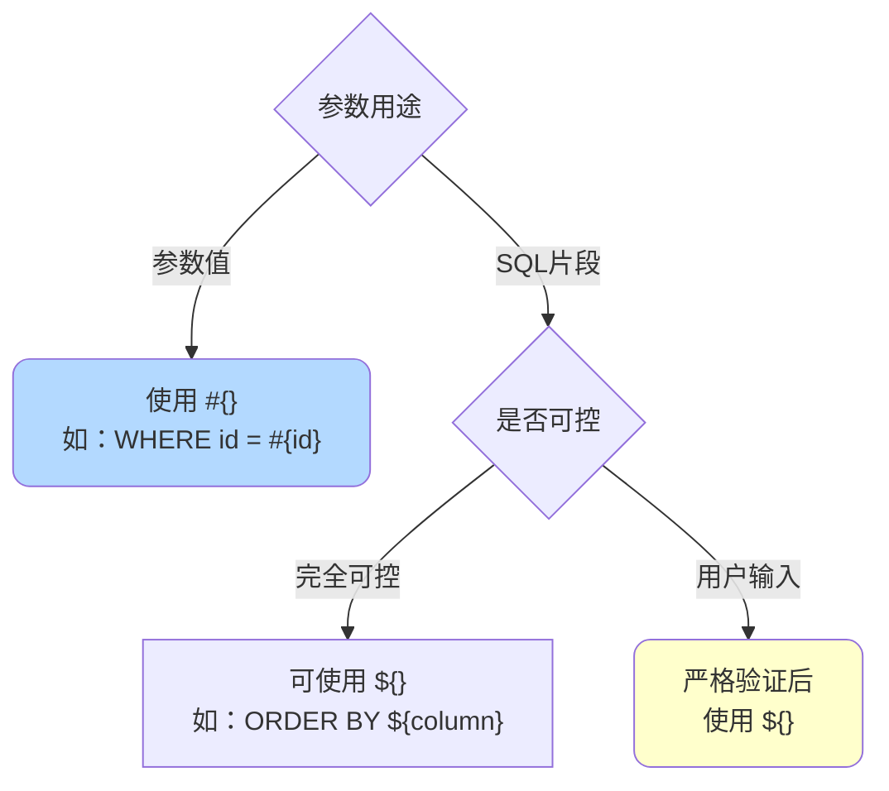
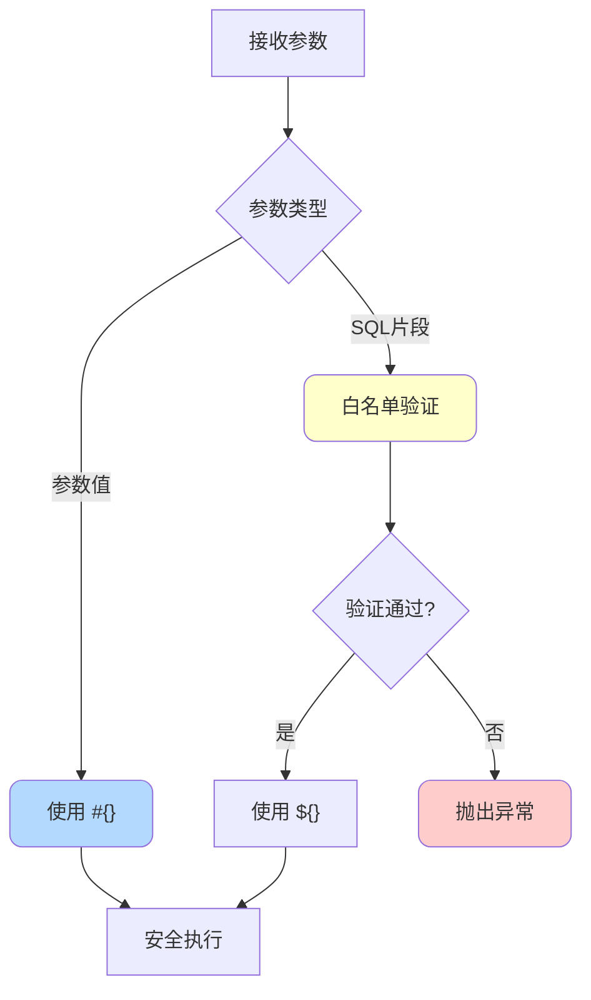

# MyBatis参数处理与SQL注入防护

## 参数占位符对比

在MyBatis的Mapper配置文件中，有两种参数占位符：`#{}`和`${}`。它们在预编译处理和安全性上存在本质差异。



## #{} 占位符详解

### 工作原理

`#{}`采用预编译机制，类似于JDBC中的`PreparedStatement`：

1. SQL语句中的`#{}`会被替换为`?`占位符
2. 参数值通过`PreparedStatement`的setter方法安全设置
3. 有效防止SQL注入攻击

```java
// Mapper接口
@Select("SELECT * FROM product WHERE id = #{productId}")
Product getProductById(@Param("productId") Long id);

// 实际执行的SQL（预编译后）
// SELECT * FROM product WHERE id = ?
// 参数值：1001
```

### 预编译过程



### 类型处理

MyBatis会根据参数类型自动选择合适的setter方法：

```java
// 字符串类型
SELECT * FROM product WHERE name = #{name}
// 转换为：ps.setString(1, "手机")

// 数值类型
SELECT * FROM product WHERE price > #{minPrice}
// 转换为：ps.setBigDecimal(1, new BigDecimal("99.99"))

// 日期类型
SELECT * FROM orders WHERE create_time > #{startDate}
// 转换为：ps.setTimestamp(1, timestamp)
```

### 安全优势

`#{}`能够有效防止SQL注入：

```java
// 即使传入恶意参数也不会被执行
String maliciousInput = "1 OR 1=1";
// SELECT * FROM product WHERE id = ?
// 参数被当作字符串 "1 OR 1=1"，而非SQL代码
```

## ${} 占位符详解

### 工作原理

`${}`采用字符串直接替换的方式：

1. 参数值直接拼接到SQL语句中
2. 不经过预编译处理
3. 可以替换SQL中的任意部分（表名、列名、关键字等）

```java
// Mapper配置
SELECT * FROM ${tableName} WHERE status = 1

// 如果 tableName = "product"
// 实际执行：SELECT * FROM product WHERE status = 1
```

### 字符串替换过程



### 适用场景

`${}`主要用于动态指定SQL片段（非参数值）：

**场景1：动态排序**

```xml
<select id="findProducts" resultType="Product">
    SELECT * FROM product
    WHERE status = 1
    ORDER BY ${sortColumn} ${sortOrder}
</select>
```

```java
// 调用示例
Map<String, Object> params = new HashMap<>();
params.put("sortColumn", "price");
params.put("sortOrder", "DESC");
// 生成SQL：ORDER BY price DESC
```

**场景2：动态表名**

```xml
<select id="queryData" resultType="Map">
    SELECT * FROM ${tableName}
    WHERE id = #{id}
</select>
```

```java
// 适用于分表场景
String tableName = "order_" + DateUtil.format(new Date(), "yyyyMM");
// 生成SQL：SELECT * FROM order_202411 WHERE id = ?
```

**场景3：动态列名**

```xml
<select id="getColumnValue" resultType="String">
    SELECT ${columnName} FROM product WHERE id = #{id}
</select>
```

### SQL注入风险

由于`${}`是字符串拼接，存在严重的SQL注入风险：

```java
// 危险示例
String sortColumn = "price; DELETE FROM product; --";
// 生成的SQL：
// SELECT * FROM product ORDER BY price; DELETE FROM product; --

// 如果不加防护，可能导致数据被删除
```



## ${} 的安全使用

### 参数验证

在使用`${}`之前，必须对输入参数进行严格验证：

```java
public List<Product> findProducts(String sortColumn, String sortOrder) {
    // 1. 白名单验证
    List<String> allowedColumns = Arrays.asList("id", "name", "price", "create_time");
    if (!allowedColumns.contains(sortColumn)) {
        throw new IllegalArgumentException("非法的排序字段");
    }
    
    List<String> allowedOrders = Arrays.asList("ASC", "DESC");
    if (!allowedOrders.contains(sortOrder.toUpperCase())) {
        throw new IllegalArgumentException("非法的排序方式");
    }
    
    // 2. 执行查询
    Map<String, Object> params = new HashMap<>();
    params.put("sortColumn", sortColumn);
    params.put("sortOrder", sortOrder);
    return productMapper.findProducts(params);
}
```

### 使用枚举限制

定义枚举类限制可选值：

```java
// 定义排序字段枚举
public enum ProductSortColumn {
    ID("id"),
    NAME("name"),
    PRICE("price"),
    CREATE_TIME("create_time");
    
    private String columnName;
    
    ProductSortColumn(String columnName) {
        this.columnName = columnName;
    }
    
    public String getColumnName() {
        return columnName;
    }
}

// 定义排序方向枚举
public enum SortOrder {
    ASC, DESC
}

// 使用枚举
public List<Product> findProducts(ProductSortColumn sortColumn, 
                                  SortOrder sortOrder) {
    Map<String, Object> params = new HashMap<>();
    params.put("sortColumn", sortColumn.getColumnName());
    params.put("sortOrder", sortOrder.name());
    return productMapper.findProducts(params);
}
```

### 正则表达式验证

对于更复杂的场景，使用正则表达式验证：

```java
public boolean isValidTableName(String tableName) {
    // 只允许字母、数字和下划线
    String pattern = "^[a-zA-Z0-9_]+$";
    return tableName != null && tableName.matches(pattern);
}

public List<Map<String, Object>> queryTable(String tableName) {
    if (!isValidTableName(tableName)) {
        throw new IllegalArgumentException("非法的表名");
    }
    
    // 限制表名长度
    if (tableName.length() > 64) {
        throw new IllegalArgumentException("表名过长");
    }
    
    return mapper.queryData(tableName);
}
```

### 常量类管理

使用常量类管理允许的值：

```java
public class SqlConstants {
    // 允许的排序字段
    public static final Set<String> ALLOWED_SORT_COLUMNS = 
        Collections.unmodifiableSet(new HashSet<>(Arrays.asList(
            "id", "name", "price", "stock", "create_time", "update_time"
        )));
    
    // 允许的表名前缀
    public static final Set<String> ALLOWED_TABLE_PREFIXES = 
        Collections.unmodifiableSet(new HashSet<>(Arrays.asList(
            "order_", "product_", "user_"
        )));
}

// 使用常量验证
public void validateSortColumn(String column) {
    if (!SqlConstants.ALLOWED_SORT_COLUMNS.contains(column)) {
        throw new IllegalArgumentException("不支持的排序字段: " + column);
    }
}
```

## 占位符选择建议

### 使用规则



**强制使用`#{}`的场景**：

```xml
<!-- WHERE条件的值 -->
<select id="findByName">
    SELECT * FROM product WHERE name = #{name}
</select>

<!-- INSERT的值 -->
<insert id="insertProduct">
    INSERT INTO product (name, price) VALUES (#{name}, #{price})
</insert>

<!-- UPDATE的值 -->
<update id="updatePrice">
    UPDATE product SET price = #{price} WHERE id = #{id}
</update>
```

**必须使用`${}`的场景**：

```xml
<!-- 动态表名 -->
<select id="queryTable">
    SELECT * FROM ${tableName} WHERE id = #{id}
</select>

<!-- 动态列名 -->
<select id="selectColumn">
    SELECT ${columnName} FROM product WHERE id = #{id}
</select>

<!-- 动态排序 -->
<select id="sortedList">
    SELECT * FROM product ORDER BY ${sortColumn} ${sortOrder}
</select>

<!-- 动态GROUP BY -->
<select id="groupBy">
    SELECT ${groupColumn}, COUNT(*) FROM product GROUP BY ${groupColumn}
</select>
```

### 最佳实践

**1. 优先使用`#{}`**

在任何可能的情况下，都应该优先使用`#{}`：

```java
// ✅ 推荐
WHERE status = #{status}

// ❌ 不推荐
WHERE status = ${status}
```

**2. `${}`必须验证**

使用`${}`时必须进行严格的输入验证：

```java
// ✅ 正确做法
public List<Product> findProducts(String sortColumn) {
    // 先验证
    validateSortColumn(sortColumn);
    // 再使用
    return mapper.findProducts(sortColumn);
}

// ❌ 危险做法
public List<Product> findProducts(String sortColumn) {
    // 直接使用用户输入
    return mapper.findProducts(sortColumn);
}
```

**3. 组合使用**

在同一个SQL中，可以组合使用两种占位符：

```xml
<select id="dynamicQuery" resultType="Product">
    SELECT * FROM ${tableName}
    WHERE category_id = #{categoryId}
    ORDER BY ${sortColumn} ${sortOrder}
    LIMIT #{offset}, #{limit}
</select>
```

## SQL注入防护总结

### 防护策略对比

| 策略 | 安全性 | 灵活性 | 适用场景 |
|------|--------|--------|----------|
| 使用`#{}` | ⭐⭐⭐⭐⭐ | ⭐⭐⭐ | 参数值传递 |
| 白名单验证 | ⭐⭐⭐⭐ | ⭐⭐ | 动态SQL片段 |
| 枚举限制 | ⭐⭐⭐⭐⭐ | ⭐ | 固定选项 |
| 正则验证 | ⭐⭐⭐ | ⭐⭐⭐ | 格式化输入 |

### 防护流程



### 关键要点

1. **默认使用`#{}`**：这是最安全的方式，能防止绝大多数SQL注入
2. **`${}`必须验证**：使用前必须进行严格的白名单验证或枚举限制
3. **永不信任用户输入**：所有来自外部的输入都应视为不可信
4. **最小权限原则**：数据库账号应使用最小必要权限
5. **错误信息脱敏**：不要在错误信息中暴露SQL语句细节

通过正确使用参数占位符并实施适当的安全措施，可以有效防止SQL注入攻击，确保应用程序的数据安全。
