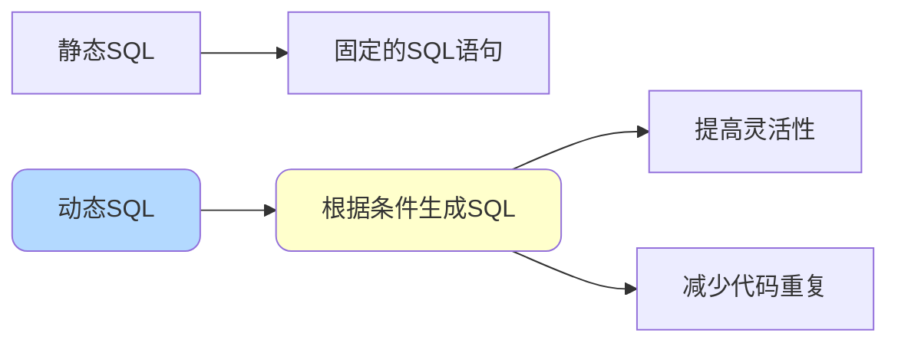
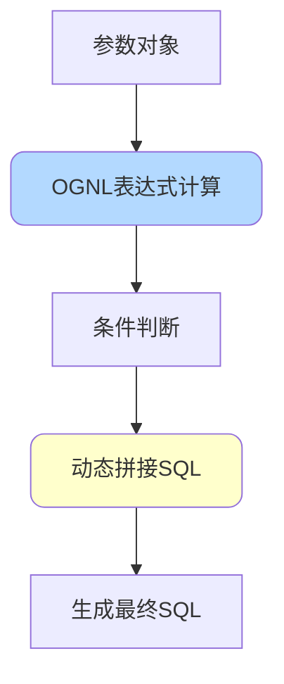
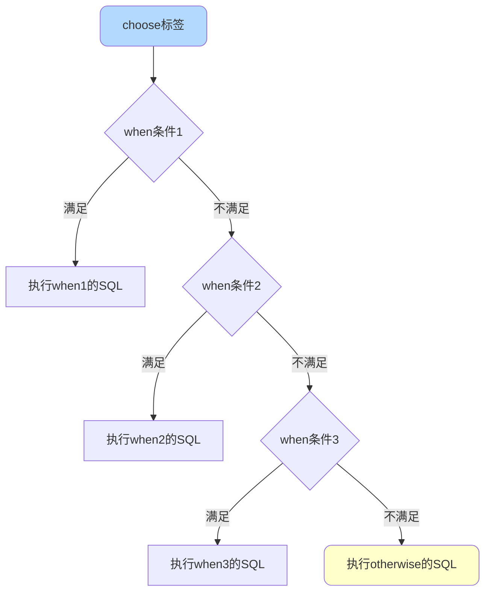

# MyBatis动态SQL详解

## 动态SQL概述

动态SQL是MyBatis的核心特性之一，它允许根据不同条件动态生成SQL语句，避免编写大量重复代码，显著提高代码的复用性和灵活性。



### 执行原理

MyBatis使用OGNL（Object-Graph Navigation Language）表达式从参数对象中计算值，根据计算结果动态拼接SQL：



## 核心标签详解

### if标签

`<if>`标签用于条件判断，当条件为true时才会拼接标签内的SQL片段。

**基础用法**：

```xml
<select id="findProducts" resultType="Product">
    SELECT * FROM product
    WHERE status = 1
    <if test="name != null and name != ''">
        AND name LIKE CONCAT('%', #{name}, '%')
    </if>
    <if test="minPrice != null">
        AND price >= #{minPrice}
    </if>
    <if test="maxPrice != null">
        AND price &lt;= #{maxPrice}
    </if>
</select>
```

**场景示例**：

```java
// 场景1：只传name
Map<String, Object> params1 = new HashMap<>();
params1.put("name", "手机");
// 生成SQL：SELECT * FROM product WHERE status = 1 
//          AND name LIKE CONCAT('%', ?, '%')

// 场景2：传name和minPrice
Map<String, Object> params2 = new HashMap<>();
params2.put("name", "手机");
params2.put("minPrice", 1000);
// 生成SQL：SELECT * FROM product WHERE status = 1 
//          AND name LIKE CONCAT('%', ?, '%')
//          AND price >= ?

// 场景3：只传价格范围
Map<String, Object> params3 = new HashMap<>();
params3.put("minPrice", 1000);
params3.put("maxPrice", 5000);
// 生成SQL：SELECT * FROM product WHERE status = 1 
//          AND price >= ? AND price <= ?
```

**常用条件表达式**：

```xml
<!-- 判断字符串非空 -->
<if test="name != null and name != ''">
    AND name = #{name}
</if>

<!-- 判断数值 -->
<if test="age != null and age > 0">
    AND age > #{age}
</if>

<!-- 判断布尔值 -->
<if test="isVip != null and isVip">
    AND vip_level > 0
</if>

<!-- 判断集合非空 -->
<if test="ids != null and ids.size() > 0">
    AND id IN
    <foreach collection="ids" item="id" open="(" separator="," close=")">
        #{id}
    </foreach>
</if>
```

### where标签

`<where>`标签用于智能处理WHERE子句：

1. 当子标签有内容时，自动添加WHERE关键字
2. 自动去除第一个AND或OR

**问题场景**：

```xml
<!-- 不使用where标签的问题 -->
<select id="findProducts" resultType="Product">
    SELECT * FROM product
    WHERE
    <if test="name != null">
        AND name = #{name}
    </if>
    <if test="price != null">
        AND price = #{price}
    </if>
</select>
<!-- 如果name为null，生成的SQL：SELECT * FROM product WHERE AND price = ?
     语法错误！ -->
```

**使用where标签解决**：

```xml
<select id="findProducts" resultType="Product">
    SELECT * FROM product
    <where>
        <if test="name != null and name != ''">
            AND name LIKE CONCAT('%', #{name}, '%')
        </if>
        <if test="categoryId != null">
            AND category_id = #{categoryId}
        </if>
        <if test="status != null">
            AND status = #{status}
        </if>
    </where>
</select>
```

```java
// 场景1：所有条件都为null
// 生成SQL：SELECT * FROM product

// 场景2：只有name有值
// 生成SQL：SELECT * FROM product WHERE name LIKE CONCAT('%', ?, '%')

// 场景3：多个条件有值
// 生成SQL：SELECT * FROM product 
//          WHERE name LIKE CONCAT('%', ?, '%') 
//          AND category_id = ? 
//          AND status = ?
```

### set标签

`<set>`标签用于UPDATE语句，智能处理SET子句：

1. 自动添加SET关键字
2. 自动去除最后一个逗号

```xml
<update id="updateProduct">
    UPDATE product
    <set>
        <if test="name != null and name != ''">
            name = #{name},
        </if>
        <if test="price != null">
            price = #{price},
        </if>
        <if test="stock != null">
            stock = #{stock},
        </if>
        <if test="description != null">
            description = #{description},
        </if>
        update_time = NOW()
    </set>
    WHERE id = #{id}
</update>
```

```java
// 场景：只更新name和price
Product product = new Product();
product.setId(1001L);
product.setName("新款手机");
product.setPrice(new BigDecimal("2999.00"));
// 生成SQL：UPDATE product 
//          SET name = ?, price = ?, update_time = NOW() 
//          WHERE id = ?
```

### trim标签

`<trim>`标签是更灵活的通用标签，可以自定义前缀、后缀及要移除的内容。

**属性说明**：

- `prefix`：添加的前缀
- `suffix`：添加的后缀
- `prefixOverrides`：需要移除的前缀
- `suffixOverrides`：需要移除的后缀

**使用trim实现where效果**：

```xml
<select id="findProducts" resultType="Product">
    SELECT * FROM product
    <trim prefix="WHERE" prefixOverrides="AND |OR ">
        <if test="name != null">
            AND name = #{name}
        </if>
        <if test="price != null">
            AND price = #{price}
        </if>
    </trim>
</select>
```

**使用trim实现set效果**：

```xml
<update id="updateProduct">
    UPDATE product
    <trim prefix="SET" suffixOverrides=",">
        <if test="name != null">
            name = #{name},
        </if>
        <if test="price != null">
            price = #{price},
        </if>
    </trim>
    WHERE id = #{id}
</update>
```

### choose-when-otherwise标签

类似于Java中的switch-case语句，实现多条件分支选择：

```xml
<select id="findProducts" resultType="Product">
    SELECT * FROM product
    <where>
        status = 1
        <choose>
            <when test="searchType == 'name' and keyword != null">
                AND name LIKE CONCAT('%', #{keyword}, '%')
            </when>
            <when test="searchType == 'category' and categoryId != null">
                AND category_id = #{categoryId}
            </when>
            <when test="searchType == 'price' and priceRange != null">
                AND price BETWEEN #{priceRange.min} AND #{priceRange.max}
            </when>
            <otherwise>
                AND create_time > DATE_SUB(NOW(), INTERVAL 7 DAY)
            </otherwise>
        </choose>
    </where>
</select>
```

```java
// 场景1：按名称搜索
params.put("searchType", "name");
params.put("keyword", "手机");
// 生成SQL：WHERE status = 1 AND name LIKE CONCAT('%', ?, '%')

// 场景2：按分类搜索
params.put("searchType", "category");
params.put("categoryId", 10);
// 生成SQL：WHERE status = 1 AND category_id = ?

// 场景3：按价格范围搜索
params.put("searchType", "price");
params.put("priceRange", new PriceRange(1000, 3000));
// 生成SQL：WHERE status = 1 AND price BETWEEN ? AND ?

// 场景4：使用默认条件
params.put("searchType", "latest");
// 生成SQL：WHERE status = 1 
//          AND create_time > DATE_SUB(NOW(), INTERVAL 7 DAY)
```



### foreach标签

`<foreach>`标签用于遍历集合，常用于IN查询和批量操作。

**属性说明**：

- `collection`：要遍历的集合
- `item`：集合中每个元素的别名
- `index`：当前元素的索引
- `open`：开始字符
- `separator`：分隔符
- `close`：结束字符

**IN查询**：

```xml
<select id="findByIds" resultType="Product">
    SELECT * FROM product
    WHERE id IN
    <foreach collection="ids" item="id" open="(" separator="," close=")">
        #{id}
    </foreach>
</select>
```

```java
List<Long> ids = Arrays.asList(1001L, 1002L, 1003L, 1004L);
// 生成SQL：SELECT * FROM product 
//          WHERE id IN (?, ?, ?, ?)
```

**批量插入**：

```xml
<insert id="batchInsert">
    INSERT INTO product (name, price, stock, category_id)
    VALUES
    <foreach collection="products" item="product" separator=",">
        (#{product.name}, #{product.price}, #{product.stock}, #{product.categoryId})
    </foreach>
</insert>
```

```java
List<Product> products = new ArrayList<>();
products.add(new Product("手机A", 2999, 100, 1));
products.add(new Product("手机B", 3999, 50, 1));
products.add(new Product("手机C", 4999, 30, 1));
// 生成SQL：INSERT INTO product (name, price, stock, category_id)
//          VALUES (?, ?, ?, ?), (?, ?, ?, ?), (?, ?, ?, ?)
```

**批量更新**：

```xml
<update id="batchUpdate">
    <foreach collection="products" item="product" separator=";">
        UPDATE product
        SET price = #{product.price}, stock = #{product.stock}
        WHERE id = #{product.id}
    </foreach>
</update>
```

**动态OR条件**：

```xml
<select id="searchProducts" resultType="Product">
    SELECT * FROM product
    <where>
        <if test="keywords != null and keywords.size() > 0">
            <foreach collection="keywords" item="keyword" open="(" separator=" OR " close=")">
                name LIKE CONCAT('%', #{keyword}, '%')
            </foreach>
        </if>
    </where>
</select>
```

```java
List<String> keywords = Arrays.asList("手机", "电脑", "平板");
// 生成SQL：SELECT * FROM product 
//          WHERE (name LIKE CONCAT('%', ?, '%') 
//                 OR name LIKE CONCAT('%', ?, '%') 
//                 OR name LIKE CONCAT('%', ?, '%'))
```

### bind标签

`<bind>`标签用于创建自定义变量，常用于模糊查询：

```xml
<select id="findByName" resultType="Product">
    <bind name="pattern" value="'%' + name + '%'" />
    SELECT * FROM product
    WHERE name LIKE #{pattern}
</select>
```

**优势**：

```xml
<!-- 不使用bind - SQL片段重复 -->
<select id="findProducts" resultType="Product">
    SELECT * FROM product
    <where>
        <if test="name != null">
            AND name LIKE CONCAT('%', #{name}, '%')
        </if>
        <if test="description != null">
            AND description LIKE CONCAT('%', #{description}, '%')
        </if>
    </where>
</select>

<!-- 使用bind - 简洁清晰 -->
<select id="findProducts" resultType="Product">
    <bind name="namePattern" value="'%' + name + '%'" />
    <bind name="descPattern" value="'%' + description + '%'" />
    SELECT * FROM product
    <where>
        <if test="name != null">
            AND name LIKE #{namePattern}
        </if>
        <if test="description != null">
            AND description LIKE #{descPattern}
        </if>
    </where>
</select>
```

## 实战应用场景

### 复杂查询条件

```xml
<select id="advancedSearch" resultType="Product">
    SELECT * FROM product
    <where>
        <!-- 基础条件 -->
        <if test="status != null">
            AND status = #{status}
        </if>
        
        <!-- 名称模糊搜索 -->
        <if test="name != null and name != ''">
            <bind name="namePattern" value="'%' + name + '%'" />
            AND name LIKE #{namePattern}
        </if>
        
        <!-- 分类筛选 -->
        <if test="categoryIds != null and categoryIds.size() > 0">
            AND category_id IN
            <foreach collection="categoryIds" item="categoryId" 
                     open="(" separator="," close=")">
                #{categoryId}
            </foreach>
        </if>
        
        <!-- 价格区间 -->
        <if test="minPrice != null">
            AND price >= #{minPrice}
        </if>
        <if test="maxPrice != null">
            AND price &lt;= #{maxPrice}
        </if>
        
        <!-- 时间范围 -->
        <if test="startDate != null">
            AND create_time >= #{startDate}
        </if>
        <if test="endDate != null">
            AND create_time &lt;= #{endDate}
        </if>
        
        <!-- 排除指定ID -->
        <if test="excludeIds != null and excludeIds.size() > 0">
            AND id NOT IN
            <foreach collection="excludeIds" item="excludeId" 
                     open="(" separator="," close=")">
                #{excludeId}
            </foreach>
        </if>
    </where>
    
    <!-- 动态排序 -->
    <if test="sortColumn != null and sortOrder != null">
        ORDER BY ${sortColumn} ${sortOrder}
    </if>
    
    <!-- 分页 -->
    <if test="offset != null and limit != null">
        LIMIT #{offset}, #{limit}
    </if>
</select>
```

### 动态表关联

```xml
<select id="queryWithJoins" resultType="Map">
    SELECT 
        p.*
        <if test="includeCategory">
            , c.name as category_name
        </if>
        <if test="includeSupplier">
            , s.name as supplier_name, s.contact as supplier_contact
        </if>
    FROM product p
    <if test="includeCategory">
        LEFT JOIN category c ON p.category_id = c.id
    </if>
    <if test="includeSupplier">
        LEFT JOIN supplier s ON p.supplier_id = s.id
    </if>
    WHERE p.id = #{id}
</select>
```

### 批量条件更新

```xml
<update id="batchUpdateByCondition">
    <foreach collection="updateList" item="item" separator=";">
        UPDATE product
        <set>
            <if test="item.price != null">
                price = #{item.price},
            </if>
            <if test="item.stock != null">
                stock = #{item.stock},
            </if>
            update_time = NOW()
        </set>
        WHERE id = #{item.id}
        <if test="item.version != null">
            AND version = #{item.version}
        </if>
    </foreach>
</update>
```

## 性能优化建议

### 避免过度使用动态SQL

```xml
<!-- ❌ 不推荐：每个字段都用if判断 -->
<select id="findProduct" resultType="Product">
    SELECT
    <if test="selectId">id,</if>
    <if test="selectName">name,</if>
    <if test="selectPrice">price,</if>
    <if test="selectStock">stock</if>
    FROM product WHERE id = #{id}
</select>

<!-- ✅ 推荐：直接查询需要的字段 -->
<select id="findProduct" resultType="Product">
    SELECT id, name, price, stock
    FROM product WHERE id = #{id}
</select>
```

### 合理使用foreach

```xml
<!-- ❌ 不推荐：IN条件包含过多元素 -->
<!-- 当ids包含1000+个元素时，SQL会非常长 -->
<select id="findByIds" resultType="Product">
    SELECT * FROM product WHERE id IN
    <foreach collection="ids" item="id" open="(" separator="," close=")">
        #{id}
    </foreach>
</select>

<!-- ✅ 推荐：限制IN条件的数量，分批查询 -->
<select id="findByIdsBatch" resultType="Product">
    SELECT * FROM product WHERE id IN
    <foreach collection="ids" item="id" open="(" separator="," close=")">
        #{id}
    </foreach>
</select>
```

```java
// Java代码中分批处理
public List<Product> findByIds(List<Long> allIds) {
    List<Product> result = new ArrayList<>();
    // 每批最多500个
    int batchSize = 500;
    for (int i = 0; i < allIds.size(); i += batchSize) {
        int end = Math.min(i + batchSize, allIds.size());
        List<Long> batchIds = allIds.subList(i, end);
        result.addAll(mapper.findByIdsBatch(batchIds));
    }
    return result;
}
```

## 总结

MyBatis的动态SQL功能强大且灵活，核心标签包括：

- `<if>`：条件判断
- `<where>`：智能WHERE子句
- `<set>`：智能SET子句
- `<trim>`：自定义前后缀处理
- `<choose-when-otherwise>`：多分支选择
- `<foreach>`：集合遍历
- `<bind>`：变量绑定

合理使用这些标签可以显著提升开发效率，但也要注意避免过度使用导致的性能问题。
