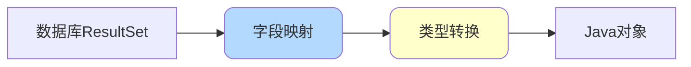
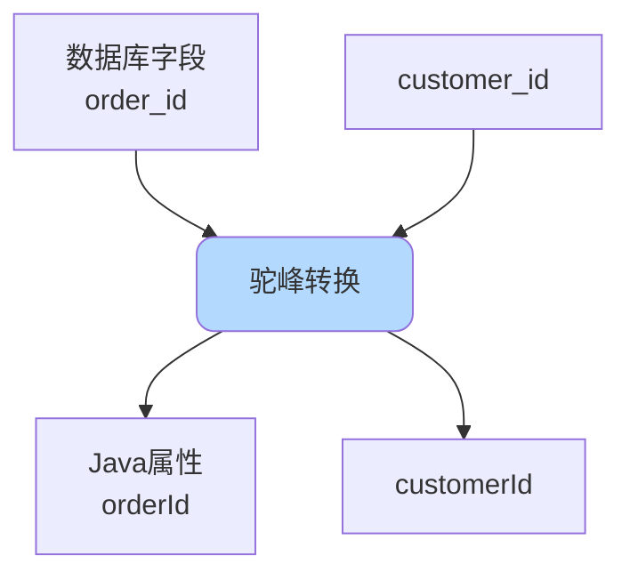
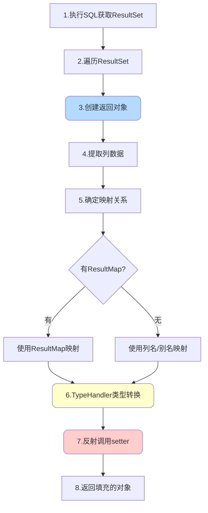
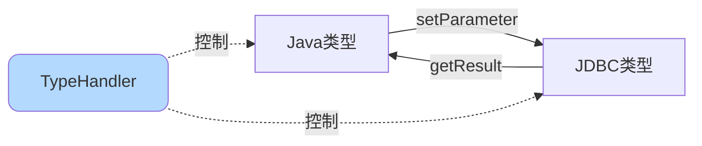

# MyBatis结果映射与类型处理

## 结果映射概述

MyBatis通过ResultSet对象获取SQL查询的结果集，然后将结果集中的每行记录映射到Java对象中。这个过程涉及字段名匹配、类型转换和对象创建等多个步骤。



## 字段映射方式

### 列名自动映射

MyBatis默认使用列名与Java对象属性名进行映射，且不区分大小写：

```java
// 实体类
public class Product {
    private Long id;
    private String name;
    private BigDecimal price;
    // getter/setter...
}
```

```xml
<!-- SQL查询 -->
<select id="findById" resultType="Product">
    SELECT id, name, price FROM product WHERE id = #{id}
</select>
```

MyBatis会自动完成映射：
- `id` → `product.id`
- `name` → `product.name`
- `price` → `product.price`

### 别名映射

当数据库列名与Java属性名不一致时，可以使用AS关键字定义别名：

```java
public class OrderInfo {
    private Long orderId;           // Java属性：驼峰命名
    private Long customerId;
    private BigDecimal totalAmount;
    private Date orderTime;
}
```

```xml
<select id="getOrderInfo" resultType="OrderInfo">
    SELECT 
        order_id AS orderId,          <!-- 数据库：下划线命名 -->
        customer_id AS customerId,
        total_amount AS totalAmount,
        create_time AS orderTime
    FROM orders
    WHERE order_id = #{orderId}
</select>
```

### 驼峰命名自动转换

开启驼峰命名自动映射后，MyBatis会自动将下划线命名转换为驼峰命名：

```xml
<!-- mybatis-config.xml -->
<settings>
    <setting name="mapUnderscoreToCamelCase" value="true"/>
</settings>
```

启用后，无需使用别名：

```xml
<select id="getOrderInfo" resultType="OrderInfo">
    SELECT order_id, customer_id, total_amount, create_time
    FROM orders
    WHERE order_id = #{orderId}
</select>
```

自动映射关系：
- `order_id` → `orderId`
- `customer_id` → `customerId`
- `total_amount` → `totalAmount`
- `create_time` → `orderTime`（需要额外配置）



### ResultMap映射

对于复杂映射关系，使用`<resultMap>`标签定义：

```xml
<resultMap id="productResultMap" type="Product">
    <!-- id标签：主键映射 -->
    <id column="product_id" property="id"/>
    
    <!-- result标签：普通字段映射 -->
    <result column="product_name" property="name"/>
    <result column="product_price" property="price"/>
    <result column="product_stock" property="stock"/>
    <result column="category_id" property="categoryId"/>
    <result column="create_time" property="createTime"/>
</resultMap>

<select id="findById" resultMap="productResultMap">
    SELECT product_id, product_name, product_price, 
           product_stock, category_id, create_time
    FROM product
    WHERE product_id = #{id}
</select>
```

## 映射执行流程

### 完整处理流程

MyBatis的字段映射经历以下步骤：



### 关键处理类

字段映射的核心实现在`ResultSetHandler`类中：

**1. 创建结果对象**

```java
// 通过ObjectFactory创建实例
Object resultObject = objectFactory.create(resultType);

// 如果配置了延迟加载，创建代理对象
if (configuration.isLazyLoadingEnabled()) {
    resultObject = proxyFactory.createProxy(
        resultObject, lazyLoader, configuration);
}
```

**2. 提取ResultSet数据**

```java
ResultSet rs = statement.getResultSet();
while (rs.next()) {
    // 获取列的元数据
    ResultSetMetaData metaData = rs.getMetaData();
    int columnCount = metaData.getColumnCount();
    
    // 遍历每一列
    for (int i = 1; i <= columnCount; i++) {
        String columnName = metaData.getColumnName(i);
        Object columnValue = rs.getObject(i);
        // 进行映射处理...
    }
}
```

**3. 确定映射关系**

```java
// 优先使用ResultMap中的显式映射
ResultMapping resultMapping = resultMap.getResultMapping(columnName);

if (resultMapping != null) {
    // 使用配置的映射关系
    String propertyName = resultMapping.getProperty();
} else {
    // 使用默认映射：下划线转驼峰
    String propertyName = convertToCamelCase(columnName);
}
```

**4. 类型转换与赋值**

```java
// 使用TypeHandler进行类型转换
TypeHandler<?> typeHandler = getTypeHandler(propertyType, columnType);
Object value = typeHandler.getResult(rs, columnName);

// 使用反射调用setter方法
MetaObject metaObject = configuration.newMetaObject(resultObject);
metaObject.setValue(propertyName, value);
```

## TypeHandler类型处理器

### TypeHandler作用

TypeHandler负责Java类型与JDBC类型之间的双向转换：



**核心方法**：

```java
public interface TypeHandler<T> {
    // Java类型 → JDBC类型（设置参数时）
    void setParameter(PreparedStatement ps, int i, T parameter, JdbcType jdbcType);
    
    // JDBC类型 → Java类型（获取结果时）
    T getResult(ResultSet rs, String columnName);
    T getResult(ResultSet rs, int columnIndex);
    T getResult(CallableStatement cs, int columnIndex);
}
```

### 内置TypeHandler

MyBatis提供了丰富的内置TypeHandler：

| Java类型 | JDBC类型 | TypeHandler |
|----------|----------|-------------|
| String | VARCHAR | StringTypeHandler |
| Integer | INTEGER | IntegerTypeHandler |
| Long | BIGINT | LongTypeHandler |
| BigDecimal | DECIMAL | BigDecimalTypeHandler |
| Date | TIMESTAMP | DateTypeHandler |
| LocalDateTime | TIMESTAMP | LocalDateTimeTypeHandler |
| Boolean | BOOLEAN | BooleanTypeHandler |
| byte[] | BLOB | BlobTypeHandler |

### 自定义TypeHandler

**场景示例**：枚举类型处理

```java
// 枚举定义
public enum ProductStatus {
    DRAFT(0, "草稿"),
    ON_SALE(1, "在售"),
    OFF_SALE(2, "下架"),
    DELETED(3, "已删除");
    
    private int code;
    private String description;
    
    ProductStatus(int code, String description) {
        this.code = code;
        this.description = description;
    }
    
    public static ProductStatus valueOf(int code) {
        for (ProductStatus status : values()) {
            if (status.code == code) {
                return status;
            }
        }
        throw new IllegalArgumentException("无效的状态码: " + code);
    }
    
    public int getCode() {
        return code;
    }
}
```

**自定义TypeHandler实现**：

```java
@MappedTypes(ProductStatus.class)
@MappedJdbcTypes(JdbcType.INTEGER)
public class ProductStatusTypeHandler implements TypeHandler<ProductStatus> {
    
    @Override
    public void setParameter(PreparedStatement ps, int i, 
                           ProductStatus parameter, JdbcType jdbcType) 
                           throws SQLException {
        // Java枚举 → 数据库整数
        ps.setInt(i, parameter.getCode());
    }
    
    @Override
    public ProductStatus getResult(ResultSet rs, String columnName) 
                                  throws SQLException {
        // 数据库整数 → Java枚举
        int code = rs.getInt(columnName);
        return ProductStatus.valueOf(code);
    }
    
    @Override
    public ProductStatus getResult(ResultSet rs, int columnIndex) 
                                  throws SQLException {
        int code = rs.getInt(columnIndex);
        return ProductStatus.valueOf(code);
    }
    
    @Override
    public ProductStatus getResult(CallableStatement cs, int columnIndex) 
                                  throws SQLException {
        int code = cs.getInt(columnIndex);
        return ProductStatus.valueOf(code);
    }
}
```

**注册TypeHandler**：

```xml
<!-- mybatis-config.xml -->
<typeHandlers>
    <typeHandler handler="com.example.handler.ProductStatusTypeHandler"/>
</typeHandlers>
```

或者使用包扫描：

```xml
<typeHandlers>
    <package name="com.example.handler"/>
</typeHandlers>
```

**使用示例**：

```java
public class Product {
    private Long id;
    private String name;
    private ProductStatus status;  // 使用枚举
}
```

```xml
<insert id="insertProduct">
    INSERT INTO product (name, status)
    VALUES (#{name}, #{status})  
    <!-- TypeHandler自动将枚举转换为整数 -->
</insert>

<select id="findById" resultType="Product">
    SELECT id, name, status FROM product WHERE id = #{id}
    <!-- TypeHandler自动将整数转换为枚举 -->
</select>
```

**复杂TypeHandler示例：JSON处理**

```java
@MappedTypes({Map.class, List.class})
@MappedJdbcTypes(JdbcType.VARCHAR)
public class JsonTypeHandler implements TypeHandler<Object> {
    
    private static final ObjectMapper objectMapper = new ObjectMapper();
    
    @Override
    public void setParameter(PreparedStatement ps, int i, 
                           Object parameter, JdbcType jdbcType) 
                           throws SQLException {
        // Java对象 → JSON字符串
        try {
            String json = objectMapper.writeValueAsString(parameter);
            ps.setString(i, json);
        } catch (JsonProcessingException e) {
            throw new SQLException("JSON序列化失败", e);
        }
    }
    
    @Override
    public Object getResult(ResultSet rs, String columnName) 
                          throws SQLException {
        // JSON字符串 → Java对象
        String json = rs.getString(columnName);
        if (json == null) {
            return null;
        }
        try {
            return objectMapper.readValue(json, Map.class);
        } catch (JsonProcessingException e) {
            throw new SQLException("JSON反序列化失败", e);
        }
    }
    
    // 其他方法类似...
}
```

## 复杂映射场景

### 一对一映射

```java
// 订单实体
public class Order {
    private Long orderId;
    private Customer customer;  // 关联的客户信息
    private BigDecimal totalAmount;
}

// 客户实体
public class Customer {
    private Long customerId;
    private String customerName;
    private String phone;
}
```

```xml
<resultMap id="orderWithCustomer" type="Order">
    <id column="order_id" property="orderId"/>
    <result column="total_amount" property="totalAmount"/>
    
    <!-- association：一对一关联 -->
    <association property="customer" javaType="Customer">
        <id column="customer_id" property="customerId"/>
        <result column="customer_name" property="customerName"/>
        <result column="phone" property="phone"/>
    </association>
</resultMap>

<select id="getOrderWithCustomer" resultMap="orderWithCustomer">
    SELECT 
        o.order_id, o.total_amount,
        c.customer_id, c.customer_name, c.phone
    FROM orders o
    LEFT JOIN customer c ON o.customer_id = c.customer_id
    WHERE o.order_id = #{orderId}
</select>
```

### 一对多映射

```java
// 分类实体
public class Category {
    private Long categoryId;
    private String categoryName;
    private List<Product> products;  // 该分类下的商品列表
}
```

```xml
<resultMap id="categoryWithProducts" type="Category">
    <id column="category_id" property="categoryId"/>
    <result column="category_name" property="categoryName"/>
    
    <!-- collection：一对多关联 -->
    <collection property="products" ofType="Product">
        <id column="product_id" property="id"/>
        <result column="product_name" property="name"/>
        <result column="price" property="price"/>
        <result column="stock" property="stock"/>
    </collection>
</resultMap>

<select id="getCategoryWithProducts" resultMap="categoryWithProducts">
    SELECT 
        c.category_id, c.category_name,
        p.product_id, p.product_name, p.price, p.stock
    FROM category c
    LEFT JOIN product p ON c.category_id = p.category_id
    WHERE c.category_id = #{categoryId}
</select>
```

### 鉴别器映射

使用`<discriminator>`根据某个列的值选择不同的映射：

```xml
<resultMap id="vehicleResult" type="Vehicle">
    <id column="id" property="id"/>
    <result column="type" property="type"/>
    
    <discriminator javaType="string" column="type">
        <case value="CAR" resultMap="carResult"/>
        <case value="TRUCK" resultMap="truckResult"/>
        <case value="VAN" resultMap="vanResult"/>
    </discriminator>
</resultMap>
```

## 性能优化建议

### 只查询需要的字段

```xml
<!-- ❌ 不推荐：查询所有字段 -->
<select id="listProducts" resultType="Product">
    SELECT * FROM product
</select>

<!-- ✅ 推荐：明确指定需要的字段 -->
<select id="listProducts" resultType="Product">
    SELECT id, name, price FROM product
</select>
```

### 合理使用ResultMap

```xml
<!-- ❌ 过度使用ResultMap -->
<resultMap id="simpleMap" type="Product">
    <id column="id" property="id"/>
    <result column="name" property="name"/>
    <result column="price" property="price"/>
</resultMap>

<!-- ✅ 简单映射使用resultType -->
<select id="findById" resultType="Product">
    SELECT id, name, price FROM product WHERE id = #{id}
</select>
```

### 避免N+1查询

```xml
<!-- ❌ 不推荐：会产生N+1查询问题 -->
<resultMap id="orderMap" type="Order">
    <association property="customer" 
                 select="selectCustomer" 
                 column="customer_id"/>
</resultMap>

<!-- ✅ 推荐：使用JOIN一次性查询 -->
<resultMap id="orderMap" type="Order">
    <association property="customer" javaType="Customer">
        <id column="customer_id" property="customerId"/>
        <result column="customer_name" property="customerName"/>
    </association>
</resultMap>
```

## 总结

MyBatis提供了灵活多样的结果映射方式：

1. **列名自动映射**：最简单的方式
2. **别名映射**：处理命名不一致
3. **驼峰转换**：自动处理命名风格差异
4. **ResultMap映射**：复杂映射场景
5. **TypeHandler**：自定义类型转换

合理选择映射方式，既能保证功能完整，又能获得最佳性能。
