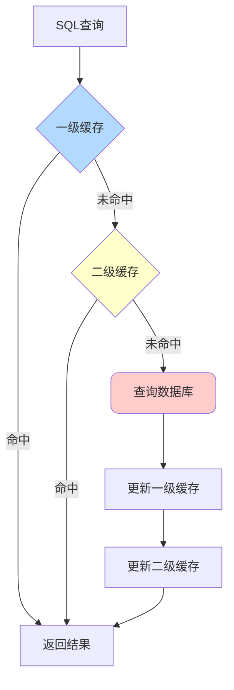
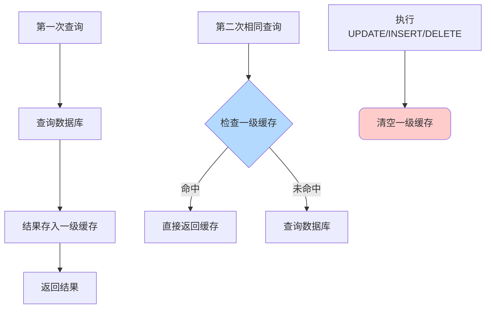
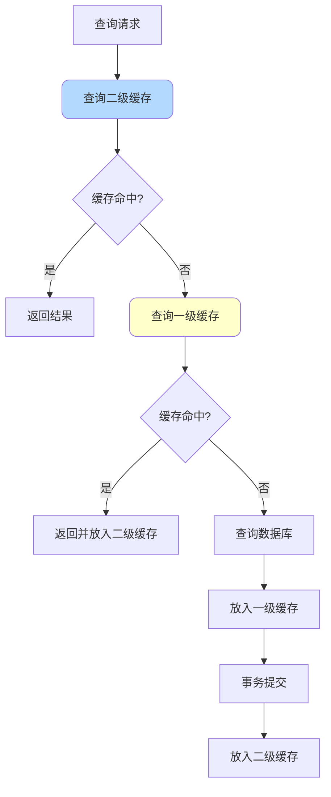
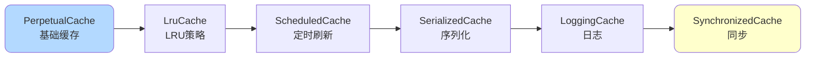
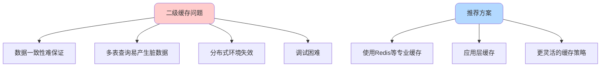

# MyBatis缓存机制详解

## 缓存概述

MyBatis提供了两级缓存机制来提升查询性能，减少数据库访问次数。



## 一级缓存

### 基本特性

一级缓存是SqlSession级别的缓存，默认开启且无法关闭。

**核心特点**：
- 作用域：SqlSession内部
- 实现：PerpetualCache（基于HashMap）
- 生命周期：与SqlSession相同
- 清空时机：执行update/delete/insert或手动清空

### 工作流程



### 使用示例

```java
@Test
public void testFirstLevelCache() {
    SqlSession session = sqlSessionFactory.openSession();
    try {
        ProductMapper mapper = session.getMapper(ProductMapper.class);
        
        // 第一次查询 - 访问数据库
        Product product1 = mapper.findById(1001L);
        System.out.println("First query: " + product1);
        
        // 第二次查询 - 命中一级缓存，不访问数据库
        Product product2 = mapper.findById(1001L);
        System.out.println("Second query: " + product2);
        
        // 两次查询返回同一个对象
        assert product1 == product2;
        
        // 执行更新操作 - 清空一级缓存
        Product updateProduct = new Product();
        updateProduct.setId(1002L);
        updateProduct.setPrice(new BigDecimal("999"));
        mapper.updateProduct(updateProduct);
        
        // 再次查询 - 重新访问数据库
        Product product3 = mapper.findById(1001L);
        System.out.println("Third query: " + product3);
        
    } finally {
        session.close();
    }
}
```

### 源码实现

```java
public class PerpetualCache implements Cache {
    private final String id;
    private final Map<Object, Object> cache = new HashMap<>();
    
    @Override
    public void putObject(Object key, Object value) {
        cache.put(key, value);
    }
    
    @Override
    public Object getObject(Object key) {
        return cache.get(key);
    }
    
    @Override
    public Object removeObject(Object key) {
        return cache.remove(key);
    }
    
    @Override
    public void clear() {
        cache.clear();
    }
}
```

### 缓存Key生成

一级缓存的Key由多个因素组成：

```java
public class CacheKey implements Cloneable, Serializable {
    
    private static final int DEFAULT_MULTIPLIER = 37;
    private static final int DEFAULT_HASHCODE = 17;
    
    private int multiplier;
    private int hashcode;
    private long checksum;
    private int count;
    private List<Object> updateList;
    
    public void update(Object object) {
        // 更新hashcode和checksum
        int baseHashCode = object == null ? 1 : ArrayUtil.hashCode(object);
        count++;
        checksum += baseHashCode;
        baseHashCode *= count;
        hashcode = multiplier * hashcode + baseHashCode;
        updateList.add(object);
    }
}
```

CacheKey包含以下信息：
- MappedStatement的id
- RowBounds的offset和limit
- SQL语句
- 参数值
- Environment的id

### 一级缓存的问题

**1. 作用域限制**

```java
// 问题场景：不同SqlSession无法共享缓存
SqlSession session1 = sqlSessionFactory.openSession();
SqlSession session2 = sqlSessionFactory.openSession();

ProductMapper mapper1 = session1.getMapper(ProductMapper.class);
ProductMapper mapper2 = session2.getMapper(ProductMapper.class);

// session1查询，缓存在session1中
Product p1 = mapper1.findById(1001L);

// session1更新数据
p1.setPrice(new BigDecimal("999"));
mapper1.updateProduct(p1);
session1.commit();

// session2查询 - 仍然返回旧数据（脏数据）
Product p2 = mapper2.findById(1001L);
```

**2. 容量无限制**

```java
// 一级缓存没有容量限制，可能导致内存溢出
for (int i = 0; i < 100000; i++) {
    mapper.findById((long) i); // 每次查询都缓存
}
```

### 配置说明

可以通过`localCacheScope`设置缓存级别：

```xml
<settings>
    <!-- SESSION: SqlSession级别（默认） -->
    <!-- STATEMENT: 语句级别（查询后立即清空，相当于禁用） -->
    <setting name="localCacheScope" value="STATEMENT"/>
</settings>
```

## 二级缓存

### 基本特性

二级缓存是namespace级别的缓存，需要手动开启。

**核心特点**：
- 作用域：namespace（Mapper）
- 跨SqlSession共享
- 需要手动配置开启
- 支持多种缓存实现
- 装饰器模式实现

### 开启二级缓存

**步骤1：全局配置**

```xml
<settings>
    <setting name="cacheEnabled" value="true"/>
</settings>
```

**步骤2：Mapper配置**

```xml
<mapper namespace="com.example.mapper.ProductMapper">
    <!-- 开启二级缓存 -->
    <cache 
        eviction="LRU"
        flushInterval="60000"
        size="512"
        readOnly="false"/>
        
    <select id="findById" resultType="Product" useCache="true">
        SELECT * FROM product WHERE id = #{id}
    </select>
</mapper>
```

**配置属性说明**：

- `eviction`: 缓存回收策略
  - LRU（默认）：最近最少使用
  - FIFO：先进先出
  - SOFT：软引用
  - WEAK：弱引用
- `flushInterval`: 刷新间隔（毫秒）
- `size`: 缓存对象数量（默认1024）
- `readOnly`: 是否只读
  - true：返回缓存对象的同一实例（性能好，但不安全）
  - false：返回缓存对象的副本（安全，但性能差）

**步骤3：实体类实现Serializable**

```java
public class Product implements Serializable {
    private static final long serialVersionUID = 1L;
    
    private Long id;
    private String name;
    private BigDecimal price;
    // ...
}
```

### 工作流程



### 装饰器模式实现

MyBatis使用装饰器模式增强缓存功能：

```java
// 基础缓存
PerpetualCache cache = new PerpetualCache("ProductMapper");

// 添加LRU淘汰策略
cache = new LruCache(cache);

// 添加定时刷新功能
cache = new ScheduledCache(cache);

// 添加序列化功能
cache = new SerializedCache(cache);

// 添加日志功能
cache = new LoggingCache(cache);

// 添加同步功能
cache = new SynchronizedCache(cache);
```



### 二级缓存的问题

**脏数据问题**

```xml
<!-- ProductMapper.xml -->
<mapper namespace="com.example.mapper.ProductMapper">
    <cache/>
    
    <!-- 多表关联查询 -->
    <select id="getProductWithCategory" resultType="ProductVO">
        SELECT p.*, c.name as categoryName
        FROM product p
        LEFT JOIN category c ON p.category_id = c.id
        WHERE p.id = #{id}
    </select>
</mapper>

<!-- CategoryMapper.xml -->
<mapper namespace="com.example.mapper.CategoryMapper">
    <cache/>
    
    <update id="updateCategory">
        UPDATE category SET name = #{name} WHERE id = #{id}
    </update>
</mapper>
```

```java
// 场景：
// 1. ProductMapper查询并缓存结果（包含category信息）
ProductVO vo = productMapper.getProductWithCategory(1001L);

// 2. CategoryMapper更新category
categoryMapper.updateCategory(category);

// 3. 再次查询 - 返回缓存的旧数据（脏数据）
ProductVO vo2 = productMapper.getProductWithCategory(1001L);
// vo2中的categoryName仍然是旧值
```

**解决方案**：

```xml
<mapper namespace="com.example.mapper.ProductMapper">
    <!-- 引用其他namespace的缓存 -->
    <cache-ref namespace="com.example.mapper.CategoryMapper"/>
</mapper>
```

## 缓存使用建议

### 不推荐使用二级缓存



### 推荐的缓存方案

**方案1：使用Redis**

```java
@Service
public class ProductService {
    
    @Autowired
    private ProductMapper productMapper;
    
    @Autowired
    private RedisTemplate<String, Product> redisTemplate;
    
    public Product getProduct(Long id) {
        String key = "product:" + id;
        
        // 查询Redis
        Product product = redisTemplate.opsForValue().get(key);
        
        if (product == null) {
            // Redis未命中，查询数据库
            product = productMapper.findById(id);
            
            if (product != null) {
                // 放入Redis，设置过期时间
                redisTemplate.opsForValue().set(key, product, 1, TimeUnit.HOURS);
            }
        }
        
        return product;
    }
    
    public void updateProduct(Product product) {
        // 更新数据库
        productMapper.updateProduct(product);
        
        // 删除缓存
        String key = "product:" + product.getId();
        redisTemplate.delete(key);
    }
}
```

**方案2：使用Spring Cache**

```java
@Service
@CacheConfig(cacheNames = "product")
public class ProductService {
    
    @Autowired
    private ProductMapper productMapper;
    
    @Cacheable(key = "#id")
    public Product getProduct(Long id) {
        return productMapper.findById(id);
    }
    
    @CachePut(key = "#product.id")
    public Product updateProduct(Product product) {
        productMapper.updateProduct(product);
        return product;
    }
    
    @CacheEvict(key = "#id")
    public void deleteProduct(Long id) {
        productMapper.deleteById(id);
    }
}
```

**方案3：使用本地缓存**

```java
@Service
public class ProductService {
    
    private final LoadingCache<Long, Product> cache = CacheBuilder.newBuilder()
        .maximumSize(1000)
        .expireAfterWrite(10, TimeUnit.MINUTES)
        .build(new CacheLoader<Long, Product>() {
            @Override
            public Product load(Long id) {
                return productMapper.findById(id);
            }
        });
    
    public Product getProduct(Long id) {
        try {
            return cache.get(id);
        } catch (ExecutionException e) {
            throw new RuntimeException(e);
        }
    }
}
```

## 缓存最佳实践

### 一级缓存建议

```xml
<!-- 生产环境建议设置为STATEMENT -->
<settings>
    <setting name="localCacheScope" value="STATEMENT"/>
</settings>
```

**原因**：
- 避免长事务导致的脏数据
- 防止内存溢出
- 使缓存行为更可预测

### 二级缓存建议

**适用场景**：
- 读多写少的数据
- 单表查询
- 对数据一致性要求不高

**不适用场景**：
- 多表关联查询
- 数据频繁更新
- 分布式环境
- 对一致性要求高

### 缓存穿透防护

```java
public Product getProduct(Long id) {
    String key = "product:" + id;
    
    // 查询缓存
    Product product = cache.get(key);
    
    if (product == null) {
        // 加锁防止缓存击穿
        synchronized (this) {
            product = cache.get(key);
            if (product == null) {
                product = productMapper.findById(id);
                
                if (product == null) {
                    // 缓存空对象防止缓存穿透
                    product = new Product();
                    product.setId(-1L); // 标记为空对象
                    cache.put(key, product, 5, TimeUnit.MINUTES);
                } else {
                    cache.put(key, product, 1, TimeUnit.HOURS);
                }
            }
        }
    }
    
    return product.getId() == -1L ? null : product;
}
```

## 总结

MyBatis的缓存机制：

**一级缓存**：
- 默认开启，SqlSession级别
- 适合简单场景
- 生产环境建议禁用或设置为STATEMENT级别

**二级缓存**：
- namespace级别，需手动开启
- 多表查询易产生脏数据
- 不推荐在生产环境使用

**推荐方案**：
- 使用Redis等专业缓存中间件
- 使用Spring Cache抽象
- 使用Guava/Caffeine等本地缓存

通过选择合适的缓存方案，可以在保证数据一致性的同时提升系统性能。
