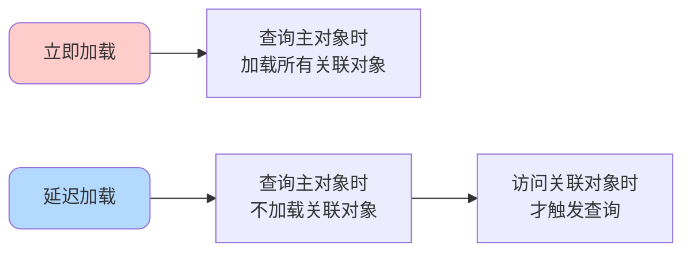
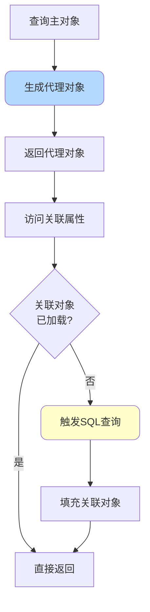
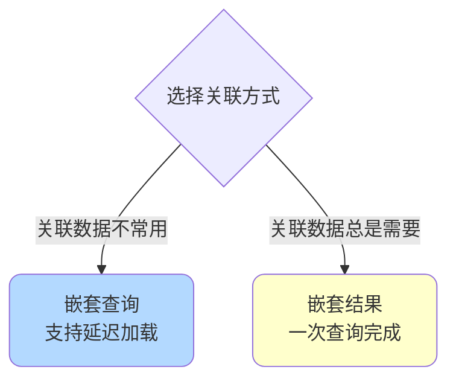
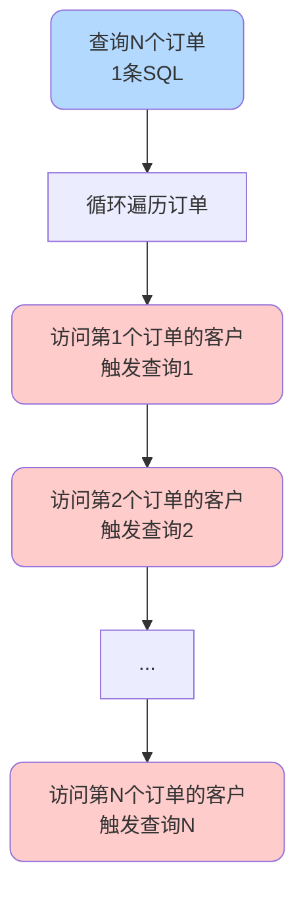
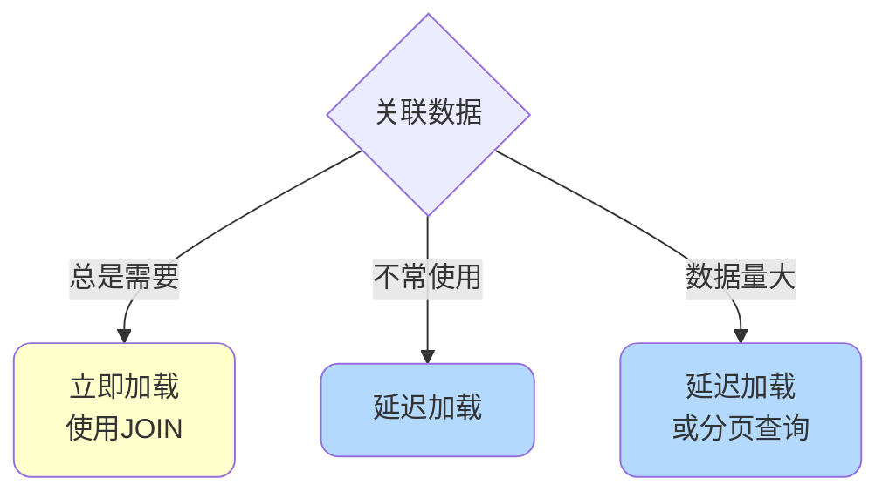

# MyBatis延迟加载与关联查询

## 延迟加载概述

延迟加载（Lazy Loading）是MyBatis提供的性能优化特性，允许在需要时才加载关联对象，而不是在查询主对象时立即加载所有关联数据。



## 延迟加载原理

### 代理对象机制

MyBatis通过CGLIB创建代理对象实现延迟加载：



### 工作流程

```java
// 1. 查询订单（不加载商品项）
Order order = orderMapper.getOrderById(1001L);

// 此时order.getItems()返回的是代理对象

// 2. 访问商品项时触发延迟加载
List<OrderItem> items = order.getItems(); 
// 代理对象拦截getItems()调用
// 检测items为null，触发查询
// SELECT * FROM order_item WHERE order_id = 1001
// 填充items并返回
```

## 实体类设计

### 一对多关联

```java
// 订单实体
public class Order {
    private Long orderId;
    private String orderNumber;
    private Long customerId;
    private BigDecimal totalAmount;
    private Date createTime;
    
    // 关联的订单项列表（一对多）
    private List<OrderItem> items;
    
    // getter/setter...
}

// 订单项实体
public class OrderItem {
    private Long itemId;
    private Long orderId;
    private Long productId;
    private String productName;
    private Integer quantity;
    private BigDecimal price;
    
    // getter/setter...
}
```

### 一对一关联

```java
// 订单实体
public class Order {
    private Long orderId;
    private String orderNumber;
    private Long customerId;
    
    // 关联的客户信息（一对一）
    private Customer customer;
    
    // getter/setter...
}

// 客户实体
public class Customer {
    private Long customerId;
    private String customerName;
    private String phone;
    private String address;
    
    // getter/setter...
}
```

## 配置延迟加载

### 全局配置

在`mybatis-config.xml`中配置：

```xml
<settings>
    <!-- 开启延迟加载 -->
    <setting name="lazyLoadingEnabled" value="true"/>
    
    <!-- 关闭积极加载（只有访问关联属性时才加载） -->
    <setting name="aggressiveLazyLoading" value="false"/>
    
    <!-- 指定触发延迟加载的方法 -->
    <setting name="lazyLoadTriggerMethods" value="equals,clone,hashCode,toString"/>
</settings>
```

**配置说明**：

- `lazyLoadingEnabled`：是否启用延迟加载（默认false）
- `aggressiveLazyLoading`：是否积极加载（设为false才能实现真正的延迟加载）
- `lazyLoadTriggerMethods`：哪些方法会触发延迟加载

### 局部配置

在具体的关联映射中指定`fetchType`：

```xml
<resultMap id="orderResultMap" type="Order">
    <id column="order_id" property="orderId"/>
    <result column="order_number" property="orderNumber"/>
    <result column="total_amount" property="totalAmount"/>
    
    <!-- collection一对多关联，设置为延迟加载 -->
    <collection 
        property="items" 
        ofType="OrderItem"
        select="selectOrderItems" 
        column="order_id"
        fetchType="lazy"/>
</resultMap>

<select id="getOrderById" resultMap="orderResultMap">
    SELECT order_id, order_number, total_amount
    FROM orders
    WHERE order_id = #{orderId}
</select>

<select id="selectOrderItems" resultType="OrderItem">
    SELECT item_id, order_id, product_id, product_name, quantity, price
    FROM order_item
    WHERE order_id = #{orderId}
</select>
```

**fetchType取值**：
- `lazy`：延迟加载
- `eager`：立即加载

## 关联查询方式

### 方式1：嵌套查询（支持延迟加载）

通过分步查询实现关联，支持延迟加载：

```xml
<!-- 一对一关联：订单关联客户 -->
<resultMap id="orderWithCustomer" type="Order">
    <id column="order_id" property="orderId"/>
    <result column="order_number" property="orderNumber"/>
    
    <!-- association一对一关联 -->
    <association 
        property="customer"
        javaType="Customer"
        select="selectCustomerById"
        column="customer_id"
        fetchType="lazy"/>
</resultMap>

<select id="getOrderById" resultMap="orderWithCustomer">
    SELECT order_id, order_number, customer_id, total_amount
    FROM orders
    WHERE order_id = #{orderId}
</select>

<select id="selectCustomerById" resultType="Customer">
    SELECT customer_id, customer_name, phone, address
    FROM customer
    WHERE customer_id = #{customerId}
</select>
```

```java
// 查询订单
Order order = orderMapper.getOrderById(1001L);
// 此时只执行：SELECT * FROM orders WHERE order_id = 1001

// 访问客户信息时触发延迟加载
Customer customer = order.getCustomer();
// 触发查询：SELECT * FROM customer WHERE customer_id = ?
```

### 方式2：嵌套结果（不支持延迟加载）

通过JOIN一次性查询所有数据，不支持延迟加载：

```xml
<resultMap id="orderWithItems" type="Order">
    <id column="order_id" property="orderId"/>
    <result column="order_number" property="orderNumber"/>
    <result column="total_amount" property="totalAmount"/>
    
    <!-- collection嵌套结果映射 -->
    <collection property="items" ofType="OrderItem">
        <id column="item_id" property="itemId"/>
        <result column="product_id" property="productId"/>
        <result column="product_name" property="productName"/>
        <result column="quantity" property="quantity"/>
        <result column="price" property="price"/>
    </collection>
</resultMap>

<select id="getOrderWithItems" resultMap="orderWithItems">
    SELECT 
        o.order_id, o.order_number, o.total_amount,
        i.item_id, i.product_id, i.product_name, i.quantity, i.price
    FROM orders o
    LEFT JOIN order_item i ON o.order_id = i.order_id
    WHERE o.order_id = #{orderId}
</select>
```

```java
// 一次查询获取所有数据
Order order = orderMapper.getOrderWithItems(1001L);
// 执行一条JOIN SQL，立即加载所有关联数据
```

### 两种方式对比

| 特性 | 嵌套查询 | 嵌套结果 |
|------|---------|---------|
| SQL数量 | 多条（1+N） | 1条（JOIN） |
| 延迟加载 | ✅ 支持 | ❌ 不支持 |
| 性能 | 可能产生N+1问题 | 一次查询，性能好 |
| 数据重复 | 无重复 | JOIN可能重复 |
| 适用场景 | 关联数据不常用 | 关联数据总是需要 |



## 一对一关联示例

```xml
<resultMap id="orderDetailMap" type="Order">
    <id column="order_id" property="orderId"/>
    <result column="order_number" property="orderNumber"/>
    <result column="total_amount" property="totalAmount"/>
    <result column="create_time" property="createTime"/>
    
    <!-- 关联客户信息 -->
    <association 
        property="customer"
        javaType="Customer"
        select="com.example.mapper.CustomerMapper.findById"
        column="customer_id"
        fetchType="lazy"/>
</resultMap>

<select id="getOrderDetail" resultMap="orderDetailMap">
    SELECT 
        order_id, order_number, customer_id, 
        total_amount, create_time
    FROM orders
    WHERE order_id = #{orderId}
</select>
```

```java
@Test
public void testLazyLoadingOneToOne() {
    Order order = orderMapper.getOrderDetail(1001L);
    System.out.println("订单号: " + order.getOrderNumber());
    // 到此为止只执行了订单查询
    
    // 访问客户信息时触发延迟加载
    Customer customer = order.getCustomer();
    System.out.println("客户名: " + customer.getCustomerName());
    // 触发客户查询SQL
}
```

## 一对多关联示例

```xml
<resultMap id="orderWithItemsMap" type="Order">
    <id column="order_id" property="orderId"/>
    <result column="order_number" property="orderNumber"/>
    <result column="total_amount" property="totalAmount"/>
    
    <!-- 关联订单项列表 -->
    <collection 
        property="items"
        ofType="OrderItem"
        select="com.example.mapper.OrderItemMapper.findByOrderId"
        column="order_id"
        fetchType="lazy"/>
</resultMap>

<select id="getOrder" resultMap="orderWithItemsMap">
    SELECT order_id, order_number, total_amount
    FROM orders
    WHERE order_id = #{orderId}
</select>
```

```xml
<!-- OrderItemMapper.xml -->
<select id="findByOrderId" resultType="OrderItem">
    SELECT item_id, order_id, product_id, product_name, quantity, price
    FROM order_item
    WHERE order_id = #{orderId}
</select>
```

```java
@Test
public void testLazyLoadingOneToMany() {
    Order order = orderMapper.getOrder(1001L);
    System.out.println("订单总额: " + order.getTotalAmount());
    // 只执行了订单查询
    
    // 访问订单项时触发延迟加载
    List<OrderItem> items = order.getItems();
    System.out.println("商品数量: " + items.size());
    // 触发订单项查询SQL
}
```

## N+1问题

### 问题说明

延迟加载可能导致N+1查询问题：

```java
// 查询所有订单
List<Order> orders = orderMapper.findAllOrders();
// 执行1条SQL：SELECT * FROM orders

// 遍历订单，访问客户信息
for (Order order : orders) {
    String customerName = order.getCustomer().getCustomerName();
    // 每次循环执行1条SQL：SELECT * FROM customer WHERE customer_id = ?
}

// 总共执行：1 + N 条SQL（N是订单数量）
```



### 解决方案

**方案1：使用JOIN一次查询**

```xml
<resultMap id="orderWithCustomer" type="Order">
    <id column="order_id" property="orderId"/>
    <result column="order_number" property="orderNumber"/>
    
    <association property="customer" javaType="Customer">
        <id column="customer_id" property="customerId"/>
        <result column="customer_name" property="customerName"/>
        <result column="phone" property="phone"/>
    </association>
</resultMap>

<select id="findAllOrdersWithCustomer" resultMap="orderWithCustomer">
    SELECT 
        o.order_id, o.order_number,
        c.customer_id, c.customer_name, c.phone
    FROM orders o
    LEFT JOIN customer c ON o.customer_id = c.customer_id
</select>
```

**方案2：先查询ID列表，再批量查询**

```java
// 1. 查询所有订单
List<Order> orders = orderMapper.findAllOrders();

// 2. 收集所有customer_id
Set<Long> customerIds = orders.stream()
    .map(Order::getCustomerId)
    .collect(Collectors.toSet());

// 3. 批量查询客户
Map<Long, Customer> customerMap = customerMapper.findByIds(customerIds)
    .stream()
    .collect(Collectors.toMap(Customer::getCustomerId, c -> c));

// 4. 手动填充客户信息
orders.forEach(order -> {
    Customer customer = customerMap.get(order.getCustomerId());
    order.setCustomer(customer);
});
```

## 最佳实践

### 何时使用延迟加载



**推荐使用延迟加载的场景**：
- 关联数据不经常访问
- 关联数据量较大
- 需要按需加载以优化性能

**不推荐使用延迟加载的场景**：
- 关联数据总是需要
- 循环中访问关联对象（N+1问题）
- 需要序列化对象（如返回JSON）

### 避免Session关闭问题

```java
// ❌ 错误：Session关闭后无法延迟加载
public Order getOrder(Long id) {
    SqlSession session = sqlSessionFactory.openSession();
    try {
        OrderMapper mapper = session.getMapper(OrderMapper.class);
        return mapper.getOrderById(id);
    } finally {
        session.close(); // Session关闭
    }
}

// 外部访问关联对象会报错
Order order = service.getOrder(1001L);
List<OrderItem> items = order.getItems(); 
// LazyLoadingException: Session已关闭

// ✅ 正确：在Session内完成所有操作
public Order getOrderWithItems(Long id) {
    SqlSession session = sqlSessionFactory.openSession();
    try {
        OrderMapper mapper = session.getMapper(OrderMapper.class);
        Order order = mapper.getOrderById(id);
        // 在Session内触发延迟加载
        order.getItems().size();
        return order;
    } finally {
        session.close();
    }
}
```

### JSON序列化注意事项

```java
// 延迟加载的对象在JSON序列化时可能出问题
@GetMapping("/order/{id}")
public Order getOrder(@PathVariable Long id) {
    return orderMapper.getOrderById(id);
    // 序列化时访问customer属性会触发延迟加载
    // 但此时可能Session已关闭，导致异常
}

// 解决方案1：提前触发加载
@GetMapping("/order/{id}")
public Order getOrder(@PathVariable Long id) {
    Order order = orderMapper.getOrderById(id);
    order.getCustomer(); // 提前触发
    return order;
}

// 解决方案2：使用DTO
@GetMapping("/order/{id}")
public OrderDTO getOrder(@PathVariable Long id) {
    Order order = orderMapper.getOrderById(id);
    return convertToDTO(order); // 转换为DTO
}
```

## 总结

MyBatis延迟加载机制：

**核心原理**：
- 基于CGLIB代理
- 访问关联属性时触发查询

**配置方式**：
- 全局配置：`lazyLoadingEnabled`
- 局部配置：`fetchType`

**关联查询**：
- 嵌套查询：支持延迟加载
- 嵌套结果：不支持延迟加载

**注意事项**：
- 防止N+1问题
- Session生命周期管理
- JSON序列化处理

合理使用延迟加载可以优化性能，但也要注意潜在的问题。
