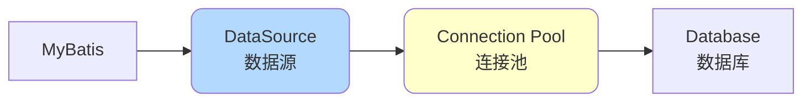
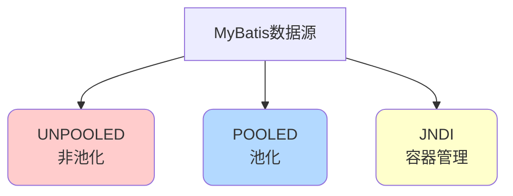
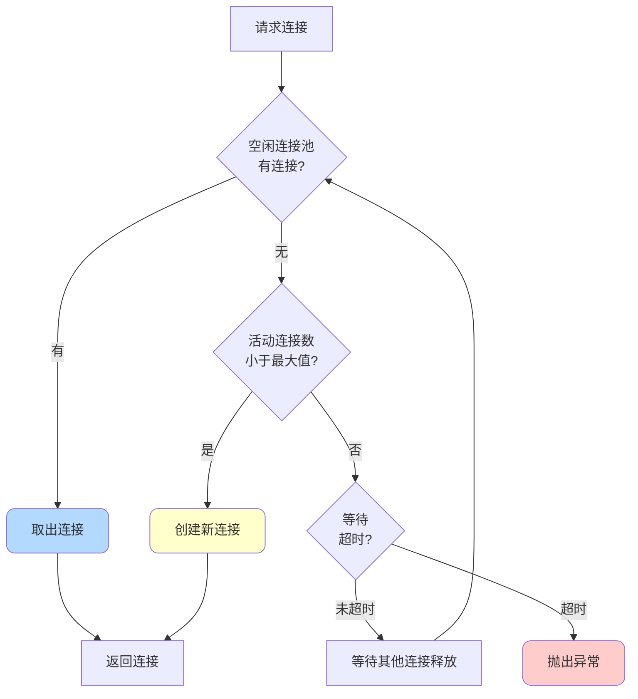
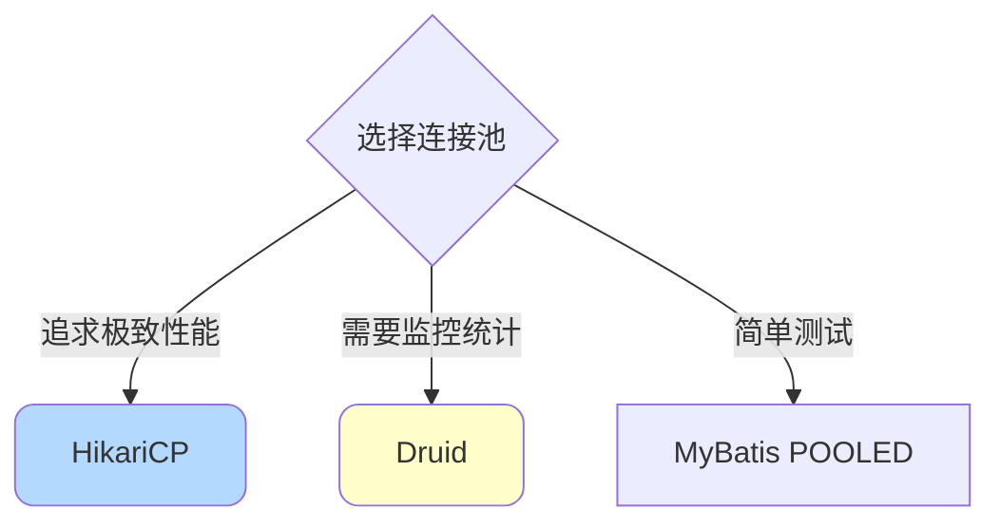

# MyBatis连接池与数据源配置

## 数据源概述

数据源（DataSource）是MyBatis连接数据库的桥梁，负责管理数据库连接的创建、分配和回收。



### 核心概念

**数据源（DataSource）**：
- JDBC规范中定义的接口
- 提供获取数据库连接的标准方法
- 替代了传统的DriverManager方式

**连接池（Connection Pool）**：
- 预先创建一定数量的数据库连接
- 重复使用连接，避免频繁创建销毁
- 提高系统性能

## MyBatis内置数据源

MyBatis提供了三种内置数据源类型：



### UNPOOLED数据源

每次请求都创建新连接，使用完立即关闭。

**配置示例**：

```xml
<dataSource type="UNPOOLED">
    <property name="driver" value="com.mysql.cj.jdbc.Driver"/>
    <property name="url" value="jdbc:mysql://localhost:3306/shop"/>
    <property name="username" value="root"/>
    <property name="password" value="123456"/>
</dataSource>
```

**特点**：
- ✅ 实现简单
- ✅ 适合小型应用
- ❌ 性能较差
- ❌ 频繁创建销毁连接

**源码实现**：

```java
public class UnpooledDataSource implements DataSource {
    private String driver;
    private String url;
    private String username;
    private String password;
    
    @Override
    public Connection getConnection() throws SQLException {
        return doGetConnection(username, password);
    }
    
    private Connection doGetConnection(String username, String password) 
            throws SQLException {
        Properties props = new Properties();
        if (username != null) {
            props.setProperty("user", username);
        }
        if (password != null) {
            props.setProperty("password", password);
        }
        return doGetConnection(props);
    }
    
    private Connection doGetConnection(Properties properties) 
            throws SQLException {
        // 初始化驱动
        initializeDriver();
        // 创建新连接
        Connection connection = DriverManager.getConnection(url, properties);
        configureConnection(connection);
        return connection;
    }
}
```

### POOLED数据源

使用连接池管理连接，重复使用连接对象。

**配置示例**：

```xml
<dataSource type="POOLED">
    <property name="driver" value="com.mysql.cj.jdbc.Driver"/>
    <property name="url" value="jdbc:mysql://localhost:3306/shop"/>
    <property name="username" value="root"/>
    <property name="password" value="123456"/>
    
    <!-- 连接池配置 -->
    <property name="poolMaximumActiveConnections" value="20"/>
    <property name="poolMaximumIdleConnections" value="5"/>
    <property name="poolMaximumCheckoutTime" value="20000"/>
    <property name="poolTimeToWait" value="20000"/>
</dataSource>
```

**配置参数说明**：

| 参数 | 说明 | 默认值 |
|------|------|--------|
| poolMaximumActiveConnections | 最大活动连接数 | 10 |
| poolMaximumIdleConnections | 最大空闲连接数 | 5 |
| poolMaximumCheckoutTime | 最大借出时间（毫秒） | 20000 |
| poolTimeToWait | 获取连接等待时间（毫秒） | 20000 |
| poolPingEnabled | 是否启用侦测查询 | false |
| poolPingQuery | 侦测查询SQL | NO PING |

**连接池工作流程**：



**源码实现简化版**：

```java
public class PooledDataSource implements DataSource {
    private final PoolState state = new PoolState(this);
    private final UnpooledDataSource dataSource;
    
    // 最大活动连接数
    protected int poolMaximumActiveConnections = 10;
    // 最大空闲连接数
    protected int poolMaximumIdleConnections = 5;
    
    @Override
    public Connection getConnection() throws SQLException {
        return popConnection(dataSource.getUsername(), 
                           dataSource.getPassword()).getProxyConnection();
    }
    
    private PooledConnection popConnection(String username, String password) 
            throws SQLException {
        PooledConnection conn = null;
        long t = System.currentTimeMillis();
        
        while (conn == null) {
            synchronized (state) {
                // 1. 检查空闲连接
                if (!state.idleConnections.isEmpty()) {
                    conn = state.idleConnections.remove(0);
                }
                // 2. 创建新连接
                else if (state.activeConnections.size() < poolMaximumActiveConnections) {
                    conn = new PooledConnection(dataSource.getConnection(), this);
                }
                // 3. 等待连接释放
                else {
                    PooledConnection oldestActiveConnection = 
                        state.activeConnections.get(0);
                    
                    long longestCheckoutTime = 
                        oldestActiveConnection.getCheckoutTime();
                    
                    // 检查是否超时
                    if (longestCheckoutTime > poolMaximumCheckoutTime) {
                        // 强制回收超时连接
                        state.activeConnections.remove(oldestActiveConnection);
                        conn = new PooledConnection(
                            oldestActiveConnection.getRealConnection(), this);
                    } else {
                        // 等待
                        state.wait(poolTimeToWait);
                    }
                }
                
                if (conn != null) {
                    state.activeConnections.add(conn);
                }
            }
        }
        
        return conn;
    }
    
    protected void pushConnection(PooledConnection conn) throws SQLException {
        synchronized (state) {
            state.activeConnections.remove(conn);
            
            if (conn.isValid()) {
                // 空闲连接池未满，放入空闲池
                if (state.idleConnections.size() < poolMaximumIdleConnections) {
                    PooledConnection newConn = new PooledConnection(
                        conn.getRealConnection(), this);
                    state.idleConnections.add(newConn);
                    state.notifyAll(); // 唤醒等待的线程
                } else {
                    // 空闲池已满，关闭连接
                    conn.getRealConnection().close();
                }
            }
        }
    }
}
```

### JNDI数据源

从JNDI服务中查找DataSource，常用于JavaEE容器环境。

**配置示例**：

```xml
<dataSource type="JNDI">
    <property name="data_source" value="java:comp/env/jdbc/shopDB"/>
</dataSource>
```

## 第三方数据源

### HikariCP（推荐）

HikariCP是目前性能最好的JDBC连接池，Spring Boot 2.x默认使用。

**添加依赖**：

```xml
<dependency>
    <groupId>com.zaxxer</groupId>
    <artifactId>HikariCP</artifactId>
    <version>5.0.1</version>
</dependency>
```

**配置示例**：

```java
@Configuration
public class DataSourceConfig {
    
    @Bean
    public DataSource dataSource() {
        HikariConfig config = new HikariConfig();
        config.setJdbcUrl("jdbc:mysql://localhost:3306/shop");
        config.setUsername("root");
        config.setPassword("123456");
        config.setDriverClassName("com.mysql.cj.jdbc.Driver");
        
        // 连接池配置
        config.setMaximumPoolSize(20);          // 最大连接数
        config.setMinimumIdle(5);               // 最小空闲连接数
        config.setConnectionTimeout(30000);     // 连接超时（毫秒）
        config.setIdleTimeout(600000);          // 空闲超时（毫秒）
        config.setMaxLifetime(1800000);         // 最大生命周期（毫秒）
        
        // 性能优化
        config.setAutoCommit(true);
        config.setConnectionTestQuery("SELECT 1");
        
        return new HikariDataSource(config);
    }
}
```

**Spring Boot配置**：

```yaml
spring:
  datasource:
    type: com.zaxxer.hikari.HikariDataSource
    url: jdbc:mysql://localhost:3306/shop
    username: root
    password: 123456
    driver-class-name: com.mysql.cj.jdbc.Driver
    
    hikari:
      maximum-pool-size: 20
      minimum-idle: 5
      connection-timeout: 30000
      idle-timeout: 600000
      max-lifetime: 1800000
      pool-name: HikariPool-Shop
```

### Druid（适合监控）

Druid是阿里巴巴开源的连接池，提供强大的监控和扩展功能。

**添加依赖**：

```xml
<dependency>
    <groupId>com.alibaba</groupId>
    <artifactId>druid-spring-boot-starter</artifactId>
    <version>1.2.16</version>
</dependency>
```

**配置示例**：

```yaml
spring:
  datasource:
    type: com.alibaba.druid.pool.DruidDataSource
    druid:
      # 基本配置
      url: jdbc:mysql://localhost:3306/shop
      username: root
      password: 123456
      driver-class-name: com.mysql.cj.jdbc.Driver
      
      # 连接池配置
      initial-size: 5
      min-idle: 5
      max-active: 20
      max-wait: 60000
      
      # 检测配置
      test-while-idle: true
      test-on-borrow: false
      test-on-return: false
      validation-query: SELECT 1
      time-between-eviction-runs-millis: 60000
      min-evictable-idle-time-millis: 300000
      
      # 监控统计
      stat-view-servlet:
        enabled: true
        url-pattern: /druid/*
        login-username: admin
        login-password: admin
      
      # SQL监控
      filter:
        stat:
          enabled: true
          log-slow-sql: true
          slow-sql-millis: 1000
```

**访问监控页面**：http://localhost:8080/druid/

### 连接池对比

| 特性 | HikariCP | Druid | MyBatis POOLED |
|------|----------|-------|----------------|
| 性能 | ⭐⭐⭐⭐⭐ | ⭐⭐⭐⭐ | ⭐⭐⭐ |
| 监控功能 | ⭐⭐ | ⭐⭐⭐⭐⭐ | ⭐ |
| 配置复杂度 | ⭐⭐⭐ | ⭐⭐⭐⭐ | ⭐⭐⭐⭐⭐ |
| 社区活跃度 | ⭐⭐⭐⭐⭐ | ⭐⭐⭐⭐ | ⭐⭐ |
| 推荐度 | ⭐⭐⭐⭐⭐ | ⭐⭐⭐⭐ | ⭐⭐ |



## 最佳实践

### 连接池大小设置

```java
// 计算公式（参考）
// connections = ((core_count * 2) + effective_spindle_count)

// 示例：4核CPU + 1块硬盘
int poolSize = (4 * 2) + 1; // = 9

// 实际应根据业务特点调整
// CPU密集型：核心数 * 2
// IO密集型：核心数 * 10 或更多
```

**推荐配置**：

```yaml
hikari:
  # 最大连接数：根据并发量设置，一般10-50
  maximum-pool-size: 20
  
  # 最小空闲连接：保持一定预热连接
  minimum-idle: 5
  
  # 连接超时：不宜过长，避免雪崩
  connection-timeout: 30000
  
  # 空闲超时：及时释放闲置连接
  idle-timeout: 600000
  
  # 最大生命周期：定期更新连接
  max-lifetime: 1800000
```

### 连接泄漏检测

```yaml
# HikariCP连接泄漏检测
hikari:
  leak-detection-threshold: 60000  # 60秒未归还视为泄漏
```

```java
// 正确使用连接
try (Connection conn = dataSource.getConnection();
     PreparedStatement ps = conn.prepareStatement(sql)) {
    // 使用连接
} // 自动关闭，归还连接池

// ❌ 错误：忘记关闭连接
Connection conn = dataSource.getConnection();
PreparedStatement ps = conn.prepareStatement(sql);
// ... 使用连接
// 忘记关闭，导致连接泄漏
```

### 监控与告警

```java
// 使用Druid的监控功能
@Component
public class DataSourceMonitor {
    
    @Autowired
    private DataSource dataSource;
    
    @Scheduled(fixedRate = 60000) // 每分钟检查
    public void checkDataSource() {
        if (dataSource instanceof DruidDataSource) {
            DruidDataSource druid = (DruidDataSource) dataSource;
            
            int activeCount = druid.getActiveCount();
            int poolingCount = druid.getPoolingCount();
            
            // 活动连接数过高告警
            if (activeCount > 15) {
                logger.warn("活动连接数过高: {}", activeCount);
            }
            
            // 空闲连接数过低告警
            if (poolingCount < 2) {
                logger.warn("空闲连接数过低: {}", poolingCount);
            }
        }
    }
}
```

### 数据库连接参数优化

```yaml
spring:
  datasource:
    url: jdbc:mysql://localhost:3306/shop?
      useUnicode=true&
      characterEncoding=utf8&
      useSSL=false&
      serverTimezone=Asia/Shanghai&
      rewriteBatchedStatements=true&      # 批量操作优化
      cachePrepStmts=true&                # 缓存预编译语句
      prepStmtCacheSize=250&              # 缓存大小
      prepStmtCacheSqlLimit=2048          # 缓存SQL长度限制
```

## 常见问题

### 连接池耗尽

**问题**：

```
Could not get JDBC Connection; nested exception is 
java.sql.SQLTransientConnectionException: 
HikariPool-1 - Connection is not available, request timed out after 30000ms.
```

**原因**：
1. 连接未正确关闭
2. 连接池配置过小
3. 数据库响应慢
4. 慢SQL占用连接

**解决方案**：

```java
// 1. 使用try-with-resources确保关闭
try (Connection conn = dataSource.getConnection()) {
    // ...
}

// 2. 增大连接池
hikari.maximum-pool-size: 50

// 3. 优化慢SQL
// 4. 增加超时告警
```

### 连接验证失败

**配置连接有效性检查**：

```yaml
hikari:
  connection-test-query: SELECT 1
  validation-timeout: 3000
```

## 总结

**内置数据源**：
- UNPOOLED：简单但性能差
- POOLED：基本可用
- JNDI：容器环境

**第三方连接池**：
- HikariCP：性能最优（推荐）
- Druid：监控强大
- C3P0：老牌但过时

**最佳实践**：
- 生产环境使用HikariCP或Druid
- 合理配置连接池大小
- 启用连接泄漏检测
- 定期监控连接池状态
