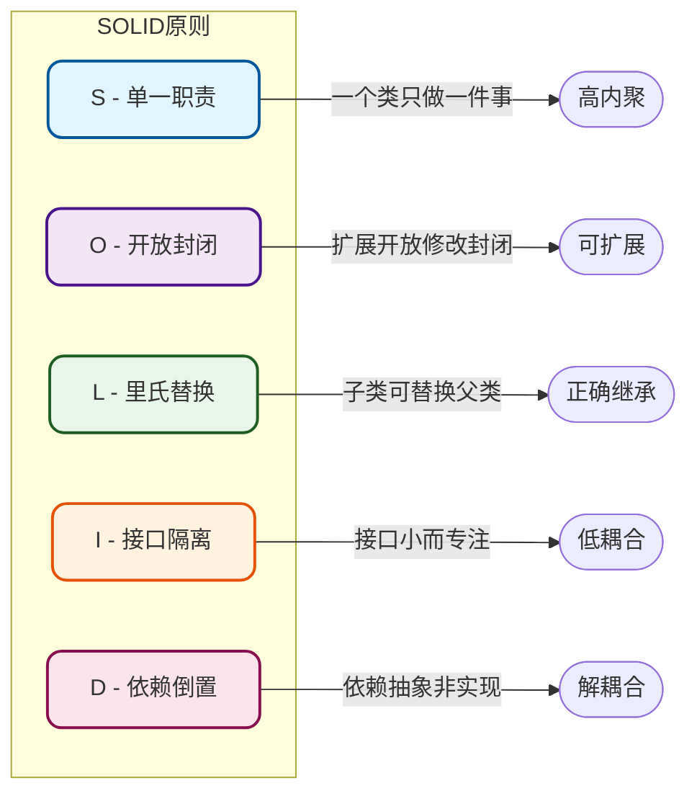
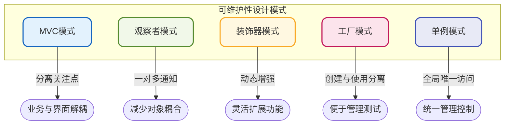
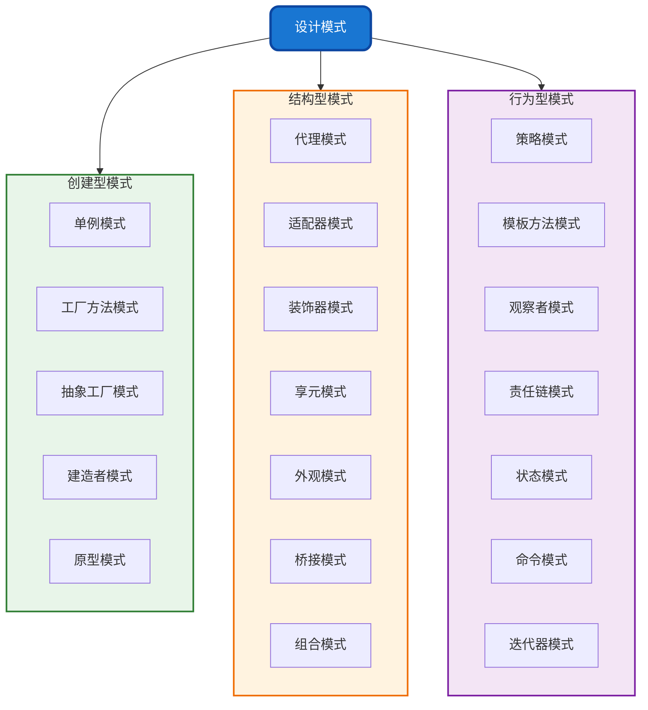

# 设计模式概述与基本原则

## 什么是设计模式

设计模式是软件工程领域中针对常见问题而总结出的**通用解决方案**。它们是经过大量实践验证和经验沉淀的**最佳编程实践**，代表了面向对象设计的精髓。

设计模式的核心价值体现在以下几个方面：

### 降低开发成本

设计模式凝聚了前人的智慧结晶。当我们遇到类似的设计问题时，可以直接借鉴成熟的模式来解决，这样能够**显著降低试错成本和迭代周期**，同时**大幅提升开发效率**。

### 提升代码质量

设计模式天然遵循诸多设计原则，这些原则能够帮助我们**显著提升代码的可复用性、可维护性和可扩展性**。

### 统一技术语言

设计模式是开发团队之间的**通用技术语言**。当我们提到单例、模板方法、策略模式、责任链等概念时，团队成员能够迅速理解其含义。这不仅**提升了沟通效率**，还能**降低代码维护过程中的出错概率**。

### 增强系统扩展性

设计模式通过对象之间的松耦合交互机制，使系统更容易进行扩展和修改。通过引入抽象层和接口，可以将变化的部分隔离出来，而不影响系统的其他组件。

:::tip 设计模式不止23种
只要是一套被反复验证、广泛认知、经过分类整理的代码设计经验总结，都属于软件设计模式的范畴。比如MVC架构模式、MVVM模式等都是典型的设计模式应用。
:::

## 设计模式的七大基本原则

设计模式建立在坚实的设计原则基础之上。其中有五个源自面向对象的SOLID原则，另外两个是同样重要的补充原则。

### SOLID五大原则

**单一职责原则（Single Responsibility Principle，SRP）**

一个类应该只承担一个引起变化的原因。换言之，每个类只应专注于完成一项职责。这个原则引导我们将功能拆分为小的、独立的模块，每个模块只负责单一的事务。

**开放封闭原则（Open/Closed Principle，OCP）**

软件实体（类、模块、函数等）应该对扩展开放，对修改封闭。这意味着当需要添加新功能时，应该通过扩展现有代码来实现，而不是直接修改已有的实现代码。

**里氏替换原则（Liskov Substitution Principle，LSP）**

任何父类出现的地方，都可以用其子类来替代，且不会导致程序的错误或异常行为。这个原则强调继承关系的正确使用——子类应该能够完全替代父类而不引发意外行为。

**依赖倒置原则（Dependency Inversion Principle，DIP）**

高层模块不应该依赖于低层模块，二者都应该依赖于抽象。程序应该面向接口编程，而不是面向具体实现编程。这个原则通过引入抽象接口，实现高层模块与低层模块的解耦。

**接口隔离原则（Interface Segregation Principle，ISP）**

客户端不应该被迫依赖它不需要的接口方法。接口应该小而专注，不应该包含多余的方法定义。我们应该使用多个专门的小接口，而不是一个臃肿的大接口。

### 补充设计原则

**迪米特法则（Law of Demeter，LoD）**

一个对象应该对其他对象有最少的了解，也称为"最少知识原则"。对象之间应该保持松耦合关系。这个原则引导我们将复杂系统拆分为相对独立的模块，模块间的交互通过最小化的接口进行。

**合成复用原则（Composition/Aggregation Reuse Principle，CARP）**

优先使用组合和聚合，而不是继承来实现代码复用。这个原则推崇通过对象组合的方式构建复杂的对象结构，而不是过度依赖继承体系。

## 提升代码可维护性的设计模式

以下设计模式在提升代码可维护性方面表现突出：

### MVC模式

将应用程序分为模型（Model）、视图（View）和控制器（Controller）三个部分，通过清晰的接口定义进行交互。这种模式实现了业务逻辑与用户界面的分离，使应用程序更易于维护和修改。

### 观察者模式

将对象之间的一对多依赖关系封装起来，当被观察对象状态改变时，所有依赖者都会收到通知并自动更新。这种模式能够有效减少对象间的耦合度，使系统更加灵活。

### 装饰器模式

动态地给对象添加额外的职责，而不需要修改原有代码。这种模式使功能扩展变得更加灵活可控。

### 工厂模式

将对象的创建和使用分离，通过工厂类统一负责对象的创建工作。这种模式使系统更加灵活，便于对象的管理和单元测试。

### 单例模式

确保一个类只有一个实例，并提供全局访问点。这种模式保证了对象的唯一性，便于统一管理和控制。

## 提升代码复用性的设计模式

以下设计模式在提升代码复用性方面效果显著：

### 工厂模式

通过工厂类负责对象创建，将创建逻辑与使用逻辑分离，避免在业务代码中重复编写对象创建代码。

### 模板方法模式

将通用的处理流程抽象到父类中，各子类继承父类并复用这些公共方法，仅需实现差异化的部分。

### 装饰器模式

动态地为对象添加额外功能，避免在代码中重复编写相似的功能逻辑。

### 享元模式

将对象的状态分为内部状态和外部状态，具有相同内部状态的对象可以共享使用，避免重复创建相同对象。

### 适配器模式

将一个类的接口转换为客户端期望的另一个接口，使原本不兼容的类能够协同工作，提升已有代码的复用程度。

### 单例模式

确保类只有一个实例并提供全局访问点，保证对象的唯一性，便于对象的统一管理、控制以及复用。

## 设计模式分类总览

设计模式通常分为三大类别：

- **创建型模式**：关注对象的创建机制，包括单例、工厂、建造者、原型等模式
- **结构型模式**：关注类和对象的组合方式，包括代理、适配器、装饰器、享元等模式
- **行为型模式**：关注对象之间的交互方式，包括策略、模板方法、观察者、责任链、状态等模式

掌握这些设计模式，能够帮助我们在面对复杂业务场景时做出更优的设计决策。
