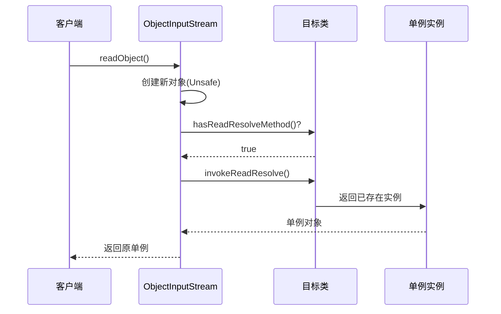

# 单例模式深度解析

## 单例模式核心思想

单例模式确保一个类在整个应用程序生命周期中只存在一个实例，并提供一个全局访问点来获取该实例。

实现单例的核心要点：

1. **私有化构造函数**：防止外部通过new关键字创建对象实例
2. **提供获取实例的静态方法**：保证只初始化一个单例对象
3. **考虑线程安全问题**：在多线程环境下确保单例的唯一性

## 五种经典实现方式

### 懒汉式单例

懒汉式的核心思想是**延迟加载**——只有在真正需要使用时才创建实例对象。

```java
public class ConfigurationManager {
    private static ConfigurationManager instance;
    
    private ConfigurationManager() {
        // 私有构造，加载配置文件
    }
    
    public static synchronized ConfigurationManager getInstance() {
        if (instance == null) {
            instance = new ConfigurationManager();
        }
        return instance;
    }
    
    public String getProperty(String key) {
        // 获取配置属性
        return "value";
    }
}
```

**优势**：避免过早创建对象造成资源浪费

**劣势**：首次创建时存在延迟；synchronized关键字会带来性能开销

### 饿汉式单例

饿汉式在类加载时就立即创建单例对象，确保在任何时刻访问都能获取到实例。

```java
public class ApplicationContext {
    // 类加载时立即创建实例
    private static final ApplicationContext INSTANCE = new ApplicationContext();
    
    private ApplicationContext() {
        // 初始化应用上下文
    }
    
    public static ApplicationContext getInstance() {
        return INSTANCE;
    }
}
```

也可以使用静态代码块实现：

```java
public class DatabasePool {
    private static DatabasePool instance;
    
    static {
        instance = new DatabasePool();
    }
    
    private DatabasePool() {
        // 初始化数据库连接池
    }
    
    public static DatabasePool getInstance() {
        return instance;
    }
}
```

**优势**：实现简单，天然线程安全

**劣势**：类加载时就创建对象，可能造成资源浪费

### 静态内部类单例

静态内部类方式结合了懒加载和线程安全的优势，是一种优雅的实现方式。

```java
public class CacheManager {
    
    private CacheManager() {
        // 初始化缓存管理器
    }
    
    // 静态内部类持有单例实例
    private static class CacheManagerHolder {
        private static final CacheManager INSTANCE = new CacheManager();
    }
    
    public static CacheManager getInstance() {
        return CacheManagerHolder.INSTANCE;
    }
    
    public void put(String key, Object value) {
        // 缓存数据
    }
    
    public Object get(String key) {
        // 获取缓存
        return null;
    }
}
```

**工作原理**：

- 外部类`CacheManager`被加载时，内部类`CacheManagerHolder`不会被加载
- 只有调用`getInstance()`方法时，才会触发内部类的加载和初始化
- 类的初始化过程由JVM保证线程安全

### 双重检查锁单例

双重检查锁（Double-Checked Locking）在保证线程安全的同时，尽可能减少同步开销。

```java
public class ServiceRegistry {
    // 必须使用volatile防止指令重排
    private volatile static ServiceRegistry instance;
    
    private ServiceRegistry() {
        // 初始化服务注册中心
    }
    
    public static ServiceRegistry getInstance() {
        // 第一次检查：避免不必要的同步
        if (instance == null) {
            synchronized (ServiceRegistry.class) {
                // 第二次检查：防止重复创建
                if (instance == null) {
                    instance = new ServiceRegistry();
                }
            }
        }
        return instance;
    }
    
    public void register(String serviceName, String address) {
        // 注册服务
    }
}
```

**关键点解析**：

- **第一次检查**：在未加锁的情况下快速判断实例是否已存在
- **第二次检查**：在同步块内再次确认，防止多个线程同时通过第一次检查
- **volatile关键字**：防止指令重排序导致的问题

:::info 为什么需要volatile？
对象的创建过程包含三个步骤：分配内存、初始化对象、将引用指向内存地址。JVM可能对这些步骤进行重排序，导致其他线程获取到未完全初始化的对象。volatile确保了这些操作的有序性。
:::

### 枚举单例

枚举是实现单例最简洁、最安全的方式。

```java
public enum GlobalConfig {
    INSTANCE;
    
    private String appName;
    private String version;
    
    GlobalConfig() {
        // 初始化配置
        this.appName = "MyApplication";
        this.version = "1.0.0";
    }
    
    public String getAppName() {
        return appName;
    }
    
    public String getVersion() {
        return version;
    }
    
    public void doSomething() {
        // 业务逻辑
    }
}

// 使用方式
// GlobalConfig.INSTANCE.doSomething();
```

## 枚举单例的优势分析

《Effective Java》明确指出：**单元素的枚举类型已经成为实现单例的最佳方法**。其主要优势包括：

### 代码简洁

对比双重检查锁的繁琐代码，枚举实现极其简洁：

```java
// 双重检查锁方式
public class MessageQueue {
    private volatile static MessageQueue instance;
    private MessageQueue() {}
    public static MessageQueue getInstance() {
        if (instance == null) {
            synchronized (MessageQueue.class) {
                if (instance == null) {
                    instance = new MessageQueue();
                }
            }
        }
        return instance;
    }
}

// 枚举方式
public enum MessageQueue {
    INSTANCE;
    public void sendMessage(String msg) {
        // 发送消息
    }
}
```

### 天然线程安全

枚举的线程安全由JVM在类加载机制层面保证。反编译枚举类可以看到：

```java
public final class Season extends Enum<Season> {
    public static final Season SPRING;
    public static final Season SUMMER;
    public static final Season AUTUMN;
    public static final Season WINTER;
    
    static {
        SPRING = new Season("SPRING", 0);
        SUMMER = new Season("SUMMER", 1);
        AUTUMN = new Season("AUTUMN", 2);
        WINTER = new Season("WINTER", 3);
    }
}
```

枚举项通过`static final`修饰，在类加载的静态初始化阶段完成实例化。JVM使用`ClassLoader`的`loadClass`方法加载类时，内部使用同步机制保证线程安全。

### 防止反序列化破坏

枚举的反序列化机制不同于普通对象，不会通过反射或Unsafe机制创建新实例，从根本上杜绝了反序列化破坏单例的可能。

## CAS无锁实现单例

除了传统方式，还可以利用CAS（Compare-And-Swap）机制实现无锁单例：

```java
public class EventDispatcher {
    private static final AtomicReference<EventDispatcher> INSTANCE = 
        new AtomicReference<>();
    
    private EventDispatcher() {
        // 初始化事件分发器
    }
    
    public static EventDispatcher getInstance() {
        for (;;) {
            EventDispatcher dispatcher = INSTANCE.get();
            if (dispatcher != null) {
                return dispatcher;
            }
            
            dispatcher = new EventDispatcher();
            if (INSTANCE.compareAndSet(null, dispatcher)) {
                return dispatcher;
            }
            // CAS失败，说明其他线程已创建实例，继续循环获取
        }
    }
    
    public void dispatch(String event) {
        // 分发事件
    }
}
```

**优势**：无需使用synchronized或Lock，利用原子操作保证线程安全

**劣势**：可能存在自旋开销，在高并发场景下可能创建多个临时对象

## 单例模式的破坏与防护

### 反射攻击

反射可以突破私有构造函数的限制，强行创建新实例：

```java
// 反射破坏单例示例
TaskScheduler scheduler1 = TaskScheduler.getInstance();

// 通过反射获取构造函数
Constructor<TaskScheduler> constructor = 
    TaskScheduler.class.getDeclaredConstructor();
// 取消访问检查
constructor.setAccessible(true);
// 创建新实例
TaskScheduler scheduler2 = constructor.newInstance();

System.out.println(scheduler1 == scheduler2); // 输出: false
```

**防护措施**：在构造函数中添加检查逻辑

```java
public class TaskScheduler {
    private static volatile TaskScheduler instance;
    
    private TaskScheduler() {
        // 防止反射攻击
        if (instance != null) {
            throw new RuntimeException("单例对象禁止重复创建！");
        }
    }
    
    public static TaskScheduler getInstance() {
        if (instance == null) {
            synchronized (TaskScheduler.class) {
                if (instance == null) {
                    instance = new TaskScheduler();
                }
            }
        }
        return instance;
    }
}
```

### 序列化攻击

序列化和反序列化过程会通过Unsafe机制创建新对象，破坏单例性：

```java
// 序列化破坏单例示例
public class SerializationAttackDemo {
    public static void main(String[] args) throws Exception {
        TokenGenerator original = TokenGenerator.getInstance();
        
        // 序列化
        ObjectOutputStream oos = new ObjectOutputStream(
            new FileOutputStream("token.ser"));
        oos.writeObject(original);
        oos.close();
        
        // 反序列化
        ObjectInputStream ois = new ObjectInputStream(
            new FileInputStream("token.ser"));
        TokenGenerator deserialized = (TokenGenerator) ois.readObject();
        ois.close();
        
        // 比较两个对象
        System.out.println(original == deserialized); // 输出: false
    }
}
```

**防护措施**：定义`readResolve`方法

```java
public class TokenGenerator implements Serializable {
    private static final long serialVersionUID = 1L;
    private volatile static TokenGenerator instance;
    
    private TokenGenerator() {}
    
    public static TokenGenerator getInstance() {
        if (instance == null) {
            synchronized (TokenGenerator.class) {
                if (instance == null) {
                    instance = new TokenGenerator();
                }
            }
        }
        return instance;
    }
    
    // 反序列化时返回已存在的实例
    private Object readResolve() {
        return instance;
    }
    
    public String generate() {
        return UUID.randomUUID().toString();
    }
}
```

**原理解析**：

`ObjectInputStream`在反序列化时会检查类是否定义了`readResolve`方法：
- 若存在该方法，则调用并使用其返回值作为反序列化结果
- 通过返回已存在的单例实例，避免创建新对象



## 单例实现方式对比

```mermaid
graph TB
    subgraph comparison["单例实现方式对比"]
        lazy["懒汉式"]
        eager["饿汉式"]
        inner["静态内部类"]
        dcl["双重检查锁"]
        enum["枚举"]
    end
    
    lazy --> L1["延迟加载: 是"]
    lazy --> L2["线程安全: 需synchronized"]
    lazy --> L3["防反射: 否"]
    lazy --> L4["防序列化: 否"]
    
    eager --> E1["延迟加载: 否"]
    eager --> E2["线程安全: 是"]
    eager --> E3["防反射: 否"]
    eager --> E4["防序列化: 否"]
    
    inner --> I1["延迟加载: 是"]
    inner --> I2["线程安全: 是"]
    inner --> I3["防反射: 否"]
    inner --> I4["防序列化: 否"]
    
    dcl --> D1["延迟加载: 是"]
    dcl --> D2["线程安全: 是"]
    dcl --> D3["防反射: 需处理"]
    dcl --> D4["防序列化: 需处理"]
    
    enum --> EN1["延迟加载: 否"]
    enum --> EN2["线程安全: 是"]
    enum --> EN3["防反射: 是"]
    enum --> EN4["防序列化: 是"]
    
    style lazy fill:#e3f2fd,stroke:#1565c0,stroke-width:2px,rx:10,ry:10
    style eager fill:#f1f8e9,stroke:#558b2f,stroke-width:2px,rx:10,ry:10
    style inner fill:#fff8e1,stroke:#f9a825,stroke-width:2px,rx:10,ry:10
    style dcl fill:#fce4ec,stroke:#c2185b,stroke-width:2px,rx:10,ry:10
    style enum fill:#e8eaf6,stroke:#3f51b5,stroke-width:2px,rx:10,ry:10
```



## 最佳实践建议

1. **首选枚举单例**：代码简洁，天然防御反射和序列化攻击
2. **需要延迟加载时**：使用静态内部类方式
3. **需要防止破坏时**：双重检查锁 + readResolve + 构造函数检查
4. **性能敏感场景**：考虑CAS实现，但需评估自旋开销
