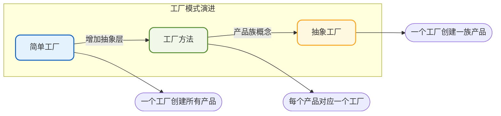
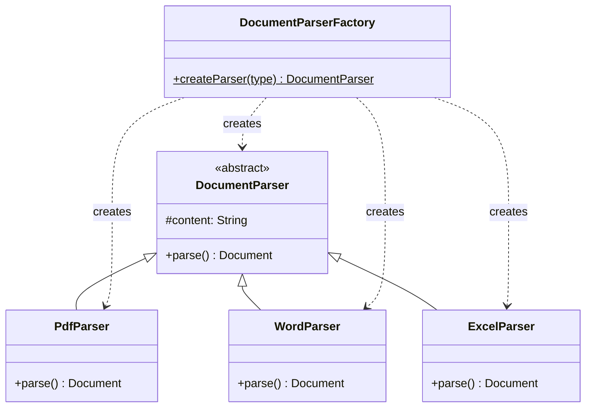
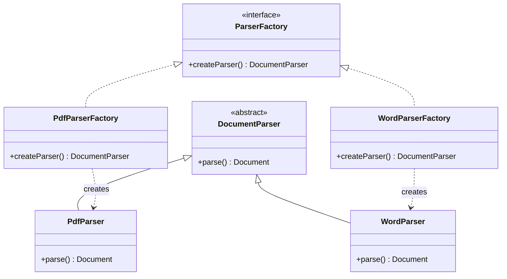
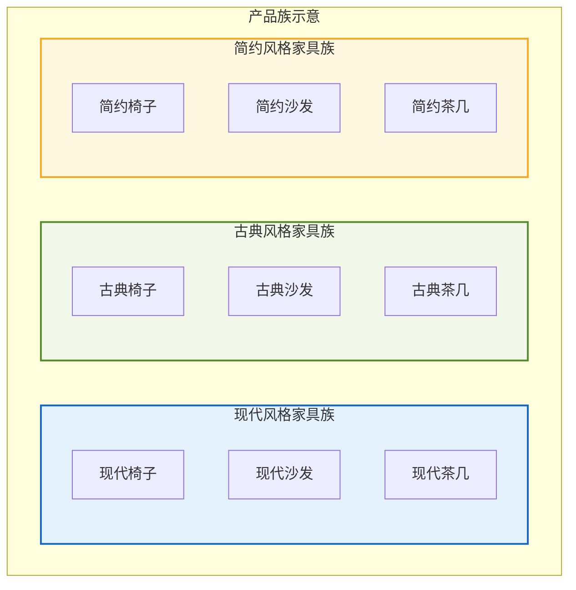
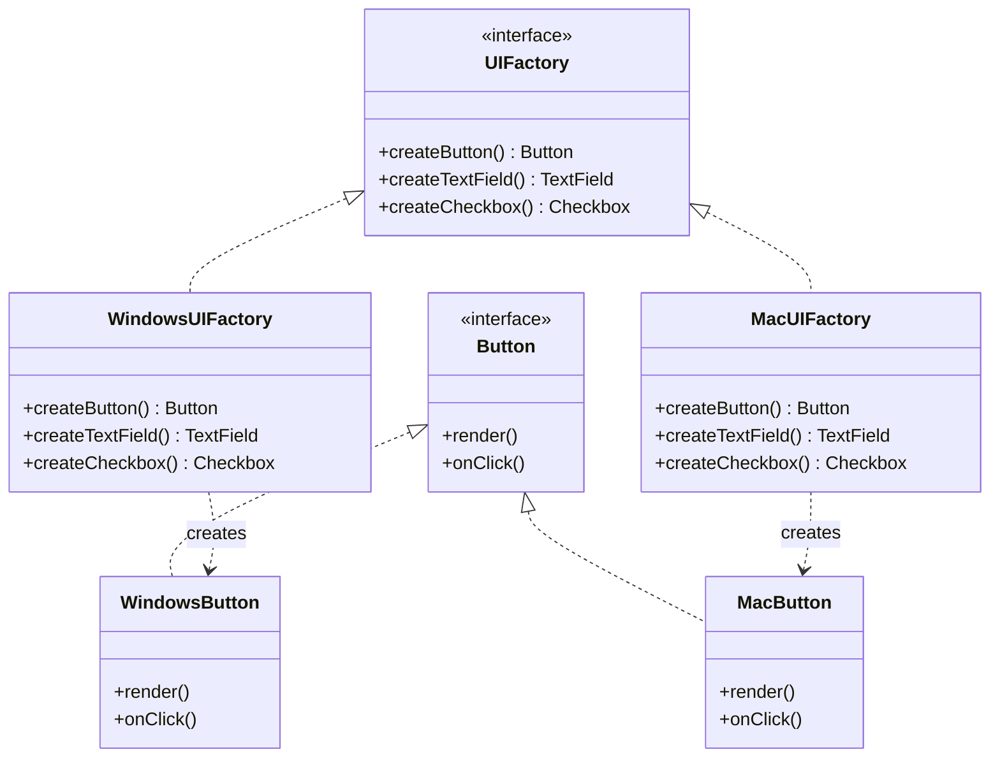
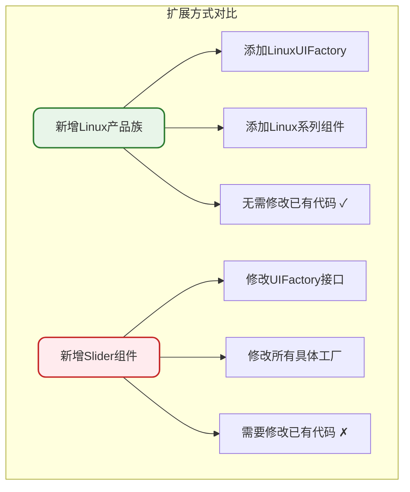

# 工厂模式体系详解

## 工厂模式核心理念

工厂模式的核心目标是**封装对象的创建过程**。之所以称为"工厂"模式，是因为对象的实例化过程由专门的工厂类负责，用工厂方法替代直接使用new操作符。

这样做的优势显而易见：

- **封装创建细节**：客户端无需关心对象如何创建
- **集中管理**：对象的生命周期可以统一管控
- **提升扩展性**：新增产品类型时对现有代码影响最小
- **降低耦合度**：客户端与具体产品类解耦

工厂模式包含三种变体：**简单工厂模式、工厂方法模式、抽象工厂模式**。三者的抽象程度逐步递增，适用场景也各有不同。



## 简单工厂模式

简单工厂模式（Simple Factory Pattern）也称为静态工厂方法模式，是工厂模式家族中最直观的形式。它通过一个工厂类的静态方法来决定创建哪种具体产品的实例。

### 场景引入

假设我们正在开发一个文档处理系统，需要支持多种文档格式的解析：

```java
// 文档解析器基类
public abstract class DocumentParser {
    protected String content;
    
    public String getContent() {
        return content;
    }
    
    public void setContent(String content) {
        this.content = content;
    }
    
    // 解析文档
    public abstract Document parse();
}

// PDF文档解析器
public class PdfParser extends DocumentParser {
    @Override
    public Document parse() {
        // PDF格式解析逻辑
        return new PdfDocument(content);
    }
}

// Word文档解析器
public class WordParser extends DocumentParser {
    @Override
    public Document parse() {
        // Word格式解析逻辑
        return new WordDocument(content);
    }
}

// Excel文档解析器
public class ExcelParser extends DocumentParser {
    @Override
    public Document parse() {
        // Excel格式解析逻辑
        return new ExcelDocument(content);
    }
}

// Markdown文档解析器
public class MarkdownParser extends DocumentParser {
    @Override
    public Document parse() {
        // Markdown格式解析逻辑
        return new MarkdownDocument(content);
    }
}
```

不使用工厂模式时，客户端需要直接创建具体的解析器：

```java
public class DocumentService {
    public Document processDocument(String type, String content) {
        DocumentParser parser;
        if ("pdf".equals(type)) {
            parser = new PdfParser();
        } else if ("word".equals(type)) {
            parser = new WordParser();
        }
        // ...更多判断
        parser.setContent(content);
        return parser.parse();
    }
}
```

这种方式的问题在于：客户端必须知道每个具体解析器的类名，且当新增文档类型时需要修改业务代码。

### 简单工厂实现

```java
// 文档解析器工厂
public class DocumentParserFactory {
    
    public static DocumentParser createParser(String type) {
        DocumentParser parser = null;
        switch (type.toLowerCase()) {
            case "pdf":
                parser = new PdfParser();
                break;
            case "word":
            case "docx":
                parser = new WordParser();
                break;
            case "excel":
            case "xlsx":
                parser = new ExcelParser();
                break;
            case "md":
            case "markdown":
                parser = new MarkdownParser();
                break;
            default:
                throw new UnsupportedOperationException("不支持的文档类型: " + type);
        }
        return parser;
    }
}
```

使用工厂后，客户端代码变得简洁：

```java
public class DocumentService {
    public Document processDocument(String type, String content) {
        DocumentParser parser = DocumentParserFactory.createParser(type);
        parser.setContent(content);
        return parser.parse();
    }
}
```

### 简单工厂的结构



### 优缺点分析

**优点**：
- 客户端与具体产品类解耦，只需知道产品对应的参数
- 实现简单直观，易于理解

**缺点**：
- 新增产品类型需要修改工厂类，违背开放封闭原则
- 工厂类集中了所有创建逻辑，职责过重

## 工厂方法模式

工厂方法模式（Factory Method Pattern）将对象的创建延迟到子类中进行。它定义一个创建对象的接口，但由实现该接口的子类决定实例化哪个具体类。

### 核心思想

工厂方法模式与简单工厂的最大区别在于：**每种产品都有对应的工厂类**，完全符合开放封闭原则。

### 实现示例

继续使用文档解析的场景，采用工厂方法模式重构：

```java
// 抽象工厂接口
public interface ParserFactory {
    DocumentParser createParser();
}

// PDF解析器工厂
public class PdfParserFactory implements ParserFactory {
    @Override
    public DocumentParser createParser() {
        return new PdfParser();
    }
}

// Word解析器工厂
public class WordParserFactory implements ParserFactory {
    @Override
    public DocumentParser createParser() {
        return new WordParser();
    }
}

// Excel解析器工厂
public class ExcelParserFactory implements ParserFactory {
    @Override
    public DocumentParser createParser() {
        return new ExcelParser();
    }
}

// Markdown解析器工厂
public class MarkdownParserFactory implements ParserFactory {
    @Override
    public DocumentParser createParser() {
        return new MarkdownParser();
    }
}
```

客户端使用：

```java
public class DocumentService {
    public Document processDocument(ParserFactory factory, String content) {
        DocumentParser parser = factory.createParser();
        parser.setContent(content);
        return parser.parse();
    }
    
    public static void main(String[] args) {
        DocumentService service = new DocumentService();
        
        // 处理PDF文档
        ParserFactory pdfFactory = new PdfParserFactory();
        Document pdfDoc = service.processDocument(pdfFactory, "pdf content");
        
        // 处理Word文档
        ParserFactory wordFactory = new WordParserFactory();
        Document wordDoc = service.processDocument(wordFactory, "word content");
    }
}
```

### 工厂方法的结构



### 为什么需要工厂方法模式

**封装创建细节**

工厂方法将对象创建的具体实现细节隐藏在具体工厂类中，客户端只需要关心工厂接口，无需了解创建细节。

**符合开放封闭原则**

新增产品类型时，只需添加对应的产品类和工厂类，无需修改现有代码：

```java
// 新增HTML解析器
public class HtmlParser extends DocumentParser {
    @Override
    public Document parse() {
        return new HtmlDocument(content);
    }
}

// 新增HTML解析器工厂
public class HtmlParserFactory implements ParserFactory {
    @Override
    public DocumentParser createParser() {
        return new HtmlParser();
    }
}
```

### 优缺点分析

**优点**：
- 继承简单工厂的优点，解耦客户端与具体产品
- 完全符合开放封闭原则，扩展性强
- 每个工厂类职责单一

**缺点**：
- 类的数量成对增加，增加了系统复杂度
- 需要引入抽象层，增加了理解难度

## 抽象工厂模式

抽象工厂模式（Abstract Factory Pattern）提供一个创建一系列相关或相互依赖对象的接口，而无需指定它们的具体类。

### 产品族概念

理解抽象工厂模式的关键是理解**产品族**的概念：位于不同产品等级结构中，功能相关联的产品组成的家族。



### 场景设计

假设我们正在开发一个跨平台UI组件库，需要支持不同操作系统的原生风格：

```java
// 按钮接口
public interface Button {
    void render();
    void onClick();
}

// 输入框接口
public interface TextField {
    void render();
    String getValue();
}

// 复选框接口
public interface Checkbox {
    void render();
    boolean isChecked();
}

// Windows风格组件
public class WindowsButton implements Button {
    @Override
    public void render() {
        System.out.println("渲染Windows风格按钮");
    }
    
    @Override
    public void onClick() {
        System.out.println("Windows按钮点击事件");
    }
}

public class WindowsTextField implements TextField {
    @Override
    public void render() {
        System.out.println("渲染Windows风格输入框");
    }
    
    @Override
    public String getValue() {
        return "Windows输入值";
    }
}

public class WindowsCheckbox implements Checkbox {
    @Override
    public void render() {
        System.out.println("渲染Windows风格复选框");
    }
    
    @Override
    public boolean isChecked() {
        return true;
    }
}

// macOS风格组件
public class MacButton implements Button {
    @Override
    public void render() {
        System.out.println("渲染macOS风格按钮");
    }
    
    @Override
    public void onClick() {
        System.out.println("macOS按钮点击事件");
    }
}

public class MacTextField implements TextField {
    @Override
    public void render() {
        System.out.println("渲染macOS风格输入框");
    }
    
    @Override
    public String getValue() {
        return "macOS输入值";
    }
}

public class MacCheckbox implements Checkbox {
    @Override
    public void render() {
        System.out.println("渲染macOS风格复选框");
    }
    
    @Override
    public boolean isChecked() {
        return true;
    }
}
```

### 抽象工厂实现

```java
// 抽象UI工厂
public interface UIFactory {
    Button createButton();
    TextField createTextField();
    Checkbox createCheckbox();
}

// Windows UI工厂
public class WindowsUIFactory implements UIFactory {
    @Override
    public Button createButton() {
        return new WindowsButton();
    }
    
    @Override
    public TextField createTextField() {
        return new WindowsTextField();
    }
    
    @Override
    public Checkbox createCheckbox() {
        return new WindowsCheckbox();
    }
}

// macOS UI工厂
public class MacUIFactory implements UIFactory {
    @Override
    public Button createButton() {
        return new MacButton();
    }
    
    @Override
    public TextField createTextField() {
        return new MacTextField();
    }
    
    @Override
    public Checkbox createCheckbox() {
        return new MacCheckbox();
    }
}
```

客户端使用：

```java
public class Application {
    private Button button;
    private TextField textField;
    private Checkbox checkbox;
    
    public Application(UIFactory factory) {
        this.button = factory.createButton();
        this.textField = factory.createTextField();
        this.checkbox = factory.createCheckbox();
    }
    
    public void render() {
        button.render();
        textField.render();
        checkbox.render();
    }
    
    public static void main(String[] args) {
        // 根据操作系统选择工厂
        UIFactory factory;
        String os = System.getProperty("os.name").toLowerCase();
        
        if (os.contains("windows")) {
            factory = new WindowsUIFactory();
        } else {
            factory = new MacUIFactory();
        }
        
        Application app = new Application(factory);
        app.render();
    }
}
```

### 抽象工厂的结构



### 开放封闭原则的倾斜性

抽象工厂模式对开放封闭原则的支持呈现**倾斜性**：

- **新增产品族**：只需添加新的具体工厂类，完全符合开放封闭原则
- **新增产品等级**：需要修改所有工厂类，违背开放封闭原则



### 优缺点分析

**优点**：
- 隔离了具体类的生成，客户端无需知道创建细节
- 可以方便地切换整个产品族
- 保证产品族内对象的一致性

**缺点**：
- 新增产品等级结构困难，需要修改抽象工厂和所有具体工厂
- 系统类的数量较多，增加了理解难度

## 三种工厂模式对比

| 特性 | 简单工厂 | 工厂方法 | 抽象工厂 |
|------|---------|---------|---------|
| 工厂数量 | 一个 | 多个 | 多个 |
| 产品类型 | 一类产品 | 一类产品 | 多类产品（产品族） |
| 扩展产品 | 修改工厂 | 添加工厂 | 添加工厂 |
| 开闭原则 | 不符合 | 符合 | 部分符合 |
| 复杂度 | 低 | 中 | 高 |

## 最佳实践建议

1. **产品类型较少且稳定**：使用简单工厂模式，实现简单
2. **产品类型经常变化**：使用工厂方法模式，便于扩展
3. **存在产品族概念**：使用抽象工厂模式，保证产品一致性
4. **结合Spring使用**：可以利用IoC容器管理工厂和产品对象
