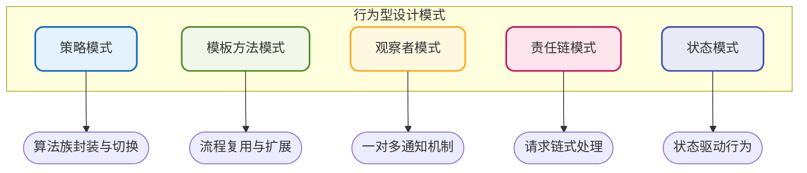
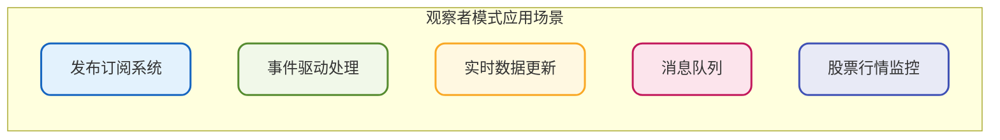
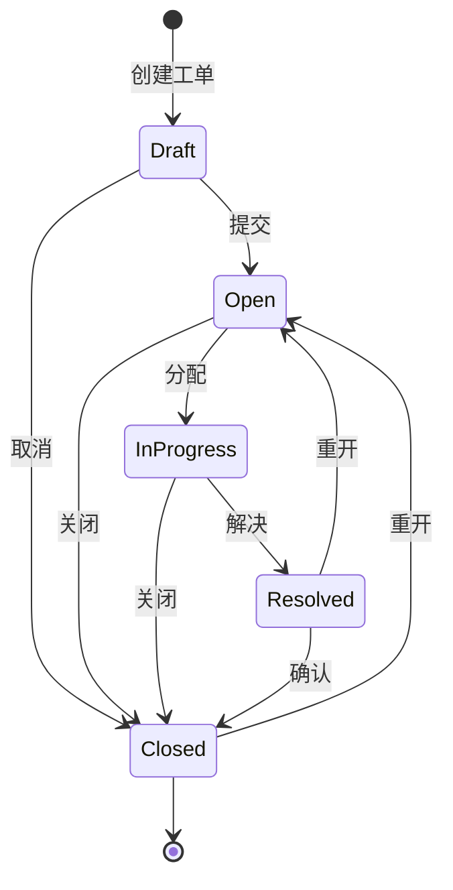
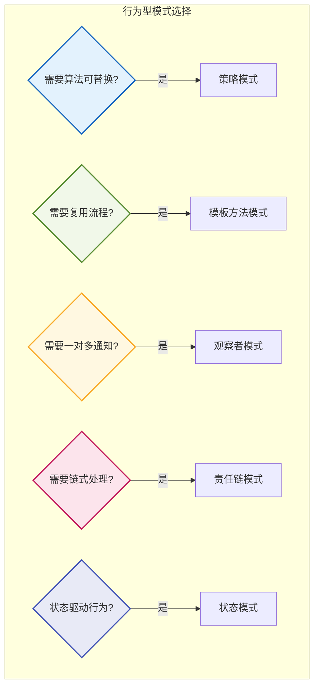

# 行为型设计模式实践

## 行为型模式概述

行为型设计模式关注对象之间的通信和职责分配。这类模式不仅描述对象或类的结构，更着重于它们之间的交互方式，使系统更加灵活和可扩展。

本章将详细介绍五种常用的行为型模式：策略模式、模板方法模式、观察者模式、责任链模式和状态模式。



## 策略模式

策略模式允许在运行时根据不同情况选择算法的不同实现。它将算法封装在独立的策略类中，使得它们可以相互替换，而不影响客户端的使用。

### 策略模式 vs if-else

策略模式相较于传统的if-else语句具有显著优势：

| 对比维度 | if-else | 策略模式 |
|---------|---------|---------|
| 可扩展性 | 需修改原有代码 | 只需添加新策略类 |
| 可读性 | 条件多时难以维护 | 职责清晰，易于理解 |
| 复用性 | 代码散落各处 | 策略可被多处复用 |
| 开闭原则 | 不符合 | 符合 |

### Spring环境下的策略模式实践

在实际项目中，策略模式通常会结合工厂模式和模板方法模式一起使用。以下是一个完整的物流配送策略示例：

```java
// 配送策略接口
public interface DeliveryStrategy {
    void deliver(DeliveryOrder order);
}
```

定义基础实现类，包含公共处理逻辑：

```java
// 配送策略基类（模板方法）
public abstract class AbstractDeliveryStrategy implements DeliveryStrategy {
    
    @Override
    public void deliver(DeliveryOrder order) {
        // 前置校验
        validateOrder(order);
        
        // 核心配送逻辑（由子类实现）
        doDeliver(order);
        
        // 后置处理
        sendNotification(order);
        recordDeliveryLog(order);
    }
    
    // 抽象方法，由子类实现具体配送逻辑
    protected abstract void doDeliver(DeliveryOrder order);
    
    protected void validateOrder(DeliveryOrder order) {
        if (order == null || order.getAddress() == null) {
            throw new IllegalArgumentException("订单信息不完整");
        }
    }
    
    protected void sendNotification(DeliveryOrder order) {
        // 发送配送通知
        System.out.println("发送配送通知: " + order.getOrderId());
    }
    
    protected void recordDeliveryLog(DeliveryOrder order) {
        // 记录配送日志
        System.out.println("记录配送日志: " + order.getOrderId());
    }
}
```

实现具体的配送策略：

```java
@Component("expressDeliveryStrategy")
public class ExpressDeliveryStrategy extends AbstractDeliveryStrategy {
    @Override
    protected void doDeliver(DeliveryOrder order) {
        System.out.println("使用快递配送方式处理订单: " + order.getOrderId());
        // 快递配送逻辑
    }
}

@Component("sameDayDeliveryStrategy")
public class SameDayDeliveryStrategy extends AbstractDeliveryStrategy {
    @Override
    protected void doDeliver(DeliveryOrder order) {
        System.out.println("使用当日达配送方式处理订单: " + order.getOrderId());
        // 当日达配送逻辑
    }
}

@Component("pickupDeliveryStrategy")
public class PickupDeliveryStrategy extends AbstractDeliveryStrategy {
    @Override
    protected void doDeliver(DeliveryOrder order) {
        System.out.println("使用自提方式处理订单: " + order.getOrderId());
        // 自提逻辑
    }
}
```

创建策略工厂：

```java
@Component
public class DeliveryStrategyFactory {
    
    @Autowired
    private Map<String, DeliveryStrategy> strategyMap = new ConcurrentHashMap<>();
    
    public DeliveryStrategy getStrategy(String deliveryType) {
        String beanName = deliveryType + "DeliveryStrategy";
        DeliveryStrategy strategy = strategyMap.get(beanName);
        if (strategy == null) {
            throw new IllegalArgumentException("不支持的配送方式: " + deliveryType);
        }
        return strategy;
    }
}
```

使用策略：

```java
@Service
public class DeliveryService {
    
    @Autowired
    private DeliveryStrategyFactory strategyFactory;
    
    public void processDelivery(DeliveryOrder order) {
        String deliveryType = order.getDeliveryType();
        DeliveryStrategy strategy = strategyFactory.getStrategy(deliveryType);
        strategy.deliver(order);
    }
}
```

:::tip Spring自动注入Map
当使用`@Autowired`注入Map类型时，Spring会自动将所有该类型的Bean注入到Map中，key为Bean的名称，value为Bean实例。
:::

## 模板方法模式

模板方法模式在父类中定义算法的骨架，将某些步骤的实现延迟到子类中。子类可以重写特定步骤，而不改变算法的整体结构。

### 核心思想

模板方法模式的核心是**代码复用**。当多个类存在相同的处理流程，但某些步骤的具体实现不同时，可以将公共流程抽取到父类，差异化部分由子类实现。

### 实现示例

以数据导出功能为例，不同格式的导出流程相似，但具体实现不同：

```java
// 数据导出模板
public abstract class DataExporter {
    
    // 模板方法，定义导出流程
    public final void export(ExportRequest request) {
        // 步骤1：校验请求参数
        validateRequest(request);
        
        // 步骤2：查询数据
        List<DataRecord> records = fetchData(request);
        
        // 步骤3：数据转换（子类实现）
        byte[] content = transformData(records);
        
        // 步骤4：写入文件（子类实现）
        writeFile(request.getFileName(), content);
        
        // 步骤5：发送通知
        notifyComplete(request);
    }
    
    // 公共方法：参数校验
    protected void validateRequest(ExportRequest request) {
        if (request == null || request.getQuery() == null) {
            throw new IllegalArgumentException("导出请求参数不完整");
        }
    }
    
    // 公共方法：数据查询
    protected List<DataRecord> fetchData(ExportRequest request) {
        // 查询数据库获取数据
        return Collections.emptyList();
    }
    
    // 抽象方法：数据转换（由子类实现）
    protected abstract byte[] transformData(List<DataRecord> records);
    
    // 抽象方法：写入文件（由子类实现）
    protected abstract void writeFile(String fileName, byte[] content);
    
    // 钩子方法：发送通知（子类可重写）
    protected void notifyComplete(ExportRequest request) {
        System.out.println("导出完成: " + request.getFileName());
    }
}
```

实现具体的导出器：

```java
// CSV格式导出器
public class CsvExporter extends DataExporter {
    
    @Override
    protected byte[] transformData(List<DataRecord> records) {
        StringBuilder sb = new StringBuilder();
        // 添加CSV头
        sb.append("ID,Name,Value\n");
        // 转换数据为CSV格式
        for (DataRecord record : records) {
            sb.append(record.getId()).append(",")
              .append(record.getName()).append(",")
              .append(record.getValue()).append("\n");
        }
        return sb.toString().getBytes(StandardCharsets.UTF_8);
    }
    
    @Override
    protected void writeFile(String fileName, byte[] content) {
        // 写入CSV文件
        System.out.println("写入CSV文件: " + fileName);
    }
}

// Excel格式导出器
public class ExcelExporter extends DataExporter {
    
    @Override
    protected byte[] transformData(List<DataRecord> records) {
        // 使用Apache POI转换为Excel格式
        System.out.println("转换数据为Excel格式");
        return new byte[0];
    }
    
    @Override
    protected void writeFile(String fileName, byte[] content) {
        // 写入Excel文件
        System.out.println("写入Excel文件: " + fileName);
    }
    
    @Override
    protected void notifyComplete(ExportRequest request) {
        // 重写通知方法，发送邮件通知
        System.out.println("发送邮件通知导出完成");
    }
}
```

使用示例：

```java
public class ExportDemo {
    public static void main(String[] args) {
        ExportRequest request = new ExportRequest();
        request.setFileName("report.csv");
        request.setQuery("SELECT * FROM orders");
        
        DataExporter csvExporter = new CsvExporter();
        csvExporter.export(request);
        
        request.setFileName("report.xlsx");
        DataExporter excelExporter = new ExcelExporter();
        excelExporter.export(request);
    }
}
```

## 观察者模式

观察者模式定义对象之间的一对多依赖关系，当一个对象（被观察者）状态发生变化时，所有依赖它的对象（观察者）都会收到通知并自动更新。

### 应用场景



### 实现示例

以商品价格监控系统为例：

```java
// 观察者接口
public interface PriceObserver {
    void onPriceChange(String productId, BigDecimal oldPrice, BigDecimal newPrice);
}

// 商品价格主题（被观察者）
public class ProductPriceSubject {
    private String productId;
    private BigDecimal currentPrice;
    private List<PriceObserver> observers = new ArrayList<>();
    
    public ProductPriceSubject(String productId, BigDecimal initialPrice) {
        this.productId = productId;
        this.currentPrice = initialPrice;
    }
    
    // 注册观察者
    public void addObserver(PriceObserver observer) {
        observers.add(observer);
    }
    
    // 移除观察者
    public void removeObserver(PriceObserver observer) {
        observers.remove(observer);
    }
    
    // 更新价格并通知所有观察者
    public void updatePrice(BigDecimal newPrice) {
        BigDecimal oldPrice = this.currentPrice;
        this.currentPrice = newPrice;
        notifyObservers(oldPrice, newPrice);
    }
    
    private void notifyObservers(BigDecimal oldPrice, BigDecimal newPrice) {
        for (PriceObserver observer : observers) {
            observer.onPriceChange(productId, oldPrice, newPrice);
        }
    }
    
    public BigDecimal getCurrentPrice() {
        return currentPrice;
    }
}
```

实现具体的观察者：

```java
// 价格下降通知观察者
public class PriceDropNotifier implements PriceObserver {
    
    @Override
    public void onPriceChange(String productId, BigDecimal oldPrice, BigDecimal newPrice) {
        if (newPrice.compareTo(oldPrice) < 0) {
            BigDecimal dropAmount = oldPrice.subtract(newPrice);
            System.out.println("商品[" + productId + "]降价通知：降幅 " + dropAmount);
            // 发送降价推送通知
            sendPushNotification(productId, dropAmount);
        }
    }
    
    private void sendPushNotification(String productId, BigDecimal dropAmount) {
        System.out.println("推送降价通知给关注该商品的用户");
    }
}

// 价格日志记录观察者
public class PriceLogRecorder implements PriceObserver {
    
    @Override
    public void onPriceChange(String productId, BigDecimal oldPrice, BigDecimal newPrice) {
        System.out.println("记录价格变更日志: 商品[" + productId + "] " + 
                          oldPrice + " -> " + newPrice);
        // 保存价格变更历史
        savePriceHistory(productId, oldPrice, newPrice);
    }
    
    private void savePriceHistory(String productId, BigDecimal oldPrice, BigDecimal newPrice) {
        // 保存到数据库
    }
}

// 库存预警观察者
public class InventoryAlertObserver implements PriceObserver {
    
    @Override
    public void onPriceChange(String productId, BigDecimal oldPrice, BigDecimal newPrice) {
        // 价格大幅下降可能导致销量增加，触发库存预警
        BigDecimal dropPercent = oldPrice.subtract(newPrice)
                                         .divide(oldPrice, 2, RoundingMode.HALF_UP);
        if (dropPercent.compareTo(new BigDecimal("0.2")) > 0) {
            System.out.println("商品[" + productId + "]降幅超过20%，请关注库存情况");
        }
    }
}
```

使用示例：

```java
public class PriceMonitorDemo {
    public static void main(String[] args) {
        // 创建商品价格主题
        ProductPriceSubject product = new ProductPriceSubject(
            "SKU-10086", new BigDecimal("199.00"));
        
        // 注册观察者
        product.addObserver(new PriceDropNotifier());
        product.addObserver(new PriceLogRecorder());
        product.addObserver(new InventoryAlertObserver());
        
        // 更新价格，自动触发所有观察者
        product.updatePrice(new BigDecimal("149.00"));
    }
}
```

## 责任链模式

责任链模式将请求的发送者与接收者解耦，将多个处理器组成一条链，请求沿着这条链传递，直到有一个处理器处理它为止。

### 应用场景

- **Web过滤器链**：Spring的FilterChain就是典型的责任链
- **审批流程**：多级审批的实现
- **日志处理器**：不同级别日志的处理
- **异常处理链**：统一异常处理机制
- **权限校验链**：多层次的权限验证

### 实现示例

以电商退款审批流程为例：

```java
// 退款请求
public class RefundRequest {
    private String orderId;
    private BigDecimal amount;
    private String reason;
    
    // getters and setters
}

// 退款处理器接口
public interface RefundHandler {
    void setNext(RefundHandler next);
    void handle(RefundRequest request);
}

// 抽象处理器基类
public abstract class AbstractRefundHandler implements RefundHandler {
    protected RefundHandler nextHandler;
    
    @Override
    public void setNext(RefundHandler next) {
        this.nextHandler = next;
    }
    
    protected void passToNext(RefundRequest request) {
        if (nextHandler != null) {
            nextHandler.handle(request);
        }
    }
}
```

实现具体的处理器：

```java
// 退款申请校验处理器
public class RefundValidationHandler extends AbstractRefundHandler {
    
    @Override
    public void handle(RefundRequest request) {
        System.out.println("【校验处理器】校验退款申请...");
        
        // 校验订单是否存在
        if (request.getOrderId() == null || request.getOrderId().isEmpty()) {
            throw new IllegalArgumentException("订单号不能为空");
        }
        
        // 校验退款金额
        if (request.getAmount().compareTo(BigDecimal.ZERO) <= 0) {
            throw new IllegalArgumentException("退款金额必须大于0");
        }
        
        System.out.println("【校验处理器】校验通过，传递给下一个处理器");
        passToNext(request);
    }
}

// 客服审核处理器（小额退款）
public class CustomerServiceHandler extends AbstractRefundHandler {
    private static final BigDecimal THRESHOLD = new BigDecimal("100");
    
    @Override
    public void handle(RefundRequest request) {
        System.out.println("【客服处理器】处理退款申请...");
        
        if (request.getAmount().compareTo(THRESHOLD) <= 0) {
            // 小额退款，客服直接审批
            System.out.println("【客服处理器】小额退款(<=100)，客服直接审批通过");
            approveRefund(request);
        } else {
            // 金额较大，传递给主管
            System.out.println("【客服处理器】金额超过100，传递给主管审批");
            passToNext(request);
        }
    }
    
    private void approveRefund(RefundRequest request) {
        System.out.println("退款审批通过，订单号: " + request.getOrderId());
    }
}

// 主管审核处理器（中额退款）
public class SupervisorHandler extends AbstractRefundHandler {
    private static final BigDecimal THRESHOLD = new BigDecimal("1000");
    
    @Override
    public void handle(RefundRequest request) {
        System.out.println("【主管处理器】处理退款申请...");
        
        if (request.getAmount().compareTo(THRESHOLD) <= 0) {
            System.out.println("【主管处理器】中额退款(<=1000)，主管审批通过");
            approveRefund(request);
        } else {
            System.out.println("【主管处理器】金额超过1000，传递给经理审批");
            passToNext(request);
        }
    }
    
    private void approveRefund(RefundRequest request) {
        System.out.println("退款审批通过，订单号: " + request.getOrderId());
    }
}

// 经理审核处理器（大额退款）
public class ManagerHandler extends AbstractRefundHandler {
    
    @Override
    public void handle(RefundRequest request) {
        System.out.println("【经理处理器】处理大额退款申请...");
        System.out.println("【经理处理器】大额退款，经理审批通过");
        approveRefund(request);
    }
    
    private void approveRefund(RefundRequest request) {
        System.out.println("退款审批通过，订单号: " + request.getOrderId());
    }
}
```

组装并使用责任链：

```java
public class RefundChainDemo {
    public static void main(String[] args) {
        // 创建处理器
        RefundHandler validationHandler = new RefundValidationHandler();
        RefundHandler customerServiceHandler = new CustomerServiceHandler();
        RefundHandler supervisorHandler = new SupervisorHandler();
        RefundHandler managerHandler = new ManagerHandler();
        
        // 组装责任链
        validationHandler.setNext(customerServiceHandler);
        customerServiceHandler.setNext(supervisorHandler);
        supervisorHandler.setNext(managerHandler);
        
        // 测试小额退款
        RefundRequest smallRefund = new RefundRequest();
        smallRefund.setOrderId("ORD-001");
        smallRefund.setAmount(new BigDecimal("50"));
        smallRefund.setReason("商品质量问题");
        
        System.out.println("=== 处理小额退款(50元) ===");
        validationHandler.handle(smallRefund);
        
        // 测试大额退款
        RefundRequest largeRefund = new RefundRequest();
        largeRefund.setOrderId("ORD-002");
        largeRefund.setAmount(new BigDecimal("2000"));
        largeRefund.setReason("批量退货");
        
        System.out.println("\n=== 处理大额退款(2000元) ===");
        validationHandler.handle(largeRefund);
    }
}
```

## 状态模式

状态模式允许对象在其内部状态改变时改变其行为，使对象看起来好像修改了自身的类。它将状态相关的行为封装在独立的状态类中。

### 应用场景

- **订单状态管理**：待支付、已支付、已发货、已签收等
- **工作流引擎**：流程节点状态流转
- **游戏角色状态**：待机、行走、攻击、受伤等
- **播放器状态**：播放、暂停、停止等

### 实现示例

以工单系统状态管理为例：

```java
// 工单状态接口
public interface TicketState {
    void submit(Ticket ticket);      // 提交
    void assign(Ticket ticket);      // 分配
    void resolve(Ticket ticket);     // 解决
    void close(Ticket ticket);       // 关闭
    void reopen(Ticket ticket);      // 重开
    String getStateName();           // 获取状态名称
}

// 工单实体
public class Ticket {
    private String ticketId;
    private String title;
    private TicketState state;
    
    public Ticket(String ticketId, String title) {
        this.ticketId = ticketId;
        this.title = title;
        // 初始状态为草稿
        this.state = new DraftState();
    }
    
    public void setState(TicketState state) {
        this.state = state;
    }
    
    public TicketState getState() {
        return state;
    }
    
    // 委托给状态对象处理
    public void submit() {
        state.submit(this);
    }
    
    public void assign() {
        state.assign(this);
    }
    
    public void resolve() {
        state.resolve(this);
    }
    
    public void close() {
        state.close(this);
    }
    
    public void reopen() {
        state.reopen(this);
    }
    
    public void printStatus() {
        System.out.println("工单[" + ticketId + "] 当前状态: " + state.getStateName());
    }
}
```

实现具体的状态类：

```java
// 草稿状态
public class DraftState implements TicketState {
    
    @Override
    public void submit(Ticket ticket) {
        System.out.println("工单已提交，等待分配处理人");
        ticket.setState(new OpenState());
    }
    
    @Override
    public void assign(Ticket ticket) {
        System.out.println("草稿状态不能直接分配，请先提交");
    }
    
    @Override
    public void resolve(Ticket ticket) {
        System.out.println("草稿状态不能解决，请先提交");
    }
    
    @Override
    public void close(Ticket ticket) {
        System.out.println("工单已取消");
        ticket.setState(new ClosedState());
    }
    
    @Override
    public void reopen(Ticket ticket) {
        System.out.println("草稿状态不需要重开");
    }
    
    @Override
    public String getStateName() {
        return "草稿";
    }
}

// 待处理状态
public class OpenState implements TicketState {
    
    @Override
    public void submit(Ticket ticket) {
        System.out.println("工单已处于待处理状态");
    }
    
    @Override
    public void assign(Ticket ticket) {
        System.out.println("工单已分配处理人，开始处理");
        ticket.setState(new InProgressState());
    }
    
    @Override
    public void resolve(Ticket ticket) {
        System.out.println("请先分配处理人");
    }
    
    @Override
    public void close(Ticket ticket) {
        System.out.println("工单已关闭");
        ticket.setState(new ClosedState());
    }
    
    @Override
    public void reopen(Ticket ticket) {
        System.out.println("工单已处于待处理状态");
    }
    
    @Override
    public String getStateName() {
        return "待处理";
    }
}

// 处理中状态
public class InProgressState implements TicketState {
    
    @Override
    public void submit(Ticket ticket) {
        System.out.println("工单正在处理中");
    }
    
    @Override
    public void assign(Ticket ticket) {
        System.out.println("重新分配处理人");
    }
    
    @Override
    public void resolve(Ticket ticket) {
        System.out.println("工单已解决，等待确认");
        ticket.setState(new ResolvedState());
    }
    
    @Override
    public void close(Ticket ticket) {
        System.out.println("工单已关闭");
        ticket.setState(new ClosedState());
    }
    
    @Override
    public void reopen(Ticket ticket) {
        System.out.println("工单正在处理中");
    }
    
    @Override
    public String getStateName() {
        return "处理中";
    }
}

// 已解决状态
public class ResolvedState implements TicketState {
    
    @Override
    public void submit(Ticket ticket) {
        System.out.println("工单已解决");
    }
    
    @Override
    public void assign(Ticket ticket) {
        System.out.println("工单已解决，无需重新分配");
    }
    
    @Override
    public void resolve(Ticket ticket) {
        System.out.println("工单已处于已解决状态");
    }
    
    @Override
    public void close(Ticket ticket) {
        System.out.println("确认解决，工单已关闭");
        ticket.setState(new ClosedState());
    }
    
    @Override
    public void reopen(Ticket ticket) {
        System.out.println("问题未解决，重新打开工单");
        ticket.setState(new OpenState());
    }
    
    @Override
    public String getStateName() {
        return "已解决";
    }
}

// 已关闭状态
public class ClosedState implements TicketState {
    
    @Override
    public void submit(Ticket ticket) {
        System.out.println("工单已关闭，不能提交");
    }
    
    @Override
    public void assign(Ticket ticket) {
        System.out.println("工单已关闭，不能分配");
    }
    
    @Override
    public void resolve(Ticket ticket) {
        System.out.println("工单已关闭");
    }
    
    @Override
    public void close(Ticket ticket) {
        System.out.println("工单已处于关闭状态");
    }
    
    @Override
    public void reopen(Ticket ticket) {
        System.out.println("重新打开工单");
        ticket.setState(new OpenState());
    }
    
    @Override
    public String getStateName() {
        return "已关闭";
    }
}
```

状态流转示意图：



使用示例：

```java
public class TicketStateDemo {
    public static void main(String[] args) {
        Ticket ticket = new Ticket("TK-001", "系统登录异常");
        
        ticket.printStatus();  // 草稿
        
        ticket.submit();
        ticket.printStatus();  // 待处理
        
        ticket.assign();
        ticket.printStatus();  // 处理中
        
        ticket.resolve();
        ticket.printStatus();  // 已解决
        
        ticket.reopen();       // 问题未解决，重开
        ticket.printStatus();  // 待处理
        
        ticket.assign();
        ticket.resolve();
        ticket.close();
        ticket.printStatus();  // 已关闭
    }
}
```

## 行为型模式选择指南



| 模式 | 适用场景 | 核心价值 |
|------|---------|---------|
| 策略模式 | 多种算法需要动态切换 | 算法封装，开闭原则 |
| 模板方法模式 | 流程固定，部分步骤可变 | 代码复用，流程标准化 |
| 观察者模式 | 一对多依赖，状态变化通知 | 解耦，事件驱动 |
| 责任链模式 | 多处理器依次处理 | 解耦，灵活组合 |
| 状态模式 | 状态决定行为 | 状态封装，转换清晰 |
