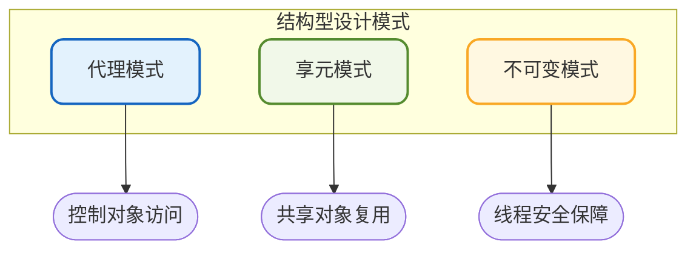
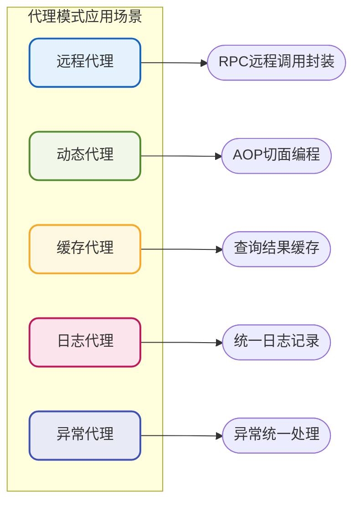
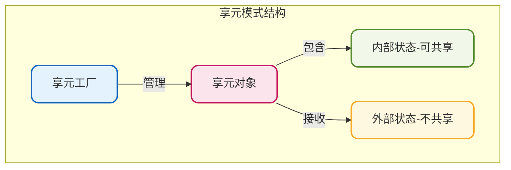
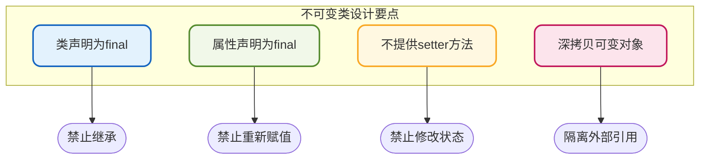
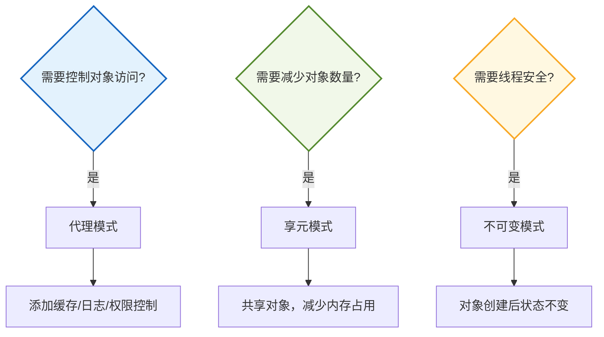

# 结构型设计模式应用

## 结构型模式概述

结构型设计模式关注类和对象的组合方式，通过定义类之间的关系，使系统结构更加清晰、灵活和可扩展。结构型模式帮助我们在保持系统灵活性的同时，简化系统的复杂性。

本章将深入探讨三种重要的结构型模式：代理模式、享元模式和不可变模式。



## 代理模式

代理模式通过创建代理对象来控制对原始对象的访问。代理对象充当原始对象的替身，客户端通过代理对象间接访问真实对象，并可在访问过程中添加额外的逻辑或控制。

### 代理模式的应用场景



**远程代理**：在分布式系统中代理远程对象，隐藏网络通信细节。如Dubbo的RPC调用，客户端像调用本地方法一样调用远程服务。

**动态代理**：运行时动态创建代理对象，将方法调用分派到不同的处理器。Spring AOP就是基于动态代理实现的。

**缓存代理**：缓存原始对象的计算结果，避免重复计算或资源访问。

**日志代理**：在代理层统一进行日志记录和管理。

**异常代理**：在代理层统一捕获和转换异常，实现错误码机制。

### 静态代理实现

以用户信息查询服务为例，演示如何通过代理添加缓存功能：

```java
// 用户服务接口
public interface UserService {
    UserInfo getUserById(Long userId);
    List<UserInfo> searchUsers(String keyword);
}

// 用户服务实现（真实对象）
public class UserServiceImpl implements UserService {
    
    @Override
    public UserInfo getUserById(Long userId) {
        // 模拟数据库查询，耗时操作
        System.out.println("从数据库查询用户信息: " + userId);
        try {
            Thread.sleep(100); // 模拟耗时
        } catch (InterruptedException e) {
            Thread.currentThread().interrupt();
        }
        return new UserInfo(userId, "用户" + userId);
    }
    
    @Override
    public List<UserInfo> searchUsers(String keyword) {
        // 模拟复杂搜索查询
        System.out.println("搜索用户: " + keyword);
        return Collections.singletonList(new UserInfo(1L, keyword));
    }
}
```

创建缓存代理：

```java
// 缓存代理
public class CachedUserServiceProxy implements UserService {
    private final UserService userService;
    private final Map<Long, UserInfo> userCache = new ConcurrentHashMap<>();
    private final Map<String, List<UserInfo>> searchCache = new ConcurrentHashMap<>();
    
    public CachedUserServiceProxy(UserService userService) {
        this.userService = userService;
    }
    
    @Override
    public UserInfo getUserById(Long userId) {
        // 先从缓存获取
        UserInfo cachedUser = userCache.get(userId);
        if (cachedUser != null) {
            System.out.println("从缓存获取用户信息: " + userId);
            return cachedUser;
        }
        
        // 缓存未命中，查询真实服务
        UserInfo user = userService.getUserById(userId);
        
        // 将结果放入缓存
        if (user != null) {
            userCache.put(userId, user);
        }
        
        return user;
    }
    
    @Override
    public List<UserInfo> searchUsers(String keyword) {
        // 检查搜索缓存
        List<UserInfo> cachedResult = searchCache.get(keyword);
        if (cachedResult != null) {
            System.out.println("从缓存获取搜索结果: " + keyword);
            return cachedResult;
        }
        
        // 执行实际搜索
        List<UserInfo> result = userService.searchUsers(keyword);
        
        // 缓存搜索结果（设置过期策略可进一步优化）
        searchCache.put(keyword, result);
        
        return result;
    }
    
    // 提供缓存清除方法
    public void clearCache() {
        userCache.clear();
        searchCache.clear();
    }
    
    public void evictUser(Long userId) {
        userCache.remove(userId);
    }
}
```

使用示例：

```java
public class ProxyDemo {
    public static void main(String[] args) {
        // 创建真实服务
        UserService realService = new UserServiceImpl();
        
        // 创建代理服务
        UserService cachedService = new CachedUserServiceProxy(realService);
        
        // 第一次查询，访问真实服务
        UserInfo user1 = cachedService.getUserById(1001L);
        System.out.println("查询结果: " + user1);
        
        System.out.println("---");
        
        // 第二次查询，命中缓存
        UserInfo user2 = cachedService.getUserById(1001L);
        System.out.println("查询结果: " + user2);
    }
}
```

### 结合AOP实现通用代理

在Spring项目中，可以结合AOP和自定义注解实现更优雅的代理：

```java
// 自定义缓存注解
@Target(ElementType.METHOD)
@Retention(RetentionPolicy.RUNTIME)
public @interface Cacheable {
    String key() default "";
    int expireSeconds() default 300;
}

// 缓存切面
@Aspect
@Component
public class CacheAspect {
    
    private final Map<String, Object> cache = new ConcurrentHashMap<>();
    
    @Around("@annotation(cacheable)")
    public Object around(ProceedingJoinPoint joinPoint, Cacheable cacheable) throws Throwable {
        // 生成缓存key
        String cacheKey = generateKey(joinPoint, cacheable.key());
        
        // 检查缓存
        Object cachedValue = cache.get(cacheKey);
        if (cachedValue != null) {
            return cachedValue;
        }
        
        // 执行原方法
        Object result = joinPoint.proceed();
        
        // 存入缓存
        if (result != null) {
            cache.put(cacheKey, result);
        }
        
        return result;
    }
    
    private String generateKey(ProceedingJoinPoint joinPoint, String keyExpression) {
        // 简化实现：方法名 + 参数值
        String methodName = joinPoint.getSignature().getName();
        Object[] args = joinPoint.getArgs();
        return methodName + ":" + Arrays.toString(args);
    }
}

// 使用注解
@Service
public class ProductService {
    
    @Cacheable(key = "product", expireSeconds = 600)
    public Product getProductById(Long productId) {
        // 执行数据库查询
        return productRepository.findById(productId);
    }
}
```

## 享元模式

享元模式通过共享技术有效地支持大量细粒度对象的复用，最大限度地减少内存使用和对象创建开销。

### 核心概念

享元模式将对象的状态分为两类：

- **内部状态（Intrinsic State）**：可以共享的不变状态
- **外部状态（Extrinsic State）**：不可共享的变化状态



### 典型应用

- **Java字符串池**：String对象使用享元模式，相同内容的字符串共享同一对象
- **数据库连接池**：复用数据库连接对象
- **线程池**：复用线程对象
- **常量池**：Integer等包装类的缓存池

### 实现示例

以游戏中的图形元素渲染为例，游戏场景中包含大量相似的图形元素，使用享元模式减少对象创建：

```java
// 图形元素接口
public interface GraphicElement {
    void render(int x, int y);  // 外部状态：坐标位置
}

// 具体图形元素（享元对象）
public class TreeElement implements GraphicElement {
    // 内部状态：树的类型（可共享）
    private final String treeType;
    private final String texture;
    private final int height;
    
    public TreeElement(String treeType, String texture, int height) {
        this.treeType = treeType;
        this.texture = texture;
        this.height = height;
        System.out.println("创建树元素: " + treeType);
    }
    
    @Override
    public void render(int x, int y) {
        // 使用外部状态（坐标）和内部状态（类型、纹理）进行渲染
        System.out.println("在坐标(" + x + "," + y + ")渲染" + treeType + 
                          "，纹理: " + texture + "，高度: " + height);
    }
}

public class RockElement implements GraphicElement {
    private final String rockType;
    private final String color;
    
    public RockElement(String rockType, String color) {
        this.rockType = rockType;
        this.color = color;
        System.out.println("创建岩石元素: " + rockType);
    }
    
    @Override
    public void render(int x, int y) {
        System.out.println("在坐标(" + x + "," + y + ")渲染" + rockType + 
                          "岩石，颜色: " + color);
    }
}
```

创建享元工厂：

```java
// 图形元素工厂（享元工厂）
public class GraphicElementFactory {
    private static final Map<String, GraphicElement> elements = new HashMap<>();
    
    public static GraphicElement getTree(String treeType) {
        String key = "tree_" + treeType;
        GraphicElement element = elements.get(key);
        
        if (element == null) {
            // 根据类型创建不同的树
            switch (treeType) {
                case "oak":
                    element = new TreeElement("橡树", "oak_texture.png", 15);
                    break;
                case "pine":
                    element = new TreeElement("松树", "pine_texture.png", 20);
                    break;
                case "maple":
                    element = new TreeElement("枫树", "maple_texture.png", 12);
                    break;
                default:
                    element = new TreeElement("普通树", "default_texture.png", 10);
            }
            elements.put(key, element);
        }
        
        return element;
    }
    
    public static GraphicElement getRock(String rockType) {
        String key = "rock_" + rockType;
        GraphicElement element = elements.get(key);
        
        if (element == null) {
            switch (rockType) {
                case "granite":
                    element = new RockElement("花岗岩", "灰色");
                    break;
                case "marble":
                    element = new RockElement("大理石", "白色");
                    break;
                default:
                    element = new RockElement("普通石", "褐色");
            }
            elements.put(key, element);
        }
        
        return element;
    }
    
    public static int getCacheSize() {
        return elements.size();
    }
}
```

使用示例：

```java
public class FlyweightDemo {
    public static void main(String[] args) {
        // 模拟渲染森林场景：1000棵树
        Random random = new Random();
        String[] treeTypes = {"oak", "pine", "maple"};
        
        System.out.println("=== 渲染森林 ===");
        for (int i = 0; i < 1000; i++) {
            String type = treeTypes[random.nextInt(treeTypes.length)];
            GraphicElement tree = GraphicElementFactory.getTree(type);
            tree.render(random.nextInt(1000), random.nextInt(1000));
        }
        
        System.out.println("\n=== 渲染岩石 ===");
        String[] rockTypes = {"granite", "marble"};
        for (int i = 0; i < 500; i++) {
            String type = rockTypes[random.nextInt(rockTypes.length)];
            GraphicElement rock = GraphicElementFactory.getRock(type);
            rock.render(random.nextInt(1000), random.nextInt(1000));
        }
        
        System.out.println("\n=== 统计 ===");
        System.out.println("渲染了1500个图形元素");
        System.out.println("实际创建的对象数量: " + GraphicElementFactory.getCacheSize());
    }
}
```

### Java中的享元模式应用

Java的`Integer`类使用了享元模式，缓存了-128到127范围内的整数对象：

```java
// Integer源码中的缓存实现
public static Integer valueOf(int i) {
    if (i >= IntegerCache.low && i <= IntegerCache.high)
        return IntegerCache.cache[i + (-IntegerCache.low)];
    return new Integer(i);
}

private static class IntegerCache {
    static final int low = -128;
    static final int high = 127;
    static final Integer cache[];
    
    static {
        cache = new Integer[(high - low) + 1];
        int j = low;
        for(int k = 0; k < cache.length; k++)
            cache[k] = new Integer(j++);
    }
}
```

:::warning 包装类作为锁对象的陷阱
由于享元模式的存在，使用Integer等包装类作为锁对象可能导致意外的同步问题：

```java
class LockDemo {
    private Long lockA = Long.valueOf(1);
    private Long lockB = Long.valueOf(1);
    
    void methodA() {
        synchronized (lockA) {
            // lockA和lockB可能是同一个对象！
        }
    }
    
    void methodB() {
        synchronized (lockB) {
            // 可能与methodA互相阻塞
        }
    }
}
```

在-128到127范围内，`Long.valueOf()`返回的是缓存中的同一个对象，导致看似不同的锁实际上是同一个对象。
:::

## 不可变模式

不可变模式是一种通过禁止对象状态修改来解决并发问题的设计模式。不可变对象一旦创建，其状态就不能再改变，从而天然具备线程安全性。

### 不可变类的设计原则



设计不可变类需要遵循以下规则：

1. **类使用final修饰**：防止子类重写方法改变不可变性
2. **所有属性使用final修饰**：保证属性只能赋值一次
3. **不提供setter方法**：禁止修改属性值
4. **对可变对象属性进行深拷贝**：避免外部引用修改内部状态

### Java中的不可变类

Java中的`String`、`Long`、`Integer`等类都是不可变类：

```java
// String类的不可变性设计
public final class String implements java.io.Serializable {
    private final char value[];  // final数组，引用不可变
    
    // 字符替换返回新对象，不修改原对象
    public String replace(char oldChar, char newChar) {
        if (oldChar != newChar) {
            int len = value.length;
            char[] buf = new char[len];  // 创建新数组
            // ... 复制并替换
            return new String(buf, true);  // 返回新String对象
        }
        return this;
    }
}
```

### 自定义不可变类

创建一个不可变的交易记录类：

```java
// 不可变的交易记录
public final class Transaction {
    private final String transactionId;
    private final BigDecimal amount;
    private final LocalDateTime timestamp;
    private final String fromAccount;
    private final String toAccount;
    private final List<String> tags;  // 可变集合需要特殊处理
    
    public Transaction(String transactionId, BigDecimal amount, 
                       LocalDateTime timestamp, String fromAccount, 
                       String toAccount, List<String> tags) {
        this.transactionId = transactionId;
        this.amount = amount;
        this.timestamp = timestamp;
        this.fromAccount = fromAccount;
        this.toAccount = toAccount;
        // 对可变集合进行防御性拷贝
        this.tags = tags == null ? 
            Collections.emptyList() : 
            Collections.unmodifiableList(new ArrayList<>(tags));
    }
    
    // 只提供getter方法
    public String getTransactionId() {
        return transactionId;
    }
    
    public BigDecimal getAmount() {
        return amount;
    }
    
    public LocalDateTime getTimestamp() {
        return timestamp;
    }
    
    public String getFromAccount() {
        return fromAccount;
    }
    
    public String getToAccount() {
        return toAccount;
    }
    
    public List<String> getTags() {
        // 返回不可变视图
        return tags;
    }
    
    // 提供"修改"方法，实际上返回新对象
    public Transaction addTag(String newTag) {
        List<String> newTags = new ArrayList<>(this.tags);
        newTags.add(newTag);
        return new Transaction(
            this.transactionId, this.amount, this.timestamp,
            this.fromAccount, this.toAccount, newTags
        );
    }
    
    public Transaction withAmount(BigDecimal newAmount) {
        return new Transaction(
            this.transactionId, newAmount, this.timestamp,
            this.fromAccount, this.toAccount, this.tags
        );
    }
}
```

### 不可变模式与享元模式结合

不可变对象的"修改"操作会创建新对象，可能导致内存开销。通过享元模式可以缓存常用的不可变对象：

```java
// 货币金额不可变类
public final class Money {
    private final BigDecimal amount;
    private final String currency;
    
    // 常用金额缓存
    private static final Map<String, Money> CACHE = new ConcurrentHashMap<>();
    
    private Money(BigDecimal amount, String currency) {
        this.amount = amount;
        this.currency = currency;
    }
    
    // 工厂方法，对常用金额使用缓存
    public static Money of(BigDecimal amount, String currency) {
        // 对整数金额进行缓存
        if (amount.scale() == 0 && 
            amount.compareTo(BigDecimal.ZERO) >= 0 && 
            amount.compareTo(new BigDecimal("1000")) <= 0) {
            String key = amount.toPlainString() + "_" + currency;
            return CACHE.computeIfAbsent(key, 
                k -> new Money(amount, currency));
        }
        return new Money(amount, currency);
    }
    
    // 常用货币快捷方法
    public static Money cny(BigDecimal amount) {
        return of(amount, "CNY");
    }
    
    public static Money usd(BigDecimal amount) {
        return of(amount, "USD");
    }
    
    public BigDecimal getAmount() {
        return amount;
    }
    
    public String getCurrency() {
        return currency;
    }
    
    public Money add(Money other) {
        if (!this.currency.equals(other.currency)) {
            throw new IllegalArgumentException("货币类型不匹配");
        }
        return of(this.amount.add(other.amount), this.currency);
    }
    
    public Money multiply(int factor) {
        return of(this.amount.multiply(BigDecimal.valueOf(factor)), 
                  this.currency);
    }
}
```

### 不可变模式的注意事项

**属性类型也需要不可变**：

```java
// 错误示例：final修饰的引用类型属性可能被修改
final class Person {
    private final Address address;  // Address如果是可变的，状态仍可被修改
    
    public Person(Address address) {
        this.address = address;
    }
    
    public Address getAddress() {
        return address;  // 外部可以通过返回的引用修改Address
    }
}

// 正确做法：对可变属性进行深拷贝
final class Person {
    private final Address address;
    
    public Person(Address address) {
        // 入参深拷贝
        this.address = address == null ? null : address.clone();
    }
    
    public Address getAddress() {
        // 返回深拷贝
        return address == null ? null : address.clone();
    }
}
```

## 结构型模式选择指南

| 模式 | 适用场景 | 核心价值 |
|------|---------|---------|
| 代理模式 | 控制对象访问、增强功能 | 解耦、AOP支持 |
| 享元模式 | 大量相似对象、内存优化 | 对象复用、节省资源 |
| 不可变模式 | 多线程环境、值对象 | 线程安全、状态可靠 |



## 最佳实践总结

1. **代理模式**适合需要在不修改原有代码的情况下增加功能的场景，如缓存、日志、权限控制等
2. **享元模式**适合存在大量相似对象的场景，通过共享内部状态来减少内存占用
3. **不可变模式**适合多线程环境下的值对象设计，通过禁止修改来保证线程安全
4. 这三种模式可以组合使用：不可变对象可以安全地被享元模式共享，代理模式可以对享元对象进行访问控制
