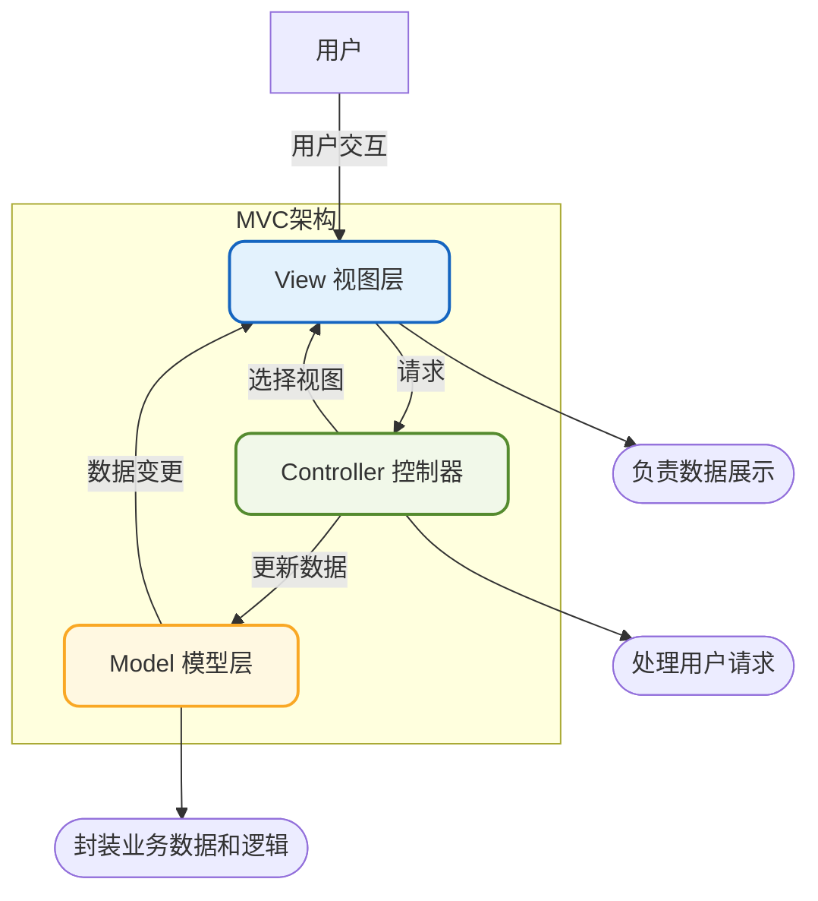
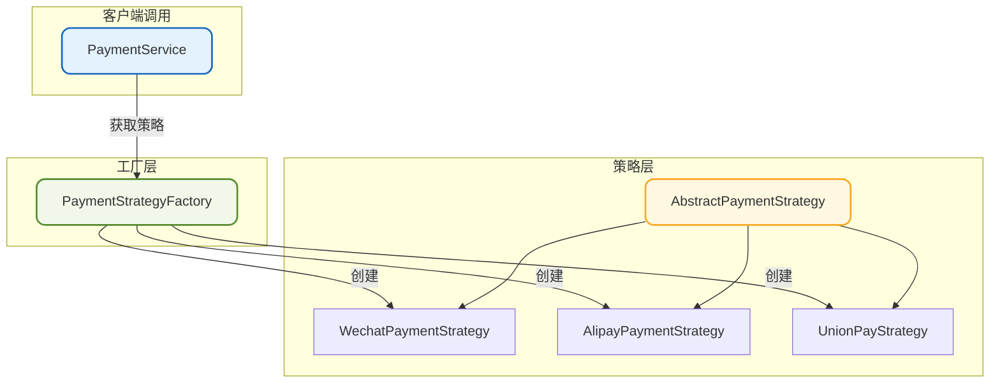
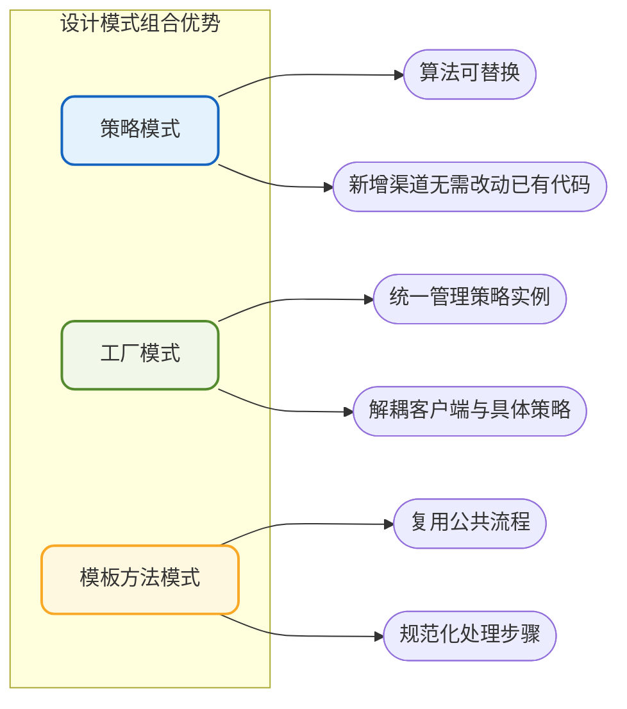

# MVC架构模式与设计模式实战

## MVC架构模式

MVC（Model-View-Controller）是一种经典的软件架构模式，它将应用程序划分为三个核心部分：模型、视图和控制器。这种分离使得应用程序的表现层与业务逻辑解耦，极大地提升了代码的可维护性和可测试性。

### MVC三层架构



### 各层职责

**模型层（Model）**

模型层代表应用程序的核心数据和业务逻辑。它包含数据结构、业务规则以及数据的存储和检索逻辑。模型层不关心数据如何展示，只专注于数据本身及其处理规则。

```java
// 模型层示例：用户领域模型
public class User {
    private Long id;
    private String username;
    private String email;
    private UserStatus status;
    
    // 业务方法
    public void activate() {
        if (this.status == UserStatus.PENDING) {
            this.status = UserStatus.ACTIVE;
        } else {
            throw new IllegalStateException("只有待激活用户才能激活");
        }
    }
    
    public void deactivate() {
        if (this.status == UserStatus.ACTIVE) {
            this.status = UserStatus.INACTIVE;
        }
    }
    
    // getters and setters
}
```

**视图层（View）**

视图层负责数据的可视化呈现。它从模型获取数据并以用户友好的方式展示，同时接收用户的输入操作。视图层不包含业务逻辑，只负责展示和交互。

```java
// 视图层示例：用户信息展示（以JSON响应为例）
public class UserVO {
    private Long id;
    private String displayName;
    private String email;
    private String statusText;
    
    public static UserVO fromUser(User user) {
        UserVO vo = new UserVO();
        vo.setId(user.getId());
        vo.setDisplayName(user.getUsername());
        vo.setEmail(maskEmail(user.getEmail()));
        vo.setStatusText(user.getStatus().getDescription());
        return vo;
    }
    
    private static String maskEmail(String email) {
        // 邮箱脱敏处理
        if (email == null || !email.contains("@")) {
            return email;
        }
        int atIndex = email.indexOf("@");
        return email.substring(0, Math.min(3, atIndex)) + "***" + email.substring(atIndex);
    }
}
```

**控制器层（Controller）**

控制器层作为模型和视图之间的协调者，接收用户输入，调用模型进行业务处理，并选择合适的视图返回结果。控制器负责请求的路由和流程控制。

```java
// 控制器层示例
@RestController
@RequestMapping("/api/users")
public class UserController {
    
    @Autowired
    private UserService userService;
    
    @GetMapping("/{id}")
    public ResponseEntity<UserVO> getUser(@PathVariable Long id) {
        User user = userService.findById(id);
        if (user == null) {
            return ResponseEntity.notFound().build();
        }
        return ResponseEntity.ok(UserVO.fromUser(user));
    }
    
    @PostMapping("/{id}/activate")
    public ResponseEntity<Void> activateUser(@PathVariable Long id) {
        userService.activateUser(id);
        return ResponseEntity.ok().build();
    }
}
```

### MVC的核心价值

1. **关注点分离**：将展示、控制和数据分离，每层只专注于自己的职责
2. **提升可维护性**：修改一层不会影响其他层，降低维护成本
3. **促进团队协作**：前端和后端可以并行开发，互不干扰
4. **增强可测试性**：各层可以独立进行单元测试
5. **支持代码复用**：模型和视图可以在多个控制器中复用

## 设计模式组合实战

在实际项目中，我们很少单独使用某一种设计模式，而是将多种模式组合使用，发挥各自的优势。下面通过一个完整的支付系统案例，展示如何综合运用策略模式、工厂模式和模板方法模式。

### 场景分析

假设我们需要开发一个支付系统，需要支持多种支付渠道（微信、支付宝、银联等），每种渠道的支付流程大致相同，但具体实现不同。

### 整体架构设计



### 代码实现

**定义支付请求和响应**

```java
// 支付请求
public class PaymentRequest {
    private String orderId;
    private BigDecimal amount;
    private String payChannel;    // wechat, alipay, unionpay
    private String userId;
    private Map<String, String> extraParams;
    
    // getters and setters
}

// 支付响应
public class PaymentResult {
    private boolean success;
    private String transactionId;
    private String message;
    private String payUrl;        // 支付跳转链接或二维码
    
    public static PaymentResult success(String transactionId, String payUrl) {
        PaymentResult result = new PaymentResult();
        result.setSuccess(true);
        result.setTransactionId(transactionId);
        result.setPayUrl(payUrl);
        return result;
    }
    
    public static PaymentResult fail(String message) {
        PaymentResult result = new PaymentResult();
        result.setSuccess(false);
        result.setMessage(message);
        return result;
    }
    
    // getters and setters
}
```

**定义策略接口和模板抽象类**

```java
// 支付策略接口
public interface PaymentStrategy {
    PaymentResult pay(PaymentRequest request);
    PaymentResult query(String transactionId);
    PaymentResult refund(String transactionId, BigDecimal amount);
}

// 支付策略抽象基类（模板方法）
public abstract class AbstractPaymentStrategy implements PaymentStrategy {
    
    @Autowired
    protected PaymentLogService logService;
    
    @Autowired
    protected RiskControlService riskService;
    
    @Override
    public final PaymentResult pay(PaymentRequest request) {
        // 步骤1：参数校验
        validateRequest(request);
        
        // 步骤2：风控检查
        checkRisk(request);
        
        // 步骤3：记录支付请求日志
        logService.logPaymentRequest(request);
        
        // 步骤4：执行支付（由子类实现）
        PaymentResult result = doPayment(request);
        
        // 步骤5：记录支付结果日志
        logService.logPaymentResult(request.getOrderId(), result);
        
        // 步骤6：后置处理
        postPayment(request, result);
        
        return result;
    }
    
    // 抽象方法：具体支付逻辑由子类实现
    protected abstract PaymentResult doPayment(PaymentRequest request);
    
    // 抽象方法：查询支付状态
    protected abstract PaymentResult doQuery(String transactionId);
    
    // 抽象方法：执行退款
    protected abstract PaymentResult doRefund(String transactionId, BigDecimal amount);
    
    // 模板方法：参数校验（可重写）
    protected void validateRequest(PaymentRequest request) {
        if (request == null) {
            throw new IllegalArgumentException("支付请求不能为空");
        }
        if (request.getOrderId() == null || request.getOrderId().isEmpty()) {
            throw new IllegalArgumentException("订单号不能为空");
        }
        if (request.getAmount() == null || 
            request.getAmount().compareTo(BigDecimal.ZERO) <= 0) {
            throw new IllegalArgumentException("支付金额必须大于0");
        }
    }
    
    // 模板方法：风控检查
    protected void checkRisk(PaymentRequest request) {
        boolean passed = riskService.check(request.getUserId(), request.getAmount());
        if (!passed) {
            throw new PaymentException("风控检查未通过");
        }
    }
    
    // 钩子方法：支付后置处理（子类可重写）
    protected void postPayment(PaymentRequest request, PaymentResult result) {
        // 默认空实现，子类可重写
    }
    
    @Override
    public PaymentResult query(String transactionId) {
        logService.logQuery(transactionId);
        return doQuery(transactionId);
    }
    
    @Override
    public PaymentResult refund(String transactionId, BigDecimal amount) {
        logService.logRefundRequest(transactionId, amount);
        PaymentResult result = doRefund(transactionId, amount);
        logService.logRefundResult(transactionId, result);
        return result;
    }
}
```

**实现具体支付策略**

```java
// 微信支付策略
@Component("wechatPaymentStrategy")
public class WechatPaymentStrategy extends AbstractPaymentStrategy {
    
    @Autowired
    private WechatPayClient wechatClient;
    
    @Override
    protected PaymentResult doPayment(PaymentRequest request) {
        try {
            // 构建微信支付请求
            WechatPayRequest wxRequest = new WechatPayRequest();
            wxRequest.setOutTradeNo(request.getOrderId());
            wxRequest.setTotalFee(request.getAmount()
                .multiply(new BigDecimal("100")).intValue()); // 微信金额单位为分
            wxRequest.setBody("商品购买");
            
            // 调用微信支付接口
            WechatPayResponse wxResponse = wechatClient.unifiedOrder(wxRequest);
            
            if (wxResponse.isSuccess()) {
                return PaymentResult.success(
                    wxResponse.getTransactionId(),
                    wxResponse.getCodeUrl()
                );
            } else {
                return PaymentResult.fail(wxResponse.getErrMsg());
            }
        } catch (Exception e) {
            return PaymentResult.fail("微信支付异常: " + e.getMessage());
        }
    }
    
    @Override
    protected PaymentResult doQuery(String transactionId) {
        WechatQueryResponse response = wechatClient.queryOrder(transactionId);
        // 转换响应
        return convertQueryResponse(response);
    }
    
    @Override
    protected PaymentResult doRefund(String transactionId, BigDecimal amount) {
        WechatRefundResponse response = wechatClient.refund(
            transactionId, 
            amount.multiply(new BigDecimal("100")).intValue()
        );
        return convertRefundResponse(response);
    }
    
    @Override
    protected void postPayment(PaymentRequest request, PaymentResult result) {
        // 微信支付特有的后置处理：发送支付消息到消息队列
        if (result.isSuccess()) {
            messageService.sendPaymentMessage(request.getOrderId(), "WECHAT");
        }
    }
    
    private PaymentResult convertQueryResponse(WechatQueryResponse response) {
        // 响应转换逻辑
        return null;
    }
    
    private PaymentResult convertRefundResponse(WechatRefundResponse response) {
        // 响应转换逻辑
        return null;
    }
}

// 支付宝支付策略
@Component("alipayPaymentStrategy")
public class AlipayPaymentStrategy extends AbstractPaymentStrategy {
    
    @Autowired
    private AlipayClient alipayClient;
    
    @Override
    protected PaymentResult doPayment(PaymentRequest request) {
        try {
            AlipayTradeRequest alipayRequest = new AlipayTradeRequest();
            alipayRequest.setOutTradeNo(request.getOrderId());
            alipayRequest.setTotalAmount(request.getAmount().toString());
            alipayRequest.setSubject("商品购买");
            
            AlipayTradeResponse response = alipayClient.pagePay(alipayRequest);
            
            if (response.isSuccess()) {
                return PaymentResult.success(
                    response.getTradeNo(),
                    response.getPayUrl()
                );
            } else {
                return PaymentResult.fail(response.getSubMsg());
            }
        } catch (Exception e) {
            return PaymentResult.fail("支付宝支付异常: " + e.getMessage());
        }
    }
    
    @Override
    protected PaymentResult doQuery(String transactionId) {
        // 支付宝查询实现
        return null;
    }
    
    @Override
    protected PaymentResult doRefund(String transactionId, BigDecimal amount) {
        // 支付宝退款实现
        return null;
    }
}

// 银联支付策略
@Component("unionpayPaymentStrategy")
public class UnionPayStrategy extends AbstractPaymentStrategy {
    
    @Override
    protected PaymentResult doPayment(PaymentRequest request) {
        // 银联支付实现
        return null;
    }
    
    @Override
    protected PaymentResult doQuery(String transactionId) {
        // 银联查询实现
        return null;
    }
    
    @Override
    protected PaymentResult doRefund(String transactionId, BigDecimal amount) {
        // 银联退款实现
        return null;
    }
}
```

**创建策略工厂**

```java
// 支付策略工厂
@Component
public class PaymentStrategyFactory {
    
    @Autowired
    private Map<String, PaymentStrategy> strategyMap = new ConcurrentHashMap<>();
    
    public PaymentStrategy getStrategy(String payChannel) {
        String beanName = payChannel + "PaymentStrategy";
        PaymentStrategy strategy = strategyMap.get(beanName);
        
        if (strategy == null) {
            throw new UnsupportedOperationException("不支持的支付渠道: " + payChannel);
        }
        
        return strategy;
    }
    
    public Set<String> getSupportedChannels() {
        return strategyMap.keySet().stream()
            .map(name -> name.replace("PaymentStrategy", ""))
            .collect(Collectors.toSet());
    }
}
```

**创建支付服务**

```java
// 支付服务（对外统一入口）
@Service
public class PaymentService {
    
    @Autowired
    private PaymentStrategyFactory strategyFactory;
    
    public PaymentResult pay(PaymentRequest request) {
        PaymentStrategy strategy = strategyFactory.getStrategy(request.getPayChannel());
        return strategy.pay(request);
    }
    
    public PaymentResult queryPayment(String payChannel, String transactionId) {
        PaymentStrategy strategy = strategyFactory.getStrategy(payChannel);
        return strategy.query(transactionId);
    }
    
    public PaymentResult refund(String payChannel, String transactionId, 
                                BigDecimal amount) {
        PaymentStrategy strategy = strategyFactory.getStrategy(payChannel);
        return strategy.refund(transactionId, amount);
    }
}
```

**控制器层调用**

```java
@RestController
@RequestMapping("/api/payment")
public class PaymentController {
    
    @Autowired
    private PaymentService paymentService;
    
    @PostMapping("/pay")
    public ResponseEntity<PaymentResult> pay(@RequestBody PaymentRequest request) {
        PaymentResult result = paymentService.pay(request);
        return ResponseEntity.ok(result);
    }
    
    @GetMapping("/query/{channel}/{transactionId}")
    public ResponseEntity<PaymentResult> query(
            @PathVariable String channel,
            @PathVariable String transactionId) {
        PaymentResult result = paymentService.queryPayment(channel, transactionId);
        return ResponseEntity.ok(result);
    }
    
    @PostMapping("/refund")
    public ResponseEntity<PaymentResult> refund(
            @RequestParam String channel,
            @RequestParam String transactionId,
            @RequestParam BigDecimal amount) {
        PaymentResult result = paymentService.refund(channel, transactionId, amount);
        return ResponseEntity.ok(result);
    }
}
```

### 模式组合的优势



1. **策略模式**：将不同支付渠道的实现封装为独立的策略类，支持运行时动态切换
2. **工厂模式**：统一管理策略实例的创建和获取，客户端无需知道具体策略类
3. **模板方法模式**：抽取公共的支付流程（校验、风控、日志），确保流程规范化

### 扩展新支付渠道

当需要接入新的支付渠道时，只需：

1. 创建新的策略类继承`AbstractPaymentStrategy`
2. 实现`doPayment`、`doQuery`、`doRefund`方法
3. 使用`@Component`注解并按规范命名

```java
// 接入Apple Pay
@Component("applepayPaymentStrategy")
public class ApplePayStrategy extends AbstractPaymentStrategy {
    
    @Override
    protected PaymentResult doPayment(PaymentRequest request) {
        // Apple Pay支付实现
        return null;
    }
    
    @Override
    protected PaymentResult doQuery(String transactionId) {
        // Apple Pay查询实现
        return null;
    }
    
    @Override
    protected PaymentResult doRefund(String transactionId, BigDecimal amount) {
        // Apple Pay退款实现
        return null;
    }
}
```

无需修改任何现有代码，完美符合开闭原则！

## 设计模式选型建议

在实际项目中选择设计模式时，可以参考以下原则：

### 选择时机

| 场景 | 推荐模式 |
|------|---------|
| 需要全局唯一实例 | 单例模式 |
| 对象创建过程复杂 | 工厂模式 |
| 多种算法可替换 | 策略模式 |
| 流程固定步骤可变 | 模板方法模式 |
| 一对多通知 | 观察者模式 |
| 多处理器链式处理 | 责任链模式 |
| 状态驱动行为 | 状态模式 |
| 控制对象访问 | 代理模式 |
| 对象复用节省资源 | 享元模式 |
| 多线程数据安全 | 不可变模式 |

### 避免过度设计

设计模式是解决问题的工具，而非炫技手段。在使用设计模式时需要注意：

- **简单问题不要复杂化**：如果if-else能清晰解决，不一定要用策略模式
- **先实现后重构**：可以先用简单方式实现，后续根据实际需求引入设计模式
- **团队理解成本**：选择团队成员都熟悉的模式，降低沟通和维护成本
- **性能考量**：某些模式可能带来额外开销，需要权衡利弊

### 持续改进

设计模式的应用是一个持续改进的过程：

1. 识别代码中的坏味道（重复代码、过长方法、过大类等）
2. 分析是否有合适的设计模式可以解决
3. 小步重构，逐步引入设计模式
4. 持续评审和优化

## 总结

设计模式是软件开发中的宝贵经验总结，合理运用设计模式能够：

- 提升代码的可读性和可维护性
- 增强系统的扩展性和灵活性
- 促进团队成员之间的有效沟通
- 降低系统变更带来的风险

掌握设计模式不仅仅是记住每种模式的定义和实现，更重要的是理解其背后的设计思想，在实际项目中灵活运用，解决具体的业务问题。
