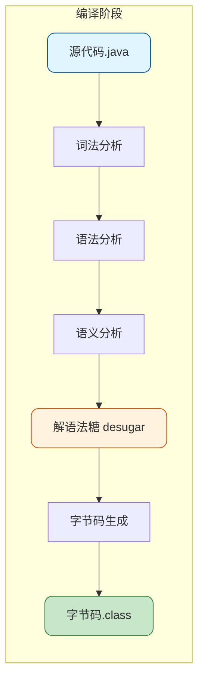
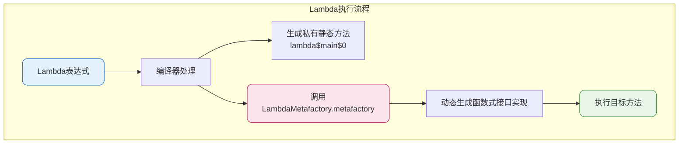
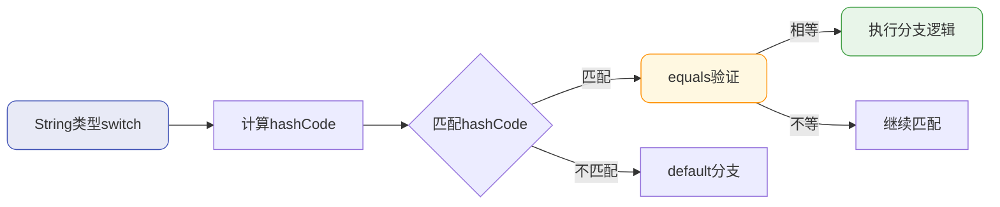
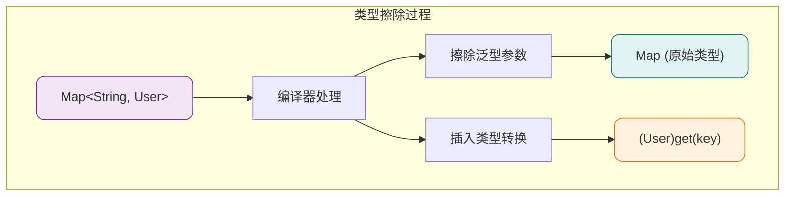
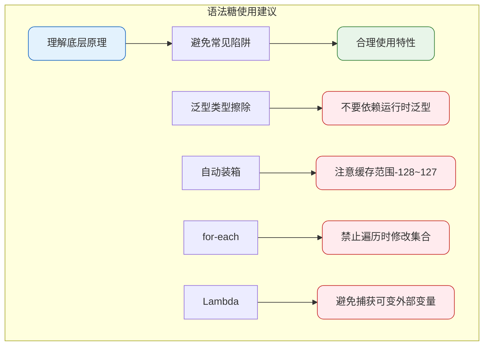

# Lambda表达式与语法糖机制详解

## 语法糖概述

语法糖（Syntactic Sugar）是编程语言中一种特殊的语法设计，它不会为语言增加新功能，但能让代码更加简洁、易读。Java虚拟机本身并不直接支持这些语法糖，编译器会在编译阶段将其转换为基础语法结构，这个过程称为**解语法糖（Desugaring）**。

在Java编译器源码`com.sun.tools.javac.main.JavaCompiler`的`compile()`方法中，有一个关键步骤就是调用`desugar()`方法完成解语法糖操作。



## Lambda表达式实现原理

### Lambda的本质

很多人认为Lambda表达式是匿名内部类的语法糖，这个说法并不准确。**Lambda表达式确实是语法糖，但它的实现机制与匿名内部类完全不同**。

关键区别在于：匿名内部类编译后会生成额外的class文件（如`OuterClass$1.class`），而包含Lambda表达式的类编译后只有一个class文件。

### 底层实现分析

让我们通过一个商品处理的例子来分析Lambda的实现：

```java
public class ProductProcessor {
    public static void main(String[] args) {
        List<String> products = Arrays.asList("手机", "电脑", "平板", "耳机");
        
        // 使用Lambda遍历商品
        products.forEach(product -> { System.out.println(product); });
    }
}
```

反编译后的代码结构如下：

```java
public class ProductProcessor {
    public static void main(String[] args) {
        List<String> products = Arrays.asList("手机", "电脑", "平板", "耳机");
        
        products.forEach((Consumer<String>)LambdaMetafactory.metafactory(
            null, null, null, 
            (Ljava/lang/Object;)V, 
            lambda$main$0(java.lang.String), 
            (Ljava/lang/String;)V)());
    }
    
    private static void lambda$main$0(String product) {
        System.out.println(product);
    }
}
```



### 复杂Lambda的处理

当代码中包含多个Lambda表达式时，编译器会为每个Lambda生成对应的静态方法：

```java
public class OrderService {
    public static void main(String[] args) {
        List<Order> orders = getOrderList();
        
        // 过滤已支付订单
        List<Order> paidOrders = orders.stream()
            .filter(order -> order.getStatus().equals("PAID"))
            .collect(Collectors.toList());
        
        // 打印订单信息
        paidOrders.forEach(order -> { System.out.println(order.getOrderNo()); });
    }
}
```

反编译结果显示，两个Lambda分别对应`lambda$main$0`和`lambda$main$1`两个方法：

```java
private static boolean lambda$main$0(Order order) {
    return order.getStatus().equals("PAID");
}

private static void lambda$main$1(Order order) {
    System.out.println(order.getOrderNo());
}
```

**核心要点**：Lambda表达式的实现依赖于`java.lang.invoke.LambdaMetafactory` API，编译器在解语法糖阶段将Lambda转换为对该API的调用，同时生成对应的私有静态方法来承载业务逻辑。

## 常见语法糖详解

### switch支持String与枚举

Java 7开始，switch语句支持String类型。其底层实现是通过`hashCode()`和`equals()`方法的组合：

```java
public class PaymentRouter {
    public void route(String paymentType) {
        switch (paymentType) {
            case "ALIPAY":
                System.out.println("支付宝支付");
                break;
            case "WECHAT":
                System.out.println("微信支付");
                break;
            case "UNIONPAY":
                System.out.println("银联支付");
                break;
            default:
                System.out.println("未知支付方式");
        }
    }
}
```

解语法糖后：

```java
public void route(String paymentType) {
    String temp = paymentType;
    switch(temp.hashCode()) {
        case 1723012045:  // "ALIPAY".hashCode()
            if(temp.equals("ALIPAY"))
                System.out.println("支付宝支付");
            break;
        case 1724839782:  // "WECHAT".hashCode()
            if(temp.equals("WECHAT"))
                System.out.println("微信支付");
            break;
        // ...其他分支
    }
}
```



使用`equals()`进行二次验证是必要的，因为不同字符串可能产生相同的hashCode（哈希碰撞）。

### 泛型与类型擦除

Java的泛型采用 **类型擦除（Type Erasure）** 机制实现。编译后，泛型类型参数会被替换为其上界类型（默认为Object）。

```java
// 编译前
public class CacheManager {
    private Map<String, User> userCache = new HashMap<>();
    
    public void put(String key, User user) {
        userCache.put(key, user);
    }
    
    public User get(String key) {
        return userCache.get(key);
    }
}
```

类型擦除后：

```java
// 编译后
public class CacheManager {
    private Map userCache = new HashMap();
    
    public void put(String key, User user) {
        userCache.put(key, user);
    }
    
    public User get(String key) {
        return (User)userCache.get(key);  // 自动添加类型转换
    }
}
```



**泛型的陷阱**：

1. **重载冲突**：`method(List<String>)` 和 `method(List<Integer>)` 无法同时存在，因为擦除后签名相同
2. **静态变量共享**：同一泛型类的不同类型实例共享静态变量
3. **异常处理限制**：泛型类型不能用于catch语句

### 自动装箱与拆箱

基本类型与包装类型之间的自动转换是通过调用特定方法实现的：

```java
public class ScoreCalculator {
    public void calculate() {
        Integer totalScore = 0;   // 自动装箱
        int bonus = totalScore;   // 自动拆箱
        
        totalScore = totalScore + 10;  // 拆箱运算后再装箱
    }
}
```

解语法糖后：

```java
public class ScoreCalculator {
    public void calculate() {
        Integer totalScore = Integer.valueOf(0);    // valueOf完成装箱
        int bonus = totalScore.intValue();          // intValue完成拆箱
        
        totalScore = Integer.valueOf(totalScore.intValue() + 10);
    }
}
```

**整数缓存陷阱**：

```java
Integer x = 100;
Integer y = 100;
System.out.println(x == y);  // true，使用缓存对象

Integer a = 200;
Integer b = 200;
System.out.println(a == b);  // false，超出缓存范围
```

Integer对-128到127范围内的值进行了缓存，超出该范围每次都会创建新对象。

### 可变参数

可变参数在编译时转换为数组：

```java
public class MessageSender {
    public void send(String... receivers) {
        for (String receiver : receivers) {
            System.out.println("发送给: " + receiver);
        }
    }
    
    public static void main(String[] args) {
        MessageSender sender = new MessageSender();
        sender.send("用户A", "用户B", "用户C");
    }
}
```

解语法糖后：

```java
public void send(String[] receivers) {
    for (int i = 0; i < receivers.length; i++) {
        System.out.println("发送给: " + receivers[i]);
    }
}

public static void main(String[] args) {
    MessageSender sender = new MessageSender();
    sender.send(new String[]{"用户A", "用户B", "用户C"});
}
```

### 增强for循环

for-each循环会根据遍历对象类型转换为不同的基础结构：

```java
public class InventoryChecker {
    public void check() {
        // 数组遍历
        String[] warehouses = {"北京仓", "上海仓", "广州仓"};
        for (String warehouse : warehouses) {
            System.out.println(warehouse);
        }
        
        // 集合遍历
        List<String> items = Arrays.asList("商品A", "商品B");
        for (String item : items) {
            System.out.println(item);
        }
    }
}
```

解语法糖后：

```java
public void check() {
    // 数组转为普通for循环
    String[] warehouses = {"北京仓", "上海仓", "广州仓"};
    for (int i = 0; i < warehouses.length; i++) {
        String warehouse = warehouses[i];
        System.out.println(warehouse);
    }
    
    // 集合转为迭代器
    List<String> items = Arrays.asList("商品A", "商品B");
    for (Iterator<String> iterator = items.iterator(); iterator.hasNext(); ) {
        String item = iterator.next();
        System.out.println(item);
    }
}
```

**ConcurrentModificationException陷阱**：在for-each中修改集合会抛出异常，应使用`Iterator.remove()`方法。

### try-with-resources

Java 7引入的自动资源管理语法，可以确保资源被正确关闭：

```java
public class FileProcessor {
    public void process(String filePath) {
        try (BufferedReader reader = new BufferedReader(new FileReader(filePath))) {
            String line;
            while ((line = reader.readLine()) != null) {
                System.out.println(line);
            }
        } catch (IOException e) {
            e.printStackTrace();
        }
    }
}
```

编译器会自动生成资源关闭的finally块，并正确处理异常的抑制机制。

### 枚举类型

枚举本质上是一个继承自`java.lang.Enum`的final类：

```java
public enum OrderStatus {
    PENDING, PAID, SHIPPED, DELIVERED
}
```

解语法糖后：

```java
public final class OrderStatus extends Enum<OrderStatus> {
    public static final OrderStatus PENDING;
    public static final OrderStatus PAID;
    public static final OrderStatus SHIPPED;
    public static final OrderStatus DELIVERED;
    
    private static final OrderStatus[] VALUES;
    
    static {
        PENDING = new OrderStatus("PENDING", 0);
        PAID = new OrderStatus("PAID", 1);
        SHIPPED = new OrderStatus("SHIPPED", 2);
        DELIVERED = new OrderStatus("DELIVERED", 3);
        VALUES = new OrderStatus[]{PENDING, PAID, SHIPPED, DELIVERED};
    }
    
    private OrderStatus(String name, int ordinal) {
        super(name, ordinal);
    }
}
```

### 条件编译

通过final常量的if条件实现条件编译：

```java
public class FeatureToggle {
    public static void main(String[] args) {
        final boolean DEBUG_MODE = false;
        final boolean PRODUCTION = true;
        
        if (DEBUG_MODE) {
            System.out.println("调试信息输出");
        }
        
        if (PRODUCTION) {
            System.out.println("生产环境运行");
        }
    }
}
```

编译后，DEBUG_MODE为false的分支会被完全移除：

```java
public static void main(String[] args) {
    System.out.println("生产环境运行");
}
```

## 语法糖使用注意事项



掌握语法糖的实现原理，不仅能写出更优雅的代码，还能在遇到相关问题时快速定位原因。语法糖本质上是编译器提供的便利，最终都会转换为JVM能够识别的基础结构。
