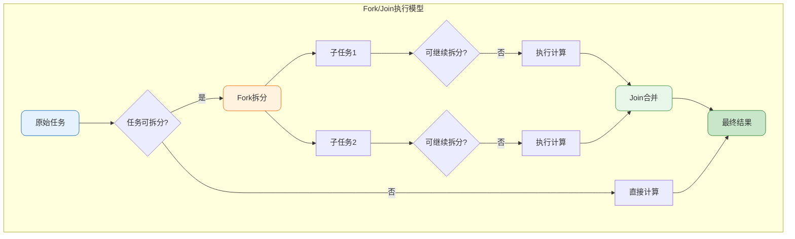
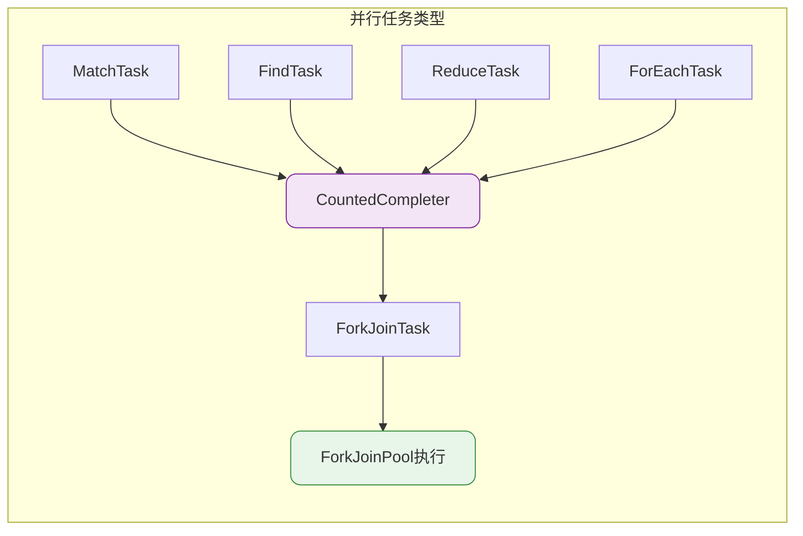
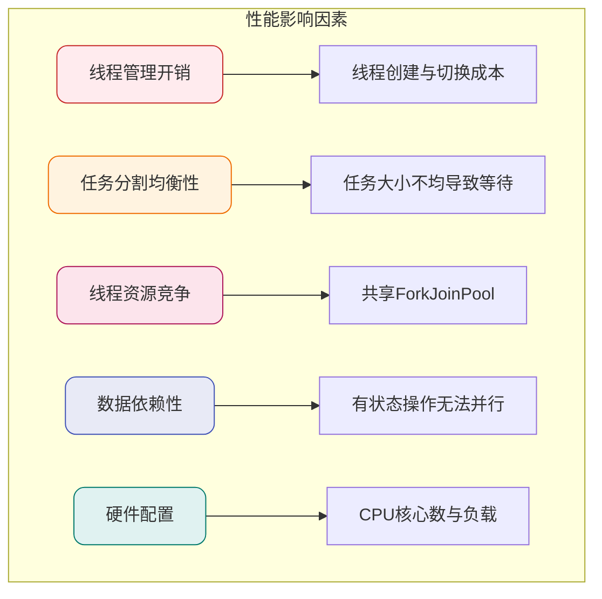
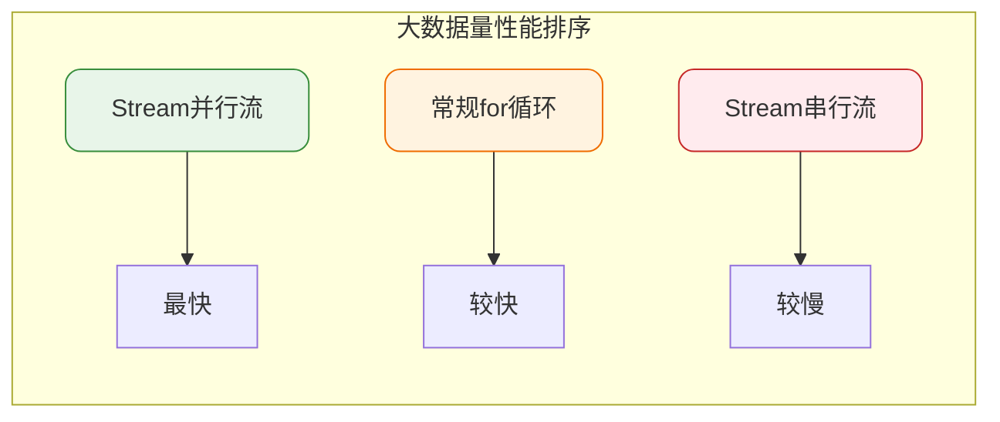
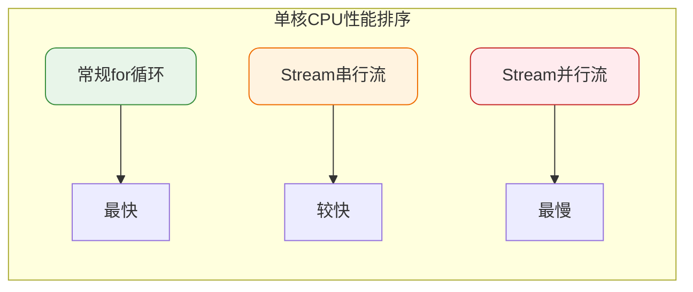
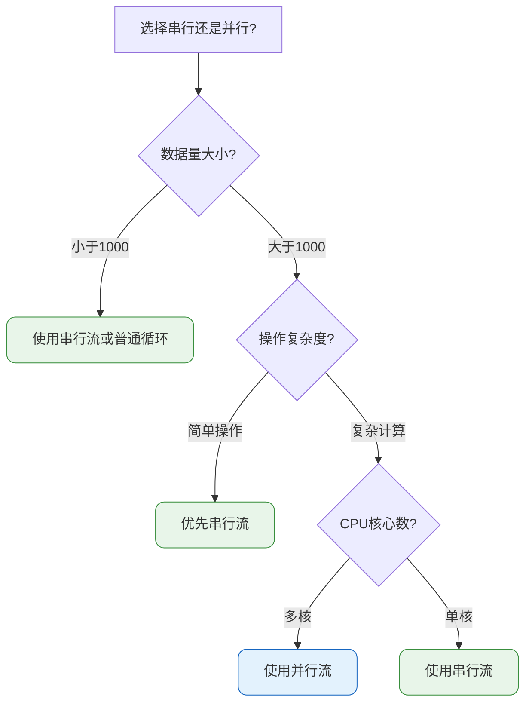
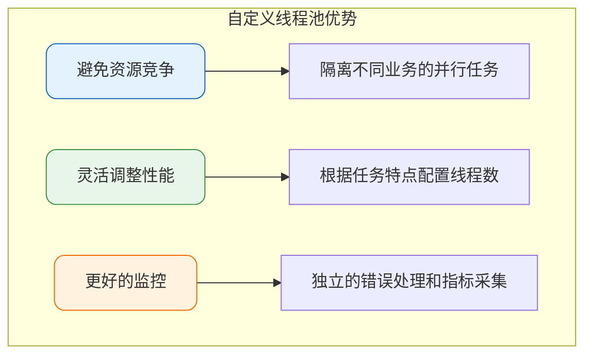
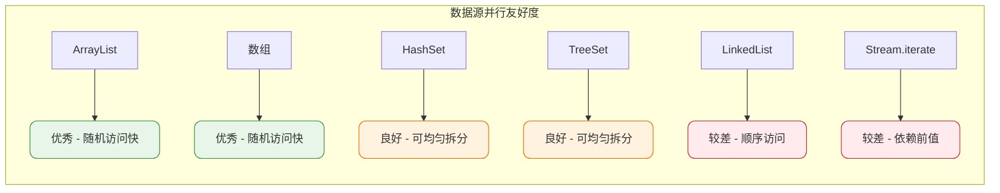

# Stream并行流原理与性能优化

## 并行流概述

Java 8的Stream API不仅提供了便捷的数据处理方式，还内置了并行处理能力。通过并行流（Parallel Stream），开发者可以轻松利用多核CPU的计算能力，无需手动管理线程。

```java
public class DataAnalyzer {
    public void analyze() {
        List<SalesRecord> records = getSalesRecords();
        
        // 串行流处理
        Stream<SalesRecord> serialStream = records.stream();
        
        // 并行流处理
        Stream<SalesRecord> parallelStream = records.parallelStream();
        
        // 串行流转并行流
        Stream<SalesRecord> converted = records.stream().parallel();
    }
}
```

## Fork/Join框架实现原理

并行流底层基于Java 7引入的**Fork/Join框架**实现。该框架采用分治策略：将大任务递归拆分为小任务，分配到多个线程并行执行，最后合并结果。



### 源码层面分析

以Stream的`reduce`操作为例，查看其内部实现（`ReferencePipeline`类）：

```java
@Override
public final Optional<P_OUT> reduce(BinaryOperator<P_OUT> accumulator) {
    return evaluate(ReduceOps.makeRef(accumulator));
}

final <R> R evaluate(TerminalOp<E_OUT, R> terminalOp) {
    if (linkedOrConsumed)
        throw new IllegalStateException("stream has already been operated upon or closed");
    linkedOrConsumed = true;
    
    // 根据是否并行流选择不同执行路径
    return isParallel()
           ? terminalOp.evaluateParallel(this, sourceSpliterator(terminalOp.getOpFlags()))
           : terminalOp.evaluateSequential(this, sourceSpliterator(terminalOp.getOpFlags()));
}
```

当`isParallel()`返回true时，执行`evaluateParallel`方法。不同的终端操作对应不同的Task实现：



这些Task都继承自`CountedCompleter`，而`CountedCompleter`是`ForkJoinTask`的子类：

```java
public abstract class CountedCompleter<T> extends ForkJoinTask<T> {
    // 实现任务的拆分与合并逻辑
}
```

## 并行流性能分析

### 影响性能的关键因素

并行流并非总是比串行流更快，其性能受多种因素制约：



### 性能对比实验结论

根据不同场景下的性能测试，得出以下结论：

#### 场景一：多核CPU + 小数据量

数据规模约100个元素时的处理效率：


**原因分析**：数据量小时，并行化的线程调度开销超过了并行处理带来的收益。

#### 场景二：多核CPU + 大数据量

数据规模达到1亿级别时：



**原因分析**：大数据量能够充分发挥多核并行的优势，Fork/Join的任务拆分开销被分摊。

#### 场景三：单核CPU环境

无论数据量大小：



**原因分析**：单核环境下无法实现真正的并行，线程切换反而增加了额外开销。

### 操作复杂度的影响

对于计算密集型操作，并行流优势更明显：

```java
public class ComputeIntensiveTask {
    
    // 复杂计算：并行流明显更快
    public void complexOperation(List<DataPoint> data) {
        long start = System.currentTimeMillis();
        
        List<Result> results = data.parallelStream()
            .map(this::heavyComputation)  // 每个元素需要大量计算
            .collect(Collectors.toList());
        
        System.out.println("耗时: " + (System.currentTimeMillis() - start) + "ms");
    }
    
    // 简单操作：串行流可能更快
    public void simpleOperation(List<String> items) {
        List<Integer> lengths = items.stream()  // 使用串行流
            .map(String::length)  // 简单操作
            .collect(Collectors.toList());
    }
    
    private Result heavyComputation(DataPoint point) {
        // 模拟复杂计算
        // ...
        return new Result();
    }
}
```

## 性能优化建议

### 选择策略总结



核心原则：
- **数据量较小**（几十到几百个元素）：直接使用普通循环或串行流
- **简单操作**：优先串行流，避免并行化开销
- **复杂计算 + 大数据量 + 多核环境**：使用并行流
- **单核环境**：始终使用串行流

### 使用自定义ForkJoinPool

默认情况下，所有并行流共享一个公共的`ForkJoinPool`，其线程数等于`Runtime.getRuntime().availableProcessors() - 1`。在某些场景下需要使用自定义线程池：

```java
public class CustomPoolExample {
    
    public void processWithCustomPool(List<Transaction> transactions) {
        // 创建自定义ForkJoinPool，指定4个线程
        ForkJoinPool customPool = new ForkJoinPool(4);
        
        try {
            // 在自定义线程池中执行并行流操作
            List<TransactionReport> reports = customPool.submit(() ->
                transactions.parallelStream()
                    .filter(t -> t.getAmount().compareTo(BigDecimal.ZERO) > 0)
                    .map(this::generateReport)
                    .collect(Collectors.toList())
            ).get();
            
            System.out.println("处理完成，共 " + reports.size() + " 条报告");
            
        } catch (InterruptedException | ExecutionException e) {
            Thread.currentThread().interrupt();
            throw new RuntimeException("并行处理失败", e);
        } finally {
            customPool.shutdown();
        }
    }
    
    private TransactionReport generateReport(Transaction transaction) {
        // 生成交易报告
        return new TransactionReport(transaction);
    }
}
```

使用自定义线程池的优势：



### 避免有状态操作

并行流中应避免使用有状态的中间操作或共享可变状态：

```java
public class StatefulProblem {
    
    // 错误示例：共享可变状态
    public void badExample(List<Integer> numbers) {
        List<Integer> result = new ArrayList<>();  // 非线程安全
        
        numbers.parallelStream().forEach(n -> {
            if (n > 10) {
                result.add(n);  // 并发修改，可能丢数据或抛异常
            }
        });
    }
    
    // 正确示例：使用collect收集
    public void goodExample(List<Integer> numbers) {
        List<Integer> result = numbers.parallelStream()
            .filter(n -> n > 10)
            .collect(Collectors.toList());  // 线程安全的收集
    }
}
```

### 选择合适的数据源

不同数据源的可拆分性影响并行效率：



## 实战应用场景

### 批量数据处理

```java
public class BatchProcessor {
    
    private static final int BATCH_SIZE = 10000;
    
    public void processBigData(List<RawData> bigDataList) {
        // 大数据量复杂处理，适合并行流
        List<ProcessedData> results = bigDataList.parallelStream()
            .filter(this::isValidData)
            .map(this::enrichData)
            .map(this::transformData)
            .map(this::validateResult)
            .collect(Collectors.toList());
        
        // 分批写入数据库
        for (int i = 0; i < results.size(); i += BATCH_SIZE) {
            List<ProcessedData> batch = results.subList(i, 
                Math.min(i + BATCH_SIZE, results.size()));
            batchInsert(batch);
        }
    }
    
    private boolean isValidData(RawData data) { /* 校验逻辑 */ return true; }
    private RawData enrichData(RawData data) { /* 数据补充 */ return data; }
    private ProcessedData transformData(RawData data) { /* 转换逻辑 */ return new ProcessedData(); }
    private ProcessedData validateResult(ProcessedData data) { /* 结果校验 */ return data; }
    private void batchInsert(List<ProcessedData> batch) { /* 批量入库 */ }
}
```

### 聚合计算

```java
public class StatisticsCalculator {
    
    public SalesSummary calculateStatistics(List<SalesOrder> orders) {
        // 使用并行流进行多维度统计
        DoubleSummaryStatistics amountStats = orders.parallelStream()
            .mapToDouble(o -> o.getTotalAmount().doubleValue())
            .summaryStatistics();
        
        Map<String, Long> countByCategory = orders.parallelStream()
            .collect(Collectors.groupingByConcurrent(
                SalesOrder::getCategory,
                Collectors.counting()
            ));
        
        Map<String, Double> sumByRegion = orders.parallelStream()
            .collect(Collectors.groupingByConcurrent(
                SalesOrder::getRegion,
                Collectors.summingDouble(o -> o.getTotalAmount().doubleValue())
            ));
        
        return new SalesSummary(amountStats, countByCategory, sumByRegion);
    }
}
```

## 总结

并行流是Java为开发者提供的高效并行处理工具，但使用时需要考虑具体场景：

| 场景 | 推荐方案 |
|------|----------|
| 小数据量（< 1000） | 普通循环或串行流 |
| 简单操作 | 串行流 |
| 复杂计算 + 大数据 + 多核 | 并行流 |
| 单核CPU | 串行流 |
| 需要隔离的并行任务 | 自定义ForkJoinPool |

理解并行流的底层实现原理，结合实际业务场景进行选择，才能真正发挥其性能优势。盲目使用并行流可能适得其反，增加系统复杂度的同时还降低了性能。
