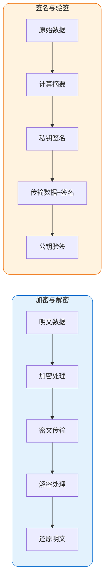
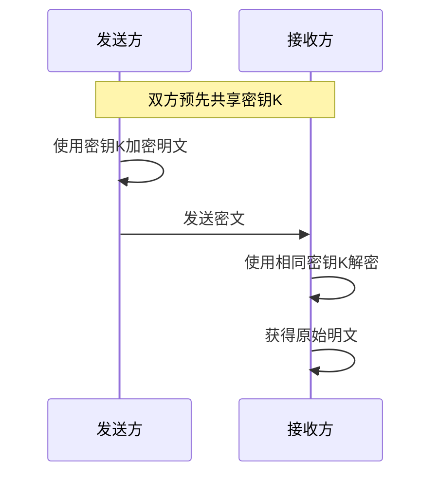
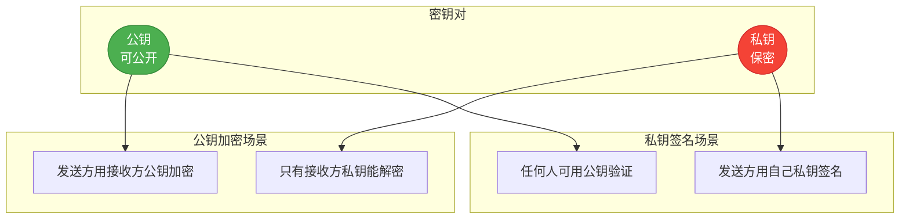
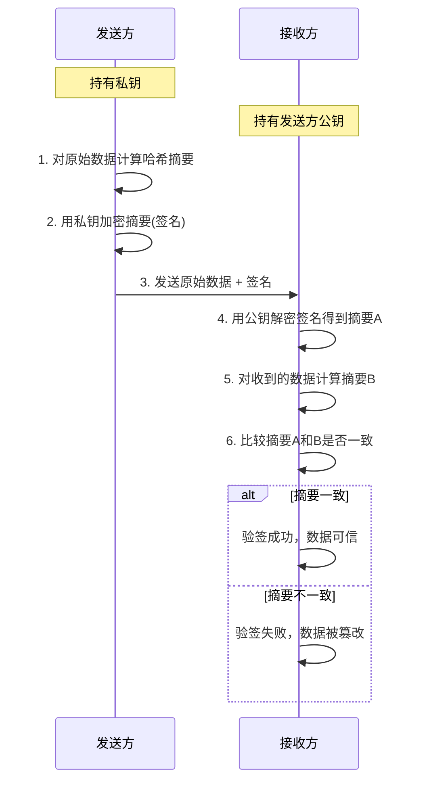
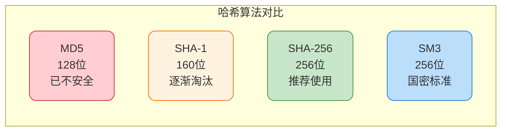
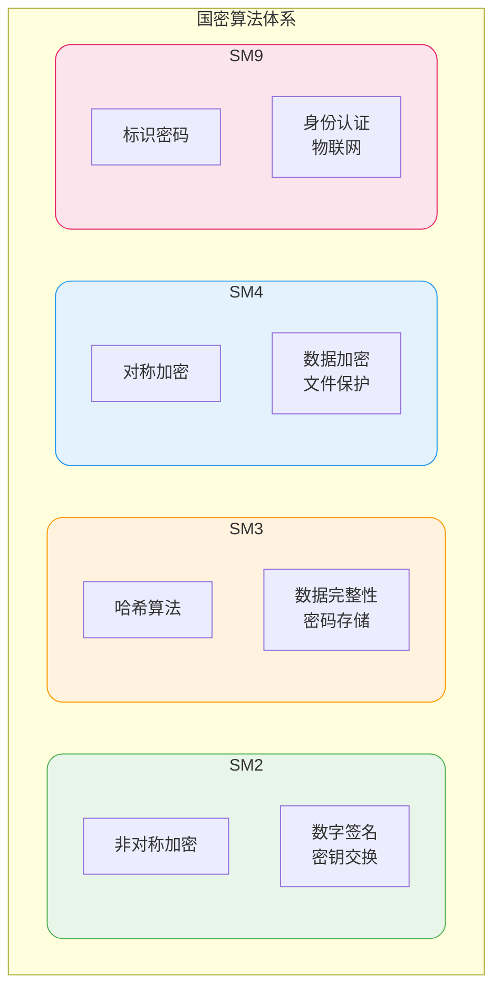
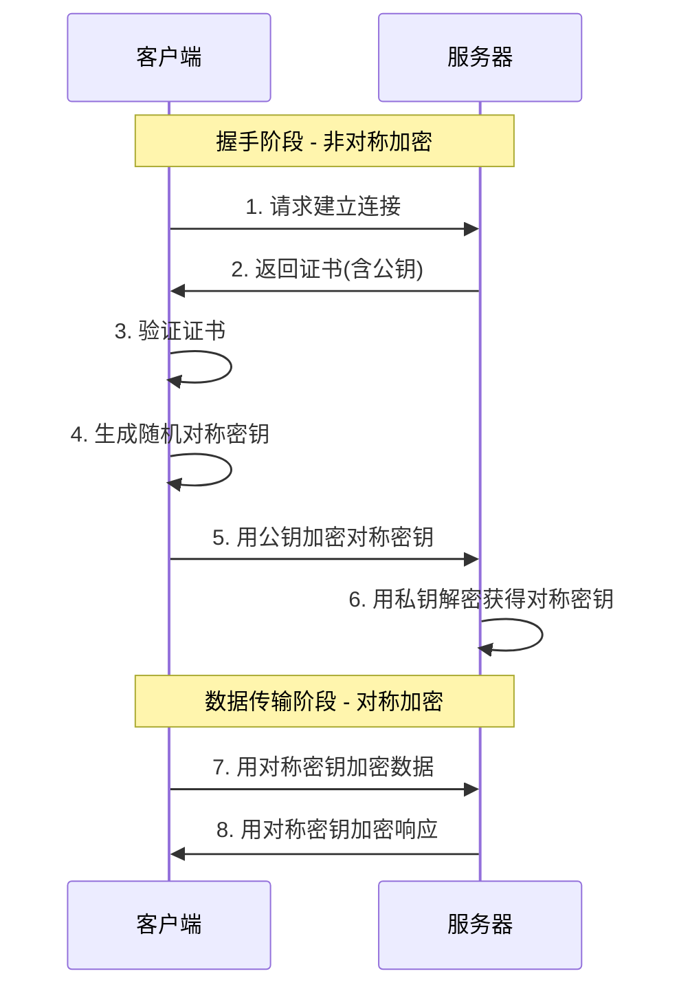

## 密码学基础概念

密码学是信息安全的核心技术之一，在数据保护、身份认证、安全通信等场景中发挥着关键作用。本文将系统介绍加密技术的核心概念和实践应用。

### 加密与签名的本质区别

在实际开发中，加密和签名常常一起使用，但二者的目的完全不同：



| 技术 | 核心目的 | 解决的问题 |
|------|---------|-----------|
| 加密 | 保护数据隐私性 | 即使数据泄露，攻击者也无法读取原文 |
| 签名 | 保证数据完整性和来源真实性 | 确保数据未被篡改，且确实来自声称的发送者 |

### 加密解密流程

加密是将明文转换为不可读密文的过程，解密则是逆向还原。根据密钥使用方式的不同，分为对称加密和非对称加密。

### 签名验签流程

签名使用发送方的私钥对数据摘要进行加密，接收方使用发送方的公钥解密验证。若验证通过，说明：

1. 数据确实来自私钥持有者（来源认证）
2. 数据传输过程中未被篡改（完整性保证）

## 对称加密技术

### 工作原理

对称加密使用同一把密钥进行加密和解密。就像一把钥匙既能锁门也能开门，发送方和接收方必须共享相同的密钥。



### 常见对称加密算法

| 算法 | 密钥长度 | 特点 | 应用场景 |
|------|---------|------|---------|
| AES | 128/192/256位 | 安全性高，性能优秀 | 文件加密、HTTPS |
| DES | 56位 | 已不安全，不推荐使用 | 历史遗留系统 |
| 3DES | 168位 | DES的增强版 | 金融系统 |
| SM4 | 128位 | 国密标准 | 国内金融、政务 |

### AES加密实现

```java
/**
 * AES加密工具类
 * 场景：用户敏感信息存储加密
 */
public class AesEncryptionUtil {
    
    private static final String ALGORITHM = "AES";
    private static final String TRANSFORMATION = "AES/GCM/NoPadding";
    private static final int GCM_IV_LENGTH = 12;
    private static final int GCM_TAG_LENGTH = 128;
    
    /**
     * 加密用户手机号等敏感信息
     */
    public static String encrypt(String plainText, SecretKey key) throws Exception {
        Cipher cipher = Cipher.getInstance(TRANSFORMATION);
        
        // 生成随机初始化向量
        byte[] iv = new byte[GCM_IV_LENGTH];
        SecureRandom random = new SecureRandom();
        random.nextBytes(iv);
        
        GCMParameterSpec parameterSpec = new GCMParameterSpec(GCM_TAG_LENGTH, iv);
        cipher.init(Cipher.ENCRYPT_MODE, key, parameterSpec);
        
        byte[] encrypted = cipher.doFinal(plainText.getBytes(StandardCharsets.UTF_8));
        
        // 将IV和密文拼接后进行Base64编码
        byte[] combined = new byte[iv.length + encrypted.length];
        System.arraycopy(iv, 0, combined, 0, iv.length);
        System.arraycopy(encrypted, 0, combined, iv.length, encrypted.length);
        
        return Base64.getEncoder().encodeToString(combined);
    }
    
    /**
     * 解密还原原始数据
     */
    public static String decrypt(String cipherText, SecretKey key) throws Exception {
        byte[] combined = Base64.getDecoder().decode(cipherText);
        
        // 提取IV和密文
        byte[] iv = Arrays.copyOfRange(combined, 0, GCM_IV_LENGTH);
        byte[] encrypted = Arrays.copyOfRange(combined, GCM_IV_LENGTH, combined.length);
        
        Cipher cipher = Cipher.getInstance(TRANSFORMATION);
        GCMParameterSpec parameterSpec = new GCMParameterSpec(GCM_TAG_LENGTH, iv);
        cipher.init(Cipher.DECRYPT_MODE, key, parameterSpec);
        
        byte[] decrypted = cipher.doFinal(encrypted);
        return new String(decrypted, StandardCharsets.UTF_8);
    }
    
    /**
     * 生成AES密钥
     */
    public static SecretKey generateKey(int keySize) throws Exception {
        KeyGenerator keyGen = KeyGenerator.getInstance(ALGORITHM);
        keyGen.init(keySize, new SecureRandom());
        return keyGen.generateKey();
    }
}
```

### 对称加密的优缺点

**优点：**
- 加解密速度快，适合大数据量加密
- 算法公开，实现简单

**缺点：**
- 密钥分发困难，双方需要安全地共享密钥
- 密钥数量膨胀，N个用户两两通信需要N*(N-1)/2个密钥

## 非对称加密技术

### 工作原理

非对称加密使用一对密钥：公钥和私钥。公钥可以公开分发，私钥必须保密。用公钥加密的数据只能用私钥解密，反之亦然。



### 常见非对称加密算法

| 算法 | 密钥长度 | 特点 | 应用场景 |
|------|---------|------|---------|
| RSA | 2048/3072/4096位 | 应用最广泛 | 数字证书、HTTPS |
| ECC | 256位 | 密钥短，安全性高 | 移动设备、物联网 |
| SM2 | 256位 | 国密标准，基于ECC | 国内电子认证 |

### RSA加密实现

```java
/**
 * RSA非对称加密工具类
 * 场景：跨系统安全数据传输
 */
public class RsaEncryptionUtil {
    
    private static final String ALGORITHM = "RSA";
    private static final String TRANSFORMATION = "RSA/ECB/OAEPWithSHA-256AndMGF1Padding";
    private static final int KEY_SIZE = 2048;
    
    /**
     * 生成密钥对
     */
    public static KeyPair generateKeyPair() throws Exception {
        KeyPairGenerator keyPairGen = KeyPairGenerator.getInstance(ALGORITHM);
        keyPairGen.initialize(KEY_SIZE, new SecureRandom());
        return keyPairGen.generateKeyPair();
    }
    
    /**
     * 公钥加密 - 用于加密发送给对方的数据
     */
    public static String encryptWithPublicKey(String plainText, PublicKey publicKey) 
            throws Exception {
        Cipher cipher = Cipher.getInstance(TRANSFORMATION);
        cipher.init(Cipher.ENCRYPT_MODE, publicKey);
        
        byte[] encrypted = cipher.doFinal(plainText.getBytes(StandardCharsets.UTF_8));
        return Base64.getEncoder().encodeToString(encrypted);
    }
    
    /**
     * 私钥解密 - 用于解密收到的加密数据
     */
    public static String decryptWithPrivateKey(String cipherText, PrivateKey privateKey) 
            throws Exception {
        Cipher cipher = Cipher.getInstance(TRANSFORMATION);
        cipher.init(Cipher.DECRYPT_MODE, privateKey);
        
        byte[] encrypted = Base64.getDecoder().decode(cipherText);
        byte[] decrypted = cipher.doFinal(encrypted);
        return new String(decrypted, StandardCharsets.UTF_8);
    }
}
```

## 数字签名技术

### 签名流程



### 签名验签实现

```java
/**
 * 数字签名工具类
 * 场景：支付回调接口验证请求来源
 */
public class DigitalSignatureUtil {
    
    private static final String SIGNATURE_ALGORITHM = "SHA256withRSA";
    
    /**
     * 生成签名
     * 用于发送请求时，对请求参数进行签名
     */
    public static String sign(String data, PrivateKey privateKey) throws Exception {
        Signature signature = Signature.getInstance(SIGNATURE_ALGORITHM);
        signature.initSign(privateKey);
        signature.update(data.getBytes(StandardCharsets.UTF_8));
        
        byte[] signatureBytes = signature.sign();
        return Base64.getEncoder().encodeToString(signatureBytes);
    }
    
    /**
     * 验证签名
     * 用于接收请求时，验证请求是否来自可信来源
     */
    public static boolean verify(String data, String signatureStr, PublicKey publicKey) 
            throws Exception {
        Signature signature = Signature.getInstance(SIGNATURE_ALGORITHM);
        signature.initVerify(publicKey);
        signature.update(data.getBytes(StandardCharsets.UTF_8));
        
        byte[] signatureBytes = Base64.getDecoder().decode(signatureStr);
        return signature.verify(signatureBytes);
    }
}

/**
 * 支付回调验签示例
 */
@RestController
@RequestMapping("/payment/callback")
public class PaymentCallbackController {
    
    @Autowired
    private PublicKey paymentPlatformPublicKey;
    
    @PostMapping
    public ResponseEntity<String> handleCallback(@RequestBody PaymentCallback callback) {
        // 按约定规则拼接待验签字符串
        String signContent = buildSignContent(callback);
        
        try {
            boolean verified = DigitalSignatureUtil.verify(
                signContent, 
                callback.getSign(), 
                paymentPlatformPublicKey
            );
            
            if (!verified) {
                return ResponseEntity.status(HttpStatus.FORBIDDEN)
                    .body("签名验证失败");
            }
            
            // 处理业务逻辑
            processPaymentResult(callback);
            return ResponseEntity.ok("success");
            
        } catch (Exception e) {
            return ResponseEntity.status(HttpStatus.INTERNAL_SERVER_ERROR)
                .body("验签异常");
        }
    }
}
```

## 散列算法

### 什么是哈希算法

哈希算法将任意长度的数据映射为固定长度的摘要值，具有以下特性：

- **单向性**：无法从摘要值反推原始数据
- **确定性**：相同输入必定产生相同输出
- **雪崩效应**：输入微小变化导致输出巨大差异
- **抗碰撞性**：难以找到两个不同输入产生相同输出

### 常见哈希算法对比



### 密码存储最佳实践

直接存储密码哈希值存在彩虹表攻击风险，应使用加盐哈希或专用密码哈希算法：

```java
/**
 * 密码加密工具类
 * 使用BCrypt算法，自动加盐
 */
public class PasswordEncryptionUtil {
    
    /**
     * 加密密码
     * 场景：用户注册时加密存储密码
     */
    public static String hashPassword(String rawPassword) {
        // cost因子12，平衡安全性和性能
        return BCrypt.hashpw(rawPassword, BCrypt.gensalt(12));
    }
    
    /**
     * 验证密码
     * 场景：用户登录时验证密码
     */
    public static boolean verifyPassword(String rawPassword, String hashedPassword) {
        return BCrypt.checkpw(rawPassword, hashedPassword);
    }
}

// 使用示例
@Service
public class UserAuthService {
    
    @Autowired
    private UserRepository userRepository;
    
    public void register(String username, String password) {
        User user = new User();
        user.setUsername(username);
        // 存储哈希后的密码
        user.setPassword(PasswordEncryptionUtil.hashPassword(password));
        userRepository.save(user);
    }
    
    public boolean login(String username, String password) {
        User user = userRepository.findByUsername(username);
        if (user == null) {
            return false;
        }
        // 验证密码
        return PasswordEncryptionUtil.verifyPassword(password, user.getPassword());
    }
}
```

## 国密算法体系

国密算法（SM系列）是中国国家密码管理局制定的商用密码算法标准，广泛应用于金融、政务、电信等领域。

### 国密算法概览



### 国密与国际算法对比

| 国密算法 | 对应国际算法 | 密钥长度 | 安全性评价 |
|---------|-------------|---------|-----------|
| SM2 | RSA/ECC | 256位 | SM2效率更高，密钥更短 |
| SM3 | SHA-256 | 256位 | 安全性相当 |
| SM4 | AES-128 | 128位 | 安全性相当 |

### 国密算法使用

使用Hutool工具库可以方便地使用国密算法：

```xml
<dependency>
    <groupId>cn.hutool</groupId>
    <artifactId>hutool-all</artifactId>
    <version>5.8.25</version>
</dependency>
<dependency>
    <groupId>org.bouncycastle</groupId>
    <artifactId>bcpkix-jdk18on</artifactId>
    <version>1.78.1</version>
</dependency>
```

```java
/**
 * 国密算法使用示例
 * 场景：银行系统数据加密与签名
 */
public class SmCryptoExample {
    
    /**
     * SM4对称加密 - 加密交易流水
     */
    public void sm4Example() {
        String transactionData = "用户A向用户B转账1000元";
        
        // 自动生成密钥
        SymmetricCrypto sm4 = SmUtil.sm4();
        
        // 加密
        String encrypted = sm4.encryptHex(transactionData);
        System.out.println("加密后: " + encrypted);
        
        // 解密
        String decrypted = sm4.decryptStr(encrypted, CharsetUtil.CHARSET_UTF_8);
        System.out.println("解密后: " + decrypted);
    }
    
    /**
     * SM2非对称加密 - 敏感信息传输
     */
    public void sm2Example() {
        String sensitiveInfo = "用户身份证号: 110101199001011234";
        
        SM2 sm2 = SmUtil.sm2();
        
        // 公钥加密
        String encrypted = sm2.encryptBcd(sensitiveInfo, KeyType.PublicKey);
        System.out.println("加密后: " + encrypted);
        
        // 私钥解密
        String decrypted = StrUtil.utf8Str(
            sm2.decryptFromBcd(encrypted, KeyType.PrivateKey)
        );
        System.out.println("解密后: " + decrypted);
    }
    
    /**
     * SM3哈希 - 文件完整性校验
     */
    public void sm3Example() {
        String fileContent = "重要合同文件内容...";
        
        // 计算哈希摘要
        String hash = SmUtil.sm3(fileContent);
        System.out.println("SM3摘要: " + hash);
        // 输出: 136ce3c86e4ed909b76082055a61586af20b4dab674732ebd4b599eef080c9be
    }
}
```

## 加密技术综合应用

### HTTPS通信中的加密流程

HTTPS结合了对称加密和非对称加密的优势：



### 安全通信最佳实践

1. **传输层**：始终使用HTTPS，配置TLS 1.2+
2. **数据层**：敏感数据二次加密存储
3. **密钥管理**：使用专业的密钥管理系统（KMS）
4. **算法选择**：政务、金融系统优先使用国密算法
5. **定期更新**：定期更换密钥，淘汰不安全算法
