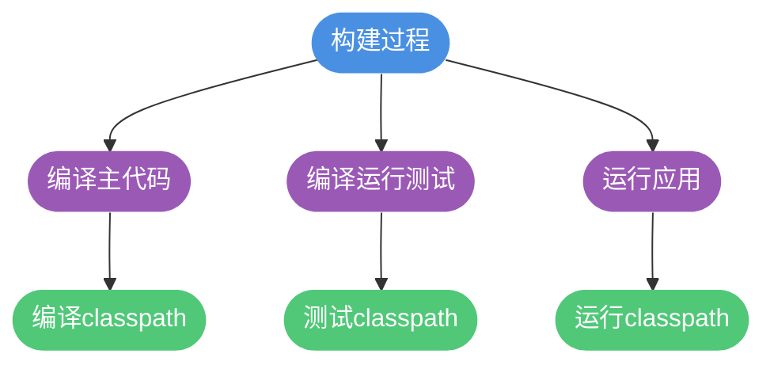
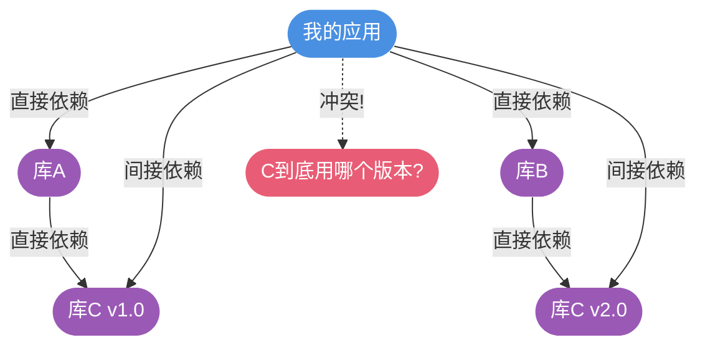
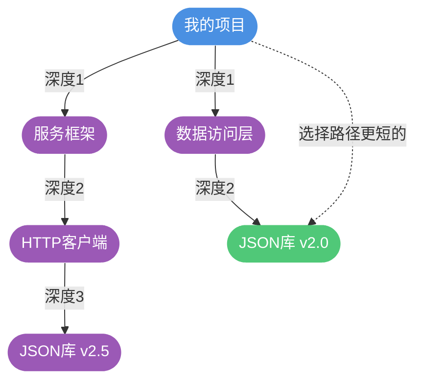
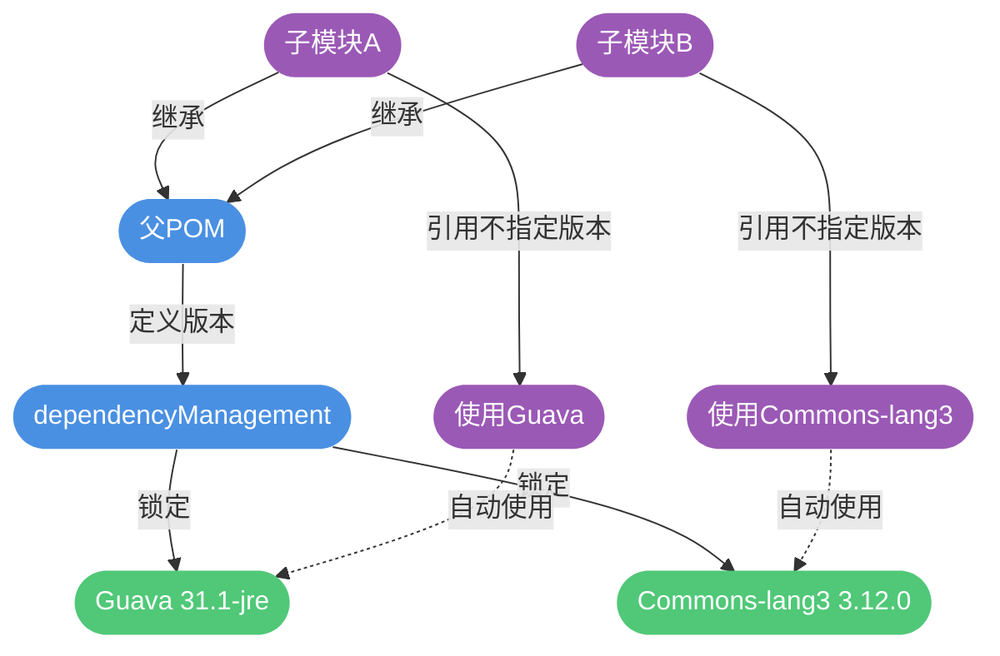

# Maven依赖管理与冲突解决

## 依赖配置详解

在Maven项目中，当我们需要使用第三方库时，不需要手动下载JAR文件，只需在`pom.xml`中声明依赖坐标，Maven会自动从仓库下载并管理这些依赖。

### 依赖声明语法

```xml
<project>
    <dependencies>
        <dependency>
            <groupId>org.springframework.boot</groupId>
            <artifactId>spring-boot-starter-web</artifactId>
            <version>2.7.8</version>
            <type>jar</type>
            <scope>compile</scope>
            <optional>false</optional>
            <exclusions>
                <exclusion>
                    <groupId>org.springframework.boot</groupId>
                    <artifactId>spring-boot-starter-logging</artifactId>
                </exclusion>
            </exclusions>
        </dependency>
    </dependencies>
</project>
```

### 配置元素说明

- **dependencies**：依赖管理的根标签，一个pom.xml中只能有一个
- **dependency**：单个依赖声明，可以有多个
- **groupId、artifactId、version**（必需）：依赖的基本坐标，Maven根据这三要素定位构件
- **type**（可选）：依赖的类型，默认为jar，通常无需声明
- **scope**（可选）：依赖的作用范围，默认为compile
- **optional**（可选）：标记依赖是否可选，默认为false
- **exclusions**（可选）：排除传递性依赖，用于解决依赖冲突

## 依赖范围（Scope）

Maven在不同构建阶段使用不同的classpath（类路径），依赖范围控制依赖在哪些classpath中有效。

### 三种 Classpath



### 五种依赖范围

**compile（编译范围）**
- 默认范围，对所有classpath有效
- 典型示例：业务逻辑用到的核心库

```xml
<dependency>
    <groupId>com.google.guava</groupId>
    <artifactId>guava</artifactId>
    <version>31.1-jre</version>
    <scope>compile</scope>
</dependency>
```

**test（测试范围）**
- 仅对测试classpath有效
- 编译主代码和运行应用时不可用
- 典型示例：JUnit、Mockito等测试框架

```xml
<dependency>
    <groupId>org.junit.jupiter</groupId>
    <artifactId>junit-jupiter</artifactId>
    <version>5.9.2</version>
    <scope>test</scope>
</dependency>
```

**provided（已提供范围）**
- 对编译和测试classpath有效，运行时无效
- 表示运行环境会提供该依赖
- 典型示例：Servlet API（Tomcat容器已提供）

```xml
<dependency>
    <groupId>javax.servlet</groupId>
    <artifactId>javax.servlet-api</artifactId>
    <version>4.0.1</version>
    <scope>provided</scope>
</dependency>
```

**runtime（运行时范围）**
- 对测试和运行classpath有效，编译主代码时无效
- 典型示例：数据库驱动（编译时只需JDBC接口，运行时需要具体实现）

```xml
<dependency>
    <groupId>mysql</groupId>
    <artifactId>mysql-connector-java</artifactId>
    <version>8.0.32</version>
    <scope>runtime</scope>
</dependency>
```

**system（系统范围）**
- 类似provided，但必须通过systemPath显式指定JAR文件路径
- 不推荐使用，会破坏项目的可移植性

### 范围对比表

| 范围 | 编译有效 | 测试有效 | 运行有效 | 示例 |
|------|----------|----------|----------|------|
| compile | ✓ | ✓ | ✓ | Spring、MyBatis |
| test | ✗ | ✓ | ✗ | JUnit、Mockito |
| provided | ✓ | ✓ | ✗ | Servlet API、Lombok |
| runtime | ✗ | ✓ | ✓ | JDBC驱动、日志实现 |
| system | ✓ | ✓ | ✗ | 本地JAR（不推荐） |

## 依赖传递机制

Maven支持依赖的传递性（Transitive Dependency），即如果项目A依赖B，B依赖C，那么A会自动获得对C的依赖。这个特性大大简化了依赖管理，但也可能引发冲突。



### 依赖冲突场景

在实际开发中，依赖冲突主要有两种情况：

**场景一：同一POM中重复声明**

```xml
<dependencies>
    <dependency>
        <groupId>com.example</groupId>
        <artifactId>common-utils</artifactId>
        <version>1.0.0</version>
    </dependency>
    <!-- Maven只会使用后声明的版本 -->
    <dependency>
        <groupId>com.example</groupId>
        <artifactId>common-utils</artifactId>
        <version>2.0.0</version>
    </dependency>
</dependencies>
```

对于相同的groupId和artifactId，Maven只会保留一个版本，后声明的会覆盖先声明的。

**场景二：传递依赖冲突**

这是更常见也更复杂的情况：

```plaintext
项目A依赖关系：
├── 框架X v3.0
│   └── 工具库Y v1.5
└── 框架Z v2.0
    └── 工具库Y v1.0
```

此时项目A通过两条路径间接依赖了工具库Y的不同版本，Maven需要决定使用哪个版本。

## Maven 依赖调解原则

当出现依赖冲突时，Maven会自动进行依赖调解（Dependency Mediation），遵循两大原则：

### 原则一：最短路径优先

Maven会选择依赖路径最短的版本。

```plaintext
路径分析：
路径1: 我的项目 → 服务框架 → HTTP客户端 → JSON库 v2.5  (深度=3)
路径2: 我的项目 → 数据访问层 → JSON库 v2.0          (深度=2)

结果: 选择 JSON库 v2.0（路径更短）
```



### 原则二：最先声明优先

当依赖路径长度相等时，在pom.xml中最先声明的依赖优先。

```xml
<dependencies>
    <!-- 第一个声明的依赖 -->
    <dependency>
        <groupId>com.example</groupId>
        <artifactId>framework-a</artifactId>
        <version>1.0</version>
        <!-- 传递依赖 commons-lang v3.0 -->
    </dependency>
    
    <!-- 第二个声明的依赖 -->
    <dependency>
        <groupId>com.example</groupId>
        <artifactId>framework-b</artifactId>
        <version>2.0</version>
        <!-- 传递依赖 commons-lang v2.5 -->
    </dependency>
</dependencies>
```

在上述例子中，如果两个框架的依赖路径深度相同，Maven会选择commons-lang v3.0，因为framework-a最先声明。

## 依赖冲突的问题表现

依赖冲突如果处理不当，会导致运行时错误，常见的错误类型有：

### NoSuchMethodError

当Maven选择了低版本的库，而代码中使用了高版本才有的方法时：

```plaintext
场景：
应用依赖: 业务模块 → 工具类库 v1.5（有processData(String, int)方法）
间接依赖: 老框架 → 工具类库 v1.0（只有processData(String)方法）

Maven选择了v1.0（路径更短）
运行时调用processData(String, int) → 抛出NoSuchMethodError
```

### ClassNotFoundException

当Maven选择的版本中不存在某个类：

```plaintext
场景：
代码导入: import com.example.utils.NewFeatureHelper;
NewFeatureHelper类只在v2.0+版本存在

Maven选择了v1.8（声明顺序优先）
运行时 → 抛出ClassNotFoundException
```

### 查看依赖树

使用Maven命令查看完整的依赖关系树：

```bash
mvn dependency:tree
```

输出示例：

```plaintext
[INFO] com.example:my-project:jar:1.0.0
[INFO] +- org.springframework.boot:spring-boot-starter-web:jar:2.7.8
[INFO] |  +- org.springframework.boot:spring-boot-starter:jar:2.7.8
[INFO] |  \- org.springframework:spring-web:jar:5.3.25
[INFO] +- com.alibaba:fastjson:jar:1.2.83
[INFO] \- commons-lang:commons-lang:jar:2.6
```

在IDEA中，也可以安装**Maven Helper**插件，通过图形界面直观地查看和解决依赖冲突。

## 手动解决依赖冲突

当自动调解的结果不符合预期时，需要手动干预。

### 方法一：排除依赖

使用`<exclusions>`标签排除不需要的传递依赖：

```xml
<dependency>
    <groupId>com.example</groupId>
    <artifactId>old-framework</artifactId>
    <version>1.0</version>
    <exclusions>
        <exclusion>
            <!-- 排除old-framework传递进来的旧版本 -->
            <groupId>commons-io</groupId>
            <artifactId>commons-io</artifactId>
        </exclusion>
    </exclusions>
</dependency>

<!-- 然后显式引入需要的版本 -->
<dependency>
    <groupId>commons-io</groupId>
    <artifactId>commons-io</artifactId>
    <version>2.11.0</version>
</dependency>
```

实际案例：排除Spring Boot默认的Logback，使用Log4j2

```xml
<dependency>
    <groupId>org.springframework.boot</groupId>
    <artifactId>spring-boot-starter-web</artifactId>
    <exclusions>
        <exclusion>
            <groupId>org.springframework.boot</groupId>
            <artifactId>spring-boot-starter-logging</artifactId>
        </exclusion>
    </exclusions>
</dependency>

<dependency>
    <groupId>org.springframework.boot</groupId>
    <artifactId>spring-boot-starter-log4j2</artifactId>
</dependency>
```

### 方法二：版本锁定

在多模块项目中，使用`<dependencyManagement>`统一管理版本：

```xml
<!-- 父POM中锁定版本 -->
<dependencyManagement>
    <dependencies>
        <dependency>
            <groupId>com.google.guava</groupId>
            <artifactId>guava</artifactId>
            <version>31.1-jre</version>
        </dependency>
        <dependency>
            <groupId>org.apache.commons</groupId>
            <artifactId>commons-lang3</artifactId>
            <version>3.12.0</version>
        </dependency>
    </dependencies>
</dependencyManagement>
```

子模块中引用时无需指定版本：

```xml
<!-- 子模块POM -->
<dependencies>
    <dependency>
        <groupId>com.google.guava</groupId>
        <artifactId>guava</artifactId>
        <!-- 版本继承自父POM -->
    </dependency>
</dependencies>
```

`<dependencyManagement>`的作用：
- 统一管理依赖版本，避免版本不一致
- 只声明版本，不实际引入依赖（需要在`<dependencies>`中引用）
- 优先级最高，会覆盖传递依赖的版本



### 最佳实践建议

**优先保留高版本**
- 大多数库升级时会保持向下兼容
- 高版本通常修复了低版本的bug
- 但需注意破坏性变更（Breaking Changes）

**升级上层依赖**

如果高版本库不兼容低版本：

```plaintext
当前状态:
项目 → 旧框架v1.0 → 工具库v1.0
项目 → 新模块 → 工具库v2.0（不兼容v1.0）

解决方案:
检查旧框架是否有新版本支持工具库v2.0
升级旧框架到v2.0，彻底解决兼容性问题
```

**定期检查依赖**

使用Maven插件检查过期依赖：

```bash
mvn versions:display-dependency-updates
```

这会列出所有可升级的依赖及其最新版本，帮助保持项目依赖的健康状态。
