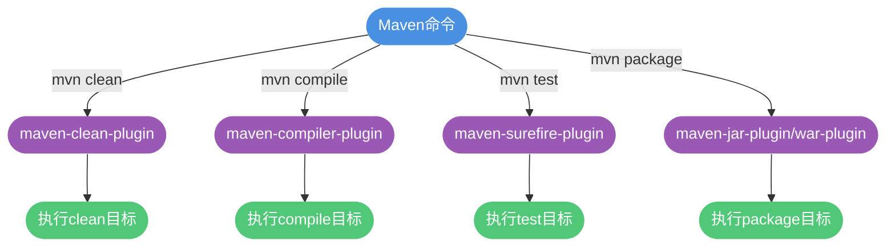
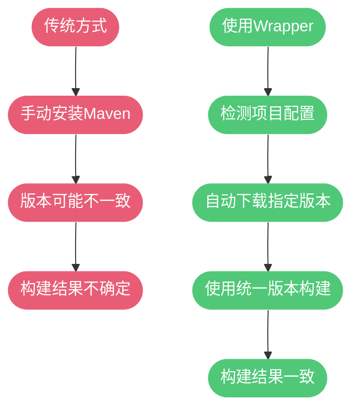
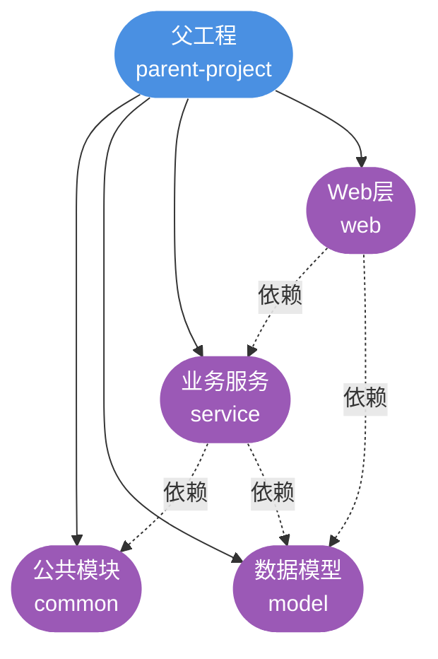

# Maven插件系统与开发实践

## Maven 插件机制

Maven的核心理念是"约定优于配置"，而其强大功能的实现本质上依赖于插件体系。**Maven本身是一个插件执行框架**，所有的构建任务，如编译、测试、打包、部署等，都是由一个个插件完成的。

### 插件的本质

我们日常使用的Maven命令，底层都对应着具体的插件目标（Plugin Goal）：

```bash
mvn clean      # 调用 maven-clean-plugin 的 clean 目标
mvn compile    # 调用 maven-compiler-plugin 的 compile 目标
mvn test       # 调用 maven-surefire-plugin 的 test 目标
mvn package    # 调用 maven-jar-plugin 或 maven-war-plugin
mvn install    # 调用 maven-install-plugin 的 install 目标
mvn deploy     # 调用 maven-deploy-plugin 的 deploy 目标
```



### 插件分类

Maven插件分为两大类：

**构建插件（Build Plugins）**
- 在构建过程中执行
- 配置在`<build><plugins>`中
- 示例：编译插件、测试插件、打包插件

**报告插件（Reporting Plugins）**
- 在站点生成过程中执行
- 配置在`<reporting><plugins>`中
- 示例：Javadoc插件、代码覆盖率报告插件

### 核心插件位置

Maven默认插件存储在本地仓库中：

```bash
${user.home}/.m2/repository/org/apache/maven/plugins/
```

可以在此目录下看到已下载的各类插件，如：
- maven-compiler-plugin
- maven-surefire-plugin
- maven-jar-plugin
- maven-war-plugin
- ...

## 常用 Maven 核心插件

### maven-compiler-plugin（编译插件）

控制Java源代码的编译行为，最常见的配置是指定Java版本。

```xml
<build>
    <plugins>
        <plugin>
            <groupId>org.apache.maven.plugins</groupId>
            <artifactId>maven-compiler-plugin</artifactId>
            <version>3.11.0</version>
            <configuration>
                <source>17</source>
                <target>17</target>
                <encoding>UTF-8</encoding>
            </configuration>
        </plugin>
    </plugins>
</build>
```

配置说明：
- `<source>`：指定源代码使用的Java版本
- `<target>`：指定编译后的字节码版本
- `<encoding>`：指定源文件编码，避免中文乱码

### maven-surefire-plugin（单元测试插件）

负责执行单元测试，自动识别测试类并运行。

```xml
<plugin>
    <groupId>org.apache.maven.plugins</groupId>
    <artifactId>maven-surefire-plugin</artifactId>
    <version>3.0.0</version>
    <configuration>
        <!-- 跳过测试 -->
        <skip>false</skip>
        <!-- 测试失败后继续构建 -->
        <testFailureIgnore>false</testFailureIgnore>
        <!-- 指定测试类 -->
        <includes>
            <include>**/*Test.java</include>
            <include>**/*Tests.java</include>
        </includes>
    </configuration>
</plugin>
```

临时跳过测试的命令：

```bash
mvn clean package -DskipTests        # 跳过测试执行
mvn clean package -Dmaven.test.skip=true  # 跳过测试编译和执行
```

### maven-failsafe-plugin（集成测试插件）

专门用于运行集成测试，与surefire的区别在于：
- Surefire用于单元测试，在package之前运行
- Failsafe用于集成测试，在package之后运行

```xml
<plugin>
    <groupId>org.apache.maven.plugins</groupId>
    <artifactId>maven-failsafe-plugin</artifactId>
    <version>3.0.0</version>
    <executions>
        <execution>
            <goals>
                <goal>integration-test</goal>
                <goal>verify</goal>
            </goals>
        </execution>
    </executions>
</plugin>
```

集成测试类命名规范：
- `*IT.java`
- `IT*.java`
- `*ITCase.java`

### maven-javadoc-plugin（文档生成插件）

自动生成API文档：

```xml
<plugin>
    <groupId>org.apache.maven.plugins</groupId>
    <artifactId>maven-javadoc-plugin</artifactId>
    <version>3.5.0</version>
    <configuration>
        <charset>UTF-8</charset>
        <encoding>UTF-8</encoding>
    </configuration>
    <executions>
        <execution>
            <phase>package</phase>
            <goals>
                <goal>jar</goal>
            </goals>
        </execution>
    </executions>
</plugin>
```

生成文档命令：

```bash
mvn javadoc:javadoc      # 生成HTML文档
mvn javadoc:jar          # 打包为JAR文件
```

## 第三方优秀插件

### jacoco-maven-plugin（代码覆盖率）

统计单元测试的代码覆盖率，生成详细报告。

```xml
<plugin>
    <groupId>org.jacoco</groupId>
    <artifactId>jacoco-maven-plugin</artifactId>
    <version>0.8.10</version>
    <executions>
        <!-- 测试前准备代理 -->
        <execution>
            <id>prepare-agent</id>
            <goals>
                <goal>prepare-agent</goal>
            </goals>
        </execution>
        <!-- 测试后生成报告 -->
        <execution>
            <id>report</id>
            <phase>test</phase>
            <goals>
                <goal>report</goal>
            </goals>
        </execution>
        <!-- 检查覆盖率是否达标 -->
        <execution>
            <id>check</id>
            <goals>
                <goal>check</goal>
            </goals>
            <configuration>
                <rules>
                    <rule>
                        <element>BUNDLE</element>
                        <limits>
                            <limit>
                                <counter>LINE</counter>
                                <value>COVEREDRATIO</value>
                                <minimum>0.80</minimum>
                            </limit>
                        </limits>
                    </rule>
                </rules>
            </configuration>
        </execution>
    </executions>
</plugin>
```

运行后会在`target/site/jacoco/index.html`生成可视化报告。

### maven-checkstyle-plugin（代码规范检查）

强制执行代码风格规范，确保团队代码一致性。

```xml
<plugin>
    <groupId>org.apache.maven.plugins</groupId>
    <artifactId>maven-checkstyle-plugin</artifactId>
    <version>3.3.0</version>
    <configuration>
        <configLocation>checkstyle.xml</configLocation>
        <encoding>UTF-8</encoding>
        <consoleOutput>true</consoleOutput>
        <failsOnError>true</failsOnError>
    </configuration>
    <executions>
        <execution>
            <phase>validate</phase>
            <goals>
                <goal>check</goal>
            </goals>
        </execution>
    </executions>
</plugin>
```

可以使用Google或Sun的标准规范，也可以自定义规则。

### sonar-maven-plugin（代码质量分析）

集成SonarQube进行深度代码质量分析：

```xml
<plugin>
    <groupId>org.sonarsource.scanner.maven</groupId>
    <artifactId>sonar-maven-plugin</artifactId>
    <version>3.9.1.2184</version>
</plugin>
```

执行分析：

```bash
mvn clean verify sonar:sonar \
  -Dsonar.projectKey=my-project \
  -Dsonar.host.url=http://localhost:9000 \
  -Dsonar.login=your-token
```

SonarQube能检测：
- 代码异味（Code Smells）
- 潜在Bug
- 安全漏洞
- 代码重复率
- 复杂度指标

## Maven Wrapper（构建一致性工具）

### 问题背景

团队开发中常遇到的问题：
- 新成员本地没有安装Maven
- 不同成员的Maven版本不一致
- CI/CD环境中Maven版本难以统一

### Maven Wrapper 解决方案

Maven Wrapper允许项目绑定特定的Maven版本，无需预先安装Maven即可构建项目。



### 安装 Maven Wrapper

在现有项目中添加Wrapper：

```bash
mvn wrapper:wrapper
```

执行后会生成以下文件：

```plaintext
project-root/
├── .mvn/
│   └── wrapper/
│       ├── maven-wrapper.jar
│       └── maven-wrapper.properties
├── mvnw           # Linux/Mac 执行脚本
├── mvnw.cmd       # Windows 执行脚本
└── pom.xml
```

### 使用 Maven Wrapper

使用`mvnw`替代`mvn`命令：

```bash
# Linux/Mac
./mvnw clean install

# Windows
mvnw.cmd clean install
```

第一次执行时，Wrapper会自动下载指定版本的Maven并缓存，后续使用时直接调用。

### 指定 Maven 版本

编辑`.mvn/wrapper/maven-wrapper.properties`：

```properties
distributionUrl=https://repo.maven.apache.org/maven2/org/apache/maven/apache-maven/3.9.3/apache-maven-3.9.3-bin.zip
```

或在生成Wrapper时指定版本：

```bash
mvn wrapper:wrapper -Dmaven=3.9.3
```

## 多环境配置管理（Profile）

### Profile 的作用

实际项目通常有多套运行环境：
- 开发环境（development）
- 测试环境（testing）
- 生产环境（production）

不同环境的配置各不相同（数据库地址、日志级别等），Profile机制可以为每个环境定制构建配置。

### 定义 Profile

```xml
<profiles>
    <!-- 开发环境 -->
    <profile>
        <id>dev</id>
        <activation>
            <activeByDefault>true</activeByDefault>
        </activation>
        <properties>
            <environment>development</environment>
            <db.url>jdbc:mysql://localhost:3306/dev_db</db.url>
            <log.level>DEBUG</log.level>
        </properties>
    </profile>
    
    <!-- 生产环境 -->
    <profile>
        <id>prod</id>
        <properties>
            <environment>production</environment>
            <db.url>jdbc:mysql://prod-server:3306/prod_db</db.url>
            <log.level>WARN</log.level>
        </properties>
    </profile>
</profiles>
```

### 激活 Profile

**命令行激活**：

```bash
mvn clean package -P prod
```

**默认激活**：

```xml
<activation>
    <activeByDefault>true</activeByDefault>
</activation>
```

**按条件激活**：

```xml
<activation>
    <jdk>17</jdk>
    <os>
        <name>Windows 10</name>
    </os>
    <property>
        <name>env</name>
        <value>prod</value>
    </property>
</activation>
```

### 资源过滤

配合资源过滤，将Profile中的属性注入到配置文件中：

```xml
<build>
    <resources>
        <resource>
            <directory>src/main/resources</directory>
            <filtering>true</filtering>
        </resource>
    </resources>
</build>
```

配置文件`application.properties`中使用变量：

```properties
spring.datasource.url=${db.url}
logging.level.root=${log.level}
environment=${environment}
```

构建时，Maven会将`${}`占位符替换为Profile中定义的实际值。

## 多模块项目管理

### 多模块的优势

大型项目拆分成多个模块带来的好处：

- **降低耦合**：从类级别的耦合提升到模块级别
- **提高复用**：公共模块可被多个项目使用
- **清晰边界**：模块职责明确，易于维护
- **并行开发**：不同团队负责不同模块，互不干扰
- **独立部署**：可以单独部署某些模块



### 多模块项目结构

```plaintext
parent-project/
├── pom.xml                 # 父POM
├── common-module/          # 公共工具模块
│   ├── src/
│   └── pom.xml
├── domain-module/          # 领域模型模块
│   ├── src/
│   └── pom.xml
├── service-module/         # 业务服务模块
│   ├── src/
│   └── pom.xml
└── web-module/             # Web应用模块
    ├── src/
    └── pom.xml
```

### 父 POM 配置

```xml
<project>
    <groupId>com.example</groupId>
    <artifactId>parent-project</artifactId>
    <version>1.0.0</version>
    <packaging>pom</packaging>
    
    <!-- 声明子模块 -->
    <modules>
        <module>common-module</module>
        <module>domain-module</module>
        <module>service-module</module>
        <module>web-module</module>
    </modules>
    
    <!-- 统一管理依赖版本 -->
    <dependencyManagement>
        <dependencies>
            <dependency>
                <groupId>org.springframework.boot</groupId>
                <artifactId>spring-boot-dependencies</artifactId>
                <version>2.7.14</version>
                <type>pom</type>
                <scope>import</scope>
            </dependency>
        </dependencies>
    </dependencyManagement>
    
    <!-- 统一插件配置 -->
    <build>
        <pluginManagement>
            <plugins>
                <plugin>
                    <groupId>org.apache.maven.plugins</groupId>
                    <artifactId>maven-compiler-plugin</artifactId>
                    <version>3.11.0</version>
                    <configuration>
                        <source>17</source>
                        <target>17</target>
                    </configuration>
                </plugin>
            </plugins>
        </pluginManagement>
    </build>
</project>
```

关键点：
- `<packaging>pom</packaging>`：父模块必须使用pom打包类型
- `<modules>`：列出所有子模块
- `<dependencyManagement>`：统一版本，不实际引入
- `<pluginManagement>`：统一插件配置

### 子模块 POM

```xml
<project>
    <!-- 继承父POM -->
    <parent>
        <groupId>com.example</groupId>
        <artifactId>parent-project</artifactId>
        <version>1.0.0</version>
    </parent>
    
    <artifactId>service-module</artifactId>
    
    <dependencies>
        <!-- 依赖同项目其他模块 -->
        <dependency>
            <groupId>com.example</groupId>
            <artifactId>common-module</artifactId>
            <version>${project.version}</version>
        </dependency>
        
        <!-- 依赖外部库（版本继承自父POM） -->
        <dependency>
            <groupId>org.springframework.boot</groupId>
            <artifactId>spring-boot-starter-web</artifactId>
        </dependency>
    </dependencies>
</project>
```

### 构建多模块项目

在父项目根目录执行：

```bash
mvn clean install
```

Maven会自动按依赖顺序构建所有模块。

## 持续集成最佳实践

### GitHub Actions 配置示例

```yaml
name: Maven Build

on:
  push:
    branches: [ main, develop ]
  pull_request:
    branches: [ main ]

jobs:
  build:
    runs-on: ubuntu-latest
    
    steps:
    - name: 检出代码
      uses: actions/checkout@v3
    
    - name: 设置JDK 17
      uses: actions/setup-java@v3
      with:
        java-version: '17'
        distribution: 'temurin'
        cache: 'maven'
    
    - name: 构建项目
      run: ./mvnw clean verify
    
    - name: 上传测试报告
      if: always()
      uses: actions/upload-artifact@v3
      with:
        name: test-reports
        path: target/surefire-reports/
    
    - name: 上传覆盖率报告
      uses: codecov/codecov-action@v3
      with:
        files: target/site/jacoco/jacoco.xml
```

### POM 文件组织规范

保持`pom.xml`整洁易读的建议：

**使用属性集中管理版本**：

```xml
<properties>
    <!-- Java版本 -->
    <java.version>17</java.version>
    <maven.compiler.source>${java.version}</maven.compiler.source>
    <maven.compiler.target>${java.version}</maven.compiler.target>
    
    <!-- 依赖版本 -->
    <spring-boot.version>2.7.14</spring-boot.version>
    <mybatis.version>3.5.13</mybatis.version>
    <lombok.version>1.18.28</lombok.version>
    
    <!-- 编码 -->
    <project.build.sourceEncoding>UTF-8</project.build.sourceEncoding>
</properties>
```

**分组组织依赖**：

```xml
<dependencies>
    <!-- Spring Boot 核心 -->
    <dependency>...</dependency>
    <dependency>...</dependency>
    
    <!-- 数据访问 -->
    <dependency>...</dependency>
    <dependency>...</dependency>
    
    <!-- 工具类库 -->
    <dependency>...</dependency>
    
    <!-- 测试依赖 -->
    <dependency>...</dependency>
</dependencies>
```

**添加注释说明**：

```xml
<!-- 排除Logback，使用Log4j2 -->
<exclusions>
    <exclusion>
        <groupId>org.springframework.boot</groupId>
        <artifactId>spring-boot-starter-logging</artifactId>
    </exclusion>
</exclusions>
```

## 常用命令速查

```bash
# 清理构建目录
mvn clean

# 编译主代码
mvn compile

# 编译并运行测试
mvn test

# 打包（跳过测试）
mvn package -DskipTests

# 安装到本地仓库
mvn install

# 查看依赖树
mvn dependency:tree

# 查看有效POM（包含继承和插值）
mvn help:effective-pom

# 分析依赖
mvn dependency:analyze

# 下载源码
mvn dependency:sources

# 下载Javadoc
mvn dependency:resolve -Dclassifier=javadoc

# 清理并重新构建
mvn clean install -U

# 指定配置文件构建
mvn clean package -P prod
```

通过合理使用Maven的插件和特性，可以大幅提升项目构建的自动化程度和团队协作效率。
